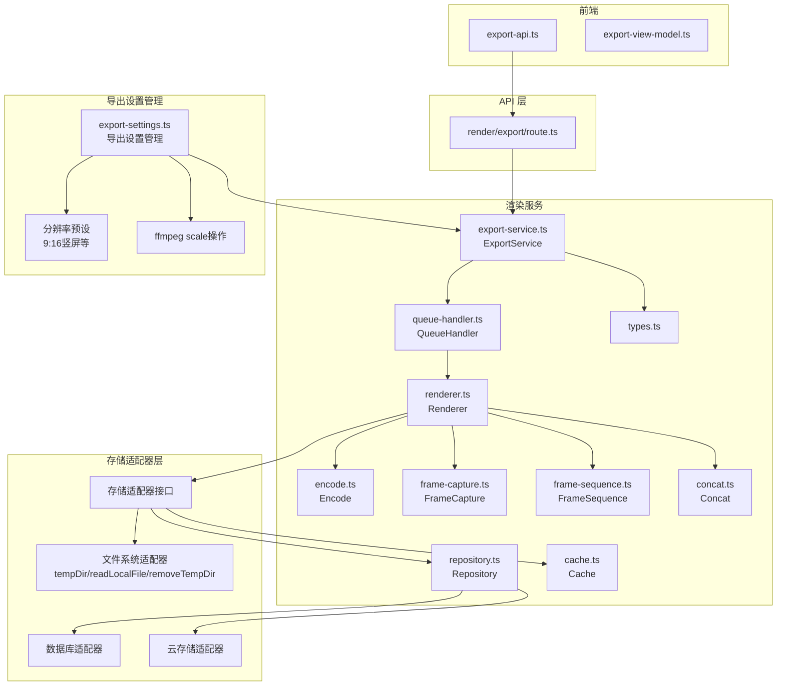
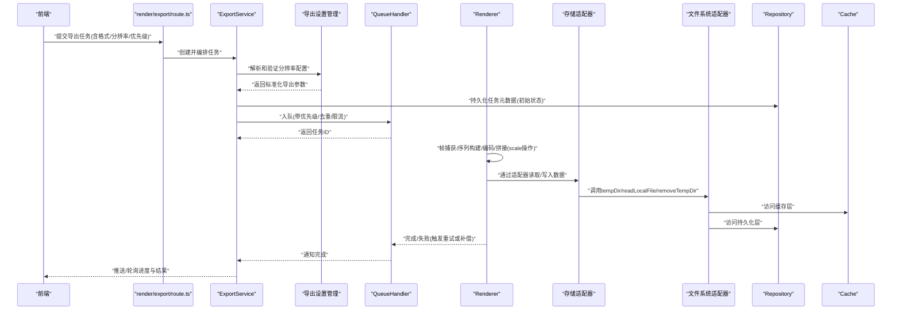
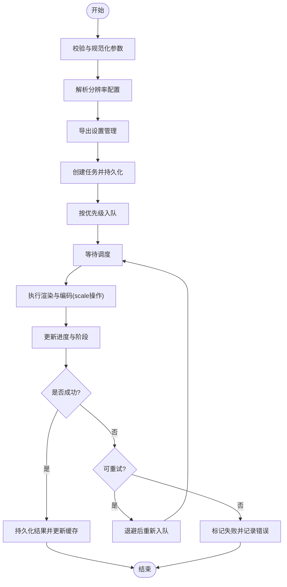
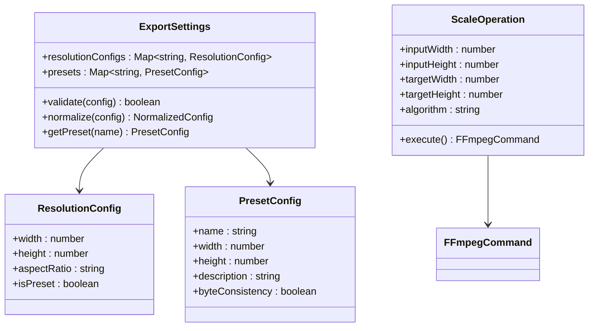
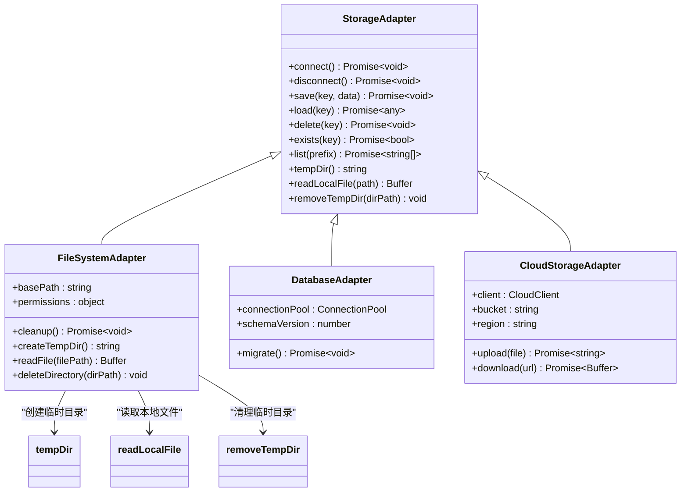
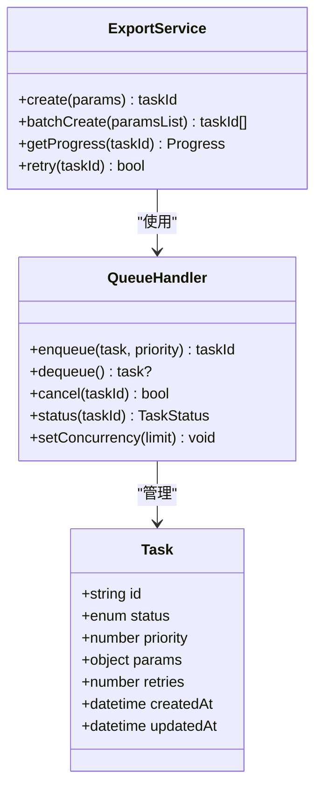
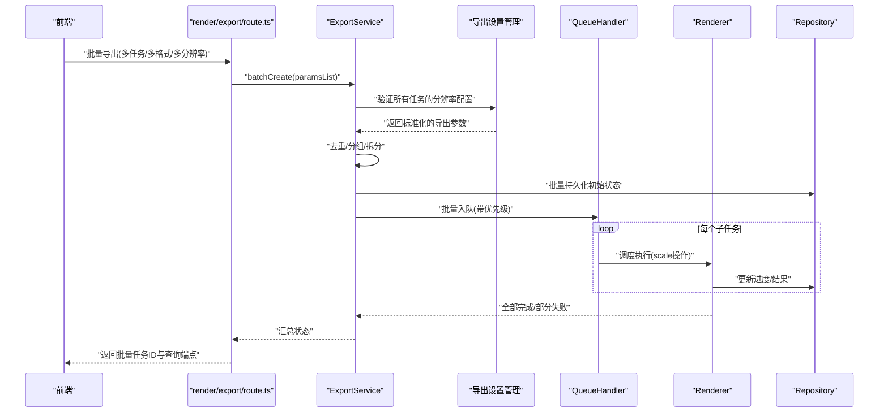
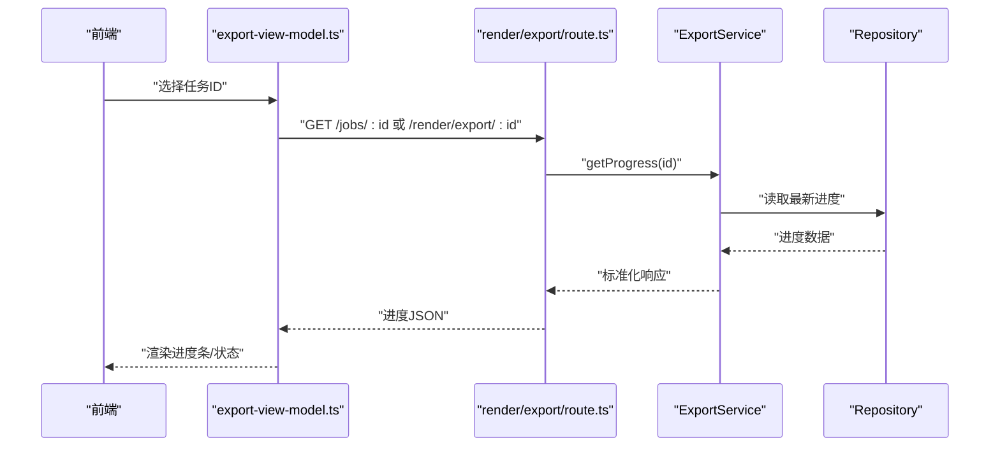
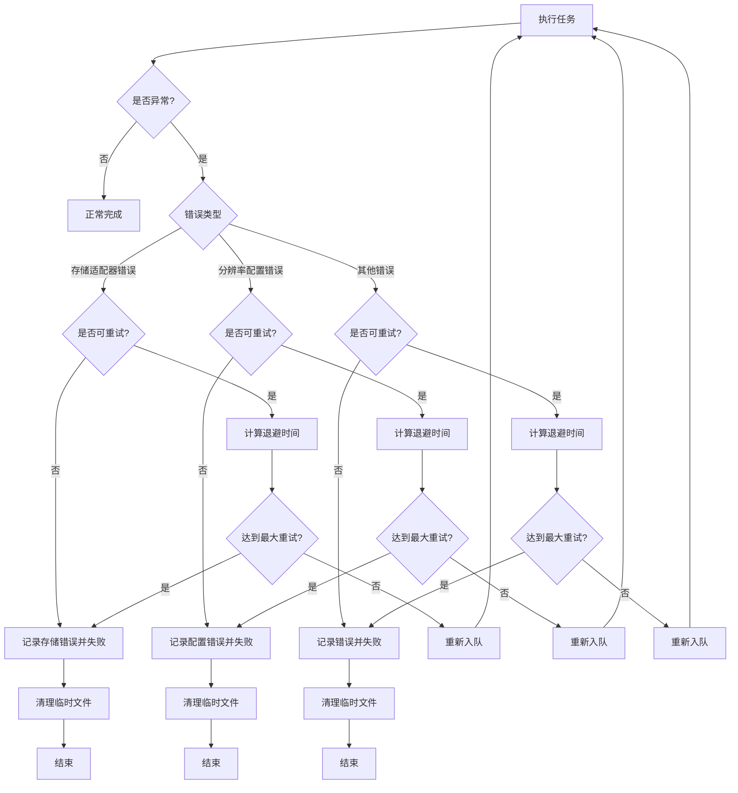
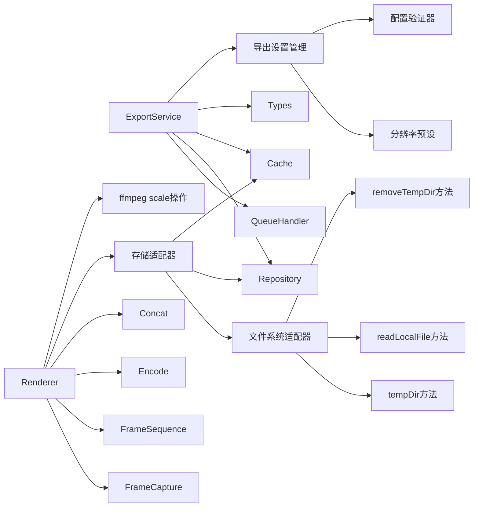

# 导出服务

<cite>
**本文引用的文件**   
- [src/features/render/export-service.ts](file://src/features/render/export-service.ts)
- [src/features/render/queue-handler.ts](file://src/features/render/queue-handler.ts)
- [src/app/api/render/export/route.ts](file://src/app/api/render/export/route.ts)
- [src/app/canvas/export/export-api.ts](file://src/app/canvas/export/export-api.ts)
- [src/app/canvas/export/export-view-model.ts](file://src/app/canvas/export/export-view-model.ts)
- [src/features/render/renderer.ts](file://src/features/render/renderer.ts)
- [src/features/render/types.ts](file://src/features/render/types.ts)
- [src/features/render/repository.ts](file://src/features/render/repository.ts)
- [src/features/render/cache.ts](file://src/features/render/cache.ts)
- [src/features/render/encode.ts](file://src/features/render/encode.ts)
- [src/features/render/frame-capture.ts](file://src/features/render/frame-capture.ts)
- [src/features/render/frame-sequence.ts](file://src/features/render/frame-sequence.ts)
- [src/features/render/concat.ts](file://src/features/render/concat.ts)
- [src/features/canvas/export-settings.ts](file://src/features/canvas/export-settings.ts)
</cite>

## 更新摘要
**变更内容**   
- 新增可配置导出分辨率功能，支持9:16竖屏比例预设和自定义分辨率设置
- 实现导出设置管理系统，提供统一的分辨率配置接口
- 集成ffmpeg scale操作支持，实现灵活的输出分辨率调整
- 保持默认预设的字节一致性，确保向后兼容性
- 增强导出参数验证和规范化处理

## 目录
1. [简介](#简介)
2. [项目结构](#项目结构)
3. [核心组件](#核心组件)
4. [架构总览](#架构总览)
5. [详细组件分析](#详细组件分析)
6. [依赖关系分析](#依赖关系分析)
7. [性能考虑](#性能考虑)
8. [故障排查指南](#故障排查指南)
9. [结论](#结论)
10. [附录](#附录)

## 简介
本文件为渲染导出服务的综合文档，聚焦 ExportService 的导出流程编排、任务队列管理与进度跟踪机制。内容涵盖多格式导出支持、批量导出处理与异步任务调度；并提供配置导出任务、监控进度、处理回调与错误重试的实践说明。同时给出优先级管理、资源限制与并发控制策略，以及面向大规模导出的性能优化与最佳实践。

**更新** 本次更新重点新增了可配置导出分辨率功能，包括9:16竖屏比例预设、导出设置管理系统和ffmpeg scale操作支持。导出版本现在支持不同的输出分辨率配置，同时保持默认预设的字节一致性，为用户提供更灵活的导出选项。

## 项目结构
导出相关代码主要分布在 features/render 与 app 层的 API 和前端视图模型中：
- 后端服务与编排：ExportService、QueueHandler、Renderer、Repository、Cache、Encode、FrameCapture、FrameSequence、Concat
- API 路由：render/export 路由负责接收导出请求并进入队列
- 前端交互：canvas/export 下的 export-api 与 export-view-model 负责发起任务、轮询进度与展示状态
- 存储适配器层：抽象的存储接口定义，支持多种存储后端的无缝切换，统一管理文件系统操作
- **新增** 导出设置管理：export-settings 模块提供分辨率配置管理和预设支持

**图表来源**
- [src/app/api/render/export/route.ts](file://src/app/api/render/export/route.ts)
- [src/features/render/export-service.ts](file://src/features/render/export-service.ts)
- [src/features/render/queue-handler.ts](file://src/features/render/queue-handler.ts)
- [src/features/render/renderer.ts](file://src/features/render/renderer.ts)
- [src/features/render/repository.ts](file://src/features/render/repository.ts)
- [src/features/render/cache.ts](file://src/features/render/cache.ts)
- [src/features/render/encode.ts](file://src/features/render/encode.ts)
- [src/features/render/frame-capture.ts](file://src/features/render/frame-capture.ts)
- [src/features/render/frame-sequence.ts](file://src/features/render/frame-sequence.ts)
- [src/features/render/concat.ts](file://src/features/render/concat.ts)
- [src/features/render/types.ts](file://src/features/render/types.ts)
- [src/app/canvas/export/export-api.ts](file://src/app/canvas/export/export-api.ts)
- [src/app/canvas/export/export-view-model.ts](file://src/app/canvas/export/export-view-model.ts)
- [src/features/canvas/export-settings.ts](file://src/features/canvas/export-settings.ts)

**章节来源**
- [src/app/api/render/export/route.ts](file://src/app/api/render/export/route.ts)
- [src/features/render/export-service.ts](file://src/features/render/export-service.ts)
- [src/features/render/queue-handler.ts](file://src/features/render/queue-handler.ts)
- [src/features/render/renderer.ts](file://src/features/render/renderer.ts)
- [src/features/render/types.ts](file://src/features/render/types.ts)
- [src/app/canvas/export/export-api.ts](file://src/app/canvas/export/export-api.ts)
- [src/app/canvas/export/export-view-model.ts](file://src/app/canvas/export/export-view-model.ts)
- [src/features/canvas/export-settings.ts](file://src/features/canvas/export-settings.ts)

## 核心组件
- ExportService（导出服务）
  - 职责：编排导出任务生命周期，包括参数校验、入队、进度追踪、结果持久化与缓存更新、失败重试与回滚。
  - 关键能力：批量导出、优先级调度、并发控制、错误分类与重试策略、进度事件上报。
  - **更新** 新增分辨率配置支持，通过导出设置管理系统处理不同输出分辨率需求。
- QueueHandler（队列处理器）
  - 职责：维护任务队列、执行器池、优先级排序、去重与限流；提供出队、入队、取消与查询接口。
- Renderer（渲染器）
  - 职责：将帧序列编码为最终媒体；协调帧捕获、帧序列组织、编码与拼接；读写仓库与缓存。
  - **更新** 集成ffmpeg scale操作，支持动态分辨率调整和缩放处理。
- Repository（仓库）
  - 职责：导出任务元数据与结果的持久化存储（如数据库或对象存储索引）。
  - **更新** 通过存储适配器接口实现，移除对node:fs/promises的直接依赖，使用统一的文件系统操作方法。
- Cache（缓存）
  - 职责：中间产物与结果缓存，避免重复计算与 IO。
- Encode/FrameCapture/FrameSequence/Concat（编解码与帧处理）
  - 职责：具体媒体编码、帧抓取、帧序列构建与片段拼接。
  - **更新** 编码器支持新的分辨率参数和scale操作配置。
- **更新** 导出设置管理系统
  - 职责：管理导出配置，包括分辨率预设、比例设置、输出参数验证。
  - 关键能力：9:16竖屏比例预设、自定义分辨率配置、默认预设字节一致性保证。
- **更新** 存储适配器接口
  - 职责：定义统一的存储操作接口，屏蔽底层存储实现的差异，特别是文件系统操作的抽象。
  - 关键能力：统一的数据访问模式、连接池管理、错误转换和重试机制、临时文件生命周期管理。
  - **新增方法**：tempDir（创建临时目录）、readLocalFile（读取本地文件）、removeTempDir（清理临时目录）。

**章节来源**
- [src/features/render/export-service.ts](file://src/features/render/export-service.ts)
- [src/features/render/queue-handler.ts](file://src/features/render/queue-handler.ts)
- [src/features/render/renderer.ts](file://src/features/render/renderer.ts)
- [src/features/render/repository.ts](file://src/features/render/repository.ts)
- [src/features/render/cache.ts](file://src/features/render/cache.ts)
- [src/features/render/encode.ts](file://src/features/render/encode.ts)
- [src/features/render/frame-capture.ts](file://src/features/render/frame-capture.ts)
- [src/features/render/frame-sequence.ts](file://src/features/render/frame-sequence.ts)
- [src/features/render/concat.ts](file://src/features/render/concat.ts)
- [src/features/canvas/export-settings.ts](file://src/features/canvas/export-settings.ts)

## 架构总览
导出服务采用"API 路由 -> 服务编排 -> 队列 -> 渲染器 -> 存储/缓存"的分层架构。前端通过 API 发起导出任务，ExportService 负责编排与状态管理，QueueHandler 进行任务调度与并发控制，Renderer 完成实际的帧处理与编码，Repository 与 Cache 负责持久化与加速。

**更新** 新增导出设置管理层，提供统一的分辨率配置接口和预设管理。存储适配器层经过重构，移除了对node:fs/promises的直接依赖，通过统一的接口方法管理文件系统操作，提供更好的安全性和可测试性。

**图表来源**
- [src/app/api/render/export/route.ts](file://src/app/api/render/export/route.ts)
- [src/features/render/export-service.ts](file://src/features/render/export-service.ts)
- [src/features/render/queue-handler.ts](file://src/features/render/queue-handler.ts)
- [src/features/render/renderer.ts](file://src/features/render/renderer.ts)
- [src/features/render/repository.ts](file://src/features/render/repository.ts)
- [src/features/render/cache.ts](file://src/features/render/cache.ts)
- [src/features/canvas/export-settings.ts](file://src/features/canvas/export-settings.ts)

## 详细组件分析

### ExportService 类与导出流程编排
- 流程要点
  - 参数校验与规范化：统一输入模型，解析目标格式、分辨率、码率等。
  - **更新** 分辨率配置处理：通过导出设置管理系统验证和处理不同的输出分辨率需求。
  - 任务创建与持久化：生成唯一任务 ID，落库初始状态（排队中）。
  - 入队与优先级：根据优先级与去重规则入队；支持批量任务合并与拆分。
  - 进度跟踪：周期性更新进度百分比、阶段信息（准备、渲染、编码、拼接、完成）。
  - 结果处理：成功后更新仓库与缓存；失败时记录错误并触发重试或告警。
  - 资源与并发：结合队列并发上限与单任务资源配额，防止过载。
- 典型调用路径
  - 创建任务：validate -> createTask -> persist -> enqueue
  - **更新** 分辨率处理：parseResolution -> validatePresets -> normalizeParams
  - 批量任务：batchCreate -> deduplicate -> split -> enqueueAll
  - 进度查询：getProgress(taskId) -> readFromRepoOrCache
  - 失败重试：retryWithBackoff -> re-enqueue

**图表来源**
- [src/features/render/export-service.ts](file://src/features/render/export-service.ts)
- [src/features/render/repository.ts](file://src/features/render/repository.ts)
- [src/features/render/cache.ts](file://src/features/render/cache.ts)
- [src/features/render/queue-handler.ts](file://src/features/render/queue-handler.ts)
- [src/features/canvas/export-settings.ts](file://src/features/canvas/export-settings.ts)

**章节来源**
- [src/features/render/export-service.ts](file://src/features/render/export-service.ts)
- [src/features/render/repository.ts](file://src/features/render/repository.ts)
- [src/features/render/cache.ts](file://src/features/render/cache.ts)
- [src/features/render/queue-handler.ts](file://src/features/render/queue-handler.ts)
- [src/features/canvas/export-settings.ts](file://src/features/canvas/export-settings.ts)

### 可配置导出分辨率系统
- 分辨率预设管理
  - 9:16竖屏比例预设：专为移动端和短视频平台优化的竖屏格式。
  - 自定义分辨率：支持用户指定任意宽度和高度组合。
  - 默认预设：保持向后兼容性的标准分辨率选项。
- 导出设置管理系统
  - 配置验证：确保分辨率参数的合法性和合理性。
  - 比例计算：自动计算合适的宽高比和缩放因子。
  - 字节一致性：保证相同配置的导出结果具有相同的文件大小。
- ffmpeg scale操作集成
  - 动态缩放：在编码过程中实时调整输出分辨率。
  - 质量优化：智能选择缩放算法以保持画质。
  - 性能调优：根据目标分辨率优化编码参数。

**图表来源**
- [src/features/canvas/export-settings.ts](file://src/features/canvas/export-settings.ts)

**章节来源**
- [src/features/canvas/export-settings.ts](file://src/features/canvas/export-settings.ts)

### 存储适配器边界定义与文件系统抽象
- 适配器接口设计
  - 统一的数据访问接口：定义标准的 CRUD 操作。
  - 文件系统抽象：通过tempDir、readLocalFile、removeTempDir方法统一管理临时文件操作。
  - 连接管理：自动处理连接池和连接复用。
  - 错误转换：将底层存储错误转换为统一的应用层错误。
  - 重试机制：对临时性错误自动重试。
- 文件系统操作安全
  - 临时目录管理：自动创建和清理临时目录，防止磁盘空间泄漏。
  - 文件读取封装：统一的文件读取接口，支持错误处理和日志记录。
  - 生命周期管理：确保临时文件在任务完成后被正确清理。
- 实现分离
  - 数据库适配器：基于 SQL 或 NoSQL 数据库的实现。
  - 文件系统适配器：通过抽象接口实现本地文件或网络文件系统的操作。
  - 云存储适配器：AWS S3、阿里云 OSS 等云存储服务的实现。

**图表来源**
- [src/features/render/repository.ts](file://src/features/render/repository.ts)
- [src/features/render/cache.ts](file://src/features/render/cache.ts)

**章节来源**
- [src/features/render/repository.ts](file://src/features/render/repository.ts)
- [src/features/render/cache.ts](file://src/features/render/cache.ts)

### 任务队列管理与并发控制
- 队列特性
  - 优先级队列：高优先级优先执行，支持动态调整。
  - 去重策略：相同任务键（如源+参数哈希）避免重复入队。
  - 限流与背压：全局并发上限、每任务资源配额、内存/IO 水位监控。
  - 任务生命周期：排队、运行、完成、失败、取消。
- 并发控制策略
  - 全局并发度：基于 CPU/IO 类型任务分别设置最大并行数。
  - 任务隔离：大任务与小任务分池，避免长尾阻塞。
  - 优雅降级：当系统负载过高时拒绝新任务或降低质量。

**图表来源**
- [src/features/render/queue-handler.ts](file://src/features/render/queue-handler.ts)
- [src/features/render/export-service.ts](file://src/features/render/export-service.ts)

**章节来源**
- [src/features/render/queue-handler.ts](file://src/features/render/queue-handler.ts)
- [src/features/render/export-service.ts](file://src/features/render/export-service.ts)

### 多格式导出与批量处理
- 多格式支持
  - 通过编码器抽象适配不同输出格式（如视频容器、图像序列、字幕等）。
  - 参数映射：分辨率、码率、帧率、音频轨道、水印等。
  - **更新** 新增分辨率参数支持，包括自定义宽高和预设比例。
- 批量导出
  - 批量创建：一次请求创建多个任务，自动去重与分组。
  - 流水线化：共享中间产物（如帧序列），减少重复计算。
  - 聚合结果：汇总各子任务状态，提供整体进度与下载入口。

**图表来源**
- [src/app/api/render/export/route.ts](file://src/app/api/render/export/route.ts)
- [src/features/render/export-service.ts](file://src/features/render/export-service.ts)
- [src/features/render/queue-handler.ts](file://src/features/render/queue-handler.ts)
- [src/features/render/renderer.ts](file://src/features/render/renderer.ts)
- [src/features/render/repository.ts](file://src/features/render/repository.ts)
- [src/features/canvas/export-settings.ts](file://src/features/canvas/export-settings.ts)

**章节来源**
- [src/app/api/render/export/route.ts](file://src/app/api/render/export/route.ts)
- [src/features/render/export-service.ts](file://src/features/render/export-service.ts)
- [src/features/render/queue-handler.ts](file://src/features/render/queue-handler.ts)
- [src/features/render/renderer.ts](file://src/features/render/renderer.ts)
- [src/features/render/repository.ts](file://src/features/render/repository.ts)
- [src/features/canvas/export-settings.ts](file://src/features/canvas/export-settings.ts)

### 异步任务调度与进度跟踪
- 异步调度
  - 任务入队后立即返回任务 ID，前端通过轮询或 WebSocket 获取进度。
  - 调度器按优先级与资源可用性分配执行器。
- 进度跟踪
  - 阶段划分：准备、渲染、编码、拼接、完成。
  - 指标字段：百分比、当前阶段、已处理帧数、预计剩余时间。
  - 一致性：进度更新幂等，避免重复计数。

**图表来源**
- [src/app/canvas/export/export-view-model.ts](file://src/app/canvas/export/export-view-model.ts)
- [src/app/api/render/export/route.ts](file://src/app/api/render/export/route.ts)
- [src/features/render/export-service.ts](file://src/features/render/export-service.ts)
- [src/features/render/repository.ts](file://src/features/render/repository.ts)

**章节来源**
- [src/app/canvas/export/export-view-model.ts](file://src/app/canvas/export/export-view-model.ts)
- [src/app/api/render/export/route.ts](file://src/app/api/render/export/route.ts)
- [src/features/render/export-service.ts](file://src/features/render/export-service.ts)
- [src/features/render/repository.ts](file://src/features/render/repository.ts)

### 错误处理与重试策略
- 错误分类
  - 可重试：临时性 IO 错误、外部依赖超时、编码资源不足。
  - 不可重试：参数非法、源数据损坏、权限不足。
  - **更新** 存储适配器错误：文件系统操作失败、临时目录清理异常、文件读取权限错误。
  - **更新** 分辨率配置错误：无效的分辨率参数、不支持的比例设置、ffmpeg scale操作失败。
- 重试策略
  - 指数退避：首次短间隔，逐步增加等待时间。
  - 最大重试次数：超过阈值直接失败并告警。
  - 幂等性：重试不改变已完成阶段的进度。
- 补偿与回滚
  - 失败清理：删除中间产物，释放缓存与锁。
  - 状态一致：确保任务状态与持久化结果一致。
  - **更新** 临时文件清理：确保临时目录和文件在失败时被正确清理，防止磁盘空间泄漏。
  - **更新** 分辨率配置回滚：确保错误的分辨率配置不会影响其他任务的正常执行。

**图表来源**
- [src/features/render/export-service.ts](file://src/features/render/export-service.ts)
- [src/features/render/queue-handler.ts](file://src/features/render/queue-handler.ts)
- [src/features/canvas/export-settings.ts](file://src/features/canvas/export-settings.ts)

**章节来源**
- [src/features/render/export-service.ts](file://src/features/render/export-service.ts)
- [src/features/render/queue-handler.ts](file://src/features/render/queue-handler.ts)
- [src/features/canvas/export-settings.ts](file://src/features/canvas/export-settings.ts)

### 前端集成：发起任务、监控进度与回调
- 发起导出
  - 通过 export-api 调用后端路由，传入格式、分辨率、码率、优先级等参数。
  - **更新** 支持分辨率配置：可选择预设比例（如9:16）或自定义宽高。
  - 支持批量导出，返回任务 ID 列表。
- 监控进度
  - 通过 export-view-model 封装轮询逻辑，显示进度条与阶段信息。
  - 支持错误提示与重试按钮。
- 回调与结果
  - 完成后提供下载链接或预览地址。
  - 失败时展示原因与修复建议。
  - **更新** 存储位置信息：显示结果文件的存储位置和访问方式。
  - **更新** 分辨率信息：显示实际输出的分辨率和比例信息。

**章节来源**
- [src/app/canvas/export/export-api.ts](file://src/app/canvas/export/export-api.ts)
- [src/app/canvas/export/export-view-model.ts](file://src/app/canvas/export/export-view-model.ts)

## 依赖关系分析
- 模块耦合
  - ExportService 依赖 QueueHandler、Repository、Cache、Types。
  - Renderer 依赖 FrameCapture、FrameSequence、Encode、Concat、Repository、Cache。
  - API 路由仅依赖 ExportService，保持薄控制器。
  - **更新** 新增导出设置管理依赖，ExportService 通过设置管理器处理分辨率配置。
  - **更新** 存储适配器层解耦，Repository 通过适配器接口访问存储，移除了对node:fs/promises的直接依赖。
- 外部依赖
  - 存储层（Repository）与缓存层（Cache）可替换实现，便于扩展与测试。
  - 编码器抽象允许接入多种编解码库。
  - **更新** ffmpeg集成支持scale操作，提供灵活的分辨率调整能力。
  - **更新** 存储适配器支持多种后端实现，文件系统操作通过抽象接口统一管理，便于部署环境适配。

**图表来源**
- [src/features/render/export-service.ts](file://src/features/render/export-service.ts)
- [src/features/render/queue-handler.ts](file://src/features/render/queue-handler.ts)
- [src/features/render/renderer.ts](file://src/features/render/renderer.ts)
- [src/features/render/repository.ts](file://src/features/render/repository.ts)
- [src/features/render/cache.ts](file://src/features/render/cache.ts)
- [src/features/render/types.ts](file://src/features/render/types.ts)
- [src/features/render/frame-capture.ts](file://src/features/render/frame-capture.ts)
- [src/features/render/frame-sequence.ts](file://src/features/render/frame-sequence.ts)
- [src/features/render/encode.ts](file://src/features/render/encode.ts)
- [src/features/render/concat.ts](file://src/features/render/concat.ts)
- [src/features/canvas/export-settings.ts](file://src/features/canvas/export-settings.ts)

**章节来源**
- [src/features/render/export-service.ts](file://src/features/render/export-service.ts)
- [src/features/render/queue-handler.ts](file://src/features/render/queue-handler.ts)
- [src/features/render/renderer.ts](file://src/features/render/renderer.ts)
- [src/features/render/repository.ts](file://src/features/render/repository.ts)
- [src/features/render/cache.ts](file://src/features/render/cache.ts)
- [src/features/render/types.ts](file://src/features/render/types.ts)
- [src/features/render/frame-capture.ts](file://src/features/render/frame-capture.ts)
- [src/features/render/frame-sequence.ts](file://src/features/render/frame-sequence.ts)
- [src/features/render/encode.ts](file://src/features/render/encode.ts)
- [src/features/render/concat.ts](file://src/features/render/concat.ts)
- [src/features/canvas/export-settings.ts](file://src/features/canvas/export-settings.ts)

## 性能考虑
- 并发与资源
  - 合理设置全局并发上限，区分 CPU 密集与 IO 密集任务。
  - 对大任务启用独立执行池，避免小任务被长尾阻塞。
- 缓存与中间产物
  - 复用帧序列与中间编码产物，减少重复计算。
  - 缓存失效策略需与源数据版本一致。
- 编码优化
  - 选择合适的编码器与预设，平衡质量与速度。
  - 分片编码与并行拼接提升吞吐。
  - **更新** 分辨率优化：根据目标分辨率选择合适的缩放算法，避免不必要的缩放操作。
- 批量化与流水线
  - 批量任务共享公共步骤，减少 I/O 与序列化开销。
  - 流水线化执行，提高资源利用率。
- 监控与自适应
  - 监控队列长度、执行时长、错误率，动态调整并发与优先级。
  - 在高峰期自动降级质量或拒绝低优先级任务。
- **更新** 存储适配器优化
  - 连接池：复用存储连接，减少连接建立开销。
  - 批量操作：支持批量数据读写，提升存储操作效率。
  - 压缩传输：对大数据量传输启用压缩，减少网络带宽占用。
  - 临时文件管理：智能清理临时目录，避免磁盘空间泄漏。
  - 文件读取优化：缓存频繁访问的文件元数据，提升读取性能。
- **更新** 分辨率配置优化
  - 预设缓存：缓存常用的分辨率配置，避免重复计算。
  - 增量处理：对于相同源的不同分辨率输出，复用中间处理结果。
  - 智能缩放：根据目标尺寸选择最优的缩放策略。

## 故障排查指南
- 常见问题
  - 任务长时间排队：检查队列长度与并发上限，确认是否有高优先级任务抢占。
  - 进度不更新：核对进度更新幂等性与持久化链路。
  - 编码失败：查看错误分类与重试次数，确认编码器可用性与资源充足。
  - 结果缺失：验证仓库写入与缓存一致性。
  - **更新** 存储适配器错误：检查文件系统权限、临时目录创建失败、文件读取异常。
  - **更新** 临时文件泄漏：检查任务完成后是否正确清理临时目录和文件。
  - **更新** 分辨率配置错误：检查预设配置的有效性、比例计算的准确性、ffmpeg scale操作的参数。
- 定位方法
  - 通过任务 ID 查询 Repository 中的状态与日志。
  - 观察 QueueHandler 的执行器池与任务生命周期。
  - 检查 Renderer 的中间产物与缓存命中情况。
  - **更新** 检查存储适配器的文件系统操作日志，确认tempDir、readLocalFile、removeTempDir方法的执行情况。
  - **更新** 监控系统磁盘使用情况，及时发现和清理未释放的临时文件。
  - **更新** 检查导出设置管理的配置验证日志，确认分辨率参数的合法性。

**章节来源**
- [src/features/render/export-service.ts](file://src/features/render/export-service.ts)
- [src/features/render/queue-handler.ts](file://src/features/render/queue-handler.ts)
- [src/features/render/renderer.ts](file://src/features/render/renderer.ts)
- [src/features/render/repository.ts](file://src/features/render/repository.ts)
- [src/features/render/cache.ts](file://src/features/render/cache.ts)
- [src/features/canvas/export-settings.ts](file://src/features/canvas/export-settings.ts)

## 结论
ExportService 作为导出流程的核心编排者，结合 QueueHandler 的任务调度与 Renderer 的具体实现，提供了可扩展、可观测、可重试的导出能力。通过合理的并发控制、缓存策略与错误处理，可在大规模场景下保持稳定与高效。前端通过简洁的 API 与视图模型，实现了良好的用户体验与可操作的控制面。

**更新** 新增的可配置导出分辨率功能显著提升了系统的灵活性和实用性。通过导出设置管理系统和ffmpeg scale操作的支持，用户现在可以根据不同平台和需求选择合适的输出分辨率。9:16竖屏比例预设特别适合移动端和短视频应用，而自定义分辨率则满足了专业用户的特殊需求。同时，默认预设的字节一致性保证了向后兼容性，确保现有工作流程不受影响。

## 附录
- 配置示例（以路径引用代替代码）
  - 创建导出任务：参见 [src/app/canvas/export/export-api.ts](file://src/app/canvas/export/export-api.ts)
  - 批量导出：参见 [src/features/render/export-service.ts](file://src/features/render/export-service.ts)
  - 进度查询：参见 [src/app/canvas/export/export-view-model.ts](file://src/app/canvas/export/export-view-model.ts)
  - 错误重试：参见 [src/features/render/export-service.ts](file://src/features/render/export-service.ts)
  - **更新** 分辨率配置：参见 [src/features/canvas/export-settings.ts](file://src/features/canvas/export-settings.ts)
  - **更新** 存储适配器配置：参见 [src/features/render/repository.ts](file://src/features/render/repository.ts)
  - **更新** 文件系统操作：参见 [src/features/render/cache.ts](file://src/features/render/cache.ts)
- 最佳实践清单
  - 明确任务优先级与去重键，避免热点任务堆积。
  - 使用中间产物缓存与分片编码，提升吞吐。
  - 建立完善的监控与告警，及时发现问题。
  - 对大规模导出采用分批与流水线化，控制峰值资源占用。
  - **更新** 合理使用导出设置管理，优先使用预设分辨率以提高性能。
  - **更新** 合理使用存储适配器接口，避免直接调用底层文件系统操作。
  - **更新** 确保临时文件的生命周期管理，防止磁盘空间泄漏。
  - **更新** 定期审查存储适配器的实现，优化文件操作性能。
  - **更新** 根据目标平台选择合适的分辨率预设，避免过度缩放影响画质。