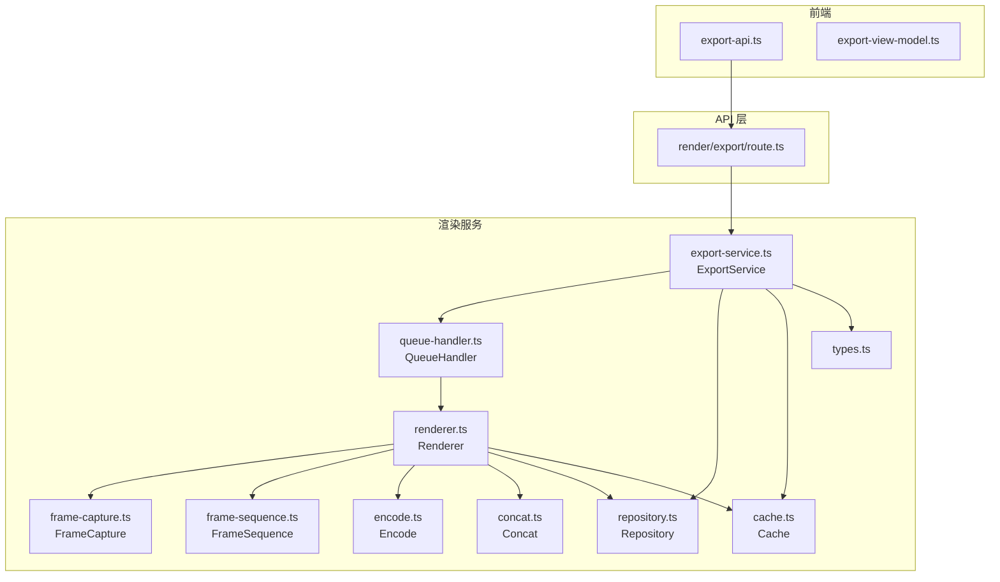
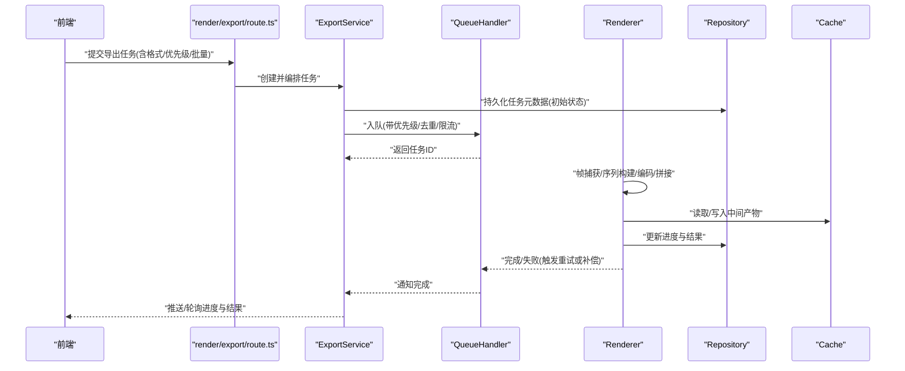
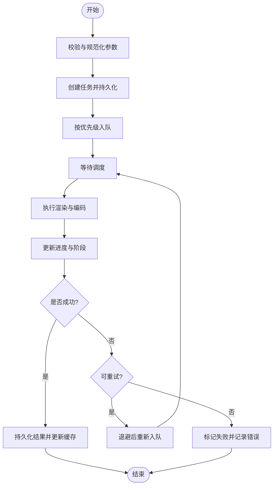
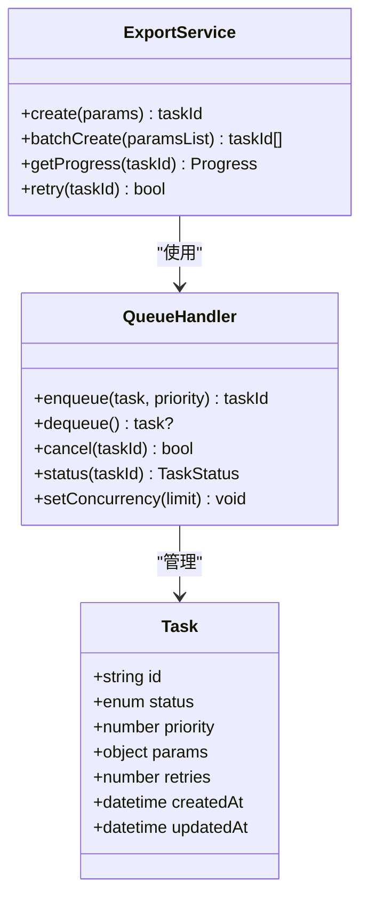
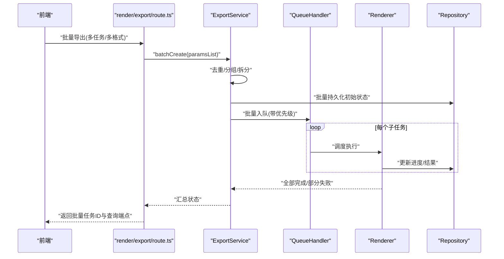
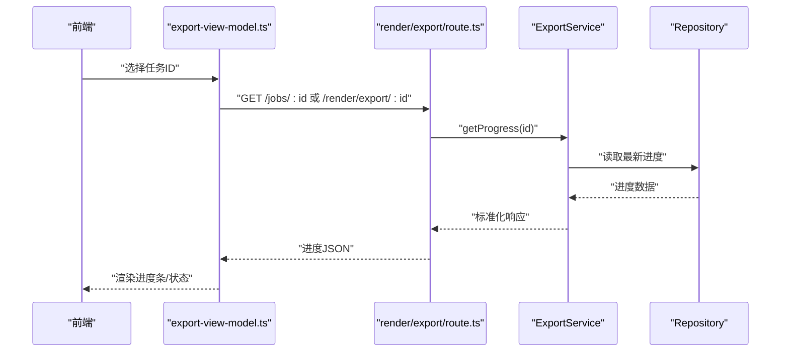
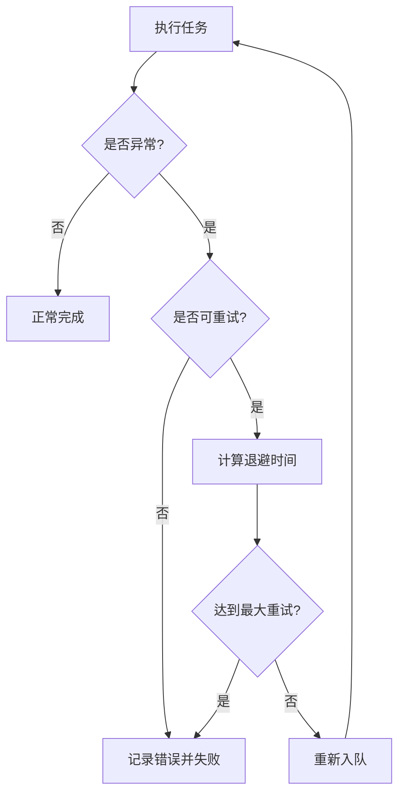
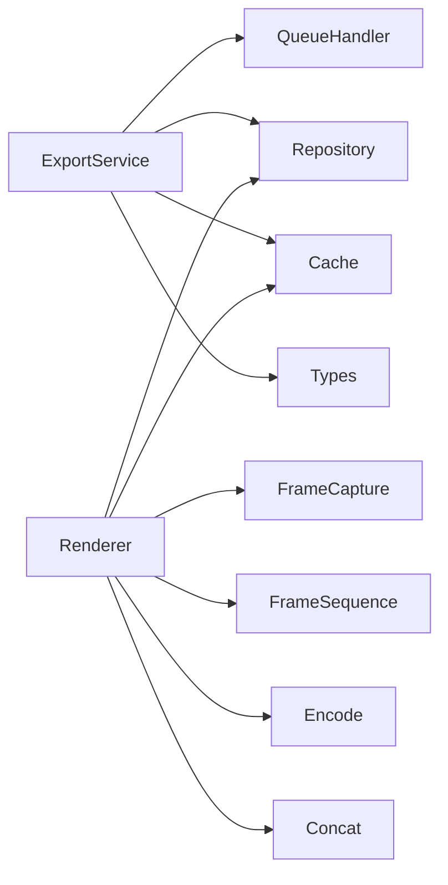

# 导出服务

<cite>
**本文引用的文件**   
- [src/features/render/export-service.ts](file://src/features/render/export-service.ts)
- [src/features/render/queue-handler.ts](file://src/features/render/queue-handler.ts)
- [src/app/api/render/export/route.ts](file://src/app/api/render/export/route.ts)
- [src/app/canvas/export/export-api.ts](file://src/app/canvas/export/export-api.ts)
- [src/app/canvas/export/export-view-model.ts](file://src/app/canvas/export/export-view-model.ts)
- [src/features/render/renderer.ts](file://src/features/render/renderer.ts)
- [src/features/render/types.ts](file://src/features/render/types.ts)
- [src/features/render/repository.ts](file://src/features/render/repository.ts)
- [src/features/render/cache.ts](file://src/features/render/cache.ts)
- [src/features/render/encode.ts](file://src/features/render/encode.ts)
- [src/features/render/frame-capture.ts](file://src/features/render/frame-capture.ts)
- [src/features/render/frame-sequence.ts](file://src/features/render/frame-sequence.ts)
- [src/features/render/concat.ts](file://src/features/render/concat.ts)
</cite>

## 目录
1. [简介](#简介)
2. [项目结构](#项目结构)
3. [核心组件](#核心组件)
4. [架构总览](#架构总览)
5. [详细组件分析](#详细组件分析)
6. [依赖关系分析](#依赖关系分析)
7. [性能考虑](#性能考虑)
8. [故障排查指南](#故障排查指南)
9. [结论](#结论)
10. [附录](#附录)

## 简介
本文件为渲染导出服务的综合文档，聚焦 ExportService 的导出流程编排、任务队列管理与进度跟踪机制。内容涵盖多格式导出支持、批量导出处理与异步任务调度；并提供配置导出任务、监控进度、处理回调与错误重试的实践说明。同时给出优先级管理、资源限制与并发控制策略，以及面向大规模导出的性能优化与最佳实践。

## 项目结构
导出相关代码主要分布在 features/render 与 app 层的 API 和前端视图模型中：
- 后端服务与编排：ExportService、QueueHandler、Renderer、Repository、Cache、Encode、FrameCapture、FrameSequence、Concat
- API 路由：render/export 路由负责接收导出请求并进入队列
- 前端交互：canvas/export 下的 export-api 与 export-view-model 负责发起任务、轮询进度与展示状态

图表来源
- [src/app/api/render/export/route.ts](file://src/app/api/render/export/route.ts)
- [src/features/render/export-service.ts](file://src/features/render/export-service.ts)
- [src/features/render/queue-handler.ts](file://src/features/render/queue-handler.ts)
- [src/features/render/renderer.ts](file://src/features/render/renderer.ts)
- [src/features/render/repository.ts](file://src/features/render/repository.ts)
- [src/features/render/cache.ts](file://src/features/render/cache.ts)
- [src/features/render/encode.ts](file://src/features/render/encode.ts)
- [src/features/render/frame-capture.ts](file://src/features/render/frame-capture.ts)
- [src/features/render/frame-sequence.ts](file://src/features/render/frame-sequence.ts)
- [src/features/render/concat.ts](file://src/features/render/concat.ts)
- [src/features/render/types.ts](file://src/features/render/types.ts)
- [src/app/canvas/export/export-api.ts](file://src/app/canvas/export/export-api.ts)
- [src/app/canvas/export/export-view-model.ts](file://src/app/canvas/export/export-view-model.ts)

章节来源
- [src/app/api/render/export/route.ts](file://src/app/api/render/export/route.ts)
- [src/features/render/export-service.ts](file://src/features/render/export-service.ts)
- [src/features/render/queue-handler.ts](file://src/features/render/queue-handler.ts)
- [src/features/render/renderer.ts](file://src/features/render/renderer.ts)
- [src/features/render/types.ts](file://src/features/render/types.ts)
- [src/app/canvas/export/export-api.ts](file://src/app/canvas/export/export-api.ts)
- [src/app/canvas/export/export-view-model.ts](file://src/app/canvas/export/export-view-model.ts)

## 核心组件
- ExportService（导出服务）
  - 职责：编排导出任务生命周期，包括参数校验、入队、进度追踪、结果持久化与缓存更新、失败重试与回滚。
  - 关键能力：批量导出、优先级调度、并发控制、错误分类与重试策略、进度事件上报。
- QueueHandler（队列处理器）
  - 职责：维护任务队列、执行器池、优先级排序、去重与限流；提供出队、入队、取消与查询接口。
- Renderer（渲染器）
  - 职责：将帧序列编码为最终媒体；协调帧捕获、帧序列组织、编码与拼接；读写仓库与缓存。
- Repository（仓库）
  - 职责：导出任务元数据与结果的持久化存储（如数据库或对象存储索引）。
- Cache（缓存）
  - 职责：中间产物与结果缓存，避免重复计算与 IO。
- Encode/FrameCapture/FrameSequence/Concat（编解码与帧处理）
  - 职责：具体媒体编码、帧抓取、帧序列构建与片段拼接。

章节来源
- [src/features/render/export-service.ts](file://src/features/render/export-service.ts)
- [src/features/render/queue-handler.ts](file://src/features/render/queue-handler.ts)
- [src/features/render/renderer.ts](file://src/features/render/renderer.ts)
- [src/features/render/repository.ts](file://src/features/render/repository.ts)
- [src/features/render/cache.ts](file://src/features/render/cache.ts)
- [src/features/render/encode.ts](file://src/features/render/encode.ts)
- [src/features/render/frame-capture.ts](file://src/features/render/frame-capture.ts)
- [src/features/render/frame-sequence.ts](file://src/features/render/frame-sequence.ts)
- [src/features/render/concat.ts](file://src/features/render/concat.ts)

## 架构总览
导出服务采用“API 路由 -> 服务编排 -> 队列 -> 渲染器 -> 存储/缓存”的分层架构。前端通过 API 发起导出任务，ExportService 负责编排与状态管理，QueueHandler 进行任务调度与并发控制，Renderer 完成实际的帧处理与编码，Repository 与 Cache 负责持久化与加速。

图表来源
- [src/app/api/render/export/route.ts](file://src/app/api/render/export/route.ts)
- [src/features/render/export-service.ts](file://src/features/render/export-service.ts)
- [src/features/render/queue-handler.ts](file://src/features/render/queue-handler.ts)
- [src/features/render/renderer.ts](file://src/features/render/renderer.ts)
- [src/features/render/repository.ts](file://src/features/render/repository.ts)
- [src/features/render/cache.ts](file://src/features/render/cache.ts)

## 详细组件分析

### ExportService 类与导出流程编排
- 流程要点
  - 参数校验与规范化：统一输入模型，解析目标格式、分辨率、码率等。
  - 任务创建与持久化：生成唯一任务 ID，落库初始状态（排队中）。
  - 入队与优先级：根据优先级与去重规则入队；支持批量任务合并与拆分。
  - 进度跟踪：周期性更新进度百分比、阶段信息（准备、渲染、编码、拼接、完成）。
  - 结果处理：成功后更新仓库与缓存；失败时记录错误并触发重试或告警。
  - 资源与并发：结合队列并发上限与单任务资源配额，防止过载。
- 典型调用路径
  - 创建任务：validate -> createTask -> persist -> enqueue
  - 批量任务：batchCreate -> deduplicate -> split -> enqueueAll
  - 进度查询：getProgress(taskId) -> readFromRepoOrCache
  - 失败重试：retryWithBackoff -> re-enqueue

图表来源
- [src/features/render/export-service.ts](file://src/features/render/export-service.ts)
- [src/features/render/repository.ts](file://src/features/render/repository.ts)
- [src/features/render/cache.ts](file://src/features/render/cache.ts)
- [src/features/render/queue-handler.ts](file://src/features/render/queue-handler.ts)

章节来源
- [src/features/render/export-service.ts](file://src/features/render/export-service.ts)
- [src/features/render/repository.ts](file://src/features/render/repository.ts)
- [src/features/render/cache.ts](file://src/features/render/cache.ts)
- [src/features/render/queue-handler.ts](file://src/features/render/queue-handler.ts)

### 任务队列管理与并发控制
- 队列特性
  - 优先级队列：高优先级优先执行，支持动态调整。
  - 去重策略：相同任务键（如源+参数哈希）避免重复入队。
  - 限流与背压：全局并发上限、每任务资源配额、内存/IO 水位监控。
  - 任务生命周期：排队、运行、完成、失败、取消。
- 并发控制策略
  - 全局并发度：基于 CPU/IO 类型任务分别设置最大并行数。
  - 任务隔离：大任务与小任务分池，避免长尾阻塞。
  - 优雅降级：当系统负载过高时拒绝新任务或降低质量。

图表来源
- [src/features/render/queue-handler.ts](file://src/features/render/queue-handler.ts)
- [src/features/render/export-service.ts](file://src/features/render/export-service.ts)

章节来源
- [src/features/render/queue-handler.ts](file://src/features/render/queue-handler.ts)
- [src/features/render/export-service.ts](file://src/features/render/export-service.ts)

### 多格式导出与批量处理
- 多格式支持
  - 通过编码器抽象适配不同输出格式（如视频容器、图像序列、字幕等）。
  - 参数映射：分辨率、码率、帧率、音频轨道、水印等。
- 批量导出
  - 批量创建：一次请求创建多个任务，自动去重与分组。
  - 流水线化：共享中间产物（如帧序列），减少重复计算。
  - 聚合结果：汇总各子任务状态，提供整体进度与下载入口。

图表来源
- [src/app/api/render/export/route.ts](file://src/app/api/render/export/route.ts)
- [src/features/render/export-service.ts](file://src/features/render/export-service.ts)
- [src/features/render/queue-handler.ts](file://src/features/render/queue-handler.ts)
- [src/features/render/renderer.ts](file://src/features/render/renderer.ts)
- [src/features/render/repository.ts](file://src/features/render/repository.ts)

章节来源
- [src/app/api/render/export/route.ts](file://src/app/api/render/export/route.ts)
- [src/features/render/export-service.ts](file://src/features/render/export-service.ts)
- [src/features/render/queue-handler.ts](file://src/features/render/queue-handler.ts)
- [src/features/render/renderer.ts](file://src/features/render/renderer.ts)
- [src/features/render/repository.ts](file://src/features/render/repository.ts)

### 异步任务调度与进度跟踪
- 异步调度
  - 任务入队后立即返回任务 ID，前端通过轮询或 WebSocket 获取进度。
  - 调度器按优先级与资源可用性分配执行器。
- 进度跟踪
  - 阶段划分：准备、渲染、编码、拼接、完成。
  - 指标字段：百分比、当前阶段、已处理帧数、预计剩余时间。
  - 一致性：进度更新幂等，避免重复计数。

图表来源
- [src/app/canvas/export/export-view-model.ts](file://src/app/canvas/export/export-view-model.ts)
- [src/app/api/render/export/route.ts](file://src/app/api/render/export/route.ts)
- [src/features/render/export-service.ts](file://src/features/render/export-service.ts)
- [src/features/render/repository.ts](file://src/features/render/repository.ts)

章节来源
- [src/app/canvas/export/export-view-model.ts](file://src/app/canvas/export/export-view-model.ts)
- [src/app/api/render/export/route.ts](file://src/app/api/render/export/route.ts)
- [src/features/render/export-service.ts](file://src/features/render/export-service.ts)
- [src/features/render/repository.ts](file://src/features/render/repository.ts)

### 错误处理与重试策略
- 错误分类
  - 可重试：临时性 IO 错误、外部依赖超时、编码资源不足。
  - 不可重试：参数非法、源数据损坏、权限不足。
- 重试策略
  - 指数退避：首次短间隔，逐步增加等待时间。
  - 最大重试次数：超过阈值直接失败并告警。
  - 幂等性：重试不改变已完成阶段的进度。
- 补偿与回滚
  - 失败清理：删除中间产物，释放缓存与锁。
  - 状态一致：确保任务状态与持久化结果一致。

图表来源
- [src/features/render/export-service.ts](file://src/features/render/export-service.ts)
- [src/features/render/queue-handler.ts](file://src/features/render/queue-handler.ts)

章节来源
- [src/features/render/export-service.ts](file://src/features/render/export-service.ts)
- [src/features/render/queue-handler.ts](file://src/features/render/queue-handler.ts)

### 前端集成：发起任务、监控进度与回调
- 发起导出
  - 通过 export-api 调用后端路由，传入格式、分辨率、码率、优先级等参数。
  - 支持批量导出，返回任务 ID 列表。
- 监控进度
  - 通过 export-view-model 封装轮询逻辑，显示进度条与阶段信息。
  - 支持错误提示与重试按钮。
- 回调与结果
  - 完成后提供下载链接或预览地址。
  - 失败时展示原因与修复建议。

章节来源
- [src/app/canvas/export/export-api.ts](file://src/app/canvas/export/export-api.ts)
- [src/app/canvas/export/export-view-model.ts](file://src/app/canvas/export/export-view-model.ts)

## 依赖关系分析
- 模块耦合
  - ExportService 依赖 QueueHandler、Repository、Cache、Types。
  - Renderer 依赖 FrameCapture、FrameSequence、Encode、Concat、Repository、Cache。
  - API 路由仅依赖 ExportService，保持薄控制器。
- 外部依赖
  - 存储层（Repository）与缓存层（Cache）可替换实现，便于扩展与测试。
  - 编码器抽象允许接入多种编解码库。

图表来源
- [src/features/render/export-service.ts](file://src/features/render/export-service.ts)
- [src/features/render/queue-handler.ts](file://src/features/render/queue-handler.ts)
- [src/features/render/renderer.ts](file://src/features/render/renderer.ts)
- [src/features/render/repository.ts](file://src/features/render/repository.ts)
- [src/features/render/cache.ts](file://src/features/render/cache.ts)
- [src/features/render/types.ts](file://src/features/render/types.ts)
- [src/features/render/frame-capture.ts](file://src/features/render/frame-capture.ts)
- [src/features/render/frame-sequence.ts](file://src/features/render/frame-sequence.ts)
- [src/features/render/encode.ts](file://src/features/render/encode.ts)
- [src/features/render/concat.ts](file://src/features/render/concat.ts)

章节来源
- [src/features/render/export-service.ts](file://src/features/render/export-service.ts)
- [src/features/render/queue-handler.ts](file://src/features/render/queue-handler.ts)
- [src/features/render/renderer.ts](file://src/features/render/renderer.ts)
- [src/features/render/repository.ts](file://src/features/render/repository.ts)
- [src/features/render/cache.ts](file://src/features/render/cache.ts)
- [src/features/render/types.ts](file://src/features/render/types.ts)
- [src/features/render/frame-capture.ts](file://src/features/render/frame-capture.ts)
- [src/features/render/frame-sequence.ts](file://src/features/render/frame-sequence.ts)
- [src/features/render/encode.ts](file://src/features/render/encode.ts)
- [src/features/render/concat.ts](file://src/features/render/concat.ts)

## 性能考虑
- 并发与资源
  - 合理设置全局并发上限，区分 CPU 密集与 IO 密集任务。
  - 对大任务启用独立执行池，避免小任务被长尾阻塞。
- 缓存与中间产物
  - 复用帧序列与中间编码产物，减少重复计算。
  - 缓存失效策略需与源数据版本一致。
- 编码优化
  - 选择合适的编码器与预设，平衡质量与速度。
  - 分片编码与并行拼接提升吞吐。
- 批量化与流水线
  - 批量任务共享公共步骤，减少 I/O 与序列化开销。
  - 流水线化执行，提高资源利用率。
- 监控与自适应
  - 监控队列长度、执行时长、错误率，动态调整并发与优先级。
  - 在高峰期自动降级质量或拒绝低优先级任务。

[本节为通用性能指导，无需特定文件引用]

## 故障排查指南
- 常见问题
  - 任务长时间排队：检查队列长度与并发上限，确认是否有高优先级任务抢占。
  - 进度不更新：核对进度更新幂等性与持久化链路。
  - 编码失败：查看错误分类与重试次数，确认编码器可用性与资源充足。
  - 结果缺失：验证仓库写入与缓存一致性。
- 定位方法
  - 通过任务 ID 查询 Repository 中的状态与日志。
  - 观察 QueueHandler 的执行器池与任务生命周期。
  - 检查 Renderer 的中间产物与缓存命中情况。

章节来源
- [src/features/render/export-service.ts](file://src/features/render/export-service.ts)
- [src/features/render/queue-handler.ts](file://src/features/render/queue-handler.ts)
- [src/features/render/renderer.ts](file://src/features/render/renderer.ts)
- [src/features/render/repository.ts](file://src/features/render/repository.ts)
- [src/features/render/cache.ts](file://src/features/render/cache.ts)

## 结论
ExportService 作为导出流程的核心编排者，结合 QueueHandler 的任务调度与 Renderer 的具体实现，提供了可扩展、可观测、可重试的导出能力。通过合理的并发控制、缓存策略与错误处理，可在大规模场景下保持稳定与高效。前端通过简洁的 API 与视图模型，实现了良好的用户体验与可操作的控制面。

[本节为总结性内容，无需特定文件引用]

## 附录
- 配置示例（以路径引用代替代码）
  - 创建导出任务：参见 [src/app/canvas/export/export-api.ts](file://src/app/canvas/export/export-api.ts)
  - 批量导出：参见 [src/features/render/export-service.ts](file://src/features/render/export-service.ts)
  - 进度查询：参见 [src/app/canvas/export/export-view-model.ts](file://src/app/canvas/export/export-view-model.ts)
  - 错误重试：参见 [src/features/render/export-service.ts](file://src/features/render/export-service.ts)
- 最佳实践清单
  - 明确任务优先级与去重键，避免热点任务堆积。
  - 使用中间产物缓存与分片编码，提升吞吐。
  - 建立完善的监控与告警，及时发现问题。
  - 对大规模导出采用分批与流水线化，控制峰值资源占用。

[本节为补充信息，无需特定文件引用]