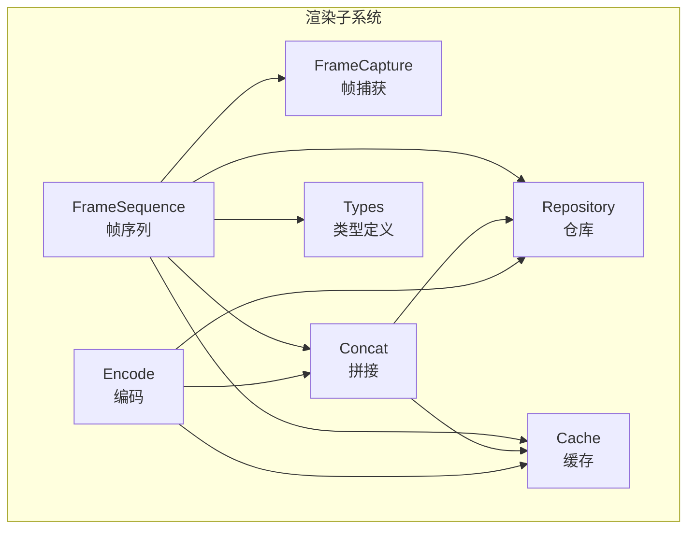
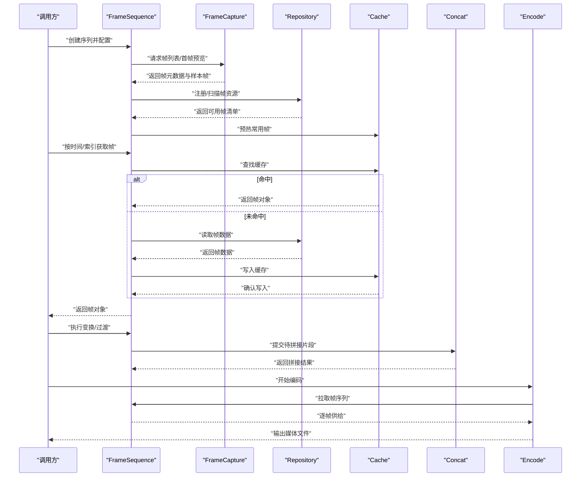
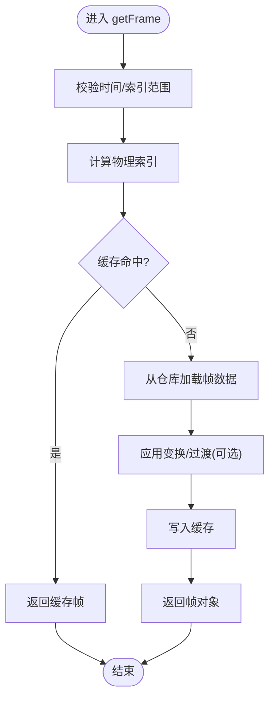
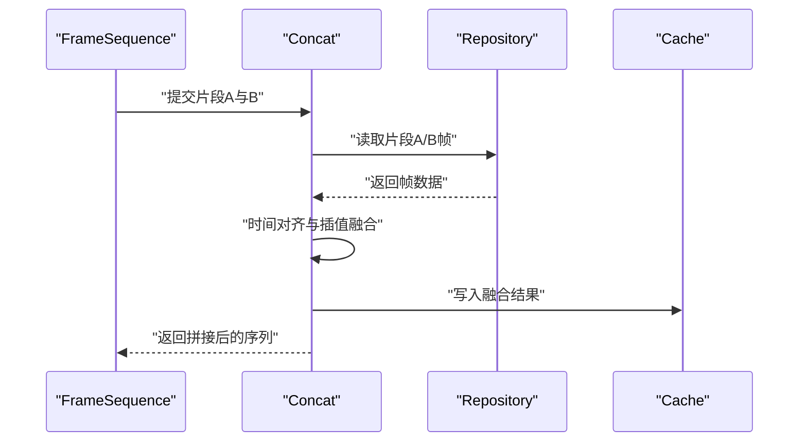
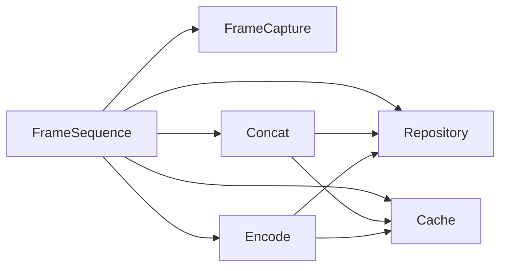

# 帧序列处理

<cite>
**本文引用的文件**   
- [frame-sequence.ts](file://src/features/render/frame-sequence.ts)
- [frame-capture.ts](file://src/features/render/frame-capture.ts)
- [concat.ts](file://src/features/render/concat.ts)
- [encode.ts](file://src/features/render/encode.ts)
- [repository.ts](file://src/features/render/repository.ts)
- [cache.ts](file://src/features/render/cache.ts)
- [types.ts](file://src/features/render/types.ts)
</cite>

## 目录
1. [简介](#简介)
2. [项目结构](#项目结构)
3. [核心组件](#核心组件)
4. [架构总览](#架构总览)
5. [详细组件分析](#详细组件分析)
6. [依赖关系分析](#依赖关系分析)
7. [性能考虑](#性能考虑)
8. [故障排查指南](#故障排查指南)
9. [结论](#结论)
10. [附录](#附录)

## 简介
本文件围绕“帧序列处理模块”进行系统化文档化，聚焦以下目标：
- FrameSequence 类的设计原理、帧数据结构定义与帧操作接口
- 帧的加载、缓存、转换与拼接机制
- 创建帧序列、处理不同格式图像帧、实现帧间过渡效果与批量操作的实践路径
- 帧索引管理、随机访问优化与内存映射技术
- 帧质量评估、去抖动处理与时序同步的实现方法

为便于理解，文档在高层概览与代码级细节之间建立桥梁，并通过图示展示关键流程与数据流。

## 项目结构
帧序列相关能力集中在 features/render 子系统中，主要文件职责如下：
- frame-sequence.ts：FrameSequence 主类，封装帧序列生命周期与核心 API
- frame-capture.ts：帧捕获与提取（从视频/画布等源读取帧）
- concat.ts：帧序列拼接与合成
- encode.ts：编码输出（将帧序列编码为媒体文件）
- repository.ts：帧资源仓库（持久化/检索）
- cache.ts：帧缓存策略（LRU/大小限制/过期）
- types.ts：类型定义（帧元数据、配置、错误码等）

图表来源
- [frame-sequence.ts](file://src/features/render/frame-sequence.ts)
- [frame-capture.ts](file://src/features/render/frame-capture.ts)
- [concat.ts](file://src/features/render/concat.ts)
- [encode.ts](file://src/features/render/encode.ts)
- [repository.ts](file://src/features/render/repository.ts)
- [cache.ts](file://src/features/render/cache.ts)
- [types.ts](file://src/features/render/types.ts)

章节来源
- [frame-sequence.ts](file://src/features/render/frame-sequence.ts)
- [frame-capture.ts](file://src/features/render/frame-capture.ts)
- [concat.ts](file://src/features/render/concat.ts)
- [encode.ts](file://src/features/render/encode.ts)
- [repository.ts](file://src/features/render/repository.ts)
- [cache.ts](file://src/features/render/cache.ts)
- [types.ts](file://src/features/render/types.ts)

## 核心组件
本节概述 FrameSequence 的核心职责与对外接口，并说明与其他组件的协作方式。

- 设计原则
  - 以“帧序列”为中心，统一抽象帧的来源（本地文件、远程 URL、已解码对象等）
  - 通过仓库与缓存解耦存储与访问，支持随机访问与按需加载
  - 提供可组合的变换管线（缩放、裁剪、滤镜、过渡），保持幂等与可回放性
  - 面向批处理与流水线，兼顾吞吐与延迟

- 关键接口（概念性描述）
  - 初始化与配置：设置帧率、尺寸、颜色空间、缓存策略、仓库路径等
  - 加载与构建：从仓库或捕获器加载帧，构建索引与元数据
  - 随机访问：按时间戳或索引获取帧，支持范围查询与分页
  - 变换与过渡：应用几何/色彩/特效变换，生成中间帧以实现过渡
  - 拼接与导出：将多个序列拼接，编码输出到目标容器
  - 统计与评估：计算亮度、对比度、运动强度、抖动指标等

- 与其他组件的关系
  - 帧捕获：负责从外部源抽取原始帧，返回标准化帧对象
  - 仓库：负责帧数据的持久化与检索，支持分片与增量更新
  - 缓存：对热点帧进行快速命中，降低 I/O 与解码开销
  - 拼接：基于时间轴对齐与插值，合并多段序列
  - 编码：将最终帧序列写入媒体文件，支持多格式与参数调优

章节来源
- [frame-sequence.ts](file://src/features/render/frame-sequence.ts)
- [frame-capture.ts](file://src/features/render/frame-capture.ts)
- [concat.ts](file://src/features/render/concat.ts)
- [encode.ts](file://src/features/render/encode.ts)
- [repository.ts](file://src/features/render/repository.ts)
- [cache.ts](file://src/features/render/cache.ts)
- [types.ts](file://src/features/render/types.ts)

## 架构总览
下图展示了帧序列处理的主流程：从输入源到帧序列构建、变换、拼接与编码输出的端到端链路。

图表来源
- [frame-sequence.ts](file://src/features/render/frame-sequence.ts)
- [frame-capture.ts](file://src/features/render/frame-capture.ts)
- [repository.ts](file://src/features/render/repository.ts)
- [cache.ts](file://src/features/render/cache.ts)
- [concat.ts](file://src/features/render/concat.ts)
- [encode.ts](file://src/features/render/encode.ts)

## 详细组件分析

### FrameSequence 类分析
- 职责边界
  - 维护帧的时间轴与索引，提供稳定的随机访问语义
  - 协调捕获、仓库、缓存、变换与拼接，形成可编排的处理管线
  - 暴露统一的 API 供上层业务使用

- 关键数据结构（概念性）
  - 帧对象：包含像素数据、时间戳、尺寸、颜色空间、元数据等
  - 序列元信息：帧率、时长、分辨率、编码参数、质量配置
  - 索引表：时间戳到物理位置的映射，支持二分查找与范围扫描

- 核心流程（示例：随机访问）
  - 输入：目标时间戳或索引
  - 步骤：校验范围 -> 计算索引 -> 缓存命中检查 -> 仓库读取 -> 可选变换 -> 返回帧
  - 输出：标准化帧对象

图表来源
- [frame-sequence.ts](file://src/features/render/frame-sequence.ts)
- [cache.ts](file://src/features/render/cache.ts)
- [repository.ts](file://src/features/render/repository.ts)

章节来源
- [frame-sequence.ts](file://src/features/render/frame-sequence.ts)
- [cache.ts](file://src/features/render/cache.ts)
- [repository.ts](file://src/features/render/repository.ts)

### 帧捕获与加载（FrameCapture）
- 功能要点
  - 从多种源（视频文件、图片序列、画布快照）抽取帧
  - 规范化帧对象格式，确保后续处理一致性
  - 支持预读与采样，加速序列构建与预览

- 典型用法
  - 指定源路径或流式句柄
  - 设置采样间隔与最大并发
  - 获取帧清单与首帧预览用于 UI 反馈

章节来源
- [frame-capture.ts](file://src/features/render/frame-capture.ts)

### 帧拼接（Concat）
- 功能要点
  - 基于时间轴对齐与插值，将多段序列无缝拼接
  - 支持变速、循环、重叠混合与淡入淡出
  - 提供分段预览与进度上报

- 关键流程（示例：两段拼接）
  - 输入：两段序列及其起止时间
  - 步骤：对齐时间基线 -> 计算重叠区 -> 插值融合 -> 输出新序列
  - 输出：新的帧序列引用

图表来源
- [concat.ts](file://src/features/render/concat.ts)
- [repository.ts](file://src/features/render/repository.ts)
- [cache.ts](file://src/features/render/cache.ts)

章节来源
- [concat.ts](file://src/features/render/concat.ts)

### 编码输出（Encode）
- 功能要点
  - 将帧序列编码为常见媒体容器与编码格式
  - 支持可变比特率、关键帧间隔、质量档位
  - 提供增量编码与断点续传

- 典型用法
  - 选择编码器与参数
  - 订阅帧流并写入输出
  - 监听进度与错误回调

章节来源
- [encode.ts](file://src/features/render/encode.ts)

### 仓库与缓存（Repository & Cache）
- 仓库（Repository）
  - 负责帧数据的持久化、版本管理与检索
  - 支持分片存储、增量更新与校验和验证
- 缓存（Cache）
  - LRU 策略、容量上限、冷热分离
  - 支持预取与失效策略，减少重复解码与 I/O

章节来源
- [repository.ts](file://src/features/render/repository.ts)
- [cache.ts](file://src/features/render/cache.ts)

### 类型定义（Types）
- 作用
  - 统一定义帧对象、序列元信息、配置项、错误码与事件
  - 作为各组件之间的契约，保证类型安全与可维护性

章节来源
- [types.ts](file://src/features/render/types.ts)

## 依赖关系分析
- 耦合与内聚
  - FrameSequence 作为编排中心，低耦合地依赖 Capture、Repository、Cache、Concat、Encode
  - Concat 与 Encode 共享 Repository 与 Cache，避免重复数据拷贝
- 外部依赖
  - 文件系统/对象存储（仓库层）
  - 编解码库（编码层）
  - 图像处理库（变换与过渡）

图表来源
- [frame-sequence.ts](file://src/features/render/frame-sequence.ts)
- [frame-capture.ts](file://src/features/render/frame-capture.ts)
- [repository.ts](file://src/features/render/repository.ts)
- [cache.ts](file://src/features/render/cache.ts)
- [concat.ts](file://src/features/render/concat.ts)
- [encode.ts](file://src/features/render/encode.ts)

章节来源
- [frame-sequence.ts](file://src/features/render/frame-sequence.ts)
- [frame-capture.ts](file://src/features/render/frame-capture.ts)
- [repository.ts](file://src/features/render/repository.ts)
- [cache.ts](file://src/features/render/cache.ts)
- [concat.ts](file://src/features/render/concat.ts)
- [encode.ts](file://src/features/render/encode.ts)

## 性能考虑
- 随机访问优化
  - 使用索引表+二分查找定位帧，避免线性扫描
  - 结合时间戳区间与分页，减少单次请求的数据量
- 缓存策略
  - LRU + 预取热点窗口，提升命中率
  - 区分热/冷数据，采用不同的压缩与存储格式
- 内存映射
  - 对大帧文件使用内存映射，降低复制开销
  - 按需页加载，控制峰值内存占用
- 批处理与流水线
  - 批量读取与并行解码，提高吞吐
  - 变换与过渡采用惰性求值，仅在需要时计算
- 编码优化
  - 合理的关键帧间隔与比特率曲线
  - 增量编码与断点续传，增强鲁棒性

[本节为通用性能建议，不直接分析具体文件]

## 故障排查指南
- 常见问题
  - 帧缺失或损坏：检查仓库完整性与校验和，必要时重建索引
  - 缓存污染：清理缓存或调整淘汰策略，避免脏数据影响
  - 时序错位：核对时间基线与帧率，确保对齐与插值正确
  - 编码失败：检查编码器参数与输入帧格式，查看日志定位原因
- 诊断手段
  - 启用详细日志与指标采集（命中率、I/O 耗时、CPU/GPU 占用）
  - 使用最小复现用例隔离问题
  - 对关键路径增加断言与回滚机制

章节来源
- [frame-sequence.ts](file://src/features/render/frame-sequence.ts)
- [cache.ts](file://src/features/render/cache.ts)
- [repository.ts](file://src/features/render/repository.ts)
- [encode.ts](file://src/features/render/encode.ts)

## 结论
本模块以 FrameSequence 为核心，整合帧捕获、仓库、缓存、拼接与编码，形成高内聚、低耦合的帧序列处理能力。通过合理的索引与缓存策略、惰性变换与批处理机制，可在大规模帧数据场景下兼顾性能与稳定性。建议在工程实践中持续完善质量评估、去抖动与时序同步能力，以满足更复杂的创作需求。

[本节为总结性内容，不直接分析具体文件]

## 附录

### 实践示例（路径指引）
- 创建帧序列
  - 参考：[frame-sequence.ts](file://src/features/render/frame-sequence.ts)
- 处理不同格式的图像帧
  - 参考：[frame-capture.ts](file://src/features/render/frame-capture.ts)
- 实现帧间过渡效果
  - 参考：[concat.ts](file://src/features/render/concat.ts)
- 批量帧操作
  - 参考：[frame-sequence.ts](file://src/features/render/frame-sequence.ts)、[concat.ts](file://src/features/render/concat.ts)
- 帧索引管理与随机访问优化
  - 参考：[frame-sequence.ts](file://src/features/render/frame-sequence.ts)、[repository.ts](file://src/features/render/repository.ts)
- 内存映射技术
  - 参考：[repository.ts](file://src/features/render/repository.ts)
- 帧质量评估
  - 参考：[types.ts](file://src/features/render/types.ts)（指标字段）、[frame-sequence.ts](file://src/features/render/frame-sequence.ts)（评估入口）
- 去抖动处理
  - 参考：[frame-sequence.ts](file://src/features/render/frame-sequence.ts)（平滑算法集成点）
- 时序同步
  - 参考：[concat.ts](file://src/features/render/concat.ts)（时间对齐）、[encode.ts](file://src/features/render/encode.ts)（编码同步）