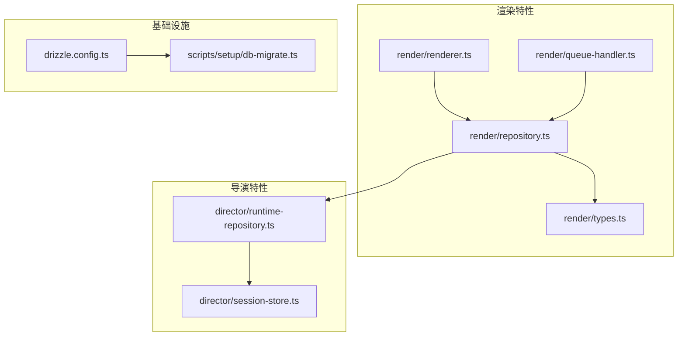
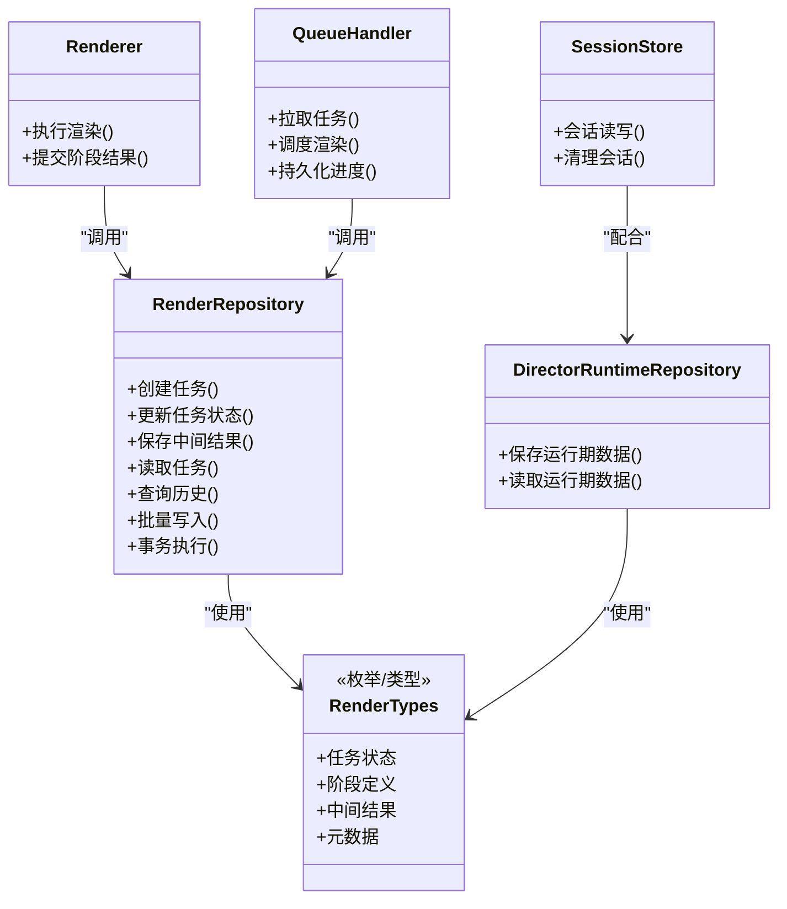
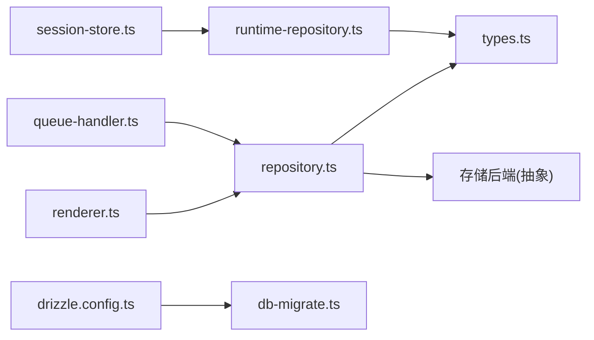
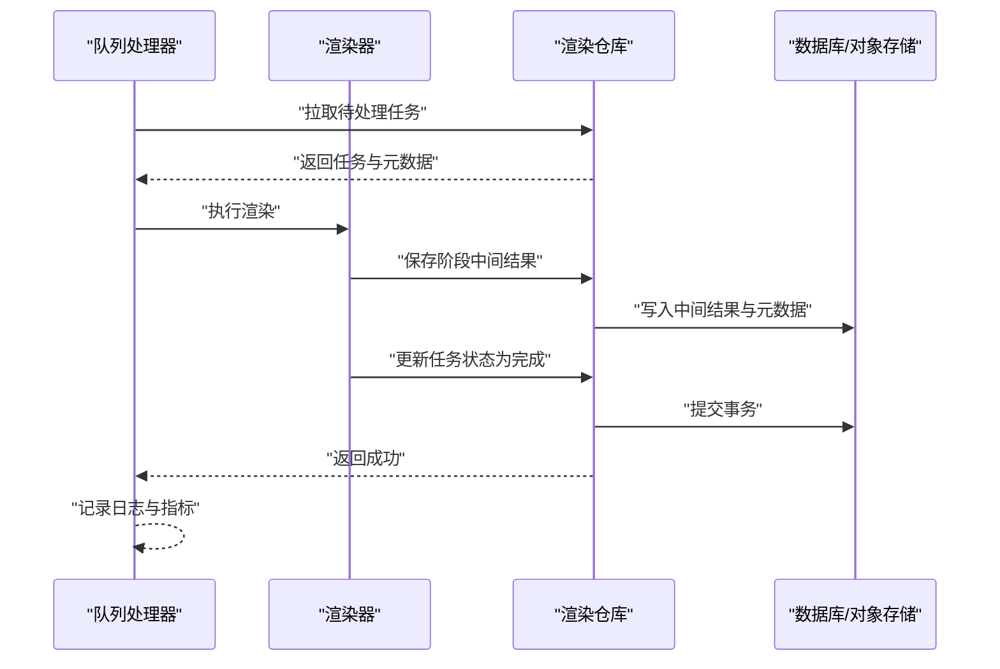
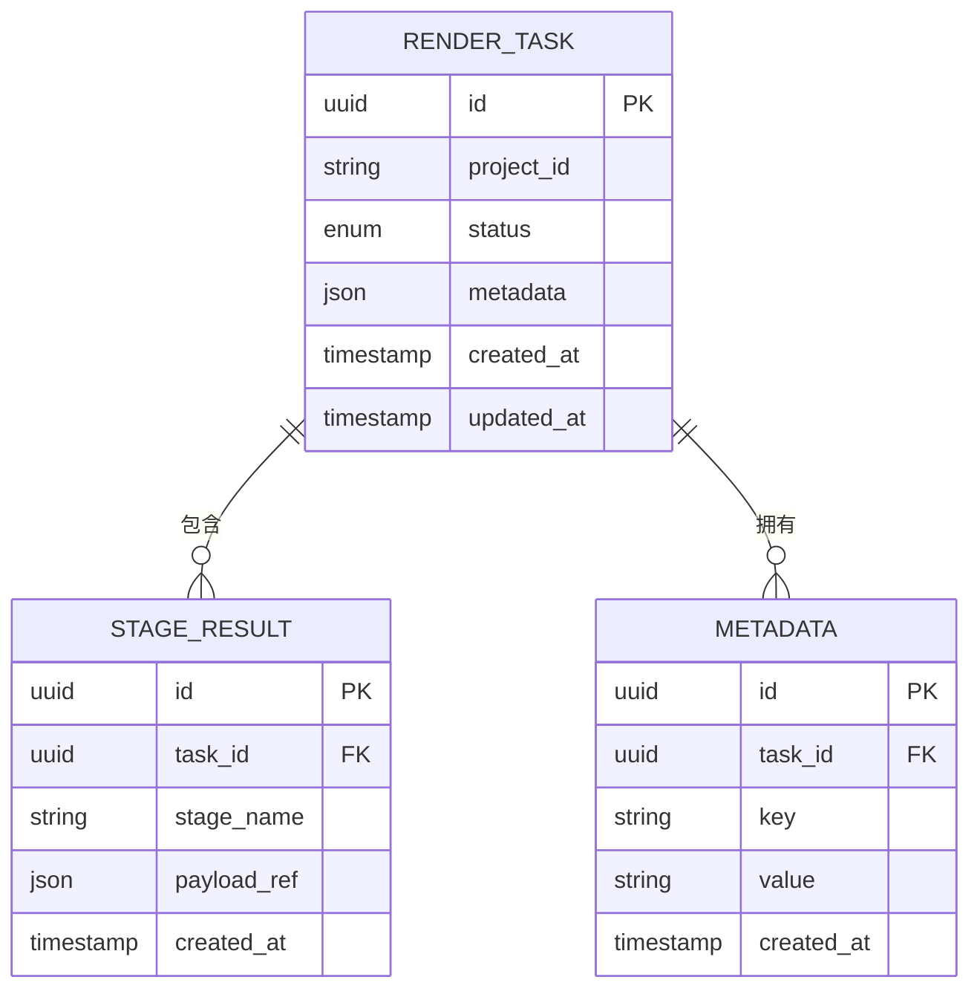

# 数据持久化

<cite>
**本文引用的文件**   
- [src/features/render/repository.ts](file://src/features/render/repository.ts)
- [src/features/render/repository.test.ts](file://src/features/render/repository.test.ts)
- [src/features/render/types.ts](file://src/features/render/types.ts)
- [src/features/render/renderer.ts](file://src/features/render/renderer.ts)
- [src/features/render/queue-handler.ts](file://src/features/render/queue-handler.ts)
- [src/features/director/runtime-repository.ts](file://src/features/director/runtime-repository.ts)
- [src/features/director/session-store.ts](file://src/features/director/session-store.ts)
- [drizzle.config.ts](file://drizzle.config.ts)
- [scripts/setup/db-migrate.ts](file://scripts/setup/db-migrate.ts)
</cite>

## 目录
1. [简介](#简介)
2. [项目结构](#项目结构)
3. [核心组件](#核心组件)
4. [架构总览](#架构总览)
5. [详细组件分析](#详细组件分析)
6. [依赖关系分析](#依赖关系分析)
7. [性能考虑](#性能考虑)
8. [故障排查指南](#故障排查指南)
9. [结论](#结论)
10. [附录](#附录)

## 简介
本章节聚焦渲染数据持久化层，围绕 Repository 类的数据访问抽象、存储后端适配与一致性保证展开。文档将说明渲染任务状态持久化、中间结果保存与元数据管理的具体实现方式，并提供查询渲染历史、恢复渲染任务、备份与迁移渲染数据的实践路径。同时涵盖数据索引优化、批量操作与事务处理机制，以及数据完整性验证与灾难恢复策略。

## 项目结构
渲染持久化相关代码主要位于 features/render 与 features/director 两个特性域中：
- render 域负责渲染任务的定义、执行、队列处理与仓库抽象（Repository）。
- director 域提供运行时上下文与阶段结果的持久化能力，作为渲染流程的支撑。
- drizzle 配置与迁移脚本用于数据库模式管理与版本演进。

图表来源
- [src/features/render/repository.ts](file://src/features/render/repository.ts)
- [src/features/render/types.ts](file://src/features/render/types.ts)
- [src/features/render/renderer.ts](file://src/features/render/renderer.ts)
- [src/features/render/queue-handler.ts](file://src/features/render/queue-handler.ts)
- [src/features/director/runtime-repository.ts](file://src/features/director/runtime-repository.ts)
- [src/features/director/session-store.ts](file://src/features/director/session-store.ts)
- [drizzle.config.ts](file://drizzle.config.ts)
- [scripts/setup/db-migrate.ts](file://scripts/setup/db-migrate.ts)

章节来源
- [src/features/render/repository.ts](file://src/features/render/repository.ts)
- [src/features/render/types.ts](file://src/features/render/types.ts)
- [src/features/render/renderer.ts](file://src/features/render/renderer.ts)
- [src/features/render/queue-handler.ts](file://src/features/render/queue-handler.ts)
- [src/features/director/runtime-repository.ts](file://src/features/director/runtime-repository.ts)
- [src/features/director/session-store.ts](file://src/features/director/session-store.ts)
- [drizzle.config.ts](file://drizzle.config.ts)
- [scripts/setup/db-migrate.ts](file://scripts/setup/db-migrate.ts)

## 核心组件
- 渲染仓库（Repository）：提供对渲染任务、中间产物与元数据的统一访问接口，屏蔽底层存储细节，支持多后端扩展。
- 类型定义（Types）：集中描述渲染任务、阶段、中间结果与元数据的结构约束。
- 渲染器（Renderer）：编排渲染步骤，通过仓库读写任务状态与中间结果。
- 队列处理器（Queue Handler）：消费渲染任务，调用渲染器并持久化进度与结果。
- 运行时仓库（Director Runtime Repository）：为导演阶段的运行期数据提供持久化能力。
- 会话存储（Session Store）：维护会话级中间状态，供渲染与导演流程共享。
- 数据库配置与迁移：基于 drizzle 的模式定义与迁移工具链。

章节来源
- [src/features/render/repository.ts](file://src/features/render/repository.ts)
- [src/features/render/types.ts](file://src/features/render/types.ts)
- [src/features/render/renderer.ts](file://src/features/render/renderer.ts)
- [src/features/render/queue-handler.ts](file://src/features/render/queue-handler.ts)
- [src/features/director/runtime-repository.ts](file://src/features/director/runtime-repository.ts)
- [src/features/director/session-store.ts](file://src/features/director/session-store.ts)
- [drizzle.config.ts](file://drizzle.config.ts)
- [scripts/setup/db-migrate.ts](file://scripts/setup/db-migrate.ts)

## 架构总览
渲染持久化层采用“仓库抽象 + 存储后端”的分层设计。上层业务（渲染器、队列处理器、导演运行时）仅依赖仓库接口；具体存储实现由后端适配器完成，并通过统一的类型契约保障一致性。

图表来源
- [src/features/render/repository.ts](file://src/features/render/repository.ts)
- [src/features/render/types.ts](file://src/features/render/types.ts)
- [src/features/render/renderer.ts](file://src/features/render/renderer.ts)
- [src/features/render/queue-handler.ts](file://src/features/render/queue-handler.ts)
- [src/features/director/runtime-repository.ts](file://src/features/director/runtime-repository.ts)
- [src/features/director/session-store.ts](file://src/features/director/session-store.ts)

## 详细组件分析

### 渲染仓库（Repository）
职责与边界
- 数据访问抽象：封装任务、阶段、中间结果与元数据的增删改查。
- 存储后端适配：对外暴露统一接口，内部可切换不同存储后端（如本地文件系统、对象存储或数据库）。
- 一致性保证：在关键路径上提供事务与幂等写入，确保任务状态与中间结果的一致性。

关键能力
- 任务生命周期管理：创建、更新、查询、删除。
- 中间结果落盘：按阶段保存中间产物，支持断点续跑。
- 元数据管理：记录任务参数、环境信息、时间戳等。
- 批量操作：批量写入中间结果与状态变更。
- 事务处理：跨多个实体的原子性更新。

示例用法（以路径引用代替代码片段）
- 查询渲染历史：参考 [src/features/render/repository.test.ts](file://src/features/render/repository.test.ts)
- 恢复渲染任务：参考 [src/features/render/repository.test.ts](file://src/features/render/repository.test.ts)
- 备份与迁移渲染数据：参考 [scripts/setup/db-migrate.ts](file://scripts/setup/db-migrate.ts)

章节来源
- [src/features/render/repository.ts](file://src/features/render/repository.ts)
- [src/features/render/repository.test.ts](file://src/features/render/repository.test.ts)
- [scripts/setup/db-migrate.ts](file://scripts/setup/db-migrate.ts)

### 类型定义（Types）
作用
- 统一数据结构：明确任务、阶段、中间结果与元数据的字段与约束。
- 校验与序列化：为持久化与传输提供稳定的契约。

建议
- 新增字段时同步更新迁移脚本与测试用例，避免向后不兼容。

章节来源
- [src/features/render/types.ts](file://src/features/render/types.ts)

### 渲染器（Renderer）
职责
- 编排渲染步骤，驱动各阶段执行。
- 通过仓库保存阶段中间结果与最终产物。
- 在异常路径回滚或标记失败，保持状态一致。

交互
- 与仓库紧密协作，遵循幂等与事务约定。

章节来源
- [src/features/render/renderer.ts](file://src/features/render/renderer.ts)
- [src/features/render/repository.ts](file://src/features/render/repository.ts)

### 队列处理器（Queue Handler）
职责
- 从队列拉取待处理任务。
- 调用渲染器执行，并将进度与结果持久化到仓库。
- 处理重试与失败分支，确保任务最终一致。

章节来源
- [src/features/render/queue-handler.ts](file://src/features/render/queue-handler.ts)
- [src/features/render/repository.ts](file://src/features/render/repository.ts)

### 运行时仓库与会话存储（Director）
运行时仓库
- 为导演阶段提供运行期数据的持久化能力，包括提示词、计划、工具输出等。
- 与渲染仓库解耦，但共享类型契约与一致性原则。

会话存储
- 维护短期会话状态，辅助快速恢复与调试。
- 与运行时仓库协同，提供分层缓存与持久化策略。

章节来源
- [src/features/director/runtime-repository.ts](file://src/features/director/runtime-repository.ts)
- [src/features/director/session-store.ts](file://src/features/director/session-store.ts)

### 数据库配置与迁移
配置
- 使用 drizzle 进行模式定义与迁移。
- 配置文件集中管理连接信息与迁移路径。

迁移
- 提供迁移脚本，支持增量升级与回滚。
- 建议在部署前执行迁移，并在测试环境充分验证。

章节来源
- [drizzle.config.ts](file://drizzle.config.ts)
- [scripts/setup/db-migrate.ts](file://scripts/setup/db-migrate.ts)

## 依赖关系分析
渲染持久化层的依赖关系如下：
- 渲染器与队列处理器依赖渲染仓库。
- 渲染仓库依赖类型定义与存储后端。
- 导演运行时仓库与会话存储为渲染流程提供辅助数据。
- 数据库配置与迁移脚本为所有持久化能力提供基础。

图表来源
- [src/features/render/renderer.ts](file://src/features/render/renderer.ts)
- [src/features/render/queue-handler.ts](file://src/features/render/queue-handler.ts)
- [src/features/render/repository.ts](file://src/features/render/repository.ts)
- [src/features/render/types.ts](file://src/features/render/types.ts)
- [src/features/director/runtime-repository.ts](file://src/features/director/runtime-repository.ts)
- [src/features/director/session-store.ts](file://src/features/director/session-store.ts)
- [drizzle.config.ts](file://drizzle.config.ts)
- [scripts/setup/db-migrate.ts](file://scripts/setup/db-migrate.ts)

章节来源
- [src/features/render/repository.ts](file://src/features/render/repository.ts)
- [src/features/render/types.ts](file://src/features/render/types.ts)
- [src/features/render/renderer.ts](file://src/features/render/renderer.ts)
- [src/features/render/queue-handler.ts](file://src/features/render/queue-handler.ts)
- [src/features/director/runtime-repository.ts](file://src/features/director/runtime-repository.ts)
- [src/features/director/session-store.ts](file://src/features/director/session-store.ts)
- [drizzle.config.ts](file://drizzle.config.ts)
- [scripts/setup/db-migrate.ts](file://scripts/setup/db-migrate.ts)

## 性能考虑
- 数据索引优化
  - 为常用查询字段建立索引，如任务 ID、项目 ID、状态、时间戳等。
  - 针对范围查询与排序字段组合索引，减少全表扫描。
- 批量操作
  - 合并多次写入为批量写入，降低 I/O 次数。
  - 分批次提交，控制单次事务大小，避免长事务锁竞争。
- 事务处理
  - 将关联实体的更新放入同一事务，保证原子性与一致性。
  - 合理设置隔离级别，平衡并发与一致性需求。
- 中间结果存储
  - 大对象走对象存储，数据库仅保留指针与元数据。
  - 引入压缩与去重策略，减少存储空间与网络开销。
- 缓存与预热
  - 热点任务与元数据可加入内存缓存，缩短响应时间。
  - 启动时预加载必要索引与配置，提升冷启动性能。

[本节为通用指导，无需特定文件来源]

## 故障排查指南
常见问题与定位方法
- 任务状态不一致
  - 检查事务是否完整提交，确认中间结果与任务状态在同一事务内更新。
  - 查看重试与幂等逻辑是否正确，避免重复写入导致状态漂移。
- 中间结果丢失
  - 验证对象存储连接与权限，确认写入路径与命名规则。
  - 核对元数据与对象指针是否同步更新。
- 迁移失败
  - 检查迁移脚本顺序与依赖，确认目标环境已执行前置迁移。
  - 回滚到上一稳定版本，逐步排查问题。

参考路径
- 仓库测试用例中的错误场景与断言：参考 [src/features/render/repository.test.ts](file://src/features/render/repository.test.ts)
- 迁移脚本与配置：参考 [scripts/setup/db-migrate.ts](file://scripts/setup/db-migrate.ts)、[drizzle.config.ts](file://drizzle.config.ts)

章节来源
- [src/features/render/repository.test.ts](file://src/features/render/repository.test.ts)
- [scripts/setup/db-migrate.ts](file://scripts/setup/db-migrate.ts)
- [drizzle.config.ts](file://drizzle.config.ts)

## 结论
渲染数据持久化层通过仓库抽象实现了清晰的数据访问边界与可扩展的后端适配。结合类型契约、事务与幂等机制，保障了任务状态与中间结果的一致性。配合索引优化、批量操作与迁移工具，系统具备良好的性能与可维护性。建议在生产环境中完善监控与告警，持续验证数据完整性与灾难恢复能力。

[本节为总结性内容，无需特定文件来源]

## 附录

### 典型操作流程（序列图）
以下序列图展示从队列拉取任务到持久化结果的端到端流程。

图表来源
- [src/features/render/queue-handler.ts](file://src/features/render/queue-handler.ts)
- [src/features/render/renderer.ts](file://src/features/render/renderer.ts)
- [src/features/render/repository.ts](file://src/features/render/repository.ts)

### 数据模型概览（ER 图）
以下为概念性数据模型示意，实际字段以类型定义为准。

[此图为概念示意，未直接映射具体源文件，故不提供图表来源]

### 备份与迁移建议
- 定期导出任务与元数据快照，保留对象存储的中间结果清单。
- 使用迁移脚本进行版本升级，先在测试环境验证，再灰度发布。
- 制定回滚策略，确保在迁移失败时可快速恢复到上一稳定版本。

章节来源
- [scripts/setup/db-migrate.ts](file://scripts/setup/db-migrate.ts)
- [drizzle.config.ts](file://drizzle.config.ts)