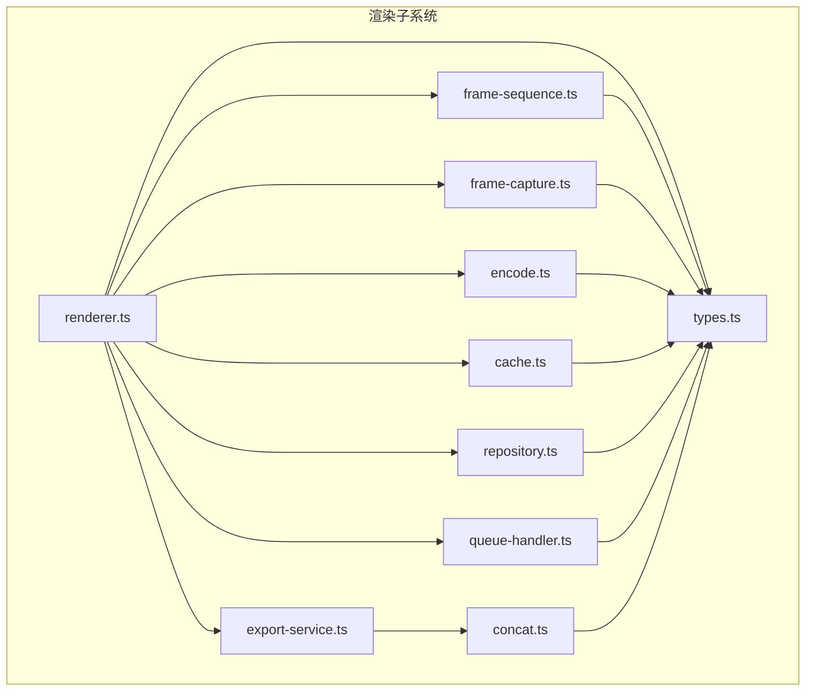
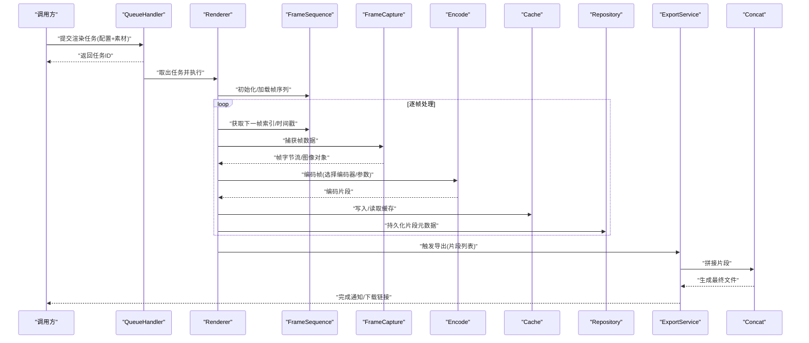
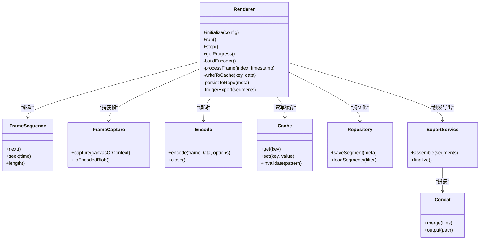
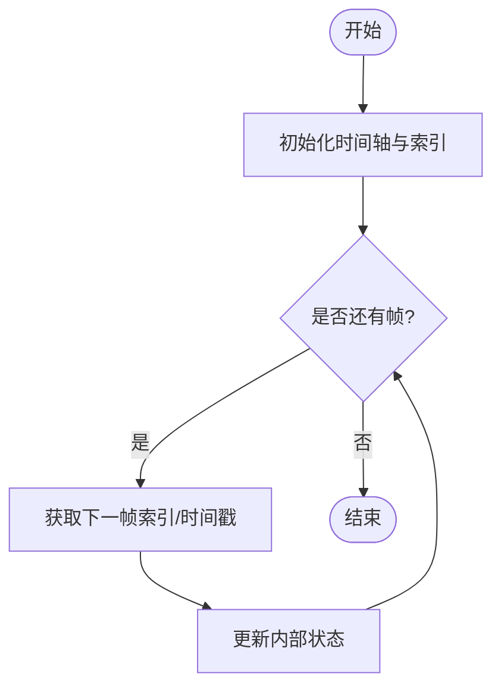
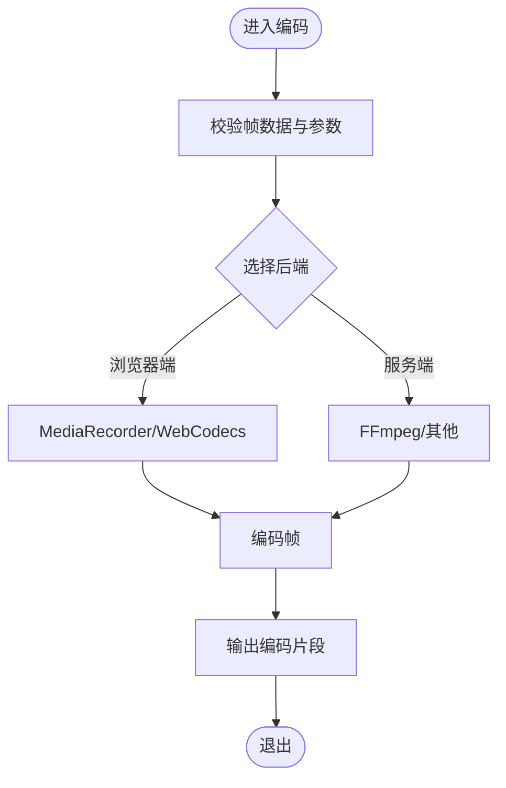
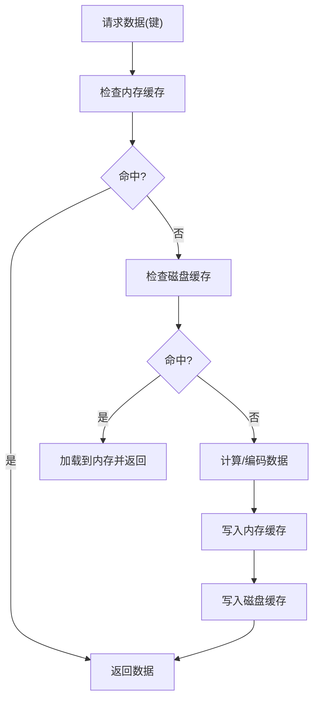
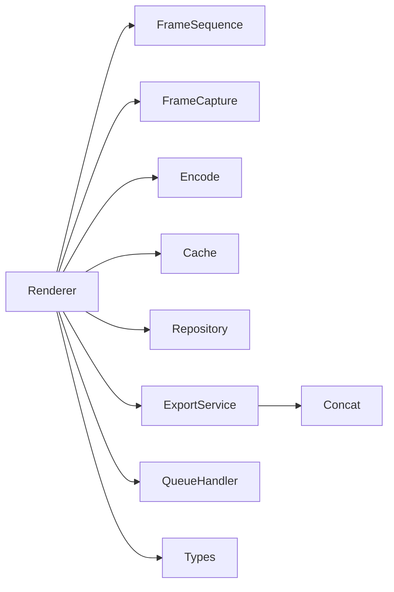

# 渲染引擎

<cite>
**本文引用的文件**   
- [src/features/render/renderer.ts](file://src/features/render/renderer.ts)
- [src/features/render/frame-sequence.ts](file://src/features/render/frame-sequence.ts)
- [src/features/render/encode.ts](file://src/features/render/encode.ts)
- [src/features/render/cache.ts](file://src/features/render/cache.ts)
- [src/features/render/types.ts](file://src/features/render/types.ts)
- [src/features/render/repository.ts](file://src/features/render/repository.ts)
- [src/features/render/export-service.ts](file://src/features/render/export-service.ts)
- [src/features/render/queue-handler.ts](file://src/features/render/queue-handler.ts)
- [src/features/render/frame-capture.ts](file://src/features/render/frame-capture.ts)
- [src/features/render/concat.ts](file://src/features/render/concat.ts)
</cite>

## 目录
1. [简介](#简介)
2. [项目结构](#项目结构)
3. [核心组件](#核心组件)
4. [架构总览](#架构总览)
5. [详细组件分析](#详细组件分析)
6. [依赖关系分析](#依赖关系分析)
7. [性能考虑](#性能考虑)
8. [故障排查指南](#故障排查指南)
9. [结论](#结论)
10. [附录](#附录)

## 简介
本文件为 CodeVideoCanvas 渲染引擎的综合文档，聚焦于渲染管线架构、帧序列处理机制、编码转换流程与缓存策略。内容覆盖 Renderer 类的核心渲染逻辑、FrameSequence 的帧数据处理方式、Encode 模块的格式转换实现以及 Cache 系统的性能优化策略。同时提供渲染队列管理、并发控制、内存管理与错误恢复机制说明，并给出性能调优指南与故障排查方法。

## 项目结构
渲染相关代码集中在 features/render 目录下，采用按功能划分的模块化组织：
- renderer.ts：渲染器主入口，协调帧生成、捕获与导出
- frame-sequence.ts：帧序列抽象与时间轴调度
- encode.ts：编码器适配与转码流程
- cache.ts：渲染结果与中间产物缓存
- repository.ts：持久化存储接口与实现
- export-service.ts：导出服务编排（合并、打包等）
- queue-handler.ts：渲染任务队列与并发控制
- frame-capture.ts：画布帧捕获与图像数据封装
- concat.ts：片段拼接与输出合成
- types.ts：类型定义与配置模型

图表来源
- [src/features/render/renderer.ts](file://src/features/render/renderer.ts)
- [src/features/render/frame-sequence.ts](file://src/features/render/frame-sequence.ts)
- [src/features/render/frame-capture.ts](file://src/features/render/frame-capture.ts)
- [src/features/render/encode.ts](file://src/features/render/encode.ts)
- [src/features/render/cache.ts](file://src/features/render/cache.ts)
- [src/features/render/repository.ts](file://src/features/render/repository.ts)
- [src/features/render/export-service.ts](file://src/features/render/export-service.ts)
- [src/features/render/queue-handler.ts](file://src/features/render/queue-handler.ts)
- [src/features/render/concat.ts](file://src/features/render/concat.ts)
- [src/features/render/types.ts](file://src/features/render/types.ts)

章节来源
- [src/features/render/renderer.ts](file://src/features/render/renderer.ts)
- [src/features/render/frame-sequence.ts](file://src/features/render/frame-sequence.ts)
- [src/features/render/encode.ts](file://src/features/render/encode.ts)
- [src/features/render/cache.ts](file://src/features/render/cache.ts)
- [src/features/render/types.ts](file://src/features/render/types.ts)
- [src/features/render/repository.ts](file://src/features/render/repository.ts)
- [src/features/render/export-service.ts](file://src/features/render/export-service.ts)
- [src/features/render/queue-handler.ts](file://src/features/render/queue-handler.ts)
- [src/features/render/frame-capture.ts](file://src/features/render/frame-capture.ts)
- [src/features/render/concat.ts](file://src/features/render/concat.ts)

## 核心组件
- Renderer：渲染管线的协调者，负责驱动帧序列、捕获帧、调用编码器、写入缓存与仓库、触发导出。
- FrameSequence：将时间轴映射到具体帧，支持顺序遍历、随机访问与增量更新。
- Encode：统一编码接口，封装不同后端（如浏览器 MediaRecorder、WebCodecs、服务端 FFmpeg 等）的转码流程。
- Cache：多级缓存策略，包含内存缓存与磁盘缓存，命中时跳过重复计算。
- Repository：渲染产物与中间数据的持久化接口，屏蔽底层存储差异。
- ExportService：导出编排，聚合片段、执行拼接、生成最终媒体文件。
- QueueHandler：渲染任务入队、出队、并发限制与重试。
- FrameCapture：从 Canvas/WebGL 或离屏上下文抓取帧，转换为可编码的数据块。
- Concat：多片段合并与容器封装。
- Types：统一的配置与数据结构定义，贯穿各模块。

章节来源
- [src/features/render/renderer.ts](file://src/features/render/renderer.ts)
- [src/features/render/frame-sequence.ts](file://src/features/render/frame-sequence.ts)
- [src/features/render/encode.ts](file://src/features/render/encode.ts)
- [src/features/render/cache.ts](file://src/features/render/cache.ts)
- [src/features/render/repository.ts](file://src/features/render/repository.ts)
- [src/features/render/export-service.ts](file://src/features/render/export-service.ts)
- [src/features/render/queue-handler.ts](file://src/features/render/queue-handler.ts)
- [src/features/render/frame-capture.ts](file://src/features/render/frame-capture.ts)
- [src/features/render/concat.ts](file://src/features/render/concat.ts)
- [src/features/render/types.ts](file://src/features/render/types.ts)

## 架构总览
渲染管线整体遵循“序列驱动 + 流水线”模式：
- 输入：渲染配置（分辨率、帧率、时长、编码器参数）、素材清单、时间轴描述
- 处理：FrameSequence 产出帧索引 -> FrameCapture 获取像素数据 -> Encode 转码 -> Cache 命中/落盘 -> Repository 持久化
- 输出：ExportService 聚合片段 -> Concat 合并 -> 生成最终视频

图表来源
- [src/features/render/renderer.ts](file://src/features/render/renderer.ts)
- [src/features/render/frame-sequence.ts](file://src/features/render/frame-sequence.ts)
- [src/features/render/frame-capture.ts](file://src/features/render/frame-capture.ts)
- [src/features/render/encode.ts](file://src/features/render/encode.ts)
- [src/features/render/cache.ts](file://src/features/render/cache.ts)
- [src/features/render/repository.ts](file://src/features/render/repository.ts)
- [src/features/render/export-service.ts](file://src/features/render/export-service.ts)
- [src/features/render/concat.ts](file://src/features/render/concat.ts)
- [src/features/render/queue-handler.ts](file://src/features/render/queue-handler.ts)

## 详细组件分析

### Renderer 类：核心渲染逻辑
- 职责
  - 接收渲染配置，校验并构建内部状态
  - 驱动 FrameSequence 迭代帧
  - 调用 FrameCapture 获取帧数据
  - 调用 Encode 进行编码
  - 与 Cache/Repository 交互以加速与持久化
  - 在完成后触发 ExportService 进行导出
- 关键流程
  - 初始化阶段：解析配置、准备编码器、建立缓存键空间
  - 循环阶段：按帧序获取数据、编码、缓存、落盘
  - 收尾阶段：汇总片段、触发导出、清理资源
- 并发与错误
  - 通过 QueueHandler 控制并发度
  - 对异常进行捕获与重试，记录失败片段以便断点续渲

图表来源
- [src/features/render/renderer.ts](file://src/features/render/renderer.ts)
- [src/features/render/frame-sequence.ts](file://src/features/render/frame-sequence.ts)
- [src/features/render/frame-capture.ts](file://src/features/render/frame-capture.ts)
- [src/features/render/encode.ts](file://src/features/render/encode.ts)
- [src/features/render/cache.ts](file://src/features/render/cache.ts)
- [src/features/render/repository.ts](file://src/features/render/repository.ts)
- [src/features/render/export-service.ts](file://src/features/render/export-service.ts)
- [src/features/render/concat.ts](file://src/features/render/concat.ts)

章节来源
- [src/features/render/renderer.ts](file://src/features/render/renderer.ts)

### FrameSequence：帧数据处理方式
- 设计要点
  - 将时间轴抽象为可迭代的帧序列，支持顺序与随机访问
  - 维护当前帧索引、时间戳映射与增量更新标记
  - 暴露 next()/seek()/length() 等接口供渲染器消费
- 复杂度
  - 顺序遍历 O(1)，随机访问取决于底层实现（数组 O(1)、链表 O(n)）
- 优化建议
  - 预取窗口：提前加载若干帧以减少 I/O 延迟
  - 懒加载：按需生成帧数据，降低峰值内存

图表来源
- [src/features/render/frame-sequence.ts](file://src/features/render/frame-sequence.ts)

章节来源
- [src/features/render/frame-sequence.ts](file://src/features/render/frame-sequence.ts)

### Encode：编码转换实现
- 能力
  - 统一编码接口，支持多种后端（浏览器端 MediaRecorder/WebCodecs、服务端 FFmpeg 等）
  - 接受帧数据与编码选项（分辨率、比特率、编码格式、容器等）
  - 输出编码片段（Blob/Buffer），供后续拼接
- 关键点
  - 编码器生命周期管理（初始化、刷新、关闭）
  - 错误恢复：编码失败时回退策略或重试
  - 性能：批量编码、零拷贝路径、线程/Worker 隔离

图表来源
- [src/features/render/encode.ts](file://src/features/render/encode.ts)

章节来源
- [src/features/render/encode.ts](file://src/features/render/encode.ts)

### Cache：缓存系统性能优化策略
- 策略
  - 多级缓存：内存缓存（快速命中）+ 磁盘缓存（跨进程/重启保留）
  - 缓存键：基于渲染配置与输入素材哈希，确保一致性
  - 失效策略：LRU/TTL 结合，避免无限增长
- 操作
  - get/set/invalidate/load/save 等接口
  - 与 Repository 协作，保证缓存与持久化一致
- 性能
  - 减少重复编码与 I/O
  - 异步写入与批处理

图表来源
- [src/features/render/cache.ts](file://src/features/render/cache.ts)

章节来源
- [src/features/render/cache.ts](file://src/features/render/cache.ts)

### Repository：持久化接口
- 职责
  - 保存/加载渲染片段元数据与路径
  - 提供过滤查询（按任务、时间范围、状态）
- 设计
  - 抽象接口，便于替换底层存储（文件系统、对象存储、数据库）
- 一致性
  - 与 Cache 协同，确保缓存失效与持久化同步

章节来源
- [src/features/render/repository.ts](file://src/features/render/repository.ts)

### ExportService：导出编排
- 职责
  - 收集已编码片段，组装导出任务
  - 调用 Concat 进行合并与容器封装
  - 输出最终文件并提供下载/上传回调
- 流程
  - 校验片段完整性 -> 启动合并 -> 生成输出 -> 清理临时文件

章节来源
- [src/features/render/export-service.ts](file://src/features/render/export-service.ts)

### Concat：片段拼接
- 职责
  - 将多个编码片段按时间顺序合并
  - 处理容器封装、音轨对齐、关键帧对齐等
- 注意
  - 输入片段需满足同一编码参数与时间基准
  - 失败时支持断点续拼

章节来源
- [src/features/render/concat.ts](file://src/features/render/concat.ts)

### QueueHandler：队列与并发控制
- 职责
  - 管理渲染任务的入队、出队、重试与取消
  - 控制并发度，防止资源争用
- 特性
  - 优先级队列、超时控制、健康检查
  - 与 Renderer 解耦，便于扩展

章节来源
- [src/features/render/queue-handler.ts](file://src/features/render/queue-handler.ts)

### FrameCapture：帧捕获
- 职责
  - 从 Canvas/WebGL/离屏上下文捕获帧
  - 转换为编码所需的字节流或图像对象
- 优化
  - 复用缓冲区、减少分配
  - 支持不同色彩空间与位深

章节来源
- [src/features/render/frame-capture.ts](file://src/features/render/frame-capture.ts)

### Types：类型与配置
- 内容
  - 渲染配置（分辨率、帧率、时长、编码器参数）
  - 任务状态、片段元数据、缓存键规范
- 作用
  - 统一数据结构，降低耦合，提升可读性与可测试性

章节来源
- [src/features/render/types.ts](file://src/features/render/types.ts)

## 依赖关系分析
- 组件耦合
  - Renderer 作为中心协调者，依赖其余所有子模块
  - ExportService 仅依赖 Concat 与 Repository
  - Cache 与 Repository 相互独立，但由 Renderer 协调使用
- 外部依赖
  - 浏览器 API（Canvas、MediaRecorder/WebCodecs）
  - 文件系统/对象存储（用于持久化）
  - 可选：FFmpeg（服务端编码）

图表来源
- [src/features/render/renderer.ts](file://src/features/render/renderer.ts)
- [src/features/render/frame-sequence.ts](file://src/features/render/frame-sequence.ts)
- [src/features/render/frame-capture.ts](file://src/features/render/frame-capture.ts)
- [src/features/render/encode.ts](file://src/features/render/encode.ts)
- [src/features/render/cache.ts](file://src/features/render/cache.ts)
- [src/features/render/repository.ts](file://src/features/render/repository.ts)
- [src/features/render/export-service.ts](file://src/features/render/export-service.ts)
- [src/features/render/concat.ts](file://src/features/render/concat.ts)
- [src/features/render/queue-handler.ts](file://src/features/render/queue-handler.ts)
- [src/features/render/types.ts](file://src/features/render/types.ts)

章节来源
- [src/features/render/renderer.ts](file://src/features/render/renderer.ts)
- [src/features/render/export-service.ts](file://src/features/render/export-service.ts)
- [src/features/render/concat.ts](file://src/features/render/concat.ts)
- [src/features/render/queue-handler.ts](file://src/features/render/queue-handler.ts)

## 性能考虑
- 编码路径
  - 优先使用硬件加速（WebCodecs/MediaRecorder）
  - 合理设置比特率与分辨率，平衡质量与速度
- 缓存命中
  - 细化缓存键粒度，避免误命中
  - 启用 LRU/TTL，控制内存占用
- I/O 优化
  - 批量写入、异步落盘
  - 使用零拷贝路径（如 SharedArrayBuffer）
- 并发控制
  - 根据 CPU/IO 瓶颈调整并发度
  - 监控队列积压与任务耗时
- 内存管理
  - 及时释放帧缓冲与编码上下文
  - 分片处理大文件，避免一次性加载

[本节为通用指导，不直接分析具体文件]

## 故障排查指南
- 常见问题
  - 编码失败：检查编码器后端可用性、参数合法性、权限与资源占用
  - 缓存不一致：核对缓存键生成规则与失效策略
  - 导出失败：确认片段完整性、时间轴对齐与容器兼容性
- 定位方法
  - 查看任务日志与错误堆栈
  - 检查 Repository 中片段元数据与路径
  - 验证 Cache 命中情况与磁盘残留
- 恢复策略
  - 断点续渲：基于已持久化的片段继续
  - 重试与降级：切换编码器或降低质量参数

章节来源
- [src/features/render/repository.ts](file://src/features/render/repository.ts)
- [src/features/render/cache.ts](file://src/features/render/cache.ts)
- [src/features/render/export-service.ts](file://src/features/render/export-service.ts)

## 结论
本渲染引擎以 Renderer 为核心，围绕 FrameSequence、Encode、Cache、Repository、ExportService、QueueHandler 等模块构建了可扩展、高性能的视频渲染管线。通过合理的缓存策略、并发控制与错误恢复机制，能够在浏览器与服务端环境中稳定运行，并支持自定义编码器与多样化输出需求。

[本节为总结，不直接分析具体文件]

## 附录

### 配置渲染参数示例（路径指引）
- 渲染配置项定义与默认值
  - [src/features/render/types.ts](file://src/features/render/types.ts)
- 渲染器初始化与参数校验
  - [src/features/render/renderer.ts](file://src/features/render/renderer.ts)
- 编码器参数与后端选择
  - [src/features/render/encode.ts](file://src/features/render/encode.ts)
- 缓存键与失效策略
  - [src/features/render/cache.ts](file://src/features/render/cache.ts)

### 处理不同视频格式（路径指引）
- 帧捕获与格式转换
  - [src/features/render/frame-capture.ts](file://src/features/render/frame-capture.ts)
- 编码后端适配（浏览器/服务端）
  - [src/features/render/encode.ts](file://src/features/render/encode.ts)
- 片段合并与容器封装
  - [src/features/render/concat.ts](file://src/features/render/concat.ts)

### 实现自定义编码器（路径指引）
- 编码器接口约定与生命周期
  - [src/features/render/encode.ts](file://src/features/render/encode.ts)
- 渲染器集成点
  - [src/features/render/renderer.ts](file://src/features/render/renderer.ts)
- 类型与配置扩展
  - [src/features/render/types.ts](file://src/features/render/types.ts)

### 渲染队列管理与并发控制（路径指引）
- 任务入队/出队与重试
  - [src/features/render/queue-handler.ts](file://src/features/render/queue-handler.ts)
- 渲染器与队列协作
  - [src/features/render/renderer.ts](file://src/features/render/renderer.ts)

### 内存管理与错误恢复（路径指引）
- 缓存与持久化一致性
  - [src/features/render/cache.ts](file://src/features/render/cache.ts)
  - [src/features/render/repository.ts](file://src/features/render/repository.ts)
- 导出失败恢复与断点续拼
  - [src/features/render/export-service.ts](file://src/features/render/export-service.ts)
  - [src/features/render/concat.ts](file://src/features/render/concat.ts)