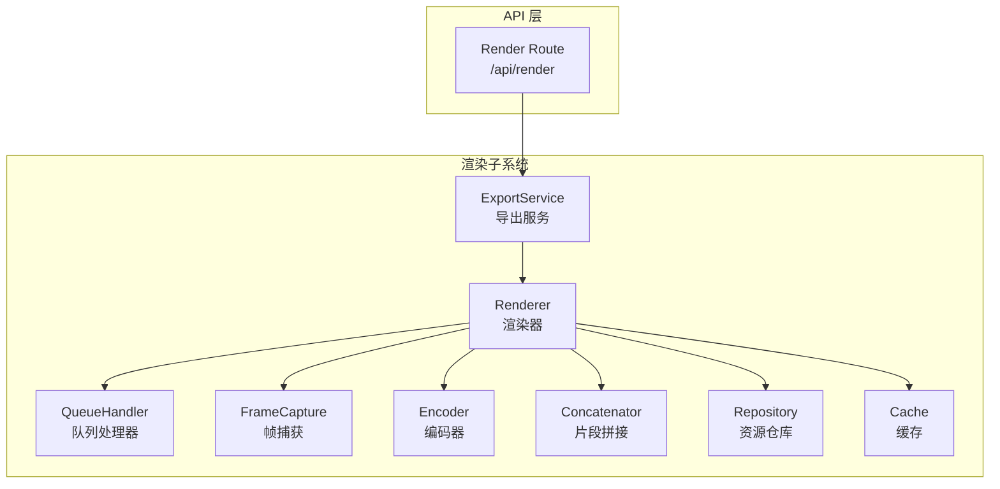
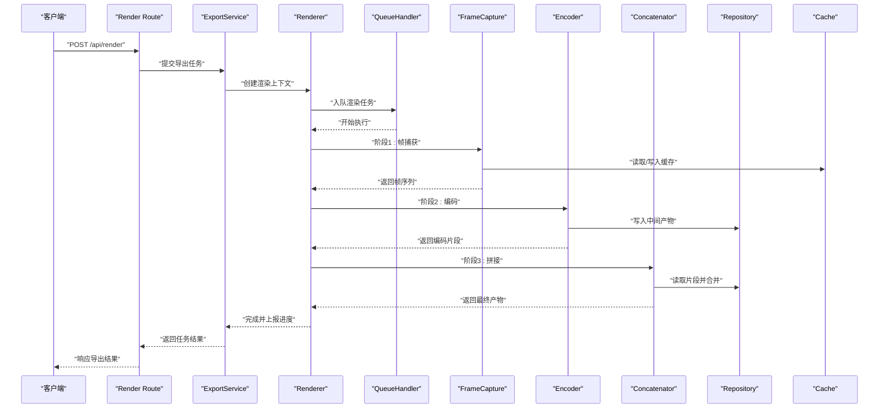
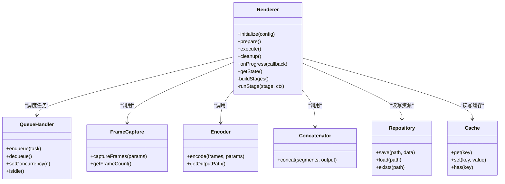
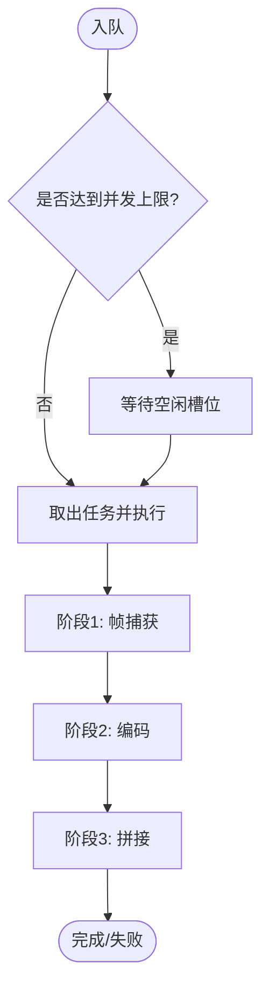
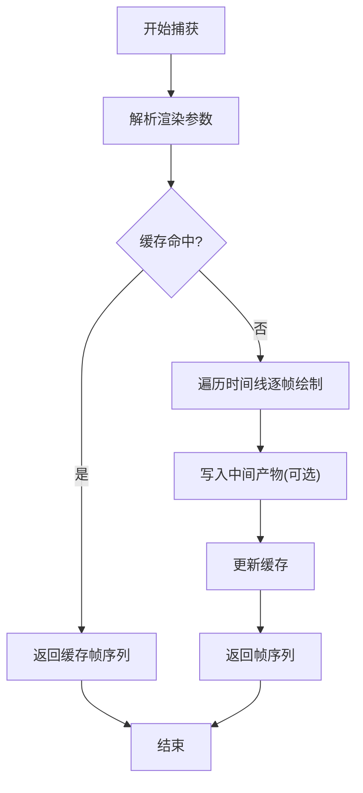
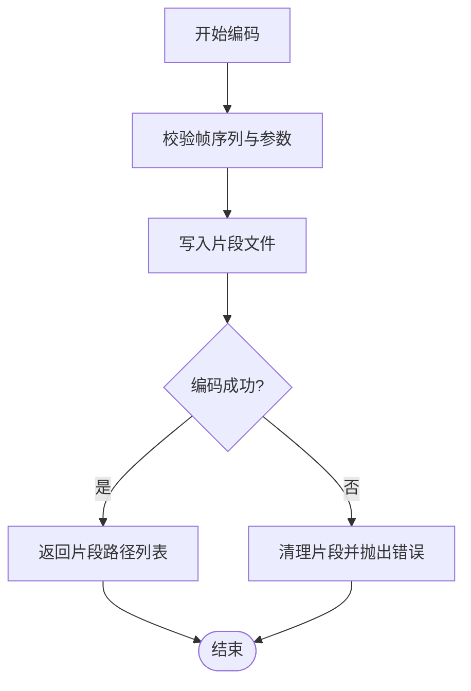
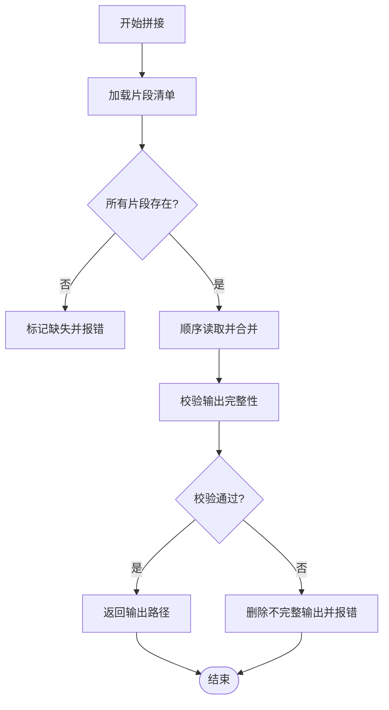
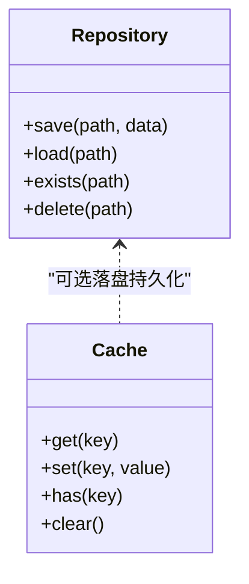
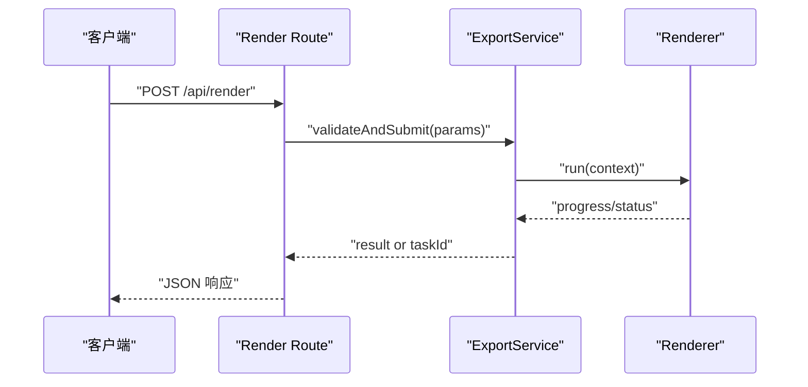
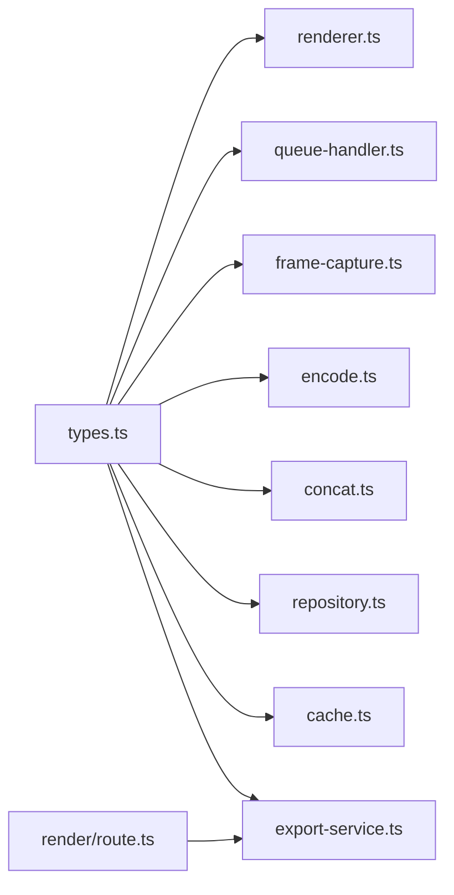

# 渲染管线架构

<cite>
**本文引用的文件**   
- [src/features/render/renderer.ts](file://src/features/render/renderer.ts)
- [src/features/render/types.ts](file://src/features/render/types.ts)
- [src/features/render/queue-handler.ts](file://src/features/render/queue-handler.ts)
- [src/features/render/frame-capture.ts](file://src/features/render/frame-capture.ts)
- [src/features/render/encode.ts](file://src/features/render/encode.ts)
- [src/features/render/concat.ts](file://src/features/render/concat.ts)
- [src/features/render/repository.ts](file://src/features/render/repository.ts)
- [src/features/render/cache.ts](file://src/features/render/cache.ts)
- [src/features/render/export-service.ts](file://src/features/render/export-service.ts)
- [src/app/api/render/route.ts](file://src/app/api/render/route.ts)
</cite>

## 目录
1. [简介](#简介)
2. [项目结构](#项目结构)
3. [核心组件](#核心组件)
4. [架构总览](#架构总览)
5. [详细组件分析](#详细组件分析)
6. [依赖关系分析](#依赖关系分析)
7. [性能考虑](#性能考虑)
8. [故障排查指南](#故障排查指南)
9. [结论](#结论)
10. [附录](#附录)

## 简介
本文件面向渲染引擎的渲染管线，围绕 Renderer 类的设计模式、生命周期管理、任务调度机制与阶段划分进行系统化说明。文档同时覆盖数据流向控制、错误处理策略、并发与内存优化、进度监控以及扩展自定义阶段的实践建议，帮助读者快速理解并高效使用渲染子系统。

## 项目结构
渲染子系统位于 features/render 目录，采用“按功能域组织”的结构：
- 渲染器与类型定义：renderer.ts、types.ts
- 队列与调度：queue-handler.ts
- 帧捕获与编码：frame-capture.ts、encode.ts
- 片段拼接：concat.ts
- 存储与缓存：repository.ts、cache.ts
- 导出服务（对外 API 集成）：export-service.ts
- 服务端路由入口：app/api/render/route.ts

图表来源
- [src/features/render/renderer.ts](file://src/features/render/renderer.ts)
- [src/features/render/queue-handler.ts](file://src/features/render/queue-handler.ts)
- [src/features/render/frame-capture.ts](file://src/features/render/frame-capture.ts)
- [src/features/render/encode.ts](file://src/features/render/encode.ts)
- [src/features/render/concat.ts](file://src/features/render/concat.ts)
- [src/features/render/repository.ts](file://src/features/render/repository.ts)
- [src/features/render/cache.ts](file://src/features/render/cache.ts)
- [src/features/render/export-service.ts](file://src/features/render/export-service.ts)
- [src/app/api/render/route.ts](file://src/app/api/render/route.ts)

章节来源
- [src/features/render/renderer.ts](file://src/features/render/renderer.ts)
- [src/features/render/types.ts](file://src/features/render/types.ts)
- [src/features/render/queue-handler.ts](file://src/features/render/queue-handler.ts)
- [src/features/render/frame-capture.ts](file://src/features/render/frame-capture.ts)
- [src/features/render/encode.ts](file://src/features/render/encode.ts)
- [src/features/render/concat.ts](file://src/features/render/concat.ts)
- [src/features/render/repository.ts](file://src/features/render/repository.ts)
- [src/features/render/cache.ts](file://src/features/render/cache.ts)
- [src/features/render/export-service.ts](file://src/features/render/export-service.ts)
- [src/app/api/render/route.ts](file://src/app/api/render/route.ts)

## 核心组件
- Renderer：渲染管线的编排者，负责初始化、阶段调度、状态管理与进度上报。
- QueueHandler：渲染任务的入队、出队与并发控制，保证顺序与资源隔离。
- FrameCapture：从画布或中间态生成帧序列，支持分辨率、帧率等参数。
- Encoder：将帧序列编码为媒体容器格式，输出可播放文件。
- Concatenator：对分段产物进行合并，提升大任务稳定性与可恢复性。
- Repository：统一访问持久化资源（如素材、中间产物、最终输出）。
- Cache：基于键值策略的缓存层，减少重复计算与 I/O。
- ExportService：对外暴露的导出服务，封装渲染流程与错误映射。
- Render Route：HTTP 接口，接收导出请求并委托给 ExportService。

章节来源
- [src/features/render/renderer.ts](file://src/features/render/renderer.ts)
- [src/features/render/queue-handler.ts](file://src/features/render/queue-handler.ts)
- [src/features/render/frame-capture.ts](file://src/features/render/frame-capture.ts)
- [src/features/render/encode.ts](file://src/features/render/encode.ts)
- [src/features/render/concat.ts](file://src/features/render/concat.ts)
- [src/features/render/repository.ts](file://src/features/render/repository.ts)
- [src/features/render/cache.ts](file://src/features/render/cache.ts)
- [src/features/render/export-service.ts](file://src/features/render/export-service.ts)
- [src/app/api/render/route.ts](file://src/app/api/render/route.ts)

## 架构总览
渲染管线遵循“阶段化 + 队列化 + 可缓存”的架构思想：
- 阶段化：将渲染拆分为准备、帧捕获、编码、拼接等阶段，便于独立测试与扩展。
- 队列化：通过队列处理器实现任务串行/并发控制，避免资源争用与 OOM。
- 可缓存：在关键步骤引入缓存，命中则跳过重算，显著降低延迟与 I/O。

图表来源
- [src/app/api/render/route.ts](file://src/app/api/render/route.ts)
- [src/features/render/export-service.ts](file://src/features/render/export-service.ts)
- [src/features/render/renderer.ts](file://src/features/render/renderer.ts)
- [src/features/render/queue-handler.ts](file://src/features/render/queue-handler.ts)
- [src/features/render/frame-capture.ts](file://src/features/render/frame-capture.ts)
- [src/features/render/encode.ts](file://src/features/render/encode.ts)
- [src/features/render/concat.ts](file://src/features/render/concat.ts)
- [src/features/render/repository.ts](file://src/features/render/repository.ts)
- [src/features/render/cache.ts](file://src/features/render/cache.ts)

## 详细组件分析

### Renderer 类：设计模式与生命周期
- 设计模式
  - 模板方法：定义渲染主流程骨架，具体阶段由子类或配置注入实现。
  - 观察者：通过回调或事件上报进度与状态变更。
  - 工厂：根据配置构建各阶段实例（捕获、编码、拼接）。
- 生命周期
  - 初始化：加载配置、建立仓库与缓存、预热资源。
  - 准备阶段：校验输入、解析时间线、生成任务图。
  - 执行阶段：按阶段顺序执行，支持中断与重试。
  - 收尾阶段：清理临时文件、汇总统计、释放资源。
- 任务调度
  - 与队列处理器协作，确保同一渲染任务内部阶段有序、跨任务可控并发。
- 进度与状态
  - 维护当前阶段、已完成帧数、预计剩余时间等指标，供 UI 展示。

图表来源
- [src/features/render/renderer.ts](file://src/features/render/renderer.ts)
- [src/features/render/queue-handler.ts](file://src/features/render/queue-handler.ts)
- [src/features/render/frame-capture.ts](file://src/features/render/frame-capture.ts)
- [src/features/render/encode.ts](file://src/features/render/encode.ts)
- [src/features/render/concat.ts](file://src/features/render/concat.ts)
- [src/features/render/repository.ts](file://src/features/render/repository.ts)
- [src/features/render/cache.ts](file://src/features/render/cache.ts)

章节来源
- [src/features/render/renderer.ts](file://src/features/render/renderer.ts)
- [src/features/render/types.ts](file://src/features/render/types.ts)

### 队列处理器：并发控制与任务管理
- 职责
  - 维护任务队列，提供入队/出队能力。
  - 控制并发度，防止资源耗尽。
  - 记录任务状态与耗时，用于监控与排障。
- 并发模型
  - 单任务内阶段串行，多任务间可并行，但受全局并发上限限制。
- 失败与重试
  - 支持可重试阶段的重试策略与退避。

图表来源
- [src/features/render/queue-handler.ts](file://src/features/render/queue-handler.ts)

章节来源
- [src/features/render/queue-handler.ts](file://src/features/render/queue-handler.ts)

### 帧捕获：阶段实现与数据流
- 输入：渲染上下文（分辨率、帧率、裁剪区域、时间范围）。
- 过程：遍历时间线，逐帧绘制到离屏画布，生成帧对象或缓冲。
- 输出：帧序列，支持分块写入以提升大任务稳定性。
- 缓存：以“场景+参数哈希”为键，命中则直接返回已缓存帧。

图表来源
- [src/features/render/frame-capture.ts](file://src/features/render/frame-capture.ts)
- [src/features/render/cache.ts](file://src/features/render/cache.ts)

章节来源
- [src/features/render/frame-capture.ts](file://src/features/render/frame-capture.ts)
- [src/features/render/cache.ts](file://src/features/render/cache.ts)

### 编码器：从帧到媒体文件
- 输入：帧序列、编码参数（码率、容器、分辨率缩放等）。
- 过程：将帧转换为编码所需的原始数据，调用底层编码器写入片段。
- 输出：一个或多个片段文件，供后续拼接。
- 错误处理：编码异常时回滚中间产物并上报错误。

图表来源
- [src/features/render/encode.ts](file://src/features/render/encode.ts)

章节来源
- [src/features/render/encode.ts](file://src/features/render/encode.ts)

### 片段拼接：稳定合并与断点续拼
- 输入：编码片段列表、目标输出路径。
- 过程：按序读取片段并合并，支持增量拼接与校验。
- 输出：最终媒体文件。
- 容错：若中途失败，保留已拼接部分以便重试。

图表来源
- [src/features/render/concat.ts](file://src/features/render/concat.ts)

章节来源
- [src/features/render/concat.ts](file://src/features/render/concat.ts)

### 仓库与缓存：I/O 抽象与加速
- Repository
  - 统一抽象本地/远程存储，提供 save/load/exists 等方法。
  - 负责中间产物与最终产物的持久化。
- Cache
  - 基于键值策略，支持 TTL 与容量限制。
  - 在帧捕获与预处理阶段显著减少重复计算。

图表来源
- [src/features/render/repository.ts](file://src/features/render/repository.ts)
- [src/features/render/cache.ts](file://src/features/render/cache.ts)

章节来源
- [src/features/render/repository.ts](file://src/features/render/repository.ts)
- [src/features/render/cache.ts](file://src/features/render/cache.ts)

### 导出服务与 API 路由：对外集成
- ExportService
  - 封装渲染流程，统一错误映射与结果聚合。
  - 提供进度回调与取消信号。
- Render Route
  - 接收 HTTP 请求，解析参数，委托 ExportService 执行。
  - 返回任务 ID 或直接返回结果（同步/异步策略）。

图表来源
- [src/app/api/render/route.ts](file://src/app/api/render/route.ts)
- [src/features/render/export-service.ts](file://src/features/render/export-service.ts)
- [src/features/render/renderer.ts](file://src/features/render/renderer.ts)

章节来源
- [src/app/api/render/route.ts](file://src/app/api/render/route.ts)
- [src/features/render/export-service.ts](file://src/features/render/export-service.ts)

## 依赖关系分析
- 低耦合高内聚：Renderer 仅依赖抽象接口（阶段、仓库、缓存），便于替换实现。
- 明确的数据流向：输入 -> 捕获 -> 编码 -> 拼接 -> 输出，每步有清晰的产物与校验。
- 外部依赖边界：Repository 屏蔽存储差异；Cache 屏蔽缓存实现细节。

图表来源
- [src/features/render/types.ts](file://src/features/render/types.ts)
- [src/features/render/renderer.ts](file://src/features/render/renderer.ts)
- [src/features/render/queue-handler.ts](file://src/features/render/queue-handler.ts)
- [src/features/render/frame-capture.ts](file://src/features/render/frame-capture.ts)
- [src/features/render/encode.ts](file://src/features/render/encode.ts)
- [src/features/render/concat.ts](file://src/features/render/concat.ts)
- [src/features/render/repository.ts](file://src/features/render/repository.ts)
- [src/features/render/cache.ts](file://src/features/render/cache.ts)
- [src/features/render/export-service.ts](file://src/features/render/export-service.ts)
- [src/app/api/render/route.ts](file://src/app/api/render/route.ts)

章节来源
- [src/features/render/types.ts](file://src/features/render/types.ts)
- [src/features/render/renderer.ts](file://src/features/render/renderer.ts)
- [src/features/render/queue-handler.ts](file://src/features/render/queue-handler.ts)
- [src/features/render/frame-capture.ts](file://src/features/render/frame-capture.ts)
- [src/features/render/encode.ts](file://src/features/render/encode.ts)
- [src/features/render/concat.ts](file://src/features/render/concat.ts)
- [src/features/render/repository.ts](file://src/features/render/repository.ts)
- [src/features/render/cache.ts](file://src/features/render/cache.ts)
- [src/features/render/export-service.ts](file://src/features/render/export-service.ts)
- [src/app/api/render/route.ts](file://src/app/api/render/route.ts)

## 性能考虑
- 并发控制
  - 合理设置全局并发度，避免 CPU/IO 饱和导致抖动。
  - 大任务优先串行或限流，小任务可适度并行。
- 缓存策略
  - 针对“场景+参数”的哈希键，最大化命中率。
  - 设置合理的 TTL 与容量上限，避免缓存膨胀。
- 分片与流式处理
  - 帧捕获与编码分块写入，降低峰值内存占用。
  - 拼接阶段增量合并，提高失败恢复效率。
- I/O 优化
  - 批量写入与顺序读，减少随机 I/O。
  - 使用更快的介质存放中间产物，完成后迁移至归档位置。
- 资源回收
  - 及时释放画布、缓冲区与句柄，避免泄漏。
  - 在收尾阶段强制清理临时文件。

[本节为通用指导，不直接分析具体文件]

## 故障排查指南
- 常见问题定位
  - 帧捕获失败：检查画布尺寸、时间范围与资源可用性。
  - 编码失败：确认编码器参数与输入帧格式一致性。
  - 拼接失败：核对片段清单完整性与权限。
- 日志与监控
  - 关注阶段耗时、错误堆栈与资源水位。
  - 利用进度回调与状态查询定位卡点。
- 恢复策略
  - 启用可重试阶段与断点续拼。
  - 清理损坏中间产物后重试。

章节来源
- [src/features/render/renderer.ts](file://src/features/render/renderer.ts)
- [src/features/render/queue-handler.ts](file://src/features/render/queue-handler.ts)
- [src/features/render/frame-capture.ts](file://src/features/render/frame-capture.ts)
- [src/features/render/encode.ts](file://src/features/render/encode.ts)
- [src/features/render/concat.ts](file://src/features/render/concat.ts)

## 结论
本渲染管线以 Renderer 为核心，结合队列化调度、阶段化执行与缓存/仓库抽象，实现了可扩展、可观测、可恢复的渲染流程。通过合理的并发与内存策略，可在保证质量的同时获得稳定的性能表现。建议在生产环境开启缓存与分片策略，并结合监控指标持续调优。

[本节为总结性内容，不直接分析具体文件]

## 附录

### 初始化与配置示例（路径指引）
- 初始化渲染器与配置参数
  - 参考：[src/features/render/renderer.ts](file://src/features/render/renderer.ts)
  - 参考：[src/features/render/types.ts](file://src/features/render/types.ts)
- 启动渲染任务与监控进度
  - 参考：[src/features/render/export-service.ts](file://src/features/render/export-service.ts)
  - 参考：[src/app/api/render/route.ts](file://src/app/api/render/route.ts)

### 自定义渲染阶段扩展指南
- 新增阶段
  - 在 Renderer 的阶段注册表中添加新阶段。
  - 实现阶段接口（输入/输出/错误处理/进度上报）。
- 接入缓存
  - 为新阶段提供缓存键策略与命中逻辑。
- 接入队列
  - 确保阶段可被队列调度，具备幂等性与可重试性。

章节来源
- [src/features/render/renderer.ts](file://src/features/render/renderer.ts)
- [src/features/render/cache.ts](file://src/features/render/cache.ts)
- [src/features/render/queue-handler.ts](file://src/features/render/queue-handler.ts)