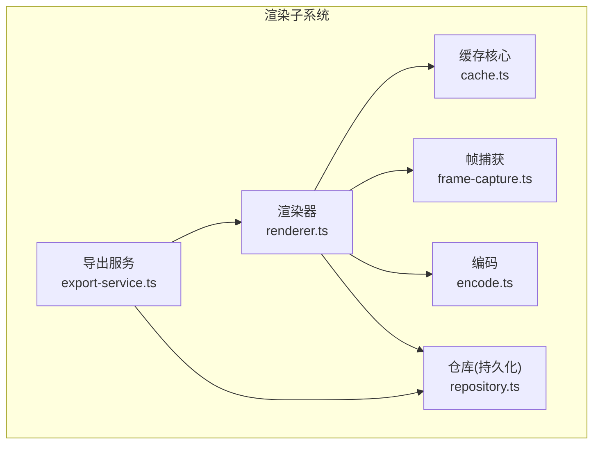
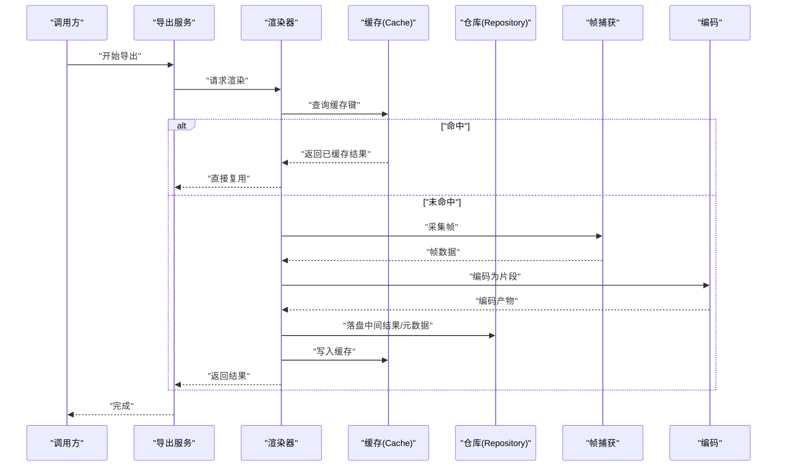
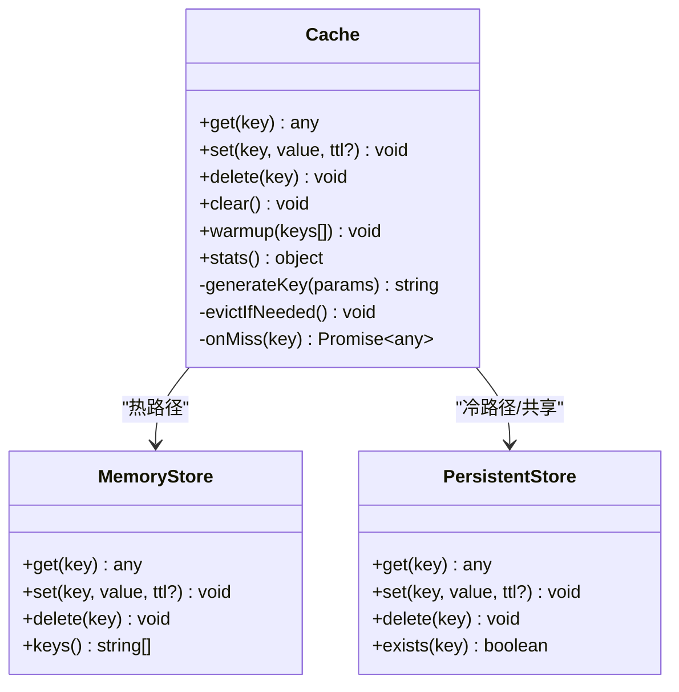
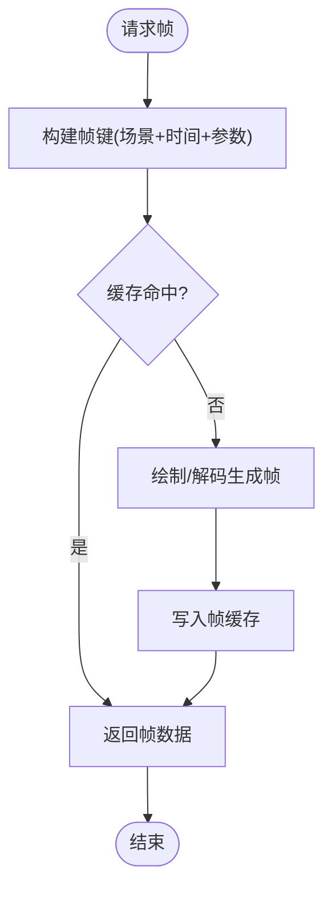
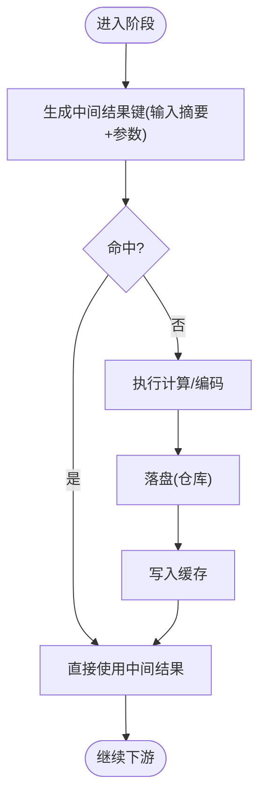
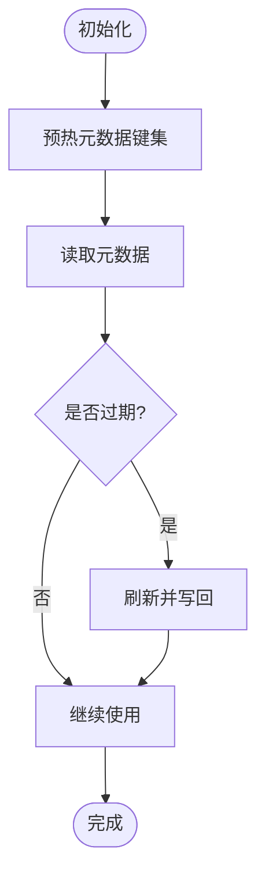
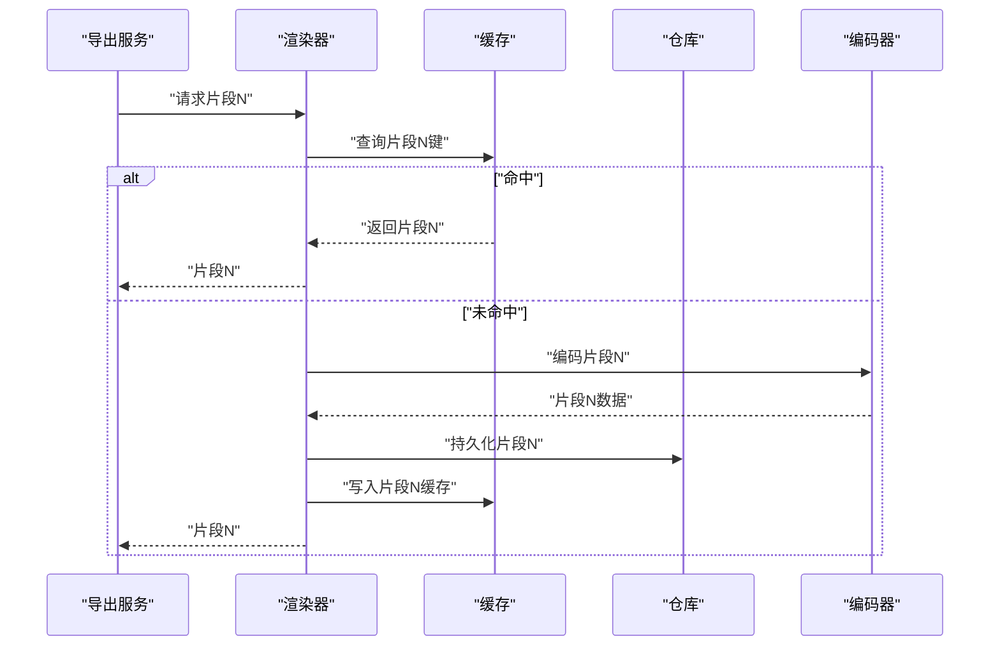
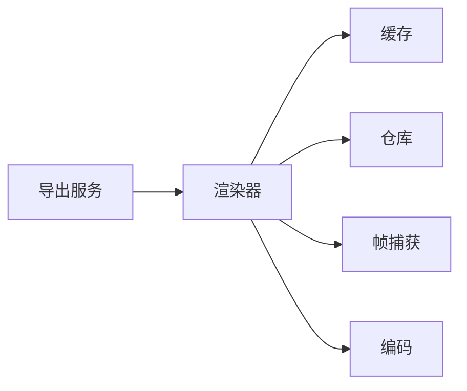

# 缓存管理

<cite>
**本文引用的文件**   
- [src/features/render/cache.ts](file://src/features/render/cache.ts)
- [src/features/render/cache.test.ts](file://src/features/render/cache.test.ts)
- [src/features/render/renderer.ts](file://src/features/render/renderer.ts)
- [src/features/render/repository.ts](file://src/features/render/repository.ts)
- [src/features/render/frame-capture.ts](file://src/features/render/frame-capture.ts)
- [src/features/render/encode.ts](file://src/features/render/encode.ts)
- [src/features/render/export-service.ts](file://src/features/render/export-service.ts)
</cite>

## 目录
1. [简介](#简介)
2. [项目结构](#项目结构)
3. [核心组件](#核心组件)
4. [架构总览](#架构总览)
5. [详细组件分析](#详细组件分析)
6. [依赖关系分析](#依赖关系分析)
7. [性能考虑](#性能考虑)
8. [故障排查指南](#故障排查指南)
9. [结论](#结论)
10. [附录](#附录)

## 简介
本文件面向渲染缓存管理系统，聚焦 Cache 类的缓存策略、存储后端选择与缓存键生成算法；说明帧缓存、中间结果缓存与元数据缓存的实现机制；提供配置缓存大小、设置过期策略、实现预热与清理的示例路径；并给出命中率优化、内存监控与分布式缓存支持建议，以及性能调优与故障排查方法。

## 项目结构
与缓存相关的代码主要位于 features/render 子模块中，围绕渲染管线（渲染器、编码、导出）组织：
- 缓存核心：Cache 类定义、策略与键生成
- 渲染器：按帧/片段进行渲染，读写缓存
- 仓库：持久化与跨进程共享的元数据与中间结果
- 帧捕获与编码：产生可缓存的中间产物
- 导出服务：编排渲染与缓存读取流程

图表来源
- [src/features/render/renderer.ts](file://src/features/render/renderer.ts)
- [src/features/render/cache.ts](file://src/features/render/cache.ts)
- [src/features/render/repository.ts](file://src/features/render/repository.ts)
- [src/features/render/frame-capture.ts](file://src/features/render/frame-capture.ts)
- [src/features/render/encode.ts](file://src/features/render/encode.ts)
- [src/features/render/export-service.ts](file://src/features/render/export-service.ts)

章节来源
- [src/features/render/cache.ts](file://src/features/render/cache.ts)
- [src/features/render/renderer.ts](file://src/features/render/renderer.ts)
- [src/features/render/repository.ts](file://src/features/render/repository.ts)
- [src/features/render/frame-capture.ts](file://src/features/render/frame-capture.ts)
- [src/features/render/encode.ts](file://src/features/render/encode.ts)
- [src/features/render/export-service.ts](file://src/features/render/export-service.ts)

## 核心组件
- Cache 类
  - 职责：统一的缓存访问接口，封装命中/未命中处理、键生成、过期策略、容量控制与统计。
  - 关键能力：
    - 缓存策略：LRU/TTL/容量上限等（由配置驱动）。
    - 存储后端：内存 Map 或外部存储（如文件系统/对象存储），通过抽象接口切换。
    - 键生成：基于输入参数哈希与版本前缀，保证幂等与可演进。
    - 生命周期：写入、读取、删除、清理、预热。
    - 指标：命中率、大小、条目数、过期计数等。
- 渲染器集成
  - 在渲染前后查询/写入缓存，避免重复计算。
  - 对帧序列、编码产物与元数据进行分层缓存。
- 仓库（Repository）
  - 负责将中间结果与元数据持久化，作为缓存的“冷”后端或共享层。
- 帧捕获与编码
  - 产出可缓存的中间产物（位图、视频片段、编码参数摘要等）。
- 导出服务
  - 编排渲染与缓存读取，提升整体吞吐与稳定性。

章节来源
- [src/features/render/cache.ts](file://src/features/render/cache.ts)
- [src/features/render/renderer.ts](file://src/features/render/renderer.ts)
- [src/features/render/repository.ts](file://src/features/render/repository.ts)
- [src/features/render/frame-capture.ts](file://src/features/render/frame-capture.ts)
- [src/features/render/encode.ts](file://src/features/render/encode.ts)
- [src/features/render/export-service.ts](file://src/features/render/export-service.ts)

## 架构总览
下图展示了渲染管线与缓存系统的交互关系，包括热路径（内存缓存）与冷路径（仓库持久化）的协同。

图表来源
- [src/features/render/export-service.ts](file://src/features/render/export-service.ts)
- [src/features/render/renderer.ts](file://src/features/render/renderer.ts)
- [src/features/render/cache.ts](file://src/features/render/cache.ts)
- [src/features/render/repository.ts](file://src/features/render/repository.ts)
- [src/features/render/frame-capture.ts](file://src/features/render/frame-capture.ts)
- [src/features/render/encode.ts](file://src/features/render/encode.ts)

## 详细组件分析

### Cache 类：策略、后端与键生成
- 缓存策略
  - LRU：按最近使用顺序淘汰，适合热点数据。
  - TTL：按时间过期，适合时效性强的中间结果。
  - 容量上限：限制最大条目数或字节数，防止内存膨胀。
- 存储后端
  - 内存后端：Map 结构，低延迟，适合单进程热路径。
  - 持久化后端：结合仓库（文件系统/对象存储），用于跨进程共享与重启恢复。
- 键生成算法
  - 组成：版本前缀 + 输入指纹（如分辨率、时长、编码参数、场景标识等）+ 可选子键（帧号/片段索引）。
  - 目标：确保相同输入产生相同键；参数变更自动失效旧键。
- 生命周期操作
  - get(key): 命中则返回，否则触发未命中回调。
  - set(key, value, ttl?): 写入并更新访问顺序/过期时间。
  - delete(key)/clear(): 主动清理。
  - warmup(keys[]): 批量预加载热点键。
  - stats(): 返回命中率、大小、条目数等指标。

图表来源
- [src/features/render/cache.ts](file://src/features/render/cache.ts)

章节来源
- [src/features/render/cache.ts](file://src/features/render/cache.ts)
- [src/features/render/cache.test.ts](file://src/features/render/cache.test.ts)

### 帧缓存
- 作用：缓存每帧的位图或压缩帧，避免重复绘制/解码。
- 键设计：包含场景ID、时间戳/帧号、分辨率、色彩空间等。
- 策略：TTL 较短（秒级），LRU 淘汰，容量受显存/内存约束。
- 典型流程：渲染器在需要某帧时先查缓存，未命中则走绘制/解码路径，并将结果写回缓存。

图表来源
- [src/features/render/renderer.ts](file://src/features/render/renderer.ts)
- [src/features/render/cache.ts](file://src/features/render/cache.ts)
- [src/features/render/frame-capture.ts](file://src/features/render/frame-capture.ts)

章节来源
- [src/features/render/renderer.ts](file://src/features/render/renderer.ts)
- [src/features/render/cache.ts](file://src/features/render/cache.ts)
- [src/features/render/frame-capture.ts](file://src/features/render/frame-capture.ts)

### 中间结果缓存
- 作用：缓存编码片段、合成中间态、滤镜输出等，减少重复计算。
- 键设计：包含上游输入摘要（如素材指纹、节点图拓扑哈希、参数快照）。
- 策略：TTL 较长（分钟到小时），LRU 淘汰，容量较大。
- 典型流程：渲染器在阶段完成后写入中间结果，后续任务可直接复用。

图表来源
- [src/features/render/renderer.ts](file://src/features/render/renderer.ts)
- [src/features/render/repository.ts](file://src/features/render/repository.ts)
- [src/features/render/cache.ts](file://src/features/render/cache.ts)

章节来源
- [src/features/render/renderer.ts](file://src/features/render/renderer.ts)
- [src/features/render/repository.ts](file://src/features/render/repository.ts)
- [src/features/render/cache.ts](file://src/features/render/cache.ts)

### 元数据缓存
- 作用：缓存素材信息、节点配置、导出任务状态等小体积高频数据。
- 键设计：资源ID + 版本号 + 校验和。
- 策略：TTL 中等（分钟级），LRU 淘汰，容量较小。
- 典型流程：启动时预热常用元数据，运行时快速读取。

图表来源
- [src/features/render/cache.ts](file://src/features/render/cache.ts)
- [src/features/render/repository.ts](file://src/features/render/repository.ts)

章节来源
- [src/features/render/cache.ts](file://src/features/render/cache.ts)
- [src/features/render/repository.ts](file://src/features/render/repository.ts)

### 编码与导出中的缓存利用
- 编码：将帧序列编码为片段，产物写入中间结果缓存与仓库。
- 导出：协调多段渲染与缓存读取，合并最终输出。

图表来源
- [src/features/render/export-service.ts](file://src/features/render/export-service.ts)
- [src/features/render/renderer.ts](file://src/features/render/renderer.ts)
- [src/features/render/encode.ts](file://src/features/render/encode.ts)
- [src/features/render/repository.ts](file://src/features/render/repository.ts)
- [src/features/render/cache.ts](file://src/features/render/cache.ts)

章节来源
- [src/features/render/export-service.ts](file://src/features/render/export-service.ts)
- [src/features/render/renderer.ts](file://src/features/render/renderer.ts)
- [src/features/render/encode.ts](file://src/features/render/encode.ts)
- [src/features/render/repository.ts](file://src/features/render/repository.ts)
- [src/features/render/cache.ts](file://src/features/render/cache.ts)

## 依赖关系分析
- 耦合关系
  - 渲染器强依赖缓存接口，弱依赖仓库（仅在未命中或需要持久化时）。
  - 缓存对存储后端解耦，便于替换内存/持久化实现。
- 循环依赖
  - 无直接循环；导出服务仅编排调用，不反向依赖缓存内部实现。
- 外部依赖
  - 文件系统/对象存储（通过仓库抽象）、序列化库（键/值序列化）。

图表来源
- [src/features/render/export-service.ts](file://src/features/render/export-service.ts)
- [src/features/render/renderer.ts](file://src/features/render/renderer.ts)
- [src/features/render/cache.ts](file://src/features/render/cache.ts)
- [src/features/render/repository.ts](file://src/features/render/repository.ts)
- [src/features/render/frame-capture.ts](file://src/features/render/frame-capture.ts)
- [src/features/render/encode.ts](file://src/features/render/encode.ts)

章节来源
- [src/features/render/export-service.ts](file://src/features/render/export-service.ts)
- [src/features/render/renderer.ts](file://src/features/render/renderer.ts)
- [src/features/render/cache.ts](file://src/features/render/cache.ts)
- [src/features/render/repository.ts](file://src/features/render/repository.ts)
- [src/features/render/frame-capture.ts](file://src/features/render/frame-capture.ts)
- [src/features/render/encode.ts](file://src/features/render/encode.ts)

## 性能考虑
- 命中率优化
  - 合理粒度：帧缓存按帧/片段，中间结果按输入摘要，避免过粗或过细导致命中率下降。
  - 键稳定：确保参数变化能正确失效旧键，同时避免频繁重建键。
  - 预热：启动时加载热点键，降低冷启动抖动。
- 内存使用监控
  - 定期采样缓存大小、条目数、命中率、过期计数。
  - 设置软/硬阈值，触发渐进式清理或降级策略。
- 并发与锁
  - 未命中回填需去重，避免同一键并发重复计算。
  - 读写分离：读路径尽量无锁，写路径串行化。
- I/O 与序列化
  - 大对象优先流式写入/读取，避免一次性加载到内存。
  - 选择合适的序列化格式，平衡速度与体积。

[本节为通用指导，无需具体文件引用]

## 故障排查指南
- 常见问题
  - 命中率过低：检查键生成是否过于敏感或不够区分；确认 TTL 是否过短。
  - 内存飙升：检查容量上限与淘汰策略；定位热点键是否过大。
  - 数据不一致：检查仓库与缓存同步逻辑；确认键版本与校验和。
  - 启动缓慢：检查预热键集合是否过大；按需分批预热。
- 诊断步骤
  - 查看缓存统计指标（命中率、大小、条目数、过期计数）。
  - 打印未命中键列表，分析输入差异。
  - 对比仓库与缓存内容，验证一致性。
  - 逐步关闭缓存，复现问题以定位是否为缓存相关。

章节来源
- [src/features/render/cache.ts](file://src/features/render/cache.ts)
- [src/features/render/cache.test.ts](file://src/features/render/cache.test.ts)

## 结论
通过分层缓存（帧、中间结果、元数据）与统一 Cache 接口，系统在渲染管线中实现了高命中率与可控内存占用。配合合理的键生成、过期策略与预热/清理机制，可在单机与分布式环境下获得稳定的性能表现。建议持续监控指标并根据业务负载动态调整策略。

[本节为总结，无需具体文件引用]

## 附录

### 配置示例（路径指引）
- 配置缓存大小
  - 参考：[src/features/render/cache.ts](file://src/features/render/cache.ts)
- 设置过期策略（TTL）
  - 参考：[src/features/render/cache.ts](file://src/features/render/cache.ts)
- 实现缓存预热
  - 参考：[src/features/render/cache.ts](file://src/features/render/cache.ts)
- 实现清理机制（定时/阈值触发）
  - 参考：[src/features/render/cache.ts](file://src/features/render/cache.ts)

### 命中率与内存监控（路径指引）
- 获取统计指标
  - 参考：[src/features/render/cache.ts](file://src/features/render/cache.ts)
- 在渲染器中记录关键路径耗时与缓存命中
  - 参考：[src/features/render/renderer.ts](file://src/features/render/renderer.ts)

### 分布式缓存支持（路径指引）
- 通过仓库抽象接入远程存储
  - 参考：[src/features/render/repository.ts](file://src/features/render/repository.ts)
- 在缓存层增加远程读取/写入分支
  - 参考：[src/features/render/cache.ts](file://src/features/render/cache.ts)