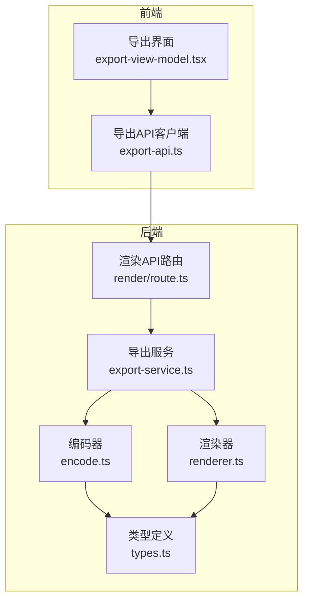
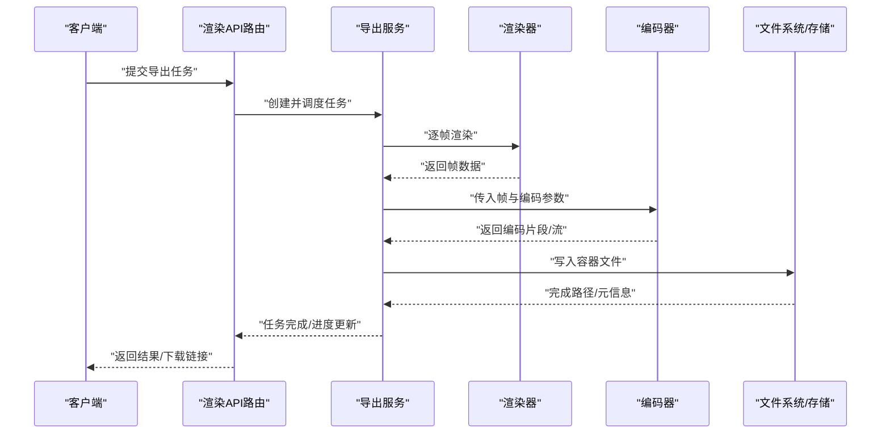
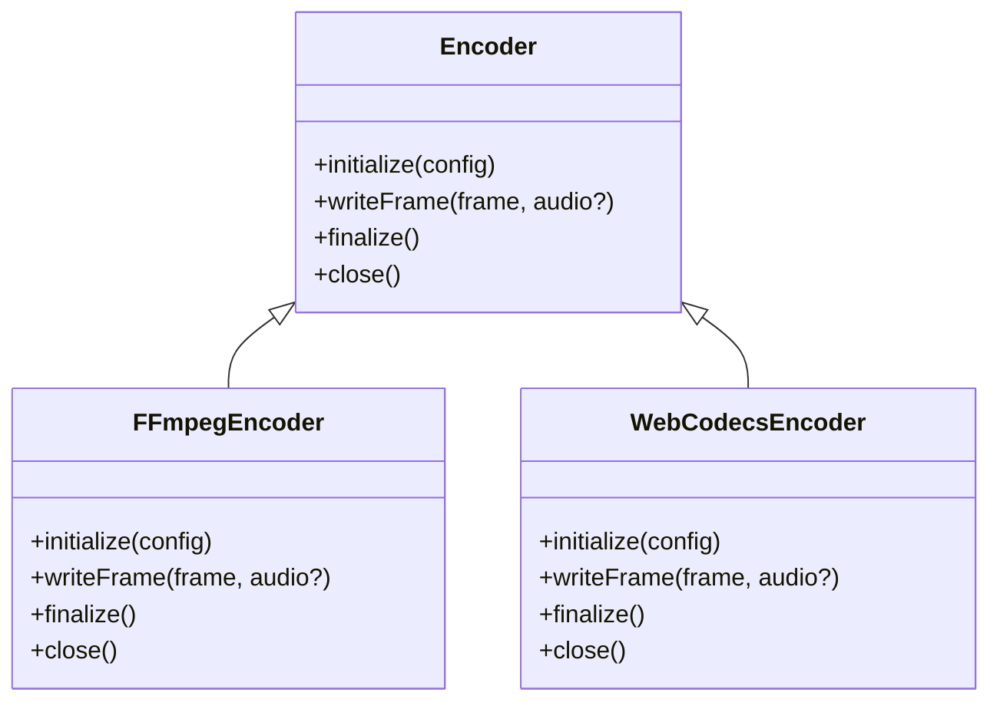
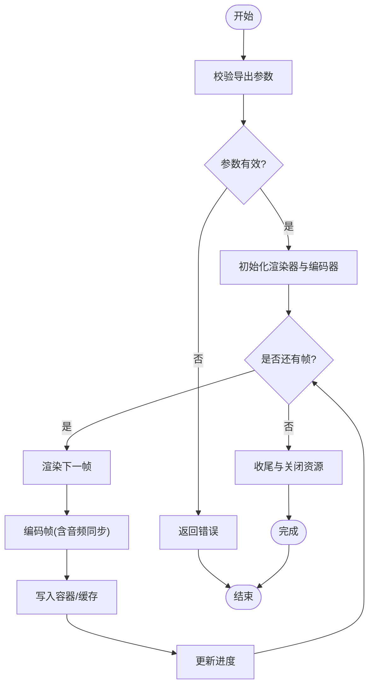
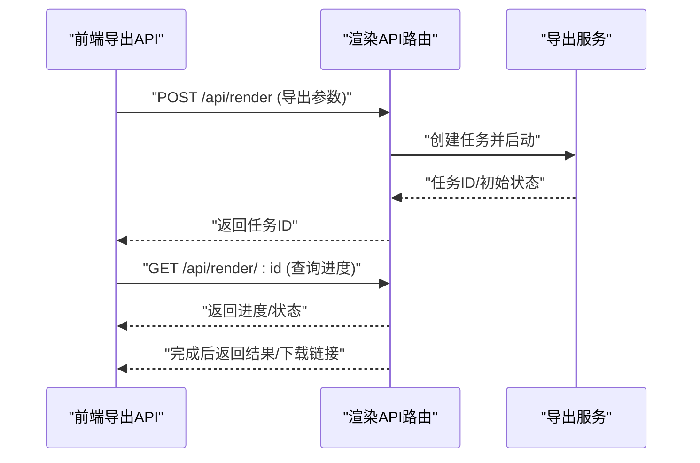
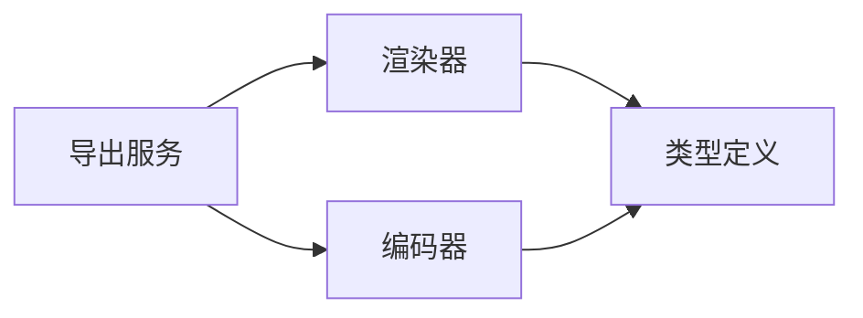

# 编码转换

<cite>
**本文引用的文件**   
- [src/features/render/encode.ts](file://src/features/render/encode.ts)
- [src/features/render/export-service.ts](file://src/features/render/export-service.ts)
- [src/features/render/renderer.ts](file://src/features/render/renderer.ts)
- [src/features/render/types.ts](file://src/features/render/types.ts)
- [src/app/api/render/route.ts](file://src/app/api/render/route.ts)
- [src/app/canvas/export/export-api.ts](file://src/app/canvas/export/export-api.ts)
</cite>

## 目录
1. [简介](#简介)
2. [项目结构](#项目结构)
3. [核心组件](#核心组件)
4. [架构总览](#架构总览)
5. [详细组件分析](#详细组件分析)
6. [依赖关系分析](#依赖关系分析)
7. [性能考量](#性能考量)
8. [故障排查指南](#故障排查指南)
9. [结论](#结论)
10. [附录](#附录)

## 简介
本文件聚焦于“编码转换”模块，围绕编码器架构、输出格式与参数配置、视频编码流程、音频集成与容器封装机制展开。文档同时提供可操作的实践建议：如何配置编码器参数（比特率、分辨率等）、实现实时编码与离线转码、选择编码器策略、在质量与性能之间权衡、错误恢复机制，以及扩展自定义编码器与评估编码质量的方法。

## 项目结构
编码相关能力集中在 features/render 与 app/api/render 两个区域：
- features/render：渲染管线与导出服务，包含帧序列处理、渲染器、编码与导出编排。
- app/api/render：服务端 API 入口，负责接收导出任务并调度渲染与编码流程。
- app/canvas/export：前端导出视图模型与 API 调用，驱动用户发起导出。

图表来源
- [src/app/api/render/route.ts](file://src/app/api/render/route.ts)
- [src/features/render/export-service.ts](file://src/features/render/export-service.ts)
- [src/features/render/renderer.ts](file://src/features/render/renderer.ts)
- [src/features/render/encode.ts](file://src/features/render/encode.ts)
- [src/features/render/types.ts](file://src/features/render/types.ts)
- [src/app/canvas/export/export-api.ts](file://src/app/canvas/export/export-api.ts)

章节来源
- [src/app/api/render/route.ts](file://src/app/api/render/route.ts)
- [src/features/render/export-service.ts](file://src/features/render/export-service.ts)
- [src/features/render/renderer.ts](file://src/features/render/renderer.ts)
- [src/features/render/encode.ts](file://src/features/render/encode.ts)
- [src/features/render/types.ts](file://src/features/render/types.ts)
- [src/app/canvas/export/export-api.ts](file://src/app/canvas/export/export-api.ts)

## 核心组件
- 编码器（Encode）：负责将渲染出的帧数据与可选的音轨进行编码，支持多种输出格式与编码参数（如比特率、分辨率、帧率、质量档位）。
- 导出服务（ExportService）：编排渲染与编码流程，管理任务状态、进度回调与错误传播。
- 渲染器（Renderer）：按时间线或帧序列生成图像帧，必要时与音频同步。
- 类型定义（Types）：统一描述导出任务、编码器配置、输出格式、进度与结果的结构。

章节来源
- [src/features/render/encode.ts](file://src/features/render/encode.ts)
- [src/features/render/export-service.ts](file://src/features/render/export-service.ts)
- [src/features/render/renderer.ts](file://src/features/render/renderer.ts)
- [src/features/render/types.ts](file://src/features/render/types.ts)

## 架构总览
整体采用“渲染→编码→封装”的分层设计：
- 渲染层：从画布或帧序列生成图像帧，必要时与音频对齐。
- 编码层：根据目标格式与参数对视频帧进行编码，并可复用音频流。
- 封装层：将编码后的音视频流写入容器文件（如 MP4/MKV），完成导出。

图表来源
- [src/app/api/render/route.ts](file://src/app/api/render/route.ts)
- [src/features/render/export-service.ts](file://src/features/render/export-service.ts)
- [src/features/render/renderer.ts](file://src/features/render/renderer.ts)
- [src/features/render/encode.ts](file://src/features/render/encode.ts)

## 详细组件分析

### 编码器（Encode）
- 职责
  - 接收渲染帧与可选音频输入。
  - 根据输出格式与编码参数执行编码。
  - 输出编码后的媒体片段或直接写入容器。
- 关键能力
  - 支持的输出格式：由类型定义与配置决定（例如常见容器与编解码组合）。
  - 编码参数：包括视频比特率、分辨率、帧率、质量档位、GOP 结构等；音频采样率、声道数、码率等。
  - 实时与离线模式：通过缓冲策略与写入时机控制，分别适配低延迟与高吞吐场景。
- 扩展点
  - 新增编码器：遵循统一的接口契约（初始化、写帧、收尾、关闭）。
  - 插件式注册：在编码器工厂或注册表中登记新实现。
- 错误处理
  - 编码异常捕获与重试策略（限次、退避）。
  - 资源清理与回滚（中断时释放临时文件/句柄）。

图表来源
- [src/features/render/encode.ts](file://src/features/render/encode.ts)
- [src/features/render/types.ts](file://src/features/render/types.ts)

章节来源
- [src/features/render/encode.ts](file://src/features/render/encode.ts)
- [src/features/render/types.ts](file://src/features/render/types.ts)

### 导出服务（ExportService）
- 职责
  - 解析导出请求，校验参数。
  - 协调渲染器与编码器，维护任务生命周期与进度。
  - 聚合错误与日志，对外暴露统一的结果与状态。
- 关键流程
  - 任务创建与入队（如需队列化）。
  - 分片/流式处理：边渲染边编码，降低内存峰值。
  - 进度上报：基于帧计数或字节量计算百分比。
  - 失败恢复：断点续传（若支持）、重试、降级策略。
- 与容器的交互
  - 将编码后的音视频流写入目标容器，完成最终文件。

图表来源
- [src/features/render/export-service.ts](file://src/features/render/export-service.ts)
- [src/features/render/renderer.ts](file://src/features/render/renderer.ts)
- [src/features/render/encode.ts](file://src/features/render/encode.ts)

章节来源
- [src/features/render/export-service.ts](file://src/features/render/export-service.ts)

### 渲染器（Renderer）
- 职责
  - 根据时间线或帧序列生成图像帧。
  - 与音频轨道对齐，确保时序一致。
- 关键点
  - 帧缓冲与去抖动：避免丢帧与卡顿。
  - 并发与批处理：提升吞吐。
  - 与编码器的对接：按需推送帧，支持流式。

章节来源
- [src/features/render/renderer.ts](file://src/features/render/renderer.ts)
- [src/features/render/types.ts](file://src/features/render/types.ts)

### 类型定义（Types）
- 作用
  - 统一导出任务、编码器配置、输出格式、进度与结果的类型契约。
- 关键字段（示例性说明）
  - 任务：ID、状态、进度、错误信息、输出路径。
  - 编码器配置：格式、视频/音频参数、质量档位、分辨率、帧率、比特率。
  - 结果：文件大小、时长、元数据。

章节来源
- [src/features/render/types.ts](file://src/features/render/types.ts)

### API 与前端集成
- 渲染 API（后端）
  - 接收导出请求，调用导出服务，返回任务状态与结果。
- 导出 API（前端）
  - 构建导出参数，发起请求，轮询/订阅进度，展示结果。

图表来源
- [src/app/api/render/route.ts](file://src/app/api/render/route.ts)
- [src/app/canvas/export/export-api.ts](file://src/app/canvas/export/export-api.ts)

章节来源
- [src/app/api/render/route.ts](file://src/app/api/render/route.ts)
- [src/app/canvas/export/export-api.ts](file://src/app/canvas/export/export-api.ts)

## 依赖关系分析
- 耦合度
  - 导出服务作为编排中心，依赖渲染器与编码器，但通过类型契约解耦具体实现。
  - 编码器与容器写入逻辑分离，便于替换不同后端（本地/云端）。
- 外部依赖
  - 可能依赖系统级编解码库或浏览器原生能力（取决于平台）。
- 循环依赖
  - 当前分层清晰，未见明显循环依赖风险。

图表来源
- [src/features/render/export-service.ts](file://src/features/render/export-service.ts)
- [src/features/render/renderer.ts](file://src/features/render/renderer.ts)
- [src/features/render/encode.ts](file://src/features/render/encode.ts)
- [src/features/render/types.ts](file://src/features/render/types.ts)

章节来源
- [src/features/render/export-service.ts](file://src/features/render/export-service.ts)
- [src/features/render/renderer.ts](file://src/features/render/renderer.ts)
- [src/features/render/encode.ts](file://src/features/render/encode.ts)
- [src/features/render/types.ts](file://src/features/render/types.ts)

## 性能考量
- 流式处理
  - 边渲染边编码，减少中间文件与内存占用。
- 并行与批处理
  - 合理设置批次大小，平衡吞吐与延迟。
- 自适应比特率
  - 根据设备能力与网络状况动态调整码率与分辨率。
- 资源回收
  - 及时关闭编码器与文件句柄，避免泄漏。
- 缓存与复用
  - 复用已编码片段或关键帧，缩短二次导出时间。

[本节为通用指导，不直接分析具体文件]

## 故障排查指南
- 常见问题
  - 参数非法：分辨率、帧率、比特率超出范围。
  - 编码器不可用：平台不支持或依赖缺失。
  - 磁盘空间不足：写入失败。
  - 超时与中断：长任务需支持心跳与取消。
- 定位方法
  - 检查任务状态与错误码。
  - 查看进度与阶段日志（渲染/编码/写入）。
  - 复现最小用例，逐步缩小问题范围。
- 恢复策略
  - 重试与退避。
  - 降级到更低质量或更慢但稳定的编码器。
  - 断点续传（若实现）。

章节来源
- [src/features/render/export-service.ts](file://src/features/render/export-service.ts)
- [src/features/render/encode.ts](file://src/features/render/encode.ts)

## 结论
本模块以清晰的层次划分与类型契约实现了可扩展的编码转换能力。通过导出服务编排渲染与编码，结合流式处理与错误恢复策略，可在保证质量的同时兼顾性能与稳定性。未来可通过引入更多编码器实现与质量评估工具进一步提升用户体验。

[本节为总结，不直接分析具体文件]

## 附录

### 配置编码器参数（示例步骤）
- 指定输出格式与容器。
- 设置视频参数：分辨率、帧率、比特率、质量档位。
- 设置音频参数：采样率、声道数、码率。
- 选择编码器实现（如 FFmpeg/WebCodecs）。
- 启用流式写入与进度回调。

章节来源
- [src/features/render/types.ts](file://src/features/render/types.ts)
- [src/features/render/encode.ts](file://src/features/render/encode.ts)

### 实时编码与离线转码
- 实时编码
  - 低缓冲、小批次、优先关键帧。
  - 使用硬件加速（若可用）。
- 离线转码
  - 大批次、更高压缩比、后台队列。
  - 可分段并行与合并。

章节来源
- [src/features/render/export-service.ts](file://src/features/render/export-service.ts)
- [src/features/render/encode.ts](file://src/features/render/encode.ts)

### 编码器选择策略
- 能力探测：检测平台支持的编解码器与特性。
- 规则引擎：根据目标格式、质量与性能需求自动选择。
- 回退机制：首选失败时自动降级到备选实现。

章节来源
- [src/features/render/encode.ts](file://src/features/render/encode.ts)
- [src/features/render/types.ts](file://src/features/render/types.ts)

### 质量与性能的平衡优化
- 指标
  - PSNR/SSIM/VMAF（如有可用工具）。
  - 主观评分与客观指标结合。
- 调参
  - 码率-质量曲线拟合。
  - GOP 结构与 B 帧比例调整。
- 自适应
  - 根据内容复杂度动态调整参数。

章节来源
- [src/features/render/encode.ts](file://src/features/render/encode.ts)

### 错误恢复机制
- 重试与退避：限制次数与间隔。
- 资源清理：异常分支确保关闭编码器与文件句柄。
- 状态一致性：失败时回滚未持久化的中间产物。

章节来源
- [src/features/render/export-service.ts](file://src/features/render/export-service.ts)
- [src/features/render/encode.ts](file://src/features/render/encode.ts)

### 自定义编码器扩展指南
- 实现统一接口：初始化、写帧、收尾、关闭。
- 注册到编码器工厂/注册表。
- 提供配置映射与默认值。
- 编写单元测试与基准测试。

章节来源
- [src/features/render/encode.ts](file://src/features/render/encode.ts)
- [src/features/render/types.ts](file://src/features/render/types.ts)

### 编码质量评估方法
- 客观指标：PSNR、SSIM、VMAF。
- 主观评测：A/B 对比与用户反馈。
- 自动化流水线：批量跑测与回归监控。

章节来源
- [src/features/render/encode.ts](file://src/features/render/encode.ts)