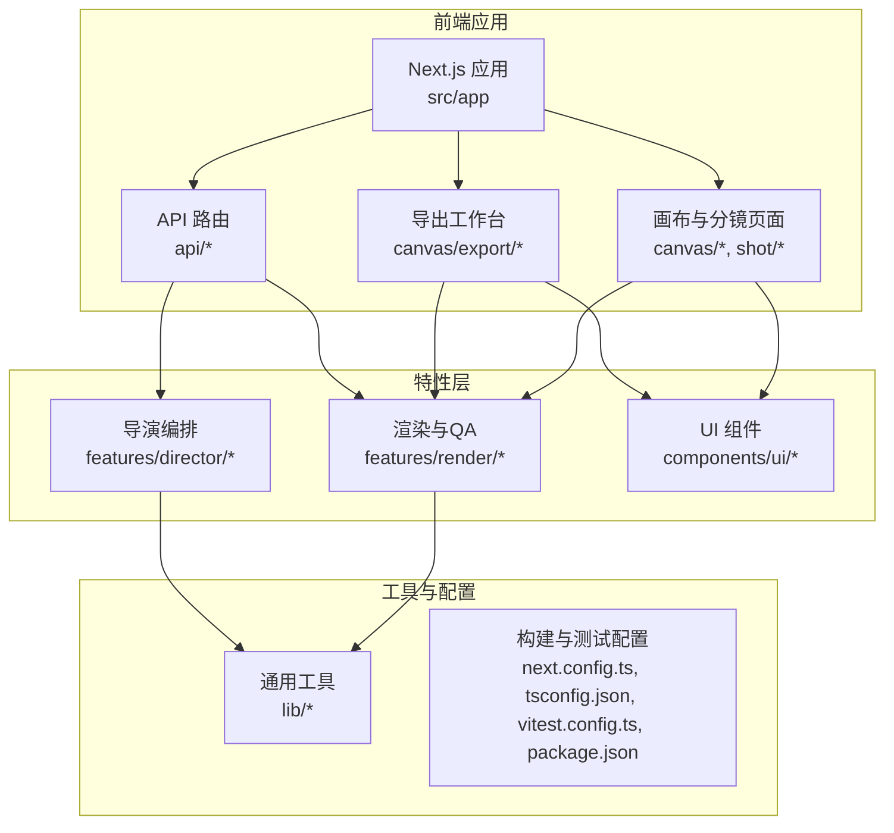
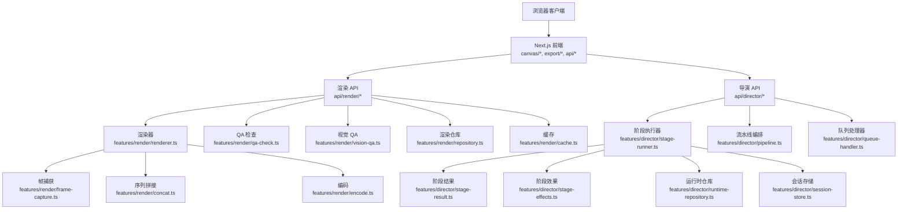
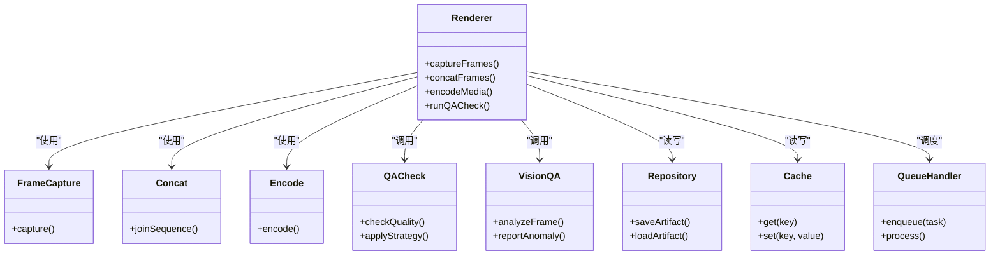
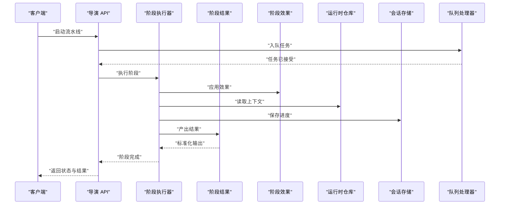
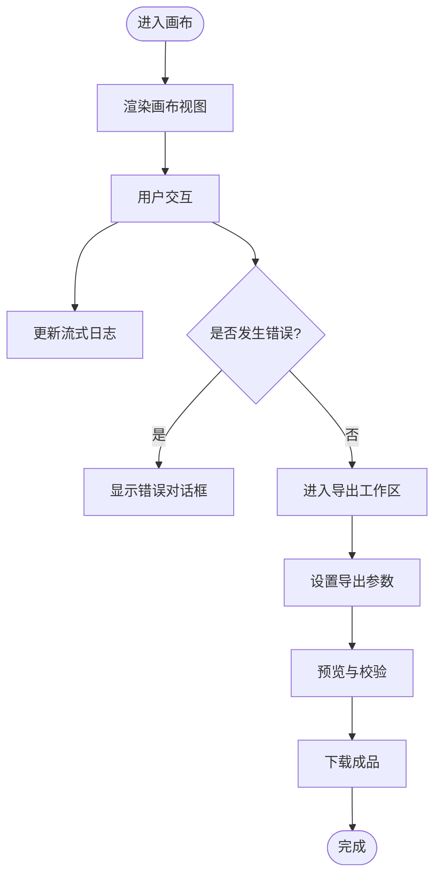
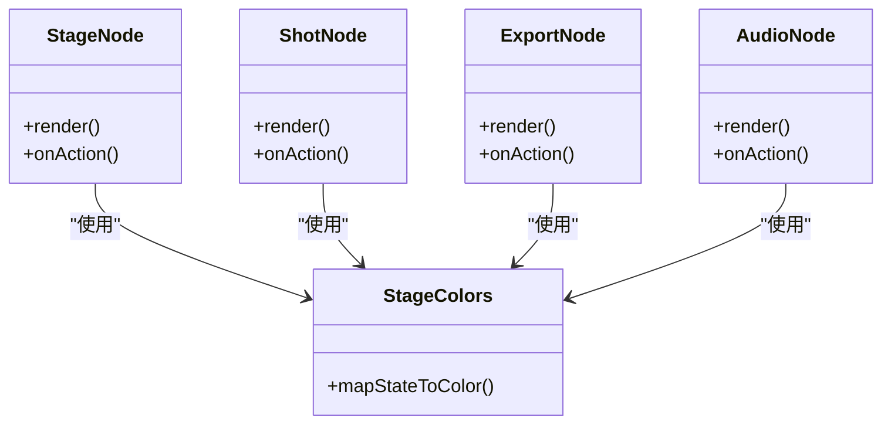
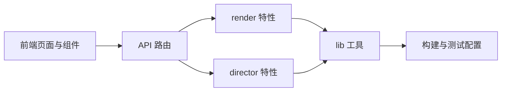

# 视觉质量保证

<cite>
**本文引用的文件**   
- [README.md](file://README.md)
- [package.json](file://package.json)
- [next.config.ts](file://next.config.ts)
- [tsconfig.json](file://tsconfig.json)
- [vitest.config.ts](file://vitest.config.ts)
- [src/app/(app)/canvas/page.tsx](file://src/app/(app)/canvas/page.tsx)
- [src/app/(app)/canvas/canvas-view.tsx](file://src/app/(app)/canvas/canvas-view.tsx)
- [src/app/(app)/canvas/flow-elements.tsx](file://src/app/(app)/canvas/flow-elements.tsx)
- [src/app/(app)/canvas/streaming-log-card.tsx](file://src/app/(app)/canvas/streaming-log-card.tsx)
- [src/app/(app)/canvas/stage-error-dialog.tsx](file://src/app/(app)/canvas/stage-error-dialog.tsx)
- [src/app/(app)/canvas/export/page.tsx](file://src/app/(app)/canvas/export/page.tsx)
- [src/app/(app)/canvas/export/export-workspace.tsx](file://src/app/(app)/canvas/export/export-workspace.tsx)
- [src/app/(app)/canvas/export/export-api.ts](file://src/app/(app)/canvas/export/export-api.ts)
- [src/app/(app)/canvas/export/export-view-model.ts](file://src/app/(app)/canvas/export/export-view-model.ts)
- [src/app/(app)/canvas/shot/[id]/page.tsx](file://src/app/(app)/canvas/shot/[id]/page.tsx)
- [src/app/(app)/canvas/shot/[id]/shot-detail.tsx](file://src/app/(app)/canvas/shot/[id]/shot-detail.tsx)
- [src/app/(app)/canvas/shot/[id]/shot-panels.tsx](file://src/app/(app)/canvas/shot/[id]/shot-panels.tsx)
- [src/app/(app)/canvas/shot/[id]/shot-api.ts](file://src/app/(app)/canvas/shot/[id]/shot-api.ts)
- [src/app/(app)/canvas/shot/[id]/shot-server-data.ts](file://src/app/(app)/canvas/shot/[id]/shot-server-data.ts)
- [src/app/api/render/route.ts](file://src/app/api/render/route.ts)
- [src/app/api/render/export/route.ts](file://src/app/api/render/export/route.ts)
- [src/app/api/director/pipeline/route.ts](file://src/app/api/director/pipeline/route.ts)
- [src/app/api/director/stage/route.ts](file://src/app/api/director/stage/route.ts)
- [src/app/api/director/stream/[nodeId]/route.ts](file://src/app/api/director/stream/[nodeId]/route.ts)
- [src/features/render/renderer.ts](file://src/features/render/renderer.ts)
- [src/features/render/qa-check.ts](file://src/features/render/qa-check.ts)
- [src/features/render/vision-qa.ts](file://src/features/render/vision-qa.ts)
- [src/features/render/repository.ts](file://src/features/render/repository.ts)
- [src/features/render/cache.ts](file://src/features/render/cache.ts)
- [src/features/render/frame-capture.ts](file://src/features/render/frame-capture.ts)
- [src/features/render/concat.ts](file://src/features/render/concat.ts)
- [src/features/render/encode.ts](file://src/features/render/encode.ts)
- [src/features/render/queue-handler.ts](file://src/features/render/queue-handler.ts)
- [src/features/render/types.ts](file://src/features/render/types.ts)
- [src/features/director/stage-runner.ts](file://src/features/director/stage-runner.ts)
- [src/features/director/stage-result.ts](file://src/features/director/stage-result.ts)
- [src/features/director/stage-effects.ts](file://src/features/director/stage-effects.ts)
- [src/features/director/runtime-repository.ts](file://src/features/director/runtime-repository.ts)
- [src/features/director/session-store.ts](file://src/features/director/session-store.ts)
- [src/features/director/advance.ts](file://src/features/director/advance.ts)
- [src/features/director/pipeline.ts](file://src/features/director/pipeline.ts)
- [src/features/director/queue-handler.ts](file://src/features/director/queue-handler.ts)
- [src/features/director/types.ts](file://src/features/director/types.ts)
- [src/components/ui/node/stage-node.tsx](file://src/components/ui/node/stage-node.tsx)
- [src/components/ui/node/stage-colors.ts](file://src/components/ui/node/stage-colors.ts)
- [src/components/ui/node/shot-node.tsx](file://src/components/ui/node/shot-node.tsx)
- [src/components/ui/node/export-node.tsx](file://src/components/ui/node/export-node.tsx)
- [src/components/ui/node/audio-node.tsx](file://src/components/ui/node/audio-node.tsx)
- [src/lib/utils.ts](file://src/lib/utils.ts)
</cite>

## 目录
1. [简介](#简介)
2. [项目结构](#项目结构)
3. [核心组件](#核心组件)
4. [架构总览](#架构总览)
5. [详细组件分析](#详细组件分析)
6. [依赖关系分析](#依赖关系分析)
7. [性能考量](#性能考量)
8. [故障排查指南](#故障排查指南)
9. [结论](#结论)
10. [附录](#附录)

## 简介
本仓库是一个面向“视觉质量保证”的前端与后端一体化工程，围绕视频制作流水线中的导演编排、渲染输出与质量检查（含视觉 QA）展开。前端基于 Next.js App Router，提供画布编辑器、分镜详情、导出工作台等页面；后端通过 API 路由暴露渲染、导演流水线、流式日志等能力；业务逻辑集中在 features 层，涵盖渲染器、QA 检查、导演阶段执行、队列处理与存储适配等。整体目标是确保从画面生成到最终输出的质量可控、可观测、可追溯。

## 项目结构
- 应用入口与路由：src/app 下按功能划分页面与 API 路由，采用 Next.js App Router 的目录约定。
- 组件库：src/components/ui 提供通用 UI 与节点组件（舞台、分镜、导出、音频等）。
- 特性模块：src/features 按领域拆分，render 负责渲染与 QA，director 负责导演编排与阶段推进，audio/artifacts/navigation 等辅助能力。
- 工具与配置：src/lib 提供通用工具、hooks、布局、运动、队列、存储、流式通信等；根级配置文件包括 next.config.ts、tsconfig.json、vitest.config.ts、package.json。

图表来源
- [next.config.ts:1-200](file://next.config.ts#L1-L200)
- [tsconfig.json:1-100](file://tsconfig.json#L1-L100)
- [vitest.config.ts:1-100](file://vitest.config.ts#L1-L100)
- [package.json:1-200](file://package.json#L1-L200)

章节来源
- [README.md:1-200](file://README.md#L1-L200)
- [package.json:1-200](file://package.json#L1-L200)
- [next.config.ts:1-200](file://next.config.ts#L1-L200)
- [tsconfig.json:1-100](file://tsconfig.json#L1-L100)
- [vitest.config.ts:1-100](file://vitest.config.ts#L1-L100)

## 核心组件
- 渲染器与 QA：renderer.ts 定义渲染流程与帧捕获、编码、拼接；qa-check.ts 与 vision-qa.ts 实现质量检查策略与视觉检测；repository.ts 管理渲染产物缓存与存取；cache.ts 提供缓存抽象；frame-capture.ts、concat.ts、encode.ts、queue-handler.ts 分别承担帧抓取、序列拼接、编码与队列调度。
- 导演编排：stage-runner.ts 驱动阶段执行与结果提交；stage-result.ts 封装阶段结果；stage-effects.ts 管理阶段效果；runtime-repository.ts 与 session-store.ts 管理运行时数据与会话；advance.ts、pipeline.ts、queue-handler.ts 负责推进、流水线编排与任务队列。
- 前端交互：canvas-view.tsx、flow-elements.tsx、streaming-log-card.tsx、stage-error-dialog.tsx 提供画布视图、流程图元素、流式日志与错误弹窗；export-workspace.tsx 与 export-api.ts、export-view-model.ts 构成导出工作区与接口/视图模型；shot-detail.tsx、shot-panels.tsx、shot-api.ts、shot-server-data.ts 提供分镜详情与面板。
- UI 节点：stage-node.tsx、shot-node.tsx、export-node.tsx、audio-node.tsx 以及 stage-colors.ts 提供可视化节点与颜色映射。

章节来源
- [src/features/render/renderer.ts:1-200](file://src/features/render/renderer.ts#L1-L200)
- [src/features/render/qa-check.ts:1-200](file://src/features/render/qa-check.ts#L1-L200)
- [src/features/render/vision-qa.ts:1-200](file://src/features/render/vision-qa.ts#L1-L200)
- [src/features/render/repository.ts:1-200](file://src/features/render/repository.ts#L1-L200)
- [src/features/render/cache.ts:1-200](file://src/features/render/cache.ts#L1-L200)
- [src/features/render/frame-capture.ts:1-200](file://src/features/render/frame-capture.ts#L1-L200)
- [src/features/render/concat.ts:1-200](file://src/features/render/concat.ts#L1-L200)
- [src/features/render/encode.ts:1-200](file://src/features/render/encode.ts#L1-L200)
- [src/features/render/queue-handler.ts:1-200](file://src/features/render/queue-handler.ts#L1-L200)
- [src/features/director/stage-runner.ts:1-200](file://src/features/director/stage-runner.ts#L1-L200)
- [src/features/director/stage-result.ts:1-200](file://src/features/director/stage-result.ts#L1-L200)
- [src/features/director/stage-effects.ts:1-200](file://src/features/director/stage-effects.ts#L1-L200)
- [src/features/director/runtime-repository.ts:1-200](file://src/features/director/runtime-repository.ts#L1-L200)
- [src/features/director/session-store.ts:1-200](file://src/features/director/session-store.ts#L1-L200)
- [src/features/director/advance.ts:1-200](file://src/features/director/advance.ts#L1-L200)
- [src/features/director/pipeline.ts:1-200](file://src/features/director/pipeline.ts#L1-L200)
- [src/features/director/queue-handler.ts:1-200](file://src/features/director/queue-handler.ts#L1-L200)
- [src/app/(app)/canvas/canvas-view.tsx:1-200](file://src/app/(app)/canvas/canvas-view.tsx#L1-L200)
- [src/app/(app)/canvas/flow-elements.tsx:1-200](file://src/app/(app)/canvas/flow-elements.tsx#L1-L200)
- [src/app/(app)/canvas/streaming-log-card.tsx:1-200](file://src/app/(app)/canvas/streaming-log-card.tsx#L1-L200)
- [src/app/(app)/canvas/stage-error-dialog.tsx:1-200](file://src/app/(app)/canvas/stage-error-dialog.ts#L1-L200)
- [src/app/(app)/canvas/export/export-workspace.tsx:1-200](file://src/app/(app)/canvas/export/export-workspace.tsx#L1-L200)
- [src/app/(app)/canvas/export/export-api.ts:1-200](file://src/app/(app)/canvas/export/export-api.ts#L1-L200)
- [src/app/(app)/canvas/export/export-view-model.ts:1-200](file://src/app/(app)/canvas/export/export-view-model.ts#L1-L200)
- [src/app/(app)/canvas/shot/[id]/shot-detail.tsx:1-200](file://src/app/(app)/canvas/shot/[id]/shot-detail.tsx#L1-L200)
- [src/app/(app)/canvas/shot/[id]/shot-panels.tsx:1-200](file://src/app/(app)/canvas/shot/[id]/shot-panels.tsx#L1-L200)
- [src/app/(app)/canvas/shot/[id]/shot-api.ts:1-200](file://src/app/(app)/canvas/shot/[id]/shot-api.ts#L1-L200)
- [src/app/(app)/canvas/shot/[id]/shot-server-data.ts:1-200](file://src/app/(app)/canvas/shot/[id]/shot-server-data.ts#L1-L200)
- [src/components/ui/node/stage-node.tsx:1-200](file://src/components/ui/node/stage-node.tsx#L1-L200)
- [src/components/ui/node/stage-colors.ts:1-200](file://src/components/ui/node/stage-colors.ts#L1-L200)
- [src/components/ui/node/shot-node.tsx:1-200](file://src/components/ui/node/shot-node.tsx#L1-L200)
- [src/components/ui/node/export-node.tsx:1-200](file://src/components/ui/node/export-node.tsx#L1-L200)
- [src/components/ui/node/audio-node.tsx:1-200](file://src/components/ui/node/audio-node.tsx#L1-L200)

## 架构总览
系统由前端页面与 API 路由组成控制面，特性层承载渲染与导演编排的核心逻辑，并通过工具层提供通用能力。渲染管线与 QA 检查贯穿从帧捕获到编码输出的全过程；导演编排通过阶段执行与状态推进协调多步骤任务；队列处理器保障并发与稳定性；存储与缓存提升性能与可恢复性。

图表来源
- [src/app/api/render/route.ts:1-200](file://src/app/api/render/route.ts#L1-L200)
- [src/app/api/render/export/route.ts:1-200](file://src/app/api/render/export/route.ts#L1-L200)
- [src/app/api/director/pipeline/route.ts:1-200](file://src/app/api/director/pipeline/route.ts#L1-L200)
- [src/app/api/director/stage/route.ts:1-200](file://src/app/api/director/stage/route.ts#L1-L200)
- [src/app/api/director/stream/[nodeId]/route.ts:1-200](file://src/app/api/director/stream/[nodeId]/route.ts#L1-L200)
- [src/features/render/renderer.ts:1-200](file://src/features/render/renderer.ts#L1-L200)
- [src/features/render/qa-check.ts:1-200](file://src/features/render/qa-check.ts#L1-L200)
- [src/features/render/vision-qa.ts:1-200](file://src/features/render/vision-qa.ts#L1-L200)
- [src/features/render/repository.ts:1-200](file://src/features/render/repository.ts#L1-L200)
- [src/features/render/cache.ts:1-200](file://src/features/render/cache.ts#L1-L200)
- [src/features/render/frame-capture.ts:1-200](file://src/features/render/frame-capture.ts#L1-L200)
- [src/features/render/concat.ts:1-200](file://src/features/render/concat.ts#L1-L200)
- [src/features/render/encode.ts:1-200](file://src/features/render/encode.ts#L1-L200)
- [src/features/director/stage-runner.ts:1-200](file://src/features/director/stage-runner.ts#L1-L200)
- [src/features/director/stage-result.ts:1-200](file://src/features/director/stage-result.ts#L1-L200)
- [src/features/director/stage-effects.ts:1-200](file://src/features/director/stage-effects.ts#L1-L200)
- [src/features/director/runtime-repository.ts:1-200](file://src/features/director/runtime-repository.ts#L1-L200)
- [src/features/director/session-store.ts:1-200](file://src/features/director/session-store.ts#L1-L200)
- [src/features/director/pipeline.ts:1-200](file://src/features/director/pipeline.ts#L1-L200)
- [src/features/director/queue-handler.ts:1-200](file://src/features/director/queue-handler.ts#L1-L200)

## 详细组件分析

### 渲染与视觉 QA 组件
- 渲染器：负责帧捕获、序列拼接与编码，串联 QA 检查与缓存策略，保证输出一致性与可回滚。
- QA 检查：统一的质量检查入口，支持多种策略（如亮度、对比度、分辨率），并与视觉 QA 集成进行图像级校验。
- 视觉 QA：基于图像特征或模型判断的画面质量检测，用于发现异常帧或不符合规范的片段。
- 仓库与缓存：管理渲染产物与中间结果的持久化与检索，结合缓存减少重复计算。
- 帧捕获、拼接、编码：分别处理不同阶段的媒体操作，确保时序正确与格式兼容。
- 队列处理器：对渲染任务进行排队与并发控制，避免资源争用与过载。

图表来源
- [src/features/render/renderer.ts:1-200](file://src/features/render/renderer.ts#L1-L200)
- [src/features/render/qa-check.ts:1-200](file://src/features/render/qa-check.ts#L1-L200)
- [src/features/render/vision-qa.ts:1-200](file://src/features/render/vision-qa.ts#L1-L200)
- [src/features/render/repository.ts:1-200](file://src/features/render/repository.ts#L1-L200)
- [src/features/render/cache.ts:1-200](file://src/features/render/cache.ts#L1-L200)
- [src/features/render/frame-capture.ts:1-200](file://src/features/render/frame-capture.ts#L1-L200)
- [src/features/render/concat.ts:1-200](file://src/features/render/concat.ts#L1-L200)
- [src/features/render/encode.ts:1-200](file://src/features/render/encode.ts#L1-L200)
- [src/features/render/queue-handler.ts:1-200](file://src/features/render/queue-handler.ts#L1-L200)

章节来源
- [src/features/render/renderer.ts:1-200](file://src/features/render/renderer.ts#L1-L200)
- [src/features/render/qa-check.ts:1-200](file://src/features/render/qa-check.ts#L1-L200)
- [src/features/render/vision-qa.ts:1-200](file://src/features/render/vision-qa.ts#L1-L200)
- [src/features/render/repository.ts:1-200](file://src/features/render/repository.ts#L1-L200)
- [src/features/render/cache.ts:1-200](file://src/features/render/cache.ts#L1-L200)
- [src/features/render/frame-capture.ts:1-200](file://src/features/render/frame-capture.ts#L1-L200)
- [src/features/render/concat.ts:1-200](file://src/features/render/concat.ts#L1-L200)
- [src/features/render/encode.ts:1-200](file://src/features/render/encode.ts#L1-L200)
- [src/features/render/queue-handler.ts:1-200](file://src/features/render/queue-handler.ts#L1-L200)

### 导演编排与阶段执行组件
- 阶段执行器：驱动各阶段运行，收集并合并结果，处理副作用与错误。
- 阶段结果：标准化阶段输出，便于后续阶段消费与审计。
- 阶段效果：在阶段间注入行为（如转场、滤镜、提示词增强）。
- 运行时仓库与会话存储：维护执行上下文与状态，支持断点续跑与回放。
- 推进与流水线：根据规则推进阶段，编排复杂的多步流程。
- 队列处理器：对导演任务进行排队与优先级管理。

图表来源
- [src/app/api/director/pipeline/route.ts:1-200](file://src/app/api/director/pipeline/route.ts#L1-L200)
- [src/app/api/director/stage/route.ts:1-200](file://src/app/api/director/stage/route.ts#L1-L200)
- [src/features/director/stage-runner.ts:1-200](file://src/features/director/stage-runner.ts#L1-L200)
- [src/features/director/stage-result.ts:1-200](file://src/features/director/stage-result.ts#L1-L200)
- [src/features/director/stage-effects.ts:1-200](file://src/features/director/stage-effects.ts#L1-L200)
- [src/features/director/runtime-repository.ts:1-200](file://src/features/director/runtime-repository.ts#L1-L200)
- [src/features/director/session-store.ts:1-200](file://src/features/director/session-store.ts#L1-L200)
- [src/features/director/pipeline.ts:1-200](file://src/features/director/pipeline.ts#L1-L200)
- [src/features/director/queue-handler.ts:1-200](file://src/features/director/queue-handler.ts#L1-L200)

章节来源
- [src/app/api/director/pipeline/route.ts:1-200](file://src/app/api/director/pipeline/route.ts#L1-L200)
- [src/app/api/director/stage/route.ts:1-200](file://src/app/api/director/stage/route.ts#L1-L200)
- [src/features/director/stage-runner.ts:1-200](file://src/features/director/stage-runner.ts#L1-L200)
- [src/features/director/stage-result.ts:1-200](file://src/features/director/stage-result.ts#L1-L200)
- [src/features/director/stage-effects.ts:1-200](file://src/features/director/stage-effects.ts#L1-L200)
- [src/features/director/runtime-repository.ts:1-200](file://src/features/director/runtime-repository.ts#L1-L200)
- [src/features/director/session-store.ts:1-200](file://src/features/director/session-store.ts#L1-L200)
- [src/features/director/pipeline.ts:1-200](file://src/features/director/pipeline.ts#L1-L200)
- [src/features/director/queue-handler.ts:1-200](file://src/features/director/queue-handler.ts#L1-L200)

### 前端画布与导出工作区
- 画布视图：展示流程图与节点，支持交互与状态同步。
- 流式日志：实时显示执行日志，提升可观测性。
- 错误对话框：集中展示阶段错误与修复建议。
- 导出工作区：管理导出参数、预览与下载，对接导出 API 与视图模型。
- 分镜详情与面板：展示分镜信息、属性与操作面板，对接分镜 API 与服务端数据。

图表来源
- [src/app/(app)/canvas/canvas-view.tsx:1-200](file://src/app/(app)/canvas/canvas-view.tsx#L1-L200)
- [src/app/(app)/canvas/flow-elements.tsx:1-200](file://src/app/(app)/canvas/flow-elements.tsx#L1-L200)
- [src/app/(app)/canvas/streaming-log-card.tsx:1-200](file://src/app/(app)/canvas/streaming-log-card.tsx#L1-L200)
- [src/app/(app)/canvas/stage-error-dialog.tsx:1-200](file://src/app/(app)/canvas/stage-error-dialog.ts#L1-L200)
- [src/app/(app)/canvas/export/export-workspace.tsx:1-200](file://src/app/(app)/canvas/export/export-workspace.tsx#L1-L200)
- [src/app/(app)/canvas/export/export-api.ts:1-200](file://src/app/(app)/canvas/export/export-api.ts#L1-L200)
- [src/app/(app)/canvas/export/export-view-model.ts:1-200](file://src/app/(app)/canvas/export/export-view-model.ts#L1-L200)
- [src/app/(app)/canvas/shot/[id]/shot-detail.tsx:1-200](file://src/app/(app)/canvas/shot/[id]/shot-detail.tsx#L1-L200)
- [src/app/(app)/canvas/shot/[id]/shot-panels.tsx:1-200](file://src/app/(app)/canvas/shot/[id]/shot-panels.tsx#L1-L200)
- [src/app/(app)/canvas/shot/[id]/shot-api.ts:1-200](file://src/app/(app)/canvas/shot/[id]/shot-api.ts#L1-L200)
- [src/app/(app)/canvas/shot/[id]/shot-server-data.ts:1-200](file://src/app/(app)/canvas/shot/[id]/shot-server-data.ts#L1-L200)

章节来源
- [src/app/(app)/canvas/canvas-view.tsx:1-200](file://src/app/(app)/canvas/canvas-view.tsx#L1-L200)
- [src/app/(app)/canvas/flow-elements.tsx:1-200](file://src/app/(app)/canvas/flow-elements.tsx#L1-L200)
- [src/app/(app)/canvas/streaming-log-card.tsx:1-200](file://src/app/(app)/canvas/streaming-log-card.tsx#L1-L200)
- [src/app/(app)/canvas/stage-error-dialog.tsx:1-200](file://src/app/(app)/canvas/stage-error-dialog.ts#L1-L200)
- [src/app/(app)/canvas/export/export-workspace.tsx:1-200](file://src/app/(app)/canvas/export/export-workspace.tsx#L1-L200)
- [src/app/(app)/canvas/export/export-api.ts:1-200](file://src/app/(app)/canvas/export/export-api.ts#L1-L200)
- [src/app/(app)/canvas/export/export-view-model.ts:1-200](file://src/app/(app)/canvas/export/export-view-model.ts#L1-L200)
- [src/app/(app)/canvas/shot/[id]/shot-detail.tsx:1-200](file://src/app/(app)/canvas/shot/[id]/shot-detail.tsx#L1-L200)
- [src/app/(app)/canvas/shot/[id]/shot-panels.tsx:1-200](file://src/app/(app)/canvas/shot/[id]/shot-panels.tsx#L1-L200)
- [src/app/(app)/canvas/shot/[id]/shot-api.ts:1-200](file://src/app/(app)/canvas/shot/[id]/shot-api.ts#L1-L200)
- [src/app/(app)/canvas/shot/[id]/shot-server-data.ts:1-200](file://src/app/(app)/canvas/shot/[id]/shot-server-data.ts#L1-L200)

### UI 节点与颜色映射
- 节点组件：舞台、分镜、导出、音频节点提供统一的可视化与交互能力。
- 颜色映射：为不同阶段与状态提供一致的视觉反馈，提升可读性。

图表来源
- [src/components/ui/node/stage-node.tsx:1-200](file://src/components/ui/node/stage-node.tsx#L1-L200)
- [src/components/ui/node/shot-node.tsx:1-200](file://src/components/ui/node/shot-node.tsx#L1-L200)
- [src/components/ui/node/export-node.tsx:1-200](file://src/components/ui/node/export-node.tsx#L1-L200)
- [src/components/ui/node/audio-node.tsx:1-200](file://src/components/ui/node/audio-node.tsx#L1-L200)
- [src/components/ui/node/stage-colors.ts:1-200](file://src/components/ui/node/stage-colors.ts#L1-L200)

章节来源
- [src/components/ui/node/stage-node.tsx:1-200](file://src/components/ui/node/stage-node.tsx#L1-L200)
- [src/components/ui/node/shot-node.tsx:1-200](file://src/components/ui/node/shot-node.tsx#L1-L200)
- [src/components/ui/node/export-node.tsx:1-200](file://src/components/ui/node/export-node.tsx#L1-L200)
- [src/components/ui/node/audio-node.tsx:1-200](file://src/components/ui/node/audio-node.tsx#L1-L200)
- [src/components/ui/node/stage-colors.ts:1-200](file://src/components/ui/node/stage-colors.ts#L1-L200)

## 依赖关系分析
- 前端依赖特性层：页面与组件通过 API 路由调用 render 与 director 特性模块，形成清晰的边界。
- 特性层内部解耦：render 与 director 各自独立，通过类型与接口契约协作，降低耦合。
- 工具层支撑：lib/utils 与各类工具模块被特性层广泛复用，提高一致性。
- 外部依赖：Next.js 框架、构建与测试工具链（Vitest）、TypeScript 编译配置。

图表来源
- [src/app/(app)/canvas/page.tsx:1-200](file://src/app/(app)/canvas/page.tsx#L1-L200)
- [src/app/api/render/route.ts:1-200](file://src/app/api/render/route.ts#L1-L200)
- [src/app/api/director/pipeline/route.ts:1-200](file://src/app/api/director/pipeline/route.ts#L1-L200)
- [src/features/render/renderer.ts:1-200](file://src/features/render/renderer.ts#L1-L200)
- [src/features/director/stage-runner.ts:1-200](file://src/features/director/stage-runner.ts#L1-L200)
- [src/lib/utils.ts:1-200](file://src/lib/utils.ts#L1-L200)
- [next.config.ts:1-200](file://next.config.ts#L1-L200)
- [vitest.config.ts:1-200](file://vitest.config.ts#L1-L200)
- [tsconfig.json:1-200](file://tsconfig.json#L1-L200)

章节来源
- [src/app/(app)/canvas/page.tsx:1-200](file://src/app/(app)/canvas/page.tsx#L1-L200)
- [src/app/api/render/route.ts:1-200](file://src/app/api/render/route.ts#L1-L200)
- [src/app/api/director/pipeline/route.ts:1-200](file://src/app/api/director/pipeline/route.ts#L1-L200)
- [src/features/render/renderer.ts:1-200](file://src/features/render/renderer.ts#L1-L200)
- [src/features/director/stage-runner.ts:1-200](file://src/features/director/stage-runner.ts#L1-L200)
- [src/lib/utils.ts:1-200](file://src/lib/utils.ts#L1-L200)
- [next.config.ts:1-200](file://next.config.ts#L1-L200)
- [vitest.config.ts:1-200](file://vitest.config.ts#L1-L200)
- [tsconfig.json:1-200](file://tsconfig.json#L1-L200)

## 性能考量
- 渲染缓存：利用 cache.ts 与 repository.ts 减少重复计算与 IO 开销。
- 队列并发：通过 queue-handler.ts 控制并发度，避免资源竞争与内存峰值。
- 帧捕获优化：frame-capture.ts 应尽量减少不必要的重绘与采样。
- 编码并行：encode.ts 可在安全范围内并行处理片段以提升吞吐。
- 前端渲染：canvas-view.tsx 与 flow-elements.tsx 应避免频繁重排与过度更新。

[本节为通用指导，不直接分析具体文件]

## 故障排查指南
- 阶段错误：stage-error-dialog.tsx 集中展示错误信息与修复建议，结合 streaming-log-card.tsx 的流式日志定位问题。
- 渲染失败：检查 renderer.ts 的帧捕获与编码链路，确认 repository.ts 与 cache.ts 的状态一致性。
- 导演推进失败：查看 stage-runner.ts 的阶段结果与 effects 副作用，核对 runtime-repository.ts 与 session-store.ts 的数据完整性。
- 队列阻塞：监控 queue-handler.ts 的任务积压与重试策略，必要时调整并发与超时。

章节来源
- [src/app/(app)/canvas/stage-error-dialog.tsx:1-200](file://src/app/(app)/canvas/stage-error-dialog.tsx#L1-L200)
- [src/app/(app)/canvas/streaming-log-card.tsx:1-200](file://src/app/(app)/canvas/streaming-log-card.tsx#L1-L200)
- [src/features/render/renderer.ts:1-200](file://src/features/render/renderer.ts#L1-L200)
- [src/features/render/repository.ts:1-200](file://src/features/render/repository.ts#L1-L200)
- [src/features/render/cache.ts:1-200](file://src/features/render/cache.ts#L1-L200)
- [src/features/director/stage-runner.ts:1-200](file://src/features/director/stage-runner.ts#L1-L200)
- [src/features/director/stage-result.ts:1-200](file://src/features/director/stage-result.ts#L1-L200)
- [src/features/director/stage-effects.ts:1-200](file://src/features/director/stage-effects.ts#L1-L200)
- [src/features/director/runtime-repository.ts:1-200](file://src/features/director/runtime-repository.ts#L1-L200)
- [src/features/director/session-store.ts:1-200](file://src/features/director/session-store.ts#L1-L200)
- [src/features/director/queue-handler.ts:1-200](file://src/features/director/queue-handler.ts#L1-L200)

## 结论
该工程以清晰的分层与模块化设计实现了视觉质量保证的全链路能力：前端提供直观的画布与导出体验，后端通过 API 路由协调渲染与导演编排，特性层聚焦核心业务逻辑，工具层提供通用支撑。通过 QA 检查与视觉 QA 的深度融合，系统在输出前即可发现并修正质量问题，确保最终成品的稳定性与一致性。

[本节为总结性内容，不直接分析具体文件]

## 附录
- 构建与测试：next.config.ts、tsconfig.json、vitest.config.ts、package.json 定义了开发、构建与测试环境。
- 文档与规范：docs 目录下包含审计、约定、设计、问题跟踪与运维相关文档，有助于团队协作与知识沉淀。

章节来源
- [next.config.ts:1-200](file://next.config.ts#L1-L200)
- [tsconfig.json:1-200](file://tsconfig.json#L1-L200)
- [vitest.config.ts:1-200](file://vitest.config.ts#L1-L200)
- [package.json:1-200](file://package.json#L1-L200)
- [docs/audits/README.md:1-200](file://docs/audits/README.md#L1-L200)
- [docs/conventions/README.md:1-200](file://docs/conventions/README.md#L1-L200)
- [docs/designs/README.md:1-200](file://docs/designs/README.md#L1-L200)
- [docs/issues/README.md:1-200](file://docs/issues/README.md#L1-L200)
- [docs/ops/README.md:1-200](file://docs/ops/README.md#L1-L200)
- [docs/plans/README.md:1-200](file://docs/plans/README.md#L1-L200)
- [docs/specs/README.md:1-200](file://docs/specs/README.md#L1-L200)
- [docs/superpowers/plans/2026-07-24-issues-11-13-gemini.md:1-200](file://docs/superpowers/plans/2026-07-24-issues-11-13-gemini.md#L1-L200)
- [docs/superpowers/specs/README.md:1-200](file://docs/superpowers/specs/README.md#L1-L200)
- [docs/updates/README.md:1-200](file://docs/updates/README.md#L1-L200)