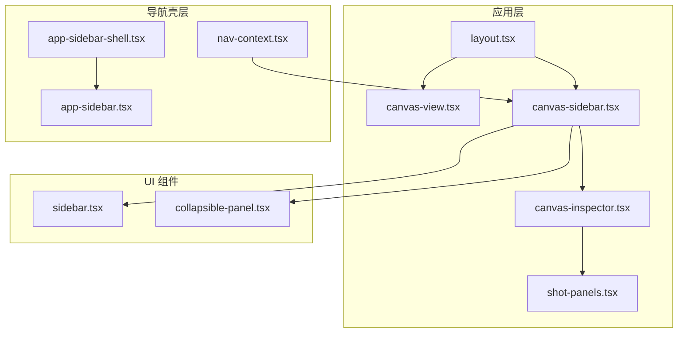
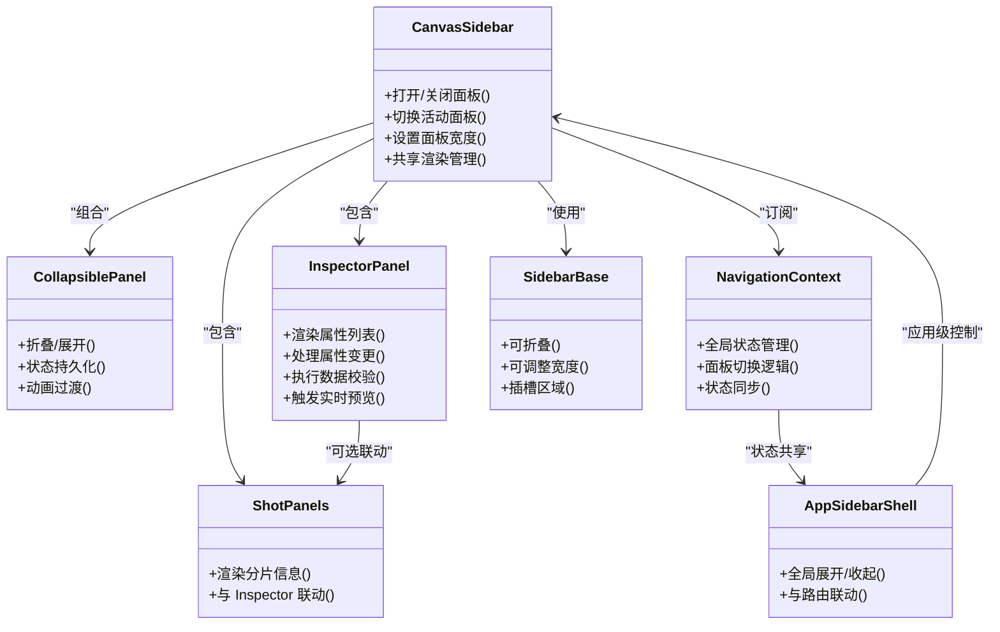
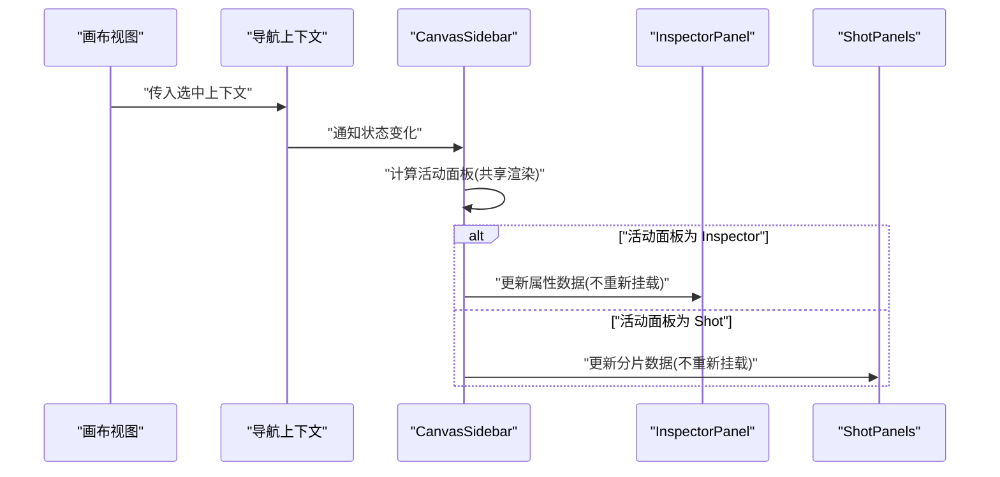
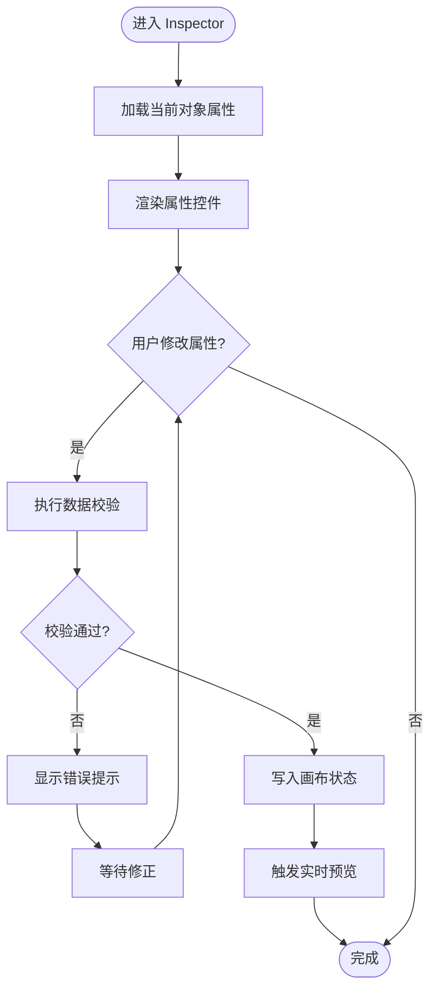
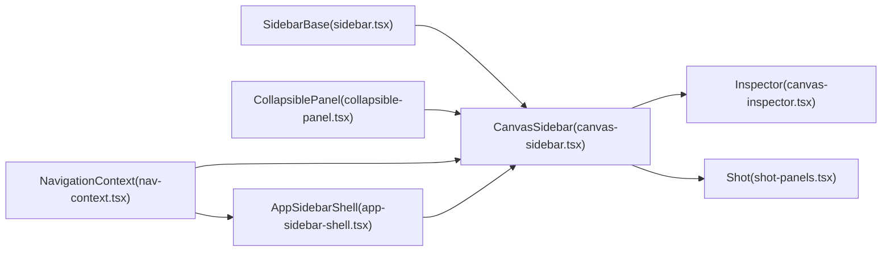

# 侧边栏面板

<cite>
**本文引用的文件**   
- [canvas-sidebar.tsx](file://src/app/canvas/canvas-sidebar.tsx)
- [canvas-inspector.tsx](file://src/app/canvas/canvas-inspector.tsx)
- [shot-panels.tsx](file://src/app/canvas/shot/[id]/shot-panels.tsx)
- [sidebar.tsx](file://src/components/ui/sidebar.tsx)
- [app-sidebar-shell.tsx](file://src/features/navigation/app-sidebar-shell.tsx)
- [app-sidebar.tsx](file://src/features/navigation/app-sidebar.tsx)
- [layout.tsx](file://src/app/canvas/layout.tsx)
- [canvas-view.tsx](file://src/app/canvas/canvas-view.tsx)
- [collapsible-panel.tsx](file://src/features/navigation/collapsible-panel.tsx)
- [nav-context.tsx](file://src/features/navigation/nav-context.tsx)
</cite>

## 更新摘要
**所做更改**   
- 更新了架构总览以反映新的共享布局渲染模式
- 新增了可折叠面板组件的详细说明
- 更新了状态管理模式，从重新挂载改为共享渲染
- 增强了性能优化章节，包含新的渲染策略
- 添加了新的导航上下文管理说明

## 目录
1. [简介](#简介)
2. [项目结构](#项目结构)
3. [核心组件](#核心组件)
4. [架构总览](#架构总览)
5. [详细组件分析](#详细组件分析)
6. [依赖分析](#依赖分析)
7. [性能考虑](#性能考虑)
8. [故障排查指南](#故障排查指南)
9. [结论](#结论)
10. [附录](#附录) 

## 简介
本文件面向画布编辑器的"侧边栏面板"子系统，聚焦以下目标：
- 解释侧边栏的组件架构与职责边界
- 说明面板切换逻辑（Inspector、Shot 面板等）
- 深入剖析 Inspector 面板的属性绑定机制、实时预览与数据验证
- 提供扩展指南：如何新增属性面板、实现自定义属性编辑器、处理双向绑定
- 总结状态同步策略、性能优化与用户体验设计要点

**更新** 基于最新的重构，现在采用共享布局渲染模式，避免了每次导航时的组件重新挂载，显著提升了性能和用户体验。

## 项目结构
侧边栏相关代码主要分布在应用层与 UI 组件层：
- 应用层（页面与布局）
  - 画布布局与入口：[layout.tsx](file://src/app/canvas/layout.tsx)、[canvas-view.tsx](file://src/app/canvas/canvas-view.tsx)
  - 侧边栏容器与 Inspector：[canvas-sidebar.tsx](file://src/app/canvas/canvas-sidebar.tsx)、[canvas-inspector.tsx](file://src/app/canvas/canvas-inspector.tsx)
  - Shot 详情子面板：[shot-panels.tsx](file://src/app/canvas/shot/[id]/shot-panels.tsx)
- UI 基础组件
  - 通用侧边栏骨架：[sidebar.tsx](file://src/components/ui/sidebar.tsx)
  - 可折叠面板组件：[collapsible-panel.tsx](file://src/features/navigation/collapsible-panel.tsx)
- 导航壳层
  - 全局侧边栏壳层：[app-sidebar-shell.tsx](file://src/features/navigation/app-sidebar-shell.tsx)、[app-sidebar.tsx](file://src/features/navigation/app-sidebar.tsx)
  - 导航上下文管理：[nav-context.tsx](file://src/features/navigation/nav-context.tsx)

图表来源
- [layout.tsx](file://src/app/canvas/layout.tsx)
- [canvas-view.tsx](file://src/app/canvas/canvas-view.tsx)
- [canvas-sidebar.tsx](file://src/app/canvas/canvas-sidebar.tsx)
- [canvas-inspector.tsx](file://src/app/canvas/canvas-inspector.tsx)
- [shot-panels.tsx](file://src/app/canvas/shot/[id]/shot-panels.tsx)
- [sidebar.tsx](file://src/components/ui/sidebar.tsx)
- [collapsible-panel.tsx](file://src/features/navigation/collapsible-panel.tsx)
- [app-sidebar-shell.tsx](file://src/features/navigation/app-sidebar-shell.tsx)
- [app-sidebar.tsx](file://src/features/navigation/app-sidebar.tsx)
- [nav-context.tsx](file://src/features/navigation/nav-context.tsx)

章节来源
- [layout.tsx](file://src/app/canvas/layout.tsx)
- [canvas-view.tsx](file://src/app/canvas/canvas-view.tsx)
- [canvas-sidebar.tsx](file://src/app/canvas/canvas-sidebar.tsx)
- [canvas-inspector.tsx](file://src/app/canvas/canvas-inspector.tsx)
- [shot-panels.tsx](file://src/app/canvas/shot/[id]/shot-panels.tsx)
- [sidebar.tsx](file://src/components/ui/sidebar.tsx)
- [collapsible-panel.tsx](file://src/features/navigation/collapsible-panel.tsx)
- [app-sidebar-shell.tsx](file://src/features/navigation/app-sidebar-shell.tsx)
- [app-sidebar.tsx](file://src/features/navigation/app-sidebar.tsx)
- [nav-context.tsx](file://src/features/navigation/nav-context.tsx)

## 核心组件
- 侧边栏容器（Canvas Sidebar）
  - 负责承载并渲染 Inspector 与 Shot 面板，管理可见性与尺寸。
  - 通过内部状态或外部上下文驱动面板切换。
  - **更新** 现在使用共享布局渲染，避免重复挂载带来的性能开销。
- Inspector 面板（Canvas Inspector）
  - 展示当前选中节点/实体的属性集合，支持编辑与校验。
  - 与画布状态进行双向绑定，变更触发实时预览。
- 可折叠面板组件（Collapsible Panel）
  - **新增** 提供可折叠/展开的面板基础能力，支持动画过渡和状态持久化。
- 通用侧边栏骨架（Sidebar）
  - 提供可折叠、可拖拽宽度、区域划分等基础能力。
- 导航壳层（App Sidebar Shell / App Sidebar）
  - 在应用级统一侧边栏行为（如全局展开/收起、路由联动）。
- 导航上下文（Navigation Context）
  - **新增** 集中管理侧边栏的状态和导航逻辑，提供跨组件状态同步。

章节来源
- [canvas-sidebar.tsx](file://src/app/canvas/canvas-sidebar.tsx)
- [canvas-inspector.tsx](file://src/app/canvas/canvas-inspector.tsx)
- [collapsible-panel.tsx](file://src/features/navigation/collapsible-panel.tsx)
- [sidebar.tsx](file://src/components/ui/sidebar.tsx)
- [app-sidebar-shell.tsx](file://src/features/navigation/app-sidebar-shell.tsx)
- [app-sidebar.tsx](file://src/features/navigation/app-sidebar.tsx)
- [nav-context.tsx](file://src/features/navigation/nav-context.tsx)

## 架构总览
侧边栏采用"容器 + 内容 + 共享渲染"的分层模式：
- 容器层：Canvas Sidebar 作为宿主，决定何时显示哪些面板。
- 内容层：Inspector 与 Shot Panels 作为具体面板实现，各自维护局部状态并与全局状态交互。
- 基础设施：Sidebar 提供通用 UI 能力；Collapsible Panel 提供可折叠功能；导航壳层提供应用级侧边栏一致性。
- **新增** 共享渲染层：通过 nav-context 统一管理状态，避免组件重复挂载。

图表来源
- [canvas-sidebar.tsx](file://src/app/canvas/canvas-sidebar.tsx)
- [canvas-inspector.tsx](file://src/app/canvas/canvas-inspector.tsx)
- [collapsible-panel.tsx](file://src/features/navigation/collapsible-panel.tsx)
- [shot-panels.tsx](file://src/app/canvas/shot/[id]/shot-panels.tsx)
- [sidebar.tsx](file://src/components/ui/sidebar.tsx)
- [nav-context.tsx](file://src/features/navigation/nav-context.tsx)
- [app-sidebar-shell.tsx](file://src/features/navigation/app-sidebar-shell.tsx)

## 详细组件分析

### 侧边栏容器（Canvas Sidebar）
- 职责
  - 管理面板可见性（Inspector、Shot 等）
  - 控制侧边栏宽度与折叠状态
  - 将选中的上下文（如当前节点 ID）注入到各面板
  - **更新** 管理共享渲染状态，避免组件重复挂载
- 关键流程
  - 初始化时根据路由或上下文选择默认面板
  - 监听上下文变化，动态更新活动面板
  - 向子面板传递统一的 props（如 selectedId、onUpdate）
  - **新增** 通过导航上下文同步面板状态

图表来源
- [canvas-sidebar.tsx](file://src/app/canvas/canvas-sidebar.tsx)
- [canvas-inspector.tsx](file://src/app/canvas/canvas-inspector.tsx)
- [shot-panels.tsx](file://src/app/canvas/shot/[id]/shot-panels.tsx)
- [nav-context.tsx](file://src/features/navigation/nav-context.tsx)

章节来源
- [canvas-sidebar.tsx](file://src/app/canvas/canvas-sidebar.tsx)
- [nav-context.tsx](file://src/features/navigation/nav-context.tsx)

### 可折叠面板组件（Collapsible Panel）
- **新增** 职责
  - 提供可折叠/展开的基础功能
  - 管理折叠状态的持久化
  - 提供平滑的动画过渡效果
  - 支持嵌套面板的层级管理
- 特性
  - 自动记忆用户的折叠偏好
  - 支持键盘快捷键操作
  - 响应式布局适配
  - 无障碍访问支持

章节来源
- [collapsible-panel.tsx](file://src/features/navigation/collapsible-panel.tsx)

### Inspector 面板（属性编辑器）
- 属性绑定机制
  - 从上下文读取当前对象的属性快照
  - 将每个属性映射为表单控件（文本、数值、开关、下拉等）
  - 通过受控组件模式维持"值—回调"的双向绑定
- 实时预览
  - 属性变更事件触发后，立即将新值写入画布状态
  - 画布视图收到变更后重绘或增量更新
- 数据验证
  - 在提交前对输入进行格式与范围校验
  - 错误提示与回滚策略保证状态一致性
- **更新** 性能优化
  - 利用共享渲染避免不必要的重新挂载
  - 增量更新属性值，减少重渲染范围

图表来源
- [canvas-inspector.tsx](file://src/app/canvas/canvas-inspector.tsx)

章节来源
- [canvas-inspector.tsx](file://src/app/canvas/canvas-inspector.tsx)

### Shot 面板（分片/镜头详情）
- 职责
  - 展示与编辑 Shot 相关信息（如名称、时长、描述等）
  - 与 Inspector 共享选中上下文，保持数据一致
- 与 Inspector 的协作
  - 当切换到 Shot 面板时，Inspector 可隐藏或降级为只读摘要
  - 两者均可触发画布状态更新，确保预览一致
- **更新** 渲染优化
  - 使用共享渲染模式，面板切换时无需重新创建实例
  - 状态持久化确保用户输入不会丢失

章节来源
- [shot-panels.tsx](file://src/app/canvas/shot/[id]/shot-panels.tsx)

### 导航上下文（Navigation Context）
- **新增** 作用
  - 集中管理侧边栏的全局状态
  - 提供跨组件的状态同步机制
  - 管理面板切换逻辑和生命周期
  - 协调多个面板之间的通信
- 状态管理
  - 活动面板状态
  - 面板展开/折叠状态
  - 用户偏好设置
  - 历史导航记录

章节来源
- [nav-context.tsx](file://src/features/navigation/nav-context.tsx)

### 通用侧边栏骨架（Sidebar）
- 能力
  - 可折叠/展开
  - 拖拽调整宽度
  - 提供插槽用于放置不同面板
- 与容器的关系
  - Canvas Sidebar 组合 Sidebar 以复用基础交互
  - **更新** 集成 Collapsible Panel 提供增强的折叠功能

章节来源
- [sidebar.tsx](file://src/components/ui/sidebar.tsx)

### 导航壳层（App Sidebar Shell / App Sidebar）
- 作用
  - 在应用级别统一管理侧边栏的全局状态（如是否展开）
  - 与路由联动，在不同页面间保持一致的侧边栏体验
- 与画布侧边栏的关系
  - 画布侧边栏可作为应用侧边栏的一个内容区域
- **更新** 状态同步
  - 通过导航上下文与应用其他部分保持状态一致

章节来源
- [app-sidebar-shell.tsx](file://src/features/navigation/app-sidebar-shell.tsx)
- [app-sidebar.tsx](file://src/features/navigation/app-sidebar.tsx)
- [nav-context.tsx](file://src/features/navigation/nav-context.tsx)

## 依赖分析
- 组件耦合
  - Canvas Sidebar 依赖 Sidebar 基础能力和 Collapsible Panel 增强功能
  - Inspector 与 Shot Panels 均依赖画布上下文（选中项、更新回调）
  - **新增** 所有面板组件都依赖 Navigation Context 进行状态同步
- 外部依赖
  - 可能依赖 UI 库（按钮、输入、弹窗等）与图标库
- 潜在循环依赖
  - 避免 Inspector 与 Shot Panels 直接互相引用，建议通过上下文或事件总线解耦
  - **更新** Navigation Context 作为单一状态源，避免循环依赖

图表来源
- [sidebar.tsx](file://src/components/ui/sidebar.tsx)
- [collapsible-panel.tsx](file://src/features/navigation/collapsible-panel.tsx)
- [canvas-sidebar.tsx](file://src/app/canvas/canvas-sidebar.tsx)
- [canvas-inspector.tsx](file://src/app/canvas/canvas-inspector.tsx)
- [shot-panels.tsx](file://src/app/canvas/shot/[id]/shot-panels.tsx)
- [nav-context.tsx](file://src/features/navigation/nav-context.tsx)
- [app-sidebar-shell.tsx](file://src/features/navigation/app-sidebar-shell.tsx)

章节来源
- [sidebar.tsx](file://src/components/ui/sidebar.tsx)
- [collapsible-panel.tsx](file://src/features/navigation/collapsible-panel.tsx)
- [canvas-sidebar.tsx](file://src/app/canvas/canvas-sidebar.tsx)
- [canvas-inspector.tsx](file://src/app/canvas/canvas-inspector.tsx)
- [shot-panels.tsx](file://src/app/canvas/shot/[id]/shot-panels.tsx)
- [nav-context.tsx](file://src/features/navigation/nav-context.tsx)
- [app-sidebar-shell.tsx](file://src/features/navigation/app-sidebar-shell.tsx)

## 性能考虑
- 渲染优化
  - **更新** 使用共享布局渲染，避免每次导航时重新挂载组件
  - 仅对活动面板进行完整渲染，非活动面板懒加载
  - 对大列表属性使用虚拟滚动或分页
- 状态更新
  - 批量合并属性变更，减少不必要的重渲染
  - 防抖/节流高频输入（如文本框、滑块）
  - **新增** 通过 Navigation Context 集中管理状态，减少状态传播开销
- 预览策略
  - 增量更新而非全量重绘
  - 对耗时操作使用 Web Worker 或异步队列
- 内存管理
  - 离开面板时清理订阅与定时器
  - 缓存常用只读数据，避免重复计算
  - **新增** 面板状态持久化，避免重复初始化
- **新增** 动画优化
  - 使用 CSS transform 和 opacity 实现流畅的折叠动画
  - 避免触发布局重排的样式操作

## 故障排查指南
- 属性不生效
  - 检查双向绑定是否正确挂载
  - 确认变更事件是否触发了状态更新
  - **新增** 验证 Navigation Context 状态是否正确同步
- 预览卡顿
  - 定位是否存在频繁全量重绘
  - 引入防抖/节流与增量更新
  - **新增** 检查是否有不必要的组件重新挂载
- 校验失败导致崩溃
  - 增加空值与类型守卫
  - 对异常路径添加兜底与回滚
- 面板无法切换
  - 检查活动面板状态是否与上下文一致
  - 确认路由或事件监听未被意外移除
  - **新增** 验证 Navigation Context 的切换逻辑
- **新增** 折叠状态异常
  - 检查 Collapsible Panel 的状态持久化配置
  - 验证本地存储的读写权限
  - 确认动画过渡是否正常执行

## 结论
侧边栏面板通过清晰的容器/内容分层与通用的 Sidebar 基础能力，实现了可扩展、高性能且易用的属性编辑体验。**更新后的架构**通过引入共享渲染模式和 Navigation Context，显著提升了性能和用户体验。Inspector 的面属性绑定、实时预览与数据验证构成了核心闭环；Shot 面板则丰富了业务场景。Collapsible Panel 提供了强大的可折叠功能。遵循本文的扩展指南与优化建议，可快速新增属性面板与自定义编辑器，并保持整体一致的用户体验。

## 附录

### 扩展指南：新增属性面板
- 步骤
  - 新建面板组件，定义属性元数据与控件映射
  - 在 Canvas Sidebar 中注册该面板，并加入切换逻辑
  - 将选中上下文与更新回调注入到新面板
  - **新增** 确保面板组件与 Navigation Context 正确集成
- 参考位置
  - 面板注册与切换：[canvas-sidebar.tsx](file://src/app/canvas/canvas-sidebar.tsx)
  - 现有面板实现范式：[canvas-inspector.tsx](file://src/app/canvas/canvas-inspector.tsx)、[shot-panels.tsx](file://src/app/canvas/shot/[id]/shot-panels.tsx)
  - **新增** 可折叠面板使用：[collapsible-panel.tsx](file://src/features/navigation/collapsible-panel.tsx)

### 自定义属性编辑器
- 步骤
  - 实现受控组件接口（value、onChange）
  - 接入数据校验（格式、范围、必填）
  - 触发变更事件，由上层写入画布状态
  - **新增** 确保与共享渲染模式兼容
- 参考位置
  - 属性编辑范式与校验流程：[canvas-inspector.tsx](file://src/app/canvas/canvas-inspector.tsx)

### 双向绑定最佳实践
- 使用受控组件，确保"单一数据源"
- 变更事件去抖，避免过度更新
- 对复杂对象采用不可变更新，便于追踪差异
- **新增** 通过 Navigation Context 管理状态，避免重复更新

### 样式定制方案
- 主题变量
  - 通过 CSS 变量覆盖侧边栏背景、边框、字号等
- 组件级样式
  - 基于 Sidebar 提供的插槽与类名进行局部覆盖
  - **新增** 利用 Collapsible Panel 的样式钩子定制折叠动画
- 参考位置
  - 通用侧边栏样式入口：[sidebar.tsx](file://src/components/ui/sidebar.tsx)
  - **新增** 可折叠面板样式：[collapsible-panel.tsx](file://src/features/navigation/collapsible-panel.tsx)

### 状态管理最佳实践
- **新增** 使用 Navigation Context 集中管理侧边栏状态
- 避免在组件内部维护重复的状态
- 利用 React.memo 和 useMemo 优化性能
- 合理使用 useEffect 清理副作用

### 性能监控与调试
- **新增** 使用 React DevTools 检查组件重新挂载情况
- 监控 Navigation Context 的状态变化频率
- 使用 Performance API 分析渲染性能
- 定期检查内存泄漏和未清理的订阅