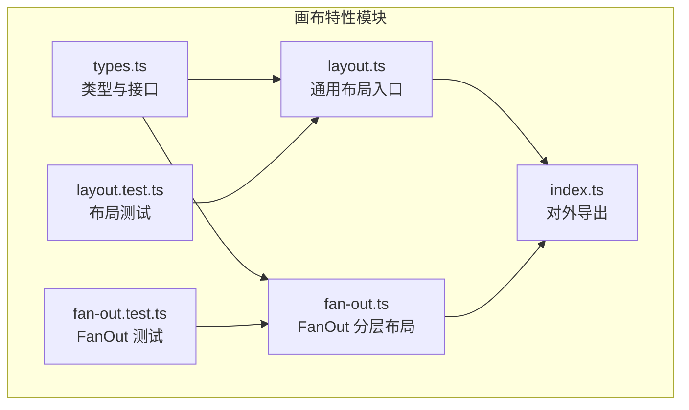
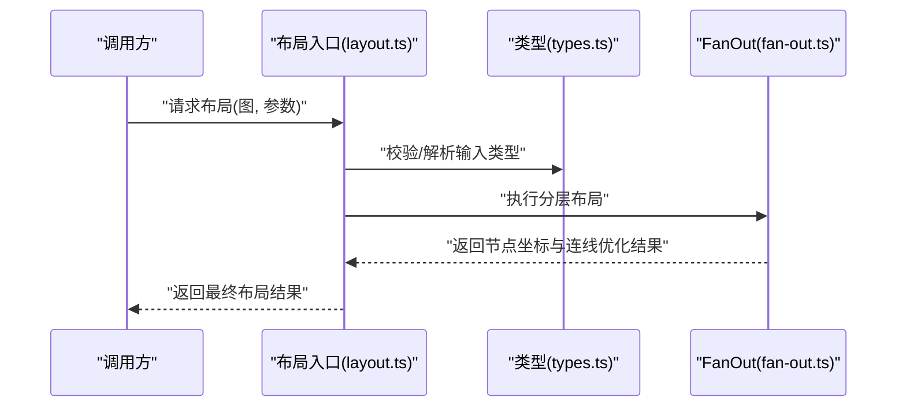
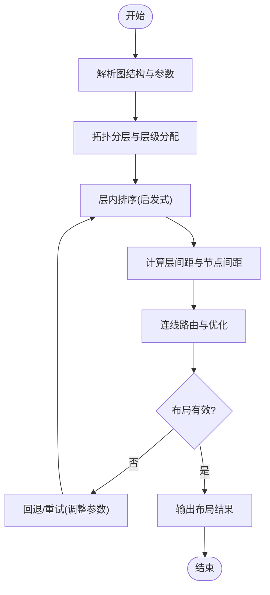
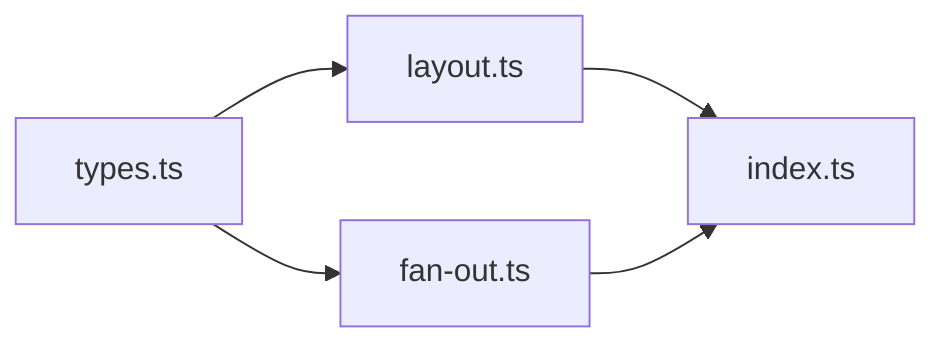

# 布局算法

<cite>
**本文引用的文件**   
- [src/features/canvas/layout.ts](file://src/features/canvas/layout.ts)
- [src/features/canvas/fan-out.ts](file://src/features/canvas/fan-out.ts)
- [src/features/canvas/types.ts](file://src/features/canvas/types.ts)
- [src/features/canvas/index.ts](file://src/features/canvas/index.ts)
- [src/features/canvas/layout.test.ts](file://src/features/canvas/layout.test.ts)
- [src/features/canvas/fan-out.test.ts](file://src/features/canvas/fan-out.test.ts)
</cite>

## 目录
1. [简介](#简介)
2. [项目结构](#项目结构)
3. [核心组件](#核心组件)
4. [架构总览](#架构总览)
5. [详细组件分析](#详细组件分析)
6. [依赖分析](#依赖分析)
7. [性能考虑](#性能考虑)
8. [故障排查指南](#故障排查指南)
9. [结论](#结论)
10. [附录](#附录)

## 简介
本文件面向画布编辑器的自动布局子系统，系统性说明其实现原理、节点排列策略与空间分配机制。重点覆盖：
- FanOut 分层布局的分层逻辑、节点间距计算与连接线优化
- 布局算法的输入输出模型、可扩展点与自定义规则
- 增量更新策略、缓存机制与性能优化建议
- 不同场景下的配置与调优实践

## 项目结构
布局相关代码集中在 features/canvas 模块中，采用“类型定义 + 算法实现 + 测试”的组织方式，便于扩展与维护。

图表来源
- [src/features/canvas/types.ts](file://src/features/canvas/types.ts)
- [src/features/canvas/layout.ts](file://src/features/canvas/layout.ts)
- [src/features/canvas/fan-out.ts](file://src/features/canvas/fan-out.ts)
- [src/features/canvas/index.ts](file://src/features/canvas/index.ts)
- [src/features/canvas/layout.test.ts](file://src/features/canvas/layout.test.ts)
- [src/features/canvas/fan-out.test.ts](file://src/features/canvas/fan-out.test.ts)

章节来源
- [src/features/canvas/types.ts](file://src/features/canvas/types.ts)
- [src/features/canvas/layout.ts](file://src/features/canvas/layout.ts)
- [src/features/canvas/fan-out.ts](file://src/features/canvas/fan-out.ts)
- [src/features/canvas/index.ts](file://src/features/canvas/index.ts)

## 核心组件
- 类型与数据模型（types.ts）
  - 定义节点、边、布局结果、布局参数等核心数据结构，作为布局算法的输入/输出契约。
- 通用布局入口（layout.ts）
  - 提供统一的布局编排能力，负责将图结构转换为可渲染的坐标布局，并暴露扩展点以支持自定义策略。
- FanOut 分层布局（fan-out.ts）
  - 基于有向无环图的层次化排布，按层级自上而下或自左向右放置节点，进行间距计算与连线优化。
- 对外导出（index.ts）
  - 聚合导出布局 API，供上层 UI 与业务模块调用。

章节来源
- [src/features/canvas/types.ts](file://src/features/canvas/types.ts)
- [src/features/canvas/layout.ts](file://src/features/canvas/layout.ts)
- [src/features/canvas/fan-out.ts](file://src/features/canvas/fan-out.ts)
- [src/features/canvas/index.ts](file://src/features/canvas/index.ts)

## 架构总览
下图展示布局子系统的整体交互关系：上层通过统一入口发起布局请求，内部根据策略选择具体算法（如 FanOut），最终产出节点坐标与连线信息。

图表来源
- [src/features/canvas/layout.ts](file://src/features/canvas/layout.ts)
- [src/features/canvas/fan-out.ts](file://src/features/canvas/fan-out.ts)
- [src/features/canvas/types.ts](file://src/features/canvas/types.ts)

## 详细组件分析

### 类型与数据模型（types.ts）
- 职责
  - 定义节点、边、布局结果、布局参数等核心类型，确保布局算法与上层 UI 的数据契约稳定。
- 关键要点
  - 节点包含唯一标识、尺寸、层级信息等；边描述源/目标节点及可选路由信息。
  - 布局参数涵盖方向、间距、对齐、边界等可调项。
  - 布局结果包含节点位置映射、连线路径、包围盒等信息。

章节来源
- [src/features/canvas/types.ts](file://src/features/canvas/types.ts)

### 通用布局入口（layout.ts）
- 职责
  - 提供统一的布局编排入口，负责输入校验、策略分发、结果组装与后处理。
- 设计模式
  - 策略模式：根据配置选择具体布局算法（例如 FanOut）。
  - 钩子/插件点：允许注入自定义节点排序、间距计算、连线优化等规则。
- 典型流程
  - 解析输入图与参数 -> 选择布局策略 -> 执行布局 -> 生成连线 -> 返回结果。

章节来源
- [src/features/canvas/layout.ts](file://src/features/canvas/layout.ts)

### FanOut 分层布局（fan-out.ts）
- 总体思路
  - 基于有向无环图进行拓扑分层，逐层放置节点，控制层间与层内间距，并对连线进行折线/曲线优化以减少交叉与重叠。
- 分层逻辑
  - 拓扑排序与层级划分：依据边的方向为每个节点确定最小层级，保证父节点在上/左、子节点在下/右。
  - 层内排序：结合入度/出度、固定位置约束、用户指定顺序等启发式策略，减少连线交叉。
- 间距计算
  - 层间距：由节点高度/宽度、连接端口偏移、标签与阴影等视觉因素决定。
  - 节点间距：在层内按相邻节点的投影范围与连线需求动态调整，避免重叠。
- 连线优化
  - 端口对齐：尽量使同层或相邻层的端口对齐，降低折线数量。
  - 路由简化：对长距离连线采用正交或平滑曲线，必要时引入虚拟节点缓解拥挤。
- 复杂度与稳定性
  - 时间复杂度主要受拓扑排序、层内排序与连线优化影响；在大规模图中需关注排序与连线优化的开销。
  - 确定性：在相同输入与参数下应产生一致布局，便于复现与调试。

图表来源
- [src/features/canvas/fan-out.ts](file://src/features/canvas/fan-out.ts)

章节来源
- [src/features/canvas/fan-out.ts](file://src/features/canvas/fan-out.ts)

### 对外导出（index.ts）
- 职责
  - 聚合导出布局 API，屏蔽内部实现细节，提供稳定的调用面。
- 使用建议
  - 上层仅依赖 index.ts 导出的函数与类型，避免直接耦合内部模块。

章节来源
- [src/features/canvas/index.ts](file://src/features/canvas/index.ts)

## 依赖分析
- 模块内依赖
  - layout.ts 依赖 types.ts 的类型定义，并在运行时可选择 fan-out.ts 的具体实现。
  - fan-out.ts 同样依赖 types.ts 的类型定义。
  - index.ts 聚合导出，不引入额外运行时依赖。
- 外部依赖
  - 若存在第三方图算法库（如拓扑排序、最短路径等），应在 fan-out.ts 中明确声明与封装，避免散落在各处。

图表来源
- [src/features/canvas/types.ts](file://src/features/canvas/types.ts)
- [src/features/canvas/layout.ts](file://src/features/canvas/layout.ts)
- [src/features/canvas/fan-out.ts](file://src/features/canvas/fan-out.ts)
- [src/features/canvas/index.ts](file://src/features/canvas/index.ts)

章节来源
- [src/features/canvas/types.ts](file://src/features/canvas/types.ts)
- [src/features/canvas/layout.ts](file://src/features/canvas/layout.ts)
- [src/features/canvas/fan-out.ts](file://src/features/canvas/fan-out.ts)
- [src/features/canvas/index.ts](file://src/features/canvas/index.ts)

## 性能考虑
- 算法层面
  - 拓扑排序与层级分配应尽量线性；层内排序可采用稳定排序与预计算键值以降低比较成本。
  - 连线优化可按区域分治，仅在局部范围内进行交叉检测与重排。
- 缓存机制
  - 对不可变输入（图快照、参数哈希）建立结果缓存，命中时直接返回，避免重复计算。
  - 针对增量变更（新增/删除节点或边），维护层级与邻接表索引，仅重算受影响区域。
- 增量更新
  - 变更传播：识别受影响的层级与邻居集合，局部重排而非全量重算。
  - 防抖与批处理：高频操作合并为一次布局计算，减少抖动。
- 内存与对象复用
  - 重用中间数组与临时对象，避免频繁 GC；对大图的坐标与路径数据进行池化管理。
- 可视化反馈
  - 在大型图上提供渐进式渲染与占位布局，先给出粗略位置再逐步细化。

[本节为通用性能指导，无需源码引用]

## 故障排查指南
- 常见问题定位
  - 循环依赖导致无法分层：检查是否存在环，必要时提示用户移除或拆分节点。
  - 节点重叠严重：调整层间距与节点间距参数，或启用更严格的层内排序启发式。
  - 连线交叉过多：开启连线优化、增加虚拟节点、调整端口对齐策略。
- 断点与日志
  - 在拓扑分层、层内排序、连线优化阶段输出关键指标（层级分布、平均度数、交叉数）。
  - 记录布局耗时与内存峰值，辅助定位热点。
- 回归与验证
  - 利用现有测试用例覆盖典型图结构（链式、星型、网格、随机稀疏/稠密）。
  - 对关键路径添加确定性断言，确保多次运行结果一致。

章节来源
- [src/features/canvas/layout.test.ts](file://src/features/canvas/layout.test.ts)
- [src/features/canvas/fan-out.test.ts](file://src/features/canvas/fan-out.test.ts)

## 结论
本布局子系统以清晰的类型契约与模块化设计为基础，提供了可扩展的布局编排与 FanOut 分层布局实现。通过合理的间距计算与连线优化，可在复杂依赖图中获得可读性良好的布局效果。配合缓存与增量更新策略，能够在大规模图场景下保持良好性能。建议在实际项目中按需定制排序与连线优化规则，并结合测试与监控持续调优。

[本节为总结性内容，无需源码引用]

## 附录

### 自定义布局规则示例（路径指引）
- 自定义节点排序
  - 参考：[src/features/canvas/layout.ts](file://src/features/canvas/layout.ts)
  - 说明：在布局入口的策略钩子中注册自定义排序函数，按业务优先级或属性权重重新排列层内节点。
- 自定义间距计算
  - 参考：[src/features/canvas/fan-out.ts](file://src/features/canvas/fan-out.ts)
  - 说明：替换默认间距策略，考虑节点内容密度、标签长度、阴影与边框等视觉因素。
- 自定义连线优化
  - 参考：[src/features/canvas/fan-out.ts](file://src/features/canvas/fan-out.ts)
  - 说明：实现更激进的交叉消除或更保守的正交路由，平衡美观与性能。

章节来源
- [src/features/canvas/layout.ts](file://src/features/canvas/layout.ts)
- [src/features/canvas/fan-out.ts](file://src/features/canvas/fan-out.ts)

### 不同场景的配置与调优建议
- 小型流程图（节点 < 50）
  - 启用完整连线优化，适当增大层间距以获得清晰视觉效果。
- 中型工作流（50–200 节点）
  - 使用启发式层内排序，适度裁剪连线优化范围，优先保证布局速度。
- 大型数据管线（> 200 节点）
  - 启用增量更新与缓存，采用分块布局与渐进渲染；限制连线优化深度，必要时引入虚拟节点分流。

[本节为通用指导，无需源码引用]