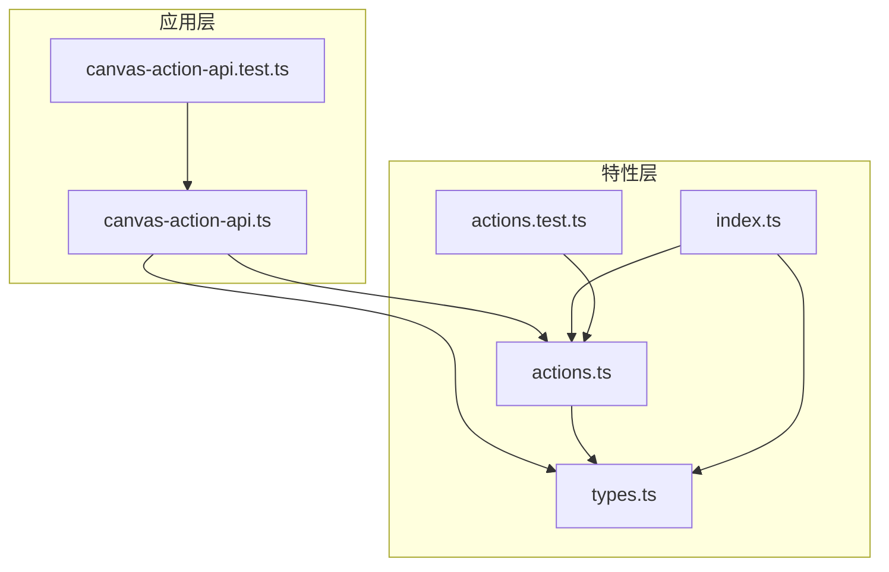
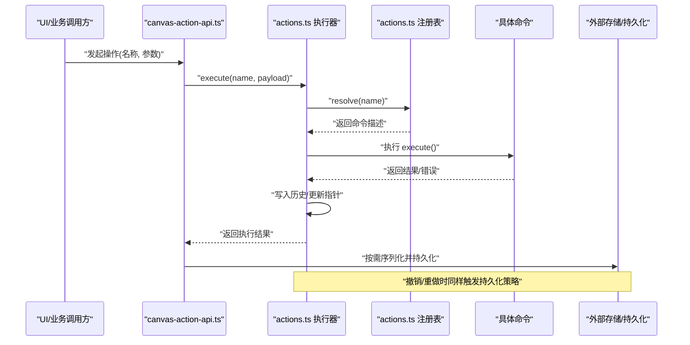
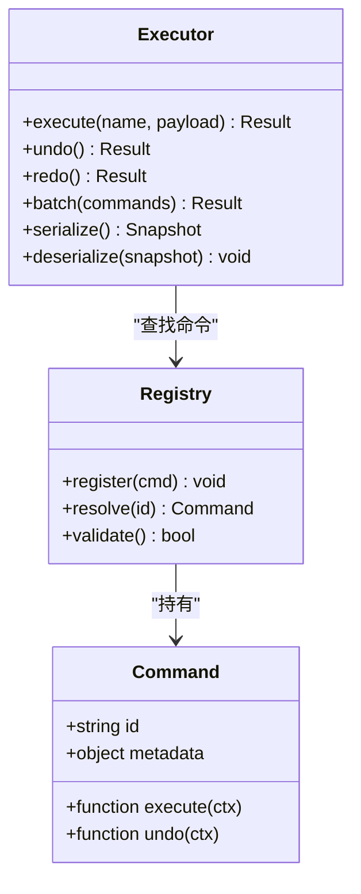
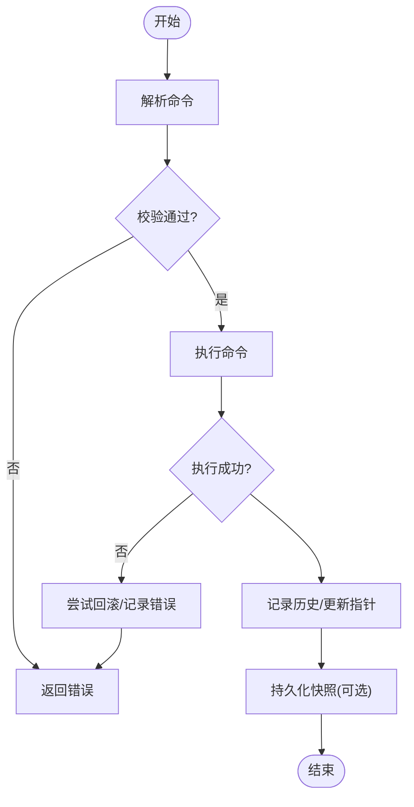
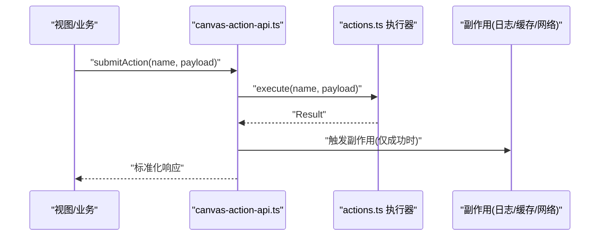
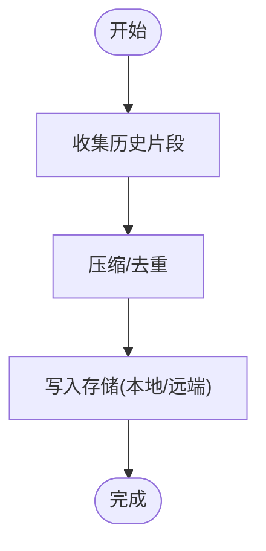
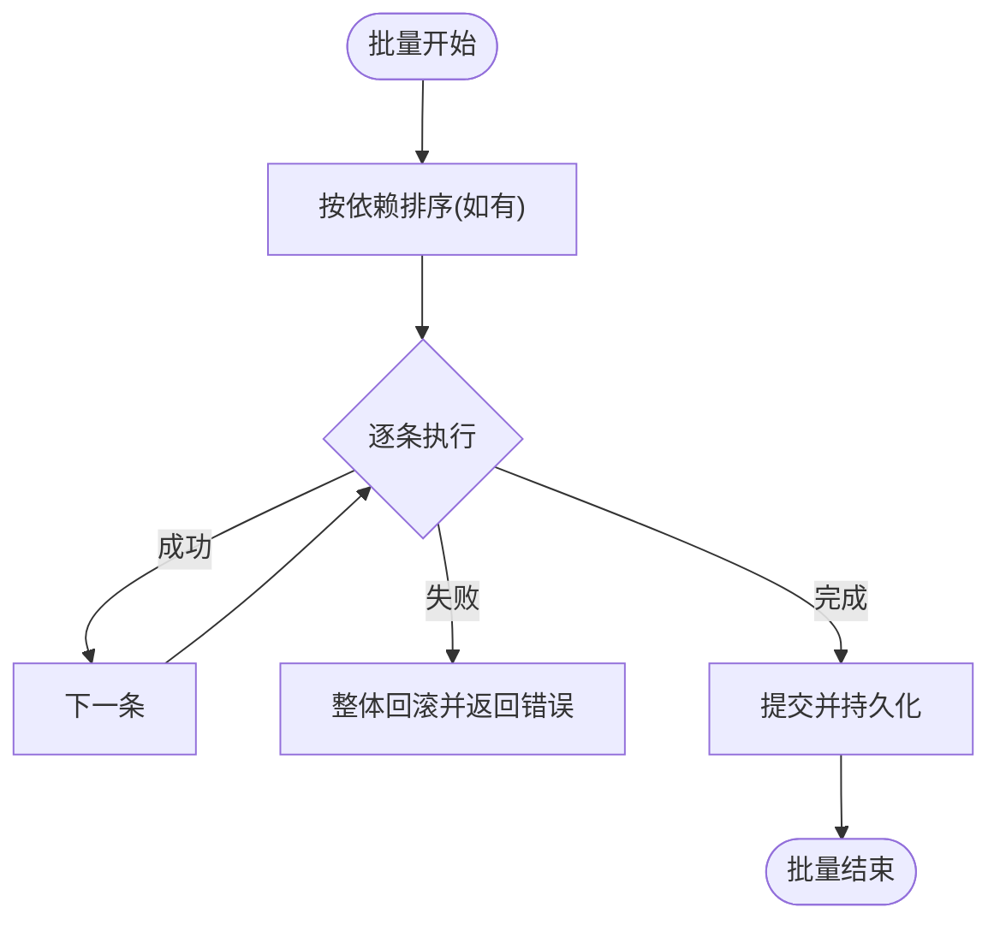
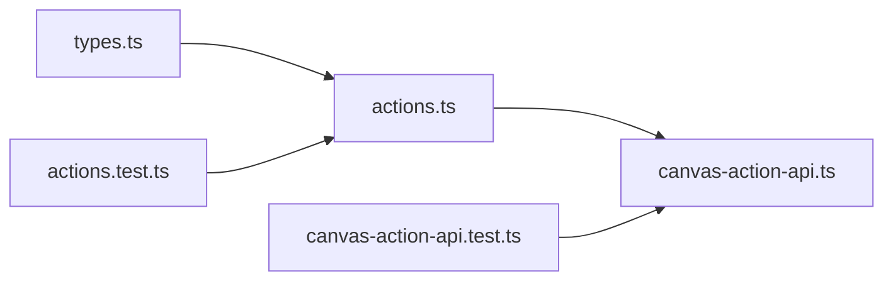

# 操作历史系统

<cite>
**本文引用的文件**   
- [src/features/canvas/actions.ts](file://src/features/canvas/actions.ts)
- [src/features/canvas/actions.test.ts](file://src/features/canvas/actions.test.ts)
- [src/app/canvas/canvas-action-api.ts](file://src/app/canvas/canvas-action-api.ts)
- [src/app/canvas/canvas-action-api.test.ts](file://src/app/canvas/canvas-action-api.test.ts)
- [src/features/canvas/types.ts](file://src/features/canvas/types.ts)
- [src/features/canvas/index.ts](file://src/features/canvas/index.ts)
</cite>

## 目录
1. [简介](#简介)
2. [项目结构](#项目结构)
3. [核心组件](#核心组件)
4. [架构总览](#架构总览)
5. [详细组件分析](#详细组件分析)
6. [依赖关系分析](#依赖关系分析)
7. [性能考虑](#性能考虑)
8. [故障排查指南](#故障排查指南)
9. [结论](#结论)
10. [附录](#附录)

## 简介
本文件面向画布编辑器的“操作历史系统”，围绕命令模式、撤销/重做、操作序列化与批量执行等主题，系统化梳理 Actions 模块的命令注册、执行流程与状态管理。文档同时给出扩展指南与最佳实践，帮助开发者在保持可测试性与可扩展性的前提下，构建健壮的操作历史能力。

## 项目结构
与操作历史相关的代码主要位于 features/canvas 与 app/canvas 两个层次：
- features/canvas/actions.ts：实现命令抽象、注册表、执行器、撤销/重做栈以及批量执行等核心逻辑。
- features/canvas/actions.test.ts：覆盖命令注册、执行、撤销/重做、批量执行、错误处理等用例。
- app/canvas/canvas-action-api.ts：提供应用层 API，将 UI 或业务调用桥接到命令执行器，并负责副作用（如持久化）的编排。
- app/canvas/canvas-action-api.test.ts：对应用层 API 的集成测试，验证端到端行为。
- features/canvas/types.ts：定义命令类型、元数据、结果与错误等共享类型。
- features/canvas/index.ts：对外导出公共接口，作为模块入口。

图表来源
- [src/app/canvas/canvas-action-api.ts](file://src/app/canvas/canvas-action-api.ts)
- [src/features/canvas/actions.ts](file://src/features/canvas/actions.ts)
- [src/features/canvas/types.ts](file://src/features/canvas/types.ts)
- [src/features/canvas/index.ts](file://src/features/canvas/index.ts)

章节来源
- [src/features/canvas/actions.ts](file://src/features/canvas/actions.ts)
- [src/features/canvas/actions.test.ts](file://src/features/canvas/actions.test.ts)
- [src/app/canvas/canvas-action-api.ts](file://src/app/canvas/canvas-action-api.ts)
- [src/app/canvas/canvas-action-api.test.ts](file://src/app/canvas/canvas-action-api.test.ts)
- [src/features/canvas/types.ts](file://src/features/canvas/types.ts)
- [src/features/canvas/index.ts](file://src/features/canvas/index.ts)

## 核心组件
- 命令抽象与注册表
  - 通过统一的命令描述对象进行声明式注册，包含唯一标识、元数据、执行函数与可选的撤销函数。
  - 注册表维护命令映射，支持按名称查找与校验。
- 执行器与历史栈
  - 执行器负责加载命令、执行、记录历史、维护撤销/重做指针。
  - 支持同步与异步命令；失败时回滚已变更并记录错误上下文。
- 批量执行
  - 将多个原子命令组合为一次事务性提交，保证要么全部成功，要么整体失败。
  - 批量内可合并相邻同类操作以减少历史长度。
- 序列化与反序列化
  - 将历史快照序列化为稳定格式，用于持久化与跨会话恢复。
  - 反序列化时重建命令引用与状态指针，确保一致性。
- 状态管理与副作用
  - 执行前后触发钩子，便于 UI 更新、日志埋点与外部系统同步。
  - 副作用与纯命令解耦，避免污染命令的可测试性。

章节来源
- [src/features/canvas/actions.ts](file://src/features/canvas/actions.ts)
- [src/features/canvas/types.ts](file://src/features/canvas/types.ts)
- [src/features/canvas/index.ts](file://src/features/canvas/index.ts)

## 架构总览
下图展示了从应用层到命令执行层的调用链与数据流，包括撤销/重做路径与序列化落盘时机。

图表来源
- [src/app/canvas/canvas-action-api.ts](file://src/app/canvas/canvas-action-api.ts)
- [src/features/canvas/actions.ts](file://src/features/canvas/actions.ts)
- [src/features/canvas/types.ts](file://src/features/canvas/types.ts)

## 详细组件分析

### 命令模型与注册表
- 命令模型
  - 包含命令标识、元数据（名称、版本、是否幂等）、执行函数与可选撤销函数。
  - 支持附加上下文（如时间戳、用户信息），便于审计与回放。
- 注册表
  - 提供注册、查询、校验能力；重复注册会拒绝或覆盖（取决于配置）。
  - 支持命名空间隔离，避免不同功能域冲突。
- 类型契约
  - 统一输入输出类型，约束副作用边界，提升可测试性。

图表来源
- [src/features/canvas/actions.ts](file://src/features/canvas/actions.ts)
- [src/features/canvas/types.ts](file://src/features/canvas/types.ts)

章节来源
- [src/features/canvas/actions.ts](file://src/features/canvas/actions.ts)
- [src/features/canvas/types.ts](file://src/features/canvas/types.ts)

### 执行流程与撤销/重做
- 执行流程
  - 解析命令 -> 前置校验 -> 执行 -> 后置处理（记录历史、触发钩子、持久化）。
  - 失败时执行回滚（若可用）并抛出结构化错误。
- 撤销/重做
  - 基于栈结构维护历史指针；撤销时调用命令的 undo，重做时重新执行对应命令。
  - 新执行会截断当前指针之后的历史分支，形成线性时间线。
- 批量执行
  - 将多条命令打包为一次提交；内部顺序执行，任一失败则整体回滚。
  - 支持合并相邻同类命令以压缩历史长度。

图表来源
- [src/features/canvas/actions.ts](file://src/features/canvas/actions.ts)

章节来源
- [src/features/canvas/actions.ts](file://src/features/canvas/actions.ts)
- [src/features/canvas/actions.test.ts](file://src/features/canvas/actions.test.ts)

### 应用层 API 与副作用编排
- 职责
  - 暴露稳定的 API 给 UI 或上层业务。
  - 编排副作用：日志、埋点、通知、缓存失效、远程同步等。
  - 将执行结果转换为 UI 友好的响应格式。
- 与执行器交互
  - 调用执行器的 execute/undo/redo/batch 等方法。
  - 根据执行结果决定是否触发持久化或增量同步。

图表来源
- [src/app/canvas/canvas-action-api.ts](file://src/app/canvas/canvas-action-api.ts)
- [src/features/canvas/actions.ts](file://src/features/canvas/actions.ts)

章节来源
- [src/app/canvas/canvas-action-api.ts](file://src/app/canvas/canvas-action-api.ts)
- [src/app/canvas/canvas-action-api.test.ts](file://src/app/canvas/canvas-action-api.test.ts)

### 操作序列化与持久化
- 序列化目标
  - 将历史快照（命令 ID、参数、时间戳、指针位置）序列化为稳定格式。
  - 支持增量快照与全量快照两种策略。
- 反序列化
  - 重建执行器状态，恢复撤销/重做指针。
  - 校验命令注册表完整性，缺失命令时降级或报错。
- 存储策略
  - 内存优先，定期落盘；大数据量采用分片与压缩。
  - 支持只读回放与审计导出。

图表来源
- [src/features/canvas/actions.ts](file://src/features/canvas/actions.ts)

章节来源
- [src/features/canvas/actions.ts](file://src/features/canvas/actions.ts)

### 自定义命令开发指南
- 步骤
  - 在 types.ts 中定义命令输入/输出类型。
  - 在 actions.ts 中注册命令，实现 execute 与可选 undo。
  - 在 canvas-action-api.ts 中暴露便捷方法，封装副作用。
- 要点
  - 尽量保持命令纯函数化，减少隐式副作用。
  - 明确幂等性标记，便于重试与回放。
  - 为复杂命令提供单元测试，覆盖正常与异常路径。

章节来源
- [src/features/canvas/types.ts](file://src/features/canvas/types.ts)
- [src/features/canvas/actions.ts](file://src/features/canvas/actions.ts)
- [src/app/canvas/canvas-action-api.ts](file://src/app/canvas/canvas-action-api.ts)

### 批量执行与依赖关系
- 批量执行
  - 使用 batch 接口传入命令列表，内部顺序执行，失败即整体回滚。
  - 适合表单提交、多节点布局调整等场景。
- 依赖关系
  - 对于存在先后依赖的命令，可在批量前显式排序或拆分为多次提交。
  - 对循环依赖应拒绝执行并提示修正。

图表来源
- [src/features/canvas/actions.ts](file://src/features/canvas/actions.ts)

章节来源
- [src/features/canvas/actions.ts](file://src/features/canvas/actions.ts)
- [src/features/canvas/actions.test.ts](file://src/features/canvas/actions.test.ts)

## 依赖关系分析
- 模块耦合
  - 应用层 API 依赖执行器与类型定义；执行器依赖注册表与命令实现。
  - 测试文件分别针对执行器与应用层 API 进行单测与集成测试。
- 外部依赖
  - 持久化与副作用由应用层注入，保持执行器无状态与可移植。

图表来源
- [src/features/canvas/types.ts](file://src/features/canvas/types.ts)
- [src/features/canvas/actions.ts](file://src/features/canvas/actions.ts)
- [src/app/canvas/canvas-action-api.ts](file://src/app/canvas/canvas-action-api.ts)
- [src/features/canvas/actions.test.ts](file://src/features/canvas/actions.test.ts)
- [src/app/canvas/canvas-action-api.test.ts](file://src/app/canvas/canvas-action-api.test.ts)

章节来源
- [src/features/canvas/actions.ts](file://src/features/canvas/actions.ts)
- [src/app/canvas/canvas-action-api.ts](file://src/app/canvas/canvas-action-api.ts)
- [src/features/canvas/types.ts](file://src/features/canvas/types.ts)

## 性能考虑
- 历史压缩
  - 合并相邻同类命令，减少历史条目数量。
  - 对大对象参数进行差异压缩或引用替换。
- 惰性持久化
  - 仅在关键节点或定时任务落盘，避免频繁 I/O。
- 内存优化
  - 限制历史长度，超出阈值后清理旧快照。
  - 使用不可变数据结构，避免深拷贝开销。
- 并发与锁
  - 对撤销/重做与批量执行加锁，防止竞态条件。

[本节为通用指导，不直接分析具体文件]

## 故障排查指南
- 常见问题
  - 命令未注册：检查注册表初始化与命名空间。
  - 撤销失败：确认命令实现了 undo 或提供了补偿逻辑。
  - 批量执行部分失败：查看中间步骤的错误上下文与回滚日志。
  - 序列化不一致：核对命令参数是否可序列化，避免函数/闭包。
- 定位手段
  - 启用调试日志，记录命令 ID、参数与执行耗时。
  - 导出历史快照进行离线回放与对比。
  - 使用最小复现用例聚焦问题范围。

章节来源
- [src/features/canvas/actions.test.ts](file://src/features/canvas/actions.test.ts)
- [src/app/canvas/canvas-action-api.test.ts](file://src/app/canvas/canvas-action-api.test.ts)

## 结论
本系统通过命令模式与清晰的执行器设计，实现了可靠的撤销/重做、批量执行与序列化能力。配合应用层 API 的副作用编排，既保证了命令的可测试性，又满足了工程落地所需的稳定性与可观测性。遵循本文档的最佳实践，可高效扩展新的操作命令并保持系统长期可维护。

## 附录
- 术语
  - 命令：描述一次操作的元数据与执行/撤销逻辑。
  - 执行器：负责命令解析、执行、历史记录与撤销/重做。
  - 快照：历史的状态序列化表示，用于持久化与恢复。
- 参考
  - 命令模式与撤销/重做经典实现范式。
  - 不可变数据与差异压缩技术。

[本节为概念性内容，不直接分析具体文件]