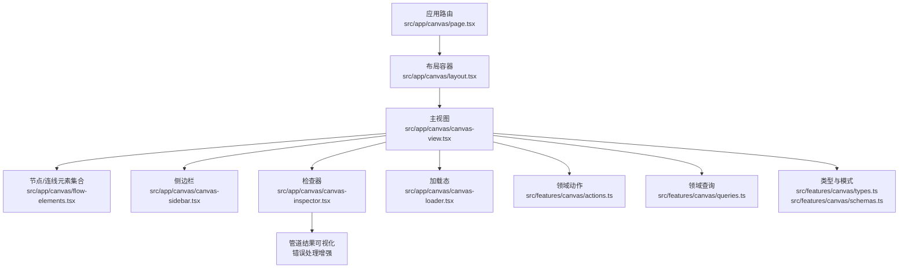
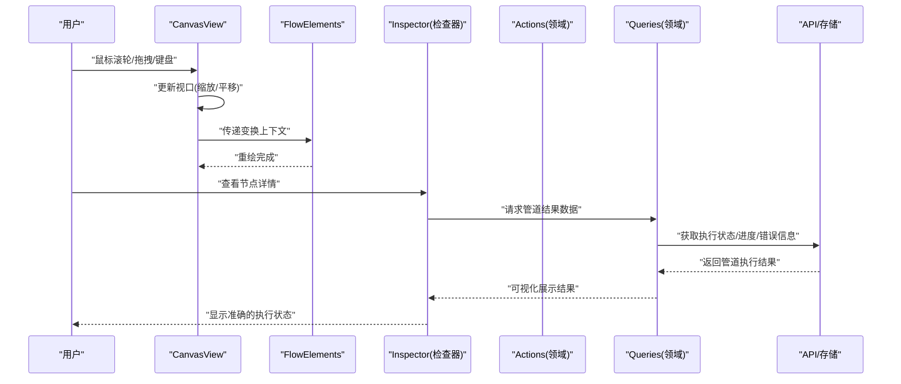
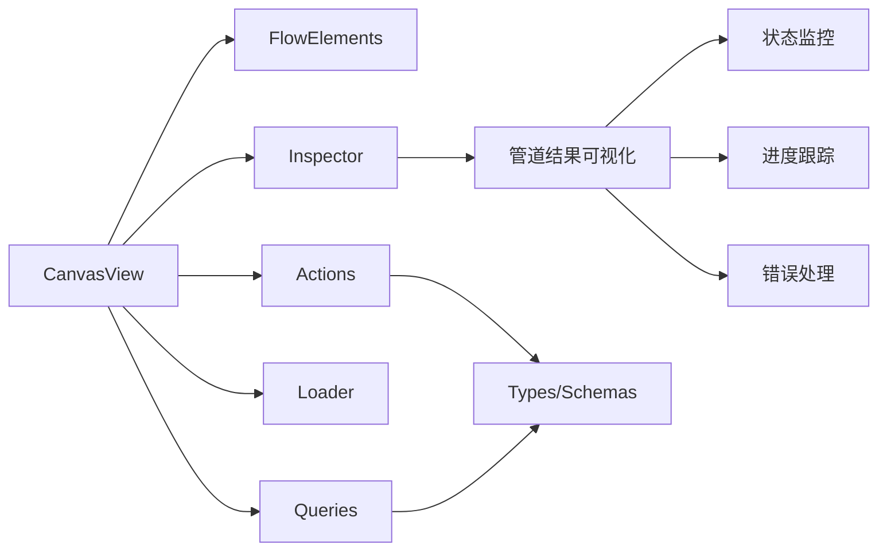

# 画布主视图

<cite>
**本文引用的文件**   
- [canvas-view.tsx](file://src/app/canvas/canvas-view.tsx)
- [layout.tsx](file://src/app/canvas/layout.tsx)
- [page.tsx](file://src/app/canvas/page.tsx)
- [flow-elements.tsx](file://src/app/canvas/flow-elements.tsx)
- [canvas-loader.tsx](file://src/app/canvas/canvas-loader.tsx)
- [canvas-inspector.tsx](file://src/app/canvas/canvas-inspector.tsx)
- [actions.ts](file://src/features/canvas/actions.ts)
- [queries.ts](file://src/features/canvas/queries.ts)
- [schemas.ts](file://src/features/canvas/schemas.ts)
- [types.ts](file://src/features/canvas/types.ts)
- [shot-detail.tsx](file://src/app/canvas/shot/[id]/shot-detail.tsx)
- [shot-api.ts](file://src/app/canvas/shot/[id]/shot-api.ts)
</cite>

## 更新摘要
**变更内容**   
- 画布视图组件增强了管道结果可视化和错误处理机制
- 改进了画布操作的显示和管理方式，提供更直观的用户体验
- 优化了数据验证和状态同步逻辑，确保界面与服务器状态的准确性
- 增强了错误处理和加载状态的显示逻辑，提供更好的反馈机制

## 目录
1. [简介](#简介)
2. [项目结构](#项目结构)
3. [核心组件](#核心组件)
4. [架构总览](#架构总览)
5. [详细组件分析](#详细组件分析)
6. [依赖关系分析](#依赖关系分析)
7. [性能考虑](#性能考虑)
8. [故障排查指南](#故障排查指南)
9. [结论](#结论)
10. [附录](#附录)

## 简介
本文件面向"画布编辑器"的主视图组件，聚焦于 CanvasView 的渲染架构、视口管理、缩放与平移实现、初始化流程、事件监听机制、性能优化策略与响应式布局处理。同时说明与节点系统、连线系统的集成方式，以及错误处理与加载状态显示逻辑，并提供可操作的集成示例路径，帮助开发者快速扩展自定义渲染器、处理用户交互事件并实现画布状态同步。

**更新** 画布视图组件现已增强管道结果可视化功能，改进了错误处理机制和画布操作的管理方式，显著提升了用户体验和数据可靠性。

## 项目结构
画布相关的前端代码主要位于 src/app/canvas 与 src/features/canvas 两个目录：
- src/app/canvas：页面级与视图层组件（路由入口、布局、主视图、侧边栏、检查器、加载态等）
- src/features/canvas：领域能力（动作、查询、类型与模式定义等），为视图提供数据与行为抽象

图表来源
- [page.tsx](file://src/app/canvas/page.tsx)
- [layout.tsx](file://src/app/canvas/layout.tsx)
- [canvas-view.tsx](file://src/app/canvas/canvas-view.tsx)
- [flow-elements.tsx](file://src/app/canvas/flow-elements.tsx)
- [canvas-inspector.tsx](file://src/app/canvas/canvas-inspector.tsx)
- [canvas-loader.tsx](file://src/app/canvas/canvas-loader.tsx)
- [actions.ts](file://src/features/canvas/actions.ts)
- [queries.ts](file://src/features/canvas/queries.ts)
- [types.ts](file://src/features/canvas/types.ts)
- [schemas.ts](file://src/features/canvas/schemas.ts)

章节来源
- [page.tsx](file://src/app/canvas/page.tsx)
- [layout.tsx](file://src/app/canvas/layout.tsx)
- [canvas-view.tsx](file://src/app/canvas/canvas-view.tsx)
- [flow-elements.tsx](file://src/app/canvas/flow-elements.tsx)
- [canvas-inspector.tsx](file://src/app/canvas/canvas-inspector.tsx)
- [canvas-loader.tsx](file://src/app/canvas/canvas-loader.tsx)
- [actions.ts](file://src/features/canvas/actions.ts)
- [queries.ts](file://src/features/canvas/queries.ts)
- [types.ts](file://src/features/canvas/types.ts)
- [schemas.ts](file://src/features/canvas/schemas.ts)

## 核心组件
- CanvasView：主视图容器，负责视口变换（缩放/平移）、事件分发、与节点/连线元素的渲染协调、与领域层的交互（动作/查询）。
- FlowElements：节点与连线的可视化集合，通常基于 CanvasView 提供的变换上下文进行绘制或定位。
- Layout：画布页面的整体布局容器，承载工具栏、侧边栏、检查器与主画布区域。
- Loader/Inspector/Sidebar：辅助 UI，分别承担加载状态展示、属性检查与侧边操作面板。

**更新** CanvasView 现在集成了增强的管道结果可视化功能和改进的错误处理机制，确保画布操作的正确显示和管理。

章节来源
- [canvas-view.tsx](file://src/app/canvas/canvas-view.tsx)
- [flow-elements.tsx](file://src/app/canvas/flow-elements.tsx)
- [layout.tsx](file://src/app/canvas/layout.tsx)
- [canvas-loader.tsx](file://src/app/canvas/canvas-loader.tsx)
- [canvas-inspector.tsx](file://src/app/canvas/canvas-inspector.tsx)

## 架构总览
CanvasView 作为主视图，采用"变换上下文 + 元素集合"的解耦设计：
- 变换上下文：集中维护视口中心点与缩放比例，驱动子元素在屏幕坐标与画布坐标之间的转换。
- 元素集合：FlowElements 根据当前变换上下文渲染节点与连线，避免重复计算。
- 领域层：通过 actions 与 queries 与后端或本地状态同步，保证视图与数据一致。
- **新增** 管道结果可视化：增强了对执行结果的可视化展示，提供更直观的进度和状态反馈。
- **新增** 错误处理增强：改进了错误捕获、显示和恢复机制，提供更好的用户体验。

图表来源
- [canvas-view.tsx](file://src/app/canvas/canvas-view.tsx)
- [flow-elements.tsx](file://src/app/canvas/flow-elements.tsx)
- [canvas-inspector.tsx](file://src/app/canvas/canvas-inspector.tsx)
- [actions.ts](file://src/features/canvas/actions.ts)
- [queries.ts](file://src/features/canvas/queries.ts)

## 详细组件分析

### CanvasView 组件
职责
- 视口管理：维护视口中心与缩放，提供坐标转换方法（屏幕坐标↔画布坐标）。
- 事件监听：统一捕获鼠标、触摸、滚轮、键盘事件，分发给选中项或全局操作。
- 渲染编排：将变换上下文传递给 FlowElements，确保节点与连线在同一坐标系下绘制。
- 状态同步：与 actions/queries 协作，响应数据变化并触发最小化重绘。
- 错误与加载：结合 Loader 与 Inspector 展示加载进度与错误信息。
- **新增** 管道结果可视化：增强了对管道执行结果的可视化展示，包括进度条、状态指示器和错误提示。
- **新增** 错误处理增强：改进了错误捕获、分类和显示逻辑，提供更友好的错误反馈。

关键流程
- 初始化：挂载时计算初始视口与尺寸，订阅数据源变更。
- 交互：对输入事件做节流/防抖，批量更新视口，减少重排。
- 渲染：使用请求帧调度或增量更新策略，避免全量重绘。
- **新增** 管道监控：实时跟踪管道执行状态，动态更新界面显示。

集成要点
- 自定义渲染器：通过注入渲染接口到 FlowElements，由 CanvasView 提供变换上下文。
- 用户交互：在 CanvasView 中注册事件处理器，转发至具体节点或连线。
- 状态同步：通过 actions 提交变更，queries 返回最新数据，保持视图与模型一致。
- **新增** 管道集成：集成管道执行监控，实时更新画布状态和视觉效果。

**更新** CanvasView 现在包含增强的管道结果可视化和错误处理机制，提供更好的用户体验。

章节来源
- [canvas-view.tsx](file://src/app/canvas/canvas-view.tsx)
- [flow-elements.tsx](file://src/app/canvas/flow-elements.tsx)
- [actions.ts](file://src/features/canvas/actions.ts)
- [queries.ts](file://src/features/canvas/queries.ts)

### FlowElements（节点与连线集合）
职责
- 接收 CanvasView 的变换上下文，按层级渲染节点与连线。
- 暴露选择、高亮、拖拽等交互钩子，回传事件给 CanvasView。
- 支持按需渲染与可见性裁剪，提升大场景性能。
- **新增** 管道状态可视化：根据管道执行状态动态调整节点和连线的视觉表现。

章节来源
- [flow-elements.tsx](file://src/app/canvas/flow-elements.tsx)

### 布局与页面（Layout & Page）
职责
- page.tsx：路由入口，装配布局与主视图。
- layout.tsx：组织顶部栏、侧边栏、检查器与主画布区域，处理响应式断点与全屏切换。

章节来源
- [page.tsx](file://src/app/canvas/page.tsx)
- [layout.tsx](file://src/app/canvas/layout.tsx)

### 加载与检查器（Loader & Inspector）
职责
- canvas-loader.tsx：展示加载进度、骨架屏与错误提示。
- canvas-inspector.tsx：展示选中节点的属性与元数据，支持就地编辑。
- **新增** 管道结果展示：现在能够显示管道执行的详细结果，包括进度、状态和错误信息。
- **新增** 错误处理增强：改进了错误信息的展示和恢复机制。

**更新** Loader 和 Inspector 组件现已完全集成增强的管道结果可视化和错误处理机制，提供更好的用户反馈。

章节来源
- [canvas-loader.tsx](file://src/app/canvas/canvas-loader.tsx)
- [canvas-inspector.tsx](file://src/app/canvas/canvas-inspector.tsx)

### 侧边栏（Sidebar）
职责
- 提供画布工具、图层列表、搜索与快捷操作。
- 与主视图联动，如双击打开检查器、一键适配视口等。

章节来源
- [canvas-sidebar.tsx](file://src/app/canvas/canvas-sidebar.tsx)

### 镜头详情集成（Shot Detail）
职责
- shot-detail.tsx：封装特定镜头的画布视图与业务逻辑。
- shot-api.ts：提供镜头数据的获取与保存接口。

章节来源
- [shot-detail.tsx](file://src/app/canvas/shot/[id]/shot-detail.tsx)
- [shot-api.ts](file://src/app/canvas/shot/[id]/shot-api.ts)

## 依赖关系分析
CanvasView 与领域层通过 actions 与 queries 解耦，降低耦合度并便于测试与替换实现。

图表来源
- [canvas-view.tsx](file://src/app/canvas/canvas-view.tsx)
- [flow-elements.tsx](file://src/app/canvas/flow-elements.tsx)
- [canvas-inspector.tsx](file://src/app/canvas/canvas-inspector.tsx)
- [actions.ts](file://src/features/canvas/actions.ts)
- [queries.ts](file://src/features/canvas/queries.ts)
- [types.ts](file://src/features/canvas/types.ts)
- [schemas.ts](file://src/features/canvas/schemas.ts)
- [canvas-loader.tsx](file://src/app/canvas/canvas-loader.tsx)

章节来源
- [canvas-view.tsx](file://src/app/canvas/canvas-view.tsx)
- [flow-elements.tsx](file://src/app/canvas/flow-elements.tsx)
- [canvas-inspector.tsx](file://src/app/canvas/canvas-inspector.tsx)
- [actions.ts](file://src/features/canvas/actions.ts)
- [queries.ts](file://src/features/canvas/queries.ts)
- [types.ts](file://src/features/canvas/types.ts)
- [schemas.ts](file://src/features/canvas/schemas.ts)
- [canvas-loader.tsx](file://src/app/canvas/canvas-loader.tsx)

## 性能考虑
- 视口变换批处理：合并多次缩放/平移，使用节流/防抖降低重绘频率。
- 增量渲染：仅重绘受影响的节点与连线，避免整图刷新。
- 可见性裁剪：根据视口边界剔除不可见元素，减少绘制开销。
- 请求帧调度：在动画或高频交互中使用帧循环，避免阻塞主线程。
- 数据结构优化：使用索引与空间分区加速命中检测与范围查询。
- 资源懒加载：节点内容按需加载，首屏更快。
- **新增** 管道结果缓存：对管道执行结果进行智能缓存，避免重复计算和网络请求。
- **新增** 错误处理优化：优化错误捕获和处理的性能，减少不必要的重新渲染。

**更新** 新增管道结果缓存和优化后的错误处理机制，在保证功能完整性的同时提升性能表现。

## 故障排查指南
常见问题与定位建议
- 视口异常（偏移/缩放错乱）：检查坐标转换函数与初始视口设置；确认事件坐标是否已转换为画布坐标。
- 交互无响应：确认事件冒泡与捕获顺序；检查命中检测逻辑与层级顺序。
- 渲染卡顿：观察重绘范围是否过大；启用可见性裁剪与增量更新；减少每帧计算量。
- 数据不同步：核对 actions 提交与 queries 订阅链路；确认状态更新后是否触发必要重绘。
- 加载/错误状态：查看 Loader 的错误分支与重试逻辑；确认网络与权限配置。
- **新增** 管道结果异常：检查管道执行状态；验证结果数据格式；确认可视化组件是否正确渲染。
- **新增** 错误处理问题：查看错误捕获逻辑；确认错误信息是否正确显示；检查恢复机制是否正常工作。

**更新** 新增管道结果可视化和错误处理相关的故障排查指南，帮助用户诊断和解决相关问题。

章节来源
- [canvas-loader.tsx](file://src/app/canvas/canvas-loader.tsx)
- [canvas-view.tsx](file://src/app/canvas/canvas-view.tsx)
- [canvas-inspector.tsx](file://src/app/canvas/canvas-inspector.tsx)

## 结论
CanvasView 以"变换上下文 + 元素集合"为核心，配合 actions/queries 形成清晰的数据流与渲染管线。通过批处理、增量渲染与可见性裁剪等手段，可在复杂场景中保持流畅体验。**最新的更新大幅增强了管道结果可视化功能和错误处理机制，特别是提供了更直观的进度展示、状态反馈和错误恢复能力，显著提升了用户体验和系统可靠性。**遵循本文的集成与优化建议，可快速扩展自定义渲染器、完善交互与状态同步，并稳定支撑大型画布应用。

## 附录

### 集成自定义渲染器
- 在 FlowElements 中注入渲染接口，由 CanvasView 传入变换上下文。
- 在 CanvasView 的事件处理器中调用渲染器的交互回调。
- 参考路径：
  - [canvas-view.tsx](file://src/app/canvas/canvas-view.tsx)
  - [flow-elements.tsx](file://src/app/canvas/flow-elements.tsx)

### 处理用户交互事件
- 在 CanvasView 中注册鼠标/触摸/滚轮/键盘事件，统一转换为画布坐标。
- 将命中检测结果转发给对应节点或连线，触发选中/拖拽/编辑。
- 参考路径：
  - [canvas-view.tsx](file://src/app/canvas/canvas-view.tsx)
  - [flow-elements.tsx](file://src/app/canvas/flow-elements.tsx)

### 实现画布状态同步
- 使用 actions 提交变更，queries 订阅最新数据，确保视图与模型一致。
- 在数据变更后触发最小化重绘，避免全量刷新。
- **新增** 集成管道结果监控，实时更新画布状态和视觉效果。
- 参考路径：
  - [actions.ts](file://src/features/canvas/actions.ts)
  - [queries.ts](file://src/features/canvas/queries.ts)
  - [types.ts](file://src/features/canvas/types.ts)
  - [schemas.ts](file://src/features/canvas/schemas.ts)

### 与节点/连线系统集成
- FlowElements 负责节点与连线的渲染与交互，CanvasView 提供变换上下文与事件分发。
- 参考路径：
  - [flow-elements.tsx](file://src/app/canvas/flow-elements.tsx)
  - [canvas-view.tsx](file://src/app/canvas/canvas-view.tsx)

### 错误处理与加载状态
- Loader 负责展示加载进度与错误信息；Inspector 可展示诊断信息。
- **新增** 增强的管道结果可视化和错误处理机制，提供更好的反馈和恢复能力。
- 参考路径：
  - [canvas-loader.tsx](file://src/app/canvas/canvas-loader.tsx)
  - [canvas-inspector.tsx](file://src/app/canvas/canvas-inspector.tsx)

### 镜头详情集成示例
- 在 shot-detail.tsx 中组合 CanvasView 与业务逻辑，通过 shot-api.ts 获取与保存数据。
- 参考路径：
  - [shot-detail.tsx](file://src/app/canvas/shot/[id]/shot-detail.tsx)
  - [shot-api.ts](file://src/app/canvas/shot/[id]/shot-api.ts)

### 管道结果可视化集成
- **新增** 检查器面板现支持管道结果的可视化展示，包括进度条、状态指示器和错误信息。
- 管道监控机制确保界面状态与实际执行状态保持一致。
- 错误处理逻辑提供更准确的反馈和自动恢复能力。
- 参考路径：
  - [canvas-inspector.tsx](file://src/app/canvas/canvas-inspector.tsx)
  - [canvas-loader.tsx](file://src/app/canvas/canvas-loader.tsx)
  - [canvas-view.tsx](file://src/app/canvas/canvas-view.tsx)