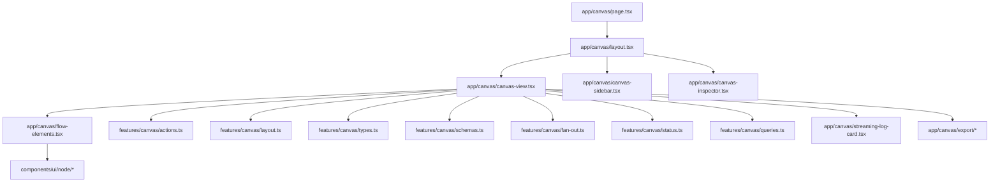
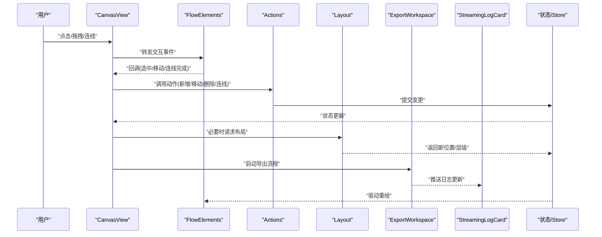
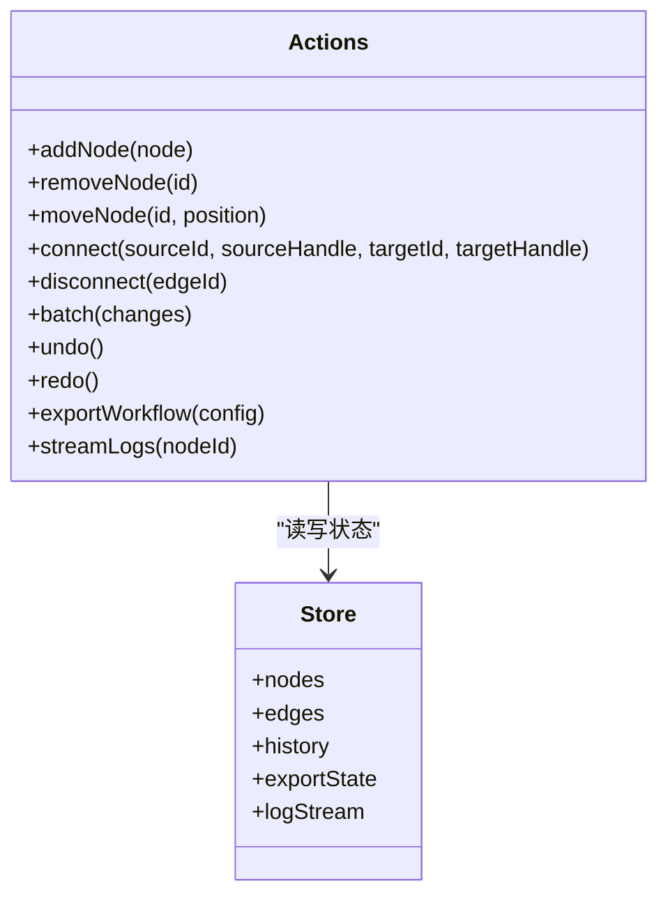
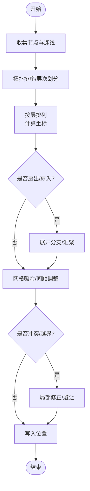
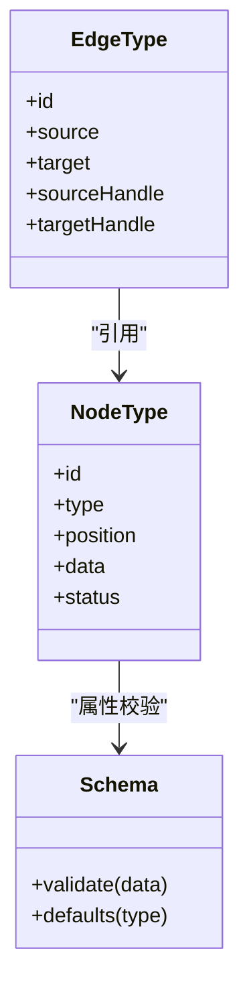
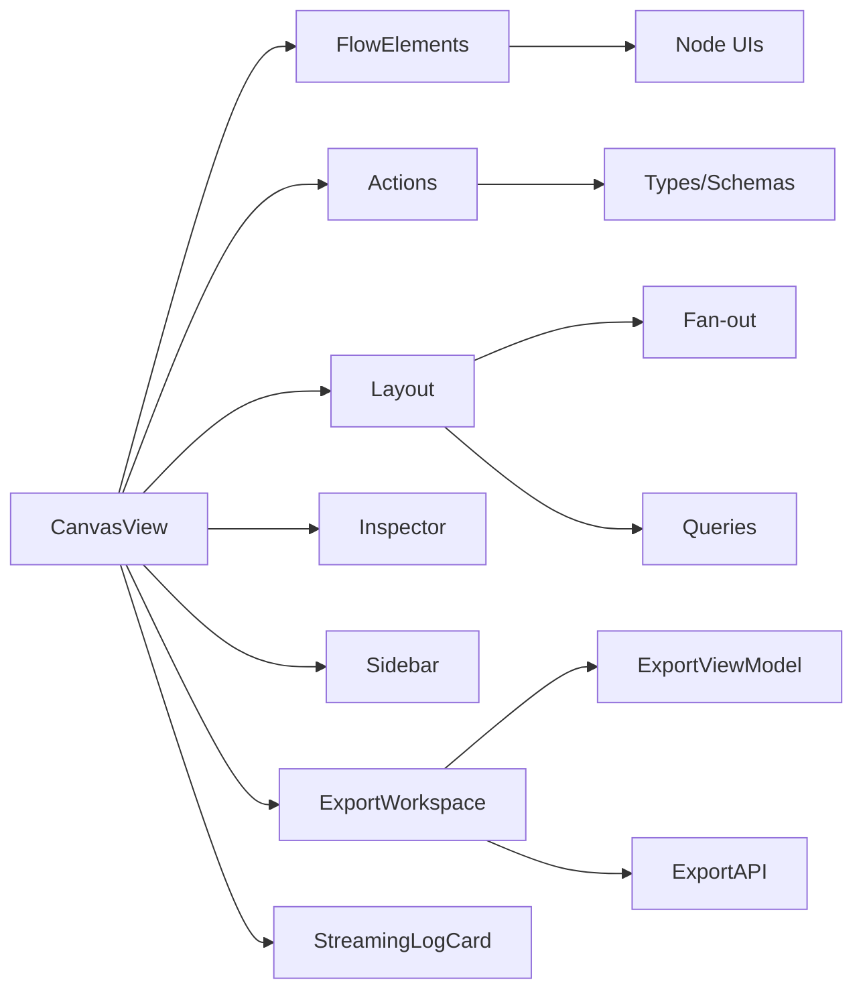

# 画布编辑器

<cite>
**本文引用的文件**   
- [src/app/canvas/page.tsx](file://src/app/canvas/page.tsx)
- [src/app/canvas/layout.tsx](file://src/app/canvas/layout.tsx)
- [src/app/canvas/canvas-view.tsx](file://src/app/canvas/canvas-view.tsx)
- [src/app/canvas/flow-elements.tsx](file://src/app/canvas/flow-elements.tsx)
- [src/app/canvas/canvas-inspector.tsx](file://src/app/canvas/canvas-inspector.tsx)
- [src/app/canvas/canvas-loader.tsx](file://src/app/canvas/canvas-loader.tsx)
- [src/app/canvas/canvas-action-api.ts](file://src/app/canvas/canvas-action-api.ts)
- [src/app/canvas/streaming-log-card.tsx](file://src/app/canvas/streaming-log-card.tsx)
- [src/app/canvas/export/export-workspace.tsx](file://src/app/canvas/export/export-workspace.tsx)
- [src/app/canvas/export/export-view-model.tsx](file://src/app/canvas/export/export-view-model.tsx)
- [src/app/canvas/export/export-api.ts](file://src/app/canvas/export/export-api.ts)
- [src/features/canvas/actions.ts](file://src/features/canvas/actions.ts)
- [src/features/canvas/types.ts](file://src/features/canvas/types.ts)
- [src/features/canvas/schemas.ts](file://src/features/canvas/schemas.ts)
- [src/features/canvas/layout.ts](file://src/features/canvas/layout.ts)
- [src/features/canvas/fan-out.ts](file://src/features/canvas/fan-out.ts)
- [src/features/canvas/status.ts](file://src/features/canvas/status.ts)
- [src/features/canvas/queries.ts](file://src/features/canvas/queries.ts)
- [src/components/ui/node/stage-node.tsx](file://src/components/ui/node/stage-node.tsx)
- [src/components/ui/node/audio-node.tsx](file://src/components/ui/node/audio-node.tsx)
- [src/components/ui/node/export-node.tsx](file://src/components/ui/node/export-node.tsx)
- [src/components/ui/node/shot-node.tsx](file://src/components/ui/node/shot-node.tsx)
- [src/components/ui/node/types.ts](file://src/components/ui/node/types.ts)
</cite>

## 更新摘要
**所做更改**
- 增强了导出功能，添加了专门的导出工作区和视图模型
- 新增了流式日志可视化组件，支持实时日志显示
- 扩展了 Action API 支持，提供更丰富的操作接口
- 优化了画布界面的用户体验和交互流程

## 目录
1. [简介](#简介)
2. [项目结构](#项目结构)
3. [核心组件](#核心组件)
4. [架构总览](#架构总览)
5. [详细组件分析](#详细组件分析)
6. [依赖关系分析](#依赖关系分析)
7. [性能考虑](#性能考虑)
8. [故障排查指南](#故障排查指南)
9. [结论](#结论)
10. [附录](#附录)

## 简介
本文件为 CodeVideoCanvas 的画布编辑器提供全面文档，覆盖可视化编辑器的架构设计、节点系统实现、连线关系管理、属性面板交互与扩展机制。重点阐述以下方面：
- CanvasView 主视图渲染逻辑
- FlowElements 流程图绘制机制
- Actions 操作命令模式与撤销重做
- Layout 布局算法与自动排布
- 状态管理与响应式适配
- 自定义节点类型与连接逻辑的实现方式
- 用户交互事件处理与性能优化策略
- **新增**：增强的导出功能和流式日志可视化
- **新增**：扩展的 Action API 支持

## 项目结构
画布编辑器位于应用路由 /canvas，采用"页面-布局-视图-侧边栏-检查器"的分层组织方式；业务逻辑集中在 features/canvas 中，UI 节点组件位于 components/ui/node。

图表来源
- [src/app/canvas/page.tsx](file://src/app/canvas/page.tsx)
- [src/app/canvas/layout.tsx](file://src/app/canvas/layout.tsx)
- [src/app/canvas/canvas-view.tsx](file://src/app/canvas/canvas-view.tsx)
- [src/app/canvas/flow-elements.tsx](file://src/app/canvas/flow-elements.tsx)
- [src/app/canvas/streaming-log-card.tsx](file://src/app/canvas/streaming-log-card.tsx)
- [src/app/canvas/export/export-workspace.tsx](file://src/app/canvas/export/export-workspace.tsx)
- [src/features/canvas/actions.ts](file://src/features/canvas/actions.ts)
- [src/features/canvas/layout.ts](file://src/features/canvas/layout.ts)
- [src/features/canvas/types.ts](file://src/features/canvas/types.ts)
- [src/features/canvas/schemas.ts](file://src/features/canvas/schemas.ts)
- [src/features/canvas/fan-out.ts](file://src/features/canvas/fan-out.ts)
- [src/features/canvas/status.ts](file://src/features/canvas/status.ts)
- [src/features/canvas/queries.ts](file://src/features/canvas/queries.ts)
- [src/components/ui/node/stage-node.tsx](file://src/components/ui/node/stage-node.tsx)
- [src/components/ui/node/audio-node.tsx](file://src/components/ui/node/audio-node.tsx)
- [src/components/ui/node/export-node.tsx](file://src/components/ui/node/export-node.tsx)
- [src/components/ui/node/shot-node.tsx](file://src/components/ui/node/shot-node.tsx)

章节来源
- [src/app/canvas/page.tsx](file://src/app/canvas/page.tsx)
- [src/app/canvas/layout.tsx](file://src/app/canvas/layout.tsx)
- [src/app/canvas/canvas-view.tsx](file://src/app/canvas/canvas-view.tsx)
- [src/app/canvas/flow-elements.tsx](file://src/app/canvas/flow-elements.tsx)
- [src/app/canvas/streaming-log-card.tsx](file://src/app/canvas/streaming-log-card.tsx)
- [src/app/canvas/export/export-workspace.tsx](file://src/app/canvas/export/export-workspace.tsx)
- [src/features/canvas/actions.ts](file://src/features/canvas/actions.ts)
- [src/features/canvas/layout.ts](file://src/features/canvas/layout.ts)
- [src/features/canvas/types.ts](file://src/features/canvas/types.ts)
- [src/features/canvas/schemas.ts](file://src/features/canvas/schemas.ts)
- [src/features/canvas/fan-out.ts](file://src/features/canvas/fan-out.ts)
- [src/features/canvas/status.ts](file://src/features/canvas/status.ts)
- [src/features/canvas/queries.ts](file://src/features/canvas/queries.ts)
- [src/components/ui/node/stage-node.tsx](file://src/components/ui/node/stage-node.tsx)
- [src/components/ui/node/audio-node.tsx](file://src/components/ui/node/audio-node.tsx)
- [src/components/ui/node/export-node.tsx](file://src/components/ui/node/export-node.tsx)
- [src/components/ui/node/shot-node.tsx](file://src/components/ui/node/shot-node.tsx)

## 核心组件
- CanvasView：画布主视图，负责承载 FlowElements、监听缩放平移、选择与拖拽、以及将动作派发至 actions 模块。
- FlowElements：基于 ReactFlow 的流程图渲染层，负责节点与连线的绘制、端口对齐、路径计算与高亮反馈。
- Actions：操作命令中心，封装增删改查、撤销重做、批量操作等，统一变更入口并触发状态更新。
- Layout：布局引擎，提供自动排列、扇出/扇入展开、网格吸附与间距控制。
- Inspector/Sidebar：属性面板与侧边工具栏，用于节点属性编辑、画布设置与快捷操作。
- Node 组件：Stage/Audio/Export/Shot 等具体节点 UI，遵循统一的节点类型与端口约定。
- **新增**：StreamingLogCard：流式日志可视化组件，支持实时日志显示和滚动。
- **新增**：ExportWorkspace：导出工作区，提供完整的导出配置和进度管理。

章节来源
- [src/app/canvas/canvas-view.tsx](file://src/app/canvas/canvas-view.tsx)
- [src/app/canvas/flow-elements.tsx](file://src/app/canvas/flow-elements.tsx)
- [src/app/canvas/streaming-log-card.tsx](file://src/app/canvas/streaming-log-card.tsx)
- [src/app/canvas/export/export-workspace.tsx](file://src/app/canvas/export/export-workspace.tsx)
- [src/features/canvas/actions.ts](file://src/features/canvas/actions.ts)
- [src/features/canvas/layout.ts](file://src/features/canvas/layout.ts)
- [src/app/canvas/canvas-inspector.tsx](file://src/app/canvas/canvas-inspector.tsx)
- [src/app/canvas/canvas-sidebar.tsx](file://src/app/canvas/canvas-sidebar.tsx)
- [src/components/ui/node/stage-node.tsx](file://src/components/ui/node/stage-node.tsx)
- [src/components/ui/node/audio-node.tsx](file://src/components/ui/node/audio-node.tsx)
- [src/components/ui/node/export-node.tsx](file://src/components/ui/node/export-node.tsx)
- [src/components/ui/node/shot-node.tsx](file://src/components/ui/node/shot-node.tsx)

## 架构总览
整体采用"视图-命令-数据模型"分层：
- 视图层（CanvasView + FlowElements）只关注渲染与交互事件转发
- 命令层（Actions）集中处理状态变更与副作用
- 数据模型（types/schemas）定义节点、连线、布局参数与校验规则
- 布局层（Layout）在需要时介入，对节点集合进行自动排布或局部调整
- **新增**：导出层（ExportWorkspace + ExportViewModel）专门处理导出相关逻辑

图表来源
- [src/app/canvas/canvas-view.tsx](file://src/app/canvas/canvas-view.tsx)
- [src/app/canvas/flow-elements.tsx](file://src/app/canvas/flow-elements.tsx)
- [src/app/canvas/streaming-log-card.tsx](file://src/app/canvas/streaming-log-card.tsx)
- [src/app/canvas/export/export-workspace.tsx](file://src/app/canvas/export/export-workspace.tsx)
- [src/features/canvas/actions.ts](file://src/features/canvas/actions.ts)
- [src/features/canvas/layout.ts](file://src/features/canvas/layout.ts)

## 详细组件分析

### CanvasView 主视图渲染逻辑
职责
- 初始化 ReactFlow 容器与配置（背景、网格、缩放、键盘快捷键）
- 订阅状态变化，同步到 FlowElements
- 将用户交互事件转换为 Actions 调用
- 集成 Inspector/Sidebar 与全局快捷键
- **新增**：集成流式日志显示和导出工作区

关键点
- 使用受控模式管理 nodes/edges，确保单一数据源
- 通过 ref 或回调桥接 FlowElements 的 onNodeDrag/onConnect 等事件
- 在合适时机触发布局（如首次加载、批量插入后）
- **新增**：管理导出状态和日志流的实时更新

章节来源
- [src/app/canvas/canvas-view.tsx](file://src/app/canvas/canvas-view.tsx)

### FlowElements 流程图绘制机制
职责
- 渲染节点与连线，处理端口定位与路径计算
- 提供拖拽、多选、框选、右键菜单等交互
- 根据主题与选中态更新样式

关键点
- 节点类型映射到对应 UI 组件（Stage/Audio/Export/Shot）
- 连线端点按端口名匹配，支持多输入/输出
- 使用虚拟滚动或分片渲染提升大数据量下的性能

章节来源
- [src/app/canvas/flow-elements.tsx](file://src/app/canvas/flow-elements.tsx)
- [src/components/ui/node/stage-node.tsx](file://src/components/ui/node/stage-node.tsx)
- [src/components/ui/node/audio-node.tsx](file://src/components/ui/node/audio-node.tsx)
- [src/components/ui/node/export-node.tsx](file://src/components/ui/node/export-node.tsx)
- [src/components/ui/node/shot-node.tsx](file://src/components/ui/node/shot-node.tsx)

### Actions 操作命令模式与撤销重做
职责
- 封装所有可逆操作：添加节点、删除节点、移动节点、创建/删除连线、批量操作、导入导出
- 维护历史栈，支持 undo/redo
- 提供事务性提交，保证一致性
- **新增**：扩展的 API 支持更多操作类型

关键点
- 每个动作包含 apply/revert 方法，便于撤销重做
- 批量操作合并为一次历史条目
- 与状态存储解耦，便于替换持久化方案
- **新增**：支持更复杂的复合操作和异步任务

图表来源
- [src/features/canvas/actions.ts](file://src/features/canvas/actions.ts)
- [src/app/canvas/canvas-action-api.ts](file://src/app/canvas/canvas-action-api.ts)

章节来源
- [src/features/canvas/actions.ts](file://src/features/canvas/actions.ts)
- [src/app/canvas/canvas-action-api.ts](file://src/app/canvas/canvas-action-api.ts)

### Layout 布局算法与自动排布
职责
- 提供自动布局（自上而下、左右分布、环形等）
- 支持扇出/扇入展开（fan-out/fan-in）
- 网格吸附、最小间距、避免重叠

关键点
- 基于拓扑排序与层次划分，减少交叉连线
- 针对复杂图提供启发式优化（如最小化边长、均衡高度）
- 与 Actions 协作，以动作形式应用布局结果

图表来源
- [src/features/canvas/layout.ts](file://src/features/canvas/layout.ts)
- [src/features/canvas/fan-out.ts](file://src/features/canvas/fan-out.ts)

章节来源
- [src/features/canvas/layout.ts](file://src/features/canvas/layout.ts)
- [src/features/canvas/fan-out.ts](file://src/features/canvas/fan-out.ts)

### 流式日志可视化组件
职责
- 实时显示执行日志，支持自动滚动和过滤
- 提供日志级别标识和错误高亮
- 支持日志导出和搜索功能

关键点
- 使用 WebSocket 或 Server-Sent Events 接收实时日志
- 虚拟滚动优化大量日志的渲染性能
- 提供日志格式化和语法高亮

章节来源
- [src/app/canvas/streaming-log-card.tsx](file://src/app/canvas/streaming-log-card.tsx)

### 导出工作区和视图模型
职责
- 管理导出配置和进度状态
- 提供导出预览和参数验证
- 协调导出任务的执行和监控

关键点
- 支持多种导出格式和配置选项
- 实时显示导出进度和状态
- 提供导出结果的下载和管理

章节来源
- [src/app/canvas/export/export-workspace.tsx](file://src/app/canvas/export/export-workspace.tsx)
- [src/app/canvas/export/export-view-model.tsx](file://src/app/canvas/export/export-view-model.tsx)
- [src/app/canvas/export/export-api.ts](file://src/app/canvas/export/export-api.ts)

### 节点系统与类型定义
职责
- 定义节点类型、端口规范、属性 schema 与默认值
- 提供通用节点基类/工厂，简化自定义节点开发

关键点
- 使用 schema 校验节点属性，保障数据一致性
- 端口命名约定（in/out），便于连线匹配
- 节点状态（运行/错误/完成）与颜色映射

图表来源
- [src/features/canvas/types.ts](file://src/features/canvas/types.ts)
- [src/features/canvas/schemas.ts](file://src/features/canvas/schemas.ts)

章节来源
- [src/features/canvas/types.ts](file://src/features/canvas/types.ts)
- [src/features/canvas/schemas.ts](file://src/features/canvas/schemas.ts)
- [src/components/ui/node/types.ts](file://src/components/ui/node/types.ts)

### 属性面板与侧边栏交互
职责
- 展示当前选中节点的属性表单，双向绑定到状态
- 提供画布设置（主题、网格、缩放限制）、快捷操作（全选、复制、粘贴、删除）

关键点
- 表单字段与节点 schema 一一对应
- 防抖保存，避免频繁触发重绘
- 与 Actions 联动，确保操作可撤销

章节来源
- [src/app/canvas/canvas-inspector.tsx](file://src/app/canvas/canvas-inspector.tsx)
- [src/app/canvas/canvas-sidebar.tsx](file://src/app/canvas/canvas-sidebar.tsx)

### 查询与状态辅助
职责
- 提供常用查询（按类型筛选、连通性检测、上游/下游节点）
- 状态转换与统计（运行中/失败/完成计数）

章节来源
- [src/features/canvas/queries.ts](file://src/features/canvas/queries.ts)
- [src/features/canvas/status.ts](file://src/features/canvas/status.ts)

### 示例：创建自定义节点类型
步骤概览
- 在 node types 注册表中声明新节点类型与默认 data
- 编写节点 UI 组件，暴露输入/输出端口
- 在 schemas 中定义属性校验与默认值
- 在 FlowElements 中映射 type 到组件
- 通过 Actions.addNode 动态插入节点

章节来源
- [src/components/ui/node/types.ts](file://src/components/ui/node/types.ts)
- [src/features/canvas/schemas.ts](file://src/features/canvas/schemas.ts)
- [src/app/canvas/flow-elements.tsx](file://src/app/canvas/flow-elements.tsx)
- [src/features/canvas/actions.ts](file://src/features/canvas/actions.ts)

### 示例：实现节点间连接逻辑
步骤概览
- 在节点组件中定义端口（handle id）
- 在 FlowElements 中处理 onConnect，调用 Actions.connect
- 使用 queries 验证连接合法性（避免环、类型兼容）
- 在连线渲染阶段计算路径与高亮

章节来源
- [src/app/canvas/flow-elements.tsx](file://src/app/canvas/flow-elements.tsx)
- [src/features/canvas/actions.ts](file://src/features/canvas/actions.ts)
- [src/features/canvas/queries.ts](file://src/features/canvas/queries.ts)

### 示例：处理用户交互事件
步骤概览
- 在 CanvasView 中监听键盘快捷键（复制/粘贴/删除/撤销重做）
- 在 FlowElements 中处理拖拽、框选、右键菜单
- 将事件转为 Actions 调用，保持状态一致
- **新增**：处理导出和日志相关的用户交互

章节来源
- [src/app/canvas/canvas-view.tsx](file://src/app/canvas/canvas-view.tsx)
- [src/app/canvas/flow-elements.tsx](file://src/app/canvas/flow-elements.tsx)
- [src/features/canvas/actions.ts](file://src/features/canvas/actions.ts)

### 示例：使用增强的导出功能
步骤概览
- 在 CanvasView 中集成 ExportWorkspace 组件
- 配置导出参数和输出格式
- 监听导出进度和状态变化
- 处理导出结果和错误情况

章节来源
- [src/app/canvas/export/export-workspace.tsx](file://src/app/canvas/export/export-workspace.tsx)
- [src/app/canvas/export/export-view-model.tsx](file://src/app/canvas/export/export-view-model.tsx)
- [src/app/canvas/export/export-api.ts](file://src/app/canvas/export/export-api.ts)

### 示例：集成流式日志显示
步骤概览
- 在 CanvasView 中集成 StreamingLogCard 组件
- 建立日志流连接，接收实时日志
- 配置日志过滤和格式化选项
- 处理日志错误和连接断开

章节来源
- [src/app/canvas/streaming-log-card.tsx](file://src/app/canvas/streaming-log-card.tsx)

## 依赖关系分析
- CanvasView 依赖 FlowElements、Actions、Layout、Inspector/Sidebar
- FlowElements 依赖各节点 UI 组件与类型/Schema
- Actions 依赖 types/schemas 与状态存储
- Layout 依赖 fan-out 与 queries 辅助
- **新增**：CanvasView 依赖 ExportWorkspace 和 StreamingLogCard
- **新增**：ExportWorkspace 依赖 ExportViewModel 和 ExportAPI

图表来源
- [src/app/canvas/canvas-view.tsx](file://src/app/canvas/canvas-view.tsx)
- [src/app/canvas/flow-elements.tsx](file://src/app/canvas/flow-elements.tsx)
- [src/app/canvas/streaming-log-card.tsx](file://src/app/canvas/streaming-log-card.tsx)
- [src/app/canvas/export/export-workspace.tsx](file://src/app/canvas/export/export-workspace.tsx)
- [src/features/canvas/actions.ts](file://src/features/canvas/actions.ts)
- [src/features/canvas/layout.ts](file://src/features/canvas/layout.ts)
- [src/features/canvas/fan-out.ts](file://src/features/canvas/fan-out.ts)
- [src/features/canvas/queries.ts](file://src/features/canvas/queries.ts)
- [src/app/canvas/canvas-inspector.tsx](file://src/app/canvas/canvas-inspector.tsx)
- [src/app/canvas/canvas-sidebar.tsx](file://src/app/canvas/canvas-sidebar.tsx)

章节来源
- [src/app/canvas/canvas-view.tsx](file://src/app/canvas/canvas-view.tsx)
- [src/app/canvas/flow-elements.tsx](file://src/app/canvas/flow-elements.tsx)
- [src/app/canvas/streaming-log-card.tsx](file://src/app/canvas/streaming-log-card.tsx)
- [src/app/canvas/export/export-workspace.tsx](file://src/app/canvas/export/export-workspace.tsx)
- [src/features/canvas/actions.ts](file://src/features/canvas/actions.ts)
- [src/features/canvas/layout.ts](file://src/features/canvas/layout.ts)
- [src/features/canvas/fan-out.ts](file://src/features/canvas/fan-out.ts)
- [src/features/canvas/queries.ts](file://src/features/canvas/queries.ts)
- [src/app/canvas/canvas-inspector.tsx](file://src/app/canvas/canvas-inspector.tsx)
- [src/app/canvas/canvas-sidebar.tsx](file://src/app/canvas/canvas-sidebar.tsx)

## 性能考虑
- 大画布渲染：启用虚拟化/分片渲染，按需加载节点与连线
- 事件节流：拖拽与缩放使用 requestAnimationFrame 或节流函数
- 批量操作：合并多次变更，减少重绘次数
- 布局优化：仅在必要时触发，缓存中间结果
- 内存管理：及时释放未使用的节点与事件监听
- **新增**：日志流优化：使用虚拟滚动处理大量日志数据
- **新增**：导出性能：异步处理和进度反馈，避免阻塞主线程

## 故障排查指南
常见问题与定位建议
- 连线无法建立：检查端口 handle id 是否匹配、schema 是否允许该连接
- 节点丢失或位置异常：确认 Actions.move/add 是否正确提交、布局是否覆盖
- 撤销重做无效：检查动作是否实现 revert、历史栈是否被意外清空
- 性能卡顿：排查 FlowElements 渲染开销、是否缺少虚拟化、是否存在过多重绘
- **新增**：导出失败：检查导出配置、网络连接、权限设置
- **新增**：日志不显示：确认日志流连接、WebSocket 状态、网络权限

章节来源
- [src/features/canvas/actions.ts](file://src/features/canvas/actions.ts)
- [src/features/canvas/layout.ts](file://src/features/canvas/layout.ts)
- [src/app/canvas/flow-elements.tsx](file://src/app/canvas/flow-elements.tsx)
- [src/app/canvas/streaming-log-card.tsx](file://src/app/canvas/streaming-log-card.tsx)
- [src/app/canvas/export/export-workspace.tsx](file://src/app/canvas/export/export-workspace.tsx)

## 结论
本编辑器以清晰的"视图-命令-数据模型"分层为基础，结合可扩展的节点系统与强大的布局能力，提供了稳定高效的可视化编排体验。通过 Actions 的命令模式与撤销重做，保证了操作的可靠性；通过 FlowElements 的渲染机制与性能优化策略，保障了大规模流程图的流畅交互。**新增的导出功能和流式日志可视化进一步提升了用户体验，扩展的 Action API 为开发者提供了更强大的功能支持。**

## 附录

### 扩展编辑器功能的开发指南
- 新增节点类型
  - 在 node types 注册表声明类型与默认 data
  - 实现节点 UI 组件，定义输入/输出端口
  - 在 schemas 中补充属性校验与默认值
  - 在 FlowElements 中完成 type 到组件的映射
- 新增连线规则
  - 在 queries 中添加合法性校验（类型兼容、无环）
  - 在 onConnect 中调用 Actions.connect 并处理错误提示
- 新增布局策略
  - 在 layout.ts 中实现新的排布算法
  - 通过 Actions.batch 应用布局结果，确保可撤销
- 新增属性面板控件
  - 在 inspector 中增加表单字段，绑定到节点 data
  - 使用防抖保存，避免频繁触发重绘
- **新增**：集成导出功能
  - 在 CanvasView 中集成 ExportWorkspace 组件
  - 配置导出参数和状态管理
  - 处理导出进度和结果
- **新增**：添加流式日志支持
  - 集成 StreamingLogCard 组件
  - 建立日志流连接
  - 实现日志过滤和格式化

章节来源
- [src/components/ui/node/types.ts](file://src/components/ui/node/types.ts)
- [src/features/canvas/schemas.ts](file://src/features/canvas/schemas.ts)
- [src/app/canvas/flow-elements.tsx](file://src/app/canvas/flow-elements.tsx)
- [src/features/canvas/queries.ts](file://src/features/canvas/queries.ts)
- [src/features/canvas/layout.ts](file://src/features/canvas/layout.ts)
- [src/app/canvas/canvas-inspector.tsx](file://src/app/canvas/canvas-inspector.tsx)
- [src/features/canvas/actions.ts](file://src/features/canvas/actions.ts)
- [src/app/canvas/streaming-log-card.tsx](file://src/app/canvas/streaming-log-card.tsx)
- [src/app/canvas/export/export-workspace.tsx](file://src/app/canvas/export/export-workspace.tsx)