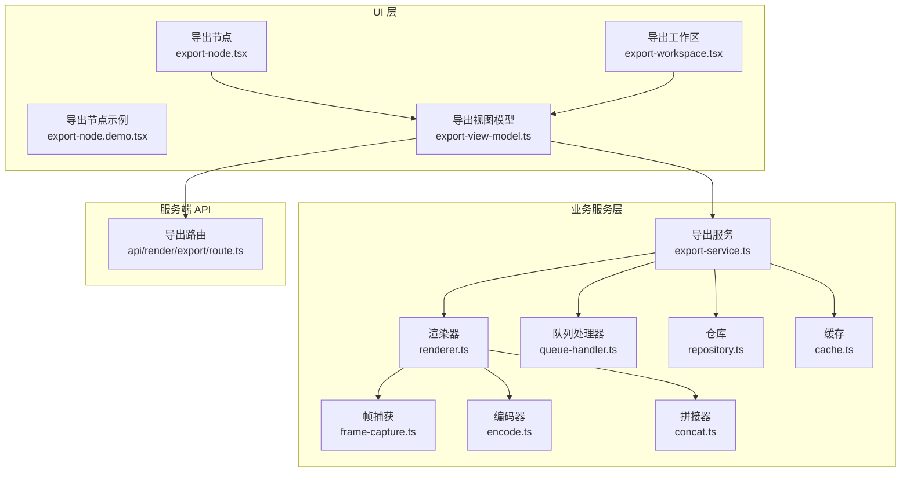
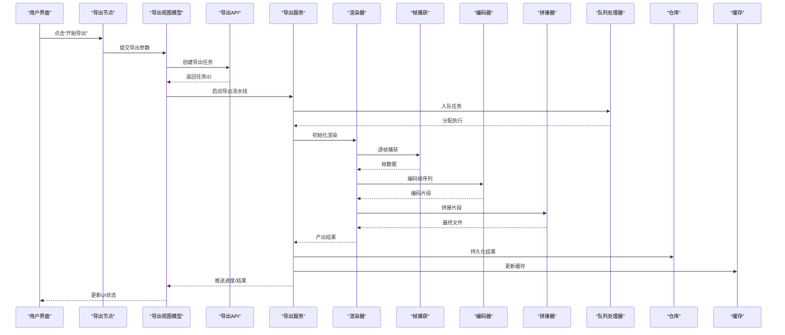
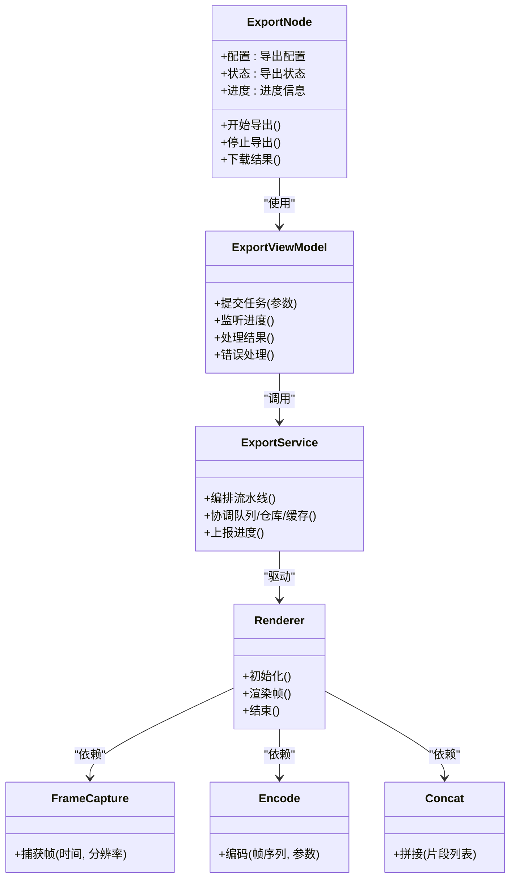
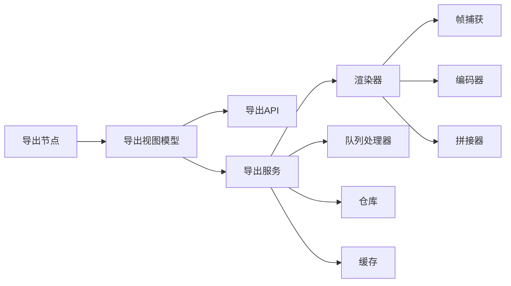

# 导出节点

<cite>
**本文引用的文件**   
- [export-node.tsx](file://src/components/ui/node/export-node.tsx)
- [export-node.demo.tsx](file://src/components/ui/node/export-node.demo.tsx)
- [types.ts](file://src/components/ui/node/types.ts)
- [export-service.ts](file://src/features/render/export-service.ts)
- [encode.ts](file://src/features/render/encode.ts)
- [frame-capture.ts](file://src/features/render/frame-capture.ts)
- [concat.ts](file://src/features/render/concat.ts)
- [queue-handler.ts](file://src/features/render/queue-handler.ts)
- [repository.ts](file://src/features/render/repository.ts)
- [cache.ts](file://src/features/render/cache.ts)
- [renderer.ts](file://src/features/render/renderer.ts)
- [types.ts](file://src/features/render/types.ts)
- [route.ts](file://src/app/api/render/export/route.ts)
- [export-api.ts](file://src/app/canvas/export/export-api.ts)
- [export-view-model.ts](file://src/app/canvas/export/export-view-model.ts)
- [export-workspace.tsx](file://src/app/canvas/export/export-workspace.tsx)
</cite>

## 目录
1. [简介](#简介)
2. [项目结构](#项目结构)
3. [核心组件](#核心组件)
4. [架构总览](#架构总览)
5. [详细组件分析](#详细组件分析)
6. [依赖关系分析](#依赖关系分析)
7. [性能考虑](#性能考虑)
8. [故障排查指南](#故障排查指南)
9. [结论](#结论)
10. [附录](#附录)

## 简介
本文件面向“导出节点”（ExportNode）的完整技术文档，覆盖渲染导出流程、格式转换与质量控制、配置项说明、与渲染引擎协作和任务调度机制、进度监控与结果处理、错误处理与重试策略，以及在不同场景下的配置建议与性能调优方法。读者无需深入前端或后端细节即可理解并正确使用该组件。

## 项目结构
导出功能由“UI 层（节点与视图）— 业务服务层（渲染与编码）— 服务端 API — 持久化与缓存”四层组成：
- UI 层：导出节点、演示页、导出工作区与视图模型
- 业务服务层：导出编排、帧捕获、编码、拼接、队列与仓库
- 服务端 API：导出任务的创建与查询
- 持久化与缓存：任务存储与中间产物缓存

图表来源
- [export-node.tsx:1-200](file://src/components/ui/node/export-node.tsx#L1-L200)
- [export-view-model.ts:1-200](file://src/app/canvas/export/export-view-model.ts#L1-L200)
- [export-workspace.tsx:1-200](file://src/app/canvas/export/export-workspace.tsx#L1-L200)
- [export-service.ts:1-200](file://src/features/render/export-service.ts#L1-L200)
- [renderer.ts:1-200](file://src/features/render/renderer.ts#L1-L200)
- [frame-capture.ts:1-200](file://src/features/render/frame-capture.ts#L1-L200)
- [encode.ts:1-200](file://src/features/render/encode.ts#L1-L200)
- [concat.ts:1-200](file://src/features/render/concat.ts#L1-L200)
- [queue-handler.ts:1-200](file://src/features/render/queue-handler.ts#L1-L200)
- [repository.ts:1-200](file://src/features/render/repository.ts#L1-L200)
- [cache.ts:1-200](file://src/features/render/cache.ts#L1-L200)
- [route.ts:1-200](file://src/app/api/render/export/route.ts#L1-L200)

章节来源
- [export-node.tsx:1-200](file://src/components/ui/node/export-node.tsx#L1-L200)
- [export-view-model.ts:1-200](file://src/app/canvas/export/export-view-model.ts#L1-L200)
- [export-workspace.tsx:1-200](file://src/app/canvas/export/export-workspace.tsx#L1-L200)
- [export-service.ts:1-200](file://src/features/render/export-service.ts#L1-L200)
- [renderer.ts:1-200](file://src/features/render/renderer.ts#L1-L200)
- [frame-capture.ts:1-200](file://src/features/render/frame-capture.ts#L1-L200)
- [encode.ts:1-200](file://src/features/render/encode.ts#L1-L200)
- [concat.ts:1-200](file://src/features/render/concat.ts#L1-L200)
- [queue-handler.ts:1-200](file://src/features/render/queue-handler.ts#L1-L200)
- [repository.ts:1-200](file://src/features/render/repository.ts#L1-L200)
- [cache.ts:1-200](file://src/features/render/cache.ts#L1-L200)
- [route.ts:1-200](file://src/app/api/render/export/route.ts#L1-L200)

## 核心组件
- 导出节点（ExportNode）
  - 负责在画布中作为可视化节点承载导出配置，提供属性面板与交互入口。
  - 关键职责：读取/保存导出配置、触发导出任务、展示状态与进度、暴露预览与下载能力。
- 导出视图模型（ExportViewModel）
  - 封装导出相关的数据流与副作用：提交任务、轮询状态、聚合进度、处理结果。
- 导出服务（ExportService）
  - 编排渲染管线：帧捕获 → 编码 → 拼接；协调队列、仓库与缓存；上报进度与结果。
- 渲染器（Renderer）
  - 驱动帧级渲染，调用帧捕获与编码器，输出中间产物与最终媒体。
- 帧捕获（FrameCapture）
  - 从渲染上下文抓取指定分辨率与时间点的帧数据。
- 编码器（Encode）
  - 将帧序列转换为目标格式（如视频/图像序列），支持质量与码率控制。
- 拼接器（Concat）
  - 将分片片段合并为最终文件，保证时序与连续性。
- 队列处理器（QueueHandler）
  - 管理并发、优先级与重试，保障系统稳定性。
- 仓库（Repository）
  - 持久化导出任务元数据与结果引用。
- 缓存（Cache）
  - 缓存中间产物以加速重复导出与断点续导。

章节来源
- [export-node.tsx:1-200](file://src/components/ui/node/export-node.tsx#L1-L200)
- [export-view-model.ts:1-200](file://src/app/canvas/export/export-view-model.ts#L1-L200)
- [export-service.ts:1-200](file://src/features/render/export-service.ts#L1-L200)
- [renderer.ts:1-200](file://src/features/render/renderer.ts#L1-L200)
- [frame-capture.ts:1-200](file://src/features/render/frame-capture.ts#L1-L200)
- [encode.ts:1-200](file://src/features/render/encode.ts#L1-L200)
- [concat.ts:1-200](file://src/features/render/concat.ts#L1-L200)
- [queue-handler.ts:1-200](file://src/features/render/queue-handler.ts#L1-L200)
- [repository.ts:1-200](file://src/features/render/repository.ts#L1-L200)
- [cache.ts:1-200](file://src/features/render/cache.ts#L1-L200)

## 架构总览
导出节点通过视图模型与服务层协作，完成从配置到最终产物的全流程。下图展示了端到端调用链路与关键数据流转。

图表来源
- [export-view-model.ts:1-200](file://src/app/canvas/export/export-view-model.ts#L1-L200)
- [route.ts:1-200](file://src/app/api/render/export/route.ts#L1-L200)
- [export-service.ts:1-200](file://src/features/render/export-service.ts#L1-L200)
- [renderer.ts:1-200](file://src/features/render/renderer.ts#L1-L200)
- [frame-capture.ts:1-200](file://src/features/render/frame-capture.ts#L1-L200)
- [encode.ts:1-200](file://src/features/render/encode.ts#L1-L200)
- [concat.ts:1-200](file://src/features/render/concat.ts#L1-L200)
- [queue-handler.ts:1-200](file://src/features/render/queue-handler.ts#L1-L200)
- [repository.ts:1-200](file://src/features/render/repository.ts#L1-L200)
- [cache.ts:1-200](file://src/features/render/cache.ts#L1-L200)

## 详细组件分析

### 导出节点（ExportNode）
- 角色与职责
  - 作为画布中的可视化节点，承载导出配置与运行态信息。
  - 提供属性编辑入口，绑定到导出视图模型，驱动任务生命周期。
- 关键交互
  - 打开导出面板：读取当前节点配置，填充默认值。
  - 开始导出：校验配置后提交任务，订阅进度事件。
  - 结果展示：显示成功/失败状态、下载链接、错误提示。
- 配置项概览
  - 输出格式：视频容器/图像序列等。
  - 分辨率：宽度×高度，支持预设与自定义。
  - 帧率：每秒帧数，影响时长与文件大小。
  - 编码参数：码率、质量等级、关键帧间隔等。
  - 区域裁剪：可选的局部导出范围。
  - 音频轨道：是否包含音轨及混音策略。
- 状态与进度
  - 状态枚举：待处理、排队中、进行中、已完成、失败。
  - 进度回调：百分比、阶段名称、剩余时间估算。
- 错误与重试
  - 网络异常：自动重试与退避。
  - 编码失败：回退至低质量或分段重试。
  - 资源不足：降级分辨率或关闭特效。

图表来源
- [export-node.tsx:1-200](file://src/components/ui/node/export-node.tsx#L1-L200)
- [export-view-model.ts:1-200](file://src/app/canvas/export/export-view-model.ts#L1-L200)
- [export-service.ts:1-200](file://src/features/render/export-service.ts#L1-L200)
- [renderer.ts:1-200](file://src/features/render/renderer.ts#L1-L200)
- [frame-capture.ts:1-200](file://src/features/render/frame-capture.ts#L1-L200)
- [encode.ts:1-200](file://src/features/render/encode.ts#L1-L200)
- [concat.ts:1-200](file://src/features/render/concat.ts#L1-L200)

章节来源
- [export-node.tsx:1-200](file://src/components/ui/node/export-node.tsx#L1-L200)
- [export-node.demo.tsx:1-200](file://src/components/ui/node/export-node.demo.tsx#L1-L200)
- [types.ts:1-200](file://src/components/ui/node/types.ts#L1-L200)

### 导出视图模型（ExportViewModel）
- 职责
  - 统一封装导出相关的状态机与副作用，向 UI 暴露简洁接口。
- 关键流程
  - 参数校验：检查必填字段、取值范围与兼容性。
  - 任务创建：调用服务端 API 创建任务并获取 ID。
  - 进度订阅：拉取或接收推送的进度事件，映射为 UI 可读状态。
  - 结果处理：生成下载链接、记录审计日志、清理临时资源。
- 错误处理
  - 分类错误：参数错误、网络错误、服务端错误、渲染错误。
  - 重试策略：指数退避、最大重试次数、可取消。
- 示例路径
  - 配置导出参数并提交任务：[export-view-model.ts](file://src/app/canvas/export/export-view-model.ts)
  - 监听进度与处理结果：[export-view-model.ts](file://src/app/canvas/export/export-view-model.ts)

章节来源
- [export-view-model.ts:1-200](file://src/app/canvas/export/export-view-model.ts#L1-L200)

### 导出服务（ExportService）
- 职责
  - 编排渲染管线，协调队列、仓库与缓存，确保高可用与可观测性。
- 关键流程
  - 入队：根据优先级与资源可用性安排执行。
  - 执行：初始化渲染器，按帧循环捕获与编码。
  - 合并：将编码片段拼接为最终文件。
  - 持久化：写入仓库，更新缓存索引。
- 质量控制
  - 帧完整性校验、编码一致性检查、输出文件大小阈值。
- 示例路径
  - 编排与调度：[export-service.ts](file://src/features/render/export-service.ts)
  - 队列与重试：[queue-handler.ts](file://src/features/render/queue-handler.ts)
  - 仓库与缓存：[repository.ts](file://src/features/render/repository.ts), [cache.ts](file://src/features/render/cache.ts)

章节来源
- [export-service.ts:1-200](file://src/features/render/export-service.ts#L1-L200)
- [queue-handler.ts:1-200](file://src/features/render/queue-handler.ts#L1-L200)
- [repository.ts:1-200](file://src/features/render/repository.ts#L1-L200)
- [cache.ts:1-200](file://src/features/render/cache.ts#L1-L200)

### 渲染器（Renderer）
- 职责
  - 驱动帧级渲染，串联帧捕获与编码，维护渲染上下文与资源。
- 关键流程
  - 初始化：加载素材、设置分辨率与帧率、准备编码器。
  - 渲染循环：按时间轴推进，捕获帧并送入编码器。
  - 收尾：释放资源、汇总统计信息、通知上层完成。
- 示例路径
  - 渲染主循环与错误边界：[renderer.ts](file://src/features/render/renderer.ts)

章节来源
- [renderer.ts:1-200](file://src/features/render/renderer.ts#L1-L200)

### 帧捕获（FrameCapture）
- 职责
  - 从渲染上下文提取指定时间点与分辨率的帧数据。
- 关键点
  - 分辨率适配：缩放与像素对齐。
  - 时间精度：帧边界对齐与插值策略。
- 示例路径
  - 捕获实现与异常处理：[frame-capture.ts](file://src/features/render/frame-capture.ts)

章节来源
- [frame-capture.ts:1-200](file://src/features/render/frame-capture.ts#L1-L200)

### 编码器（Encode）
- 职责
  - 将帧序列编码为目标格式，支持质量与码率控制。
- 关键点
  - 格式选择：MP4/WebM/图像序列等。
  - 质量策略：恒定码率（CBR）、可变码率（VBR）、质量等级。
  - 关键帧策略：GOP 长度与自适应调整。
- 示例路径
  - 编码参数与质量控制：[encode.ts](file://src/features/render/encode.ts)

章节来源
- [encode.ts:1-200](file://src/features/render/encode.ts#L1-L200)

### 拼接器（Concat）
- 职责
  - 将多个编码片段合并为连续的最终文件。
- 关键点
  - 顺序保证：基于时间戳排序与去重。
  - 容错处理：缺失片段检测与补录策略。
- 示例路径
  - 合并算法与校验：[concat.ts](file://src/features/render/concat.ts)

章节来源
- [concat.ts:1-200](file://src/features/render/concat.ts#L1-L200)

### 服务端导出 API（Export Route）
- 职责
  - 提供导出任务的创建与查询接口，校验请求参数，返回任务标识。
- 关键点
  - 权限与配额：鉴权与速率限制。
  - 响应格式：标准任务对象与错误码。
- 示例路径
  - 路由实现与错误处理：[route.ts](file://src/app/api/render/export/route.ts)

章节来源
- [route.ts:1-200](file://src/app/api/render/export/route.ts#L1-L200)

### 导出工作区与 API 封装
- 职责
  - 导出工作区提供页面级布局与交互；API 封装简化调用。
- 关键点
  - 状态同步：与视图模型保持一致。
  - 错误提示：统一错误消息与重试入口。
- 示例路径
  - 工作区与 API 封装：[export-workspace.tsx](file://src/app/canvas/export/export-workspace.tsx), [export-api.ts](file://src/app/canvas/export/export-api.ts)

章节来源
- [export-workspace.tsx:1-200](file://src/app/canvas/export/export-workspace.tsx#L1-L200)
- [export-api.ts:1-200](file://src/app/canvas/export/export-api.ts#L1-L200)

## 依赖关系分析
- 组件耦合
  - 导出节点仅依赖视图模型，避免直接耦合服务层，提升可测试性。
  - 视图模型集中管理副作用，降低 UI 复杂度。
- 外部依赖
  - 队列处理器抽象了并发与重试策略，便于替换实现。
  - 仓库与缓存解耦存储介质，支持本地/云端切换。
- 潜在风险
  - 渲染器对帧捕获与编码器的强依赖，需关注版本兼容与异常传播。
  - 队列积压时可能引发内存压力，需结合缓存与分片策略缓解。

图表来源
- [export-node.tsx:1-200](file://src/components/ui/node/export-node.tsx#L1-L200)
- [export-view-model.ts:1-200](file://src/app/canvas/export/export-view-model.ts#L1-L200)
- [export-service.ts:1-200](file://src/features/render/export-service.ts#L1-L200)
- [renderer.ts:1-200](file://src/features/render/renderer.ts#L1-L200)
- [frame-capture.ts:1-200](file://src/features/render/frame-capture.ts#L1-L200)
- [encode.ts:1-200](file://src/features/render/encode.ts#L1-L200)
- [concat.ts:1-200](file://src/features/render/concat.ts#L1-L200)
- [queue-handler.ts:1-200](file://src/features/render/queue-handler.ts#L1-L200)
- [repository.ts:1-200](file://src/features/render/repository.ts#L1-L200)
- [cache.ts:1-200](file://src/features/render/cache.ts#L1-L200)

章节来源
- [export-node.tsx:1-200](file://src/components/ui/node/export-node.tsx#L1-L200)
- [export-view-model.ts:1-200](file://src/app/canvas/export/export-view-model.ts#L1-L200)
- [export-service.ts:1-200](file://src/features/render/export-service.ts#L1-L200)
- [renderer.ts:1-200](file://src/features/render/renderer.ts#L1-L200)
- [frame-capture.ts:1-200](file://src/features/render/frame-capture.ts#L1-L200)
- [encode.ts:1-200](file://src/features/render/encode.ts#L1-L200)
- [concat.ts:1-200](file://src/features/render/concat.ts#L1-L200)
- [queue-handler.ts:1-200](file://src/features/render/queue-handler.ts#L1-L200)
- [repository.ts:1-200](file://src/features/render/repository.ts#L1-L200)
- [cache.ts:1-200](file://src/features/render/cache.ts#L1-L200)

## 性能考虑
- 分辨率与帧率
  - 高分辨率与高帧率显著提升 CPU/GPU 负载，建议在预览阶段使用较低参数，最终导出再提升。
- 编码策略
  - 优先使用硬件加速编码器（若可用），合理设置 GOP 与码率，平衡画质与体积。
- 并行与分片
  - 利用队列处理器进行任务级并行，帧级分片编码减少内存峰值。
- 缓存命中
  - 对相同配置的导出复用中间产物，显著缩短二次导出时间。
- I/O 优化
  - 使用异步写入与缓冲策略，避免阻塞渲染主循环。

## 故障排查指南
- 常见问题
  - 参数无效：检查分辨率、帧率、码率是否在允许范围内。
  - 编码失败：确认编码器支持目标格式与参数组合。
  - 队列积压：观察队列长度与资源占用，必要时扩容或降配。
  - 结果不完整：检查拼接器日志与片段完整性。
- 定位步骤
  - 查看任务状态与阶段：通过视图模型与 API 获取任务详情。
  - 检查中间产物：仓库与缓存中是否存在有效片段。
  - 复现最小用例：缩小导出范围与分辨率，逐步定位问题。
- 恢复策略
  - 自动重试：网络与瞬时错误采用指数退避。
  - 断点续导：基于缓存与仓库恢复未完成的片段。
  - 降级模式：自动降低分辨率或码率以保证成功率。

章节来源
- [queue-handler.ts:1-200](file://src/features/render/queue-handler.ts#L1-L200)
- [repository.ts:1-200](file://src/features/render/repository.ts#L1-L200)
- [cache.ts:1-200](file://src/features/render/cache.ts#L1-L200)
- [export-view-model.ts:1-200](file://src/app/canvas/export/export-view-model.ts#L1-L200)
- [route.ts:1-200](file://src/app/api/render/export/route.ts#L1-L200)

## 结论
导出节点通过清晰的层次划分与职责分离，实现了从配置到产物的稳定流程。借助队列、缓存与仓库，系统在可扩展性与可靠性方面具备良好基础。针对不同的应用场景，可通过分辨率、帧率、编码参数与并行策略进行灵活调优，以满足画质、体积与时效的多维需求。

## 附录

### 配置选项清单
- 输出格式
  - 视频容器：MP4、WebM 等
  - 图像序列：PNG、JPEG 等
- 分辨率
  - 宽度、高度、预设比例（16:9、4:3、1:1）
- 帧率
  - 24/30/60 fps，支持自定义
- 编码参数
  - 码率（CBR/VBR）、质量等级、关键帧间隔
- 区域裁剪
  - 起始/结束时间、画布裁剪矩形
- 音频
  - 是否包含音轨、音量增益、静音段处理

章节来源
- [types.ts:1-200](file://src/components/ui/node/types.ts#L1-L200)
- [encode.ts:1-200](file://src/features/render/encode.ts#L1-L200)
- [frame-capture.ts:1-200](file://src/features/render/frame-capture.ts#L1-L200)

### 使用示例路径
- 配置导出参数并提交任务
  - [export-view-model.ts](file://src/app/canvas/export/export-view-model.ts)
- 监听导出进度与处理结果
  - [export-view-model.ts](file://src/app/canvas/export/export-view-model.ts)
- 在页面中使用导出节点
  - [export-node.demo.tsx](file://src/components/ui/node/export-node.demo.tsx)
  - [export-workspace.tsx](file://src/app/canvas/export/export-workspace.tsx)