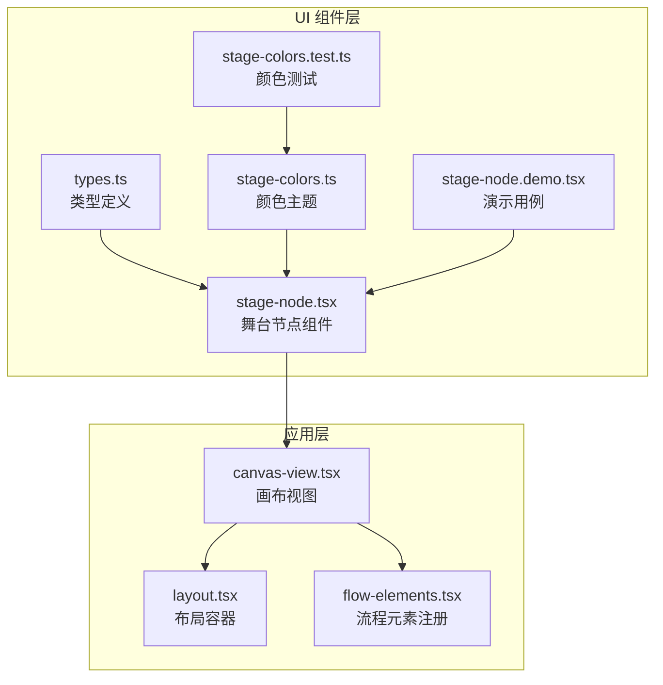
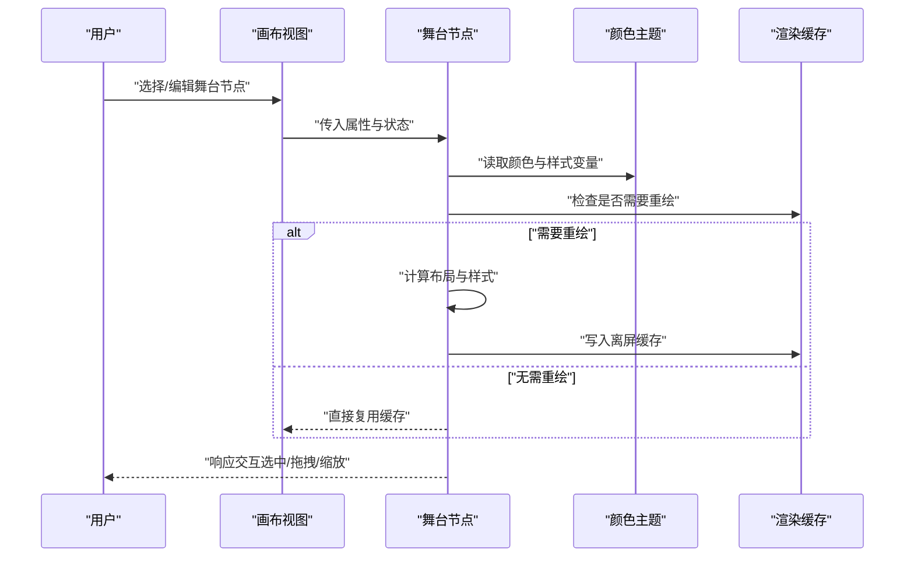
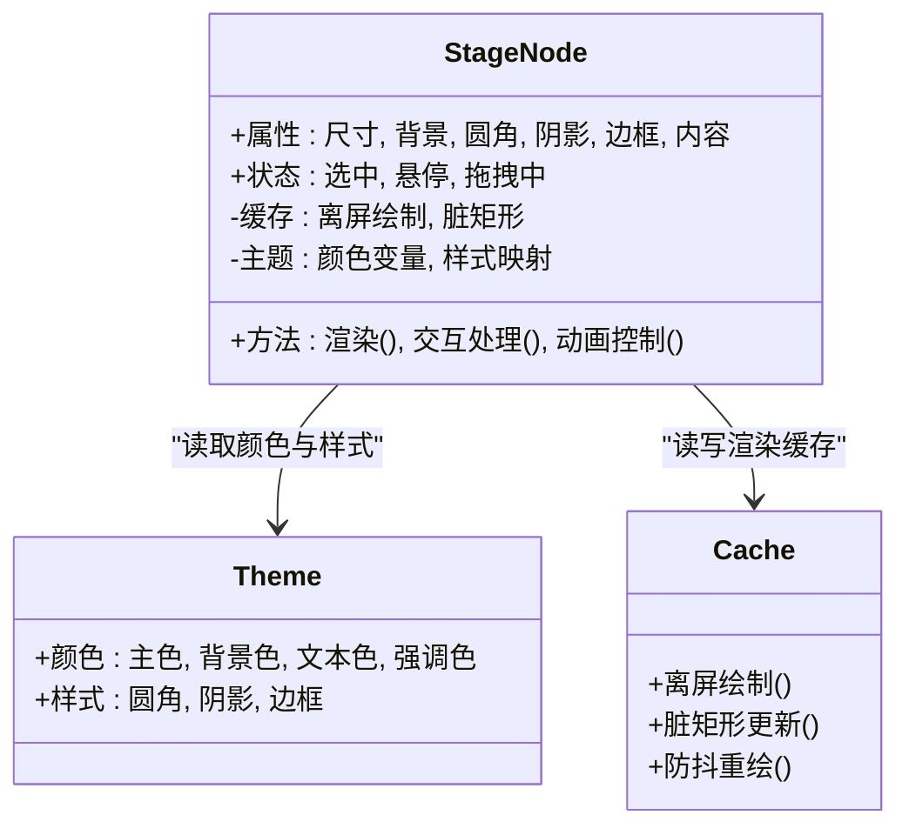
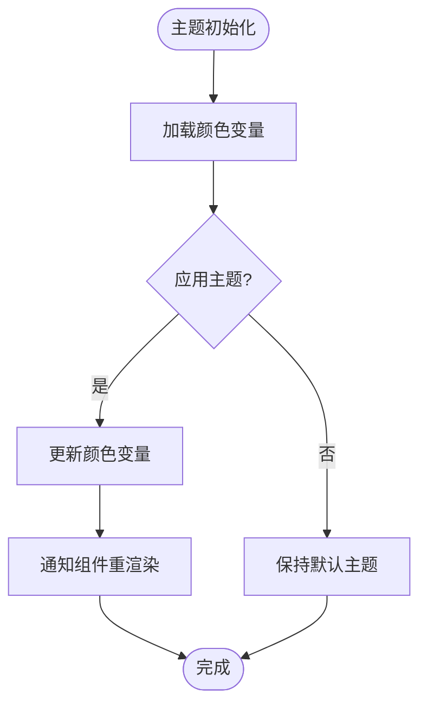
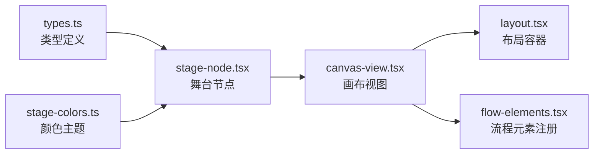

# 舞台节点

<cite>
**本文引用的文件**   
- [stage-node.tsx](file://src/components/ui/node/stage-node.tsx)
- [stage-colors.ts](file://src/components/ui/node/stage-colors.ts)
- [types.ts](file://src/components/ui/node/types.ts)
- [stage-node.demo.tsx](file://src/components/ui/node/stage-node.demo.tsx)
- [stage-colors.test.ts](file://src/components/ui/node/stage-colors.test.ts)
- [canvas-view.tsx](file://src/app/canvas/canvas-view.tsx)
- [layout.tsx](file://src/app/canvas/layout.tsx)
- [flow-elements.tsx](file://src/app/canvas/flow-elements.tsx)
</cite>

## 目录
1. [简介](#简介)
2. [项目结构](#项目结构)
3. [核心组件](#核心组件)
4. [架构总览](#架构总览)
5. [详细组件分析](#详细组件分析)
6. [依赖关系分析](#依赖关系分析)
7. [性能考量](#性能考量)
8. [故障排查指南](#故障排查指南)
9. [结论](#结论)
10. [附录](#附录)

## 简介
本文件面向“舞台节点”（StageNode）的实现与使用，系统性阐述其实现原理、视觉渲染逻辑、交互行为、属性配置（尺寸、背景样式、颜色主题等）、与其他节点的连接关系与数据流转，并提供自定义样式、添加动画效果、处理用户交互的实践示例。同时给出性能优化策略与渲染缓存机制建议，以及常见使用场景与最佳实践。

## 项目结构
舞台节点位于 UI 组件层的 node 子模块中，围绕类型定义、颜色主题、组件实现与演示用例组织：
- 类型与接口：统一节点属性与状态类型
- 颜色主题：集中管理舞台节点的颜色变量与主题切换
- 组件实现：封装舞台节点的渲染、布局、交互与可访问性
- 演示用例：提供快速上手与样式定制示例
- 集成位置：在画布视图中作为流程元素之一被渲染

**图表来源** 
- [stage-node.tsx](file://src/components/ui/node/stage-node.tsx)
- [stage-colors.ts](file://src/components/ui/node/stage-colors.ts)
- [types.ts](file://src/components/ui/node/types.ts)
- [stage-node.demo.tsx](file://src/components/ui/node/stage-node.demo.tsx)
- [stage-colors.test.ts](file://src/components/ui/node/stage-colors.test.ts)
- [canvas-view.tsx](file://src/app/canvas/canvas-view.tsx)
- [layout.tsx](file://src/app/canvas/layout.tsx)
- [flow-elements.tsx](file://src/app/canvas/flow-elements.tsx)

**章节来源**
- [stage-node.tsx](file://src/components/ui/node/stage-node.tsx)
- [stage-colors.ts](file://src/components/ui/node/stage-colors.ts)
- [types.ts](file://src/components/ui/node/types.ts)
- [stage-node.demo.tsx](file://src/components/ui/node/stage-node.demo.tsx)
- [stage-colors.test.ts](file://src/components/ui/node/stage-colors.test.ts)
- [canvas-view.tsx](file://src/app/canvas/canvas-view.tsx)
- [layout.tsx](file://src/app/canvas/layout.tsx)
- [flow-elements.tsx](file://src/app/canvas/flow-elements.tsx)

## 核心组件
- 舞台节点组件（StageNode）
  - 职责：负责舞台区域的绘制、尺寸与背景样式、颜色主题适配、用户交互（点击、拖拽、缩放等）与可访问性。
  - 关键能力：
    - 尺寸设置：支持宽高、最小/最大尺寸、自适应比例
    - 背景样式：纯色、渐变、图片背景、圆角、阴影
    - 颜色主题：基于主题系统动态切换前景/背景色
    - 交互行为：选中态、悬停态、拖拽移动、边界约束
    - 动画效果：入场/出场、过渡、缓动曲线
    - 渲染缓存：离屏绘制、增量更新、防抖重绘
- 颜色主题（stage-colors）
  - 职责：集中管理舞台节点的颜色变量，支持明暗主题与品牌色扩展
- 类型定义（types）
  - 职责：定义节点属性、状态、事件回调与配置项的 TypeScript 类型

**章节来源**
- [stage-node.tsx](file://src/components/ui/node/stage-node.tsx)
- [stage-colors.ts](file://src/components/ui/node/stage-colors.ts)
- [types.ts](file://src/components/ui/node/types.ts)

## 架构总览
舞台节点在画布视图中作为流程元素被渲染，遵循“类型驱动 + 主题化 + 交互层分离”的设计模式：
- 类型驱动：通过统一的类型定义确保属性校验与 IDE 提示
- 主题化：颜色与样式由主题系统注入，便于全局切换
- 交互层：将鼠标/触摸事件与业务动作解耦，便于扩展
- 渲染层：采用离屏缓存与增量更新，降低重绘开销

**图表来源** 
- [canvas-view.tsx](file://src/app/canvas/canvas-view.tsx)
- [stage-node.tsx](file://src/components/ui/node/stage-node.tsx)
- [stage-colors.ts](file://src/components/ui/node/stage-colors.ts)

**章节来源**
- [canvas-view.tsx](file://src/app/canvas/canvas-view.tsx)
- [stage-node.tsx](file://src/components/ui/node/stage-node.tsx)
- [stage-colors.ts](file://src/components/ui/node/stage-colors.ts)

## 详细组件分析

### 舞台节点（StageNode）组件
- 实现要点
  - 属性配置：尺寸（宽/高/比例）、背景（颜色/渐变/图片）、圆角、阴影、边框、内容区域
  - 颜色主题：从主题系统获取主色、背景色、文本色、强调色
  - 交互行为：点击选中、双击编辑、拖拽移动、边界限制、缩放手柄
  - 动画效果：入场/出场、过渡、缓动；支持暂停/恢复
  - 渲染缓存：离屏绘制、脏矩形更新、防抖节流
- 数据流
  - 输入：节点属性、状态、主题、事件回调
  - 输出：渲染结果、交互事件、状态变更
- 错误处理
  - 属性校验失败时回退到默认值
  - 资源加载失败时显示占位图或降级样式

**图表来源** 
- [stage-node.tsx](file://src/components/ui/node/stage-node.tsx)
- [stage-colors.ts](file://src/components/ui/node/stage-colors.ts)

**章节来源**
- [stage-node.tsx](file://src/components/ui/node/stage-node.tsx)

### 颜色主题（stage-colors）
- 职责：集中管理舞台节点的颜色变量，支持明暗主题与品牌色扩展
- 关键点：
  - 主题切换：动态更新颜色变量，触发组件重渲染
  - 品牌色：支持多品牌色方案，便于企业定制
  - 可访问性：对比度校验，确保文本可读性

**图表来源** 
- [stage-colors.ts](file://src/components/ui/node/stage-colors.ts)

**章节来源**
- [stage-colors.ts](file://src/components/ui/node/stage-colors.ts)

### 类型定义（types）
- 职责：定义节点属性、状态、事件回调与配置项的 TypeScript 类型
- 关键点：
  - 属性类型：尺寸、背景、样式、内容等
  - 状态类型：选中、悬停、拖拽中等
  - 事件回调：点击、拖拽、缩放等
  - 配置项：动画、缓存、主题等

**章节来源**
- [types.ts](file://src/components/ui/node/types.ts)

### 演示用例（stage-node.demo）
- 用途：展示如何自定义舞台节点样式、添加动画效果、处理用户交互
- 示例：
  - 自定义背景：渐变色、图片背景
  - 动画效果：入场动画、悬停放大
  - 交互处理：点击选中、拖拽移动、缩放

**章节来源**
- [stage-node.demo.tsx](file://src/components/ui/node/stage-node.demo.tsx)

### 颜色测试（stage-colors.test）
- 用途：验证颜色主题的正确性与一致性
- 覆盖：
  - 主题切换后颜色变量更新
  - 品牌色替换后的对比度校验

**章节来源**
- [stage-colors.test.ts](file://src/components/ui/node/stage-colors.test.ts)

## 依赖关系分析
舞台节点依赖类型定义与颜色主题，并在画布视图中被渲染为流程元素：

**图表来源** 
- [types.ts](file://src/components/ui/node/types.ts)
- [stage-colors.ts](file://src/components/ui/node/stage-colors.ts)
- [stage-node.tsx](file://src/components/ui/node/stage-node.tsx)
- [canvas-view.tsx](file://src/app/canvas/canvas-view.tsx)
- [layout.tsx](file://src/app/canvas/layout.tsx)
- [flow-elements.tsx](file://src/app/canvas/flow-elements.tsx)

**章节来源**
- [types.ts](file://src/components/ui/node/types.ts)
- [stage-colors.ts](file://src/components/ui/node/stage-colors.ts)
- [stage-node.tsx](file://src/components/ui/node/stage-node.tsx)
- [canvas-view.tsx](file://src/app/canvas/canvas-view.tsx)
- [layout.tsx](file://src/app/canvas/layout.tsx)
- [flow-elements.tsx](file://src/app/canvas/flow-elements.tsx)

## 性能考量
- 渲染缓存
  - 离屏绘制：将复杂图形绘制到离屏缓冲区，减少主线程压力
  - 脏矩形更新：仅重绘变化区域，避免全量刷新
  - 防抖节流：对高频事件（如拖拽）进行节流，降低重绘频率
- 内存管理
  - 及时释放离屏缓冲区，避免内存泄漏
  - 图片资源懒加载，按需加载大图
- 动画优化
  - 使用 GPU 加速的 CSS 变换与透明度动画
  - 避免在动画循环中进行复杂计算
- 主题切换
  - 批量更新颜色变量，减少重渲染次数
  - 使用虚拟 DOM 差异更新，提升性能

[本节为通用性能指导，不直接分析具体文件]

## 故障排查指南
- 常见问题
  - 主题切换无效：检查颜色变量是否正确更新，组件是否订阅了主题变化
  - 渲染卡顿：检查是否存在频繁重绘，启用脏矩形更新与防抖
  - 内存泄漏：检查离屏缓冲区是否及时释放，图片资源是否懒加载
  - 交互异常：检查事件绑定是否正确，边界约束是否合理
- 调试技巧
  - 使用浏览器开发者工具监控重绘与内存占用
  - 打印关键状态与属性，定位问题根源
  - 编写单元测试覆盖颜色主题与交互逻辑

**章节来源**
- [stage-colors.test.ts](file://src/components/ui/node/stage-colors.test.ts)

## 结论
舞台节点作为画布中的核心组件，通过类型驱动、主题化与交互层分离的设计，实现了灵活的样式配置、流畅的交互体验与高效的渲染性能。结合渲染缓存与性能优化策略，可在大规模节点场景中保持稳定表现。建议在实际使用中遵循最佳实践，充分利用主题系统与动画能力，提升用户体验。

[本节为总结性内容，不直接分析具体文件]

## 附录
- 使用场景
  - 视频剪辑时间轴的舞台预览
  - 流程图编辑器中的舞台节点
  - 设计工具中的画布背景与内容区域
- 最佳实践
  - 使用主题系统统一管理颜色与样式
  - 合理使用渲染缓存，避免过度重绘
  - 提供清晰的交互反馈，提升用户体验
  - 编写单元测试，确保颜色主题与交互逻辑的正确性

[本节为补充信息，不直接分析具体文件]