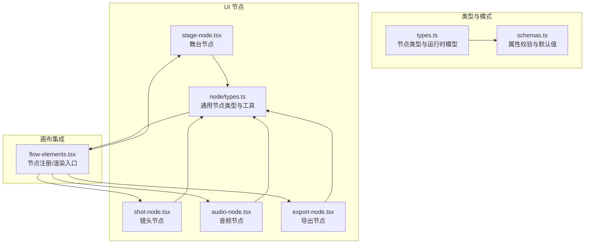
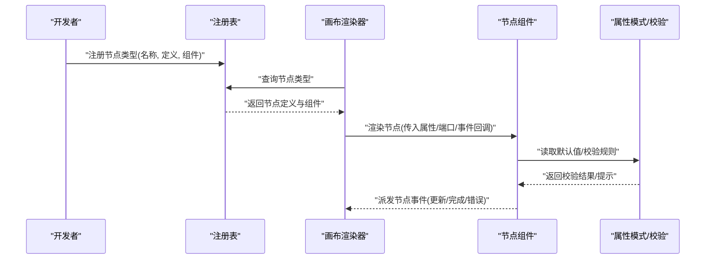
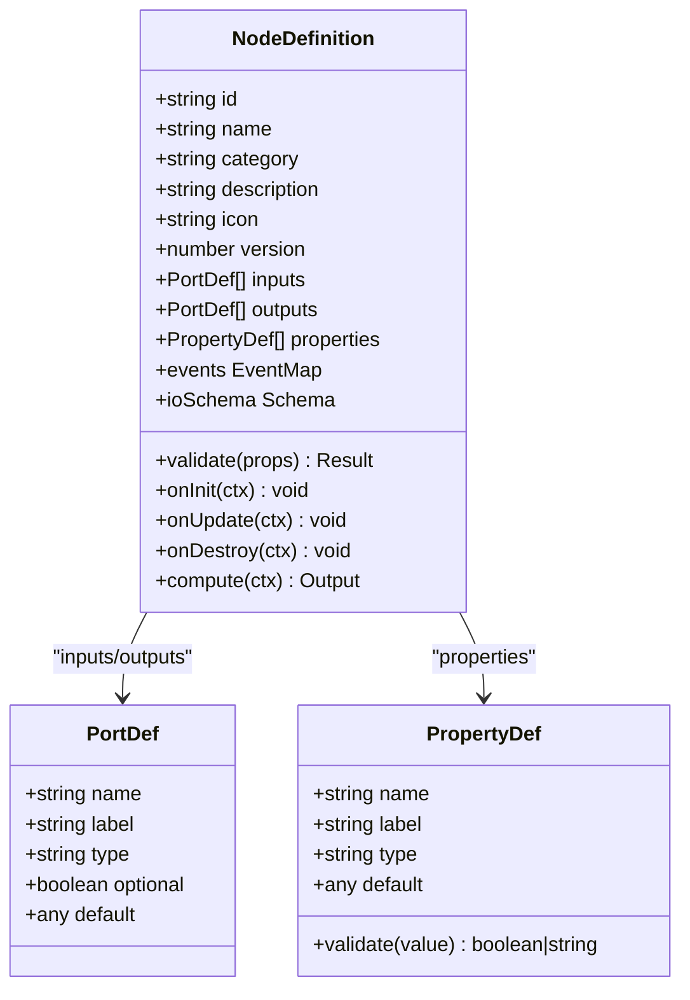
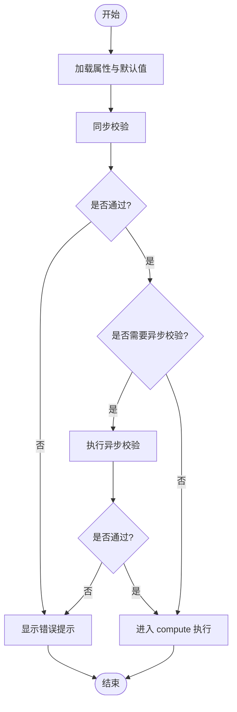
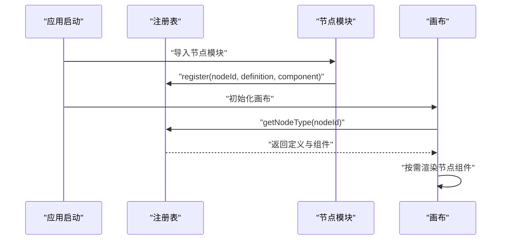
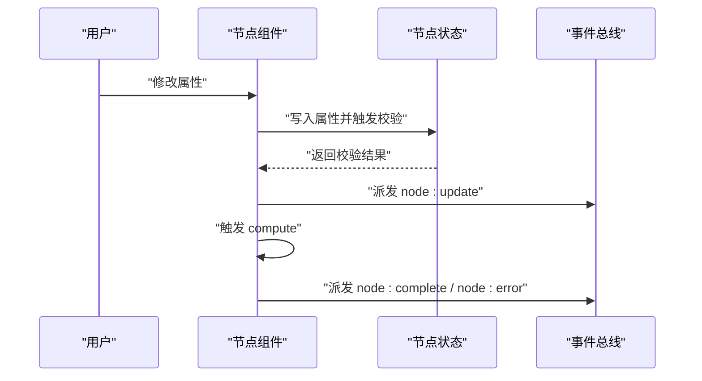
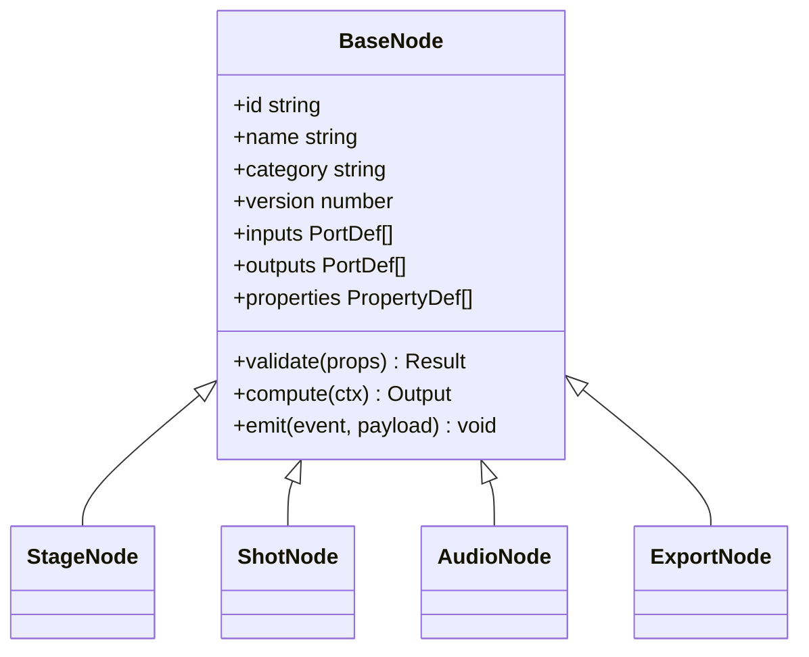
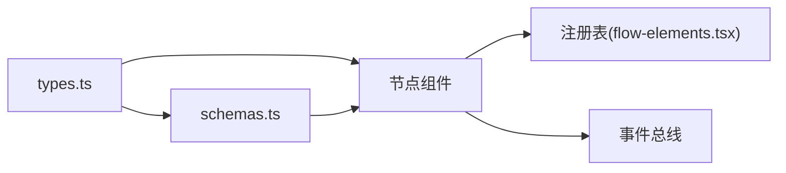

# 节点类型定义

<cite>
**本文引用的文件**   
- [src/components/ui/node/types.ts](file://src/components/ui/node/types.ts)
- [src/components/ui/node/stage-node.tsx](file://src/components/ui/node/stage-node.tsx)
- [src/components/ui/node/shot-node.tsx](file://src/components/ui/node/shot-node.tsx)
- [src/components/ui/node/audio-node.tsx](file://src/components/ui/node/audio-node.tsx)
- [src/components/ui/node/export-node.tsx](file://src/components/ui/node/export-node.tsx)
- [src/features/canvas/types.ts](file://src/features/canvas/types.ts)
- [src/features/canvas/schemas.ts](file://src/features/canvas/schemas.ts)
- [src/app/canvas/flow-elements.tsx](file://src/app/canvas/flow-elements.tsx)
</cite>

## 目录
1. [简介](#简介)
2. [项目结构](#项目结构)
3. [核心组件](#核心组件)
4. [架构总览](#架构总览)
5. [详细组件分析](#详细组件分析)
6. [依赖分析](#依赖分析)
7. [性能考虑](#性能考虑)
8. [故障排查指南](#故障排查指南)
9. [结论](#结论)
10. [附录](#附录)

## 简介
本文件聚焦于“节点类型系统”的设计与实现，围绕以下目标展开：
- 解释节点类型接口定义、属性系统架构与节点元数据管理
- 说明 NodeDefinition 接口的字段含义（节点配置、输入输出端口、属性验证规则等）
- 阐述节点类型的注册机制与动态加载原理
- 提供如何定义新节点类型、实现属性验证、处理节点事件的实践示例路径
- 梳理节点类型的继承关系与多态实现方式
- 给出节点类型设计的最佳实践与扩展指南

## 项目结构
节点类型系统主要分布在以下位置：
- 类型与模式定义：src/features/canvas/types.ts、src/features/canvas/schemas.ts
- UI 节点组件与类型：src/components/ui/node/*.tsx 与 types.ts
- 画布集成与渲染入口：src/app/canvas/flow-elements.tsx

图表来源
- [src/features/canvas/types.ts](file://src/features/canvas/types.ts)
- [src/features/canvas/schemas.ts](file://src/features/canvas/schemas.ts)
- [src/components/ui/node/types.ts](file://src/components/ui/node/types.ts)
- [src/components/ui/node/stage-node.tsx](file://src/components/ui/node/stage-node.tsx)
- [src/components/ui/node/shot-node.tsx](file://src/components/ui/node/shot-node.tsx)
- [src/components/ui/node/audio-node.tsx](file://src/components/ui/node/audio-node.tsx)
- [src/components/ui/node/export-node.tsx](file://src/components/ui/node/export-node.tsx)
- [src/app/canvas/flow-elements.tsx](file://src/app/canvas/flow-elements.tsx)

章节来源
- [src/features/canvas/types.ts](file://src/features/canvas/types.ts)
- [src/features/canvas/schemas.ts](file://src/features/canvas/schemas.ts)
- [src/components/ui/node/types.ts](file://src/components/ui/node/types.ts)
- [src/app/canvas/flow-elements.tsx](file://src/app/canvas/flow-elements.tsx)

## 核心组件
- 节点类型与运行时模型：在类型文件中定义节点实例、端口、连接、状态与事件等核心数据结构。
- 属性模式与校验：在模式文件中声明属性的类型、默认值、校验规则与显示选项，用于生成表单与运行期校验。
- UI 节点组件：每个业务节点对应一个 React 组件，负责展示、交互与事件派发。
- 节点注册与动态加载：通过统一的注册表将节点类型映射到具体组件，并在画布中按需渲染。

章节来源
- [src/features/canvas/types.ts](file://src/features/canvas/types.ts)
- [src/features/canvas/schemas.ts](file://src/features/canvas/schemas.ts)
- [src/components/ui/node/types.ts](file://src/components/ui/node/types.ts)
- [src/app/canvas/flow-elements.tsx](file://src/app/canvas/flow-elements.tsx)

## 架构总览
下图展示了从“类型定义 → 模式校验 → 组件渲染 → 注册与动态加载”的完整链路。

图表来源
- [src/app/canvas/flow-elements.tsx](file://src/app/canvas/flow-elements.tsx)
- [src/components/ui/node/types.ts](file://src/components/ui/node/types.ts)
- [src/features/canvas/schemas.ts](file://src/features/canvas/schemas.ts)

## 详细组件分析

### 节点类型接口与元数据（NodeDefinition）
- 节点标识与元信息
  - id/name：唯一标识与可读名称
  - category/description/icon：分类、描述与图标，用于侧边栏与搜索
  - version：版本控制，便于向后兼容
- 端口定义
  - inputs/outputs：输入/输出端口列表，包含 name、label、type、optional、default 等
  - ports 的 type 与 schemas 中的属性类型保持一致，确保序列化一致性
- 属性系统与验证
  - properties：节点可编辑的属性集合，由 schemas 定义类型、默认值与校验规则
  - validate：可选的自定义校验函数，用于跨字段或异步校验
- 行为与生命周期
  - onInit/onUpdate/onDestroy：节点创建、更新与销毁时的钩子
  - events：节点对外暴露的事件名与载荷类型
- 执行与数据流
  - compute：计算函数签名，接收输入端口与属性，产出输出端口
  - ioSchema：输入/输出的结构化模式，用于强类型校验与序列化

图表来源
- [src/features/canvas/types.ts](file://src/features/canvas/types.ts)
- [src/features/canvas/schemas.ts](file://src/features/canvas/schemas.ts)

章节来源
- [src/features/canvas/types.ts](file://src/features/canvas/types.ts)
- [src/features/canvas/schemas.ts](file://src/features/canvas/schemas.ts)

### 属性系统架构与校验流程
- 属性模式集中管理：所有节点的属性类型、默认值与校验规则集中在 schemas 中，保证一致性与可维护性。
- 校验时机：
  - 设计时：在属性面板中实时校验并反馈
  - 运行前：在节点初始化/更新前进行全量校验
  - 运行中：在 compute 之前再次校验，防止脏数据进入执行阶段
- 校验策略：
  - 基础类型校验（字符串、数字、布尔、枚举、数组、对象）
  - 组合校验（必填、范围、格式、正则）
  - 跨字段校验（如 A 存在则 B 必填）
  - 异步校验（如远程资源可用性检查）

图表来源
- [src/features/canvas/schemas.ts](file://src/features/canvas/schemas.ts)

章节来源
- [src/features/canvas/schemas.ts](file://src/features/canvas/schemas.ts)

### 节点注册与动态加载
- 注册表结构
  - 键：节点 id
  - 值：NodeDefinition 与对应组件的映射
- 注册流程
  - 模块加载时调用注册 API，将节点类型与组件绑定
  - 支持条件注册（按环境/功能开关）
- 动态加载
  - 画布启动时扫描已注册的节点类型
  - 根据节点 id 动态选择并渲染对应组件
  - 支持懒加载大型组件以提升首屏性能

图表来源
- [src/app/canvas/flow-elements.tsx](file://src/app/canvas/flow-elements.tsx)
- [src/components/ui/node/types.ts](file://src/components/ui/node/types.ts)

章节来源
- [src/app/canvas/flow-elements.tsx](file://src/app/canvas/flow-elements.tsx)
- [src/components/ui/node/types.ts](file://src/components/ui/node/types.ts)

### 节点组件与事件处理
- 组件职责
  - 展示节点属性与端口
  - 触发属性变更并回写到节点状态
  - 派发节点事件（如开始/完成/错误），供上层编排
- 事件模型
  - 事件名：标准化命名（如 node:start、node:complete、node:error）
  - 事件载荷：包含上下文、输入快照、输出摘要等
- 典型流程
  - 用户修改属性 → 触发校验 → 更新节点状态 → 重新计算 → 派发完成事件

图表来源
- [src/components/ui/node/stage-node.tsx](file://src/components/ui/node/stage-node.tsx)
- [src/components/ui/node/shot-node.tsx](file://src/components/ui/node/shot-node.tsx)
- [src/components/ui/node/audio-node.tsx](file://src/components/ui/node/audio-node.tsx)
- [src/components/ui/node/export-node.tsx](file://src/components/ui/node/export-node.tsx)

章节来源
- [src/components/ui/node/stage-node.tsx](file://src/components/ui/node/stage-node.tsx)
- [src/components/ui/node/shot-node.tsx](file://src/components/ui/node/shot-node.tsx)
- [src/components/ui/node/audio-node.tsx](file://src/components/ui/node/audio-node.tsx)
- [src/components/ui/node/export-node.tsx](file://src/components/ui/node/export-node.tsx)

### 继承关系与多态实现
- 基类/抽象定义
  - 提供通用的 NodeDefinition 模板与默认行为
  - 统一端口与属性的序列化/反序列化逻辑
- 派生节点
  - 各业务节点继承基类，覆盖 compute、validate 与特定事件
  - 通过多态在不同节点上复用相同渲染与调度框架
- 多态体现
  - 同一注册表对不同节点 id 返回不同组件
  - 同一事件总线对不同类型节点分发差异化处理器

图表来源
- [src/components/ui/node/types.ts](file://src/components/ui/node/types.ts)
- [src/components/ui/node/stage-node.tsx](file://src/components/ui/node/stage-node.tsx)
- [src/components/ui/node/shot-node.tsx](file://src/components/ui/node/shot-node.tsx)
- [src/components/ui/node/audio-node.tsx](file://src/components/ui/node/audio-node.tsx)
- [src/components/ui/node/export-node.tsx](file://src/components/ui/node/export-node.tsx)

章节来源
- [src/components/ui/node/types.ts](file://src/components/ui/node/types.ts)
- [src/components/ui/node/stage-node.tsx](file://src/components/ui/node/stage-node.tsx)
- [src/components/ui/node/shot-node.tsx](file://src/components/ui/node/shot-node.tsx)
- [src/components/ui/node/audio-node.tsx](file://src/components/ui/node/audio-node.tsx)
- [src/components/ui/node/export-node.tsx](file://src/components/ui/node/export-node.tsx)

### 实战示例（以路径引用代替代码片段）
- 定义新节点类型
  - 参考：[src/components/ui/node/types.ts](file://src/components/ui/node/types.ts)
  - 步骤要点：
    - 在类型文件中声明新的 NodeDefinition 与相关类型
    - 在 schemas 中新增属性模式与校验规则
    - 创建节点组件并实现 compute 与事件派发
    - 在注册表中注册新节点
- 实现属性验证
  - 参考：[src/features/canvas/schemas.ts](file://src/features/canvas/schemas.ts)
  - 步骤要点：
    - 为属性添加必填、范围、格式等约束
    - 编写跨字段校验逻辑
    - 在节点组件中接入实时校验反馈
- 处理节点事件
  - 参考：
    - [src/components/ui/node/stage-node.tsx](file://src/components/ui/node/stage-node.tsx)
    - [src/components/ui/node/shot-node.tsx](file://src/components/ui/node/shot-node.tsx)
    - [src/components/ui/node/audio-node.tsx](file://src/components/ui/node/audio-node.tsx)
    - [src/components/ui/node/export-node.tsx](file://src/components/ui/node/export-node.tsx)
  - 步骤要点：
    - 在关键生命周期派发标准事件
    - 在画布层监听事件并更新全局状态
- 注册与动态加载
  - 参考：[src/app/canvas/flow-elements.tsx](file://src/app/canvas/flow-elements.tsx)
  - 步骤要点：
    - 在模块加载时调用注册 API
    - 在画布初始化时获取并渲染节点

章节来源
- [src/components/ui/node/types.ts](file://src/components/ui/node/types.ts)
- [src/features/canvas/schemas.ts](file://src/features/canvas/schemas.ts)
- [src/app/canvas/flow-elements.tsx](file://src/app/canvas/flow-elements.tsx)
- [src/components/ui/node/stage-node.tsx](file://src/components/ui/node/stage-node.tsx)
- [src/components/ui/node/shot-node.tsx](file://src/components/ui/node/shot-node.tsx)
- [src/components/ui/node/audio-node.tsx](file://src/components/ui/node/audio-node.tsx)
- [src/components/ui/node/export-node.tsx](file://src/components/ui/node/export-node.tsx)

## 依赖分析
- 内聚与耦合
  - 类型与模式高度内聚，降低组件与校验之间的耦合
  - 组件仅依赖注册表与事件总线，保持松耦合
- 外部依赖
  - 注册表作为中心枢纽，避免循环依赖
  - 事件总线解耦组件间通信
- 潜在风险
  - 注册表过大时需考虑分模块注册与懒加载
  - 校验逻辑复杂时应拆分至独立模块

图表来源
- [src/features/canvas/types.ts](file://src/features/canvas/types.ts)
- [src/features/canvas/schemas.ts](file://src/features/canvas/schemas.ts)
- [src/app/canvas/flow-elements.tsx](file://src/app/canvas/flow-elements.tsx)

章节来源
- [src/features/canvas/types.ts](file://src/features/canvas/types.ts)
- [src/features/canvas/schemas.ts](file://src/features/canvas/schemas.ts)
- [src/app/canvas/flow-elements.tsx](file://src/app/canvas/flow-elements.tsx)

## 性能考虑
- 懒加载与代码分割：对重型节点组件采用动态 import，减少初始包体积
- 校验缓存：对不变属性的校验结果进行缓存，避免重复计算
- 增量更新：仅在属性变化时触发局部重渲染
- 批量事件：合并高频事件，降低主线程压力
- 计算优化：compute 中避免阻塞操作，必要时使用 Web Worker

## 故障排查指南
- 常见问题
  - 节点未渲染：检查注册表是否正确注册、id 是否匹配
  - 属性校验失败：查看 schemas 中的规则与默认值是否冲突
  - 事件未触发：确认组件是否在正确生命周期派发事件
  - 端口类型不匹配：核对 PortDef.type 与 ioSchema 的一致性
- 定位方法
  - 在注册表处打印已注册节点清单
  - 在 compute 前后记录输入/输出快照
  - 在事件总线处监听并打印事件流

章节来源
- [src/app/canvas/flow-elements.tsx](file://src/app/canvas/flow-elements.tsx)
- [src/features/canvas/schemas.ts](file://src/features/canvas/schemas.ts)

## 结论
节点类型系统通过清晰的接口定义、集中的属性模式与校验、以及松耦合的注册与事件机制，实现了高可扩展的节点生态。遵循本文的最佳实践与扩展指南，可以快速构建稳定、可维护且高性能的节点类型。

## 附录
- 术语
  - 节点类型：描述节点的结构、行为与数据的契约
  - 属性模式：描述节点可编辑属性的类型、默认值与校验规则
  - 端口：节点间的输入/输出数据通道
  - 事件：节点与系统间的异步通信机制
- 最佳实践
  - 单一职责：每个节点只做一件事
  - 明确边界：输入/输出与副作用清晰分离
  - 可测试性：为 compute 与 validate 编写单元测试
  - 文档化：为每个节点提供使用说明与示例
  - 渐进增强：先实现最小可用版本，再逐步增加特性