# 节点系统

<cite>
**本文引用的文件**   
- [src/components/ui/node/types.ts](file://src/components/ui/node/types.ts)
- [src/components/ui/node/stage-node.tsx](file://src/components/ui/node/stage-node.tsx)
- [src/components/ui/node/shot-node.tsx](file://src/components/ui/node/shot-node.tsx)
- [src/components/ui/node/audio-node.tsx](file://src/components/ui/node/audio-node.tsx)
- [src/components/ui/node/export-node.tsx](file://src/components/ui/node/export-node.tsx)
- [src/features/canvas/types.ts](file://src/features/canvas/types.ts)
- [src/features/canvas/actions.ts](file://src/features/canvas/actions.ts)
- [src/features/canvas/queries.ts](file://src/features/canvas/queries.ts)
- [src/app/canvas/canvas-view.tsx](file://src/app/canvas/canvas-view.tsx)
- [src/app/canvas/flow-elements.tsx](file://src/app/canvas/flow-elements.tsx)
- [src/app/canvas/canvas-action-api.ts](file://src/app/canvas/canvas-action-api.ts)
- [src/app/canvas/canvas-inspector.tsx](file://src/app/canvas/canvas-inspector.tsx)
</cite>

## 目录
1. [简介](#简介)
2. [项目结构](#项目结构)
3. [核心组件](#核心组件)
4. [架构总览](#架构总览)
5. [详细组件分析](#详细组件分析)
6. [依赖关系分析](#依赖关系分析)
7. [性能考虑](#性能考虑)
8. [故障排查指南](#故障排查指南)
9. [结论](#结论)
10. [附录](#附录)

## 简介
本文件为画布编辑器的“节点系统”提供系统化文档，覆盖节点类型定义、生命周期管理、属性系统与节点间通信机制。重点说明内置节点 StageNode、ShotNode、AudioNode、ExportNode 的实现原理与使用方法，并给出创建自定义节点、实现拖拽、处理连接事件的具体实践。同时涵盖渲染优化、状态管理与序列化策略，以及开发最佳实践与性能优化建议。

## 项目结构
节点系统由 UI 层（节点组件）、特性层（画布类型、动作、查询）与应用层（画布视图、流元素、动作 API、检查器）共同组成：
- UI 层：节点组件与类型定义位于 components/ui/node
- 特性层：画布数据模型、动作与查询位于 features/canvas
- 应用层：画布视图、流元素、动作 API、检查器位于 app/canvas

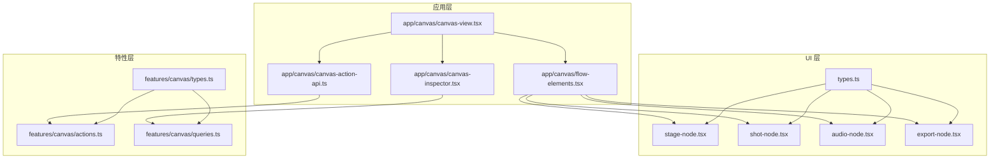

图表来源
- [src/components/ui/node/types.ts](file://src/components/ui/node/types.ts)
- [src/components/ui/node/stage-node.tsx](file://src/components/ui/node/stage-node.tsx)
- [src/components/ui/node/shot-node.tsx](file://src/components/ui/node/shot-node.tsx)
- [src/components/ui/node/audio-node.tsx](file://src/components/ui/node/audio-node.tsx)
- [src/components/ui/node/export-node.tsx](file://src/components/ui/node/export-node.tsx)
- [src/features/canvas/types.ts](file://src/features/canvas/types.ts)
- [src/features/canvas/actions.ts](file://src/features/canvas/actions.ts)
- [src/features/canvas/queries.ts](file://src/features/canvas/queries.ts)
- [src/app/canvas/canvas-view.tsx](file://src/app/canvas/canvas-view.tsx)
- [src/app/canvas/flow-elements.tsx](file://src/app/canvas/flow-elements.tsx)
- [src/app/canvas/canvas-action-api.ts](file://src/app/canvas/canvas-action-api.ts)
- [src/app/canvas/canvas-inspector.tsx](file://src/app/canvas/canvas-inspector.tsx)

章节来源
- [src/components/ui/node/types.ts](file://src/components/ui/node/types.ts)
- [src/features/canvas/types.ts](file://src/features/canvas/types.ts)
- [src/app/canvas/canvas-view.tsx](file://src/app/canvas/canvas-view.tsx)
- [src/app/canvas/flow-elements.tsx](file://src/app/canvas/flow-elements.tsx)

## 核心组件
- 节点类型定义：集中描述节点 ID、类型枚举、端口与连接模型，供 UI 与特性层共享
- 内置节点：StageNode、ShotNode、AudioNode、ExportNode，分别承担场景、镜头、音频与导出职责
- 画布动作与查询：负责节点增删改查、连接建立与断开、布局与状态更新
- 画布视图与流元素：承载节点渲染、连线绘制、交互事件分发
- 检查器：基于选中节点展示可编辑属性，驱动属性变更回写

章节来源
- [src/components/ui/node/types.ts](file://src/components/ui/node/types.ts)
- [src/components/ui/node/stage-node.tsx](file://src/components/ui/node/stage-node.tsx)
- [src/components/ui/node/shot-node.tsx](file://src/components/ui/node/shot-node.tsx)
- [src/components/ui/node/audio-node.tsx](file://src/components/ui/node/audio-node.tsx)
- [src/components/ui/node/export-node.tsx](file://src/components/ui/node/export-node.tsx)
- [src/features/canvas/actions.ts](file://src/features/canvas/actions.ts)
- [src/features/canvas/queries.ts](file://src/features/canvas/queries.ts)
- [src/app/canvas/canvas-view.tsx](file://src/app/canvas/canvas-view.tsx)
- [src/app/canvas/flow-elements.tsx](file://src/app/canvas/flow-elements.tsx)
- [src/app/canvas/canvas-inspector.tsx](file://src/app/canvas/canvas-inspector.tsx)

## 架构总览
节点系统采用“UI 组件 + 特性服务 + 应用编排”的分层架构：
- UI 层只关注节点呈现与用户交互（拖拽、点击、输入），通过回调上报动作
- 特性层封装画布领域逻辑（节点与连接的 CRUD、拓扑校验、状态机）
- 应用层协调视图、动作 API 与检查器，完成端到端流程

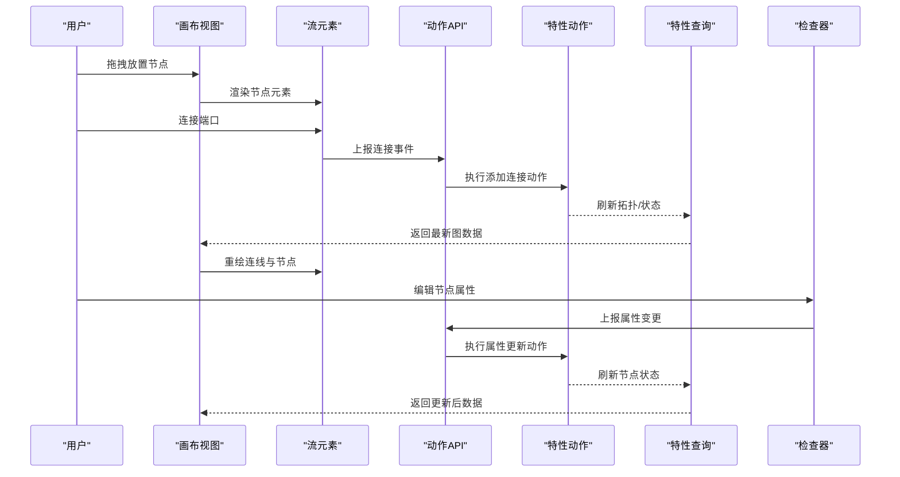

图表来源
- [src/app/canvas/canvas-view.tsx](file://src/app/canvas/canvas-view.tsx)
- [src/app/canvas/flow-elements.tsx](file://src/app/canvas/flow-elements.tsx)
- [src/app/canvas/canvas-action-api.ts](file://src/app/canvas/canvas-action-api.ts)
- [src/features/canvas/actions.ts](file://src/features/canvas/actions.ts)
- [src/features/canvas/queries.ts](file://src/features/canvas/queries.ts)
- [src/app/canvas/canvas-inspector.tsx](file://src/app/canvas/canvas-inspector.tsx)

## 详细组件分析

### 节点类型与数据模型
- 节点类型：统一枚举与工厂映射，确保新增节点类型时 UI 与特性层一致
- 端口与连接：定义输入/输出端口类型、连接方向与约束
- 节点属性：每个节点类型定义其属性 schema，用于校验与序列化

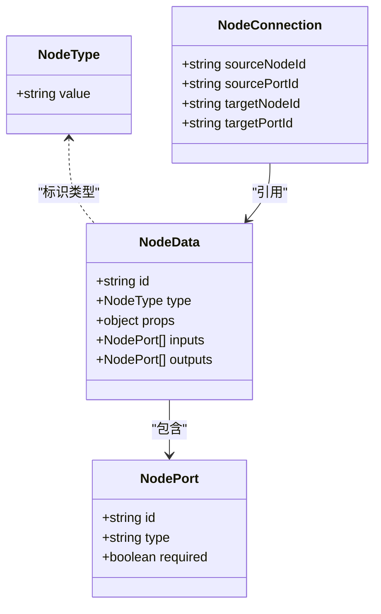

图表来源
- [src/components/ui/node/types.ts](file://src/components/ui/node/types.ts)
- [src/features/canvas/types.ts](file://src/features/canvas/types.ts)

章节来源
- [src/components/ui/node/types.ts](file://src/components/ui/node/types.ts)
- [src/features/canvas/types.ts](file://src/features/canvas/types.ts)

### 内置节点：StageNode（场景节点）
- 职责：表示一个场景，管理场景级属性（如名称、尺寸、背景等）
- 端口：通常提供输出端口，作为后续镜头节点的源
- 交互：支持拖拽放置、属性编辑、连接创建

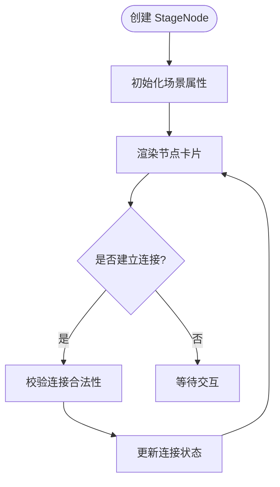

图表来源
- [src/components/ui/node/stage-node.tsx](file://src/components/ui/node/stage-node.tsx)
- [src/app/canvas/flow-elements.tsx](file://src/app/canvas/flow-elements.tsx)

章节来源
- [src/components/ui/node/stage-node.tsx](file://src/components/ui/node/stage-node.tsx)
- [src/app/canvas/flow-elements.tsx](file://src/app/canvas/flow-elements.tsx)

### 内置节点：ShotNode（镜头节点）
- 职责：表示一个镜头，聚合画面、音频、字幕等轨道信息
- 端口：从上游（如 StageNode）接收输入，向下游（如 ExportNode）输出
- 交互：支持属性编辑、连接验证、状态同步

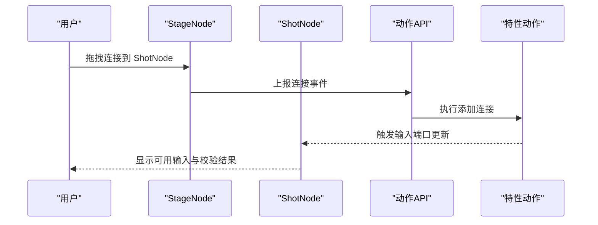

图表来源
- [src/components/ui/node/shot-node.tsx](file://src/components/ui/node/shot-node.tsx)
- [src/app/canvas/canvas-action-api.ts](file://src/app/canvas/canvas-action-api.ts)
- [src/features/canvas/actions.ts](file://src/features/canvas/actions.ts)

章节来源
- [src/components/ui/node/shot-node.tsx](file://src/components/ui/node/shot-node.tsx)
- [src/app/canvas/canvas-action-api.ts](file://src/app/canvas/canvas-action-api.ts)
- [src/features/canvas/actions.ts](file://src/features/canvas/actions.ts)

### 内置节点：AudioNode（音频节点）
- 职责：管理音轨、音效、旁白等音频资源与参数
- 端口：输入来自上游节点，输出到混音或导出链路
- 交互：支持音频预览、参数调节、连接校验

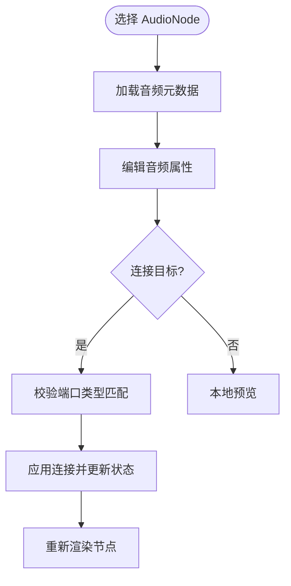

图表来源
- [src/components/ui/node/audio-node.tsx](file://src/components/ui/node/audio-node.tsx)
- [src/app/canvas/flow-elements.tsx](file://src/app/canvas/flow-elements.tsx)

章节来源
- [src/components/ui/node/audio-node.tsx](file://src/components/ui/node/audio-node.tsx)
- [src/app/canvas/flow-elements.tsx](file://src/app/canvas/flow-elements.tsx)

### 内置节点：ExportNode（导出节点）
- 职责：配置导出参数（分辨率、编码、帧率等），触发导出任务
- 端口：汇聚上游镜头/音频等数据，输出导出结果
- 交互：参数编辑、连接校验、导出状态反馈

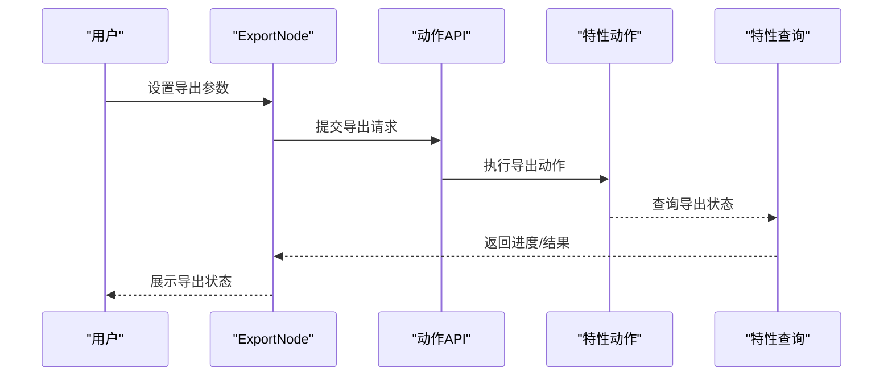

图表来源
- [src/components/ui/node/export-node.tsx](file://src/components/ui/node/export-node.tsx)
- [src/app/canvas/canvas-action-api.ts](file://src/app/canvas/canvas-action-api.ts)
- [src/features/canvas/actions.ts](file://src/features/canvas/actions.ts)
- [src/features/canvas/queries.ts](file://src/features/canvas/queries.ts)

章节来源
- [src/components/ui/node/export-node.tsx](file://src/components/ui/node/export-node.tsx)
- [src/app/canvas/canvas-action-api.ts](file://src/app/canvas/canvas-action-api.ts)
- [src/features/canvas/actions.ts](file://src/features/canvas/actions.ts)
- [src/features/canvas/queries.ts](file://src/features/canvas/queries.ts)

### 节点生命周期管理
- 创建：从面板拖拽生成，分配唯一 ID，初始化默认属性
- 挂载：渲染节点卡片，注册端口与事件监听
- 更新：属性变化、连接变化触发局部重渲染
- 销毁：断开连接、清理副作用、释放资源

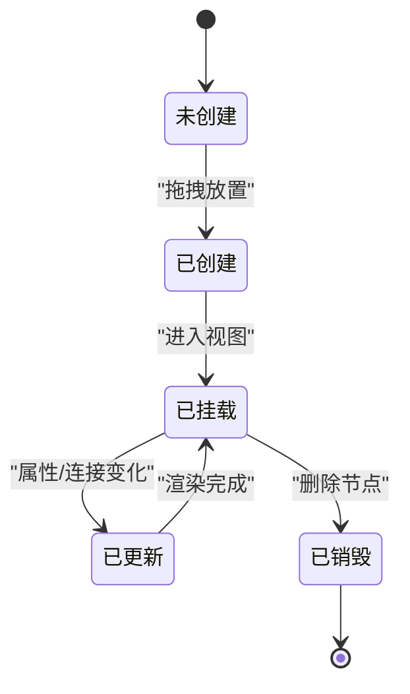

图表来源
- [src/app/canvas/flow-elements.tsx](file://src/app/canvas/flow-elements.tsx)
- [src/features/canvas/actions.ts](file://src/features/canvas/actions.ts)

章节来源
- [src/app/canvas/flow-elements.tsx](file://src/app/canvas/flow-elements.tsx)
- [src/features/canvas/actions.ts](file://src/features/canvas/actions.ts)

### 节点属性系统
- Schema 定义：每个节点类型声明属性字段、类型与校验规则
- 编辑器：检查器根据 schema 动态生成表单控件
- 双向绑定：编辑即更新，实时同步至画布状态

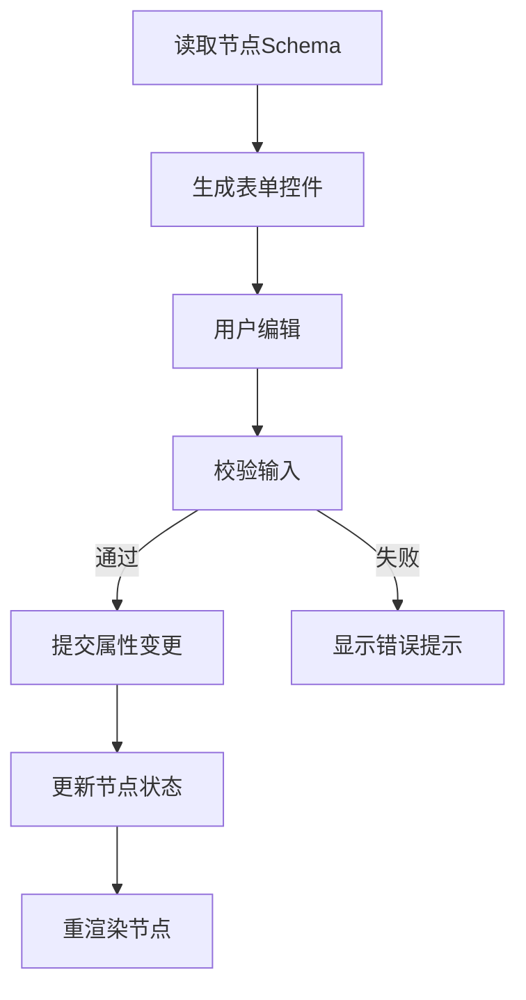

图表来源
- [src/app/canvas/canvas-inspector.tsx](file://src/app/canvas/canvas-inspector.tsx)
- [src/components/ui/node/types.ts](file://src/components/ui/node/types.ts)

章节来源
- [src/app/canvas/canvas-inspector.tsx](file://src/app/canvas/canvas-inspector.tsx)
- [src/components/ui/node/types.ts](file://src/components/ui/node/types.ts)

### 节点间通信机制
- 连接模型：以有向边表示数据流向，端口类型需匹配
- 事件驱动：连接建立/断开触发拓扑重算与状态更新
- 数据流：上游节点输出经连接注入下游节点输入

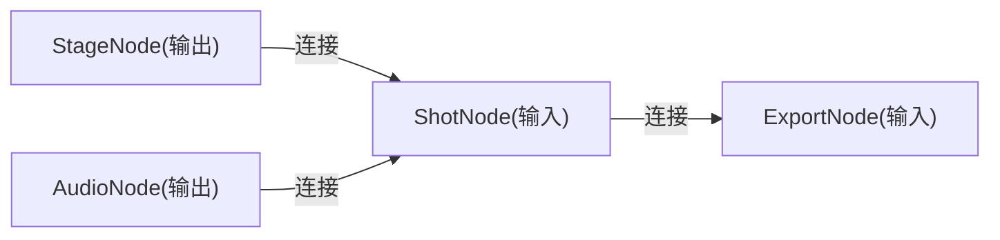

图表来源
- [src/app/canvas/flow-elements.tsx](file://src/app/canvas/flow-elements.tsx)
- [src/features/canvas/types.ts](file://src/features/canvas/types.ts)

章节来源
- [src/app/canvas/flow-elements.tsx](file://src/app/canvas/flow-elements.tsx)
- [src/features/canvas/types.ts](file://src/features/canvas/types.ts)

### 自定义节点开发指南
- 步骤一：在类型定义中扩展节点类型与端口
- 步骤二：实现节点组件，处理渲染与交互
- 步骤三：在动作层注册节点创建与属性更新逻辑
- 步骤四：在检查器中为该节点类型生成属性表单
- 步骤五：在流元素中注册节点渲染映射

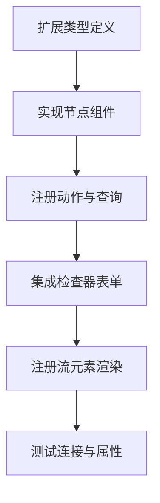

图表来源
- [src/components/ui/node/types.ts](file://src/components/ui/node/types.ts)
- [src/features/canvas/actions.ts](file://src/features/canvas/actions.ts)
- [src/app/canvas/canvas-inspector.tsx](file://src/app/canvas/canvas-inspector.tsx)
- [src/app/canvas/flow-elements.tsx](file://src/app/canvas/flow-elements.tsx)

章节来源
- [src/components/ui/node/types.ts](file://src/components/ui/node/types.ts)
- [src/features/canvas/actions.ts](file://src/features/canvas/actions.ts)
- [src/app/canvas/canvas-inspector.tsx](file://src/app/canvas/canvas-inspector.tsx)
- [src/app/canvas/flow-elements.tsx](file://src/app/canvas/flow-elements.tsx)

### 拖拽与连接事件处理
- 拖拽放置：从侧边栏拖入画布，生成节点实例并定位
- 连接建立：从输出端口拖拽至输入端口，校验类型与环
- 连接断开：右键或工具触发断开，清理下游依赖

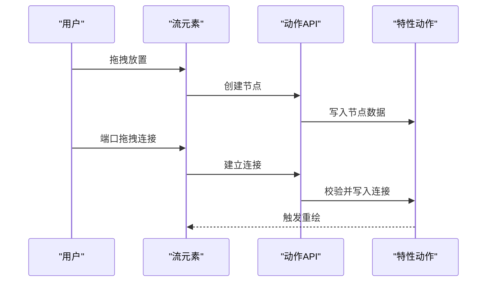

图表来源
- [src/app/canvas/flow-elements.tsx](file://src/app/canvas/flow-elements.tsx)
- [src/app/canvas/canvas-action-api.ts](file://src/app/canvas/canvas-action-api.ts)
- [src/features/canvas/actions.ts](file://src/features/canvas/actions.ts)

章节来源
- [src/app/canvas/flow-elements.tsx](file://src/app/canvas/flow-elements.tsx)
- [src/app/canvas/canvas-action-api.ts](file://src/app/canvas/canvas-action-api.ts)
- [src/features/canvas/actions.ts](file://src/features/canvas/actions.ts)

### 渲染优化与状态管理
- 局部更新：仅重绘受影响的节点与连线
- 虚拟列表：对大量节点进行可视区域裁剪
- 防抖节流：对频繁属性编辑进行合并更新
- 状态隔离：节点状态与全局状态解耦，避免不必要重渲染

章节来源
- [src/app/canvas/canvas-view.tsx](file://src/app/canvas/canvas-view.tsx)
- [src/app/canvas/flow-elements.tsx](file://src/app/canvas/flow-elements.tsx)

### 序列化与持久化
- 序列化：将节点与连接转换为可存储的 JSON 结构
- 反序列化：从 JSON 恢复节点图，重建连接关系
- 版本兼容：schema 演进时需做迁移与兼容性处理

章节来源
- [src/features/canvas/types.ts](file://src/features/canvas/types.ts)
- [src/features/canvas/actions.ts](file://src/features/canvas/actions.ts)

## 依赖关系分析
- UI 组件依赖类型定义与动作 API
- 动作层依赖特性类型与查询
- 视图层依赖流元素与检查器

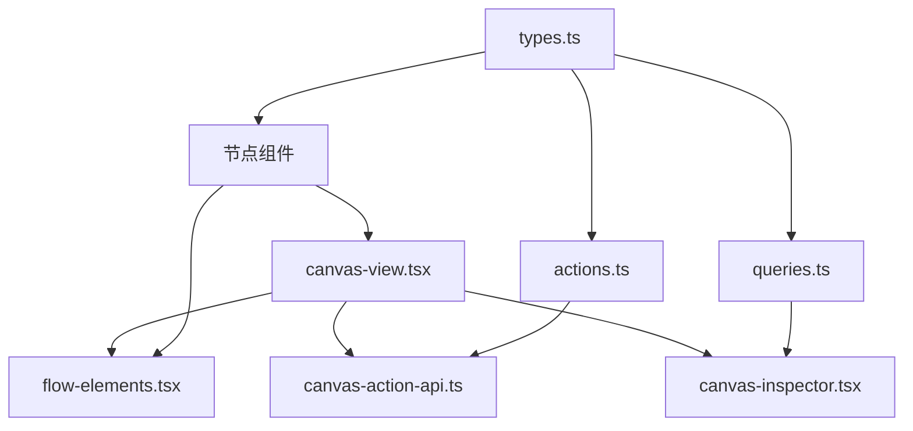

图表来源
- [src/components/ui/node/types.ts](file://src/components/ui/node/types.ts)
- [src/features/canvas/types.ts](file://src/features/canvas/types.ts)
- [src/features/canvas/actions.ts](file://src/features/canvas/actions.ts)
- [src/features/canvas/queries.ts](file://src/features/canvas/queries.ts)
- [src/app/canvas/canvas-view.tsx](file://src/app/canvas/canvas-view.tsx)
- [src/app/canvas/flow-elements.tsx](file://src/app/canvas/flow-elements.tsx)
- [src/app/canvas/canvas-action-api.ts](file://src/app/canvas/canvas-action-api.ts)
- [src/app/canvas/canvas-inspector.tsx](file://src/app/canvas/canvas-inspector.tsx)

章节来源
- [src/features/canvas/types.ts](file://src/features/canvas/types.ts)
- [src/features/canvas/actions.ts](file://src/features/canvas/actions.ts)
- [src/features/canvas/queries.ts](file://src/features/canvas/queries.ts)
- [src/app/canvas/canvas-view.tsx](file://src/app/canvas/canvas-view.tsx)
- [src/app/canvas/flow-elements.tsx](file://src/app/canvas/flow-elements.tsx)
- [src/app/canvas/canvas-action-api.ts](file://src/app/canvas/canvas-action-api.ts)
- [src/app/canvas/canvas-inspector.tsx](file://src/app/canvas/canvas-inspector.tsx)

## 性能考虑
- 渲染层面：使用不可变数据与选择性订阅，减少重渲染范围；对大图节点懒加载
- 计算层面：连接校验与拓扑分析增量更新，避免全量重算
- 交互层面：对拖拽与输入事件做节流与批处理
- 内存层面：及时释放节点与连线的临时对象，避免泄漏

[本节为通用指导，不直接分析具体文件]

## 故障排查指南
- 连接无效：检查端口类型匹配与连接约束；查看动作日志与校验结果
- 属性不生效：确认检查器表单与节点 schema 一致；检查动作是否正确提交
- 渲染卡顿：定位高频更新节点，启用局部更新与虚拟化；检查是否存在循环依赖
- 序列化异常：核对 schema 版本与迁移脚本；确保所有必填字段存在

章节来源
- [src/app/canvas/canvas-action-api.ts](file://src/app/canvas/canvas-action-api.ts)
- [src/features/canvas/actions.ts](file://src/features/canvas/actions.ts)
- [src/app/canvas/canvas-inspector.tsx](file://src/app/canvas/canvas-inspector.tsx)

## 结论
节点系统通过清晰的类型定义、分层架构与事件驱动的数据流，实现了可扩展、高性能的画布编辑体验。内置节点覆盖了场景、镜头、音频与导出的核心能力，开发者可按规范快速扩展自定义节点。遵循本文的最佳实践与优化建议，可在保证用户体验的同时提升系统的稳定性与可维护性。

## 附录
- 术语表
  - 节点：画布中的可组合单元，具有输入/输出端口与属性
  - 端口：节点的数据接口，分为输入与输出
  - 连接：节点间的有向数据流边
  - 动作：对画布状态的变更操作
  - 查询：对画布状态的读取操作
- 参考路径
  - 节点类型与端口定义：[src/components/ui/node/types.ts](file://src/components/ui/node/types.ts)
  - 画布数据模型与动作：[src/features/canvas/types.ts](file://src/features/canvas/types.ts)、[src/features/canvas/actions.ts](file://src/features/canvas/actions.ts)
  - 画布视图与流元素：[src/app/canvas/canvas-view.tsx](file://src/app/canvas/canvas-view.tsx)、[src/app/canvas/flow-elements.tsx](file://src/app/canvas/flow-elements.tsx)
  - 动作 API 与检查器：[src/app/canvas/canvas-action-api.ts](file://src/app/canvas/canvas-action-api.ts)、[src/app/canvas/canvas-inspector.tsx](file://src/app/canvas/canvas-inspector.tsx)