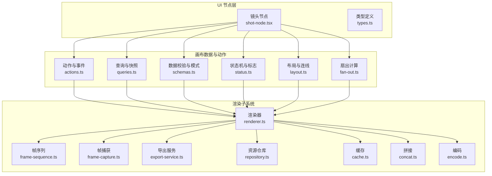
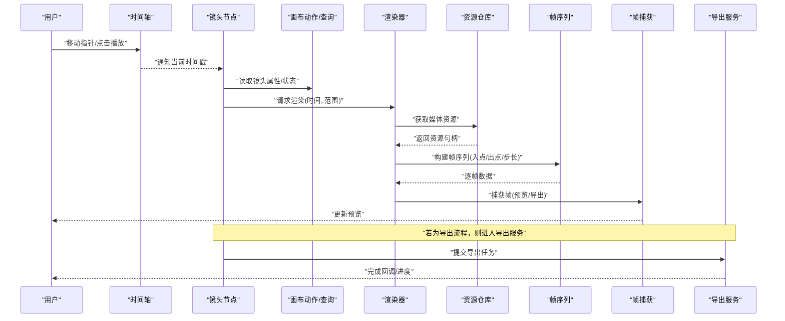
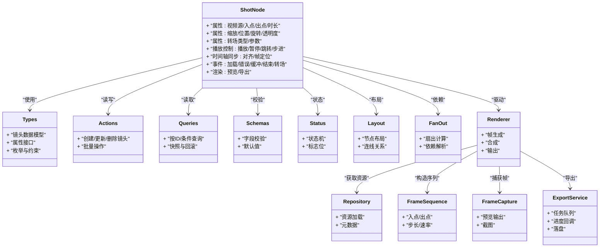
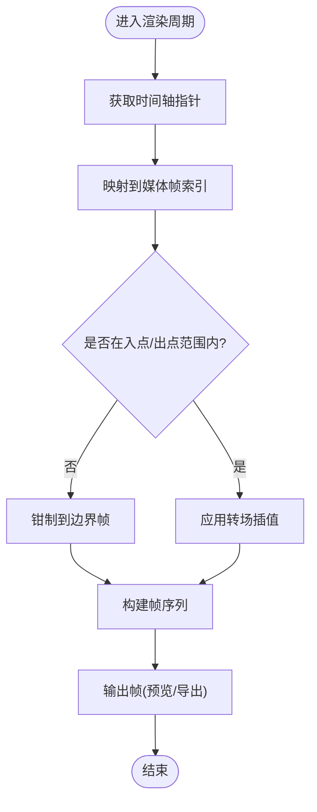
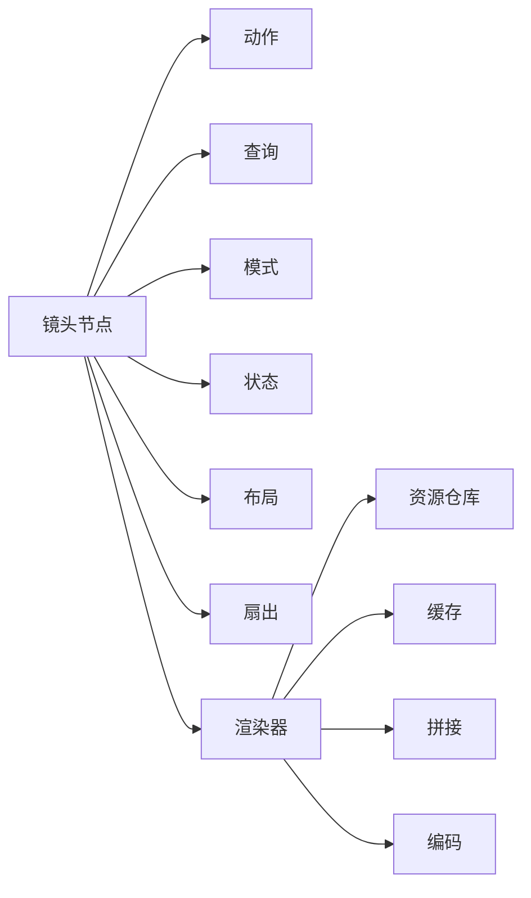

# 镜头节点

<cite>
**本文引用的文件**   
- [src/components/ui/node/shot-node.tsx](file://src/components/ui/node/shot-node.tsx)
- [src/components/ui/node/shot-node.demo.tsx](file://src/components/ui/node/shot-node.demo.tsx)
- [src/components/ui/node/types.ts](file://src/components/ui/node/types.ts)
- [src/app/canvas/shot/[id]/shot-detail.tsx](file://src/app/canvas/shot/[id]/shot-detail.tsx)
- [src/app/canvas/shot/[id]/shot-api.ts](file://src/app/canvas/shot/[id]/shot-api.ts)
- [src/features/render/renderer.ts](file://src/features/render/renderer.ts)
- [src/features/render/frame-sequence.ts](file://src/features/render/frame-sequence.ts)
- [src/features/render/frame-capture.ts](file://src/features/render/frame-capture.ts)
- [src/features/render/export-service.ts](file://src/features/render/export-service.ts)
- [src/features/render/repository.ts](file://src/features/render/repository.ts)
- [src/features/render/cache.ts](file://src/features/render/cache.ts)
- [src/features/render/concat.ts](file://src/features/render/concat.ts)
- [src/features/render/encode.ts](file://src/features/render/encode.ts)
- [src/features/canvas/actions.ts](file://src/features/canvas/actions.ts)
- [src/features/canvas/queries.ts](file://src/features/canvas/queries.ts)
- [src/features/canvas/schemas.ts](file://src/features/canvas/schemas.ts)
- [src/features/canvas/status.ts](file://src/features/canvas/status.ts)
- [src/features/canvas/layout.ts](file://src/features/canvas/layout.ts)
- [src/features/canvas/fan-out.ts](file://src/features/canvas/fan-out.ts)
</cite>

## 目录
1. [简介](#简介)
2. [项目结构](#项目结构)
3. [核心组件](#核心组件)
4. [架构总览](#架构总览)
5. [详细组件分析](#详细组件分析)
6. [依赖分析](#依赖分析)
7. [性能考虑](#性能考虑)
8. [故障排查指南](#故障排查指南)
9. [结论](#结论)
10. [附录](#附录)

## 简介
本文件面向视频编辑工作流中的“镜头节点”（ShotNode）进行系统化文档说明。内容覆盖其核心功能、时间轴管理、媒体播放控制、属性配置（视频源、播放参数、转场效果）、与时间轴的同步机制、帧精确定位、状态管理与性能优化，并提供在视频编辑工作流中的使用模式与集成方法。文档以仓库现有实现为依据，通过代码级图示和路径引用帮助读者快速定位关键逻辑。

## 项目结构
镜头节点位于 UI 节点层，负责将“镜头”这一业务概念可视化并驱动渲染管线。与之协作的模块包括：
- 渲染子系统：负责帧序列生成、捕获、编码与导出
- 画布数据与动作：提供镜头数据的增删改查与状态流转
- 资源与缓存：提供素材访问与中间结果缓存

图表来源
- [src/components/ui/node/shot-node.tsx](file://src/components/ui/node/shot-node.tsx)
- [src/components/ui/node/types.ts](file://src/components/ui/node/types.ts)
- [src/features/canvas/actions.ts](file://src/features/canvas/actions.ts)
- [src/features/canvas/queries.ts](file://src/features/canvas/queries.ts)
- [src/features/canvas/schemas.ts](file://src/features/canvas/schemas.ts)
- [src/features/canvas/status.ts](file://src/features/canvas/status.ts)
- [src/features/canvas/layout.ts](file://src/features/canvas/layout.ts)
- [src/features/canvas/fan-out.ts](file://src/features/canvas/fan-out.ts)
- [src/features/render/renderer.ts](file://src/features/render/renderer.ts)
- [src/features/render/frame-sequence.ts](file://src/features/render/frame-sequence.ts)
- [src/features/render/frame-capture.ts](file://src/features/render/frame-capture.ts)
- [src/features/render/export-service.ts](file://src/features/render/export-service.ts)
- [src/features/render/repository.ts](file://src/features/render/repository.ts)
- [src/features/render/cache.ts](file://src/features/render/cache.ts)
- [src/features/render/concat.ts](file://src/features/render/concat.ts)
- [src/features/render/encode.ts](file://src/features/render/encode.ts)

章节来源
- [src/components/ui/node/shot-node.tsx](file://src/components/ui/node/shot-node.tsx)
- [src/components/ui/node/types.ts](file://src/components/ui/node/types.ts)
- [src/features/canvas/actions.ts](file://src/features/canvas/actions.ts)
- [src/features/canvas/queries.ts](file://src/features/canvas/queries.ts)
- [src/features/canvas/schemas.ts](file://src/features/canvas/schemas.ts)
- [src/features/canvas/status.ts](file://src/features/canvas/status.ts)
- [src/features/canvas/layout.ts](file://src/features/canvas/layout.ts)
- [src/features/canvas/fan-out.ts](file://src/features/canvas/fan-out.ts)
- [src/features/render/renderer.ts](file://src/features/render/renderer.ts)
- [src/features/render/frame-sequence.ts](file://src/features/render/frame-sequence.ts)
- [src/features/render/frame-capture.ts](file://src/features/render/frame-capture.ts)
- [src/features/render/export-service.ts](file://src/features/render/export-service.ts)
- [src/features/render/repository.ts](file://src/features/render/repository.ts)
- [src/features/render/cache.ts](file://src/features/render/cache.ts)
- [src/features/render/concat.ts](file://src/features/render/concat.ts)
- [src/features/render/encode.ts](file://src/features/render/encode.ts)

## 核心组件
- 镜头节点（ShotNode）
  - 职责：承载单个镜头的元数据与播放控制；与时间轴联动，响应播放/暂停/跳转等交互；触发渲染管线进行预览或导出。
  - 关键能力：
    - 属性配置：视频源、入点/出点、时长、缩放/位置/旋转、透明度、转场参数等
    - 播放控制：播放、暂停、步进、跳帧、循环、速度调节
    - 时间轴同步：与全局时间指针对齐，支持精确到帧的定位
    - 事件处理：加载完成、错误、缓冲、结束、转场开始/结束等
- 类型系统（types.ts）
  - 定义镜头节点的数据模型、属性接口、枚举值与约束，确保前后端一致性与可序列化性
- 演示与集成入口（shot-node.demo.tsx）
  - 展示如何实例化、配置与调用镜头节点的常用 API，便于开发者快速上手

章节来源
- [src/components/ui/node/shot-node.tsx](file://src/components/ui/node/shot-node.tsx)
- [src/components/ui/node/types.ts](file://src/components/ui/node/types.ts)
- [src/components/ui/node/shot-node.demo.tsx](file://src/components/ui/node/shot-node.demo.tsx)

## 架构总览
镜头节点作为“视图-控制器”混合体，向上暴露用户交互与配置接口，向下驱动渲染子系统。整体流程如下：
- 用户在时间轴上移动指针或点击播放
- 镜头节点根据当前时间计算可见帧区间与转场阶段
- 渲染器从资源仓库拉取素材，按帧序列生成图像
- 帧捕获将画面输出至预览或导出通道
- 导出服务负责最终封装与落盘

图表来源
- [src/components/ui/node/shot-node.tsx](file://src/components/ui/node/shot-node.tsx)
- [src/features/canvas/actions.ts](file://src/features/canvas/actions.ts)
- [src/features/canvas/queries.ts](file://src/features/canvas/queries.ts)
- [src/features/render/renderer.ts](file://src/features/render/renderer.ts)
- [src/features/render/repository.ts](file://src/features/render/repository.ts)
- [src/features/render/frame-sequence.ts](file://src/features/render/frame-sequence.ts)
- [src/features/render/frame-capture.ts](file://src/features/render/frame-capture.ts)
- [src/features/render/export-service.ts](file://src/features/render/export-service.ts)

## 详细组件分析

### 镜头节点类图

图表来源
- [src/components/ui/node/shot-node.tsx](file://src/components/ui/node/shot-node.tsx)
- [src/components/ui/node/types.ts](file://src/components/ui/node/types.ts)
- [src/features/canvas/actions.ts](file://src/features/canvas/actions.ts)
- [src/features/canvas/queries.ts](file://src/features/canvas/queries.ts)
- [src/features/canvas/schemas.ts](file://src/features/canvas/schemas.ts)
- [src/features/canvas/status.ts](file://src/features/canvas/status.ts)
- [src/features/canvas/layout.ts](file://src/features/canvas/layout.ts)
- [src/features/canvas/fan-out.ts](file://src/features/canvas/fan-out.ts)
- [src/features/render/renderer.ts](file://src/features/render/renderer.ts)
- [src/features/render/repository.ts](file://src/features/render/repository.ts)
- [src/features/render/frame-sequence.ts](file://src/features/render/frame-sequence.ts)
- [src/features/render/frame-capture.ts](file://src/features/render/frame-capture.ts)
- [src/features/render/export-service.ts](file://src/features/render/export-service.ts)

章节来源
- [src/components/ui/node/shot-node.tsx](file://src/components/ui/node/shot-node.tsx)
- [src/components/ui/node/types.ts](file://src/components/ui/node/types.ts)
- [src/features/canvas/actions.ts](file://src/features/canvas/actions.ts)
- [src/features/canvas/queries.ts](file://src/features/canvas/queries.ts)
- [src/features/canvas/schemas.ts](file://src/features/canvas/schemas.ts)
- [src/features/canvas/status.ts](file://src/features/canvas/status.ts)
- [src/features/canvas/layout.ts](file://src/features/canvas/layout.ts)
- [src/features/canvas/fan-out.ts](file://src/features/canvas/fan-out.ts)
- [src/features/render/renderer.ts](file://src/features/render/renderer.ts)
- [src/features/render/repository.ts](file://src/features/render/repository.ts)
- [src/features/render/frame-sequence.ts](file://src/features/render/frame-sequence.ts)
- [src/features/render/frame-capture.ts](file://src/features/render/frame-capture.ts)
- [src/features/render/export-service.ts](file://src/features/render/export-service.ts)

### 属性配置详解
- 视频源设置
  - 支持本地/远程资源标识，包含分辨率、时长、帧率等元数据
  - 入点/出点用于裁剪片段，时长由出点减入点决定
- 播放参数
  - 播放速度、循环开关、静音/音量、字幕轨道选择
- 变换与合成
  - 缩放、位置、旋转、透明度、混合模式
- 转场效果
  - 转场类型（淡入淡出、滑动、擦除等）、持续时间、方向、缓动曲线
- 校验与默认值
  - 通过模式定义对必填字段、取值范围、互斥关系进行校验

章节来源
- [src/components/ui/node/types.ts](file://src/components/ui/node/types.ts)
- [src/features/canvas/schemas.ts](file://src/features/canvas/schemas.ts)

### 时间轴同步与帧精确定位
- 同步机制
  - 时间轴指针变化时，镜头节点计算自身相对时间，映射到媒体帧索引
  - 支持多轨并行时的时间偏移与对齐
- 帧定位
  - 基于入点/出点与帧率换算，实现精确到帧的跳转
  - 转场期间按百分比插值切换源或叠加层
- 边界处理
  - 越界回绕、循环播放、首尾帧锁定

图表来源
- [src/features/render/frame-sequence.ts](file://src/features/render/frame-sequence.ts)
- [src/features/render/renderer.ts](file://src/features/render/renderer.ts)

章节来源
- [src/features/render/frame-sequence.ts](file://src/features/render/frame-sequence.ts)
- [src/features/render/renderer.ts](file://src/features/render/renderer.ts)

### 媒体播放控制
- 基本控制
  - 播放/暂停、停止、步进（上一帧/下一帧）
- 高级控制
  - 变速播放、循环、静音、音轨切换
- 事件回调
  - 加载完成、错误、缓冲、播放结束、转场开始/结束
- 集成方式
  - 通过动作与查询接口更新状态，驱动渲染器刷新

章节来源
- [src/components/ui/node/shot-node.tsx](file://src/components/ui/node/shot-node.tsx)
- [src/features/canvas/actions.ts](file://src/features/canvas/actions.ts)
- [src/features/canvas/queries.ts](file://src/features/canvas/queries.ts)

### 与时间轴的集成
- 页面入口
  - 镜头详情页聚合播放器、时间轴与属性面板
- API 交互
  - 提供镜头资源的增删改查与批量操作接口
- 状态同步
  - 时间轴变更广播，镜头节点订阅并更新显示

章节来源
- [src/app/canvas/shot/[id]/shot-detail.tsx](file://src/app/canvas/shot/[id]/shot-detail.tsx)
- [src/app/canvas/shot/[id]/shot-api.ts](file://src/app/canvas/shot/[id]/shot-api.ts)

### 渲染与导出
- 渲染器
  - 协调资源加载、帧序列构建、合成与输出
- 帧序列
  - 根据入点/出点与帧率生成有序帧索引
- 帧捕获
  - 将合成结果输出到预览或截图通道
- 导出服务
  - 管理导出任务队列、进度回调与落盘
- 资源仓库
  - 统一访问媒体资源与元数据
- 缓存
  - 缓存中间帧或合成结果，提升回放与导出性能
- 拼接与编码
  - 多段拼接与最终编码封装

章节来源
- [src/features/render/renderer.ts](file://src/features/render/renderer.ts)
- [src/features/render/frame-sequence.ts](file://src/features/render/frame-sequence.ts)
- [src/features/render/frame-capture.ts](file://src/features/render/frame-capture.ts)
- [src/features/render/export-service.ts](file://src/features/render/export-service.ts)
- [src/features/render/repository.ts](file://src/features/render/repository.ts)
- [src/features/render/cache.ts](file://src/features/render/cache.ts)
- [src/features/render/concat.ts](file://src/features/render/concat.ts)
- [src/features/render/encode.ts](file://src/features/render/encode.ts)

## 依赖分析
- 内聚与耦合
  - 镜头节点高内聚于“播放控制+时间轴同步”，对外通过动作/查询/模式/状态/布局/扇出等模块解耦
  - 渲染子系统独立封装，降低 UI 与底层渲染的耦合度
- 外部依赖
  - 资源仓库抽象了存储后端，便于替换本地/云端存储
  - 导出服务与编码模块对接不同编解码器

图表来源
- [src/components/ui/node/shot-node.tsx](file://src/components/ui/node/shot-node.tsx)
- [src/features/canvas/actions.ts](file://src/features/canvas/actions.ts)
- [src/features/canvas/queries.ts](file://src/features/canvas/queries.ts)
- [src/features/canvas/schemas.ts](file://src/features/canvas/schemas.ts)
- [src/features/canvas/status.ts](file://src/features/canvas/status.ts)
- [src/features/canvas/layout.ts](file://src/features/canvas/layout.ts)
- [src/features/canvas/fan-out.ts](file://src/features/canvas/fan-out.ts)
- [src/features/render/renderer.ts](file://src/features/render/renderer.ts)
- [src/features/render/repository.ts](file://src/features/render/repository.ts)
- [src/features/render/cache.ts](file://src/features/render/cache.ts)
- [src/features/render/concat.ts](file://src/features/render/concat.ts)
- [src/features/render/encode.ts](file://src/features/render/encode.ts)

章节来源
- [src/components/ui/node/shot-node.tsx](file://src/components/ui/node/shot-node.tsx)
- [src/features/canvas/actions.ts](file://src/features/canvas/actions.ts)
- [src/features/canvas/queries.ts](file://src/features/canvas/queries.ts)
- [src/features/canvas/schemas.ts](file://src/features/canvas/schemas.ts)
- [src/features/canvas/status.ts](file://src/features/canvas/status.ts)
- [src/features/canvas/layout.ts](file://src/features/canvas/layout.ts)
- [src/features/canvas/fan-out.ts](file://src/features/canvas/fan-out.ts)
- [src/features/render/renderer.ts](file://src/features/render/renderer.ts)
- [src/features/render/repository.ts](file://src/features/render/repository.ts)
- [src/features/render/cache.ts](file://src/features/render/cache.ts)
- [src/features/render/concat.ts](file://src/features/render/concat.ts)
- [src/features/render/encode.ts](file://src/features/render/encode.ts)

## 性能考虑
- 预加载与缓存
  - 利用缓存模块缓存已生成的帧或合成结果，减少重复计算
- 按需渲染
  - 仅在时间轴变化或属性更新时触发渲染，避免无谓重绘
- 分块与批处理
  - 导出任务分批处理，结合队列处理器控制并发
- 资源复用
  - 资源仓库复用连接与句柄，避免频繁打开/关闭
- 转场优化
  - 对常见转场采用近似算法或预计算，降低实时压力

[本节为通用指导，不直接分析具体文件]

## 故障排查指南
- 常见问题
  - 资源加载失败：检查资源仓库返回码与网络状态
  - 帧错位：核对入点/出点与帧率换算逻辑
  - 转场闪烁：确认转场插值与合成顺序
  - 导出卡顿：查看导出队列与编码参数
- 定位建议
  - 启用调试日志，关注渲染器与帧序列的关键步骤
  - 使用演示页面复现问题，逐步缩小范围
  - 检查状态机是否处于预期状态

章节来源
- [src/features/render/renderer.ts](file://src/features/render/renderer.ts)
- [src/features/render/frame-sequence.ts](file://src/features/render/frame-sequence.ts)
- [src/features/render/export-service.ts](file://src/features/render/export-service.ts)
- [src/features/render/repository.ts](file://src/features/render/repository.ts)
- [src/components/ui/node/shot-node.demo.tsx](file://src/components/ui/node/shot-node.demo.tsx)

## 结论
镜头节点在视频编辑工作流中承担“播放控制+时间轴同步+渲染驱动”的核心角色。通过与画布数据、渲染子系统的清晰分层与解耦，实现了灵活的属性配置、稳定的播放体验与高效的导出能力。遵循本文的配置与集成建议，可在保证性能的同时获得良好的用户体验。

[本节为总结性内容，不直接分析具体文件]

## 附录
- 使用模式
  - 单镜头预览：配置视频源与入点/出点，绑定时间轴指针，启用预览输出
  - 多轨编排：组合多个镜头节点，设置转场与层级，驱动渲染器合成
  - 批量导出：提交导出任务，监听进度回调，完成后落盘
- 集成要点
  - 通过动作/查询接口维护镜头数据
  - 使用模式定义进行属性校验与默认值填充
  - 借助状态机管理生命周期与错误恢复

章节来源
- [src/components/ui/node/shot-node.tsx](file://src/components/ui/node/shot-node.tsx)
- [src/components/ui/node/shot-node.demo.tsx](file://src/components/ui/node/shot-node.demo.tsx)
- [src/features/canvas/actions.ts](file://src/features/canvas/actions.ts)
- [src/features/canvas/queries.ts](file://src/features/canvas/queries.ts)
- [src/features/canvas/schemas.ts](file://src/features/canvas/schemas.ts)
- [src/features/canvas/status.ts](file://src/features/canvas/status.ts)
- [src/features/render/export-service.ts](file://src/features/render/export-service.ts)