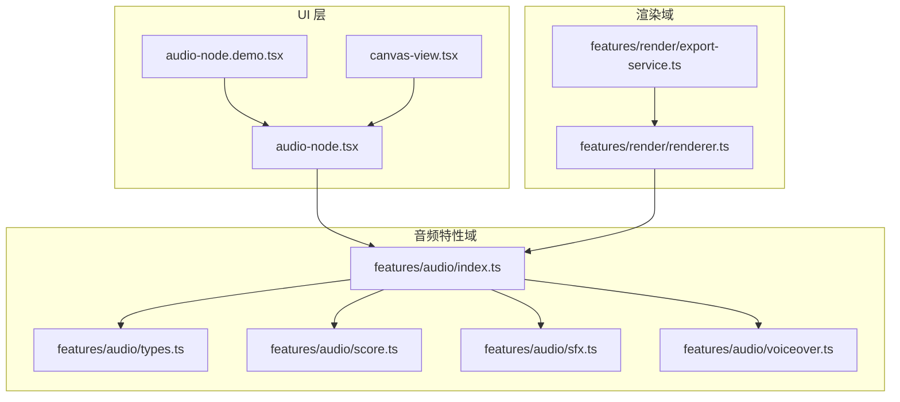
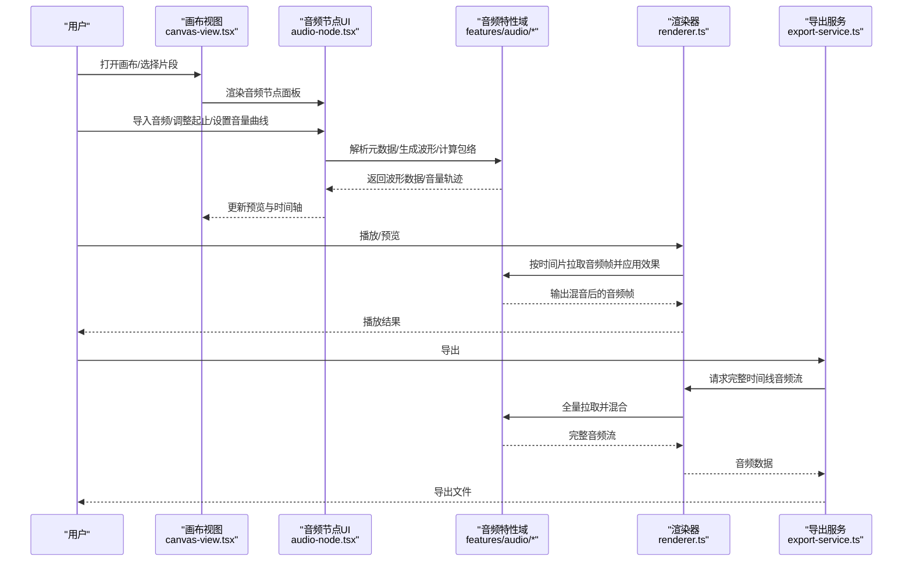
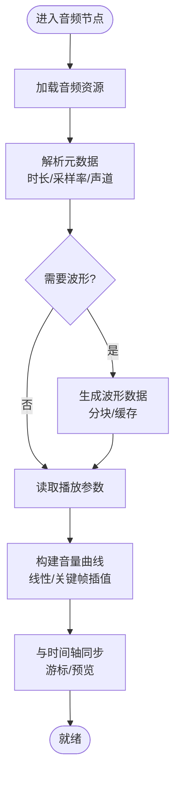
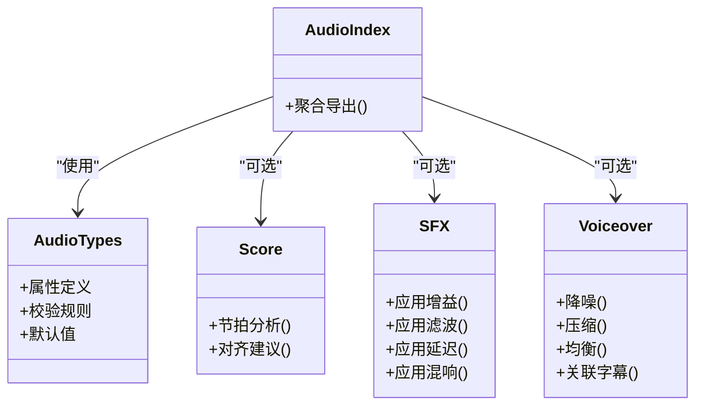
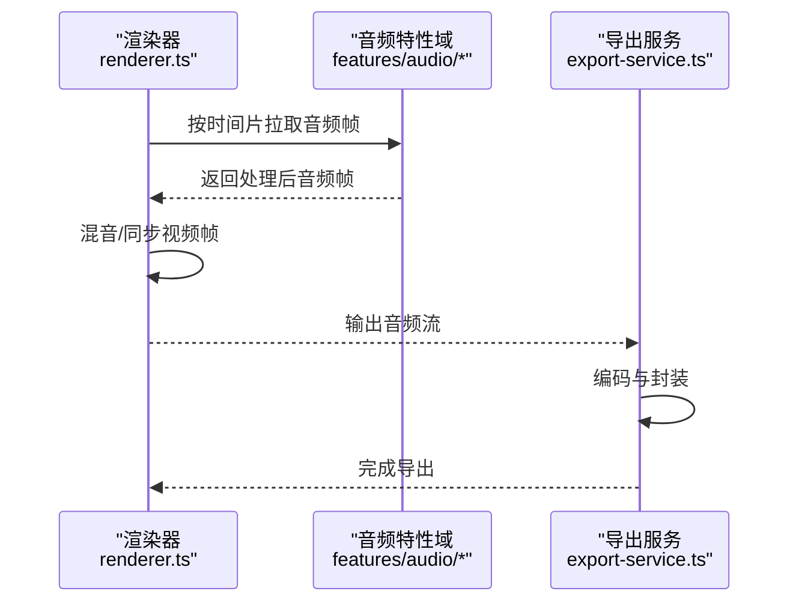
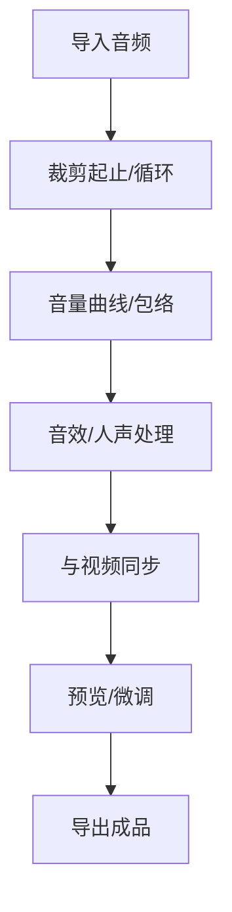
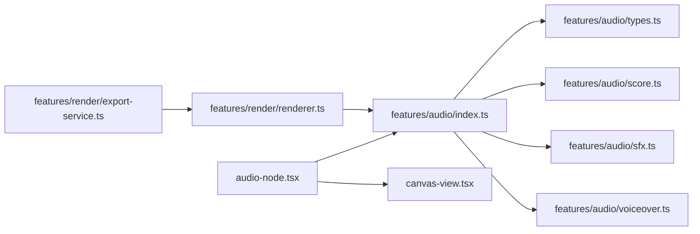

# 音频节点

<cite>
**本文引用的文件**   
- [src/components/ui/node/audio-node.tsx](file://src/components/ui/node/audio-node.tsx)
- [src/components/ui/node/audio-node.demo.tsx](file://src/components/ui/node/audio-node.demo.tsx)
- [src/features/audio/index.ts](file://src/features/audio/index.ts)
- [src/features/audio/types.ts](file://src/features/audio/types.ts)
- [src/features/audio/score.ts](file://src/features/audio/score.ts)
- [src/features/audio/sfx.ts](file://src/features/audio/sfx.ts)
- [src/features/audio/voiceover.ts](file://src/features/audio/voiceover.ts)
- [src/features/render/renderer.ts](file://src/features/render/renderer.ts)
- [src/features/render/export-service.ts](file://src/features/render/export-service.ts)
- [src/app/canvas/canvas-view.tsx](file://src/app/canvas/canvas-view.tsx)
</cite>

## 目录
1. [简介](#简介)
2. [项目结构](#项目结构)
3. [核心组件](#核心组件)
4. [架构总览](#架构总览)
5. [详细组件分析](#详细组件分析)
6. [依赖关系分析](#依赖关系分析)
7. [性能考虑](#性能考虑)
8. [故障排查指南](#故障排查指南)
9. [结论](#结论)
10. [附录](#附录)

## 简介
本文件面向多媒体制作场景中的“音频节点”能力，围绕以下目标展开：
- 音频处理能力：导入音频素材、播放参数控制、音效处理与混音。
- 波形显示：在时间轴或预览中可视化音频波形，辅助剪辑与定位。
- 音量控制：支持线性与曲线化的音量包络（音量轨迹），实现动态响度控制。
- 同步机制：音频节点与视频轨道的时间对齐与同步策略。
- 内存管理与流式处理：降低峰值内存占用，提升长音频与多轨渲染性能。
- 应用场景与技术要点：配音、背景音乐、音效叠加、导出合成等。

## 项目结构
本项目采用“功能域 + UI 组件”的层次化组织方式。音频相关代码主要分布在 features/audio 与 components/ui/node 两个区域：
- features/audio：定义音频类型、评分/节拍、音效、旁白等能力。
- components/ui/node：提供可复用的节点 UI，包括音频节点及其演示。
- features/render：负责渲染管线，包含帧序列、编码、导出服务与渲染器。
- app/canvas：画布视图集成，承载节点编辑与预览。

图表来源
- [src/components/ui/node/audio-node.tsx](file://src/components/ui/node/audio-node.tsx)
- [src/components/ui/node/audio-node.demo.tsx](file://src/components/ui/node/audio-node.demo.tsx)
- [src/features/audio/index.ts](file://src/features/audio/index.ts)
- [src/features/audio/types.ts](file://src/features/audio/types.ts)
- [src/features/audio/score.ts](file://src/features/audio/score.ts)
- [src/features/audio/sfx.ts](file://src/features/audio/sfx.ts)
- [src/features/audio/voiceover.ts](file://src/features/audio/voiceover.ts)
- [src/features/render/renderer.ts](file://src/features/render/renderer.ts)
- [src/features/render/export-service.ts](file://src/features/render/export-service.ts)
- [src/app/canvas/canvas-view.tsx](file://src/app/canvas/canvas-view.tsx)

章节来源
- [src/components/ui/node/audio-node.tsx](file://src/components/ui/node/audio-node.tsx)
- [src/components/ui/node/audio-node.demo.tsx](file://src/components/ui/node/audio-node.demo.tsx)
- [src/features/audio/index.ts](file://src/features/audio/index.ts)
- [src/features/audio/types.ts](file://src/features/audio/types.ts)
- [src/features/render/renderer.ts](file://src/features/render/renderer.ts)
- [src/features/render/export-service.ts](file://src/features/render/export-service.ts)
- [src/app/canvas/canvas-view.tsx](file://src/app/canvas/canvas-view.tsx)

## 核心组件
- 音频节点 UI（audio-node.tsx）
  - 职责：封装音频节点的可视化与交互，包括素材选择、时长/起止点设置、音量包络编辑、波形预览、与时间轴的联动。
  - 关键能力：
    - 音频素材导入：从本地或资源库加载音频文件，解析元数据（采样率、声道数、时长）。
    - 播放参数：起始时间、结束时间、循环模式、淡入淡出时长。
    - 音量控制：支持线性与曲线化音量轨迹，实时预览效果。
    - 波形显示：基于音频缓冲生成波形数据，用于时间轴缩略图与缩放浏览。
    - 事件回调：与父级画布状态同步，触发重绘与导出准备。
- 音频特性域（features/audio/*）
  - types.ts：定义音频节点的数据模型、属性约束与校验规则。
  - index.ts：聚合导出音频能力，统一入口。
  - score.ts：节拍/节奏分析与对齐工具，辅助音乐与画面节奏匹配。
  - sfx.ts：音效处理（增益、滤波、延迟、混响等）与批量应用。
  - voiceover.ts：旁白/人声处理（降噪、压缩、均衡）与转写/字幕关联。
- 渲染与导出（features/render/*）
  - renderer.ts：将音频节点纳入渲染管线，按时间片拉取音频帧并混合输出。
  - export-service.ts：导出阶段对音频进行最终编码与封装，确保与视频同步。

章节来源
- [src/components/ui/node/audio-node.tsx](file://src/components/ui/node/audio-node.tsx)
- [src/features/audio/types.ts](file://src/features/audio/types.ts)
- [src/features/audio/index.ts](file://src/features/audio/index.ts)
- [src/features/audio/score.ts](file://src/features/audio/score.ts)
- [src/features/audio/sfx.ts](file://src/features/audio/sfx.ts)
- [src/features/audio/voiceover.ts](file://src/features/audio/voiceover.ts)
- [src/features/render/renderer.ts](file://src/features/render/renderer.ts)
- [src/features/render/export-service.ts](file://src/features/render/export-service.ts)

## 架构总览
音频节点在系统中的位置与交互如下：
- UI 层通过 audio-node.tsx 暴露配置项与交互，驱动 features/audio 的能力。
- features/audio 提供数据处理与效果链，供渲染器消费。
- features/render 在播放与导出时，按时间线顺序读取各节点输出，完成音视频同步与混音。

图表来源
- [src/app/canvas/canvas-view.tsx](file://src/app/canvas/canvas-view.tsx)
- [src/components/ui/node/audio-node.tsx](file://src/components/ui/node/audio-node.tsx)
- [src/features/audio/index.ts](file://src/features/audio/index.ts)
- [src/features/render/renderer.ts](file://src/features/render/renderer.ts)
- [src/features/render/export-service.ts](file://src/features/render/export-service.ts)

## 详细组件分析

### 音频节点 UI（audio-node.tsx）
- 功能要点
  - 素材导入：支持常见音频格式，自动解析时长与采样率；失败时给出明确提示。
  - 播放参数：起止时间、循环、淡入淡出、静音段裁剪。
  - 音量控制：支持线性与曲线化音量轨迹；提供关键帧编辑与插值。
  - 波形显示：根据音频缓冲生成波形数组，支持缩放与滚动定位。
  - 同步联动：与时间轴游标联动，实时更新当前播放位置的音量与波形高亮。
- 数据结构与复杂度
  - 波形数组长度与采样率、窗口大小相关，通常为 O(N)。
  - 音量曲线关键帧数量影响插值计算复杂度，建议控制在合理范围。
- 错误处理
  - 解码失败、格式不支持、跨域资源限制等均有兜底提示与降级策略。
- 性能优化
  - 波形数据按需生成与缓存；大文件分块解析；避免主线程阻塞。

图表来源
- [src/components/ui/node/audio-node.tsx](file://src/components/ui/node/audio-node.tsx)

章节来源
- [src/components/ui/node/audio-node.tsx](file://src/components/ui/node/audio-node.tsx)

### 音频特性域（features/audio/*）
- types.ts
  - 定义音频节点属性、约束与默认值；为 UI 与渲染提供一致契约。
- index.ts
  - 聚合导出接口，统一调用路径，便于扩展新的音频能力。
- score.ts
  - 节拍检测与对齐，帮助将音乐段落与画面切点对齐。
- sfx.ts
  - 音效处理链：增益、滤波、延迟、混响等；支持批量应用到多个节点。
- voiceover.ts
  - 人声增强：降噪、压缩、均衡；可与字幕/转写数据关联。

图表来源
- [src/features/audio/types.ts](file://src/features/audio/types.ts)
- [src/features/audio/index.ts](file://src/features/audio/index.ts)
- [src/features/audio/score.ts](file://src/features/audio/score.ts)
- [src/features/audio/sfx.ts](file://src/features/audio/sfx.ts)
- [src/features/audio/voiceover.ts](file://src/features/audio/voiceover.ts)

章节来源
- [src/features/audio/types.ts](file://src/features/audio/types.ts)
- [src/features/audio/index.ts](file://src/features/audio/index.ts)
- [src/features/audio/score.ts](file://src/features/audio/score.ts)
- [src/features/audio/sfx.ts](file://src/features/audio/sfx.ts)
- [src/features/audio/voiceover.ts](file://src/features/audio/voiceover.ts)

### 渲染与导出（features/render/*）
- renderer.ts
  - 将音频节点纳入渲染管线，按时间片拉取音频帧，执行效果链与混音。
  - 与视频帧保持同步，确保音画一致。
- export-service.ts
  - 导出阶段对音频进行最终编码与封装，保证与视频轨道对齐。

图表来源
- [src/features/render/renderer.ts](file://src/features/render/renderer.ts)
- [src/features/render/export-service.ts](file://src/features/render/export-service.ts)

章节来源
- [src/features/render/renderer.ts](file://src/features/render/renderer.ts)
- [src/features/render/export-service.ts](file://src/features/render/export-service.ts)

### 概念性概览
- 音频节点在多媒体制作中的典型流程：
  - 导入素材 → 设定起止与循环 → 调整音量曲线 → 应用音效/人声处理 → 与视频同步 → 预览与导出。

[此图为概念流程图，不直接映射具体源码文件]

## 依赖关系分析
- 组件耦合
  - audio-node.tsx 依赖 features/audio 提供的数据与算法；与 canvas-view.tsx 通过状态同步解耦。
  - renderer.ts 与 export-service.ts 协作完成播放与导出，二者均依赖 features/audio 的输出。
- 外部依赖
  - 浏览器媒体 API（如解码、缓冲）、文件系统访问（本地导入）、网络资源（远程音频）。
- 潜在循环依赖
  - 通过 index.ts 聚合导出，避免直接相互引用导致的循环。

图表来源
- [src/components/ui/node/audio-node.tsx](file://src/components/ui/node/audio-node.tsx)
- [src/features/audio/index.ts](file://src/features/audio/index.ts)
- [src/features/audio/types.ts](file://src/features/audio/types.ts)
- [src/features/audio/score.ts](file://src/features/audio/score.ts)
- [src/features/audio/sfx.ts](file://src/features/audio/sfx.ts)
- [src/features/audio/voiceover.ts](file://src/features/audio/voiceover.ts)
- [src/features/render/renderer.ts](file://src/features/render/renderer.ts)
- [src/features/render/export-service.ts](file://src/features/render/export-service.ts)
- [src/app/canvas/canvas-view.tsx](file://src/app/canvas/canvas-view.tsx)

章节来源
- [src/components/ui/node/audio-node.tsx](file://src/components/ui/node/audio-node.tsx)
- [src/features/audio/index.ts](file://src/features/audio/index.ts)
- [src/features/render/renderer.ts](file://src/features/render/renderer.ts)
- [src/features/render/export-service.ts](file://src/features/render/export-service.ts)
- [src/app/canvas/canvas-view.tsx](file://src/app/canvas/canvas-view.tsx)

## 性能考虑
- 波形生成
  - 分块生成与缓存，避免一次性解析大文件导致卡顿。
  - 根据缩放级别动态调整分辨率，平衡清晰度与性能。
- 音量曲线
  - 关键帧数量控制，插值算法选择线性或平滑曲线，减少不必要的重算。
- 渲染管线
  - 按时间片拉取音频帧，避免整轨加载；混音阶段使用高效缓冲区。
- 内存管理
  - 及时释放不再使用的音频缓冲；导出完成后清理临时数据。
- 流式处理
  - 对超长音频采用流式解码与处理，降低峰值内存占用。

[本节为通用性能指导，不直接分析具体文件]

## 故障排查指南
- 常见问题
  - 音频无法导入：检查格式支持、跨域策略与权限。
  - 波形不显示：确认波形数据生成是否成功，是否存在缓存失效。
  - 音量无变化：检查音量曲线关键帧是否正确插入与插值生效。
  - 音画不同步：核对起止时间与帧率设置，确认渲染器同步逻辑。
- 调试建议
  - 在音频节点 UI 增加日志输出，记录关键步骤与异常信息。
  - 使用浏览器开发者工具的媒体面板查看解码与缓冲状态。
  - 在渲染器与导出服务中添加断点，验证时间片拉取与混音结果。

章节来源
- [src/components/ui/node/audio-node.tsx](file://src/components/ui/node/audio-node.tsx)
- [src/features/render/renderer.ts](file://src/features/render/renderer.ts)
- [src/features/render/export-service.ts](file://src/features/render/export-service.ts)

## 结论
音频节点在本项目中承担了多媒体制作的核心角色：从素材导入、波形可视化、音量控制到音效与人声处理，再到与视频轨道的同步与导出。通过合理的架构分层与性能优化，系统能够在复杂场景中保持稳定与高效。建议在后续迭代中持续完善错误提示、扩展更多音效效果，并引入更精细的内存与流式处理策略。

[本节为总结性内容，不直接分析具体文件]

## 附录
- 使用示例路径
  - 添加音频素材与调整音量曲线：参考 [src/components/ui/node/audio-node.tsx](file://src/components/ui/node/audio-node.tsx) 与 [src/components/ui/node/audio-node.demo.tsx](file://src/components/ui/node/audio-node.demo.tsx)。
  - 应用音效与人声处理：参考 [src/features/audio/sfx.ts](file://src/features/audio/sfx.ts) 与 [src/features/audio/voiceover.ts](file://src/features/audio/voiceover.ts)。
  - 与视频同步与导出：参考 [src/features/render/renderer.ts](file://src/features/render/renderer.ts) 与 [src/features/render/export-service.ts](file://src/features/render/export-service.ts)。

章节来源
- [src/components/ui/node/audio-node.tsx](file://src/components/ui/node/audio-node.tsx)
- [src/components/ui/node/audio-node.demo.tsx](file://src/components/ui/node/audio-node.demo.tsx)
- [src/features/audio/sfx.ts](file://src/features/audio/sfx.ts)
- [src/features/audio/voiceover.ts](file://src/features/audio/voiceover.ts)
- [src/features/render/renderer.ts](file://src/features/render/renderer.ts)
- [src/features/render/export-service.ts](file://src/features/render/export-service.ts)