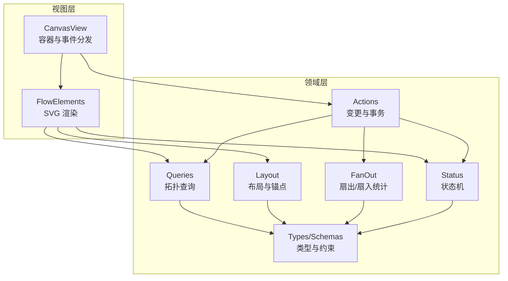
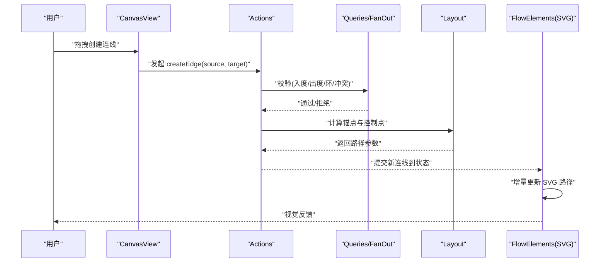
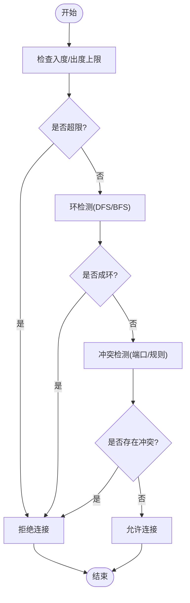
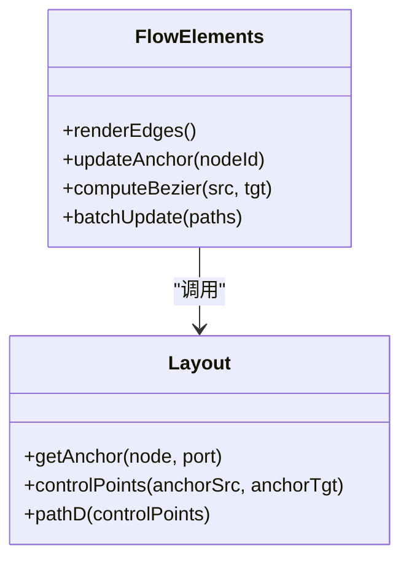
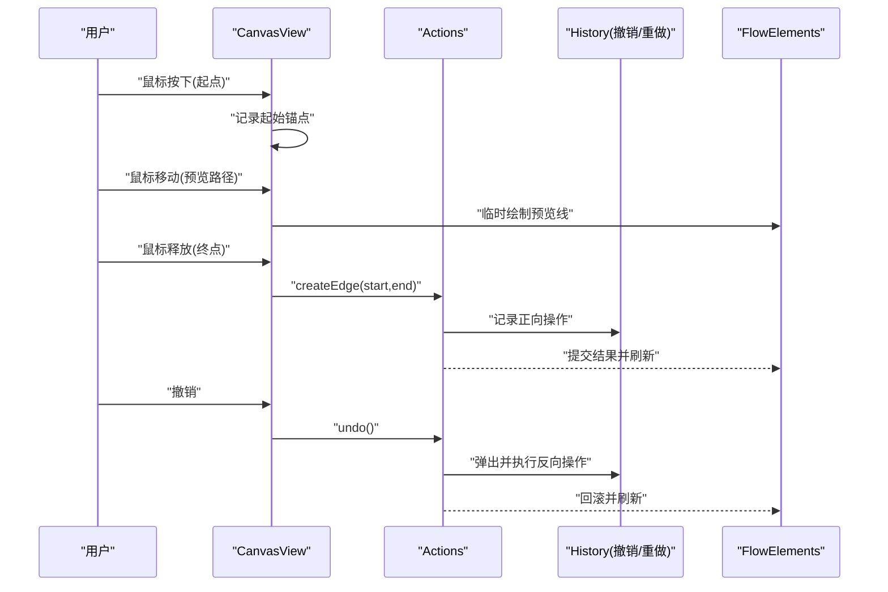
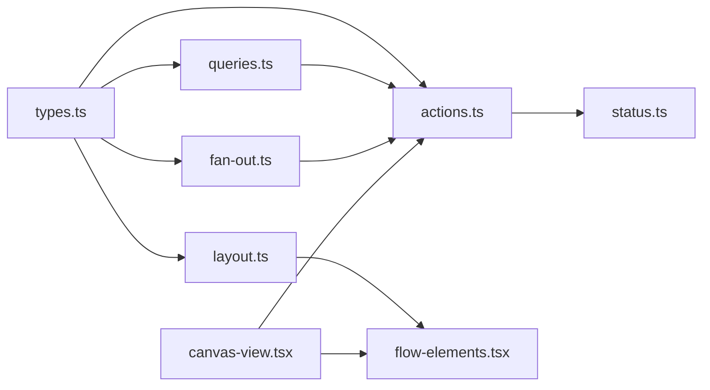

# 连线管理系统

<cite>
**本文引用的文件**   
- [flow-elements.tsx](file://src/app/canvas/flow-elements.tsx)
- [canvas-view.tsx](file://src/app/canvas/canvas-view.tsx)
- [layout.ts](file://src/features/canvas/layout.ts)
- [queries.ts](file://src/features/canvas/queries.ts)
- [actions.ts](file://src/features/canvas/actions.ts)
- [schemas.ts](file://src/features/canvas/schemas.ts)
- [types.ts](file://src/features/canvas/types.ts)
- [fan-out.ts](file://src/features/canvas/fan-out.ts)
- [status.ts](file://src/features/canvas/status.ts)
</cite>

## 目录
1. [简介](#简介)
2. [项目结构](#项目结构)
3. [核心组件](#核心组件)
4. [架构总览](#架构总览)
5. [详细组件分析](#详细组件分析)
6. [依赖关系分析](#依赖关系分析)
7. [性能考虑](#性能考虑)
8. [故障排查指南](#故障排查指南)
9. [结论](#结论)
10. [附录](#附录)

## 简介
本文件面向画布编辑器的“连线管理系统”，围绕以下目标展开：
- 数据结构设计：节点、端口与连线的类型定义、约束与校验。
- 关系验证算法：入度/出度限制、环检测、冲突检测等。
- 绘制引擎：SVG 渲染、贝塞尔曲线计算、锚点定位与动态更新。
- 交互处理：拖拽创建、吸附、选择、删除、撤销重做。
- 扩展能力：自定义连线类型、冲突检测策略、大规模数据渲染方案。
- 性能优化：增量更新、批处理、虚拟滚动与内存管理。

## 项目结构
连线相关代码主要分布在 features/canvas（领域逻辑）与 app/canvas（视图与交互）两个层次：
- features/canvas：类型、模式、查询、布局、状态、动作等纯逻辑层，负责数据模型、关系验证、布局与变更编排。
- app/canvas：视图层，包含 FlowElements 的 SVG 渲染、连线绘制、交互事件与动画更新。

图表来源
- [flow-elements.tsx](file://src/app/canvas/flow-elements.tsx)
- [canvas-view.tsx](file://src/app/canvas/canvas-view.tsx)
- [queries.ts](file://src/features/canvas/queries.ts)
- [layout.ts](file://src/features/canvas/layout.ts)
- [actions.ts](file://src/features/canvas/actions.ts)
- [fan-out.ts](file://src/features/canvas/fan-out.ts)
- [status.ts](file://src/features/canvas/status.ts)
- [types.ts](file://src/features/canvas/types.ts)
- [schemas.ts](file://src/features/canvas/schemas.ts)

章节来源
- [flow-elements.tsx](file://src/app/canvas/flow-elements.tsx)
- [canvas-view.tsx](file://src/app/canvas/canvas-view.tsx)
- [queries.ts](file://src/features/canvas/queries.ts)
- [layout.ts](file://src/features/canvas/layout.ts)
- [actions.ts](file://src/features/canvas/actions.ts)
- [fan-out.ts](file://src/features/canvas/fan-out.ts)
- [status.ts](file://src/features/canvas/status.ts)
- [types.ts](file://src/features/canvas/types.ts)
- [schemas.ts](file://src/features/canvas/schemas.ts)

## 核心组件
- 类型与模式（types.ts, schemas.ts）
  - 定义节点、端口、连线的最小可用字段与约束规则，作为所有上层逻辑的契约。
- 查询（queries.ts）
  - 提供基于图结构的查询：邻接表、入度/出度、可达性、环检测、冲突候选集等。
- 布局（layout.ts）
  - 计算锚点位置、路径控制点、可见区域裁剪与批量更新策略。
- 动作（actions.ts）
  - 封装增删改连线的原子操作，支持事务与撤销重做栈。
- 扇出/扇入（fan-out.ts）
  - 维护每个节点的入度/出度计数，用于快速判定连接合法性。
- 状态（status.ts）
  - 管理连线生命周期状态（如新建、悬停、选中、错误），驱动 UI 反馈。
- 视图（flow-elements.tsx, canvas-view.tsx）
  - FlowElements 负责 SVG 中连线与锚点的绘制；CanvasView 负责事件捕获与命令派发。

章节来源
- [types.ts](file://src/features/canvas/types.ts)
- [schemas.ts](file://src/features/canvas/schemas.ts)
- [queries.ts](file://src/features/canvas/queries.ts)
- [layout.ts](file://src/features/canvas/layout.ts)
- [actions.ts](file://src/features/canvas/actions.ts)
- [fan-out.ts](file://src/features/canvas/fan-out.ts)
- [status.ts](file://src/features/canvas/status.ts)
- [flow-elements.tsx](file://src/app/canvas/flow-elements.tsx)
- [canvas-view.tsx](file://src/app/canvas/canvas-view.tsx)

## 架构总览
连线系统采用“数据驱动 + 命令式变更”的分层架构：
- 数据层：以 types/schemas 为契约，queries/fan-out 提供只读视图。
- 变更层：actions 将用户意图转换为不可变的状态变更，并记录历史。
- 视图层：flow-elements 订阅状态变化，按需重绘 SVG 路径与锚点。

图表来源
- [canvas-view.tsx](file://src/app/canvas/canvas-view.tsx)
- [actions.ts](file://src/features/canvas/actions.ts)
- [queries.ts](file://src/features/canvas/queries.ts)
- [fan-out.ts](file://src/features/canvas/fan-out.ts)
- [layout.ts](file://src/features/canvas/layout.ts)
- [flow-elements.tsx](file://src/app/canvas/flow-elements.tsx)

## 详细组件分析

### 数据类型与约束（types.ts, schemas.ts）
- 节点与端口
  - 节点需具备唯一标识、类型、位置与尺寸；端口需具备方向、类型与可连接性标记。
- 连线
  - 包含源/目标端引用、可选元数据、样式与状态。
- 约束
  - 使用 schema 对必填字段、枚举值、范围进行校验，确保后续查询与布局稳定。

章节来源
- [types.ts](file://src/features/canvas/types.ts)
- [schemas.ts](file://src/features/canvas/schemas.ts)

### 关系验证算法（queries.ts, fan-out.ts）
- 入度/出度
  - 通过 fan-out 维护每个节点的入度/出度，避免每次全量遍历。
- 环检测
  - 在新增边时执行有向图环检测，防止形成循环依赖。
- 冲突检测
  - 针对同端口多连或互斥规则，给出冲突候选集与修复建议。
- 可达性与影响面
  - 提供下游影响分析，便于撤销/重做时的级联提示。

图表来源
- [queries.ts](file://src/features/canvas/queries.ts)
- [fan-out.ts](file://src/features/canvas/fan-out.ts)

章节来源
- [queries.ts](file://src/features/canvas/queries.ts)
- [fan-out.ts](file://src/features/canvas/fan-out.ts)

### 连线绘制引擎（flow-elements.tsx, layout.ts）
- SVG 渲染
  - 使用 path 元素绘制连线，结合 stroke、stroke-width、marker 实现箭头与样式。
- 贝塞尔曲线
  - 根据锚点位置与方向，计算三次贝塞尔控制点，保证平滑过渡。
- 锚点定位
  - 依据节点边界与端口方向，计算最近且合理的锚点坐标。
- 动态更新
  - 监听节点移动/缩放，增量更新受影响的 path d 属性，避免整图重绘。

图表来源
- [flow-elements.tsx](file://src/app/canvas/flow-elements.tsx)
- [layout.ts](file://src/features/canvas/layout.ts)

章节来源
- [flow-elements.tsx](file://src/app/canvas/flow-elements.tsx)
- [layout.ts](file://src/features/canvas/layout.ts)

### 交互处理（canvas-view.tsx, actions.ts）
- 事件流
  - mousedown/mousemove/mouseup 组合完成拖拽创建；click/drag 完成选择与移动。
- 命令化
  - 将交互转为 Actions.createEdge / deleteEdge / updateEdge 等命令，统一进入变更管线。
- 撤销重做
  - 每个命令生成前后快照或反向操作，压入历史栈，支持 undo/redo。

图表来源
- [canvas-view.tsx](file://src/app/canvas/canvas-view.tsx)
- [actions.ts](file://src/features/canvas/actions.ts)

章节来源
- [canvas-view.tsx](file://src/app/canvas/canvas-view.tsx)
- [actions.ts](file://src/features/canvas/actions.ts)

### 状态与可视化反馈（status.ts）
- 状态机
  - 连线存在多种状态：idle、hover、selected、error、creating 等。
- 视觉映射
  - 不同状态映射到颜色、描边宽度、虚线等，提升可用性。
- 联动
  - 状态变化触发局部重绘，减少不必要的渲染开销。

章节来源
- [status.ts](file://src/features/canvas/status.ts)

### 扩展：自定义连线类型
- 步骤
  - 在类型与模式中声明新的 edgeType 与样式字段。
  - 在布局模块中为该类型实现专属的 controlPoints/pathD 计算。
  - 在视图中注册对应的渲染分支（如虚线、折线、带标签）。
- 示例要点
  - 保持接口一致：输入锚点与控制点，输出 SVG path d。
  - 复用通用校验与撤销重做流程。

章节来源
- [types.ts](file://src/features/canvas/types.ts)
- [schemas.ts](file://src/features/canvas/schemas.ts)
- [layout.ts](file://src/features/canvas/layout.ts)
- [flow-elements.tsx](file://src/app/canvas/flow-elements.tsx)

### 扩展：连线冲突检测
- 策略
  - 端口级互斥、类型不兼容、业务规则（如单向/双向）。
- 实现
  - 在 queries 中扩展冲突检测函数，返回冲突详情与修复建议。
  - 在 actions 中拦截非法连接并提示用户。

章节来源
- [queries.ts](file://src/features/canvas/queries.ts)
- [actions.ts](file://src/features/canvas/actions.ts)

### 扩展：撤销重做
- 设计
  - 每个 Action 提供 do/undo 或 before/after 快照。
  - 历史记录独立于视图，支持跨会话持久化。
- 实现
  - 在 actions 中集中管理历史栈；视图仅消费最终状态。

章节来源
- [actions.ts](file://src/features/canvas/actions.ts)

## 依赖关系分析
- 低耦合
  - 视图仅依赖查询与布局的只读接口，不直接修改数据。
- 高内聚
  - 关系验证集中在 queries/fan-out，布局集中在 layout，变更集中在 actions。
- 外部依赖
  - 无重型第三方库依赖，核心为纯函数与不可变数据。

图表来源
- [types.ts](file://src/features/canvas/types.ts)
- [queries.ts](file://src/features/canvas/queries.ts)
- [fan-out.ts](file://src/features/canvas/fan-out.ts)
- [layout.ts](file://src/features/canvas/layout.ts)
- [actions.ts](file://src/features/canvas/actions.ts)
- [status.ts](file://src/features/canvas/status.ts)
- [flow-elements.tsx](file://src/app/canvas/flow-elements.tsx)
- [canvas-view.tsx](file://src/app/canvas/canvas-view.tsx)

章节来源
- [types.ts](file://src/features/canvas/types.ts)
- [queries.ts](file://src/features/canvas/queries.ts)
- [fan-out.ts](file://src/features/canvas/fan-out.ts)
- [layout.ts](file://src/features/canvas/layout.ts)
- [actions.ts](file://src/features/canvas/actions.ts)
- [status.ts](file://src/features/canvas/status.ts)
- [flow-elements.tsx](file://src/app/canvas/flow-elements.tsx)
- [canvas-view.tsx](file://src/app/canvas/canvas-view.tsx)

## 性能考虑
- 增量更新
  - 仅更新受影响的 path d 与锚点，避免整图重绘。
- 批处理
  - 合并多次变更，一次性提交到视图层。
- 缓存
  - 缓存锚点与控制点计算结果，按节点粒度失效。
- 虚拟渲染
  - 对超大规模图，仅渲染可视区域内的连线与锚点。
- 内存管理
  - 及时释放历史快照中不再需要的中间态；避免闭包持有大对象。

[本节为通用指导，无需源码引用]

## 故障排查指南
- 常见错误
  - 入度/出度超限：检查 fan-out 计数与端口配置。
  - 环检测失败：确认有向边方向与拓扑顺序。
  - 冲突未生效：核对冲突规则优先级与命中条件。
  - 路径异常：检查锚点坐标与控制点计算。
- 调试建议
  - 打印关键查询结果（邻接表、入度/出度）。
  - 在 actions 中记录 before/after 快照对比。
  - 在 flow-elements 中输出 path d 字符串辅助定位。

章节来源
- [queries.ts](file://src/features/canvas/queries.ts)
- [fan-out.ts](file://src/features/canvas/fan-out.ts)
- [actions.ts](file://src/features/canvas/actions.ts)
- [flow-elements.tsx](file://src/app/canvas/flow-elements.tsx)

## 结论
连线管理系统通过清晰的分层与严格的类型约束，实现了可扩展、可验证、可撤销的高性能连线能力。视图层专注渲染与交互，领域层专注数据与规则，二者通过稳定的接口协作，既保证了正确性，也兼顾了性能与可维护性。

[本节为总结，无需源码引用]

## 附录
- 术语
  - 锚点：节点上用于连接的几何点。
  - 控制点：贝塞尔曲线的中间控制点，决定曲线形状。
  - 扇出/扇入：节点的出度/入度统计。
- 参考实现路径
  - 类型与模式：[types.ts](file://src/features/canvas/types.ts), [schemas.ts](file://src/features/canvas/schemas.ts)
  - 查询与验证：[queries.ts](file://src/features/canvas/queries.ts), [fan-out.ts](file://src/features/canvas/fan-out.ts)
  - 布局与路径：[layout.ts](file://src/features/canvas/layout.ts)
  - 动作与历史：[actions.ts](file://src/features/canvas/actions.ts)
  - 视图与渲染：[flow-elements.tsx](file://src/app/canvas/flow-elements.tsx), [canvas-view.tsx](file://src/app/canvas/canvas-view.tsx)
  - 状态与反馈：[status.ts](file://src/features/canvas/status.ts)