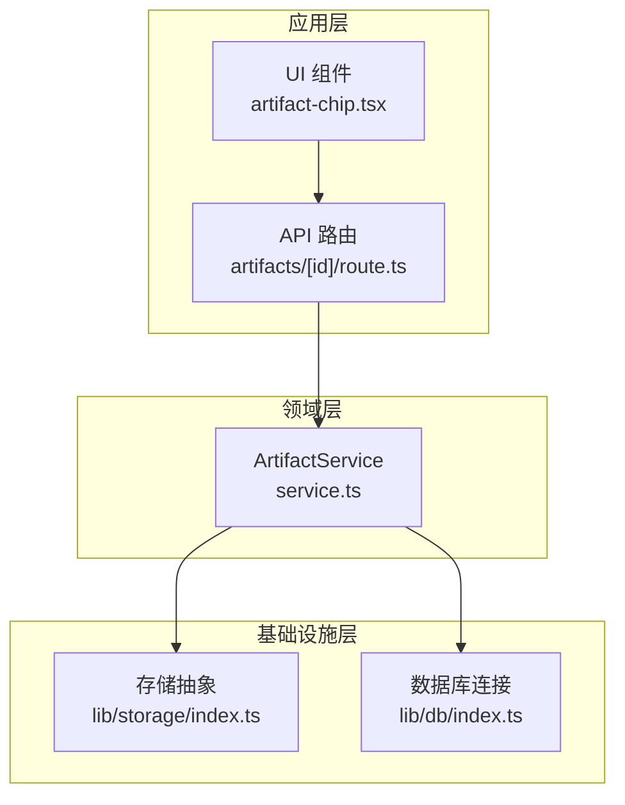
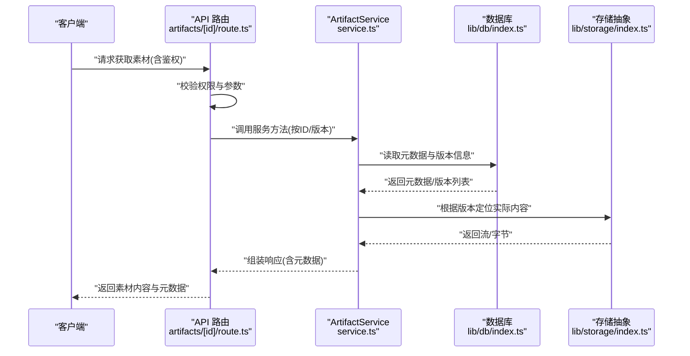
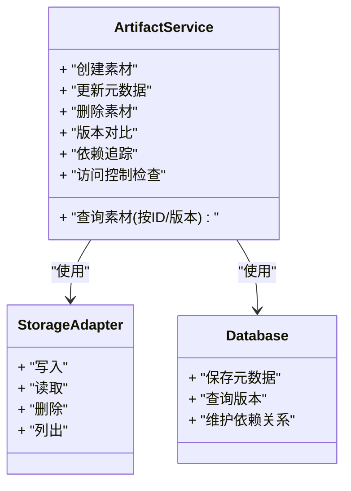
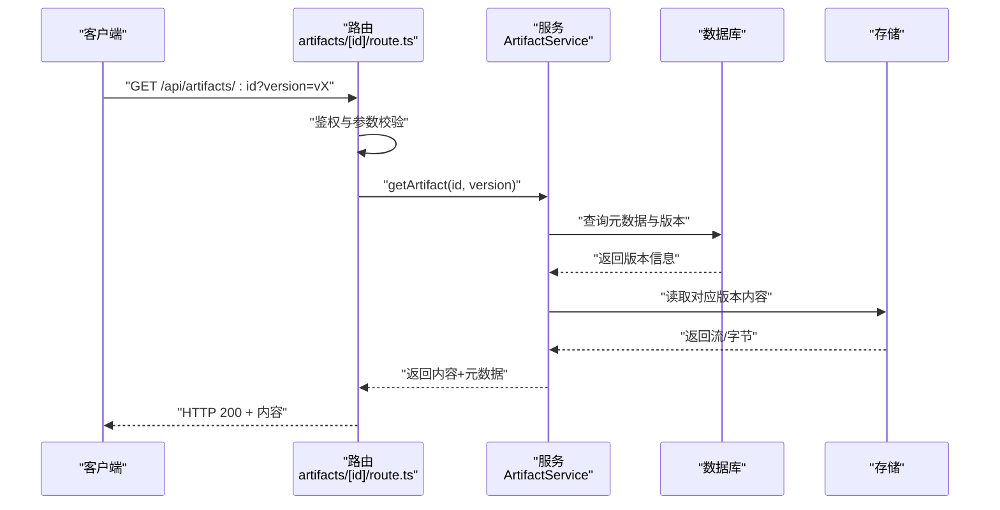
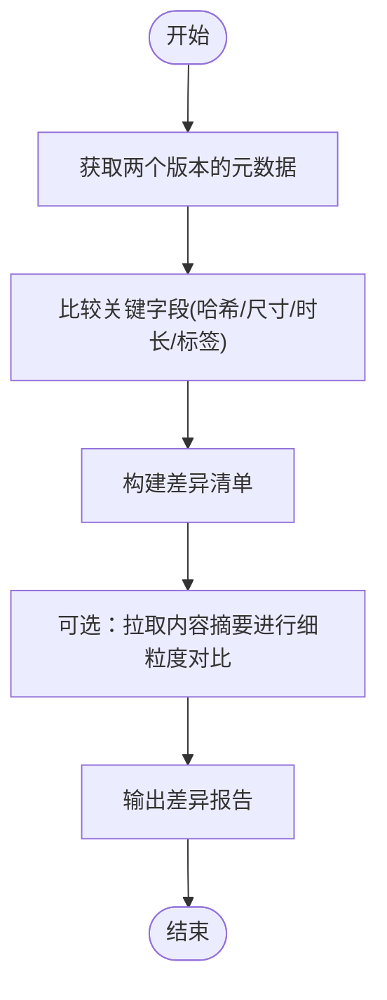
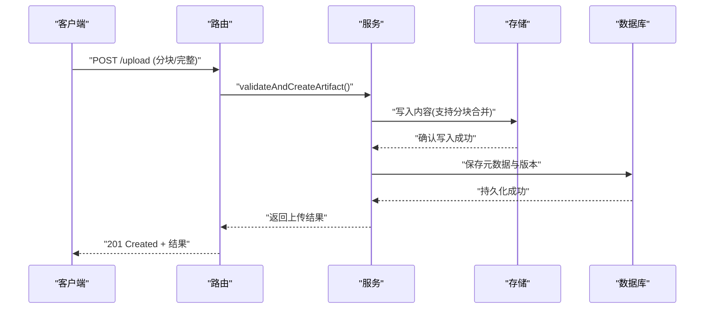
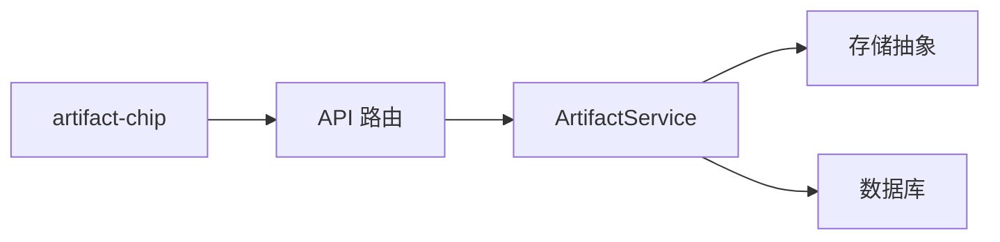

# 素材管理

<cite>
**本文引用的文件**
- [src/features/artifacts/service.ts](file://src/features/artifacts/service.ts)
- [src/features/artifacts/index.ts](file://src/features/artifacts/index.ts)
- [src/app/api/artifacts/[id]/route.ts](file://src/app/api/artifacts/[id]/route.ts)
- [src/components/ui/artifact-chip.tsx](file://src/components/ui/artifact-chip.tsx)
- [src/lib/storage/index.ts](file://src/lib/storage/index.ts)
- [src/lib/db/index.ts](file://src/lib/db/index.ts)
</cite>

## 目录
1. [简介](#简介)
2. [项目结构](#项目结构)
3. [核心组件](#核心组件)
4. [架构总览](#架构总览)
5. [详细组件分析](#详细组件分析)
6. [依赖关系分析](#依赖关系分析)
7. [性能考虑](#性能考虑)
8. [故障排查指南](#故障排查指南)
9. [结论](#结论)
10. [附录](#附录)

## 简介
本文件面向 CodeVideoCanvas 的“素材管理”能力，聚焦媒体资产管理系统、素材版本控制、元数据管理与访问控制机制。文档围绕 ArtifactService 的核心业务逻辑展开，覆盖上传下载流程、版本对比与依赖关系管理，并提供可操作的实践建议与扩展开发指南。为便于不同技术背景的读者理解，文档采用由浅入深的分层说明，并辅以架构图、时序图与流程图帮助建立整体认知。

## 项目结构
与素材管理相关的代码主要分布在以下位置：
- 领域服务层：features/artifacts（ArtifactService 实现）
- API 路由层：app/api/artifacts/[id]（按 ID 访问素材的 REST 接口）
- UI 展示层：components/ui/artifact-chip（素材卡片/标签展示）
- 基础设施层：lib/storage（存储抽象）、lib/db（数据库连接）

图表来源
- [src/app/api/artifacts/[id]/route.ts](file://src/app/api/artifacts/[id]/route.ts)
- [src/features/artifacts/service.ts](file://src/features/artifacts/service.ts)
- [src/components/ui/artifact-chip.tsx](file://src/components/ui/artifact-chip.tsx)
- [src/lib/storage/index.ts](file://src/lib/storage/index.ts)
- [src/lib/db/index.ts](file://src/lib/db/index.ts)

章节来源
- [src/features/artifacts/service.ts](file://src/features/artifacts/service.ts)
- [src/features/artifacts/index.ts](file://src/features/artifacts/index.ts)
- [src/app/api/artifacts/[id]/route.ts](file://src/app/api/artifacts/[id]/route.ts)
- [src/components/ui/artifact-chip.tsx](file://src/components/ui/artifact-chip.tsx)
- [src/lib/storage/index.ts](file://src/lib/storage/index.ts)
- [src/lib/db/index.ts](file://src/lib/db/index.ts)

## 核心组件
- ArtifactService：封装素材管理的核心业务逻辑，包括素材的创建、查询、版本化、元数据维护、依赖追踪以及访问控制策略等。
- API 路由 artifacts/[id]：提供基于资源 ID 的访问入口，负责鉴权、参数校验、调用服务层并返回结果。
- artifact-chip：在界面中展示素材标识信息，通常用于快速识别与跳转。
- 存储抽象 lib/storage：统一对接底层对象存储或本地文件系统，屏蔽具体实现差异。
- 数据库连接 lib/db：提供持久化能力，用于保存元数据、版本信息与引用关系。

章节来源
- [src/features/artifacts/service.ts](file://src/features/artifacts/service.ts)
- [src/app/api/artifacts/[id]/route.ts](file://src/app/api/artifacts/[id]/route.ts)
- [src/components/ui/artifact-chip.tsx](file://src/components/ui/artifact-chip.tsx)
- [src/lib/storage/index.ts](file://src/lib/storage/index.ts)
- [src/lib/db/index.ts](file://src/lib/db/index.ts)

## 架构总览
下图展示了从前端到后端再到存储与数据库的整体交互路径，体现访问控制、版本选择与依赖解析的关键环节。

图表来源
- [src/app/api/artifacts/[id]/route.ts](file://src/app/api/artifacts/[id]/route.ts)
- [src/features/artifacts/service.ts](file://src/features/artifacts/service.ts)
- [src/lib/db/index.ts](file://src/lib/db/index.ts)
- [src/lib/storage/index.ts](file://src/lib/storage/index.ts)

## 详细组件分析

### ArtifactService 核心业务逻辑
- 职责边界
  - 素材生命周期管理：创建、更新、删除、归档。
  - 版本控制：支持多版本并存、版本选择策略（如最新、指定版本号）。
  - 元数据管理：类型、大小、哈希、标签、描述、创建/更新时间等。
  - 依赖关系管理：记录素材之间的引用关系，支撑影响分析与回滚。
  - 访问控制：结合用户角色与资源可见性进行授权判断。
- 关键流程
  - 上传：接收文件流 -> 生成唯一标识与哈希 -> 写入存储 -> 落库元数据与版本 -> 构建依赖基线。
  - 下载：鉴权 -> 解析版本 -> 定位存储路径 -> 流式返回。
  - 版本对比：拉取两个版本的元数据与可选内容摘要，计算差异项（如尺寸、时长、哈希）。
  - 引用追踪：基于依赖表统计上游/下游引用，辅助变更影响评估。
- 错误处理
  - 非法参数、权限不足、存储不可用、版本不存在等场景需返回明确错误码与提示。
- 性能优化
  - 大文件分块上传/断点续传、流式读写、缓存热点元数据、按需加载缩略图。

章节来源
- [src/features/artifacts/service.ts](file://src/features/artifacts/service.ts)

#### 类关系图（概念映射）

图表来源
- [src/features/artifacts/service.ts](file://src/features/artifacts/service.ts)
- [src/lib/storage/index.ts](file://src/lib/storage/index.ts)
- [src/lib/db/index.ts](file://src/lib/db/index.ts)

### API 路由 artifacts/[id]
- 功能要点
  - 鉴权与权限校验：确保当前用户具备访问该素材的权限。
  - 参数校验：验证 ID、版本、格式等输入合法性。
  - 调用服务层：委托 ArtifactService 完成核心逻辑。
  - 响应封装：统一返回结构与错误码。
- 典型调用链
  - GET /api/artifacts/:id?version=... -> 鉴权 -> 解析版本 -> 调用服务 -> 返回内容/元数据。
  - POST /api/artifacts/:id/upload -> 接收文件 -> 调用服务 -> 返回上传结果。

章节来源
- [src/app/api/artifacts/[id]/route.ts](file://src/app/api/artifacts/[id]/route.ts)

#### 序列图（下载流程）

图表来源
- [src/app/api/artifacts/[id]/route.ts](file://src/app/api/artifacts/[id]/route.ts)
- [src/features/artifacts/service.ts](file://src/features/artifacts/service.ts)
- [src/lib/db/index.ts](file://src/lib/db/index.ts)
- [src/lib/storage/index.ts](file://src/lib/storage/index.ts)

### 版本对比与依赖关系管理
- 版本对比
  - 输入：两个版本标识（如 v1、v2）。
  - 过程：拉取两版元数据，必要时拉取内容摘要；比较关键字段（哈希、尺寸、时长、标签等）。
  - 输出：差异清单与可选的差异视图。
- 依赖关系管理
  - 记录素材间的引用关系（上游/下游），支持影响分析、回滚与清理。
  - 变更时自动更新依赖图，避免悬挂引用。

图表来源
- [src/features/artifacts/service.ts](file://src/features/artifacts/service.ts)
- [src/lib/db/index.ts](file://src/lib/db/index.ts)

章节来源
- [src/features/artifacts/service.ts](file://src/features/artifacts/service.ts)
- [src/lib/db/index.ts](file://src/lib/db/index.ts)

### 素材上传与下载流程
- 上传流程
  - 客户端发起上传请求（支持分块/断点续传）。
  - 服务端校验权限与参数，生成唯一标识与内容哈希。
  - 将内容写入存储，落库元数据与版本信息，初始化依赖基线。
  - 返回上传结果（包含 ID、版本、元数据摘要）。
- 下载流程
  - 客户端携带 ID 与版本发起请求。
  - 服务端鉴权后，解析版本并定位存储路径。
  - 以流式方式返回内容，同时附带必要元数据。

图表来源
- [src/app/api/artifacts/[id]/route.ts](file://src/app/api/artifacts/[id]/route.ts)
- [src/features/artifacts/service.ts](file://src/features/artifacts/service.ts)
- [src/lib/storage/index.ts](file://src/lib/storage/index.ts)
- [src/lib/db/index.ts](file://src/lib/db/index.ts)

章节来源
- [src/app/api/artifacts/[id]/route.ts](file://src/app/api/artifacts/[id]/route.ts)
- [src/features/artifacts/service.ts](file://src/features/artifacts/service.ts)
- [src/lib/storage/index.ts](file://src/lib/storage/index.ts)
- [src/lib/db/index.ts](file://src/lib/db/index.ts)

### 元数据管理与访问控制
- 元数据字段
  - 基础信息：名称、类型、大小、哈希、创建/更新时间。
  - 业务信息：标签、描述、关联项目/镜头、审核状态。
  - 版本信息：版本号、父版本、快照摘要。
- 访问控制
  - 基于角色的访问控制（RBAC）与资源级可见性。
  - 鉴权失败时返回明确的错误码与提示。
  - 审计日志记录敏感操作（上传、删除、公开/私有切换）。

章节来源
- [src/features/artifacts/service.ts](file://src/features/artifacts/service.ts)
- [src/app/api/artifacts/[id]/route.ts](file://src/app/api/artifacts/[id]/route.ts)

### UI 展示：artifact-chip
- 作用：在界面中以紧凑形式展示素材标识（名称、类型、状态），支持点击跳转至详情或预览。
- 交互：与 API 路由协作，获取最新元数据并在需要时触发下载。

章节来源
- [src/components/ui/artifact-chip.tsx](file://src/components/ui/artifact-chip.tsx)

## 依赖关系分析
- 模块耦合
  - API 路由仅负责协议层与鉴权，核心逻辑下沉至 ArtifactService，保持低耦合。
  - ArtifactService 通过抽象接口与存储和数据库交互，便于替换实现（如云存储、本地磁盘）。
- 外部依赖
  - 存储抽象：屏蔽底层差异，支持多种介质。
  - 数据库：持久化元数据与依赖关系，保证一致性与事务性。
- 潜在循环依赖
  - 通过分层与接口隔离避免循环引用。

图表来源
- [src/app/api/artifacts/[id]/route.ts](file://src/app/api/artifacts/[id]/route.ts)
- [src/features/artifacts/service.ts](file://src/features/artifacts/service.ts)
- [src/lib/storage/index.ts](file://src/lib/storage/index.ts)
- [src/lib/db/index.ts](file://src/lib/db/index.ts)
- [src/components/ui/artifact-chip.tsx](file://src/components/ui/artifact-chip.tsx)

章节来源
- [src/features/artifacts/service.ts](file://src/features/artifacts/service.ts)
- [src/app/api/artifacts/[id]/route.ts](file://src/app/api/artifacts/[id]/route.ts)
- [src/lib/storage/index.ts](file://src/lib/storage/index.ts)
- [src/lib/db/index.ts](file://src/lib/db/index.ts)
- [src/components/ui/artifact-chip.tsx](file://src/components/ui/artifact-chip.tsx)

## 性能考虑
- 存储与 I/O
  - 大文件分块上传与断点续传，降低网络抖动影响。
  - 流式读写减少内存峰值，提升吞吐。
- 缓存策略
  - 对热点元数据进行缓存（如最近访问的素材信息）。
  - 缩略图与预览图缓存，加速 UI 渲染。
- 并发与限流
  - 针对上传/下载接口设置合理的并发限制与速率限制。
- 索引与查询优化
  - 对常用查询字段建立索引（如项目 ID、类型、时间范围）。
- 一致性保障
  - 元数据与存储写入采用事务或补偿机制，确保最终一致。

[本节为通用性能指导，不直接分析具体文件]

## 故障排查指南
- 常见问题
  - 权限不足：检查用户角色与资源可见性配置。
  - 版本不存在：确认版本标识是否有效，是否存在被删除或归档的版本。
  - 存储不可用：检查存储适配器配置与连通性。
  - 依赖异常：核查依赖表完整性，修复悬挂引用。
- 诊断步骤
  - 查看 API 错误码与日志，定位失败阶段（鉴权、参数、服务、存储、数据库）。
  - 核对元数据与存储路径的一致性。
  - 使用版本对比工具定位差异点。
- 恢复建议
  - 回滚到上一个稳定版本。
  - 重建依赖基线。
  - 重试失败的分块上传片段。

章节来源
- [src/app/api/artifacts/[id]/route.ts](file://src/app/api/artifacts/[id]/route.ts)
- [src/features/artifacts/service.ts](file://src/features/artifacts/service.ts)

## 结论
CodeVideoCanvas 的素材管理以 ArtifactService 为核心，结合清晰的 API 路由与稳定的基础设施抽象，实现了完善的版本控制、元数据管理与访问控制。通过分块上传、流式处理与缓存策略，系统在可用性与性能之间取得良好平衡。遵循本文的最佳实践与扩展指南，可在现有基础上平滑演进，满足更复杂的业务需求。

[本节为总结性内容，不直接分析具体文件]

## 附录

### 最佳实践
- 上传
  - 启用分块与断点续传，合理设置分块大小。
  - 生成内容哈希用于去重与完整性校验。
- 版本控制
  - 固定版本号命名规范，保留必要的历史版本。
  - 变更时同步更新依赖基线。
- 元数据
  - 标准化字段定义，避免冗余与歧义。
  - 对高频查询字段建立索引。
- 安全
  - 严格的鉴权与最小权限原则。
  - 审计日志记录敏感操作。
- 性能
  - 缓存热点元数据与缩略图。
  - 流式处理大文件，避免内存溢出。

[本节为通用指导，不直接分析具体文件]

### 扩展开发指南
- 新增存储后端
  - 实现存储抽象接口，注册到系统。
  - 在 ArtifactService 中注入新实现。
- 增强版本对比
  - 增加内容摘要对比（如帧级差异、音频波形差异）。
  - 提供可视化差异报告。
- 强化访问控制
  - 引入细粒度权限（读/写/分享/删除）。
  - 支持组织级与项目级可见性策略。
- 依赖关系增强
  - 提供影响分析面板，展示变更波及范围。
  - 自动化清理无用依赖。

[本节为通用指导，不直接分析具体文件]