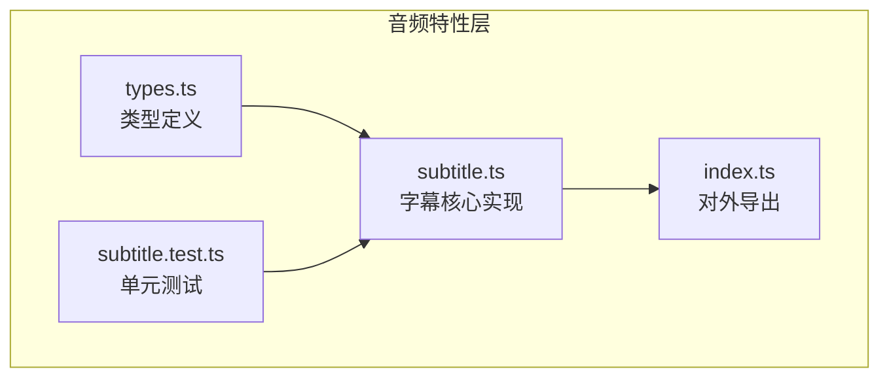
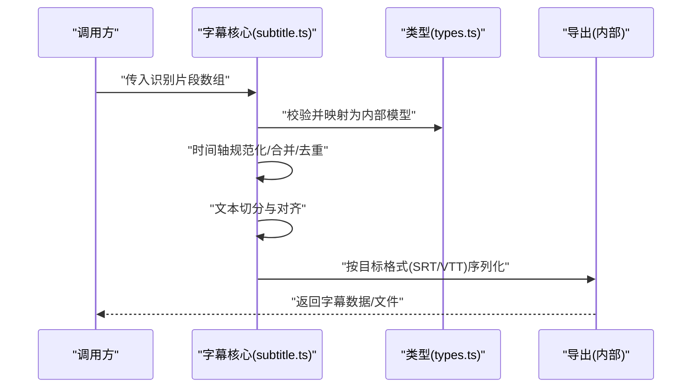
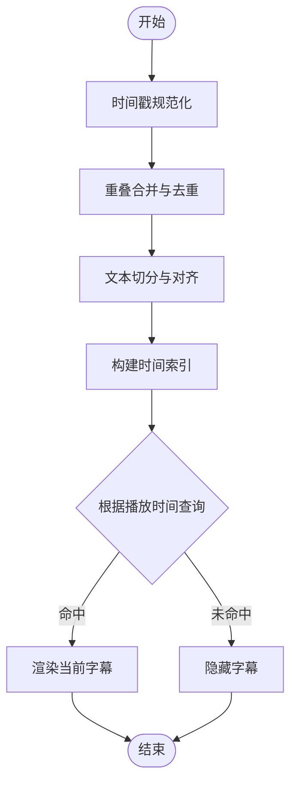
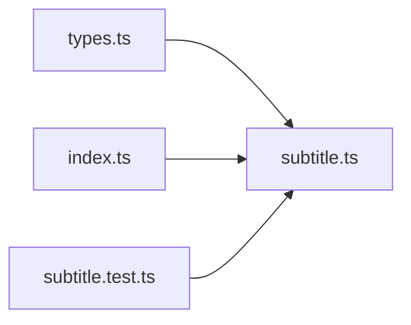

# 字幕生成

<cite>
**本文引用的文件**   
- [src/features/audio/subtitle.ts](file://src/features/audio/subtitle.ts)
- [src/features/audio/subtitle.test.ts](file://src/features/audio/subtitle.test.ts)
- [src/features/audio/types.ts](file://src/features/audio/types.ts)
- [src/features/audio/index.ts](file://src/features/audio/index.ts)
</cite>

## 目录
1. [简介](#简介)
2. [项目结构](#项目结构)
3. [核心组件](#核心组件)
4. [架构总览](#架构总览)
5. [详细组件分析](#详细组件分析)
6. [依赖分析](#依赖分析)
7. [性能考虑](#性能考虑)
8. [故障排除指南](#故障排除指南)
9. [结论](#结论)
10. [附录](#附录)

## 简介
本章节面向 CodeVideoCanvas 的字幕生成功能，聚焦 Subtitle 模块的实现与使用。内容涵盖：
- 字幕时间轴管理、文本同步算法
- 多语言支持与格式转换（SRT、VTT）
- 语音识别结果解析与自动字幕生成
- 字幕编辑与导出流程
- 与视频帧的精确同步机制、内存管理与渲染优化建议
- 工作流程与常见问题排查

## 项目结构
Subtitle 模块位于 features/audio 下，围绕“数据模型 + 处理逻辑 + 测试”组织：
- 类型定义：统一的数据结构与约束
- 核心实现：时间轴、同步、格式化、批量处理等能力
- 测试用例：覆盖关键路径与边界条件

图表来源
- [src/features/audio/types.ts](file://src/features/audio/types.ts)
- [src/features/audio/subtitle.ts](file://src/features/audio/subtitle.ts)
- [src/features/audio/index.ts](file://src/features/audio/index.ts)
- [src/features/audio/subtitle.test.ts](file://src/features/audio/subtitle.test.ts)

章节来源
- [src/features/audio/types.ts](file://src/features/audio/types.ts)
- [src/features/audio/subtitle.ts](file://src/features/audio/subtitle.ts)
- [src/features/audio/index.ts](file://src/features/audio/index.ts)
- [src/features/audio/subtitle.test.ts](file://src/features/audio/subtitle.test.ts)

## 核心组件
- 数据模型与约束
  - 通过类型文件集中定义字幕条目、时间范围、样式属性、语言标识等，确保前后端一致性与可序列化性。
- 字幕核心库
  - 提供创建/更新/删除字幕条目、时间轴合并与去重、文本切分与对齐、多语言切换、格式导出（SRT/VTT）等能力。
- 对外接口
  - 通过索引文件聚合导出，供上层业务（如渲染管线、编辑器 UI）直接调用。

章节来源
- [src/features/audio/types.ts](file://src/features/audio/types.ts)
- [src/features/audio/subtitle.ts](file://src/features/audio/subtitle.ts)
- [src/features/audio/index.ts](file://src/features/audio/index.ts)

## 架构总览
从输入到输出的端到端流程如下：
- 输入：语音识别结果（片段化文本 + 时间戳）、可选样式配置、目标语言
- 处理：时间轴规范化、重叠合并、文本切分与对齐、样式注入
- 输出：标准字幕文件（SRT/VTT），并可驱动播放器或渲染器进行逐帧显示

图表来源
- [src/features/audio/subtitle.ts](file://src/features/audio/subtitle.ts)
- [src/features/audio/types.ts](file://src/features/audio/types.ts)

## 详细组件分析

### 数据模型与类型
- 设计要点
  - 明确字幕条目的起止时间、文本内容、语言、样式等字段
  - 对时间单位、精度、时区等进行约束，保证跨平台一致性
  - 提供只读视图与可变操作的分离，避免意外修改共享状态
- 复杂度与空间占用
  - 单条目 O(1)，N 条目整体 O(N)；时间轴操作通常涉及排序与合并，最坏 O(N log N)

章节来源
- [src/features/audio/types.ts](file://src/features/audio/types.ts)

### 字幕核心实现（时间轴与同步）
- 时间轴管理
  - 规范化：将不同来源的时间戳归一化为统一单位与基准
  - 合并与去重：处理重叠区间，保持最小必要粒度
  - 查询：基于时间点快速定位当前应显示的字幕条目
- 文本同步算法
  - 基于时间窗口的二分查找或索引表，达到 O(log N) 或近似 O(1) 的命中效率
  - 支持平滑过渡与防抖，减少频繁重绘
- 多语言支持
  - 以语言键区分多条字幕流，运行时可按语言切换
- 格式转换
  - SRT：序号、时间范围、文本三行一组
  - VTT：头部声明、CUE 块、可选样式标记
- 错误处理
  - 非法时间、空文本、重复序号等场景给出明确错误信息

图表来源
- [src/features/audio/subtitle.ts](file://src/features/audio/subtitle.ts)

章节来源
- [src/features/audio/subtitle.ts](file://src/features/audio/subtitle.ts)

### 语音识别结果解析与自动生成
- 输入假设
  - 识别结果包含片段文本与对应时间戳，可能来自不同厂商或采样率
- 处理步骤
  - 清洗与标准化：去除空白、标点异常、转义字符
  - 时间对齐：将毫秒级时间戳对齐到目标精度
  - 分段策略：按语义或固定时长切分，避免过长单条
- 自动生成
  - 将识别片段映射为字幕条目，必要时插入占位或提示
  - 批量写入时间轴，触发合并与去重

章节来源
- [src/features/audio/subtitle.ts](file://src/features/audio/subtitle.ts)

### 字幕编辑与批量处理
- 编辑能力
  - 增删改查：新增条目、调整起止时间、修改文本与样式
  - 批量操作：批量移动、批量替换、批量设置样式
- 一致性保障
  - 在批量操作中采用事务式更新，失败回滚
  - 变更事件通知，便于 UI 即时刷新

章节来源
- [src/features/audio/subtitle.ts](file://src/features/audio/subtitle.ts)

### 导出标准格式（SRT、VTT）
- SRT
  - 序号递增、时间范围 HH:MM:SS,mmm 格式、文本换行规则
- VTT
  - WEBVTT 头、CUE 时间范围、可选样式（颜色、位置等）
- 编码与换行
  - 统一 UTF-8，遵循各平台换行约定

章节来源
- [src/features/audio/subtitle.ts](file://src/features/audio/subtitle.ts)

### 与视频帧的精确同步机制
- 同步策略
  - 基于播放时间轴与字幕时间索引，计算当前帧应显示的字幕集合
  - 支持多轨字幕（多语言）并行存在，按需激活
- 渲染优化
  - 增量更新：仅当字幕集合变化时触发重绘
  - 批处理：将多次变更合并为一次渲染
  - 虚拟列表：长字幕列表仅渲染可视区域

章节来源
- [src/features/audio/subtitle.ts](file://src/features/audio/subtitle.ts)

### 内存管理与性能
- 内存控制
  - 惰性加载：按需加载大字幕集
  - 对象池：复用字幕条目对象，降低 GC 压力
- 性能指标
  - 时间查询 O(log N) 或 O(1)
  - 批量操作均摊 O(N)
  - 渲染频率限制与节流

章节来源
- [src/features/audio/subtitle.ts](file://src/features/audio/subtitle.ts)

### 代码示例（路径指引）
以下为常用操作的“代码片段路径”，请据此在源码中查看具体实现与用法：
- 创建字幕条目与设置显示时间
  - [src/features/audio/subtitle.ts](file://src/features/audio/subtitle.ts)
- 添加样式属性（颜色、位置、字体等）
  - [src/features/audio/subtitle.ts](file://src/features/audio/subtitle.ts)
- 批量处理字幕数据（批量移动/替换/设置样式）
  - [src/features/audio/subtitle.ts](file://src/features/audio/subtitle.ts)
- 解析语音识别结果并自动生成字幕
  - [src/features/audio/subtitle.ts](file://src/features/audio/subtitle.ts)
- 导出 SRT/VTT 标准格式
  - [src/features/audio/subtitle.ts](file://src/features/audio/subtitle.ts)

章节来源
- [src/features/audio/subtitle.ts](file://src/features/audio/subtitle.ts)

## 依赖分析
- 内部依赖
  - types.ts：被 subtitle.ts 广泛引用，作为契约层
  - index.ts：聚合导出，简化上层导入
- 外部依赖
  - 无重型第三方库依赖，核心逻辑自包含，利于移植与测试

图表来源
- [src/features/audio/types.ts](file://src/features/audio/types.ts)
- [src/features/audio/subtitle.ts](file://src/features/audio/subtitle.ts)
- [src/features/audio/index.ts](file://src/features/audio/index.ts)
- [src/features/audio/subtitle.test.ts](file://src/features/audio/subtitle.test.ts)

章节来源
- [src/features/audio/types.ts](file://src/features/audio/types.ts)
- [src/features/audio/subtitle.ts](file://src/features/audio/subtitle.ts)
- [src/features/audio/index.ts](file://src/features/audio/index.ts)
- [src/features/audio/subtitle.test.ts](file://src/features/audio/subtitle.test.ts)

## 性能考虑
- 时间轴查询
  - 优先使用时间索引或二分查找，避免线性扫描
- 渲染频率
  - 结合播放器 tick 频率，限制字幕更新次数，避免抖动
- 大数据量
  - 分页/懒加载、虚拟滚动、对象池复用
- I/O 与序列化
  - 批量导出时采用流式写入，避免一次性构建超大字符串

[本节为通用指导，不直接分析具体文件]

## 故障排除指南
- 常见错误
  - 时间戳越界或倒序：检查规范化与排序逻辑
  - 重叠区间导致闪烁：确认合并与去重策略
  - 多语言切换后内容为空：验证语言键与数据源映射
  - 导出格式不正确：核对时间格式、序号与换行
- 调试建议
  - 打印时间轴快照与当前命中条目
  - 回放关键时间点的字幕集合变化
  - 使用测试用例复现问题路径

章节来源
- [src/features/audio/subtitle.test.ts](file://src/features/audio/subtitle.test.ts)

## 结论
Subtitle 模块以清晰的数据模型为核心，提供稳健的时间轴管理、高效的文本同步、灵活的多语言支持与可靠的格式导出。通过合理的内存管理与渲染优化，可在大规模字幕场景下保持稳定性能。建议在上层集成时严格遵循类型契约，充分利用批量处理能力，并结合测试用例保障质量。

[本节为总结性内容，不直接分析具体文件]

## 附录
- 术语
  - 时间轴：按时间顺序排列的字幕条目序列
  - 时间窗口：用于判定某时刻是否应显示某条字幕的区间
  - 多轨字幕：同一时间段内多种语言的并行字幕流
- 参考
  - 相关测试用例可用于理解行为预期与边界条件

[本节为补充说明，不直接分析具体文件]