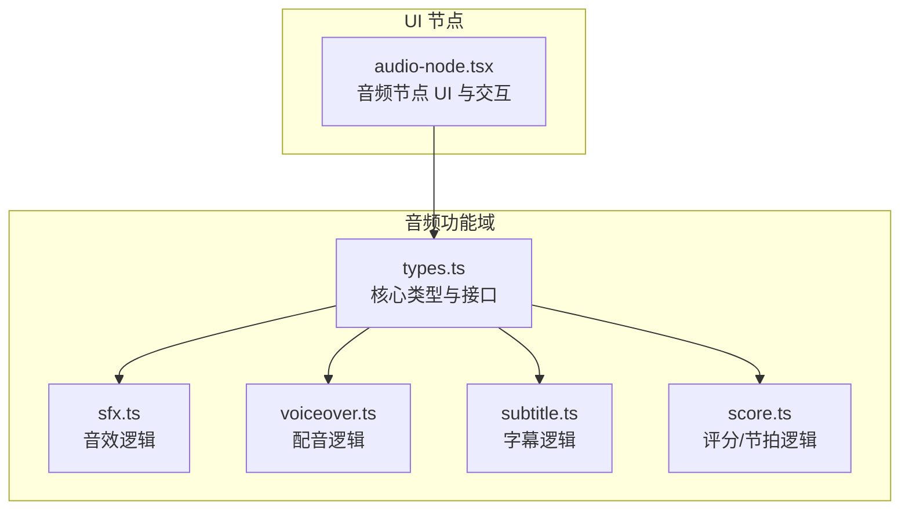
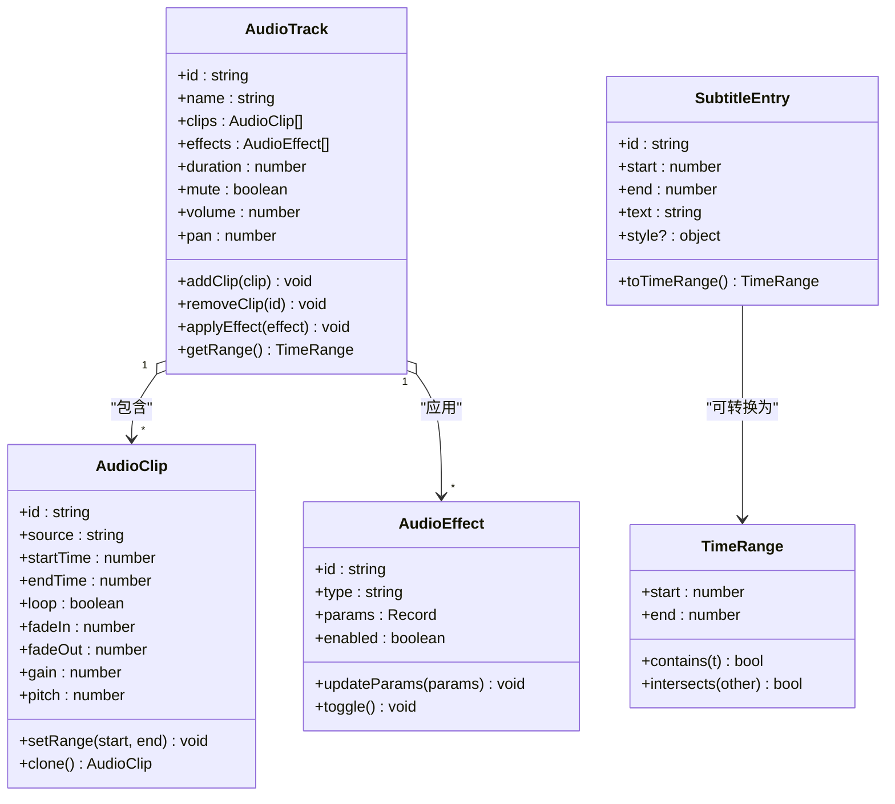
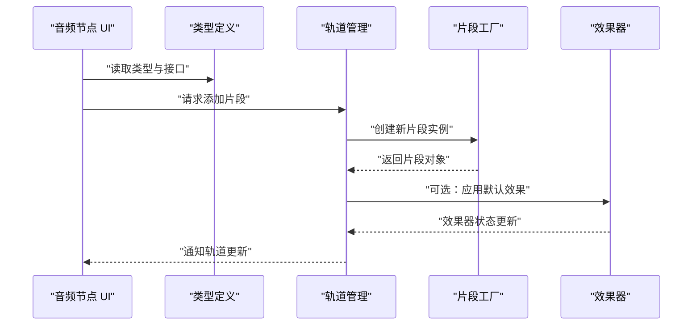
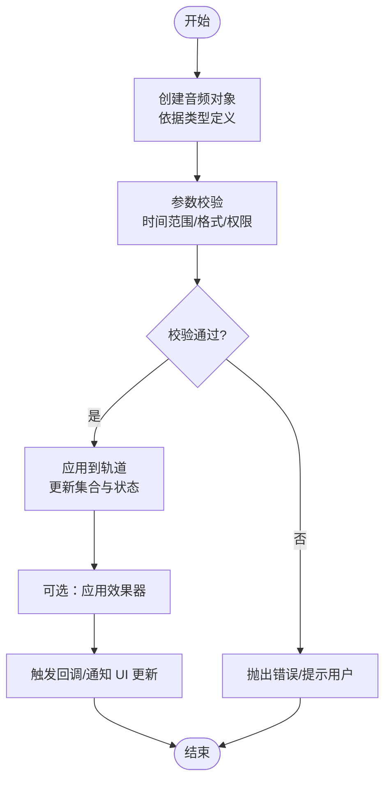
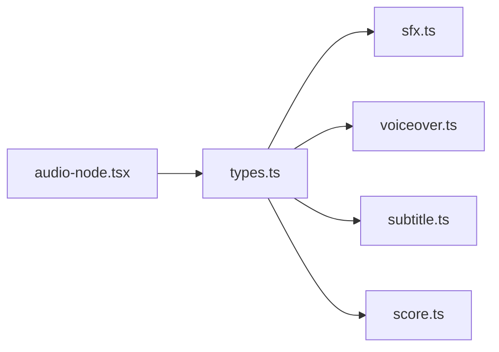

# 数据类型与接口

<cite>
**本文引用的文件**
- [src/features/audio/types.ts](file://src/features/audio/types.ts)
- [src/features/audio/index.ts](file://src/features/audio/index.ts)
- [src/features/audio/score.ts](file://src/features/audio/score.ts)
- [src/features/audio/sfx.ts](file://src/features/audio/sfx.ts)
- [src/features/audio/subtitle.ts](file://src/features/audio/subtitle.ts)
- [src/features/audio/voiceover.ts](file://src/features/audio/voiceover.ts)
- [src/components/ui/node/audio-node.tsx](file://src/components/ui/node/audio-node.tsx)
</cite>

## 目录
1. [简介](#简介)
2. [项目结构](#项目结构)
3. [核心组件](#核心组件)
4. [架构总览](#架构总览)
5. [详细组件分析](#详细组件分析)
6. [依赖分析](#依赖分析)
7. [性能考虑](#性能考虑)
8. [故障排查指南](#故障排查指南)
9. [结论](#结论)
10. [附录](#附录)

## 简介
本章节面向 CodeVideoCanvas 的音频处理子系统，聚焦于 AudioTypes 模块定义的核心数据结构与相关接口。文档将系统梳理以下关键类型：AudioTrack、AudioClip、AudioEffect、SubtitleEntry 等，并说明其属性、方法签名、使用约束以及相互关系。同时提供类型安全的编程实践与 TypeScript 集成建议，帮助开发者在项目中安全、高效地创建和操作音频对象、配置参数和处理回调。

## 项目结构
音频相关的类型与实现集中在 features/audio 目录下，UI 层通过 components/ui/node/audio-node.tsx 消费这些类型。下图展示了与音频类型和接口密切相关的文件组织与职责边界。

图表来源
- [src/features/audio/types.ts](file://src/features/audio/types.ts)
- [src/features/audio/sfx.ts](file://src/features/audio/sfx.ts)
- [src/features/audio/voiceover.ts](file://src/features/audio/voiceover.ts)
- [src/features/audio/subtitle.ts](file://src/features/audio/subtitle.ts)
- [src/features/audio/score.ts](file://src/features/audio/score.ts)
- [src/components/ui/node/audio-node.tsx](file://src/components/ui/node/audio-node.tsx)

章节来源
- [src/features/audio/types.ts](file://src/features/audio/types.ts)
- [src/features/audio/index.ts](file://src/features/audio/index.ts)
- [src/components/ui/node/audio-node.tsx](file://src/components/ui/node/audio-node.tsx)

## 核心组件
本节概述 AudioTypes 模块中定义的关键类型与接口，包括：
- 轨道与片段：AudioTrack、AudioClip
- 效果器：AudioEffect
- 字幕条目：SubtitleEntry
- 其他辅助类型（如时间范围、元数据、回调契约等）

为便于理解，下面给出一个概念性的类图，展示主要类型之间的关系与继承层次。该图为概念示意，用于帮助建立整体认知。

[此图为概念性示意，不直接映射具体源码文件]

章节来源
- [src/features/audio/types.ts](file://src/features/audio/types.ts)

## 架构总览
从调用链角度，UI 层通过 audio-node.tsx 发起操作，内部引用 types.ts 中的类型定义，并在需要时调用 sfx.ts、voiceover.ts、subtitle.ts、score.ts 等模块提供的能力。下图以序列图形式展示一次典型的“添加音频片段到轨道”的流程。

图表来源
- [src/components/ui/node/audio-node.tsx](file://src/components/ui/node/audio-node.tsx)
- [src/features/audio/types.ts](file://src/features/audio/types.ts)
- [src/features/audio/sfx.ts](file://src/features/audio/sfx.ts)
- [src/features/audio/voiceover.ts](file://src/features/audio/voiceover.ts)
- [src/features/audio/subtitle.ts](file://src/features/audio/subtitle.ts)
- [src/features/audio/score.ts](file://src/features/audio/score.ts)

## 详细组件分析

### 轨道与片段：AudioTrack 与 AudioClip
- 职责划分
  - AudioTrack：维护一组 AudioClip 与 AudioEffect，提供增删改查与范围计算能力。
  - AudioClip：描述一段音频的来源、起止时间、循环与淡入淡出等播放参数。
- 关键属性与方法
  - AudioTrack
    - 属性：标识、名称、片段集合、效果集合、时长、静音开关、音量、声像等。
    - 方法：添加/移除片段、应用效果、获取时间范围等。
  - AudioClip
    - 属性：标识、源地址、起止时间、循环、淡入淡出、增益、音高等。
    - 方法：设置时间范围、克隆片段等。
- 使用约束
  - 时间范围必须合法（起始小于结束）。
  - 片段需归属唯一轨道，避免重复引用导致状态不一致。
  - 效果器参数需遵循对应类型的校验规则。
- 示例路径
  - 创建轨道与片段：参考 [src/features/audio/types.ts](file://src/features/audio/types.ts)
  - 在 UI 中添加片段：参考 [src/components/ui/node/audio-node.tsx](file://src/components/ui/node/audio-node.tsx)

章节来源
- [src/features/audio/types.ts](file://src/features/audio/types.ts)
- [src/components/ui/node/audio-node.tsx](file://src/components/ui/node/audio-node.tsx)

### 效果器：AudioEffect
- 职责
  - 封装通用音频效果（如均衡、压缩、混响等）的参数与启用状态。
- 关键属性与方法
  - 属性：标识、类型、参数字典、启用标志。
  - 方法：更新参数、切换启用状态。
- 扩展机制
  - 通过 type 字段区分不同效果，结合 params 进行动态配置。
  - 新增效果时，仅需扩展类型定义与参数校验逻辑。
- 示例路径
  - 效果器定义与用法：参考 [src/features/audio/types.ts](file://src/features/audio/types.ts)

章节来源
- [src/features/audio/types.ts](file://src/features/audio/types.ts)

### 字幕条目：SubtitleEntry
- 职责
  - 表示一条字幕的时间区间与文本内容，支持可选样式信息。
- 关键属性与方法
  - 属性：标识、起止时间、文本、样式。
  - 方法：转换为时间范围对象，便于与轨道时间轴对齐。
- 使用约束
  - 起止时间需符合全局时间基准。
  - 文本渲染时需考虑样式兼容性与溢出处理。
- 示例路径
  - 字幕条目定义与转换：参考 [src/features/audio/types.ts](file://src/features/audio/types.ts)
  - 字幕处理逻辑：参考 [src/features/audio/subtitle.ts](file://src/features/audio/subtitle.ts)

章节来源
- [src/features/audio/types.ts](file://src/features/audio/types.ts)
- [src/features/audio/subtitle.ts](file://src/features/audio/subtitle.ts)

### 音效与配音：SFX 与 Voiceover
- 职责
  - SFX：短促音效的加载、播放与生命周期管理。
  - Voiceover：长语音或旁白的分段、拼接与播放控制。
- 关键能力
  - 基于类型定义创建实例，统一参数校验与错误上报。
  - 与轨道系统集成，支持同步与异步回调。
- 示例路径
  - 音效实现：参考 [src/features/audio/sfx.ts](file://src/features/audio/sfx.ts)
  - 配音实现：参考 [src/features/audio/voiceover.ts](file://src/features/audio/voiceover.ts)

章节来源
- [src/features/audio/sfx.ts](file://src/features/audio/sfx.ts)
- [src/features/audio/voiceover.ts](file://src/features/audio/voiceover.ts)

### 评分/节拍：Score
- 职责
  - 提供节拍检测、节奏分析与评分工具，辅助剪辑与转场时机选择。
- 关键能力
  - 输入音频片段，输出节拍点与评分指标。
  - 与轨道时间轴对齐，支持可视化反馈。
- 示例路径
  - 评分逻辑：参考 [src/features/audio/score.ts](file://src/features/audio/score.ts)

章节来源
- [src/features/audio/score.ts](file://src/features/audio/score.ts)

### 导出与再加工流程（流程图）
以下流程图展示从“创建片段”到“应用到轨道”的典型处理步骤，适用于多种音频对象（音效、配音、字幕等）。

[此图为概念性示意，不直接映射具体源码文件]

## 依赖分析
- 内聚与耦合
  - types.ts 作为单一事实来源，被 sfx.ts、voiceover.ts、subtitle.ts、score.ts 共同依赖，提升内聚性。
  - audio-node.tsx 仅依赖类型定义，保持 UI 与业务解耦。
- 外部依赖
  - 无重型第三方库强绑定，便于替换与测试。
- 潜在循环依赖
  - 当前结构未见循环导入；若新增跨模块调用，应通过类型或事件总线解耦。

图表来源
- [src/features/audio/types.ts](file://src/features/audio/types.ts)
- [src/features/audio/sfx.ts](file://src/features/audio/sfx.ts)
- [src/features/audio/voiceover.ts](file://src/features/audio/voiceover.ts)
- [src/features/audio/subtitle.ts](file://src/features/audio/subtitle.ts)
- [src/features/audio/score.ts](file://src/features/audio/score.ts)
- [src/components/ui/node/audio-node.tsx](file://src/components/ui/node/audio-node.tsx)

章节来源
- [src/features/audio/types.ts](file://src/features/audio/types.ts)
- [src/features/audio/index.ts](file://src/features/audio/index.ts)

## 性能考虑
- 批量更新
  - 对轨道进行多次修改时，合并变更后再触发 UI 更新，减少重绘。
- 懒加载与缓存
  - 对大体积音频资源采用懒加载与内存缓存策略，避免首屏阻塞。
- 时间计算优化
  - 复用时间范围对象，避免频繁分配与 GC 压力。
- 效果器链
  - 按需启用效果器，关闭未使用的效果以减少计算开销。

[本节提供一般性指导，无需特定文件来源]

## 故障排查指南
- 常见问题
  - 时间范围非法：检查起止时间大小关系与全局时间基准一致性。
  - 参数缺失或类型不符：对照类型定义补齐必填字段，确保类型安全。
  - 回调未触发：确认事件订阅与发布链路是否完整。
- 定位步骤
  - 在关键路径增加日志输出，记录对象 ID 与时间戳。
  - 使用最小复现用例隔离问题，逐步缩小范围。
- 恢复策略
  - 回滚到上一稳定版本的状态快照。
  - 重置轨道与片段集合，重新构建必要对象。

章节来源
- [src/features/audio/types.ts](file://src/features/audio/types.ts)
- [src/components/ui/node/audio-node.tsx](file://src/components/ui/node/audio-node.tsx)

## 结论
通过对 AudioTypes 模块的系统化梳理，明确了轨道、片段、效果器与字幕条目的职责边界与协作方式。遵循类型安全的编程实践与统一的参数校验策略，可在保证正确性的前提下提升开发效率与运行性能。建议在后续迭代中持续完善类型注释与单元测试，进一步降低集成风险。

[本节为总结性内容，无需特定文件来源]

## 附录
- TypeScript 集成建议
  - 使用严格模式与空值检查，确保编译期发现潜在问题。
  - 为复杂参数对象引入联合类型与字面量类型，提高可读性与安全性。
  - 在 UI 层使用泛型约束，避免运行时类型错误。
- 最佳实践
  - 单一职责：每个模块只关注自身领域。
  - 不可变更新：优先返回新对象而非原地修改，便于追踪与调试。
  - 明确边界：对外暴露稳定的接口，内部实现可自由演进。

[本节为通用建议，无需特定文件来源]