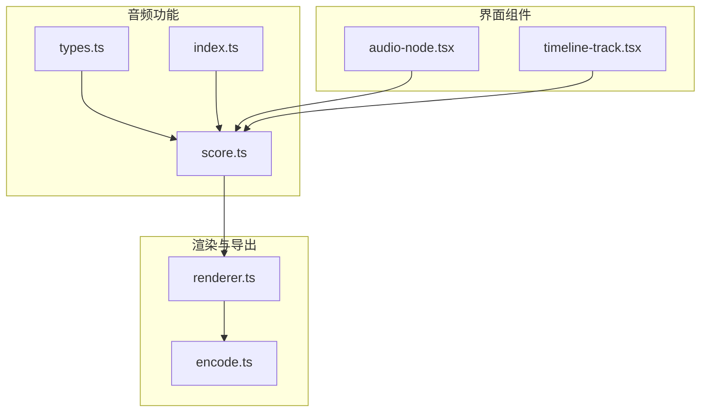
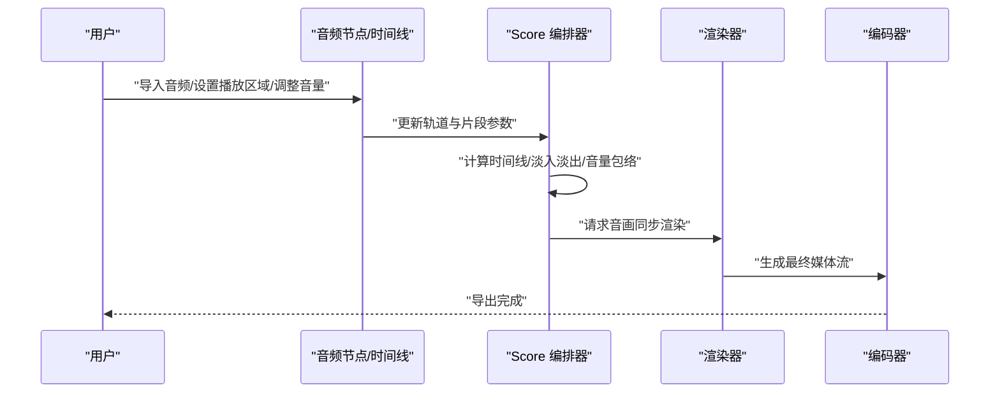
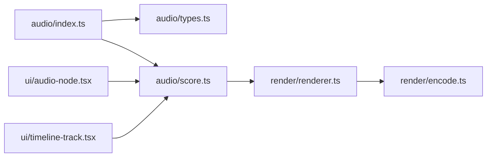

# 背景音乐

<cite>
**本文引用的文件**   
- [src/features/audio/score.ts](file://src/features/audio/score.ts)
- [src/features/audio/score.test.ts](file://src/features/audio/score.test.ts)
- [src/features/audio/types.ts](file://src/features/audio/types.ts)
- [src/features/audio/index.ts](file://src/features/audio/index.ts)
- [src/components/ui/node/audio-node.tsx](file://src/components/ui/node/audio-node.tsx)
- [src/components/ui/timeline-track.tsx](file://src/components/ui/timeline-track.tsx)
- [src/features/render/renderer.ts](file://src/features/render/renderer.ts)
- [src/features/render/encode.ts](file://src/features/render/encode.ts)
</cite>

## 目录
1. [简介](#简介)
2. [项目结构](#项目结构)
3. [核心组件](#核心组件)
4. [架构总览](#架构总览)
5. [详细组件分析](#详细组件分析)
6. [依赖分析](#依赖分析)
7. [性能考虑](#性能考虑)
8. [故障排查指南](#故障排查指南)
9. [结论](#结论)
10. [附录](#附录)

## 简介
本文件面向 CodeVideoCanvas 的“背景音乐”能力，聚焦 Score 模块的架构与实现，覆盖音乐轨道管理、时间线编排、淡入淡出与动态混音、导入与播放区域设置、音量自动化、与视频同步机制、节拍检测与智能剪辑等主题。文档同时提供创作工作流建议与性能优化策略，帮助创作者高效完成高质量背景音乐的编排与导出。

## 项目结构
Score 模块位于 features/audio 下，包含类型定义、核心编排逻辑与测试；UI 层在 components/ui 中提供音频节点与时间线轨道组件；渲染与导出链路通过 features/render 将音频与视频合成输出。

图表来源
- [src/features/audio/types.ts](file://src/features/audio/types.ts)
- [src/features/audio/score.ts](file://src/features/audio/score.ts)
- [src/features/audio/index.ts](file://src/features/audio/index.ts)
- [src/components/ui/node/audio-node.tsx](file://src/components/ui/node/audio-node.tsx)
- [src/components/ui/timeline-track.tsx](file://src/components/ui/timeline-track.tsx)
- [src/features/render/renderer.ts](file://src/features/render/renderer.ts)
- [src/features/render/encode.ts](file://src/features/render/encode.ts)

章节来源
- [src/features/audio/types.ts](file://src/features/audio/types.ts)
- [src/features/audio/score.ts](file://src/features/audio/score.ts)
- [src/features/audio/index.ts](file://src/features/audio/index.ts)
- [src/components/ui/node/audio-node.tsx](file://src/components/ui/node/audio-node.tsx)
- [src/components/ui/timeline-track.tsx](file://src/components/ui/timeline-track.tsx)
- [src/features/render/renderer.ts](file://src/features/render/renderer.ts)
- [src/features/render/encode.ts](file://src/features/render/encode.ts)

## 核心组件
- 类型与数据模型：集中定义音频片段、轨道、淡入淡出曲线、音量包络、循环区间、时间码等数据结构，确保前后端一致。
- 编排引擎（Score）：负责多轨音频的时间轴编排、交叉淡化、动态混音、循环与切点计算、与视频帧时间的对齐。
- UI 交互：音频节点用于导入与配置音频片段；时间线轨道用于可视化编辑播放区域、淡入淡出与音量自动化。
- 渲染与导出：将编排结果转换为可导出的音视频流，保证音画同步与质量。

章节来源
- [src/features/audio/types.ts](file://src/features/audio/types.ts)
- [src/features/audio/score.ts](file://src/features/audio/score.ts)
- [src/components/ui/node/audio-node.tsx](file://src/components/ui/node/audio-node.tsx)
- [src/components/ui/timeline-track.tsx](file://src/components/ui/timeline-track.tsx)
- [src/features/render/renderer.ts](file://src/features/render/renderer.ts)
- [src/features/render/encode.ts](file://src/features/render/encode.ts)

## 架构总览
Score 作为背景音乐的核心编排器，向上为 UI 暴露操作接口，向下驱动渲染管线进行音画合成。其关键职责包括：
- 轨道管理：创建、删除、排序、分组与可见性控制。
- 时间线编排：基于时间码对片段进行裁剪、拼接、循环与重叠处理。
- 效果链：淡入淡出、音量自动化、均衡与压缩（可选）。
- 动态混音：按采样级或分块混合多轨音频，避免削波并保持响度一致性。
- 同步机制：与视频帧率、时长严格对齐，支持变速场景下的重采样与相位连续性。

图表来源
- [src/features/audio/score.ts](file://src/features/audio/score.ts)
- [src/components/ui/node/audio-node.tsx](file://src/components/ui/node/audio-node.tsx)
- [src/components/ui/timeline-track.tsx](file://src/components/ui/timeline-track.tsx)
- [src/features/render/renderer.ts](file://src/features/render/renderer.ts)
- [src/features/render/encode.ts](file://src/features/render/encode.ts)

## 详细组件分析

### 类型与数据模型（types.ts）
- 音频片段：包含源资源标识、起止时间码、循环区间、音量、淡入淡出参数、效果链等。
- 轨道：包含轨道 ID、名称、可见性、静音、主音量、子轨道集合。
- 时间码与帧：统一时间单位与帧率换算，确保跨设备一致。
- 事件与状态：用于记录用户操作、回放状态与错误信息。

章节来源
- [src/features/audio/types.ts](file://src/features/audio/types.ts)

### 编排引擎（score.ts）
- 轨道管理
  - 新增/删除轨道、设置轨道顺序与可见性。
  - 批量操作与撤销/重做集成（由上层状态管理驱动）。
- 片段编排
  - 插入、移动、缩放片段边界，自动吸附到节拍或网格。
  - 循环播放：指定循环起点与终点，支持无缝衔接。
  - 重叠处理：当多个片段在同一时间段内时，依据优先级与混音策略合并。
- 淡入淡出与音量自动化
  - 线性或对数曲线淡入淡出，支持多点包络控制。
  - 音量自动化：以时间序列描述音量变化，渲染时插值生成平滑曲线。
- 动态混音
  - 多轨采样级混合，实时归一化防止削波。
  - 可选响度补偿与限幅，保障整体听感一致。
- 与视频同步
  - 根据视频帧率与时长，计算音频采样位置，必要时进行重采样。
  - 支持变速播放时的相位连续与瞬态保护。

章节来源
- [src/features/audio/score.ts](file://src/features/audio/score.ts)

### 单元测试（score.test.ts）
- 覆盖典型用例：片段插入与裁剪、循环区间生效、淡入淡出曲线正确性、多轨混音无削波、与视频时长对齐。
- 边界条件：空轨道、零时长片段、负增益、超大音量包络、极端循环长度。

章节来源
- [src/features/audio/score.test.ts](file://src/features/audio/score.test.ts)

### 音频节点（audio-node.tsx）
- 导入音频文件：支持常见格式，解析元数据（时长、采样率、声道数）。
- 基础参数：起始时间、结束时间、循环开关与区间、主音量。
- 效果面板：淡入淡出滑块、EQ/压缩（若启用）、音量自动化编辑器入口。
- 预览与校验：即时预览修改效果，提示冲突与不可行操作。

章节来源
- [src/components/ui/node/audio-node.tsx](file://src/components/ui/node/audio-node.tsx)

### 时间线轨道（timeline-track.tsx）
- 可视化编辑：拖拽片段、调整边界、选择循环区域。
- 节拍网格：显示节拍标记，辅助对齐与智能剪辑。
- 自动化曲线：在轨道上绘制并编辑音量包络与淡入淡出曲线。
- 多轨叠加：上下排列轨道，直观呈现重叠与混音关系。

章节来源
- [src/components/ui/timeline-track.tsx](file://src/components/ui/timeline-track.tsx)

### 渲染与导出（renderer.ts / encode.ts）
- 渲染器：读取编排结果，按帧生成音视频帧，保持音画同步。
- 编码器：将帧序列编码为容器格式，写入目标路径或流式输出。
- 质量控制：比特率、采样率、声道布局、响度标准化选项。

章节来源
- [src/features/render/renderer.ts](file://src/features/render/renderer.ts)
- [src/features/render/encode.ts](file://src/features/render/encode.ts)

## 依赖分析
- 内部依赖
  - audio/index.ts 聚合导出 types 与 score 核心 API，供 UI 与渲染层使用。
  - UI 组件依赖 score 提供的编排接口与类型，不直接访问底层音频解码。
  - 渲染器依赖 score 的输出结构，确保时间线与音频片段映射一致。
- 外部依赖
  - 浏览器/Node 音频 API 或第三方编解码库（由渲染与编码层封装）。
  - 文件系统与网络 I/O（导入与导出阶段）。

图表来源
- [src/features/audio/index.ts](file://src/features/audio/index.ts)
- [src/features/audio/types.ts](file://src/features/audio/types.ts)
- [src/features/audio/score.ts](file://src/features/audio/score.ts)
- [src/components/ui/node/audio-node.tsx](file://src/components/ui/node/audio-node.tsx)
- [src/components/ui/timeline-track.tsx](file://src/components/ui/timeline-track.tsx)
- [src/features/render/renderer.ts](file://src/features/render/renderer.ts)
- [src/features/render/encode.ts](file://src/features/render/encode.ts)

章节来源
- [src/features/audio/index.ts](file://src/features/audio/index.ts)
- [src/features/audio/types.ts](file://src/features/audio/types.ts)
- [src/features/audio/score.ts](file://src/features/audio/score.ts)
- [src/components/ui/node/audio-node.tsx](file://src/components/ui/node/audio-node.tsx)
- [src/components/ui/timeline-track.tsx](file://src/components/ui/timeline-track.tsx)
- [src/features/render/renderer.ts](file://src/features/render/renderer.ts)
- [src/features/render/encode.ts](file://src/features/render/encode.ts)

## 性能考虑
- 预加载与缓存
  - 导入后对音频数据进行内存或磁盘缓存，避免重复解码。
  - 对长音频采用分段加载与按需解码，降低首屏延迟。
- 渲染批处理
  - 将音频采样按固定大小分块处理，减少 GC 压力与上下文切换。
  - 使用增量更新，仅重算受影响的片段与轨道。
- 混音优化
  - 优先使用 SIMD 或原生加速的混音算法。
  - 动态限幅与响度控制在离线渲染阶段执行，避免实时瓶颈。
- 同步与重采样
  - 仅在必要时进行重采样，缓存重采样表以减少计算量。
  - 对变速场景采用相位 vocoder 或高质量重采样器，平衡音质与性能。
- UI 响应性
  - 自动化曲线与淡入淡出编辑采用虚拟列表与懒渲染。
  - 大工程下分页加载轨道与片段，提升交互流畅度。

[本节为通用指导，无需代码来源]

## 故障排查指南
- 导入失败
  - 检查文件格式与采样率是否受支持；确认文件大小与内存占用。
  - 查看导入日志中的错误码与堆栈，定位解码异常。
- 播放区域无效
  - 验证起止时间码是否越界；确认循环区间是否合法且小于片段时长。
  - 检查时间线网格与节拍设置是否与片段对齐。
- 音量自动化异常
  - 检查包络点数量与时间戳顺序；确认插值算法未产生负增益或溢出。
  - 对比预览与导出结果，定位是实时渲染还是离线编码问题。
- 削波与失真
  - 降低主音量或启用限幅；检查多轨叠加峰值是否超过阈值。
  - 在导出前进行响度标准化，确保平台一致性。
- 音画不同步
  - 核对视频帧率与音频采样率换算；确认重采样参数一致。
  - 检查变速场景下的相位连续性设置与缓冲策略。

章节来源
- [src/features/audio/score.test.ts](file://src/features/audio/score.test.ts)
- [src/features/render/renderer.ts](file://src/features/render/renderer.ts)
- [src/features/render/encode.ts](file://src/features/render/encode.ts)

## 结论
Score 模块为 CodeVideoCanvas 的背景音乐提供了完整的编排与混音能力，结合 UI 组件与渲染导出链路，实现了从导入、编辑到输出的全链路闭环。通过合理的性能优化与严格的同步机制，可在复杂工程中稳定产出高质量的音画作品。建议在实际项目中遵循本文的工作流与最佳实践，以获得更佳的用户体验与制作效率。

[本节为总结，无需代码来源]

## 附录

### 创作工作流建议
- 导入与准备
  - 选择合适的音频格式与采样率，尽量与视频一致以减少重采样。
  - 为每段背景音乐建立独立轨道，便于分层管理与混音。
- 时间线编排
  - 使用节拍网格对齐片段，确保节奏感与画面切换协调。
  - 合理设置循环区间，避免突兀的切点。
- 效果与自动化
  - 应用淡入淡出使段落过渡自然；使用音量自动化突出关键画面。
  - 适度使用 EQ 与压缩，提升清晰度与一致性。
- 同步与校验
  - 在关键时间点播放预览，检查音画同步与峰值电平。
  - 导出前进行响度标准化与限幅，确保多平台一致。
- 导出与交付
  - 根据发布渠道选择合适比特率与容器格式。
  - 保留工程文件以便后续迭代与版本管理。

[本节为概念性内容，无需代码来源]