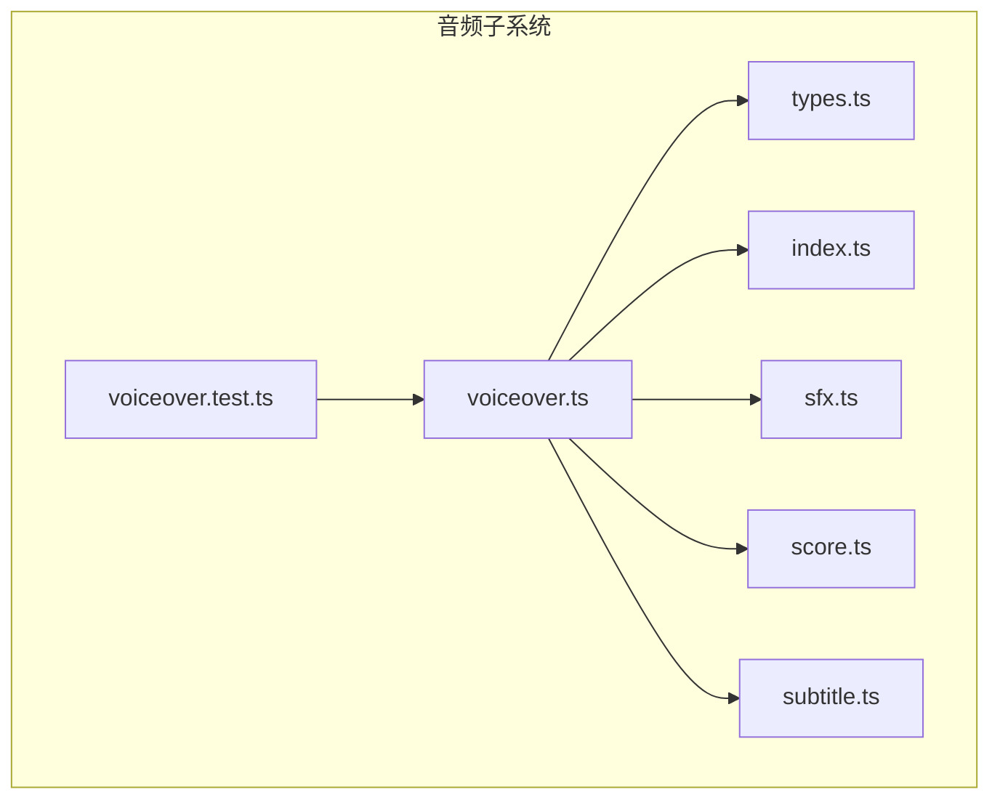
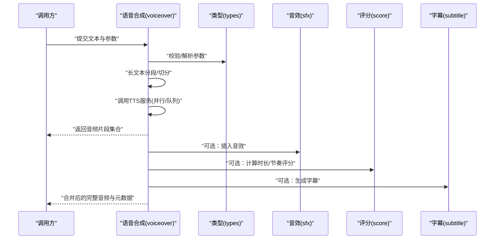
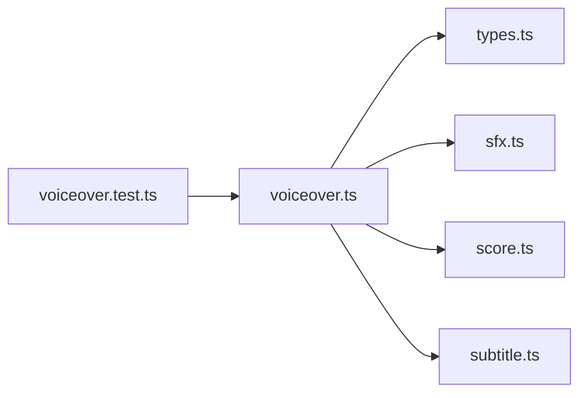

# 语音合成

<cite>
**本文引用的文件**   
- [voiceover.ts](file://src/features/audio/voiceover.ts)
- [voiceover.test.ts](file://src/features/audio/voiceover.test.ts)
- [types.ts](file://src/features/audio/types.ts)
- [index.ts](file://src/features/audio/index.ts)
- [sfx.ts](file://src/features/audio/sfx.ts)
- [score.ts](file://src/features/audio/score.ts)
- [subtitle.ts](file://src/features/audio/subtitle.ts)
</cite>

## 目录
1. [简介](#简介)
2. [项目结构](#项目结构)
3. [核心组件](#核心组件)
4. [架构总览](#架构总览)
5. [详细组件分析](#详细组件分析)
6. [依赖关系分析](#依赖关系分析)
7. [性能考虑](#性能考虑)
8. [故障排查指南](#故障排查指南)
9. [结论](#结论)
10. [附录](#附录)

## 简介
本文件为 CodeVideoCanvas 的“语音合成”能力提供系统化文档，聚焦 Voiceover 模块的实现原理与使用方式。内容涵盖：
- TTS（文本转语音）服务集成逻辑与调用流程
- 语音参数配置（语速、语调、音色等）
- 音频格式处理与播放控制
- 长文本分段策略与缓存机制
- 错误处理与最佳实践

## 项目结构
语音合成功能位于 features/audio 子系统中，围绕 voiceover 模块组织，并与音效、字幕、时间轴评分等模块协同工作。



图表来源
- [voiceover.ts](file://src/features/audio/voiceover.ts)
- [voiceover.test.ts](file://src/features/audio/voiceover.test.ts)
- [types.ts](file://src/features/audio/types.ts)
- [index.ts](file://src/features/audio/index.ts)
- [sfx.ts](file://src/features/audio/sfx.ts)
- [score.ts](file://src/features/audio/score.ts)
- [subtitle.ts](file://src/features/audio/subtitle.ts)

章节来源
- [voiceover.ts](file://src/features/audio/voiceover.ts)
- [voiceover.test.ts](file://src/features/audio/voiceover.test.ts)
- [types.ts](file://src/features/audio/types.ts)
- [index.ts](file://src/features/audio/index.ts)
- [sfx.ts](file://src/features/audio/sfx.ts)
- [score.ts](file://src/features/audio/score.ts)
- [subtitle.ts](file://src/features/audio/subtitle.ts)

## 核心组件
- 语音合成入口与编排：负责将文本转换为可播放的音频片段，并支持参数化配置与结果聚合。
- 类型定义：集中管理语音合成相关的输入输出模型、枚举与常量。
- 辅助模块：
  - 音效（SFX）：用于提示音或过渡效果，可与旁白组合。
  - 时间轴评分（Score）：用于评估旁白与画面节奏的匹配度。
  - 字幕（Subtitle）：用于生成与同步字幕轨道。

章节来源
- [voiceover.ts](file://src/features/audio/voiceover.ts)
- [types.ts](file://src/features/audio/types.ts)
- [index.ts](file://src/features/audio/index.ts)
- [sfx.ts](file://src/features/audio/sfx.ts)
- [score.ts](file://src/features/audio/score.ts)
- [subtitle.ts](file://src/features/audio/subtitle.ts)

## 架构总览
Voiceover 模块采用“配置驱动 + 流式处理”的设计思路：上层传入文本与参数，内部完成分句、TTS 请求、音频拼接与播放控制，同时暴露统一的 API 供渲染管线与导出流程消费。



图表来源
- [voiceover.ts](file://src/features/audio/voiceover.ts)
- [types.ts](file://src/features/audio/types.ts)
- [sfx.ts](file://src/features/audio/sfx.ts)
- [score.ts](file://src/features/audio/score.ts)
- [subtitle.ts](file://src/features/audio/subtitle.ts)

## 详细组件分析

### 语音合成（Voiceover）
- 职责
  - 接收文本与语音参数，执行分句与并发控制
  - 调用 TTS 服务获取音频片段
  - 对音频进行格式统一、音量归一化与拼接
  - 提供播放控制接口（开始、暂停、跳转、停止）
  - 暴露进度回调与错误事件
- 关键流程
  - 参数校验与默认值填充
  - 文本分段（按标点/长度阈值）
  - 并发调度（限制并发数，避免过载）
  - 音频缓冲与预加载
  - 播放状态机（空闲、准备中、播放中、暂停、结束、错误）
- 典型用法要点
  - 设置语速、音调、音色等参数
  - 指定目标采样率与编码格式
  - 监听进度与错误事件
  - 在长文本场景下启用分段与缓存

章节来源
- [voiceover.ts](file://src/features/audio/voiceover.ts)
- [voiceover.test.ts](file://src/features/audio/voiceover.test.ts)

#### 类图（代码级关系）
```mermaid
classDiagram
class Voiceover {
+ "初始化(参数)"
+ "合成(文本, 选项)"
+ "播放()"
+ "暂停()"
+ "恢复()"
+ "停止()"
+ "跳转(秒)"
+ "设置音量(比例)"
+ "订阅进度(回调)"
+ "订阅错误(回调)"
}
class Types {
<<module>>
"参数模型"
"结果模型"
"枚举与常量"
}
class SFX {
<<module>>
"插入音效"
}
class Score {
<<module>>
"时长/节奏评分"
}
class Subtitle {
<<module>>
"生成字幕"
}
Voiceover --> Types : "使用"
Voiceover --> SFX : "可选"
Voiceover --> Score : "可选"
Voiceover --> Subtitle : "可选"
```

图表来源
- [voiceover.ts](file://src/features/audio/voiceover.ts)
- [types.ts](file://src/features/audio/types.ts)
- [sfx.ts](file://src/features/audio/sfx.ts)
- [score.ts](file://src/features/audio/score.ts)
- [subtitle.ts](file://src/features/audio/subtitle.ts)

### 类型与配置（types）
- 作用
  - 统一定义语音合成的输入参数、输出结构与枚举项
  - 提供默认值与约束说明，便于上层稳定调用
- 常见字段类别
  - 文本与分段策略（最大长度、分割规则）
  - 语音参数（语速、音调、音色、语言）
  - 音频格式（采样率、位深、编码）
  - 播放控制（音量、静音、循环）
  - 结果对象（音频片段、时长、字幕、元数据）

章节来源
- [types.ts](file://src/features/audio/types.ts)

### 索引与导出（index）
- 作用
  - 对外暴露稳定的 API 入口
  - 聚合各子模块，简化上层导入路径
- 建议
  - 仅通过 index 访问功能，保持内部重构不影响外部

章节来源
- [index.ts](file://src/features/audio/index.ts)

### 音效（sfx）
- 作用
  - 提供短音效资源与插入逻辑
  - 与旁白混音时保证响度一致
- 使用建议
  - 在段落切换或强调处插入，避免干扰人声清晰度

章节来源
- [sfx.ts](file://src/features/audio/sfx.ts)

### 时间轴评分（score）
- 作用
  - 基于旁白时长与节奏，给出与画面匹配的评分
  - 辅助优化分段与停顿策略
- 使用建议
  - 在导出前运行评分，定位不协调段落

章节来源
- [score.ts](file://src/features/audio/score.ts)

### 字幕（subtitle）
- 作用
  - 根据旁白文本与时间戳生成字幕轨道
  - 与音频片段对齐，确保同步
- 使用建议
  - 结合分段策略，控制单条字幕长度与显示时长

章节来源
- [subtitle.ts](file://src/features/audio/subtitle.ts)

## 依赖关系分析
- 内聚性
  - Voiceover 作为核心编排器，依赖 types 提供契约，按需引入 sfx、score、subtitle 增强能力
- 耦合点
  - 与 TTS 服务的交互集中在 voiceover 内部，对外屏蔽实现细节
  - 与播放器/音频后端的交互通过统一接口抽象
- 潜在风险
  - 并发过高导致 TTS 限流或内存峰值
  - 长文本未合理分段造成首帧延迟
- 缓解策略
  - 限制并发与重试退避
  - 预取与缓存已合成片段
  - 渐进式拼接与流式播放



图表来源
- [voiceover.ts](file://src/features/audio/voiceover.ts)
- [voiceover.test.ts](file://src/features/audio/voiceover.test.ts)
- [types.ts](file://src/features/audio/types.ts)
- [sfx.ts](file://src/features/audio/sfx.ts)
- [score.ts](file://src/features/audio/score.ts)
- [subtitle.ts](file://src/features/audio/subtitle.ts)

章节来源
- [voiceover.ts](file://src/features/audio/voiceover.ts)
- [voiceover.test.ts](file://src/features/audio/voiceover.test.ts)
- [types.ts](file://src/features/audio/types.ts)
- [sfx.ts](file://src/features/audio/sfx.ts)
- [score.ts](file://src/features/audio/score.ts)
- [subtitle.ts](file://src/features/audio/subtitle.ts)

## 性能考虑
- 并发与限流
  - 控制 TTS 并发数，避免触发服务端限流
  - 失败重试采用指数退避与熔断保护
- 分段与预取
  - 按语义与长度阈值分段，优先预取下一段
  - 对热点片段做本地缓存，减少重复合成
- 音频处理
  - 统一采样率与编码，避免运行时重采样
  - 音量归一化与响度均衡，提升听感一致性
- 播放体验
  - 首字节延迟优化：边合成边播放
  - 大文件分段加载，降低内存占用

[本节为通用指导，无需源码引用]

## 故障排查指南
- 常见问题
  - 无声音或无声：检查音量、静音开关与音频后端权限
  - 卡顿或断断续续：确认网络稳定性与并发上限，检查缓存命中
  - 文本过长超时：调整分段策略与超时阈值
  - 音色/语速不生效：核对参数映射与 TTS 服务支持范围
- 定位步骤
  - 打开进度与错误回调日志，记录失败片段与原因
  - 对比不同分段粒度下的表现，定位瓶颈
  - 使用最小复现用例隔离问题（纯文本 vs 带音效/字幕）
- 恢复策略
  - 自动重试与降级（如回退到更低音质）
  - 用户可手动重试特定片段

章节来源
- [voiceover.test.ts](file://src/features/audio/voiceover.test.ts)

## 结论
Voiceover 模块以清晰的边界与可扩展的插件式能力，为 CodeVideoCanvas 提供了稳定高效的语音合成方案。通过合理的分段、并发控制与缓存策略，可在长文本与高并发场景下保持良好的首帧延迟与整体吞吐。配合音效、评分与字幕模块，可实现从文本到多轨音视频产出的完整链路。

[本节为总结性内容，无需源码引用]

## 附录

### 常用操作清单（概念性）
- 生成旁白
  - 准备文本与参数（语速、音调、音色、语言）
  - 调用合成接口，等待片段返回
  - 拼接并播放
- 调整音量
  - 设置全局音量或片段音量
  - 注意响度均衡，避免削波
- 控制播放进度
  - 支持开始、暂停、恢复、跳转与停止
  - 监听进度事件，更新 UI
- 错误处理
  - 捕获网络与服务端错误
  - 实现重试与降级策略
  - 向用户反馈友好提示

[本节为概念性指引，无需源码引用]