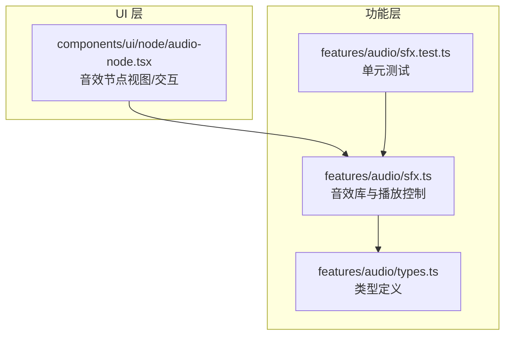
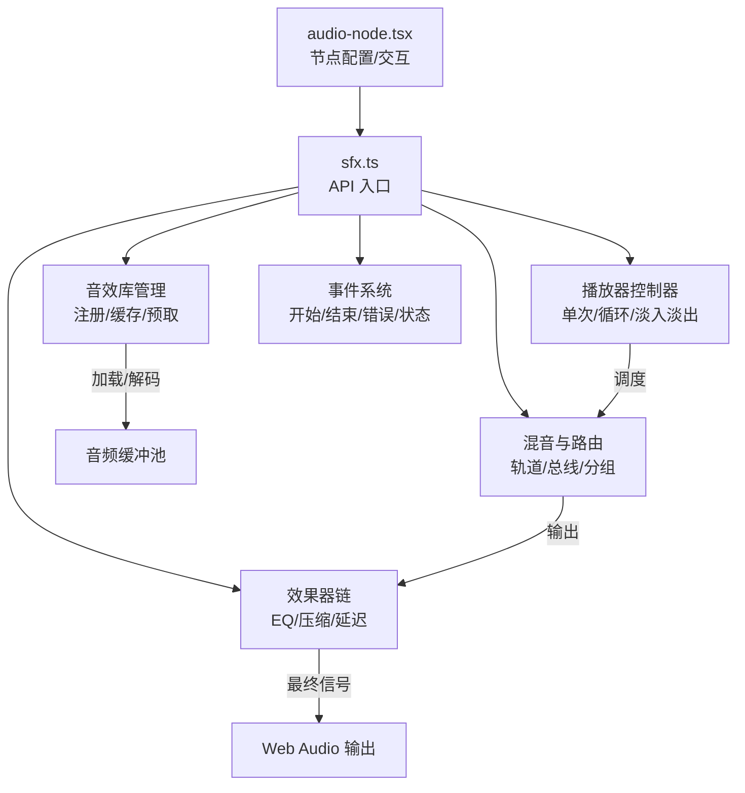
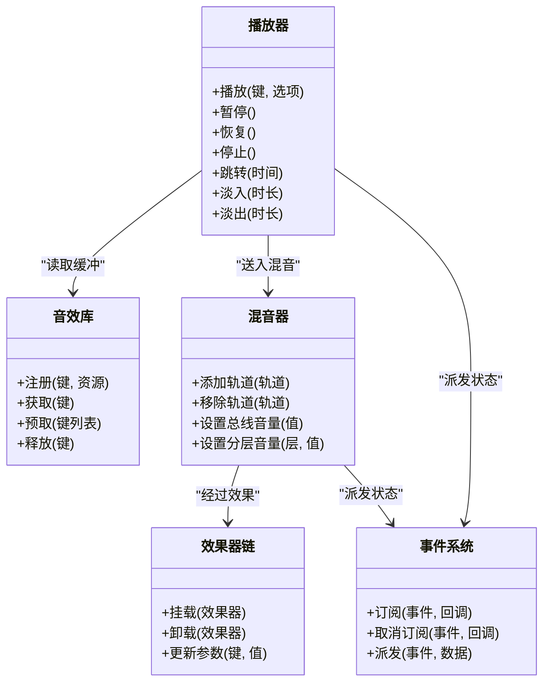
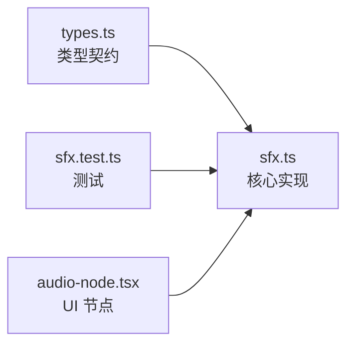

# 音效处理

<cite>
**本文引用的文件**   
- [src/features/audio/sfx.ts](file://src/features/audio/sfx.ts)
- [src/features/audio/sfx.test.ts](file://src/features/audio/sfx.test.ts)
- [src/features/audio/types.ts](file://src/features/audio/types.ts)
- [src/components/ui/node/audio-node.tsx](file://src/components/ui/node/audio-node.tsx)
</cite>

## 目录
1. [简介](#简介)
2. [项目结构](#项目结构)
3. [核心组件](#核心组件)
4. [架构总览](#架构总览)
5. [详细组件分析](#详细组件分析)
6. [依赖关系分析](#依赖关系分析)
7. [性能考虑](#性能考虑)
8. [故障排查指南](#故障排查指南)
9. [结论](#结论)
10. [附录](#附录)

## 简介
本文件面向 CodeVideoCanvas 的音效处理子系统（SFX），系统性阐述其设计模式与实现机制，覆盖音效库管理、实时播放控制、音量调节、效果器应用、资源加载、事件触发、音频混合与循环播放等关键能力。文档同时给出使用示例路径、缓冲策略、异步加载与内存优化建议，以及性能调优与兼容性注意事项，帮助开发者快速上手并稳定扩展该模块。

## 项目结构
与音效处理直接相关的代码位于 features/audio 与 components/ui/node 两个层次：
- features/audio：封装 SFX 核心逻辑、类型定义与测试用例
- components/ui/node：提供可视化节点，用于在画布中编排和驱动音效

图表来源
- [src/features/audio/sfx.ts](file://src/features/audio/sfx.ts)
- [src/features/audio/types.ts](file://src/features/audio/types.ts)
- [src/features/audio/sfx.test.ts](file://src/features/audio/sfx.test.ts)
- [src/components/ui/node/audio-node.tsx](file://src/components/ui/node/audio-node.tsx)

章节来源
- [src/features/audio/sfx.ts](file://src/features/audio/sfx.ts)
- [src/features/audio/types.ts](file://src/features/audio/types.ts)
- [src/features/audio/sfx.test.ts](file://src/features/audio/sfx.test.ts)
- [src/components/ui/node/audio-node.tsx](file://src/components/ui/node/audio-node.tsx)

## 核心组件
- 音效库管理器：负责音效资源的注册、缓存、预取与生命周期管理，提供按标识查找与批量操作能力
- 播放器控制器：封装单次播放、重复播放、淡入淡出、暂停/恢复、停止与进度控制
- 混音与路由：将多个音轨输出到同一上下文，支持分轨、分组与总线级控制
- 效果器链：对指定轨道或总线挂载效果器（如均衡、压缩、延迟等）
- 事件系统：统一派发播放开始、结束、错误、状态变更等事件，供 UI 与业务订阅

章节来源
- [src/features/audio/sfx.ts](file://src/features/audio/sfx.ts)
- [src/features/audio/types.ts](file://src/features/audio/types.ts)

## 架构总览
SFX 采用“资源-播放-混音-效果”的分层架构，通过类型契约解耦各层职责，并通过事件总线进行跨层通信。UI 层通过节点配置驱动播放行为，底层则基于浏览器音频 API 完成解码、缓冲与渲染。

图表来源
- [src/features/audio/sfx.ts](file://src/features/audio/sfx.ts)
- [src/components/ui/node/audio-node.tsx](file://src/components/ui/node/audio-node.tsx)

## 详细组件分析

### 音效库管理
- 资源注册：以唯一键为索引，关联资源地址与元数据（时长、格式、标签等）
- 缓存策略：已解码的 AudioBuffer 进入缓冲池；未命中时发起异步加载与解码
- 预取机制：根据场景切换或热点预测提前拉取资源，降低首帧延迟
- 生命周期：提供显式释放接口，避免长期驻留导致内存增长

章节来源
- [src/features/audio/sfx.ts](file://src/features/audio/sfx.ts)
- [src/features/audio/types.ts](file://src/features/audio/types.ts)

### 播放器控制器
- 播放模式：单次、循环、条件循环（按次数或时间）
- 动态控制：播放/暂停/恢复、停止、跳转至任意时间点
- 包络控制：淡入淡出曲线可配置，支持多段包络
- 优先级与抢占：高优先级音源可打断低优先级播放，避免声部冲突

章节来源
- [src/features/audio/sfx.ts](file://src/features/audio/sfx.ts)

### 音量与静音
- 全局音量：总线级增益控制，影响所有输出
- 分层音量：按层级（点击、环境、过渡、控制）独立控制，便于 UI 设置联动
- 瞬时静音：支持短时静音（如对话插入）后自动恢复

章节来源
- [src/features/audio/sfx.ts](file://src/features/audio/sfx.ts)

### 效果器应用
- 挂载点：可在单轨、分组或总线挂载效果器
- 链式处理：支持串联多个效果器，顺序可配置
- 参数热更新：运行时调整效果器参数，无需重建图

章节来源
- [src/features/audio/sfx.ts](file://src/features/audio/sfx.ts)

### 事件系统与回调
- 事件类型：播放开始、播放结束、错误、状态变更、进度更新
- 订阅模型：支持一次性与持久订阅，便于 UI 同步与日志上报
- 错误传播：网络/解码异常统一上抛，附带上下文信息

章节来源
- [src/features/audio/sfx.ts](file://src/features/audio/sfx.ts)

### 资源加载与异步策略
- 异步加载：按需请求、并发上限控制、失败重试与退避
- 解码优化：优先选择浏览器原生支持的编码格式，必要时降级
- 断网容错：离线时返回占位静音或提示，不阻塞主流程

章节来源
- [src/features/audio/sfx.ts](file://src/features/audio/sfx.ts)

### 音频混合与循环播放
- 混合策略：多轨并行合成，支持软限制峰值，避免削波
- 循环播放：精确循环点，无缝衔接；支持按节拍对齐
- 交叉淡化：场景切换时两轨交叉淡入淡出，平滑过渡

章节来源
- [src/features/audio/sfx.ts](file://src/features/audio/sfx.ts)

### 使用示例（路径指引）
- 播放点击音效：参考测试用例中的点击音效触发路径
  - [src/features/audio/sfx.test.ts](file://src/features/audio/sfx.test.ts)
- 播放环境音：参考环境音持续播放与淡入淡出路径
  - [src/features/audio/sfx.test.ts](file://src/features/audio/sfx.test.ts)
- 播放过渡音效：参考场景切换时的过渡音效路径
  - [src/features/audio/sfx.test.ts](file://src/features/audio/sfx.test.ts)
- 控制音效层级：参考分层音量控制与 UI 联动路径
  - [src/components/ui/node/audio-node.tsx](file://src/components/ui/node/audio-node.tsx)
  - [src/features/audio/sfx.ts](file://src/features/audio/sfx.ts)

章节来源
- [src/features/audio/sfx.test.ts](file://src/features/audio/sfx.test.ts)
- [src/components/ui/node/audio-node.tsx](file://src/components/ui/node/audio-node.tsx)
- [src/features/audio/sfx.ts](file://src/features/audio/sfx.ts)

### 类与关系图（概念映射）
以下类图为概念性映射，展示各组件的职责与协作关系，便于理解整体结构。

[此图为概念示意，不对应具体源码结构]

## 依赖关系分析
- 内聚性：SFX 模块内部按职责拆分，耦合度低，易于替换与扩展
- 外部依赖：主要依赖浏览器 Web Audio API；UI 层通过节点配置驱动
- 潜在环依赖：通过事件系统与类型契约解耦，避免循环引用

图表来源
- [src/features/audio/types.ts](file://src/features/audio/types.ts)
- [src/features/audio/sfx.ts](file://src/features/audio/sfx.ts)
- [src/features/audio/sfx.test.ts](file://src/features/audio/sfx.test.ts)
- [src/components/ui/node/audio-node.tsx](file://src/components/ui/node/audio-node.tsx)

章节来源
- [src/features/audio/types.ts](file://src/features/audio/types.ts)
- [src/features/audio/sfx.ts](file://src/features/audio/sfx.ts)
- [src/features/audio/sfx.test.ts](file://src/features/audio/sfx.test.ts)
- [src/components/ui/node/audio-node.tsx](file://src/components/ui/node/audio-node.tsx)

## 性能考虑
- 缓冲策略
  - 预取热点资源，减少首次播放延迟
  - 合理设置并发上限，避免带宽抖动
  - 对长音频采用流式分段缓冲，降低峰值内存
- 解码与格式
  - 优先使用浏览器原生高效格式（如 Ogg/Opus、AAC）
  - 服务端转码提供多格式回退清单
- 渲染与 CPU
  - 合并多次参数更新为批处理
  - 避免在主线程执行重型计算，必要时使用 OffscreenAudioContext（若可用）
- 内存优化
  - 及时释放不再使用的缓冲
  - 对循环环境音采用共享实例与复用节点
- 兼容性与降级
  - 检测 Web Audio API 可用性
  - 在无头或受限环境中回退为静默播放或提示

[本节为通用指导，不涉及具体文件分析]

## 故障排查指南
- 常见问题
  - 无法播放：检查用户手势授权与浏览器安全策略
  - 爆音/削波：检查总线峰值与限幅器参数
  - 卡顿/延迟：检查并发加载与解码队列长度
  - 内存泄漏：确认释放接口调用与节点回收
- 定位方法
  - 订阅事件系统，记录开始/结束/错误事件
  - 打印混音器与效果器链状态快照
  - 对比不同设备与浏览器的表现差异
- 修复建议
  - 增加超时与重试策略
  - 引入节流与去抖，避免频繁参数更新
  - 对异常路径补充兜底与降级逻辑

章节来源
- [src/features/audio/sfx.ts](file://src/features/audio/sfx.ts)
- [src/features/audio/sfx.test.ts](file://src/features/audio/sfx.test.ts)

## 结论
SFX 模块通过清晰的职责划分与类型契约，实现了可扩展、高性能且易用的音效处理能力。借助分层音量、效果器链与事件系统，既能满足复杂场景需求，又能在 UI 层获得良好体验。遵循本文的性能与兼容性建议，可进一步提升稳定性与用户体验。

## 附录
- 术语
  - 轨道：单个音源的独立通道
  - 总线：汇总多条轨道的输出通道
  - 效果器：对音频信号进行处理的功能单元
- 最佳实践
  - 明确分层命名与默认音量
  - 为关键路径编写测试用例
  - 定期评估资源体积与格式策略

[本节为概念性内容，不涉及具体文件分析]