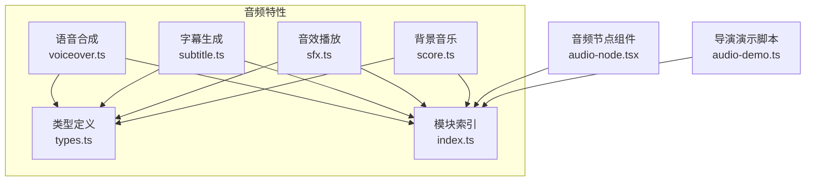
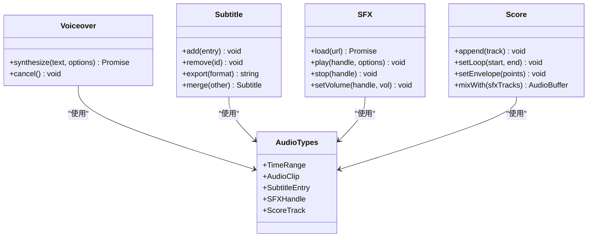
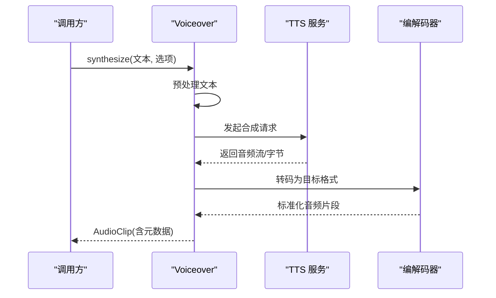
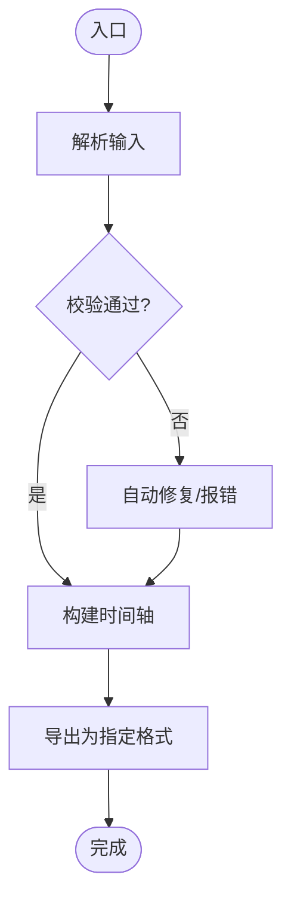
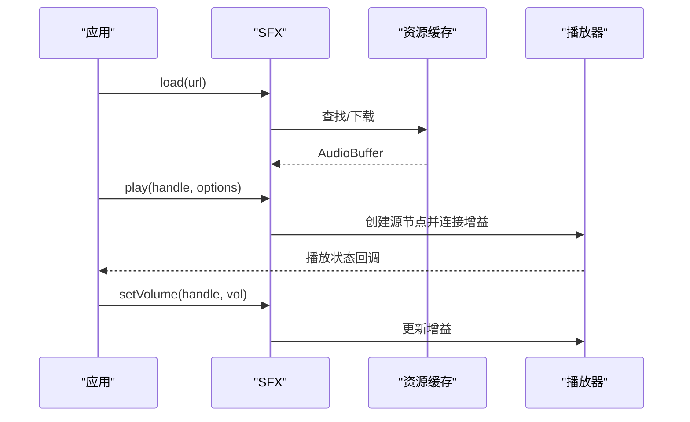
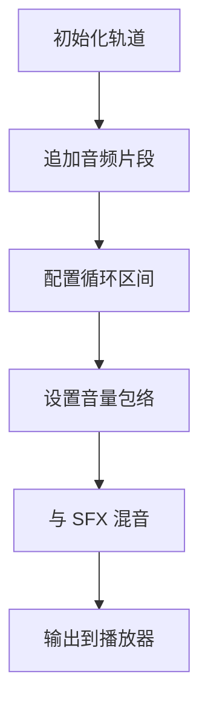
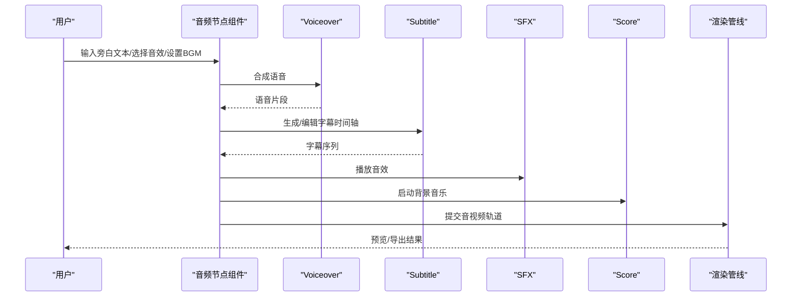
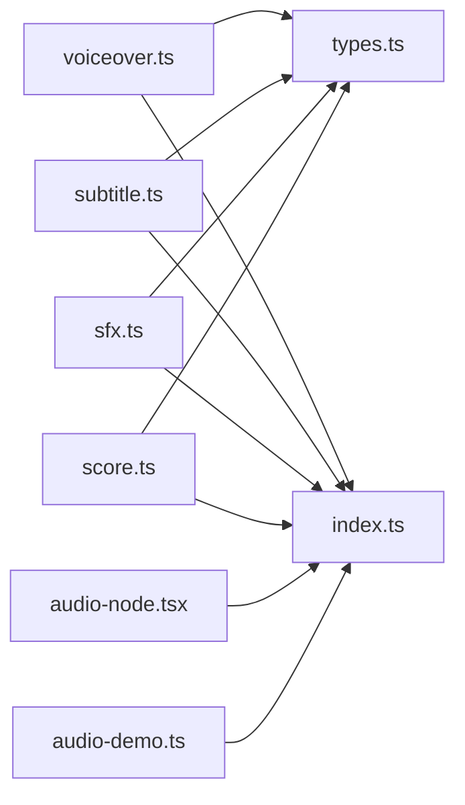

# 音频处理

<cite>
**本文引用的文件**   
- [src/features/audio/index.ts](file://src/features/audio/index.ts)
- [src/features/audio/types.ts](file://src/features/audio/types.ts)
- [src/features/audio/voiceover.ts](file://src/features/audio/voiceover.ts)
- [src/features/audio/subtitle.ts](file://src/features/audio/subtitle.ts)
- [src/features/audio/sfx.ts](file://src/features/audio/sfx.ts)
- [src/features/audio/score.ts](file://src/features/audio/score.ts)
- [src/components/ui/node/audio-node.tsx](file://src/components/ui/node/audio-node.tsx)
- [src/features/director/audio-demo.ts](file://src/features/director/audio-demo.ts)
</cite>

## 目录
1. [简介](#简介)
2. [项目结构](#项目结构)
3. [核心组件](#核心组件)
4. [架构总览](#架构总览)
5. [详细组件分析](#详细组件分析)
6. [依赖关系分析](#依赖关系分析)
7. [性能考虑](#性能考虑)
8. [故障排除指南](#故障排除指南)
9. [结论](#结论)
10. [附录](#附录)

## 简介
本文件为 CodeVideoCanvas 的音频处理子系统提供系统化文档，覆盖语音合成（Voiceover）、字幕生成（Subtitle）、音效播放（SFX）与背景音乐（Score）四大模块。内容涵盖：
- TTS 集成逻辑、字幕时间轴管理、音效播放控制、背景音乐混音策略
- 音频同步机制、格式转换、内存管理与性能优化
- 使用示例路径与最佳实践、常见问题排查

## 项目结构
音频功能集中在 features/audio 目录下，按职责拆分为四个子模块，并通过统一的类型定义与索引进行组织。UI 层通过 audio-node 组件暴露可视化节点能力；director 模块提供演示脚本以串联各模块。

图表来源
- [src/features/audio/index.ts](file://src/features/audio/index.ts)
- [src/features/audio/types.ts](file://src/features/audio/types.ts)
- [src/features/audio/voiceover.ts](file://src/features/audio/voiceover.ts)
- [src/features/audio/subtitle.ts](file://src/features/audio/subtitle.ts)
- [src/features/audio/sfx.ts](file://src/features/audio/sfx.ts)
- [src/features/audio/score.ts](file://src/features/audio/score.ts)
- [src/components/ui/node/audio-node.tsx](file://src/components/ui/node/audio-node.tsx)
- [src/features/director/audio-demo.ts](file://src/features/director/audio-demo.ts)

章节来源
- [src/features/audio/index.ts](file://src/features/audio/index.ts)
- [src/features/audio/types.ts](file://src/features/audio/types.ts)

## 核心组件
- Voiceover（语音合成）
  - 负责将文本转换为音频流或文件，支持多语言、音色选择、语速与音量参数化
  - 输出标准化 PCM/WAV 片段，便于后续与视频帧对齐
- Subtitle（字幕）
  - 维护时间轴条目（开始/结束/文本），支持导入导出（如 SRT/VTT）
  - 提供时间轴合并、去重、重叠修复等工具方法
- SFX（音效）
  - 管理短音效的加载、缓存、播放、停止与淡入淡出
  - 支持多轨叠加与优先级控制
- Score（背景音乐）
  - 管理长音频轨道的循环、交叉淡入淡出、音量包络与静音段插入
  - 与时间轴驱动，确保与画面节奏一致

章节来源
- [src/features/audio/voiceover.ts](file://src/features/audio/voiceover.ts)
- [src/features/audio/subtitle.ts](file://src/features/audio/subtitle.ts)
- [src/features/audio/sfx.ts](file://src/features/audio/sfx.ts)
- [src/features/audio/score.ts](file://src/features/audio/score.ts)

## 架构总览
音频子系统采用“模块解耦 + 统一类型”的设计：
- 各模块对外暴露最小 API，内部实现可替换（例如 TTS 提供商、字幕格式解析器）
- 所有模块共享 types.ts 中的数据结构，保证数据一致性
- UI 层通过 audio-node 组件调用索引聚合的接口，简化上层集成

图表来源
- [src/features/audio/types.ts](file://src/features/audio/types.ts)
- [src/features/audio/voiceover.ts](file://src/features/audio/voiceover.ts)
- [src/features/audio/subtitle.ts](file://src/features/audio/subtitle.ts)
- [src/features/audio/sfx.ts](file://src/features/audio/sfx.ts)
- [src/features/audio/score.ts](file://src/features/audio/score.ts)

## 详细组件分析

### Voiceover 模块（语音合成）
- 设计要点
  - 输入：文本、语言、音色、语速、音量、采样率等
  - 输出：标准化音频片段（PCM/WAV），附带时长与时间戳
  - 错误处理：网络异常、配额限制、文本过长截断策略
- 关键流程
  - 文本预处理（分句、标点清理）
  - 调用 TTS 服务（异步请求）
  - 解码与格式转换（目标采样率、位深）
  - 返回 AudioClip 供后续混音或渲染

图表来源
- [src/features/audio/voiceover.ts](file://src/features/audio/voiceover.ts)

章节来源
- [src/features/audio/voiceover.ts](file://src/features/audio/voiceover.ts)

### Subtitle 模块（字幕时间轴）
- 设计要点
  - 时间轴条目包含 id、start、end、text
  - 支持导入/导出多种格式（SRT/VTT）
  - 提供时间轴校验（重叠、越界、空行）与自动修复
- 关键流程
  - 解析输入（字符串/对象数组）
  - 构建时间轴并排序
  - 导出时序列化指定格式

图表来源
- [src/features/audio/subtitle.ts](file://src/features/audio/subtitle.ts)

章节来源
- [src/features/audio/subtitle.ts](file://src/features/audio/subtitle.ts)

### SFX 模块（音效播放控制）
- 设计要点
  - 资源加载与缓存（URL -> AudioBuffer）
  - 播放控制：播放、暂停、停止、淡入淡出
  - 音量与优先级：支持多轨叠加与动态调整
- 关键流程
  - 预加载常用音效
  - 播放时创建源节点，连接增益节点
  - 事件回调更新状态与 UI

图表来源
- [src/features/audio/sfx.ts](file://src/features/audio/sfx.ts)

章节来源
- [src/features/audio/sfx.ts](file://src/features/audio/sfx.ts)

### Score 模块（背景音乐处理）
- 设计要点
  - 长音频轨道管理：追加、循环区间设置、交叉淡入淡出
  - 音量包络：随时间变化的音量曲线
  - 混音：与 SFX 轨道混合输出
- 关键流程
  - 读取背景音频，分段缓冲
  - 根据时间轴触发循环与淡入淡出
  - 与 SFX 轨道混合后输出

图表来源
- [src/features/audio/score.ts](file://src/features/audio/score.ts)

章节来源
- [src/features/audio/score.ts](file://src/features/audio/score.ts)

### 概念总览
下图展示从文本到最终音视频输出的整体流程，包括 TTS、字幕、音效与背景音乐的协同工作。

[此图为概念性流程图，不直接映射具体源码文件]

## 依赖关系分析
- 模块内聚与耦合
  - 各音频模块独立，仅通过 types.ts 共享数据结构
  - index.ts 作为聚合入口，降低上层调用复杂度
- 外部依赖
  - TTS 服务（可插拔）
  - 音频编解码库（用于格式转换）
  - Web Audio API（浏览器环境播放与混音）

图表来源
- [src/features/audio/index.ts](file://src/features/audio/index.ts)
- [src/features/audio/types.ts](file://src/features/audio/types.ts)
- [src/features/audio/voiceover.ts](file://src/features/audio/voiceover.ts)
- [src/features/audio/subtitle.ts](file://src/features/audio/subtitle.ts)
- [src/features/audio/sfx.ts](file://src/features/audio/sfx.ts)
- [src/features/audio/score.ts](file://src/features/audio/score.ts)
- [src/components/ui/node/audio-node.tsx](file://src/components/ui/node/audio-node.tsx)
- [src/features/director/audio-demo.ts](file://src/features/director/audio-demo.ts)

章节来源
- [src/features/audio/index.ts](file://src/features/audio/index.ts)
- [src/features/audio/types.ts](file://src/features/audio/types.ts)

## 性能考虑
- 音频同步机制
  - 基于时间轴的帧级对齐，避免漂移
  - 使用高精度时钟（performance.now）驱动播放进度
- 格式转换处理
  - 统一采样率与位深，减少运行时转换开销
  - 批量解码与缓存热点资源
- 内存管理
  - 及时释放不再使用的 AudioBuffer
  - 限制并发解码任务数，避免主线程阻塞
- 性能优化策略
  - 预加载常用音效与 BGM 片段
  - 使用 OffscreenAudioContext（若可用）降低卡顿
  - 对长音频进行分块加载与按需解码

[本节为通用指导，不直接分析具体文件]

## 故障排除指南
- 语音合成失败
  - 检查网络与配额，捕获超时与限流错误
  - 验证文本长度与字符集，必要时分句重试
- 字幕时间轴异常
  - 检测重叠与越界，启用自动修复或提示用户修正
  - 导出前执行完整性校验
- 音效播放问题
  - 确认资源 URL 可达且格式受支持
  - 检查权限（自动播放策略）与上下文恢复
- 背景音乐不同步
  - 校准循环区间与包络点
  - 监控播放进度与丢帧情况，必要时降级采样率

章节来源
- [src/features/audio/voiceover.ts](file://src/features/audio/voiceover.ts)
- [src/features/audio/subtitle.ts](file://src/features/audio/subtitle.ts)
- [src/features/audio/sfx.ts](file://src/features/audio/sfx.ts)
- [src/features/audio/score.ts](file://src/features/audio/score.ts)

## 结论
CodeVideoCanvas 的音频处理子系统通过清晰的模块划分与统一类型定义，实现了可扩展、高性能的语音合成、字幕管理、音效播放与背景音乐混音能力。遵循本文的最佳实践与排障建议，可在复杂项目中稳定地集成与扩展音频功能。

[本节为总结性内容，不直接分析具体文件]

## 附录
- 使用示例路径（不含代码内容）
  - 添加语音旁白：参考 voiceover 模块的合成入口与选项配置
  - 生成字幕文件：参考 subtitle 模块的导入/导出与时间轴操作
  - 播放音效与控制音量：参考 sfx 模块的加载、播放与增益控制
  - 控制背景音乐：参考 score 模块的轨道追加、循环与包络设置
- 相关演示
  - 导演模块中的音频演示脚本展示了如何串联各模块完成端到端流程

章节来源
- [src/features/audio/voiceover.ts](file://src/features/audio/voiceover.ts)
- [src/features/audio/subtitle.ts](file://src/features/audio/subtitle.ts)
- [src/features/audio/sfx.ts](file://src/features/audio/sfx.ts)
- [src/features/audio/score.ts](file://src/features/audio/score.ts)
- [src/features/director/audio-demo.ts](file://src/features/director/audio-demo.ts)