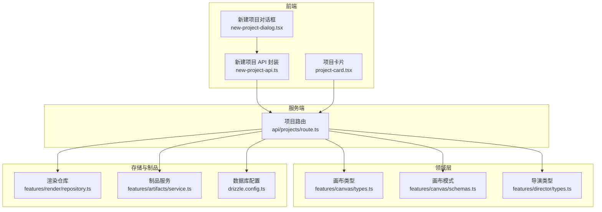
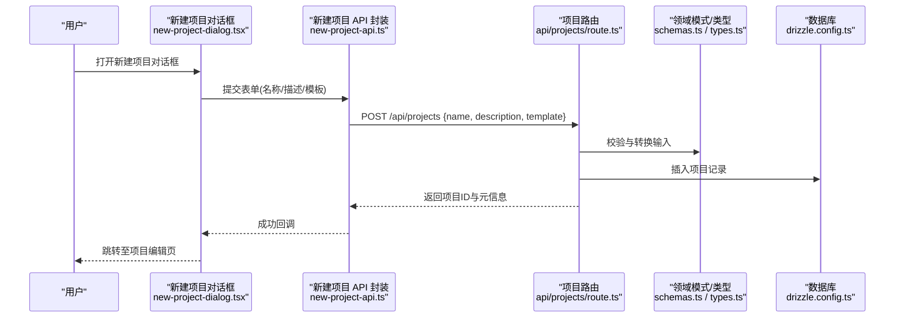
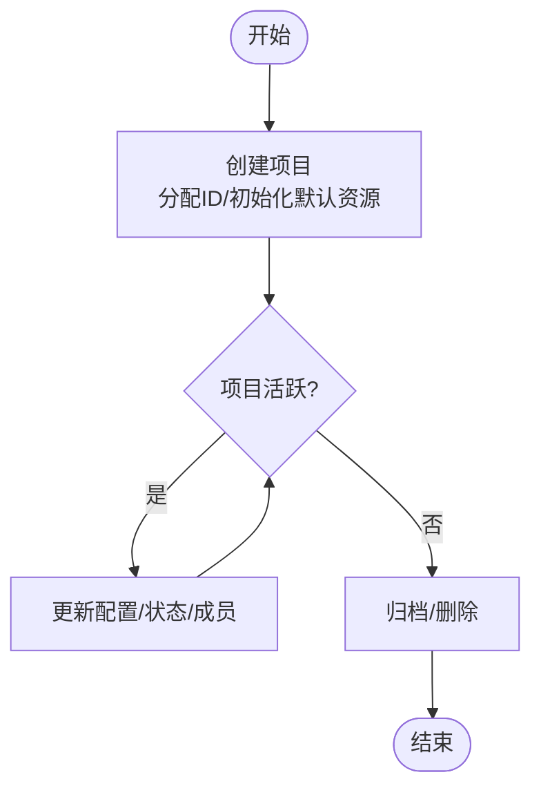
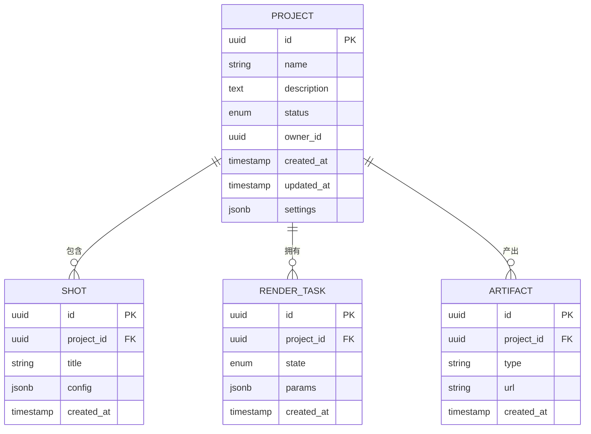
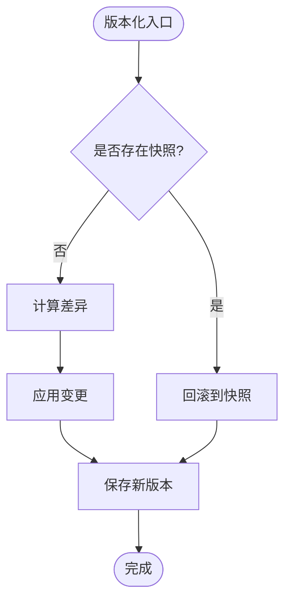
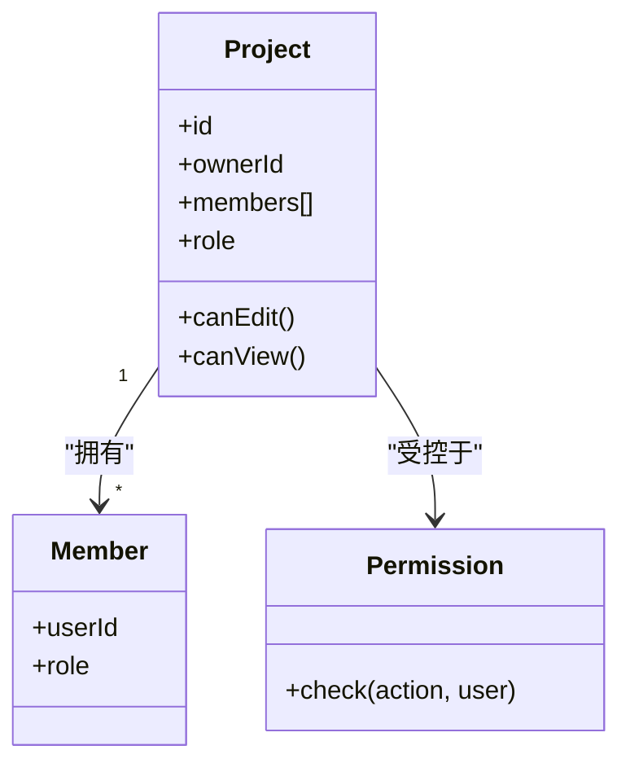
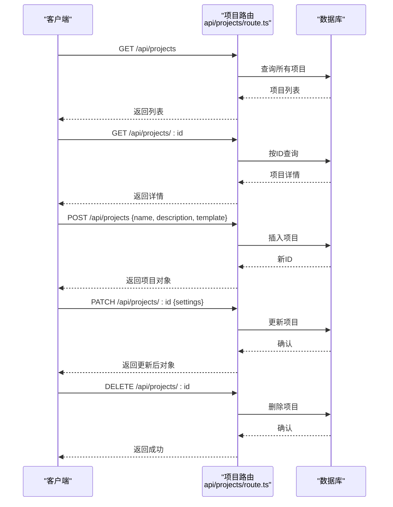
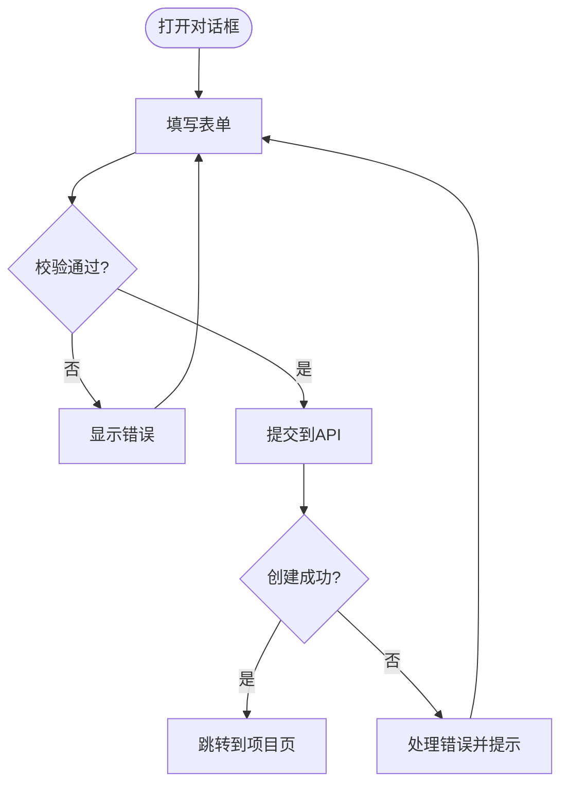
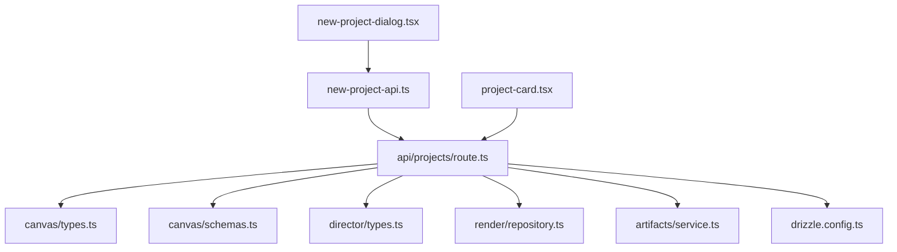

# 项目管理

<cite>
**本文引用的文件**   
- [src/app/api/projects/route.ts](file://src/app/api/projects/route.ts)
- [src/app/api/projects/route.test.ts](file://src/app/api/projects/route.test.ts)
- [src/app/_components/new-project-dialog.tsx](file://src/app/_components/new-project-dialog.tsx)
- [src/app/_components/new-project-api.ts](file://src/app/_components/new-project-api.ts)
- [src/app/_components/new-project-dialog.test.ts](file://src/app/_components/new-project-dialog.test.ts)
- [src/components/ui/project-card.tsx](file://src/components/ui/project-card.tsx)
- [src/features/canvas/types.ts](file://src/features/canvas/types.ts)
- [src/features/canvas/schemas.ts](file://src/features/canvas/schemas.ts)
- [src/features/director/types.ts](file://src/features/director/types.ts)
- [src/features/render/repository.ts](file://src/features/render/repository.ts)
- [src/features/artifacts/service.ts](file://src/features/artifacts/service.ts)
- [drizzle.config.ts](file://drizzle.config.ts)
</cite>

## 目录
1. [简介](#简介)
2. [项目结构](#项目结构)
3. [核心组件](#核心组件)
4. [架构总览](#架构总览)
5. [详细组件分析](#详细组件分析)
6. [依赖关系分析](#依赖关系分析)
7. [性能考虑](#性能考虑)
8. [故障排查指南](#故障排查指南)
9. [结论](#结论)
10. [附录](#附录)

## 简介
本文件聚焦 CodeVideoCanvas 的项目管理功能，围绕以下目标展开：
- 项目生命周期管理：从创建、初始化到归档/删除的完整流程。
- 数据结构设计：项目模型、配置与关联资源（镜头、渲染产物、素材等）的关系。
- 版本控制机制：基于时间戳或快照的版本化策略与回滚思路。
- 协作能力：多用户访问、权限控制与并发安全建议。
- API 接口：项目的 CRUD 操作定义与调用方式。
- 新项目创建对话框：表单校验、模板选择、后端交互与错误处理。
- 状态管理与权限控制：前端状态同步与后端鉴权策略。
- 导入导出与备份恢复：数据迁移、导出格式与恢复流程。
- 最佳实践与常见问题：落地建议与排障清单。

## 项目结构
项目管理相关代码主要分布在以下位置：
- 服务端 API：src/app/api/projects/route.ts
- 前端新建项目对话框与 API 封装：src/app/_components/new-project-dialog.tsx、src/app/_components/new-project-api.ts
- 项目卡片展示：src/components/ui/project-card.tsx
- 领域类型与模式：src/features/canvas/types.ts、src/features/canvas/schemas.ts、src/features/director/types.ts
- 渲染仓库与制品服务：src/features/render/repository.ts、src/features/artifacts/service.ts
- 数据库配置：drizzle.config.ts

图示来源
- [src/app/_components/new-project-dialog.tsx](file://src/app/_components/new-project-dialog.tsx)
- [src/app/_components/new-project-api.ts](file://src/app/_components/new-project-api.ts)
- [src/app/api/projects/route.ts](file://src/app/api/projects/route.ts)
- [src/components/ui/project-card.tsx](file://src/components/ui/project-card.tsx)
- [src/features/canvas/types.ts](file://src/features/canvas/types.ts)
- [src/features/canvas/schemas.ts](file://src/features/canvas/schemas.ts)
- [src/features/director/types.ts](file://src/features/director/types.ts)
- [src/features/render/repository.ts](file://src/features/render/repository.ts)
- [src/features/artifacts/service.ts](file://src/features/artifacts/service.ts)
- [drizzle.config.ts](file://drizzle.config.ts)

章节来源
- [src/app/api/projects/route.ts](file://src/app/api/projects/route.ts)
- [src/app/_components/new-project-dialog.tsx](file://src/app/_components/new-project-dialog.tsx)
- [src/app/_components/new-project-api.ts](file://src/app/_components/new-project-api.ts)
- [src/components/ui/project-card.tsx](file://src/components/ui/project-card.tsx)
- [src/features/canvas/types.ts](file://src/features/canvas/types.ts)
- [src/features/canvas/schemas.ts](file://src/features/canvas/schemas.ts)
- [src/features/director/types.ts](file://src/features/director/types.ts)
- [src/features/render/repository.ts](file://src/features/render/repository.ts)
- [src/features/artifacts/service.ts](file://src/features/artifacts/service.ts)
- [drizzle.config.ts](file://drizzle.config.ts)

## 核心组件
- 新建项目对话框：负责收集用户输入、模板选择、表单校验、调用新建项目 API，并反馈成功/失败状态。
- 新建项目 API 封装：统一请求构造、错误处理、重试与加载态管理。
- 项目卡片：展示项目概览信息，提供进入项目、删除、复制等快捷操作入口。
- 项目路由：实现项目列表获取、单个项目详情、创建、更新、删除等 RESTful 接口。
- 领域类型与模式：定义项目、镜头、渲染任务、制品等核心实体及其约束。
- 渲染仓库与制品服务：提供渲染产物与素材的持久化与检索能力。
- 数据库配置：定义 ORM 映射与连接参数，支撑项目数据的持久化。

章节来源
- [src/app/_components/new-project-dialog.tsx](file://src/app/_components/new-project-dialog.tsx)
- [src/app/_components/new-project-api.ts](file://src/app/_components/new-project-api.ts)
- [src/components/ui/project-card.tsx](file://src/components/ui/project-card.tsx)
- [src/app/api/projects/route.ts](file://src/app/api/projects/route.ts)
- [src/features/canvas/types.ts](file://src/features/canvas/types.ts)
- [src/features/canvas/schemas.ts](file://src/features/canvas/schemas.ts)
- [src/features/director/types.ts](file://src/features/director/types.ts)
- [src/features/render/repository.ts](file://src/features/render/repository.ts)
- [src/features/artifacts/service.ts](file://src/features/artifacts/service.ts)
- [drizzle.config.ts](file://drizzle.config.ts)

## 架构总览
下图展示了“新建项目”端到端流程：前端对话框发起请求，路由层进行鉴权与参数校验，随后写入数据库并初始化默认资源（如默认镜头、渲染队列条目、制品目录），最终返回项目标识供前端导航。

图示来源
- [src/app/_components/new-project-dialog.tsx](file://src/app/_components/new-project-dialog.tsx)
- [src/app/_components/new-project-api.ts](file://src/app/_components/new-project-api.ts)
- [src/app/api/projects/route.ts](file://src/app/api/projects/route.ts)
- [src/features/canvas/schemas.ts](file://src/features/canvas/schemas.ts)
- [src/features/canvas/types.ts](file://src/features/canvas/types.ts)
- [drizzle.config.ts](file://drizzle.config.ts)

## 详细组件分析

### 项目生命周期管理
- 创建阶段：接收模板参数，生成唯一 ID，初始化默认镜头、渲染任务与制品目录。
- 运行阶段：支持更新项目配置、切换状态（如草稿/进行中/已归档）、添加成员与权限。
- 归档/删除阶段：软删除或物理删除，清理关联资源（制品、缓存、临时文件）。

章节来源
- [src/app/api/projects/route.ts](file://src/app/api/projects/route.ts)
- [src/features/canvas/types.ts](file://src/features/canvas/types.ts)
- [src/features/canvas/schemas.ts](file://src/features/canvas/schemas.ts)
- [src/features/director/types.ts](file://src/features/director/types.ts)

### 项目数据结构设计
- 项目实体：包含标识、名称、描述、状态、创建/更新时间、模板标识、所有者与成员列表等。
- 关联资源：镜头集合、渲染任务、制品清单、设置项。
- 模式约束：通过模式定义字段类型、必填项与取值范围，确保数据一致性。

图示来源
- [src/features/canvas/types.ts](file://src/features/canvas/types.ts)
- [src/features/canvas/schemas.ts](file://src/features/canvas/schemas.ts)
- [src/features/director/types.ts](file://src/features/director/types.ts)
- [src/features/render/repository.ts](file://src/features/render/repository.ts)
- [src/features/artifacts/service.ts](file://src/features/artifacts/service.ts)

章节来源
- [src/features/canvas/types.ts](file://src/features/canvas/types.ts)
- [src/features/canvas/schemas.ts](file://src/features/canvas/schemas.ts)
- [src/features/director/types.ts](file://src/features/director/types.ts)
- [src/features/render/repository.ts](file://src/features/render/repository.ts)
- [src/features/artifacts/service.ts](file://src/features/artifacts/service.ts)

### 版本控制机制
- 时间戳版本：每次关键变更写入 updated_at，便于增量同步与冲突检测。
- 快照版本：对重要里程碑（如发布前）保存快照，支持快速回滚。
- 差异对比：在 UI 中展示配置变更历史，支持一键恢复到指定版本。

章节来源
- [src/features/canvas/schemas.ts](file://src/features/canvas/schemas.ts)
- [src/features/canvas/types.ts](file://src/features/canvas/types.ts)

### 协作功能实现
- 成员管理：为项目添加/移除成员，设置角色（查看者/编辑者/管理员）。
- 权限控制：基于角色的访问控制（RBAC），在路由层校验当前用户权限。
- 并发安全：使用乐观锁或事务保护关键写操作，避免覆盖写入。

图示来源
- [src/features/canvas/types.ts](file://src/features/canvas/types.ts)
- [src/app/api/projects/route.ts](file://src/app/api/projects/route.ts)

章节来源
- [src/app/api/projects/route.ts](file://src/app/api/projects/route.ts)
- [src/features/canvas/types.ts](file://src/features/canvas/types.ts)

### 项目 CRUD 操作 API
- 获取项目列表：GET /api/projects
- 获取项目详情：GET /api/projects/:id
- 创建项目：POST /api/projects
- 更新项目：PATCH /api/projects/:id
- 删除项目：DELETE /api/projects/:id

图示来源
- [src/app/api/projects/route.ts](file://src/app/api/projects/route.ts)

章节来源
- [src/app/api/projects/route.ts](file://src/app/api/projects/route.ts)
- [src/app/api/projects/route.test.ts](file://src/app/api/projects/route.test.ts)

### 新项目创建对话框的实现逻辑
- 表单字段：项目名称、描述、模板选择、可选标签。
- 校验规则：非空、长度限制、模板有效性检查。
- 交互流程：提交后显示加载态，成功后跳转至项目编辑页；失败时提示错误原因。
- 错误处理：网络异常、重复名称、权限不足等场景的友好提示。

图示来源
- [src/app/_components/new-project-dialog.tsx](file://src/app/_components/new-project-dialog.tsx)
- [src/app/_components/new-project-api.ts](file://src/app/_components/new-project-api.ts)
- [src/app/_components/new-project-dialog.test.ts](file://src/app/_components/new-project-dialog.test.ts)

章节来源
- [src/app/_components/new-project-dialog.tsx](file://src/app/_components/new-project-dialog.tsx)
- [src/app/_components/new-project-api.ts](file://src/app/_components/new-project-api.ts)
- [src/app/_components/new-project-dialog.test.ts](file://src/app/_components/new-project-dialog.test.ts)

### 项目状态管理与权限控制机制
- 状态管理：前端维护项目列表与当前项目状态，结合路由参数进行局部刷新。
- 权限控制：在路由层校验当前用户角色，未授权时返回 403；在 UI 层隐藏不可用操作按钮。
- 乐观更新：在创建/更新成功后立即更新本地状态，提升用户体验。

章节来源
- [src/app/api/projects/route.ts](file://src/app/api/projects/route.ts)
- [src/components/ui/project-card.tsx](file://src/components/ui/project-card.tsx)

### 项目模板系统
- 模板定义：预置多种项目模板（如短视频、长视频、教学片等），包含默认镜头结构与渲染参数。
- 模板选择：在新建项目中选择模板，自动填充初始配置。
- 自定义模板：允许高级用户导出/导入自定义模板，复用团队经验。

章节来源
- [src/app/_components/new-project-dialog.tsx](file://src/app/_components/new-project-dialog.tsx)
- [src/features/canvas/schemas.ts](file://src/features/canvas/schemas.ts)

### 备份恢复策略与数据同步机制
- 备份策略：定期导出项目配置与制品索引，支持全量与增量备份。
- 恢复流程：导入备份文件，校验完整性，重建项目与关联资源。
- 数据同步：基于时间戳与版本号进行增量同步，冲突时采用最后写入优先或合并策略。

章节来源
- [src/features/render/repository.ts](file://src/features/render/repository.ts)
- [src/features/artifacts/service.ts](file://src/features/artifacts/service.ts)
- [drizzle.config.ts](file://drizzle.config.ts)

## 依赖关系分析
- 前端组件依赖：新建项目对话框依赖 API 封装，项目卡片依赖项目路由。
- 服务端依赖：项目路由依赖领域类型与模式、渲染仓库与制品服务、数据库配置。
- 外部集成：制品服务可能对接对象存储；渲染仓库对接文件系统或云存储。

图示来源
- [src/app/_components/new-project-dialog.tsx](file://src/app/_components/new-project-dialog.tsx)
- [src/app/_components/new-project-api.ts](file://src/app/_components/new-project-api.ts)
- [src/app/api/projects/route.ts](file://src/app/api/projects/route.ts)
- [src/components/ui/project-card.tsx](file://src/components/ui/project-card.tsx)
- [src/features/canvas/types.ts](file://src/features/canvas/types.ts)
- [src/features/canvas/schemas.ts](file://src/features/canvas/schemas.ts)
- [src/features/director/types.ts](file://src/features/director/types.ts)
- [src/features/render/repository.ts](file://src/features/render/repository.ts)
- [src/features/artifacts/service.ts](file://src/features/artifacts/service.ts)
- [drizzle.config.ts](file://drizzle.config.ts)

章节来源
- [src/app/_components/new-project-dialog.tsx](file://src/app/_components/new-project-dialog.tsx)
- [src/app/_components/new-project-api.ts](file://src/app/_components/new-project-api.ts)
- [src/app/api/projects/route.ts](file://src/app/api/projects/route.ts)
- [src/components/ui/project-card.tsx](file://src/components/ui/project-card.tsx)
- [src/features/canvas/types.ts](file://src/features/canvas/types.ts)
- [src/features/canvas/schemas.ts](file://src/features/canvas/schemas.ts)
- [src/features/director/types.ts](file://src/features/director/types.ts)
- [src/features/render/repository.ts](file://src/features/render/repository.ts)
- [src/features/artifacts/service.ts](file://src/features/artifacts/service.ts)
- [drizzle.config.ts](file://drizzle.config.ts)

## 性能考虑
- 列表分页与懒加载：项目列表采用分页与虚拟滚动，减少首屏渲染压力。
- 缓存策略：对只读项目信息启用短期缓存，降低重复请求开销。
- 批量操作：支持批量删除/归档，减少往返次数。
- 异步任务：将耗时操作（如导出、备份）放入后台队列，避免阻塞主线程。

[本节为通用指导，不直接分析具体文件]

## 故障排查指南
- 新建项目失败：检查表单校验、模板有效性、后端日志与数据库连接。
- 权限不足：确认当前用户角色与项目成员列表，核对路由层鉴权逻辑。
- 数据不一致：比对时间戳与版本号，检查并发写入是否使用了事务或乐观锁。
- 制品缺失：核查制品服务路径与权限，确认导出流程是否完整。

章节来源
- [src/app/api/projects/route.test.ts](file://src/app/api/projects/route.test.ts)
- [src/app/_components/new-project-dialog.test.ts](file://src/app/_components/new-project-dialog.test.ts)

## 结论
本项目管理模块以清晰的前后端分层与领域建模为基础，提供了完整的 CRUD 能力、版本化与协作机制。通过模板系统与备份恢复策略，提升了可复用性与数据安全。建议在后续迭代中完善 RBAC 细粒度权限、引入更强大的冲突合并策略，并优化大规模项目的渲染与制品管理性能。

[本节为总结性内容，不直接分析具体文件]

## 附录
- 示例：如何创建新项目
  - 打开新建项目对话框，填写必要字段并选择模板。
  - 点击提交，等待成功回调后自动跳转至项目编辑页。
  - 参考路径：[src/app/_components/new-project-dialog.tsx](file://src/app/_components/new-project-dialog.tsx)、[src/app/_components/new-project-api.ts](file://src/app/_components/new-project-api.ts)

- 示例：如何管理项目配置
  - 在项目详情页修改设置项，保存后触发更新接口。
  - 参考路径：[src/app/api/projects/route.ts](file://src/app/api/projects/route.ts)

- 示例：如何实现项目导入导出
  - 导出：打包项目配置与制品索引，生成压缩包。
  - 导入：上传压缩包，校验完整性并重建项目。
  - 参考路径：[src/features/render/repository.ts](file://src/features/render/repository.ts)、[src/features/artifacts/service.ts](file://src/features/artifacts/service.ts)

- 最佳实践
  - 使用模板标准化项目结构。
  - 开启版本快照，定期备份关键节点。
  - 明确成员角色，最小权限原则。
  - 对高频读取数据进行缓存，对写操作加锁。

- 常见问题解决方案
  - 重复项目名称：在后端增加唯一性约束与友好提示。
  - 并发覆盖：采用乐观锁或事务保证一致性。
  - 大文件导出：分块传输与进度反馈，避免超时。

[本节为补充说明，不直接分析具体文件]