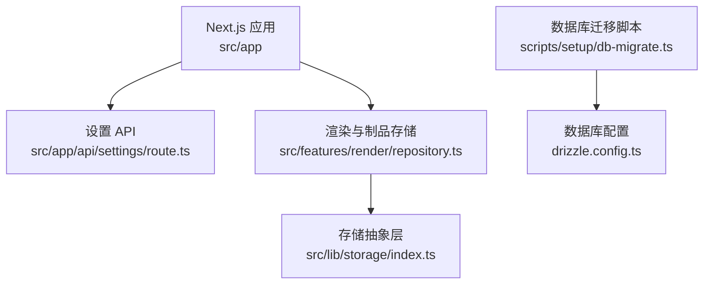
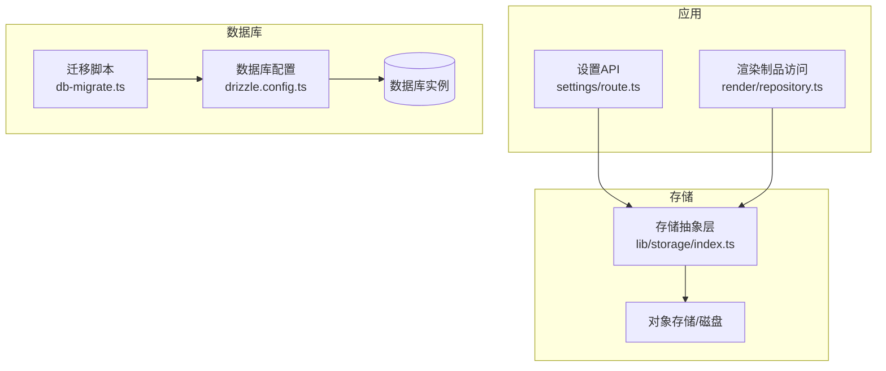
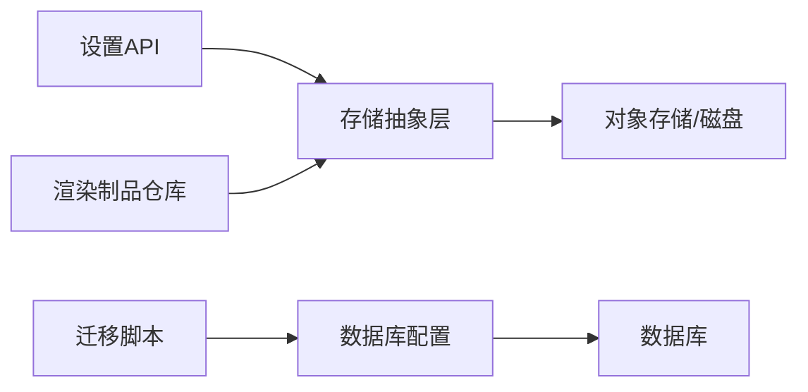

# 备份恢复

<cite>
**本文引用的文件**   
- [README.md](file://README.md)
- [drizzle.config.ts](file://drizzle.config.ts)
- [scripts/setup/db-migrate.ts](file://scripts/setup/db-migrate.ts)
- [src/app/api/settings/route.ts](file://src/app/api/settings/route.ts)
- [src/features/render/repository.ts](file://src/features/render/repository.ts)
- [src/lib/storage/index.ts](file://src/lib/storage/index.ts)
</cite>

## 目录
1. [简介](#简介)
2. [项目结构](#项目结构)
3. [核心组件](#核心组件)
4. [架构总览](#架构总览)
5. [详细组件分析](#详细组件分析)
6. [依赖分析](#依赖分析)
7. [性能考虑](#性能考虑)
8. [故障排查指南](#故障排查指南)
9. [结论](#结论)
10. [附录](#附录)

## 简介
本文件为 CodeVideoCanvas 的备份与恢复文档，覆盖数据备份策略（数据库快照、媒体文件与配置文件）、自动备份脚本与定时任务、数据恢复流程与灾难恢复计划、增量/全量备份最佳实践、备份验证与完整性校验、跨地域备份与高可用设计，以及备份数据的加密存储与访问控制。内容基于仓库现有实现与配置进行梳理，并给出可操作的运维建议。

## 项目结构
CodeVideoCanvas 采用 Next.js 应用形态，后端 API 位于 src/app/api，渲染与导出相关逻辑集中在 features/render，数据库迁移脚本位于 scripts/setup，数据库连接与驱动配置在 drizzle.config.ts。媒体与制品存储通过 lib/storage 抽象层访问。

图表来源
- [src/app/api/settings/route.ts](file://src/app/api/settings/route.ts)
- [src/features/render/repository.ts](file://src/features/render/repository.ts)
- [src/lib/storage/index.ts](file://src/lib/storage/index.ts)
- [scripts/setup/db-migrate.ts](file://scripts/setup/db-migrate.ts)
- [drizzle.config.ts](file://drizzle.config.ts)

章节来源
- [README.md](file://README.md)
- [drizzle.config.ts](file://drizzle.config.ts)
- [scripts/setup/db-migrate.ts](file://scripts/setup/db-migrate.ts)
- [src/app/api/settings/route.ts](file://src/app/api/settings/route.ts)
- [src/features/render/repository.ts](file://src/features/render/repository.ts)
- [src/lib/storage/index.ts](file://src/lib/storage/index.ts)

## 核心组件
- 数据库配置与迁移
  - 数据库驱动与连接参数由 drizzle.config.ts 管理；迁移脚本位于 scripts/setup/db-migrate.ts，用于初始化或升级数据库结构。
- 设置与配置
  - 设置接口位于 src/app/api/settings/route.ts，用于读取/更新应用运行配置（例如存储路径、队列参数等），这些配置直接影响备份范围与策略。
- 渲染产物与媒体存储
  - 渲染产物与中间文件的读写通过 src/features/render/repository.ts 封装，底层统一走 src/lib/storage/index.ts 的存储抽象，便于对接本地磁盘或对象存储。

章节来源
- [drizzle.config.ts](file://drizzle.config.ts)
- [scripts/setup/db-migrate.ts](file://scripts/setup/db-migrate.ts)
- [src/app/api/settings/route.ts](file://src/app/api/settings/route.ts)
- [src/features/render/repository.ts](file://src/features/render/repository.ts)
- [src/lib/storage/index.ts](file://src/lib/storage/index.ts)

## 架构总览
下图展示了备份与恢复的关键参与方：应用侧提供设置与制品访问能力，存储抽象层屏蔽具体介质差异，迁移脚本负责数据库结构演进。备份系统应围绕这三类数据源构建。

图表来源
- [src/app/api/settings/route.ts](file://src/app/api/settings/route.ts)
- [src/features/render/repository.ts](file://src/features/render/repository.ts)
- [src/lib/storage/index.ts](file://src/lib/storage/index.ts)
- [scripts/setup/db-migrate.ts](file://scripts/setup/db-migrate.ts)
- [drizzle.config.ts](file://drizzle.config.ts)

## 详细组件分析

### 数据库备份与恢复
- 备份目标
  - 结构化元数据（项目、镜头、任务、队列状态等）存储在数据库中，需定期执行快照。
- 备份策略
  - 全量备份：每日一次完整快照，保留周期按合规要求设定。
  - 增量备份：在两次全量之间按事务日志或时间点增量保存，缩短恢复窗口。
- 自动化与调度
  - 使用操作系统级定时任务（如 cron）或容器编排平台的 CronJob 触发备份命令。
  - 备份命令应调用数据库厂商提供的原生工具（如 pg_dump/mysqldump/sqlcmd 等），确保一致性。
- 恢复流程
  - 先回滚到最近的全量快照，再回放增量日志至指定时间点。
  - 恢复后执行迁移脚本以对齐结构版本。
- 验证与校验
  - 对备份文件计算哈希并在恢复前校验。
  - 在隔离环境执行“只读恢复”演练，验证表结构与关键索引可用性。

章节来源
- [scripts/setup/db-migrate.ts](file://scripts/setup/db-migrate.ts)
- [drizzle.config.ts](file://drizzle.config.ts)

### 媒体与制品备份与恢复
- 备份目标
  - 渲染产物、帧序列、音频素材、字幕、临时缓存等，通常位于对象存储或共享磁盘。
- 备份策略
  - 全量+增量：首次全量拷贝，后续仅同步变更文件；利用对象存储的版本化或复制规则。
  - 生命周期管理：按保留策略归档冷数据，降低长期成本。
- 自动化与调度
  - 使用云厂商 CLI/SDK 或 rsync/sync 工具，结合定时任务周期性执行。
  - 记录每次同步的清单与校验和，便于审计与回溯。
- 恢复流程
  - 优先恢复热数据（近期制品），再逐步回填历史数据。
  - 恢复后重建索引/元数据映射（若存在）。
- 验证与校验
  - 抽样比对文件大小与哈希值。
  - 随机抽取若干制品进行解码/播放验证。

章节来源
- [src/features/render/repository.ts](file://src/features/render/repository.ts)
- [src/lib/storage/index.ts](file://src/lib/storage/index.ts)

### 配置文件与运行时参数备份
- 备份目标
  - 应用设置（存储路径、队列并发、超时等）可通过设置 API 获取与更新。
- 备份策略
  - 将当前配置导出为不可变快照，并与代码版本绑定，纳入配置即代码（IaC）管理。
- 恢复流程
  - 在目标环境导入配置快照，重启服务使配置生效。
- 验证与校验
  - 启动后调用设置接口确认关键参数一致。

章节来源
- [src/app/api/settings/route.ts](file://src/app/api/settings/route.ts)

### 自动备份脚本与定时任务
- 脚本职责
  - 数据库快照、对象存储增量同步、配置导出、校验和生成、失败告警。
- 调度方式
  - 服务器端：cron/systemd timer。
  - 容器/Kubernetes：CronJob + Secret 管理凭据。
- 幂等与重试
  - 所有步骤具备幂等性，失败自动重试并记录上下文。
- 审计与留痕
  - 输出结构化日志，包含开始/结束时间、对象数量、大小、错误码。

[本节为通用运维建议，不直接分析具体文件]

### 增量备份与全量备份最佳实践
- 选择依据
  - 数据变化率、RPO/RTO 目标、存储成本与带宽限制。
- 组合策略
  - 每周全量 + 每日增量 + 每小时事务日志（数据库）。
  - 对象存储开启版本化，配合生命周期策略。
- 保留与清理
  - 明确保留期，过期自动清理，避免无限增长。
- 容量规划
  - 预估峰值写入与吞吐，预留扩容空间。

[本节为通用运维建议，不直接分析具体文件]

### 备份验证与数据完整性检查
- 校验方法
  - 哈希校验（SHA-256）、块级校验、抽样还原。
- 自动化演练
  - 定期在隔离环境执行“只读恢复”，验证可恢复性与耗时。
- 指标与告警
  - 监控备份成功率、时长、数据量、校验失败次数。

[本节为通用运维建议，不直接分析具体文件]

### 跨地域备份与高可用架构
- 多区域复制
  - 数据库启用跨区域只读副本；对象存储开启跨区域复制。
- 故障切换
  - 定义主备切换流程与 DNS/负载均衡切换策略。
- 一致性保障
  - 切换时尽量保证最终一致，必要时短暂降级非关键功能。

[本节为通用运维建议，不直接分析具体文件]

### 备份数据加密与访问控制
- 传输与静态加密
  - 传输使用 TLS；静态加密使用服务端托管密钥或客户托管密钥（CMK）。
- 最小权限
  - 为备份服务账号分配最小必要权限，禁止宽泛 ACL。
- 密钥管理
  - 使用专用密钥管理服务，轮换策略与审计日志完备。

[本节为通用运维建议，不直接分析具体文件]

## 依赖分析
- 组件耦合
  - 设置 API 与存储抽象层松耦合，便于替换存储后端。
  - 渲染制品访问通过 repository 层集中管理，利于统一备份策略。
- 外部依赖
  - 数据库驱动与迁移工具链；对象存储 SDK/CLI。
- 潜在风险
  - 存储路径变更未同步到备份策略；迁移脚本与生产库版本不一致导致恢复失败。

图表来源
- [src/app/api/settings/route.ts](file://src/app/api/settings/route.ts)
- [src/features/render/repository.ts](file://src/features/render/repository.ts)
- [src/lib/storage/index.ts](file://src/lib/storage/index.ts)
- [scripts/setup/db-migrate.ts](file://scripts/setup/db-migrate.ts)
- [drizzle.config.ts](file://drizzle.config.ts)

章节来源
- [src/app/api/settings/route.ts](file://src/app/api/settings/route.ts)
- [src/features/render/repository.ts](file://src/features/render/repository.ts)
- [src/lib/storage/index.ts](file://src/lib/storage/index.ts)
- [scripts/setup/db-migrate.ts](file://scripts/setup/db-migrate.ts)
- [drizzle.config.ts](file://drizzle.config.ts)

## 性能考虑
- 备份窗口
  - 避开业务高峰，采用分片/并行策略提升吞吐。
- 网络与 I/O
  - 就近部署备份代理，减少跨域延迟；启用压缩与去重（对象存储支持时）。
- 资源隔离
  - 为备份任务分配独立 CPU/内存配额，避免影响在线服务。

[本节为通用运维建议，不直接分析具体文件]

## 故障排查指南
- 常见问题
  - 数据库连接失败：检查驱动、端口、认证与网络策略。
  - 对象存储鉴权失败：核对凭据、权限与桶策略。
  - 迁移失败：对比迁移脚本版本与数据库 schema 版本。
- 定位手段
  - 查看备份任务日志与退出码；抓取失败时的请求/命令上下文。
  - 在隔离环境复现，缩小问题范围。
- 应急措施
  - 暂停新写入，切换到只读模式，尽快恢复最近可用快照。

章节来源
- [scripts/setup/db-migrate.ts](file://scripts/setup/db-migrate.ts)
- [drizzle.config.ts](file://drizzle.config.ts)
- [src/app/api/settings/route.ts](file://src/app/api/settings/route.ts)
- [src/features/render/repository.ts](file://src/features/render/repository.ts)
- [src/lib/storage/index.ts](file://src/lib/storage/index.ts)

## 结论
CodeVideoCanvas 的数据备份与恢复应以“数据库快照 + 媒体制品同步 + 配置快照”为核心，结合全量/增量策略、自动化调度、严格校验与跨地域复制，满足 RPO/RTO 目标。通过存储抽象层与设置 API 的解耦设计，备份方案具备良好的可扩展性与可维护性。

## 附录
- 术语
  - RPO：恢复点目标；RTO：恢复时间目标。
- 参考
  - 数据库厂商官方备份与恢复文档。
  - 对象存储版本化与跨区域复制说明。