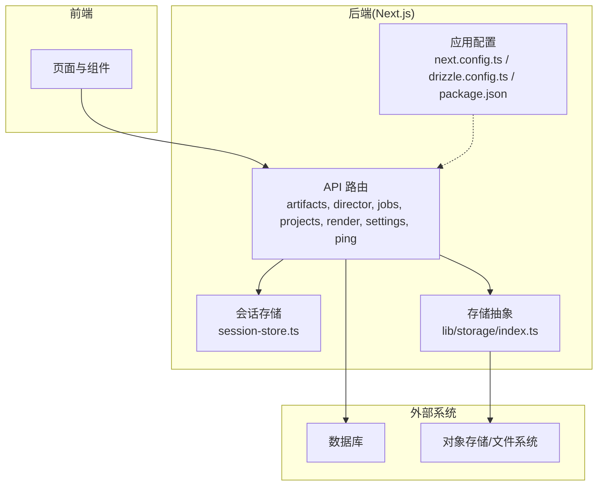
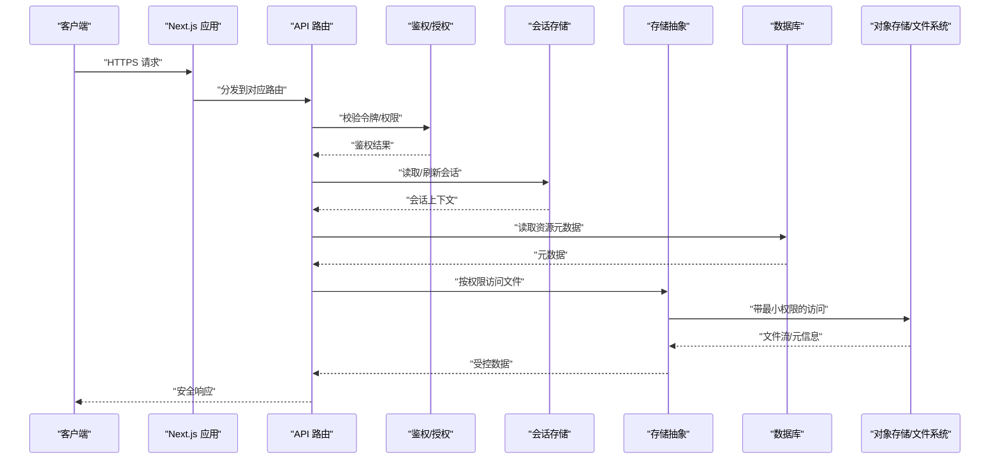
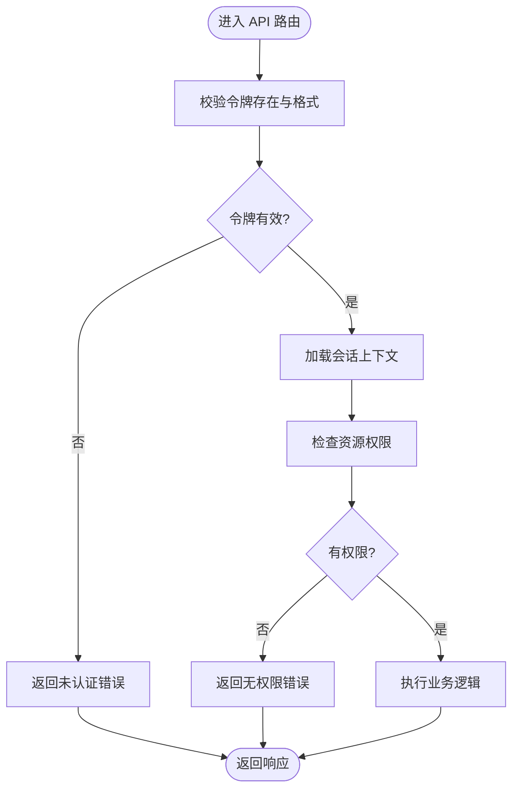
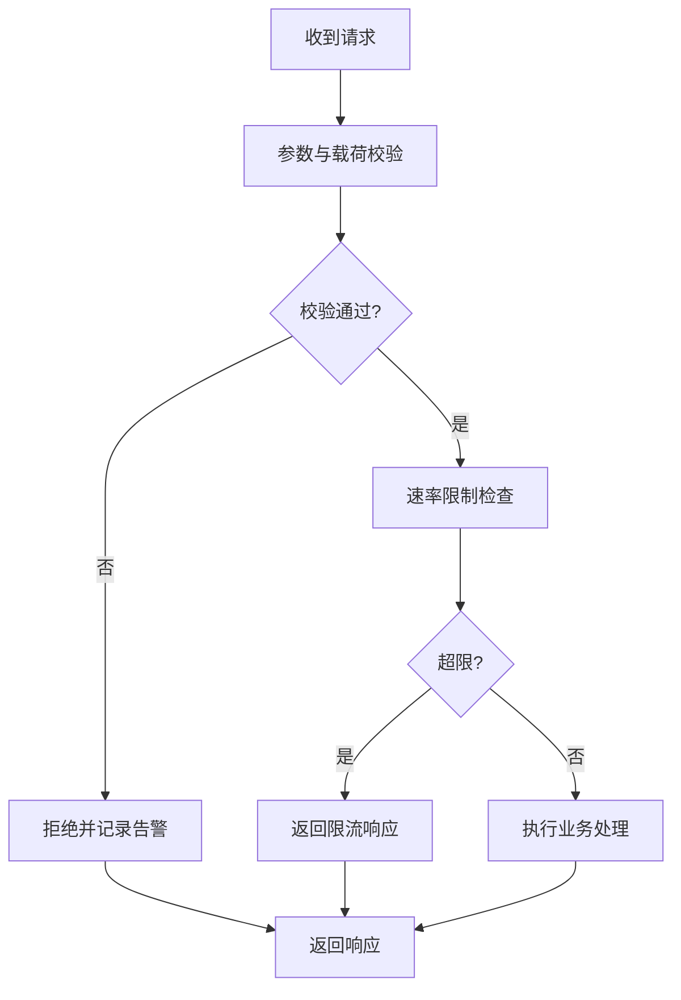
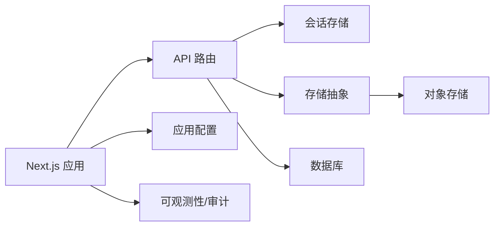

# 安全配置

<cite>
**本文引用的文件**   
- [README.md](file://README.md)
- [next.config.ts](file://next.config.ts)
- [package.json](file://package.json)
- [drizzle.config.ts](file://drizzle.config.ts)
- [src/app/layout.tsx](file://src/app/layout.tsx)
- [src/app/api/artifacts/[id]/route.ts](file://src/app/api/artifacts/[id]/route.ts)
- [src/app/api/director/stage/route.ts](file://src/app/api/director/stage/route.ts)
- [src/app/api/jobs/[id]/route.ts](file://src/app/api/jobs/[id]/route.ts)
- [src/app/api/ping/route.ts](file://src/app/api/ping/route.ts)
- [src/app/api/projects/route.ts](file://src/app/api/projects/route.ts)
- [src/app/api/render/route.ts](file://src/app/api/render/route.ts)
- [src/app/api/render/export/route.ts](file://src/app/api/render/export/route.ts)
- [src/app/api/settings/route.ts](file://src/app/api/settings/route.ts)
- [src/features/director/session-store.ts](file://src/features/director/session-store.ts)
- [src/lib/storage/index.ts](file://src/lib/storage/index.ts)
- [src/instrumentation.ts](file://src/instrumentation.ts)
</cite>

## 目录
1. [简介](#简介)
2. [项目结构](#项目结构)
3. [核心组件](#核心组件)
4. [架构总览](#架构总览)
5. [详细组件分析](#详细组件分析)
6. [依赖分析](#依赖分析)
7. [性能考虑](#性能考虑)
8. [故障排查指南](#故障排查指南)
9. [结论](#结论)
10. [附录](#附录)

## 简介
本文件为 CodeVideoCanvas 的安全配置文档，聚焦以下方面：身份认证与授权（含会话管理与权限控制）、数据加密策略（敏感信息存储、传输加密、文件访问控制）、API 安全防护（请求验证、速率限制、CORS 配置）、网络安全最佳实践（防火墙规则、SSL/TLS、安全头）、审计日志与合规性要求，以及安全漏洞扫描与定期安全评估流程。文档基于仓库现有实现进行梳理，并给出可操作的落地建议与图示说明。

## 项目结构
从仓库结构看，本项目采用 Next.js App Router 组织 API 路由与页面，业务逻辑分布在 features 与 lib 目录中，基础设施与配置位于根级配置文件。与安全相关的关注点包括：
- API 路由层：用于鉴权、校验、限流等横切能力落点
- 会话与会话存储：用户状态持久化与生命周期管理
- 存储抽象：对本地/云存储的统一访问入口，便于实施访问控制与加密
- 应用配置：Next.js 运行时配置、数据库迁移配置、包依赖版本
- 监控与可观测性：用于记录关键事件与审计线索

图表来源
- [src/app/layout.tsx:1-200](file://src/app/layout.tsx#L1-L200)
- [src/app/api/artifacts/[id]/route.ts:1-200](file://src/app/api/artifacts/[id]/route.ts#L1-L200)
- [src/app/api/director/stage/route.ts:1-200](file://src/app/api/director/stage/route.ts#L1-L200)
- [src/app/api/jobs/[id]/route.ts:1-200](file://src/app/api/jobs/[id]/route.ts#L1-L200)
- [src/app/api/ping/route.ts:1-200](file://src/app/api/ping/route.ts#L1-L200)
- [src/app/api/projects/route.ts:1-200](file://src/app/api/projects/route.ts#L1-L200)
- [src/app/api/render/route.ts:1-200](file://src/app/api/render/route.ts#L1-L200)
- [src/app/api/render/export/route.ts:1-200](file://src/app/api/render/export/route.ts#L1-L200)
- [src/app/api/settings/route.ts:1-200](file://src/app/api/settings/route.ts#L1-L200)
- [src/features/director/session-store.ts:1-200](file://src/features/director/session-store.ts#L1-L200)
- [src/lib/storage/index.ts:1-200](file://src/lib/storage/index.ts#L1-L200)
- [next.config.ts:1-200](file://next.config.ts#L1-L200)
- [drizzle.config.ts:1-200](file://drizzle.config.ts#L1-L200)
- [package.json:1-200](file://package.json#L1-200)

章节来源
- [README.md:1-200](file://README.md#L1-L200)
- [next.config.ts:1-200](file://next.config.ts#L1-L200)
- [package.json:1-200](file://package.json#L1-200)
- [drizzle.config.ts:1-200](file://drizzle.config.ts#L1-200)

## 核心组件
- API 路由层
  - 职责：接收请求、鉴权、参数校验、调用领域服务、返回响应。
  - 安全要点：统一鉴权中间件、输入校验、最小权限原则、输出脱敏。
- 会话存储
  - 职责：维护用户会话、过期策略、并发登录控制。
  - 安全要点：会话令牌签名与加密、固定长度随机值、服务端持久化、防重放。
- 存储抽象
  - 职责：封装本地或对象存储的读写操作。
  - 安全要点：路径规范化、白名单域名/桶名、访问令牌最小化、服务端侧加密。
- 应用配置
  - 职责：Next.js 运行期配置、数据库连接、依赖版本锁定。
  - 安全要点：严格 CORS、HTTPS 强制、安全头、依赖更新策略。

章节来源
- [src/app/api/artifacts/[id]/route.ts:1-200](file://src/app/api/artifacts/[id]/route.ts#L1-L200)
- [src/app/api/director/stage/route.ts:1-200](file://src/app/api/director/stage/route.ts#L1-L200)
- [src/app/api/jobs/[id]/route.ts:1-200](file://src/app/api/jobs/[id]/route.ts#L1-L200)
- [src/app/api/ping/route.ts:1-200](file://src/app/api/ping/route.ts#L1-L200)
- [src/app/api/projects/route.ts:1-200](file://src/app/api/projects/route.ts#L1-L200)
- [src/app/api/render/route.ts:1-200](file://src/app/api/render/route.ts#L1-L200)
- [src/app/api/render/export/route.ts:1-200](file://src/app/api/render/export/route.ts#L1-L200)
- [src/app/api/settings/route.ts:1-200](file://src/app/api/settings/route.ts#L1-L200)
- [src/features/director/session-store.ts:1-200](file://src/features/director/session-store.ts#L1-L200)
- [src/lib/storage/index.ts:1-200](file://src/lib/storage/index.ts#L1-L200)
- [next.config.ts:1-200](file://next.config.ts#L1-L200)
- [drizzle.config.ts:1-200](file://drizzle.config.ts#L1-L200)
- [package.json:1-200](file://package.json#L1-200)

## 架构总览
下图展示从浏览器到 API 路由、会话存储与存储抽象的整体交互，标注了安全控制点。

图表来源
- [src/app/api/artifacts/[id]/route.ts:1-200](file://src/app/api/artifacts/[id]/route.ts#L1-L200)
- [src/app/api/director/stage/route.ts:1-200](file://src/app/api/director/stage/route.ts#L1-L200)
- [src/app/api/jobs/[id]/route.ts:1-200](file://src/app/api/jobs/[id]/route.ts#L1-L200)
- [src/app/api/ping/route.ts:1-200](file://src/app/api/ping/route.ts#L1-L200)
- [src/app/api/projects/route.ts:1-200](file://src/app/api/projects/route.ts#L1-L200)
- [src/app/api/render/route.ts:1-200](file://src/app/api/render/route.ts#L1-L200)
- [src/app/api/render/export/route.ts:1-200](file://src/app/api/render/export/route.ts#L1-L200)
- [src/app/api/settings/route.ts:1-200](file://src/app/api/settings/route.ts#L1-L200)
- [src/features/director/session-store.ts:1-200](file://src/features/director/session-store.ts#L1-L200)
- [src/lib/storage/index.ts:1-200](file://src/lib/storage/index.ts#L1-L200)

## 详细组件分析

### 身份认证与授权机制
- 认证流程
  - 客户端在登录成功后获取会话令牌，后续请求携带令牌。
  - API 路由在入口处校验令牌有效性、签名与过期时间。
  - 鉴权通过后建立会话上下文，供后续处理使用。
- 会话管理
  - 会话应包含用户标识、角色/权限集、过期时间、设备指纹等。
  - 支持刷新与主动失效；异常时自动登出。
- 权限控制
  - 基于资源的细粒度授权（如项目/镜头/工件）。
  - 默认拒绝，显式授予；遵循最小权限原则。

图表来源
- [src/app/api/artifacts/[id]/route.ts:1-200](file://src/app/api/artifacts/[id]/route.ts#L1-L200)
- [src/app/api/director/stage/route.ts:1-200](file://src/app/api/director/stage/route.ts#L1-L200)
- [src/app/api/jobs/[id]/route.ts:1-200](file://src/app/api/jobs/[id]/route.ts#L1-L200)
- [src/app/api/projects/route.ts:1-200](file://src/app/api/projects/route.ts#L1-L200)
- [src/app/api/render/route.ts:1-200](file://src/app/api/render/route.ts#L1-L200)
- [src/app/api/render/export/route.ts:1-200](file://src/app/api/render/export/route.ts#L1-L200)
- [src/app/api/settings/route.ts:1-200](file://src/app/api/settings/route.ts#L1-L200)
- [src/features/director/session-store.ts:1-200](file://src/features/director/session-store.ts#L1-L200)

章节来源
- [src/features/director/session-store.ts:1-200](file://src/features/director/session-store.ts#L1-L200)
- [src/app/api/artifacts/[id]/route.ts:1-200](file://src/app/api/artifacts/[id]/route.ts#L1-L200)
- [src/app/api/director/stage/route.ts:1-200](file://src/app/api/director/stage/route.ts#L1-L200)
- [src/app/api/jobs/[id]/route.ts:1-200](file://src/app/api/jobs/[id]/route.ts#L1-L200)
- [src/app/api/projects/route.ts:1-200](file://src/app/api/projects/route.ts#L1-L200)
- [src/app/api/render/route.ts:1-200](file://src/app/api/render/route.ts#L1-L200)
- [src/app/api/render/export/route.ts:1-200](file://src/app/api/render/export/route.ts#L1-L200)
- [src/app/api/settings/route.ts:1-200](file://src/app/api/settings/route.ts#L1-L200)

### 数据加密策略
- 敏感信息存储
  - 密码与密钥必须哈希/加盐存储，禁止明文。
  - 会话令牌在服务端签名与加密，避免泄露。
  - 数据库中的敏感字段启用透明加密或列级加密。
- 传输加密
  - 全站 HTTPS，禁用弱协议与套件。
  - 内部服务间通信也需 TLS。
- 文件访问控制
  - 通过存储抽象统一访问，服务端侧校验路径与权限。
  - 临时访问令牌与短时效预签名 URL，限制范围与过期时间。
  - 静态资源与服务端渲染分离，避免直接暴露源路径。

章节来源
- [src/lib/storage/index.ts:1-200](file://src/lib/storage/index.ts#L1-L200)
- [next.config.ts:1-200](file://next.config.ts#L1-L200)
- [drizzle.config.ts:1-200](file://drizzle.config.ts#L1-L200)

### API 安全防护
- 请求验证
  - 对所有入参进行类型与边界校验，拒绝非法输入。
  - 对 JSON 载荷设置大小上限，防止大负载攻击。
- 速率限制
  - 针对登录、导出、渲染等高风险接口实施 IP/用户维度限流。
  - 结合缓存计数与滑动窗口算法，避免瞬时洪泛。
- CORS 配置
  - 仅允许已知可信来源，精确到子域与方法。
  - 生产环境关闭调试模式，严格 SameSite Cookie 策略。

图表来源
- [src/app/api/artifacts/[id]/route.ts:1-200](file://src/app/api/artifacts/[id]/route.ts#L1-L200)
- [src/app/api/director/stage/route.ts:1-200](file://src/app/api/director/stage/route.ts#L1-L200)
- [src/app/api/jobs/[id]/route.ts:1-200](file://src/app/api/jobs/[id]/route.ts#L1-L200)
- [src/app/api/projects/route.ts:1-200](file://src/app/api/projects/route.ts#L1-L200)
- [src/app/api/render/route.ts:1-200](file://src/app/api/render/route.ts#L1-L200)
- [src/app/api/render/export/route.ts:1-200](file://src/app/api/render/export/route.ts#L1-L200)
- [src/app/api/settings/route.ts:1-200](file://src/app/api/settings/route.ts#L1-L200)
- [next.config.ts:1-200](file://next.config.ts#L1-L200)

章节来源
- [src/app/api/artifacts/[id]/route.ts:1-200](file://src/app/api/artifacts/[id]/route.ts#L1-L200)
- [src/app/api/director/stage/route.ts:1-200](file://src/app/api/director/stage/route.ts#L1-L200)
- [src/app/api/jobs/[id]/route.ts:1-200](file://src/app/api/jobs/[id]/route.ts#L1-L200)
- [src/app/api/projects/route.ts:1-200](file://src/app/api/projects/route.ts#L1-L200)
- [src/app/api/render/route.ts:1-200](file://src/app/api/render/route.ts#L1-L200)
- [src/app/api/render/export/route.ts:1-200](file://src/app/api/render/export/route.ts#L1-L200)
- [src/app/api/settings/route.ts:1-200](file://src/app/api/settings/route.ts#L1-L200)
- [next.config.ts:1-200](file://next.config.ts#L1-L200)

### 网络安全最佳实践
- 防火墙规则
  - 仅开放必要端口（如 443），内网数据库与对象存储不暴露公网。
  - 对管理面与运维工具做网络隔离与白名单访问。
- SSL/TLS 配置
  - 强制 HTTPS，禁用旧版协议与不安全套件，启用 HSTS。
  - 证书自动化续期与监控告警。
- 安全头设置
  - 设置 Content-Security-Policy、X-Content-Type-Options、Referrer-Policy、Permissions-Policy 等。
  - 合理配置 Cache-Control 与 ETag，避免敏感信息缓存。

章节来源
- [next.config.ts:1-200](file://next.config.ts#L1-L200)
- [src/app/layout.tsx:1-200](file://src/app/layout.tsx#L1-L200)

### 审计日志与合规性要求
- 审计日志
  - 记录关键操作：登录、权限变更、导出、删除、配置修改。
  - 包含时间戳、用户标识、IP、资源 ID、操作结果与原因。
  - 日志不可篡改，集中收集与保留策略符合法规。
- 合规性
  - 数据最小化与目的限定，提供数据导出与删除能力。
  - 跨境数据传输评估与审批，敏感数据处理留痕。

章节来源
- [src/instrumentation.ts:1-200](file://src/instrumentation.ts#L1-200)
- [src/app/api/artifacts/[id]/route.ts:1-200](file://src/app/api/artifacts/[id]/route.ts#L1-L200)
- [src/app/api/director/stage/route.ts:1-200](file://src/app/api/director/stage/route.ts#L1-L200)
- [src/app/api/jobs/[id]/route.ts:1-200](file://src/app/api/jobs/[id]/route.ts#L1-L200)
- [src/app/api/projects/route.ts:1-200](file://src/app/api/projects/route.ts#L1-L200)
- [src/app/api/render/route.ts:1-200](file://src/app/api/render/route.ts#L1-L200)
- [src/app/api/render/export/route.ts:1-200](file://src/app/api/render/export/route.ts#L1-L200)
- [src/app/api/settings/route.ts:1-200](file://src/app/api/settings/route.ts#L1-L200)

### 安全漏洞扫描与定期安全评估
- 漏洞扫描
  - 依赖扫描：CI 中集成 SCA 工具，阻断高危漏洞合并。
  - 容器镜像扫描：构建产物上线前完成扫描与修复。
  - 代码质量与安全规则：ESLint/TS 规则与自定义规则联动。
- 定期评估
  - 季度渗透测试与红蓝对抗演练。
  - 威胁建模与架构评审，覆盖新增功能与第三方集成。
  - 安全指标看板：缺陷密度、平均修复时长、复测通过率。

章节来源
- [package.json:1-200](file://package.json#L1-200)
- [next.config.ts:1-200](file://next.config.ts#L1-L200)

## 依赖分析
- 运行时与框架
  - Next.js 作为 Web 服务器与路由分发中心，承载鉴权、校验、限流等横切逻辑。
- 数据存储
  - 数据库通过迁移脚本与 ORM 配置接入，确保连接安全与字段加密。
  - 对象存储通过统一抽象访问，避免直连暴露。
- 可观测性与审计
  - 应用启动与关键事件埋点，支撑审计与排障。

图表来源
- [next.config.ts:1-200](file://next.config.ts#L1-L200)
- [drizzle.config.ts:1-200](file://drizzle.config.ts#L1-L200)
- [package.json:1-200](file://package.json#L1-200)
- [src/app/api/artifacts/[id]/route.ts:1-200](file://src/app/api/artifacts/[id]/route.ts#L1-L200)
- [src/app/api/director/stage/route.ts:1-200](file://src/app/api/director/stage/route.ts#L1-L200)
- [src/app/api/jobs/[id]/route.ts:1-200](file://src/app/api/jobs/[id]/route.ts#L1-L200)
- [src/app/api/ping/route.ts:1-200](file://src/app/api/ping/route.ts#L1-L200)
- [src/app/api/projects/route.ts:1-200](file://src/app/api/projects/route.ts#L1-L200)
- [src/app/api/render/route.ts:1-200](file://src/app/api/render/route.ts#L1-L200)
- [src/app/api/render/export/route.ts:1-200](file://src/app/api/render/export/route.ts#L1-L200)
- [src/app/api/settings/route.ts:1-200](file://src/app/api/settings/route.ts#L1-L200)
- [src/features/director/session-store.ts:1-200](file://src/features/director/session-store.ts#L1-L200)
- [src/lib/storage/index.ts:1-200](file://src/lib/storage/index.ts#L1-L200)
- [src/instrumentation.ts:1-200](file://src/instrumentation.ts#L1-200)

章节来源
- [next.config.ts:1-200](file://next.config.ts#L1-L200)
- [drizzle.config.ts:1-200](file://drizzle.config.ts#L1-L200)
- [package.json:1-200](file://package.json#L1-200)

## 性能考虑
- 鉴权与校验尽量前置，减少无效计算。
- 会话存储选择高性能键值存储，避免热点键倾斜。
- 文件下载走分片与断点续传，降低带宽占用。
- 限流策略结合缓存与布隆过滤器，降低误判与开销。
- 对导出与渲染任务引入队列与背压，保护主线程。

[本节为通用指导，无需源码引用]

## 故障排查指南
- 常见问题定位
  - 认证失败：检查令牌签发与校验逻辑、时钟同步、会话过期策略。
  - 权限不足：核对资源归属、角色映射与授权链。
  - 限流触发：查看阈值与窗口配置，确认是否被恶意探测。
  - 存储访问失败：检查路径规范、权限与网络连通性。
- 日志与追踪
  - 利用审计日志与链路追踪快速定位问题。
  - 对关键路径增加结构化日志与采样率控制。

章节来源
- [src/instrumentation.ts:1-200](file://src/instrumentation.ts#L1-200)
- [src/app/api/artifacts/[id]/route.ts:1-200](file://src/app/api/artifacts/[id]/route.ts#L1-L200)
- [src/app/api/director/stage/route.ts:1-200](file://src/app/api/director/stage/route.ts#L1-L200)
- [src/app/api/jobs/[id]/route.ts:1-200](file://src/app/api/jobs/[id]/route.ts#L1-L200)
- [src/app/api/projects/route.ts:1-200](file://src/app/api/projects/route.ts#L1-L200)
- [src/app/api/render/route.ts:1-200](file://src/app/api/render/route.ts#L1-L200)
- [src/app/api/render/export/route.ts:1-200](file://src/app/api/render/export/route.ts#L1-L200)
- [src/app/api/settings/route.ts:1-200](file://src/app/api/settings/route.ts#L1-L200)

## 结论
CodeVideoCanvas 的安全体系以“认证先行、授权最小、传输加密、存储可控、审计可溯”为核心原则。建议在现有基础上完善统一的鉴权中间件、严格的输入校验与限流策略、完善的审计日志与合规流程，并通过自动化扫描与定期评估持续改进。

[本节为总结，无需源码引用]

## 附录
- 术语
  - 会话：维持用户状态的短期凭证集合。
  - 预签名 URL：短时有效的资源访问链接。
  - 最小权限：仅授予完成任务所需的最小权限。
- 参考清单
  - 安全头建议、TLS 套件推荐、依赖治理策略。

[本节为概念性内容，无需源码引用]