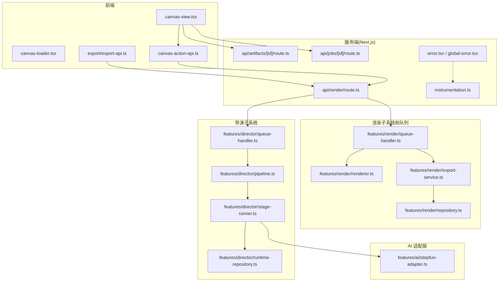
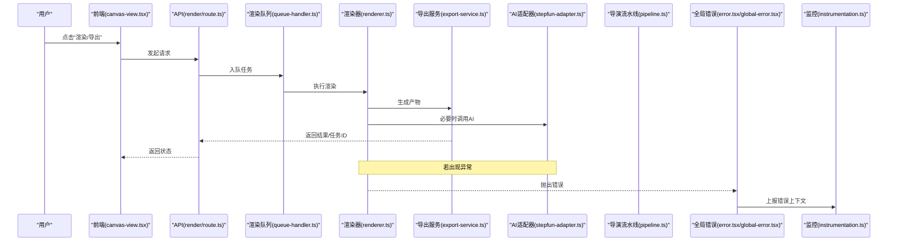
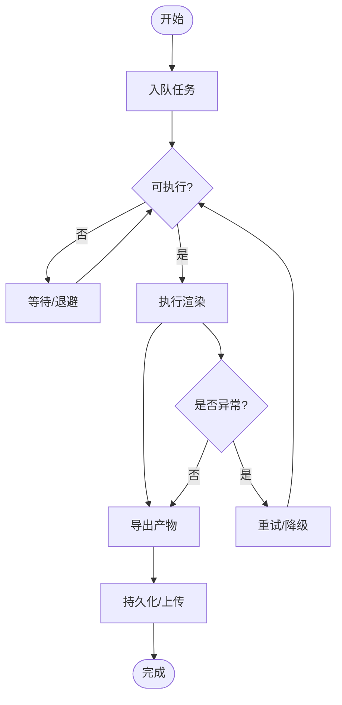
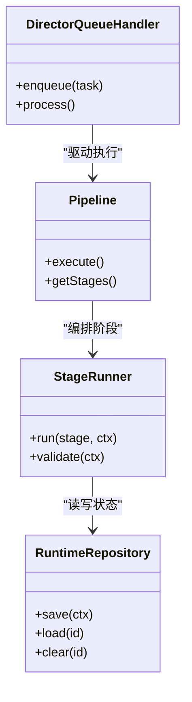
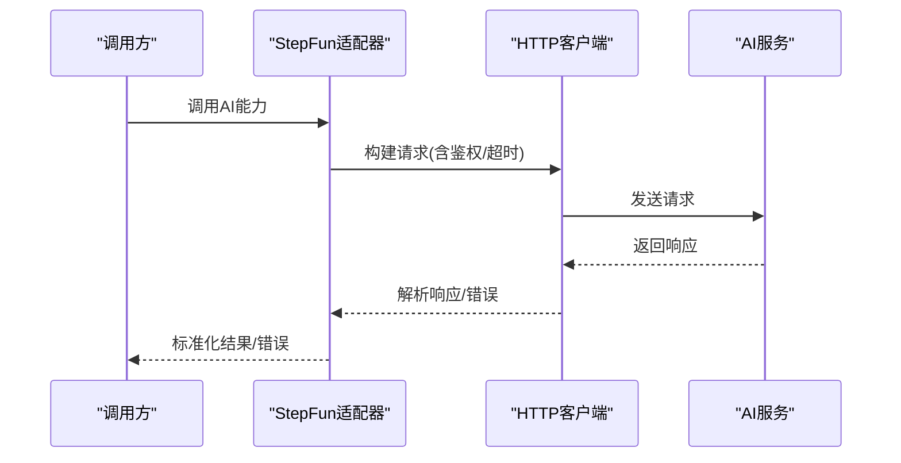
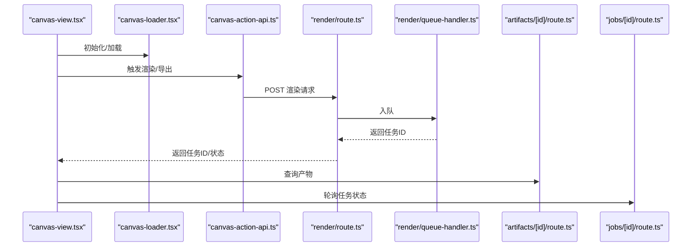
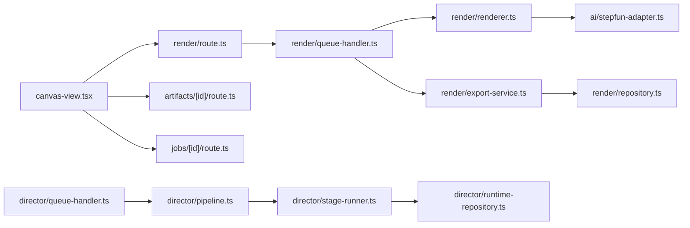

# 故障排查

<cite>
**本文引用的文件**   
- [src/app/error.tsx](file://src/app/error.tsx)
- [src/app/global-error.tsx](file://src/app/global-error.tsx)
- [src/instrumentation.ts](file://src/instrumentation.ts)
- [src/features/render/renderer.ts](file://src/features/render/renderer.ts)
- [src/features/render/queue-handler.ts](file://src/features/render/queue-handler.ts)
- [src/features/render/export-service.ts](file://src/features/render/export-service.ts)
- [src/features/render/repository.ts](file://src/features/render/repository.ts)
- [src/features/director/queue-handler.ts](file://src/features/director/queue-handler.ts)
- [src/features/director/pipeline.ts](file://src/features/director/pipeline.ts)
- [src/features/director/stage-runner.ts](file://src/features/director/stage-runner.ts)
- [src/features/director/runtime-repository.ts](file://src/features/director/runtime-repository.ts)
- [src/features/ai/stepfun-adapter.ts](file://src/features/ai/stepfun-adapter.ts)
- [src/app/api/render/route.ts](file://src/app/api/render/route.ts)
- [src/app/api/artifacts/[id]/route.ts](file://src/app/api/artifacts/[id]/route.ts)
- [src/app/api/jobs/[id]/route.ts](file://src/app/api/jobs/[id]/route.ts)
- [src/app/canvas/canvas-view.tsx](file://src/app/canvas/canvas-view.tsx)
- [src/app/canvas/canvas-loader.tsx](file://src/app/canvas/canvas-loader.tsx)
- [src/app/canvas/canvas-action-api.ts](file://src/app/canvas/canvas-action-api.ts)
- [src/app/canvas/export/export-api.ts](file://src/app/canvas/export/export-api.ts)
- [src/lib/utils.ts](file://src/lib/utils.ts)
</cite>

## 目录
1. [简介](#简介)
2. [项目结构](#项目结构)
3. [核心组件](#核心组件)
4. [架构总览](#架构总览)
5. [详细组件分析](#详细组件分析)
6. [依赖关系分析](#依赖关系分析)
7. [性能考量](#性能考量)
8. [故障排查指南](#故障排查指南)
9. [结论](#结论)
10. [附录](#附录)

## 简介
本故障排查文档面向 CodeVideoCanvas 的开发者与运维人员，聚焦以下问题域：渲染失败、AI 服务调用错误、数据库连接问题、性能瓶颈。文档提供系统化的诊断方法、调试工具与技巧（浏览器开发者工具、Node.js 调试器、日志分析）、错误处理最佳实践与异常捕获策略、堆栈跟踪分析方法、性能分析与内存泄漏检测手段，以及故障恢复步骤与紧急处理流程。

## 项目结构
CodeVideoCanvas 采用 Next.js App Router 组织前后端代码，关键模块包括：
- 应用层路由与全局错误边界：用于统一错误展示与上报
- 渲染子系统：负责帧序列、编码、导出与队列调度
- 导演子系统：编排多阶段任务、持久化运行时状态与结果
- AI 适配层：封装外部 AI 服务调用
- Canvas 交互与 API：前端画布视图与后端动作接口
- 通用工具库：配置、存储、队列等基础设施

图表来源
- [src/app/canvas/canvas-view.tsx](file://src/app/canvas/canvas-view.tsx)
- [src/app/canvas/canvas-loader.tsx](file://src/app/canvas/canvas-loader.tsx)
- [src/app/canvas/canvas-action-api.ts](file://src/app/canvas/canvas-action-api.ts)
- [src/app/canvas/export/export-api.ts](file://src/app/canvas/export/export-api.ts)
- [src/app/api/render/route.ts](file://src/app/api/render/route.ts)
- [src/app/api/artifacts/[id]/route.ts](file://src/app/api/artifacts/[id]/route.ts)
- [src/app/api/jobs/[id]/route.ts](file://src/app/api/jobs/[id]/route.ts)
- [src/features/render/renderer.ts](file://src/features/render/renderer.ts)
- [src/features/render/queue-handler.ts](file://src/features/render/queue-handler.ts)
- [src/features/render/export-service.ts](file://src/features/render/export-service.ts)
- [src/features/render/repository.ts](file://src/features/render/repository.ts)
- [src/features/director/queue-handler.ts](file://src/features/director/queue-handler.ts)
- [src/features/director/pipeline.ts](file://src/features/director/pipeline.ts)
- [src/features/director/stage-runner.ts](file://src/features/director/stage-runner.ts)
- [src/features/director/runtime-repository.ts](file://src/features/director/runtime-repository.ts)
- [src/features/ai/stepfun-adapter.ts](file://src/features/ai/stepfun-adapter.ts)
- [src/app/error.tsx](file://src/app/error.tsx)
- [src/app/global-error.tsx](file://src/app/global-error.tsx)
- [src/instrumentation.ts](file://src/instrumentation.ts)

章节来源
- [src/app/error.tsx](file://src/app/error.tsx)
- [src/app/global-error.tsx](file://src/app/global-error.tsx)
- [src/instrumentation.ts](file://src/instrumentation.ts)
- [src/app/canvas/canvas-view.tsx](file://src/app/canvas/canvas-view.tsx)
- [src/app/canvas/canvas-loader.tsx](file://src/app/canvas/canvas-loader.tsx)
- [src/app/canvas/canvas-action-api.ts](file://src/app/canvas/canvas-action-api.ts)
- [src/app/canvas/export/export-api.ts](file://src/app/canvas/export/export-api.ts)
- [src/app/api/render/route.ts](file://src/app/api/render/route.ts)
- [src/app/api/artifacts/[id]/route.ts](file://src/app/api/artifacts/[id]/route.ts)
- [src/app/api/jobs/[id]/route.ts](file://src/app/api/jobs/[id]/route.ts)
- [src/features/render/renderer.ts](file://src/features/render/renderer.ts)
- [src/features/render/queue-handler.ts](file://src/features/render/queue-handler.ts)
- [src/features/render/export-service.ts](file://src/features/render/export-service.ts)
- [src/features/render/repository.ts](file://src/features/render/repository.ts)
- [src/features/director/queue-handler.ts](file://src/features/director/queue-handler.ts)
- [src/features/director/pipeline.ts](file://src/features/director/pipeline.ts)
- [src/features/director/stage-runner.ts](file://src/features/director/stage-runner.ts)
- [src/features/director/runtime-repository.ts](file://src/features/director/runtime-repository.ts)
- [src/features/ai/stepfun-adapter.ts](file://src/features/ai/stepfun-adapter.ts)

## 核心组件
- 全局错误边界与错误页：集中捕获并展示错误，便于定位 UI 层崩溃与数据加载失败
- 渲染队列与执行器：将渲染任务入队、调度执行、管理并发与重试
- 导出服务：协调帧序列、编码与产物落盘或上传
- 导演流水线：编排多阶段任务（如素材摄取、分镜计划、合成、收尾），维护运行时状态
- AI 适配器：封装外部 AI 服务调用，统一错误与重试策略
- Canvas 交互与 API：前端触发渲染/导出/查询等操作，后端路由分发到对应处理器

章节来源
- [src/app/error.tsx](file://src/app/error.tsx)
- [src/app/global-error.tsx](file://src/app/global-error.tsx)
- [src/features/render/queue-handler.ts](file://src/features/render/queue-handler.ts)
- [src/features/render/renderer.ts](file://src/features/render/renderer.ts)
- [src/features/render/export-service.ts](file://src/features/render/export-service.ts)
- [src/features/director/queue-handler.ts](file://src/features/director/queue-handler.ts)
- [src/features/director/pipeline.ts](file://src/features/director/pipeline.ts)
- [src/features/director/stage-runner.ts](file://src/features/director/stage-runner.ts)
- [src/features/ai/stepfun-adapter.ts](file://src/features/ai/stepfun-adapter.ts)

## 架构总览
下图展示了从前端操作到后端处理、再到渲染与导出的端到端流程，以及错误上报路径。

图表来源
- [src/app/canvas/canvas-view.tsx](file://src/app/canvas/canvas-view.tsx)
- [src/app/api/render/route.ts](file://src/app/api/render/route.ts)
- [src/features/render/queue-handler.ts](file://src/features/render/queue-handler.ts)
- [src/features/render/renderer.ts](file://src/features/render/renderer.ts)
- [src/features/render/export-service.ts](file://src/features/render/export-service.ts)
- [src/features/ai/stepfun-adapter.ts](file://src/features/ai/stepfun-adapter.ts)
- [src/features/director/pipeline.ts](file://src/features/director/pipeline.ts)
- [src/app/error.tsx](file://src/app/error.tsx)
- [src/app/global-error.tsx](file://src/app/global-error.tsx)
- [src/instrumentation.ts](file://src/instrumentation.ts)

## 详细组件分析

### 渲染子系统（队列、渲染器、导出）
- 队列处理器负责任务入队、出队、并发控制与重试；渲染器负责具体帧生成与资源清理；导出服务负责合并与输出。
- 常见问题：队列堆积导致超时、渲染器未释放资源导致内存增长、导出阶段 IO 阻塞。

图表来源
- [src/features/render/queue-handler.ts](file://src/features/render/queue-handler.ts)
- [src/features/render/renderer.ts](file://src/features/render/renderer.ts)
- [src/features/render/export-service.ts](file://src/features/render/export-service.ts)

章节来源
- [src/features/render/queue-handler.ts](file://src/features/render/queue-handler.ts)
- [src/features/render/renderer.ts](file://src/features/render/renderer.ts)
- [src/features/render/export-service.ts](file://src/features/render/export-service.ts)

### 导演子系统（流水线、阶段运行器、运行时仓库）
- 流水线定义阶段顺序与依赖；阶段运行器执行单阶段逻辑；运行时仓库保存中间状态，支持断点续跑与幂等。
- 常见问题：阶段间数据不一致、运行时状态丢失、外部依赖不可用导致阶段失败。

图表来源
- [src/features/director/pipeline.ts](file://src/features/director/pipeline.ts)
- [src/features/director/stage-runner.ts](file://src/features/director/stage-runner.ts)
- [src/features/director/runtime-repository.ts](file://src/features/director/runtime-repository.ts)
- [src/features/director/queue-handler.ts](file://src/features/director/queue-handler.ts)

章节来源
- [src/features/director/pipeline.ts](file://src/features/director/pipeline.ts)
- [src/features/director/stage-runner.ts](file://src/features/director/stage-runner.ts)
- [src/features/director/runtime-repository.ts](file://src/features/director/runtime-repository.ts)
- [src/features/director/queue-handler.ts](file://src/features/director/queue-handler.ts)

### AI 适配层（StepFun 适配器）
- 封装外部 AI 服务调用，统一错误码映射、重试与超时控制。
- 常见问题：鉴权失败、限流、网络抖动、响应体解析异常。

图表来源
- [src/features/ai/stepfun-adapter.ts](file://src/features/ai/stepfun-adapter.ts)

章节来源
- [src/features/ai/stepfun-adapter.ts](file://src/features/ai/stepfun-adapter.ts)

### Canvas 交互与 API
- 前端通过 canvas-action-api 和 export-api 触发渲染/导出；后端 render route 接收请求并调度渲染队列；artifacts/jobs 路由用于查询产物与任务状态。
- 常见问题：前端参数校验失败、后端路由未正确转发、任务状态不同步。

图表来源
- [src/app/canvas/canvas-view.tsx](file://src/app/canvas/canvas-view.tsx)
- [src/app/canvas/canvas-loader.tsx](file://src/app/canvas/canvas-loader.tsx)
- [src/app/canvas/canvas-action-api.ts](file://src/app/canvas/canvas-action-api.ts)
- [src/app/canvas/export/export-api.ts](file://src/app/canvas/export/export-api.ts)
- [src/app/api/render/route.ts](file://src/app/api/render/route.ts)
- [src/app/api/artifacts/[id]/route.ts](file://src/app/api/artifacts/[id]/route.ts)
- [src/app/api/jobs/[id]/route.ts](file://src/app/api/jobs/[id]/route.ts)

章节来源
- [src/app/canvas/canvas-view.tsx](file://src/app/canvas/canvas-view.tsx)
- [src/app/canvas/canvas-loader.tsx](file://src/app/canvas/canvas-loader.tsx)
- [src/app/canvas/canvas-action-api.ts](file://src/app/canvas/canvas-action-api.ts)
- [src/app/canvas/export/export-api.ts](file://src/app/canvas/export/export-api.ts)
- [src/app/api/render/route.ts](file://src/app/api/render/route.ts)
- [src/app/api/artifacts/[id]/route.ts](file://src/app/api/artifacts/[id]/route.ts)
- [src/app/api/jobs/[id]/route.ts](file://src/app/api/jobs/[id]/route.ts)

## 依赖关系分析
- 前端对后端的依赖集中在若干 API 路由；后端渲染链路依赖队列、渲染器、导出服务与可选的 AI 适配器；导演子系统独立于渲染但共享运行时仓库。
- 潜在耦合点：
  - 渲染器与导出服务的协议变更会影响队列处理器
  - AI 适配器的错误模型变化需要上层统一处理
  - 运行时仓库的数据结构影响流水线各阶段的兼容性

图表来源
- [src/app/canvas/canvas-view.tsx](file://src/app/canvas/canvas-view.tsx)
- [src/app/api/render/route.ts](file://src/app/api/render/route.ts)
- [src/app/api/artifacts/[id]/route.ts](file://src/app/api/artifacts/[id]/route.ts)
- [src/app/api/jobs/[id]/route.ts](file://src/app/api/jobs/[id]/route.ts)
- [src/features/render/queue-handler.ts](file://src/features/render/queue-handler.ts)
- [src/features/render/renderer.ts](file://src/features/render/renderer.ts)
- [src/features/render/export-service.ts](file://src/features/render/export-service.ts)
- [src/features/render/repository.ts](file://src/features/render/repository.ts)
- [src/features/ai/stepfun-adapter.ts](file://src/features/ai/stepfun-adapter.ts)
- [src/features/director/queue-handler.ts](file://src/features/director/queue-handler.ts)
- [src/features/director/pipeline.ts](file://src/features/director/pipeline.ts)
- [src/features/director/stage-runner.ts](file://src/features/director/stage-runner.ts)
- [src/features/director/runtime-repository.ts](file://src/features/director/runtime-repository.ts)

章节来源
- [src/app/canvas/canvas-view.tsx](file://src/app/canvas/canvas-view.tsx)
- [src/app/api/render/route.ts](file://src/app/api/render/route.ts)
- [src/app/api/artifacts/[id]/route.ts](file://src/app/api/artifacts/[id]/route.ts)
- [src/app/api/jobs/[id]/route.ts](file://src/app/api/jobs/[id]/route.ts)
- [src/features/render/queue-handler.ts](file://src/features/render/queue-handler.ts)
- [src/features/render/renderer.ts](file://src/features/render/renderer.ts)
- [src/features/render/export-service.ts](file://src/features/render/export-service.ts)
- [src/features/render/repository.ts](file://src/features/render/repository.ts)
- [src/features/ai/stepfun-adapter.ts](file://src/features/ai/stepfun-adapter.ts)
- [src/features/director/queue-handler.ts](file://src/features/director/queue-handler.ts)
- [src/features/director/pipeline.ts](file://src/features/director/pipeline.ts)
- [src/features/director/stage-runner.ts](file://src/features/director/stage-runner.ts)
- [src/features/director/runtime-repository.ts](file://src/features/director/runtime-repository.ts)

## 性能考量
- 渲染队列并发度需根据 CPU/GPU 与磁盘 IO 调优，避免过度并行导致抖动
- 导出阶段应使用流式写入与批处理，减少大对象驻留内存
- 对外部 AI 服务调用增加超时与退避重试，避免雪崩
- 定期清理临时文件与缓存，防止磁盘占用过高
- 前端长列表与大图预览需虚拟化与懒加载，降低主线程压力

[本节为通用指导，不直接分析具体文件]

## 故障排查指南

### 常见错误与诊断方法
- 渲染失败
  - 现象：任务长时间排队、渲染中断、产物缺失
  - 诊断要点：检查队列积压与重试次数、渲染器异常日志、导出阶段 IO 错误
  - 快速验证：缩小输入规模、关闭非必要阶段、单独运行导出服务
  - 参考实现位置
    - [src/features/render/queue-handler.ts](file://src/features/render/queue-handler.ts)
    - [src/features/render/renderer.ts](file://src/features/render/renderer.ts)
    - [src/features/render/export-service.ts](file://src/features/render/export-service.ts)

- AI 服务调用错误
  - 现象：鉴权失败、限流、超时、响应解析异常
  - 诊断要点：查看适配器错误映射、重试策略、网络层日志
  - 快速验证：切换测试密钥、降低并发、启用离线模式跳过 AI 阶段
  - 参考实现位置
    - [src/features/ai/stepfun-adapter.ts](file://src/features/ai/stepfun-adapter.ts)

- 数据库连接问题
  - 现象：运行时仓库读写失败、任务状态无法持久化
  - 诊断要点：连接池配置、超时与重试、慢查询与锁等待
  - 快速验证：直连数据库执行健康检查、回滚最近迁移、隔离只读副本
  - 参考实现位置
    - [src/features/director/runtime-repository.ts](file://src/features/director/runtime-repository.ts)
    - [src/features/render/repository.ts](file://src/features/render/repository.ts)

- 性能瓶颈
  - 现象：CPU/内存尖峰、导出耗时过长、UI 卡顿
  - 诊断要点：队列吞吐、渲染器热点、导出 IO 带宽、前端重渲染频率
  - 快速验证：限制并发、开启节流与去抖、采样火焰图与堆快照
  - 参考实现位置
    - [src/features/render/queue-handler.ts](file://src/features/render/queue-handler.ts)
    - [src/app/canvas/canvas-view.tsx](file://src/app/canvas/canvas-view.tsx)

章节来源
- [src/features/render/queue-handler.ts](file://src/features/render/queue-handler.ts)
- [src/features/render/renderer.ts](file://src/features/render/renderer.ts)
- [src/features/render/export-service.ts](file://src/features/render/export-service.ts)
- [src/features/ai/stepfun-adapter.ts](file://src/features/ai/stepfun-adapter.ts)
- [src/features/director/runtime-repository.ts](file://src/features/director/runtime-repository.ts)
- [src/features/render/repository.ts](file://src/features/render/repository.ts)
- [src/app/canvas/canvas-view.tsx](file://src/app/canvas/canvas-view.tsx)

### 调试工具与技巧
- 浏览器开发者工具
  - Network：观察 API 请求/响应、重试与超时
  - Performance：录制渲染与导出期间的性能面板，识别长任务与布局抖动
  - Memory：堆快照对比，定位内存泄漏与未释放资源
  - Console：过滤错误与警告，结合自定义日志标签
- Node.js 调试器
  - 使用断点与步进定位后端异常路径
  - 针对队列与导出阶段设置条件断点，减少干扰
- 日志分析
  - 关注错误上下文（任务 ID、阶段、输入摘要、时间戳）
  - 聚合统计失败率、重试次数、P95/P99 延迟
  - 关联追踪：跨模块传递 traceId，串联前端到后端链路

[本节为通用指导，不直接分析具体文件]

### 错误处理最佳实践与异常捕获策略
- 统一错误边界：在应用层集中捕获与展示错误，避免白屏
- 结构化错误：包含错误码、消息、上下文与堆栈摘要
- 幂等与补偿：对可重试操作设计幂等键，失败时具备补偿机制
- 优雅降级：AI 不可用时回退本地规则或跳过非关键阶段
- 参考实现位置
  - [src/app/error.tsx](file://src/app/error.tsx)
  - [src/app/global-error.tsx](file://src/app/global-error.tsx)

章节来源
- [src/app/error.tsx](file://src/app/error.tsx)
- [src/app/global-error.tsx](file://src/app/global-error.tsx)

### 堆栈跟踪分析与根因定位
- 收集完整堆栈：确保异常携带文件名、行号与上下文
- 分层定位：先确定出错模块（渲染/导出/AI/持久化），再深入具体函数
- 复现最小集：构造最小输入与最少阶段以复现问题
- 关联指标：结合错误率、延迟与资源使用趋势判断是否为回归或容量问题
- 参考实现位置
  - [src/instrumentation.ts](file://src/instrumentation.ts)

章节来源
- [src/instrumentation.ts](file://src/instrumentation.ts)

### 性能分析与内存泄漏检测
- 性能分析
  - 前端：Performance 面板录制，关注长任务、主线程阻塞与重绘
  - 后端：CPU/内存采样，识别热点函数与 GC 压力
- 内存泄漏检测
  - 前端：对比堆快照，查找持续增长的对象引用链
  - 后端：监控 RSS 与堆大小，定位未释放句柄或闭包引用
- 优化建议
  - 限制并发、批处理 IO、惰性加载资源、及时释放临时对象
- 参考实现位置
  - [src/features/render/queue-handler.ts](file://src/features/render/queue-handler.ts)
  - [src/features/render/export-service.ts](file://src/features/render/export-service.ts)
  - [src/app/canvas/canvas-view.tsx](file://src/app/canvas/canvas-view.tsx)

章节来源
- [src/features/render/queue-handler.ts](file://src/features/render/queue-handler.ts)
- [src/features/render/export-service.ts](file://src/features/render/export-service.ts)
- [src/app/canvas/canvas-view.tsx](file://src/app/canvas/canvas-view.tsx)

### 故障恢复步骤与紧急处理流程
- 立即止血
  - 暂停新任务入队，清空或冻结队列
  - 降级 AI 调用，切换到本地或只读模式
  - 限制并发度，保护系统稳定性
- 快速恢复
  - 重启无状态实例，清理临时文件与缓存
  - 回滚最近变更（代码/配置/迁移）
  - 扩容资源或横向扩展实例
- 根因修复
  - 修复异常路径与重试策略，补充监控告警
  - 完善错误上下文与日志规范
- 参考实现位置
  - [src/app/api/render/route.ts](file://src/app/api/render/route.ts)
  - [src/features/render/queue-handler.ts](file://src/features/render/queue-handler.ts)
  - [src/features/director/queue-handler.ts](file://src/features/director/queue-handler.ts)

章节来源
- [src/app/api/render/route.ts](file://src/app/api/render/route.ts)
- [src/features/render/queue-handler.ts](file://src/features/render/queue-handler.ts)
- [src/features/director/queue-handler.ts](file://src/features/director/queue-handler.ts)

## 结论
通过统一的错误边界、结构化的日志与监控、合理的队列与重试策略，以及完善的性能分析与内存检测方法，CodeVideoCanvas 能够快速定位并恢复渲染、AI 调用、数据库与性能相关问题。建议在发布前完善错误上下文、建立基线指标与告警阈值，并在演练中验证恢复流程的有效性。

[本节为总结性内容，不直接分析具体文件]

## 附录
- 常用命令与入口
  - 启动开发环境、构建与部署脚本位于 scripts 目录
  - 数据库迁移脚本位于 scripts/setup/db-migrate.ts
- 相关工具与配置
  - 通用工具函数位于 src/lib/utils.ts
  - 全局监控与上报入口位于 src/instrumentation.ts

章节来源
- [src/lib/utils.ts](file://src/lib/utils.ts)
- [src/instrumentation.ts](file://src/instrumentation.ts)