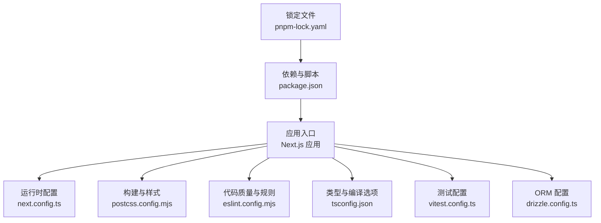
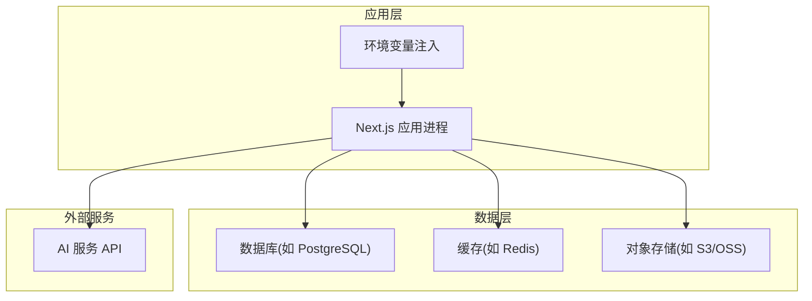
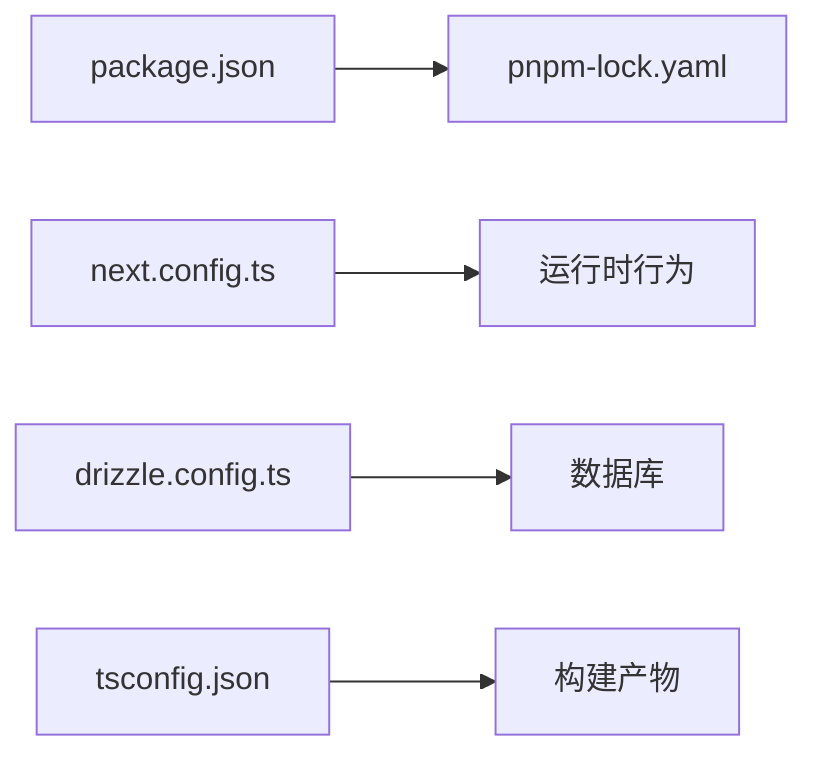

# 环境配置

<cite>
**本文引用的文件**   
- [package.json](file://package.json)
- [pnpm-lock.yaml](file://pnpm-lock.yaml)
- [next.config.ts](file://next.config.ts)
- [drizzle.config.ts](file://drizzle.config.ts)
- [tsconfig.json](file://tsconfig.json)
- [postcss.config.mjs](file://postcss.config.mjs)
- [eslint.config.mjs](file://eslint.config.mjs)
- [vitest.config.ts](file://vitest.config.ts)
- [README.md](file://README.md)
</cite>

## 目录
1. [简介](#简介)
2. [项目结构](#项目结构)
3. [核心组件](#核心组件)
4. [架构总览](#架构总览)
5. [详细组件分析](#详细组件分析)
6. [依赖分析](#依赖分析)
7. [性能考虑](#性能考虑)
8. [故障排查指南](#故障排查指南)
9. [结论](#结论)
10. [附录](#附录)

## 简介
本文件为 CodeVideoCanvas 的生产环境配置指南，聚焦以下目标：
- 服务器与操作系统要求、Node.js 版本与内存参数
- 环境变量配置（数据库连接、AI 服务 API 密钥、存储与缓存）
- 依赖管理策略（npm/pnpm 包管理器与生产优化）
- Docker 容器化与 Kubernetes 部署清单
- 性能调优参数与资源限制

说明：仓库中未包含 Dockerfile 或 Kubernetes 清单。本节提供基于 Next.js 应用的最佳实践模板与示例，便于直接落地。

## 项目结构
本项目采用 Next.js 应用结构，配合 pnpm 进行依赖管理，使用 Drizzle ORM 进行数据迁移与类型生成，并通过 TypeScript/PostCSS/ESLint/Vitest 等工具链完成构建与测试。

图表来源
- [next.config.ts:1-200](file://next.config.ts#L1-L200)
- [postcss.config.mjs:1-200](file://postcss.config.mjs#L1-L200)
- [eslint.config.mjs:1-200](file://eslint.config.mjs#L1-L200)
- [tsconfig.json:1-200](file://tsconfig.json#L1-L200)
- [vitest.config.ts:1-200](file://vitest.config.ts#L1-L200)
- [drizzle.config.ts:1-200](file://drizzle.config.ts#L1-L200)
- [package.json:1-200](file://package.json#L1-L200)
- [pnpm-lock.yaml:1-200](file://pnpm-lock.yaml#L1-L200)

章节来源
- [package.json:1-200](file://package.json#L1-L200)
- [pnpm-lock.yaml:1-200](file://pnpm-lock.yaml#L1-L200)
- [next.config.ts:1-200](file://next.config.ts#L1-L200)
- [drizzle.config.ts:1-200](file://drizzle.config.ts#L1-L200)
- [tsconfig.json:1-200](file://tsconfig.json#L1-L200)
- [postcss.config.mjs:1-200](file://postcss.config.mjs#L1-L200)
- [eslint.config.mjs:1-200](file://eslint.config.mjs#L1-L200)
- [vitest.config.ts:1-200](file://vitest.config.ts#L1-L200)
- [README.md:1-200](file://README.md#L1-L200)

## 核心组件
- 运行时与构建
  - Next.js 应用运行于 Node.js 环境，生产模式通过 next build 与 next start 启动。
  - 构建产物默认输出至 .next 目录，生产部署应仅拷贝构建产物与依赖。
- 依赖与包管理
  - 使用 pnpm 作为包管理器，锁定依赖版本，确保可重复构建。
  - package.json 定义脚本与依赖，pnpm-lock.yaml 用于锁定安装结果。
- 数据层
  - Drizzle ORM 通过 drizzle.config.ts 配置数据库连接与迁移命令。
- 前端工程化
  - TypeScript、PostCSS、ESLint、Vitest 分别负责类型检查、样式处理、代码规范与单元测试。

章节来源
- [package.json:1-200](file://package.json#L1-L200)
- [pnpm-lock.yaml:1-200](file://pnpm-lock.yaml#L1-L200)
- [drizzle.config.ts:1-200](file://drizzle.config.ts#L1-L200)
- [next.config.ts:1-200](file://next.config.ts#L1-L200)

## 架构总览
下图展示生产环境的关键组件与交互关系：应用进程、数据库、对象存储、缓存与外部 AI 服务。

图表来源
- [drizzle.config.ts:1-200](file://drizzle.config.ts#L1-L200)
- [next.config.ts:1-200](file://next.config.ts#L1-L200)

## 详细组件分析

### 服务器与操作系统要求
- 操作系统
  - 推荐 Linux 发行版（如 Ubuntu LTS、Alpine），Windows/macOS 可用于开发，不建议用于生产。
- Node.js 版本
  - 以 Next.js 官方支持为准；建议固定到 LTS 版本，并在 CI 中校验。
- 内存与 CPU
  - 根据并发与渲染任务规模调整；建议至少 2C4G 起步，视频导出场景建议更高内存。
- 磁盘与网络
  - 预留足够空间用于构建缓存与临时文件；对外部 AI 与对象存储的网络延迟需控制在合理范围。

[本节为通用指导，不直接分析具体文件]

### 环境变量配置
以下为生产环境常见环境变量类别与用途说明。请结合 drizzle.config.ts 与 next.config.ts 中的实际引用进行调整。

- 数据库连接
  - 典型键名：DATABASE_URL、DB_HOST、DB_PORT、DB_NAME、DB_USER、DB_PASSWORD
  - 用途：Drizzle ORM 连接字符串或独立字段；生产环境建议使用只读副本与最小权限账号。
- AI 服务 API 密钥
  - 典型键名：AI_API_KEY、AI_BASE_URL、AI_TIMEOUT_MS、AI_MAX_RETRIES
  - 用途：调用外部 AI 能力（如文本/图像/音视频生成）；建议设置超时与重试上限。
- 存储配置
  - 典型键名：STORAGE_PROVIDER、S3_BUCKET、S3_REGION、S3_ACCESS_KEY、S3_SECRET_KEY、OSS_ENDPOINT、OSS_ACCESS_KEY、OSS_SECRET_KEY
  - 用途：选择对象存储后端并配置访问凭证；生产环境启用加密与访问日志。
- 缓存设置
  - 典型键名：REDIS_URL、CACHE_TTL、CACHE_PREFIX
  - 用途：会话、队列或中间结果缓存；建议设置合理的 TTL 与命名前缀避免冲突。
- 应用运行
  - 典型键名：NODE_ENV=production、NEXT_PUBLIC_*（仅限客户端）、PORT、LOG_LEVEL
  - 用途：控制运行模式、端口与日志级别；NEXT_PUBLIC_ 变量会暴露到浏览器端，需谨慎使用。

注意：
- 不要将敏感信息提交到版本库；使用平台密钥管理服务或编排系统注入。
- 在 drizzle.config.ts 与 next.config.ts 中确认环境变量读取方式，确保生产环境一致。

章节来源
- [drizzle.config.ts:1-200](file://drizzle.config.ts#L1-L200)
- [next.config.ts:1-200](file://next.config.ts#L1-L200)

### 依赖管理策略（npm/pnpm）
- 包管理器
  - 使用 pnpm 提升安装速度与磁盘占用效率；pnpm-lock.yaml 保证可重复构建。
- 脚本与生命周期
  - 在 package.json 中定义 build、start、lint、test 等脚本；生产环境仅执行必要步骤。
- 生产优化
  - 使用 --frozen-lockfile 或 --no-fund 减少安装开销；按需裁剪依赖树。
- 安全与合规
  - 定期扫描依赖漏洞；锁定第三方版本，避免上游变更影响稳定性。

章节来源
- [package.json:1-200](file://package.json#L1-L200)
- [pnpm-lock.yaml:1-200](file://pnpm-lock.yaml#L1-L200)

### Docker 容器化配置
仓库未提供 Dockerfile。以下为生产镜像的参考要点：
- 基础镜像
  - 选用 node:lts-slim 或 distroless/nodejs，减小镜像体积。
- 多阶段构建
  - 第一阶段安装依赖并构建产物；第二阶段仅拷贝 .next 与依赖，降低攻击面。
- 非 root 用户
  - 创建专用用户运行应用，避免以 root 身份运行。
- 健康检查
  - 实现 /api/ping 或类似探针，供编排系统探测存活。
- 环境变量注入
  - 通过编排系统注入 DATABASE_URL、AI_API_KEY、STORAGE_*、REDIS_URL 等。
- 资源限制
  - 在容器层面设置 CPU/内存限制，防止单实例耗尽节点资源。

[本节为概念性指导，不直接分析具体文件]

### Kubernetes 部署清单
仓库未提供 K8s 清单。以下为关键资源建议：
- Deployment
  - replicas 按负载与可用性需求设定；滚动更新策略保障零停机发布。
- Service/Ingress
  - 暴露 HTTP 端口；如需 HTTPS，可在 Ingress 层终止 TLS。
- ConfigMap/Secret
  - 将非敏感配置放入 ConfigMap，敏感信息放入 Secret，通过环境变量注入。
- HorizontalPodAutoscaler
  - 基于 CPU/内存或自定义指标自动扩缩容。
- PersistentVolumeClaim
  - 若需要本地缓存或临时文件落盘，挂载持久卷并清理策略明确。
- ResourceQuota/LimitRange
  - 命名空间级配额与默认限制，防止资源争用。

[本节为概念性指导，不直接分析具体文件]

### 性能调优参数与资源限制
- Node.js 内存
  - 根据容器限制设置 NODE_OPTIONS="--max-old-space-size=..."，避免 OOM。
- Next.js 构建与运行
  - 启用增量静态再生（ISR）与缓存策略；合理设置 revalidate 时间。
- 数据库连接池
  - 根据实例数与并发调整连接池大小；使用只读副本分担查询压力。
- 缓存命中率
  - 针对热点数据设置短 TTL；对大对象使用分片与压缩。
- 外部 API 调用
  - 设置超时、重试与退避策略；对 AI 服务增加熔断与降级逻辑。
- 日志与监控
  - 结构化日志，采样高成本路径；接入 APM 与错误告警。

[本节为通用指导，不直接分析具体文件]

## 依赖分析
- 内部依赖
  - 应用模块通过配置文件与运行时环境变量耦合，降低硬编码风险。
- 外部依赖
  - 数据库驱动、对象存储 SDK、AI 服务 HTTP 客户端；建议在接口层抽象，便于替换实现。
- 潜在循环依赖
  - 保持分层清晰，避免业务逻辑与基础设施耦合过深。

图表来源
- [package.json:1-200](file://package.json#L1-L200)
- [pnpm-lock.yaml:1-200](file://pnpm-lock.yaml#L1-L200)
- [next.config.ts:1-200](file://next.config.ts#L1-L200)
- [drizzle.config.ts:1-200](file://drizzle.config.ts#L1-L200)
- [tsconfig.json:1-200](file://tsconfig.json#L1-L200)

章节来源
- [package.json:1-200](file://package.json#L1-L200)
- [pnpm-lock.yaml:1-200](file://pnpm-lock.yaml#L1-L200)
- [next.config.ts:1-200](file://next.config.ts#L1-L200)
- [drizzle.config.ts:1-200](file://drizzle.config.ts#L1-L200)
- [tsconfig.json:1-200](file://tsconfig.json#L1-L200)

## 性能考虑
- 构建优化
  - 使用并行构建与缓存；CI 中缓存依赖与构建产物。
- 运行时优化
  - 开启 gzip/brotli；静态资源 CDN 加速；图片与媒体转码与懒加载。
- 队列与异步
  - 将耗时任务（如导出、渲染）放入队列，避免阻塞请求线程。
- 容量规划
  - 压测确定峰值 QPS 与资源水位；预留扩容余量。

[本节为通用指导，不直接分析具体文件]

## 故障排查指南
- 常见问题定位
  - 环境变量缺失或格式错误：核对所有必需键名与值；区分 NEXT_PUBLIC_* 的前端可见性。
  - 数据库连接失败：检查连接串、网络 ACL、白名单与证书；验证读写权限。
  - AI 服务调用失败：查看超时、重试与限流；记录请求 ID 以便追踪。
  - 对象存储写入失败：校验凭证、桶策略与区域；检查网络连通性与代理。
- 日志与指标
  - 统一日志格式；采集关键指标（QPS、延迟、错误率、内存/CPU）。
- 回滚与恢复
  - 保留上一版本镜像与数据库快照；灰度发布与快速回滚流程。

[本节为通用指导，不直接分析具体文件]

## 结论
通过明确的服务器与环境要求、严格的环境变量治理、可靠的依赖管理与完善的容器化/K8s 部署方案，CodeVideoCanvas 可在生产环境中稳定运行。结合性能调优与监控告警，可有效支撑高并发与重计算场景。

[本节为总结性内容，不直接分析具体文件]

## 附录
- 参考文档
  - README.md 提供项目概览与使用说明，可作为补充阅读。
- 相关配置
  - postcss.config.mjs、eslint.config.mjs、vitest.config.ts 分别管理样式、代码规范与测试行为，可按团队规范调整。

章节来源
- [README.md:1-200](file://README.md#L1-L200)
- [postcss.config.mjs:1-200](file://postcss.config.mjs#L1-L200)
- [eslint.config.mjs:1-200](file://eslint.config.mjs#L1-L200)
- [vitest.config.ts:1-200](file://vitest.config.ts#L1-L200)