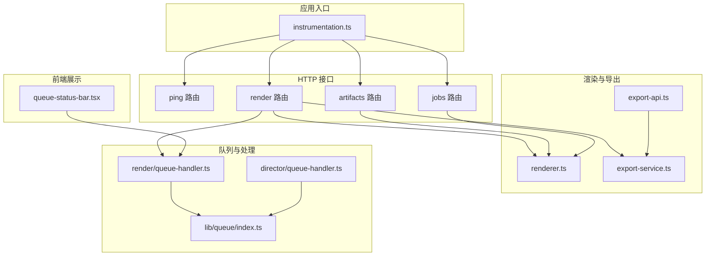
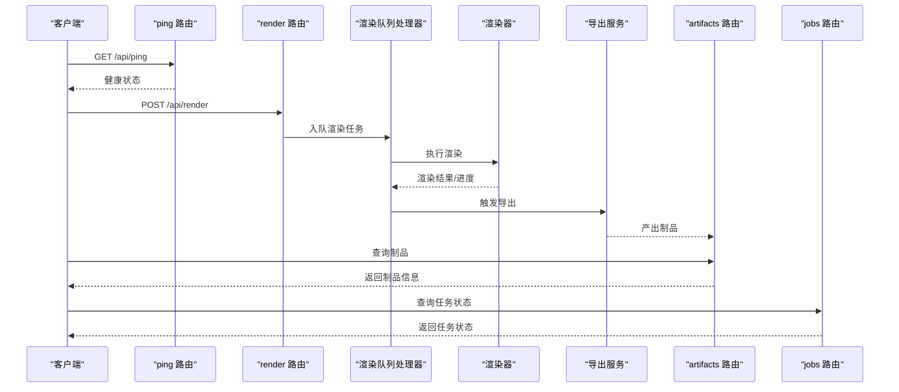
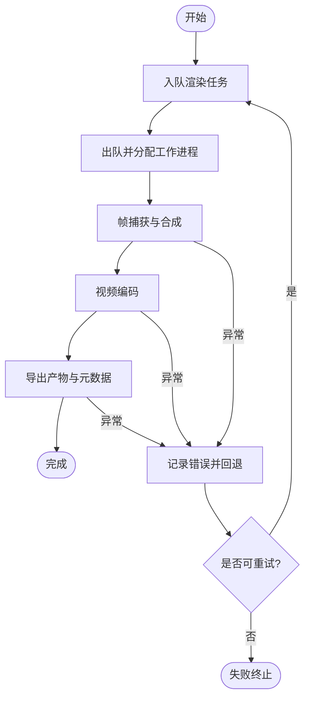
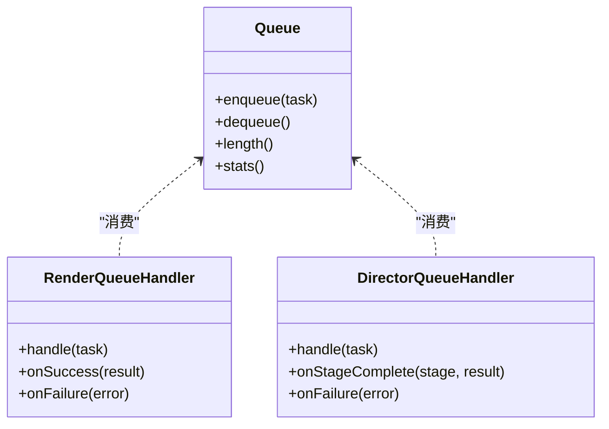
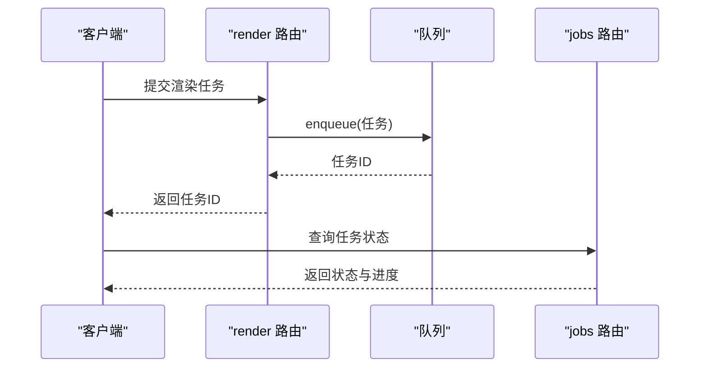
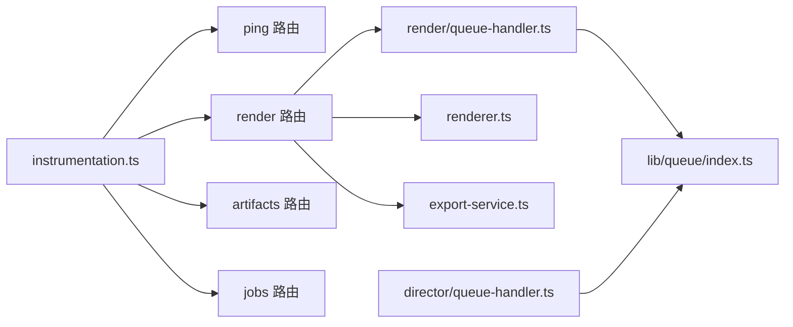

# 监控告警

<cite>
**本文引用的文件**   
- [src/instrumentation.ts](file://src/instrumentation.ts)
- [src/app/api/ping/route.ts](file://src/app/api/ping/route.ts)
- [src/features/render/queue-handler.ts](file://src/features/render/queue-handler.ts)
- [src/features/director/queue-handler.ts](file://src/features/director/queue-handler.ts)
- [src/lib/queue/index.ts](file://src/lib/queue/index.ts)
- [src/features/render/renderer.ts](file://src/features/render/renderer.ts)
- [src/features/render/export-service.ts](file://src/features/render/export-service.ts)
- [src/app/api/render/route.ts](file://src/app/api/render/route.ts)
- [src/app/api/artifacts/[id]/route.ts](file://src/app/api/artifacts/[id]/route.ts)
- [src/app/api/jobs/[id]/route.ts](file://src/app/api/jobs/[id]/route.ts)
- [src/app/canvas/export/export-api.ts](file://src/app/canvas/export/export-api.ts)
- [src/components/ui/queue-status-bar.tsx](file://src/components/ui/queue-status-bar.tsx)
</cite>

## 目录
1. [简介](#简介)
2. [项目结构](#项目结构)
3. [核心组件](#核心组件)
4. [架构总览](#架构总览)
5. [详细组件分析](#详细组件分析)
6. [依赖分析](#依赖分析)
7. [性能考虑](#性能考虑)
8. [故障排查指南](#故障排查指南)
9. [结论](#结论)
10. [附录](#附录)

## 简介
本文件为 CodeVideoCanvas 的监控与告警方案文档，覆盖以下方面：
- 应用性能指标采集：渲染任务状态、队列长度、API 响应时间、资源使用等
- 日志记录策略与结构化日志格式
- 健康检查端点与服务可用性监控
- 告警规则配置：错误率阈值、性能瓶颈检测、系统资源预警
- 第三方监控系统集成：Prometheus、Grafana、APM
- 监控仪表板配置与关键指标可视化建议

## 项目结构
本项目采用 Next.js 应用结构，监控相关能力集中在 instrumentation 模块与若干 API 路由中；渲染与导演管线各自维护队列处理器；UI 层提供队列状态展示。

图表来源
- [src/instrumentation.ts](file://src/instrumentation.ts)
- [src/app/api/ping/route.ts](file://src/app/api/ping/route.ts)
- [src/app/api/render/route.ts](file://src/app/api/render/route.ts)
- [src/app/api/artifacts/[id]/route.ts](file://src/app/api/artifacts/[id]/route.ts)
- [src/app/api/jobs/[id]/route.ts](file://src/app/api/jobs/[id]/route.ts)
- [src/features/render/renderer.ts](file://src/features/render/renderer.ts)
- [src/features/render/export-service.ts](file://src/features/render/export-service.ts)
- [src/app/canvas/export/export-api.ts](file://src/app/canvas/export/export-api.ts)
- [src/lib/queue/index.ts](file://src/lib/queue/index.ts)
- [src/features/render/queue-handler.ts](file://src/features/render/queue-handler.ts)
- [src/features/director/queue-handler.ts](file://src/features/director/queue-handler.ts)
- [src/components/ui/queue-status-bar.tsx](file://src/components/ui/queue-status-bar.tsx)

章节来源
- [src/instrumentation.ts](file://src/instrumentation.ts)
- [src/app/api/ping/route.ts](file://src/app/api/ping/route.ts)
- [src/features/render/queue-handler.ts](file://src/features/render/queue-handler.ts)
- [src/features/director/queue-handler.ts](file://src/features/director/queue-handler.ts)
- [src/lib/queue/index.ts](file://src/lib/queue/index.ts)
- [src/features/render/renderer.ts](file://src/features/render/renderer.ts)
- [src/features/render/export-service.ts](file://src/features/render/export-service.ts)
- [src/app/api/render/route.ts](file://src/app/api/render/route.ts)
- [src/app/api/artifacts/[id]/route.ts](file://src/app/api/artifacts/[id]/route.ts)
- [src/app/api/jobs/[id]/route.ts](file://src/app/api/jobs/[id]/route.ts)
- [src/app/canvas/export/export-api.ts](file://src/app/canvas/export/export-api.ts)
- [src/components/ui/queue-status-bar.tsx](file://src/components/ui/queue-status-bar.tsx)

## 核心组件
- 指标与日志基础设施（instrumentation）
  - 负责统一埋点、指标收集与结构化日志输出，供各模块复用
- 健康检查（ping 路由）
  - 暴露轻量健康检查接口，用于存活与就绪探测
- 渲染与导出链路
  - render 路由触发渲染任务；renderer 执行帧捕获与编码；export-service 管理导出产物
- 队列与任务调度
  - lib/queue 提供通用队列抽象；render/director 各自实现队列处理器
- 前端队列状态展示
  - queue-status-bar 组件展示队列运行态

章节来源
- [src/instrumentation.ts](file://src/instrumentation.ts)
- [src/app/api/ping/route.ts](file://src/app/api/ping/route.ts)
- [src/features/render/renderer.ts](file://src/features/render/renderer.ts)
- [src/features/render/export-service.ts](file://src/features/render/export-service.ts)
- [src/lib/queue/index.ts](file://src/lib/queue/index.ts)
- [src/features/render/queue-handler.ts](file://src/features/render/queue-handler.ts)
- [src/features/director/queue-handler.ts](file://src/features/director/queue-handler.ts)
- [src/components/ui/queue-status-bar.tsx](file://src/components/ui/queue-status-bar.tsx)

## 架构总览
下图展示了从 HTTP 请求到渲染与导出的关键路径，以及监控埋点位置。

图表来源
- [src/app/api/ping/route.ts](file://src/app/api/ping/route.ts)
- [src/app/api/render/route.ts](file://src/app/api/render/route.ts)
- [src/features/render/queue-handler.ts](file://src/features/render/queue-handler.ts)
- [src/features/render/renderer.ts](file://src/features/render/renderer.ts)
- [src/features/render/export-service.ts](file://src/features/render/export-service.ts)
- [src/app/api/artifacts/[id]/route.ts](file://src/app/api/artifacts/[id]/route.ts)
- [src/app/api/jobs/[id]/route.ts](file://src/app/api/jobs/[id]/route.ts)

## 详细组件分析

### 指标与日志基础设施（instrumentation）
- 职责
  - 提供统一的指标采集与结构化日志输出能力
  - 定义指标命名规范、标签维度与日志字段规范
- 关键能力
  - 计时器：用于 API 响应时间、渲染耗时等
  - 计数器：用于错误计数、任务完成计数等
  - 直方图/分位数：用于延迟分布
  - 指标导出：对接 Prometheus 或外部 APM
  - 结构化日志：包含 traceId、spanId、service、level、msg、duration_ms、error_code 等字段
- 集成建议
  - 在中间件或路由层自动注入 traceId/spanId
  - 在关键路径（入队、出队、渲染、导出、IO）埋点
  - 将指标以标准格式暴露给采集器

章节来源
- [src/instrumentation.ts](file://src/instrumentation.ts)

### 健康检查端点（ping）
- 功能
  - 提供轻量级健康检查，用于存活探针与负载均衡摘除
- 指标与日志
  - 记录每次健康检查的耗时与状态码
  - 失败时输出结构化错误日志
- 扩展建议
  - 增加就绪检查（数据库、对象存储、外部依赖）
  - 返回版本与构建信息便于灰度验证

章节来源
- [src/app/api/ping/route.ts](file://src/app/api/ping/route.ts)

### 渲染与导出链路
- 渲染器（renderer）
  - 负责帧捕获、合成与编码
  - 埋点：开始/结束时间、帧数、编码时长、失败原因
- 导出服务（export-service）
  - 管理导出任务生命周期、产物落盘与元数据
  - 埋点：导出开始/结束、大小、失败重试次数
- 导出 API（export-api）
  - 面向前端的导出操作封装，透传上下文与追踪信息

图表来源
- [src/features/render/renderer.ts](file://src/features/render/renderer.ts)
- [src/features/render/export-service.ts](file://src/features/render/export-service.ts)
- [src/app/canvas/export/export-api.ts](file://src/app/canvas/export/export-api.ts)

章节来源
- [src/features/render/renderer.ts](file://src/features/render/renderer.ts)
- [src/features/render/export-service.ts](file://src/features/render/export-service.ts)
- [src/app/canvas/export/export-api.ts](file://src/app/canvas/export/export-api.ts)

### 队列与任务调度
- 通用队列（lib/queue）
  - 提供入队/出队、并发控制、持久化与重试机制
  - 指标：队列长度、等待时间、吞吐、失败率
- 渲染队列处理器（render/queue-handler）
  - 消费渲染任务，协调 renderer 与 export-service
  - 指标：任务状态转换、平均排队时长、处理时长
- 导演队列处理器（director/queue-handler）
  - 消费导演阶段任务，编排多阶段流程
  - 指标：阶段成功率、阶段耗时、阻塞原因

图表来源
- [src/lib/queue/index.ts](file://src/lib/queue/index.ts)
- [src/features/render/queue-handler.ts](file://src/features/render/queue-handler.ts)
- [src/features/director/queue-handler.ts](file://src/features/director/queue-handler.ts)

章节来源
- [src/lib/queue/index.ts](file://src/lib/queue/index.ts)
- [src/features/render/queue-handler.ts](file://src/features/render/queue-handler.ts)
- [src/features/director/queue-handler.ts](file://src/features/director/queue-handler.ts)

### API 路由与指标埋点
- render 路由
  - 接收渲染请求，校验参数，写入队列，返回任务 ID
  - 埋点：请求耗时、入队成功/失败、参数校验错误
- artifacts 路由
  - 查询制品元数据与下载链接
  - 埋点：查询耗时、命中缓存比例、未找到计数
- jobs 路由
  - 查询任务状态与进度
  - 埋点：查询耗时、状态变更事件

图表来源
- [src/app/api/render/route.ts](file://src/app/api/render/route.ts)
- [src/app/api/artifacts/[id]/route.ts](file://src/app/api/artifacts/[id]/route.ts)
- [src/app/api/jobs/[id]/route.ts](file://src/app/api/jobs/[id]/route.ts)

章节来源
- [src/app/api/render/route.ts](file://src/app/api/render/route.ts)
- [src/app/api/artifacts/[id]/route.ts](file://src/app/api/artifacts/[id]/route.ts)
- [src/app/api/jobs/[id]/route.ts](file://src/app/api/jobs/[id]/route.ts)

### 前端队列状态展示
- queue-status-bar 组件
  - 展示当前队列长度、活跃任务数、最近失败项
  - 通过轮询或 WebSocket 获取实时状态
  - 建议在此处也上报“前端可见的错误”与“用户感知延迟”

章节来源
- [src/components/ui/queue-status-bar.tsx](file://src/components/ui/queue-status-bar.tsx)

## 依赖分析
- 内部依赖
  - instrumentation 被所有关键路径引用，作为统一埋点源
  - 队列模块被渲染与导演两条管线共用
  - API 路由依赖队列与业务服务
- 外部依赖
  - 指标采集器（如 Prometheus 客户端）
  - 日志聚合器（如 Loki/ELK）
  - APM 工具（如 OpenTelemetry 生态）

图表来源
- [src/instrumentation.ts](file://src/instrumentation.ts)
- [src/app/api/ping/route.ts](file://src/app/api/ping/route.ts)
- [src/app/api/render/route.ts](file://src/app/api/render/route.ts)
- [src/app/api/artifacts/[id]/route.ts](file://src/app/api/artifacts/[id]/route.ts)
- [src/app/api/jobs/[id]/route.ts](file://src/app/api/jobs/[id]/route.ts)
- [src/features/render/queue-handler.ts](file://src/features/render/queue-handler.ts)
- [src/features/render/renderer.ts](file://src/features/render/renderer.ts)
- [src/features/render/export-service.ts](file://src/features/render/export-service.ts)
- [src/lib/queue/index.ts](file://src/lib/queue/index.ts)
- [src/features/director/queue-handler.ts](file://src/features/director/queue-handler.ts)

章节来源
- [src/instrumentation.ts](file://src/instrumentation.ts)
- [src/app/api/ping/route.ts](file://src/app/api/ping/route.ts)
- [src/app/api/render/route.ts](file://src/app/api/render/route.ts)
- [src/app/api/artifacts/[id]/route.ts](file://src/app/api/artifacts/[id]/route.ts)
- [src/app/api/jobs/[id]/route.ts](file://src/app/api/jobs/[id]/route.ts)
- [src/features/render/queue-handler.ts](file://src/features/render/queue-handler.ts)
- [src/features/render/renderer.ts](file://src/features/render/renderer.ts)
- [src/features/render/export-service.ts](file://src/features/render/export-service.ts)
- [src/lib/queue/index.ts](file://src/lib/queue/index.ts)
- [src/features/director/queue-handler.ts](file://src/features/director/queue-handler.ts)

## 性能考虑
- 指标粒度
  - 按服务、路由、任务类型、阶段进行维度拆分，避免过度细分导致基数爆炸
- 采样与降采样
  - 对高频指标采用动态采样，保留尾部高延迟样本
- 异步与批量化
  - 批量上报指标与日志，降低 IO 开销
- 资源监控
  - 采集 CPU、内存、磁盘 IO、网络带宽、GPU 占用（若适用）
- 背压与限流
  - 队列长度超过阈值时触发限流或拒绝新任务，保护系统稳定

[本节为通用指导，不直接分析具体文件]

## 故障排查指南
- 快速定位
  - 通过 traceId 串联请求、队列任务与渲染步骤
  - 查看结构化日志中的 error_code、stack、duration_ms
- 常见问题
  - 队列积压：关注队列长度、出队速率、消费者数量
  - 渲染失败：查看编码器错误码、输入帧质量、内存峰值
  - 导出失败：检查对象存储权限、磁盘空间、并发限制
- 自愈与降级
  - 失败重试与退避策略
  - 降级模式：跳过非关键阶段、降低分辨率或帧率

章节来源
- [src/instrumentation.ts](file://src/instrumentation.ts)
- [src/features/render/queue-handler.ts](file://src/features/render/queue-handler.ts)
- [src/features/render/renderer.ts](file://src/features/render/renderer.ts)
- [src/features/render/export-service.ts](file://src/features/render/export-service.ts)

## 结论
通过在 instrumentation 层统一埋点，结合队列与渲染链路的关键节点指标，配合健康检查与结构化日志，可实现端到端可观测性。在此基础上，建立告警规则与仪表盘，可有效提升问题发现速度与排障效率。

[本节为总结性内容，不直接分析具体文件]

## 附录

### 指标清单与采集点
- 通用
  - http_request_duration_seconds（直方图）
  - http_requests_total（计数器）
  - http_errors_total（计数器）
  - active_traces（ Gauge ）
- 队列
  - queue_length（Gauge）
  - queue_wait_seconds（直方图）
  - queue_throughput_per_second（计数器）
  - queue_retries_total（计数器）
- 渲染
  - render_start_total（计数器）
  - render_success_total（计数器）
  - render_failed_total（计数器）
  - render_duration_seconds（直方图）
  - frames_captured_total（计数器）
  - encode_duration_seconds（直方图）
- 导出
  - export_started_total（计数器）
  - export_completed_total（计数器）
  - export_failed_total（计数器）
  - export_size_bytes（直方图）
- 资源
  - process_cpu_usage_ratio（Gauge）
  - process_memory_usage_bytes（Gauge）
  - disk_io_bytes_total（计数器）
  - network_bytes_total（计数器）

章节来源
- [src/instrumentation.ts](file://src/instrumentation.ts)
- [src/features/render/queue-handler.ts](file://src/features/render/queue-handler.ts)
- [src/features/render/renderer.ts](file://src/features/render/renderer.ts)
- [src/features/render/export-service.ts](file://src/features/render/export-service.ts)

### 结构化日志字段规范
- 必填字段
  - timestamp、level、service、trace_id、span_id、msg
- 可选字段
  - duration_ms、error_code、error_message、stack、user_id、project_id、task_id、stage、metadata
- 示例说明
  - 在入队、出队、渲染开始/结束、导出开始/结束、错误分支均输出对应日志

章节来源
- [src/instrumentation.ts](file://src/instrumentation.ts)

### 健康检查与可用性监控
- 存活探针
  - GET /api/ping，返回 200 表示存活
- 就绪探针
  - 可扩展为 /api/ready，检查数据库、对象存储、外部依赖
- 可用性指标
  - 基于 ping 的成功率与延迟计算服务可用性

章节来源
- [src/app/api/ping/route.ts](file://src/app/api/ping/route.ts)

### 告警规则建议
- 错误率
  - 5 分钟内 HTTP 错误率 > 1% 持续 5 分钟
  - 渲染失败率 > 5% 持续 10 分钟
- 性能瓶颈
  - P95 渲染耗时 > 阈值（按分辨率/帧率设定）
  - 队列等待 P95 > 阈值且队列长度持续增长
- 系统资源
  - CPU 使用率 > 85% 持续 5 分钟
  - 内存使用率 > 90% 持续 5 分钟
  - 磁盘可用空间 < 10%
- 通知渠道
  - 企业微信/钉钉/邮件/短信，分级告警

[本节为通用建议，不直接分析具体文件]

### 第三方系统集成
- Prometheus
  - 暴露 /metrics 端点，抓取间隔 15s
  - 使用官方 exporter 或自定义指标导出
- Grafana
  - 导入预置面板，创建自定义看板
- APM（OpenTelemetry 生态）
  - 启用 tracing，关联日志与指标
  - 设置采样策略与采样键

[本节为通用建议，不直接分析具体文件]

### 仪表板与可视化建议
- 概览
  - 请求总量、错误率、P95/P99 延迟
- 队列
  - 队列长度趋势、出队速率、重试次数
- 渲染
  - 渲染时长分布、帧捕获速率、编码时长
- 导出
  - 导出成功率、产物大小分布
- 资源
  - CPU/内存/磁盘/网络使用率

[本节为通用建议，不直接分析具体文件]