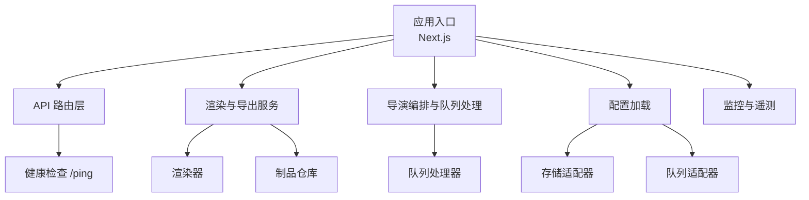
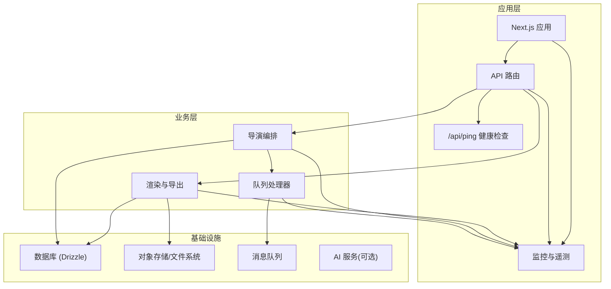
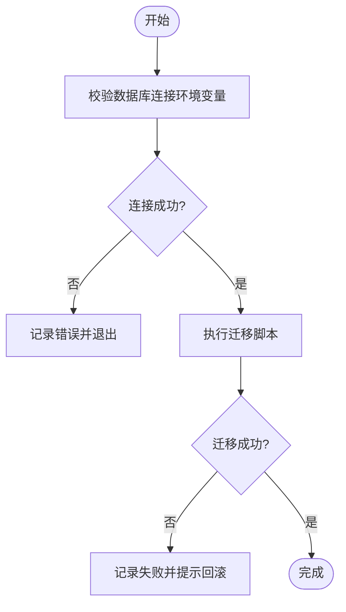
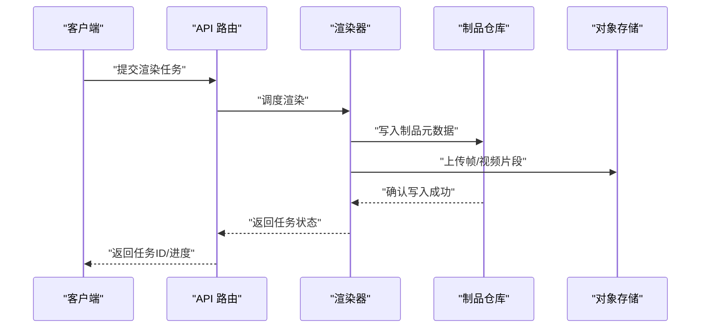
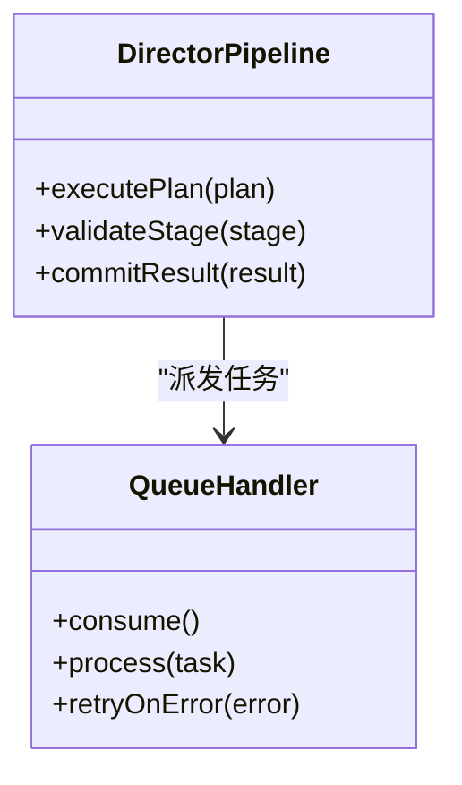
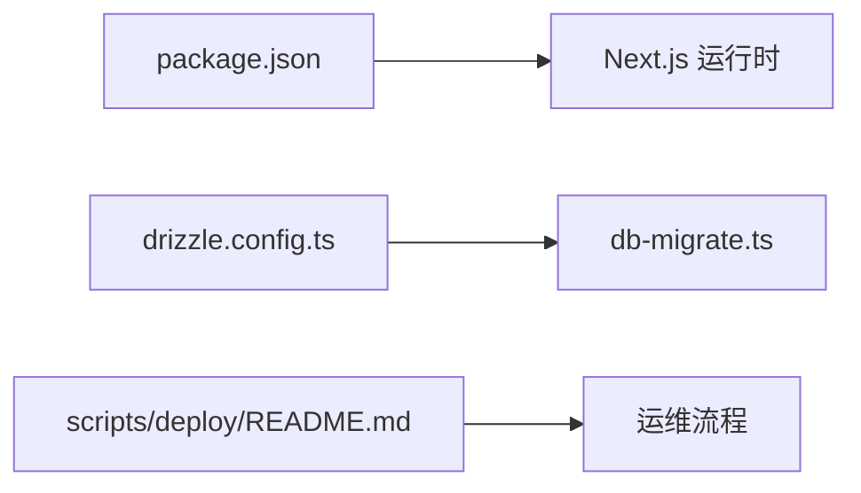

# 部署运维

<cite>
**本文引用的文件**   
- [README.md](file://README.md)
- [package.json](file://package.json)
- [next.config.ts](file://next.config.ts)
- [drizzle.config.ts](file://drizzle.config.ts)
- [scripts/deploy/README.md](file://scripts/deploy/README.md)
- [scripts/setup/db-migrate.ts](file://scripts/setup/db-migrate.ts)
- [src/instrumentation.ts](file://src/instrumentation.ts)
- [src/app/api/ping/route.ts](file://src/app/api/ping/route.ts)
- [src/features/render/renderer.ts](file://src/features/render/renderer.ts)
- [src/features/render/repository.ts](file://src/features/render/repository.ts)
- [src/features/director/queue-handler.ts](file://src/features/director/queue-handler.ts)
- [src/lib/config/index.ts](file://src/lib/config/index.ts)
- [src/lib/storage/index.ts](file://src/lib/storage/index.ts)
- [src/lib/queue/index.ts](file://src/lib/queue/index.ts)
</cite>

## 目录
1. [简介](#简介)
2. [项目结构](#项目结构)
3. [核心组件](#核心组件)
4. [架构总览](#架构总览)
5. [详细组件分析](#详细组件分析)
6. [依赖分析](#依赖分析)
7. [性能考虑](#性能考虑)
8. [故障排查指南](#故障排查指南)
9. [结论](#结论)
10. [附录](#附录)

## 简介
本运维文档面向生产环境，覆盖 CodeVideoCanvas 的服务器要求、环境变量与依赖管理、监控告警与指标采集、日志分析方法、备份恢复与灾难恢复、安全与权限最佳实践，以及扩展性与高可用配置方案。内容基于仓库现有脚本、配置文件与运行时入口进行梳理，确保可落地执行。

## 项目结构
CodeVideoCanvas 采用 Next.js 应用形态，结合 Drizzle ORM 与自定义渲染/导演管线。运维相关的关键位置包括：
- 构建与运行入口：Next.js 配置与包管理定义
- 数据库迁移脚本：用于初始化或升级数据模型
- 部署脚本说明：提供部署流程指引
- 运行时健康检查端点：用于负载均衡与健康探测
- 监控与遥测：OpenTelemetry 集成入口
- 外部依赖接入：存储、队列、AI 服务等通过配置注入

**图表来源**
- [next.config.ts](file://next.config.ts)
- [src/app/api/ping/route.ts](file://src/app/api/ping/route.ts)
- [src/features/render/renderer.ts](file://src/features/render/renderer.ts)
- [src/features/render/repository.ts](file://src/features/render/repository.ts)
- [src/features/director/queue-handler.ts](file://src/features/director/queue-handler.ts)
- [src/lib/config/index.ts](file://src/lib/config/index.ts)
- [src/lib/storage/index.ts](file://src/lib/storage/index.ts)
- [src/lib/queue/index.ts](file://src/lib/queue/index.ts)

**章节来源**
- [README.md](file://README.md)
- [package.json](file://package.json)
- [next.config.ts](file://next.config.ts)
- [drizzle.config.ts](file://drizzle.config.ts)
- [scripts/deploy/README.md](file://scripts/deploy/README.md)
- [scripts/setup/db-migrate.ts](file://scripts/setup/db-migrate.ts)

## 核心组件
- 应用运行时与配置
  - Next.js 应用由 next.config.ts 驱动，负责构建产物与运行时行为。
  - 配置加载模块集中读取环境变量并暴露给各子系统使用。
- 数据库与迁移
  - 使用 Drizzle ORM，迁移脚本位于 scripts/setup/db-migrate.ts，配合 drizzle.config.ts 完成数据模型变更。
- 渲染与导出
  - 渲染器负责帧序列生成与编码；制品仓库负责持久化输出结果。
- 导演编排与任务队列
  - 导演管线协调多阶段任务，队列处理器消费任务并执行。
- 监控与遥测
  - OpenTelemetry 在 instrumentation.ts 中初始化，为应用埋点与指标上报提供基础能力。
- 健康检查
  - /api/ping 提供轻量健康检查，便于负载均衡与容器编排探针。

**章节来源**
- [next.config.ts](file://next.config.ts)
- [src/lib/config/index.ts](file://src/lib/config/index.ts)
- [drizzle.config.ts](file://drizzle.config.ts)
- [scripts/setup/db-migrate.ts](file://scripts/setup/db-migrate.ts)
- [src/features/render/renderer.ts](file://src/features/render/renderer.ts)
- [src/features/render/repository.ts](file://src/features/render/repository.ts)
- [src/features/director/queue-handler.ts](file://src/features/director/queue-handler.ts)
- [src/instrumentation.ts](file://src/instrumentation.ts)
- [src/app/api/ping/route.ts](file://src/app/api/ping/route.ts)

## 架构总览
下图展示了生产环境下的关键交互：请求进入 Next.js 应用后，经由 API 路由分发到业务逻辑（渲染、导出、导演编排），并通过配置加载获取外部依赖（存储、队列、AI 等）。监控与遥测贯穿整个链路，健康检查端点用于外部探测。

**图表来源**
- [src/app/api/ping/route.ts](file://src/app/api/ping/route.ts)
- [src/features/render/renderer.ts](file://src/features/render/renderer.ts)
- [src/features/render/repository.ts](file://src/features/render/repository.ts)
- [src/features/director/queue-handler.ts](file://src/features/director/queue-handler.ts)
- [src/instrumentation.ts](file://src/instrumentation.ts)
- [drizzle.config.ts](file://drizzle.config.ts)

## 详细组件分析

### 配置与环境变量
- 配置加载
  - 配置模块统一从环境变量读取参数，供渲染、存储、队列等子系统使用。
- 关键配置项建议
  - 数据库连接串、存储后端地址、队列连接信息、AI 服务密钥与端点、监控上报目标等。
- 验证与默认值
  - 建议在启动前校验必填项并提供合理默认值，避免运行时错误。

**章节来源**
- [src/lib/config/index.ts](file://src/lib/config/index.ts)

### 数据库与迁移
- 迁移脚本
  - 使用 scripts/setup/db-migrate.ts 执行数据模型变更，确保生产环境版本一致。
- 配置
  - drizzle.config.ts 指定数据库连接与迁移路径。
- 回滚策略
  - 建议对每次迁移编写反向脚本或在发布前进行灰度验证。

**图表来源**
- [scripts/setup/db-migrate.ts](file://scripts/setup/db-migrate.ts)
- [drizzle.config.ts](file://drizzle.config.ts)

**章节来源**
- [scripts/setup/db-migrate.ts](file://scripts/setup/db-migrate.ts)
- [drizzle.config.ts](file://drizzle.config.ts)

### 渲染与导出服务
- 渲染器
  - 负责将时间线/分镜转换为帧序列并进行编码输出。
- 制品仓库
  - 负责将渲染产物写入持久化存储，并维护元数据索引。
- 并发与资源
  - 建议根据 CPU/GPU 资源限制并发度，避免过载。

**图表来源**
- [src/features/render/renderer.ts](file://src/features/render/renderer.ts)
- [src/features/render/repository.ts](file://src/features/render/repository.ts)

**章节来源**
- [src/features/render/renderer.ts](file://src/features/render/renderer.ts)
- [src/features/render/repository.ts](file://src/features/render/repository.ts)

### 导演编排与队列处理
- 导演管线
  - 协调多个阶段（如素材摄取、计划生成、合成、收尾）的执行顺序与依赖。
- 队列处理器
  - 从队列中拉取任务并执行，支持重试与幂等性保证。

**图表来源**
- [src/features/director/queue-handler.ts](file://src/features/director/queue-handler.ts)

**章节来源**
- [src/features/director/queue-handler.ts](file://src/features/director/queue-handler.ts)

### 监控与遥测
- OpenTelemetry 集成
  - 在 instrumentation.ts 中初始化 Tracing/Metrics/Logs，为 API、渲染、队列等关键路径埋点。
- 指标建议
  - 请求延迟、错误率、队列积压、渲染时长、存储吞吐、数据库连接池利用率等。
- 告警阈值
  - 建议设置 SLO 相关的阈值，例如 P99 延迟、错误率上限、队列深度等。

**章节来源**
- [src/instrumentation.ts](file://src/instrumentation.ts)

### 健康检查
- /api/ping
  - 提供轻量级健康检查响应，适合用于负载均衡与容器编排探针。
- 探针策略
  - 建议同时实现存活探针（liveness）与就绪探针（readiness），后者可包含依赖检查（数据库、存储、队列）。

**章节来源**
- [src/app/api/ping/route.ts](file://src/app/api/ping/route.ts)

## 依赖分析
- 构建与运行
  - package.json 定义了依赖与脚本命令，Next.js 作为主框架。
- 数据库
  - drizzle.config.ts 指定 ORM 配置与迁移路径。
- 部署脚本
  - scripts/deploy/README.md 提供部署流程说明与注意事项。

**图表来源**
- [package.json](file://package.json)
- [drizzle.config.ts](file://drizzle.config.ts)
- [scripts/deploy/README.md](file://scripts/deploy/README.md)

**章节来源**
- [package.json](file://package.json)
- [drizzle.config.ts](file://drizzle.config.ts)
- [scripts/deploy/README.md](file://scripts/deploy/README.md)

## 性能考虑
- 并发控制
  - 渲染与导出任务应限制并发度，避免耗尽 CPU/GPU 与内存。
- 缓存策略
  - 对中间产物与重复计算结果进行缓存，减少冗余工作。
- 资源隔离
  - 使用进程/容器隔离不同任务类型，防止相互影响。
- 背压与限流
  - 队列处理器应具备背压机制，避免上游压力导致系统崩溃。
- 指标观测
  - 持续采集关键指标，建立基线与趋势分析，指导容量规划。

[本节为通用指导，不直接分析具体文件]

## 故障排查指南
- 常见问题定位
  - 健康检查失败：检查 /api/ping 响应与依赖连通性。
  - 渲染失败：查看渲染器日志与制品仓库写入状态。
  - 队列堆积：观察队列处理器消费速率与重试次数。
  - 数据库异常：核对连接串、权限与迁移版本一致性。
- 日志方法
  - 结构化日志：为每个任务附加唯一 ID，便于追踪。
  - 分级输出：区分 info/warn/error，并保留上下文字段。
  - 聚合收集：将应用日志与系统日志统一收集与分析。
- 快速恢复
  - 自动重试与退避策略，避免瞬时故障放大。
  - 降级模式：在依赖不可用时返回友好错误与重试建议。

**章节来源**
- [src/app/api/ping/route.ts](file://src/app/api/ping/route.ts)
- [src/features/render/renderer.ts](file://src/features/render/renderer.ts)
- [src/features/director/queue-handler.ts](file://src/features/director/queue-handler.ts)

## 结论
通过统一的配置加载、健壮的迁移流程、清晰的渲染与队列处理链路、完善的监控与告警体系，以及规范的健康检查与日志方法，CodeVideoCanvas 可在生产环境中稳定运行并具备良好的可扩展性与高可用性。建议在生产部署前完成全链路演练与容量评估，确保满足业务 SLA。

[本节为总结性内容，不直接分析具体文件]

## 附录

### 服务器与操作系统要求
- Node.js 版本与包管理器
  - 依据 package.json 指定的版本安装 Node.js 与 pnpm。
- 操作系统
  - 推荐 Linux 发行版，具备稳定的内核与网络栈。
- 硬件建议
  - 根据渲染并发与分辨率估算 CPU/GPU/内存需求。

**章节来源**
- [package.json](file://package.json)

### 环境变量清单（示例）
- 数据库
  - DATABASE_URL：数据库连接串
- 存储
  - STORAGE_BACKEND：存储后端类型
  - STORAGE_BUCKET/PATH：桶名或根路径
- 队列
  - QUEUE_BACKEND：队列后端类型
  - QUEUE_CONNECTION：连接信息
- AI 服务
  - AI_SERVICE_ENDPOINT：AI 服务端点
  - AI_SERVICE_API_KEY：鉴权密钥
- 监控
  - OTEL_EXPORTER_*：监控上报配置

**章节来源**
- [src/lib/config/index.ts](file://src/lib/config/index.ts)

### 依赖管理与构建
- 安装依赖
  - 使用 pnpm install 安装所有依赖。
- 构建产物
  - 使用 Next.js 构建命令生成静态/服务端产物。
- 锁定版本
  - 使用 pnpm-lock.yaml 锁定依赖版本，确保可重现构建。

**章节来源**
- [package.json](file://package.json)
- [pnpm-lock.yaml](file://pnpm-lock.yaml)

### 部署流程
- 前置准备
  - 准备服务器、域名、证书、数据库实例、对象存储与队列服务。
- 迁移数据库
  - 执行 db-migrate.ts 完成数据模型变更。
- 构建与发布
  - 构建 Next.js 应用，部署到目标环境。
- 启动服务
  - 启动 Next.js 服务进程，配置进程守护与重启策略。
- 健康检查
  - 配置负载均衡与探针，确保流量仅路由至健康实例。

**章节来源**
- [scripts/deploy/README.md](file://scripts/deploy/README.md)
- [scripts/setup/db-migrate.ts](file://scripts/setup/db-migrate.ts)

### 监控告警与指标
- 指标采集
  - 启用 OpenTelemetry，采集请求、渲染、队列、数据库等指标。
- 告警规则
  - 基于 SLO 设置延迟、错误率、队列深度等阈值。
- 可视化
  - 将指标与日志接入统一平台，建立仪表盘与告警通道。

**章节来源**
- [src/instrumentation.ts](file://src/instrumentation.ts)

### 日志分析与排障
- 日志格式
  - 结构化 JSON，包含时间戳、级别、任务 ID、上下文。
- 检索与关联
  - 通过任务 ID 串联 API、渲染、队列与存储日志。
- 问题定位
  - 关注错误堆栈与耗时分布，识别瓶颈与异常路径。

**章节来源**
- [src/features/render/renderer.ts](file://src/features/render/renderer.ts)
- [src/features/director/queue-handler.ts](file://src/features/director/queue-handler.ts)

### 备份恢复与灾难恢复
- 备份策略
  - 定期备份数据库与对象存储中的制品。
- 恢复演练
  - 定期进行恢复演练，验证 RTO/RPO 目标。
- 容灾方案
  - 多区域部署与跨区复制，提升可用性。

[本节为通用指导，不直接分析具体文件]

### 安全与权限管理
- 最小权限原则
  - 为数据库、存储、队列分配最小必要权限。
- 密钥管理
  - 使用密钥管理服务或环境变量注入，避免硬编码。
- 网络安全
  - 启用 HTTPS、访问控制列表与防火墙策略。
- 审计与合规
  - 开启访问审计日志，满足合规要求。

[本节为通用指导，不直接分析具体文件]

### 扩展性与高可用
- 水平扩展
  - 无状态实例横向扩展，结合队列与对象存储解耦。
- 弹性伸缩
  - 基于队列深度与 CPU 使用率触发扩缩容。
- 多活部署
  - 多区域部署与流量切换，降低单点风险。

[本节为通用指导，不直接分析具体文件]