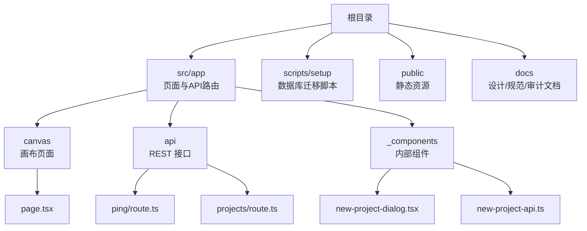
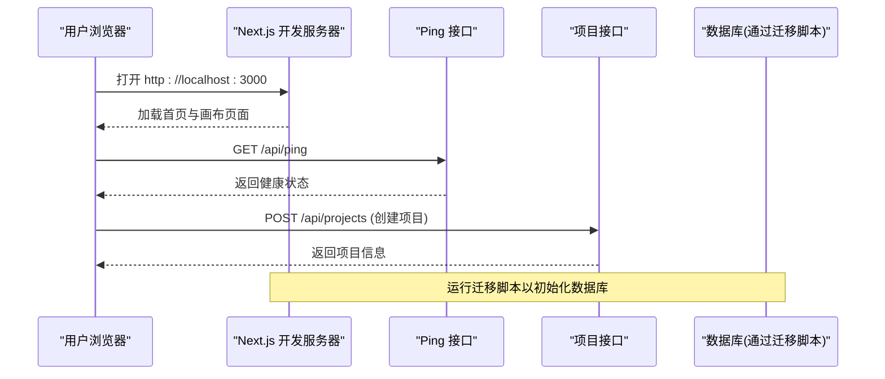
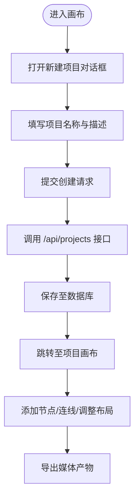
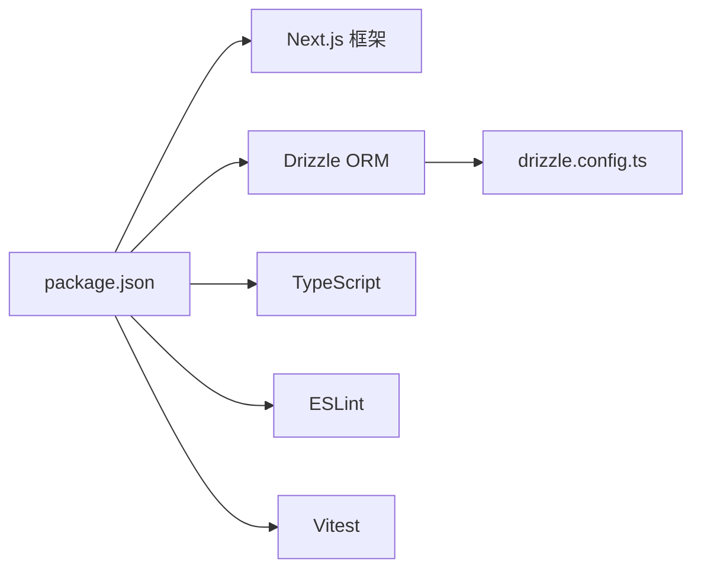

# 快速开始

<cite>
**本文引用的文件**   
- [README.md](file://README.md)
- [package.json](file://package.json)
- [drizzle.config.ts](file://drizzle.config.ts)
- [scripts/setup/db-migrate.ts](file://scripts/setup/db-migrate.ts)
- [src/app/api/ping/route.ts](file://src/app/api/ping/route.ts)
- [src/app/canvas/page.tsx](file://src/app/canvas/page.tsx)
- [src/app/_components/new-project-dialog.tsx](file://src/app/_components/new-project-dialog.tsx)
- [src/app/_components/new-project-api.ts](file://src/app/_components/new-project-api.ts)
- [src/app/api/projects/route.ts](file://src/app/api/projects/route.ts)
- [next.config.ts](file://next.config.ts)
- [tsconfig.json](file://tsconfig.json)
</cite>

## 目录
1. [简介](#简介)
2. [项目结构](#项目结构)
3. [核心组件](#核心组件)
4. [架构总览](#架构总览)
5. [详细组件分析](#详细组件分析)
6. [依赖分析](#依赖分析)
7. [性能考虑](#性能考虑)
8. [故障排查指南](#故障排查指南)
9. [结论](#结论)
10. [附录](#附录)

## 简介
本指南面向首次接触 CodeVideoCanvas 的开发者与使用者，目标是帮助你在最短时间内完成环境搭建、数据库初始化、本地开发服务器启动，并创建你的第一个项目与基础编辑操作。文档同时涵盖常见环境问题排查与开发工作流最佳实践（热重载、调试技巧、代码格式化等）。

## 项目结构
本项目采用 Next.js App Router 组织前端页面与 API 路由，结合 Drizzle ORM 进行数据持久化，提供画布编辑器、导出渲染、项目管理等能力。关键入口与脚本：
- 应用入口与配置：Next.js 配置文件与 TypeScript 配置
- 数据库迁移脚本：位于 scripts/setup 下
- 示例 API：用于健康检查与项目创建
- 画布页面与新建项目对话框：用于演示基本编辑流程

图表来源
- [next.config.ts](file://next.config.ts)
- [src/app/canvas/page.tsx](file://src/app/canvas/page.tsx)
- [src/app/api/ping/route.ts](file://src/app/api/ping/route.ts)
- [src/app/api/projects/route.ts](file://src/app/api/projects/route.ts)
- [src/app/_components/new-project-dialog.tsx](file://src/app/_components/new-project-dialog.tsx)
- [src/app/_components/new-project-api.ts](file://src/app/_components/new-project-api.ts)

章节来源
- [README.md](file://README.md)
- [package.json](file://package.json)
- [next.config.ts](file://next.config.ts)
- [tsconfig.json](file://tsconfig.json)

## 核心组件
- 画布编辑器：提供可视化编辑体验，是项目的核心交互界面
- 项目管理：支持创建、列出与管理视频项目
- 导出与渲染：将画布内容导出为媒体产物
- 设置与主题：管理应用级配置与外观

章节来源
- [src/app/canvas/page.tsx](file://src/app/canvas/page.tsx)
- [src/app/_components/new-project-dialog.tsx](file://src/app/_components/new-project-dialog.tsx)
- [src/app/_components/new-project-api.ts](file://src/app/_components/new-project-api.ts)
- [src/app/api/projects/route.ts](file://src/app/api/projects/route.ts)

## 架构总览
下图展示了从浏览器到后端 API 再到数据库的关键调用路径，以及本地开发时的热重载机制。

图表来源
- [src/app/api/ping/route.ts](file://src/app/api/ping/route.ts)
- [src/app/api/projects/route.ts](file://src/app/api/projects/route.ts)
- [scripts/setup/db-migrate.ts](file://scripts/setup/db-migrate.ts)

## 详细组件分析

### 环境准备与安装
- Node.js 版本要求
  - 请查看 package.json 中的 engines 字段或 README 说明，确保使用兼容的 Node.js 版本
- 包管理器选择
  - 推荐使用 pnpm（仓库包含 pnpm-lock.yaml），也可使用 npm 或 yarn
- 克隆与安装
  - 克隆仓库后，在项目根目录执行包管理器安装命令
- 环境变量
  - 根据 README 或 next.config.ts 的配置，准备必要的环境变量（如数据库连接串）
- 数据库初始化
  - 使用 scripts/setup/db-migrate.ts 执行迁移，初始化表结构与种子数据
- 启动开发服务器
  - 使用 package.json 中定义的 dev 脚本启动 Next.js 开发服务器

章节来源
- [README.md](file://README.md)
- [package.json](file://package.json)
- [scripts/setup/db-migrate.ts](file://scripts/setup/db-migrate.ts)
- [drizzle.config.ts](file://drizzle.config.ts)
- [next.config.ts](file://next.config.ts)

### 第一个项目创建与基础编辑
- 打开画布页面
  - 访问 /canvas 进入画布编辑器
- 创建新项目
  - 在画布页或首页使用“新建项目”对话框
  - 对话框调用内部 API 完成项目创建
- 基础编辑操作
  - 在画布中添加节点、连线、调整布局
  - 预览与导出功能可在导出页面使用

图表来源
- [src/app/canvas/page.tsx](file://src/app/canvas/page.tsx)
- [src/app/_components/new-project-dialog.tsx](file://src/app/_components/new-project-dialog.tsx)
- [src/app/_components/new-project-api.ts](file://src/app/_components/new-project-api.ts)
- [src/app/api/projects/route.ts](file://src/app/api/projects/route.ts)

章节来源
- [src/app/canvas/page.tsx](file://src/app/canvas/page.tsx)
- [src/app/_components/new-project-dialog.tsx](file://src/app/_components/new-project-dialog.tsx)
- [src/app/_components/new-project-api.ts](file://src/app/_components/new-project-api.ts)
- [src/app/api/projects/route.ts](file://src/app/api/projects/route.ts)

### 健康检查与本地验证
- 使用 /api/ping 接口验证服务是否正常运行
- 若返回成功响应，说明 Next.js 服务器与路由已正确加载

章节来源
- [src/app/api/ping/route.ts](file://src/app/api/ping/route.ts)

## 依赖分析
- 运行时依赖
  - Next.js 作为应用框架
  - Drizzle ORM 用于数据库迁移与查询
- 开发依赖
  - TypeScript、ESLint、Vitest 等工具链
- 外部集成点
  - 数据库驱动（由 drizzle.config.ts 指定）
  - 可能的第三方服务（如 AI 适配器、存储服务等，按需启用）

图表来源
- [package.json](file://package.json)
- [drizzle.config.ts](file://drizzle.config.ts)

章节来源
- [package.json](file://package.json)
- [drizzle.config.ts](file://drizzle.config.ts)

## 性能考虑
- 开发模式
  - 使用 Next.js 开发服务器的热重载提升迭代效率
- 构建优化
  - 合理拆分页面与组件，避免首屏过大
- 数据库查询
  - 使用 Drizzle 的索引与分页策略，减少不必要的数据传输
- 导出与渲染
  - 对大任务采用队列与异步处理，避免阻塞主线程

[本节为通用指导，不直接分析具体文件]

## 故障排查指南
- 端口占用
  - 默认 3000 端口被占用时，修改端口或释放占用进程
- 环境变量缺失
  - 确认数据库连接串等关键变量已配置
- 数据库迁移失败
  - 检查数据库可达性与权限；重新执行迁移脚本
- 路由不可用
  - 使用 /api/ping 验证服务是否正常；检查路由文件是否存在且无语法错误
- 包管理器问题
  - 清理缓存并重新安装依赖；确保 Node.js 版本满足要求

章节来源
- [src/app/api/ping/route.ts](file://src/app/api/ping/route.ts)
- [scripts/setup/db-migrate.ts](file://scripts/setup/db-migrate.ts)
- [drizzle.config.ts](file://drizzle.config.ts)
- [package.json](file://package.json)

## 结论
通过以上步骤，你应能顺利完成 CodeVideoCanvas 的环境搭建、数据库初始化与本地开发服务器启动，并创建第一个项目与基础编辑操作。建议在日常开发中遵循热重载、调试与格式化的最佳实践，以提升效率与代码质量。

[本节为总结性内容，不直接分析具体文件]

## 附录
- 常用命令
  - 安装依赖：使用 pnpm/npm/yarn 安装
  - 启动开发服务器：执行 dev 脚本
  - 运行迁移：执行 scripts/setup/db-migrate.ts
- 参考文档
  - README.md 中的安装与使用说明
  - docs 目录下的设计与规范文档

章节来源
- [README.md](file://README.md)
- [scripts/setup/db-migrate.ts](file://scripts/setup/db-migrate.ts)