# 技术栈

<cite>
**本文引用的文件**   
- [package.json](file://package.json)
- [next.config.ts](file://next.config.ts)
- [tsconfig.json](file://tsconfig.json)
- [postcss.config.mjs](file://postcss.config.mjs)
- [drizzle.config.ts](file://drizzle.config.ts)
- [vitest.config.ts](file://vitest.config.ts)
- [eslint.config.mjs](file://eslint.config.mjs)
- [src/app/layout.tsx](file://src/app/layout.tsx)
- [src/app/page.tsx](file://src/app/page.tsx)
- [src/app/globals.css](file://src/app/globals.css)
- [src/features/canvas/types.ts](file://src/features/canvas/types.ts)
- [src/features/director/pipeline.ts](file://src/features/director/pipeline.ts)
- [src/features/render/renderer.ts](file://src/features/render/renderer.ts)
</cite>

## 目录
1. [简介](#简介)
2. [项目结构](#项目结构)
3. [核心组件](#核心组件)
4. [架构总览](#架构总览)
5. [详细组件分析](#详细组件分析)
6. [依赖关系分析](#依赖关系分析)
7. [性能考量](#性能考量)
8. [故障排查指南](#故障排查指南)
9. [结论](#结论)
10. [附录](#附录)

## 简介
本技术栈文档面向 CodeVideoCanvas 项目的开发者与维护者，系统梳理并解释项目的核心技术选型与配置，包括：
- Next.js 14+ 作为全栈框架的优势与应用场景
- React 组件架构与页面路由组织
- TypeScript 类型系统与编译配置
- Tailwind CSS 样式方案的选择原因与配置方式
- 数据库 ORM（Drizzle）的集成与迁移策略
- 测试框架（Vitest）的配置与使用
- 代码质量工具（ESLint）的规则与规范
- 各技术版本兼容性与依赖关系说明
- 技术栈架构图与模块依赖关系图

目标是帮助读者快速理解整体技术生态、模块职责边界以及关键集成点。

## 项目结构
本项目采用基于文件系统的路由与功能域分层组织：
- src/app：Next.js App Router 应用入口、布局、页面与 API 路由
- src/components：可复用 UI 组件与图标
- src/features：按业务领域划分的特性模块（如 canvas、director、render、ai 等）
- src/lib：通用库与工具（配置、数据库、队列、存储、布局、动画等）
- scripts：部署、开发、设置与实验脚本
- docs：设计、约定、审计与运维文档
- public：静态资源

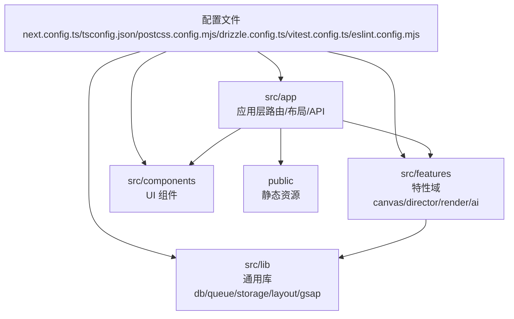

图表来源
- [next.config.ts:1-200](file://next.config.ts#L1-L200)
- [tsconfig.json:1-200](file://tsconfig.json#L1-L200)
- [postcss.config.mjs:1-200](file://postcss.config.mjs#L1-L200)
- [drizzle.config.ts:1-200](file://drizzle.config.ts#L1-L200)
- [vitest.config.ts:1-200](file://vitest.config.ts#L1-L200)
- [eslint.config.mjs:1-200](file://eslint.config.mjs#L1-L200)

章节来源
- [src/app/layout.tsx:1-200](file://src/app/layout.tsx#L1-L200)
- [src/app/page.tsx:1-200](file://src/app/page.tsx#L1-L200)
- [src/app/globals.css:1-200](file://src/app/globals.css#L1-L200)

## 核心组件
本节聚焦于技术栈的关键选择与落地方式：

- Next.js 14+（App Router）
  - 优势：服务端渲染与客户端渲染统一模型、内置路由与数据获取、API 路由、中间件与流式响应、与 React Server Components 深度集成。
  - 应用场景：复杂交互的视频创作平台，需要前后端一体化、SEO 友好与高性能首屏。
  - 配置要点：应用根布局、全局样式注入、环境变量与构建优化。

- React 组件架构
  - 组织方式：src/app 负责页面与路由；src/components 提供基础 UI；src/features 承载业务逻辑与状态。
  - 模式：页面组合、容器与展示分离、特性内聚。

- TypeScript 类型系统
  - 作用：强类型约束、提升可维护性与重构安全性。
  - 配置要点：路径别名、严格检查、JSX 支持、Node 环境类型。

- Tailwind CSS 样式方案
  - 选择原因：原子化类名、高一致性、与 React 组件天然契合、按需生成减少体积。
  - 配置要点：PostCSS 插件链、主题扩展、全局样式入口。

- Drizzle（数据库 ORM）
  - 选择原因：轻量、类型安全、SQL 优先、与 Node/Edge 运行时兼容性好。
  - 集成要点：schema 定义、迁移与种子、连接池与事务。

- Vitest（测试框架）
  - 选择原因：原生 ES 模块、与 Vite 生态一致、速度快、与 TypeScript/Tailwind 良好兼容。
  - 配置要点：测试环境、覆盖率、模拟与 fixtures。

- ESLint（代码质量）
  - 选择原因：规则丰富、可定制、与编辑器集成良好。
  - 配置要点：Next.js 推荐规则、React/TypeScript 规则、自定义规则与忽略策略。

章节来源
- [next.config.ts:1-200](file://next.config.ts#L1-L200)
- [tsconfig.json:1-200](file://tsconfig.json#L1-L200)
- [postcss.config.mjs:1-200](file://postcss.config.mjs#L1-L200)
- [drizzle.config.ts:1-200](file://drizzle.config.ts#L1-L200)
- [vitest.config.ts:1-200](file://vitest.config.ts#L1-L200)
- [eslint.config.mjs:1-200](file://eslint.config.mjs#L1-L200)
- [src/app/layout.tsx:1-200](file://src/app/layout.tsx#L1-L200)
- [src/app/globals.css:1-200](file://src/app/globals.css#L1-L200)

## 架构总览
下图展示了从浏览器到后端 API、再到数据库与外部服务的整体调用链路，体现 Next.js 的全栈能力与特性域的职责划分。

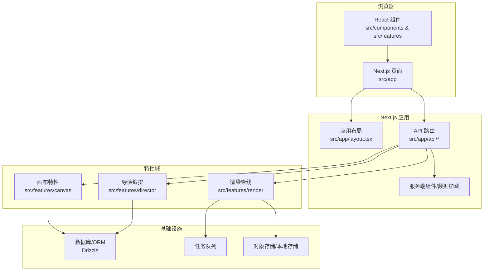

图表来源
- [src/app/layout.tsx:1-200](file://src/app/layout.tsx#L1-L200)
- [src/app/page.tsx:1-200](file://src/app/page.tsx#L1-L200)
- [src/features/canvas/types.ts:1-200](file://src/features/canvas/types.ts#L1-L200)
- [src/features/director/pipeline.ts:1-200](file://src/features/director/pipeline.ts#L1-L200)
- [src/features/render/renderer.ts:1-200](file://src/features/render/renderer.ts#L1-L200)

## 详细组件分析

### Next.js 14+ 应用层
- 应用入口与布局
  - 通过应用根布局统一注入全局样式、字体与元信息，确保跨页面体验一致。
  - 结合全局错误页与加载态，提升用户体验与健壮性。
- 页面与路由
  - 使用文件系统路由，将页面、子路由与 API 路由清晰分离。
  - 在页面中组合特性域组件，实现业务拼装。
- API 路由
  - 以 RESTful 风格暴露后端能力，内部委托给特性域服务处理。
  - 结合中间件进行鉴权、限流与日志记录。

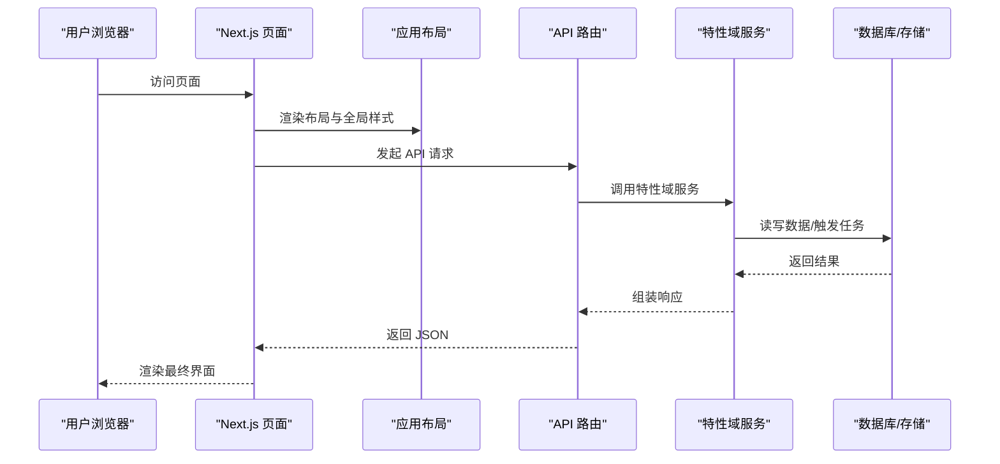

图表来源
- [src/app/layout.tsx:1-200](file://src/app/layout.tsx#L1-L200)
- [src/app/page.tsx:1-200](file://src/app/page.tsx#L1-L200)

章节来源
- [src/app/layout.tsx:1-200](file://src/app/layout.tsx#L1-L200)
- [src/app/page.tsx:1-200](file://src/app/page.tsx#L1-L200)
- [src/app/globals.css:1-200](file://src/app/globals.css#L1-L200)

### React 组件架构
- 组件分层
  - 基础 UI 组件位于 src/components/ui，强调无状态与可组合性。
  - 业务相关组件位于 src/features/*/components 或页面级 _components，关注领域语义。
- 状态管理
  - 局部状态使用 React Hooks；跨组件状态通过上下文或特性域状态机。
- 演示与测试
  - 每个组件配套 demo 与单元测试，便于回归与可视化验证。

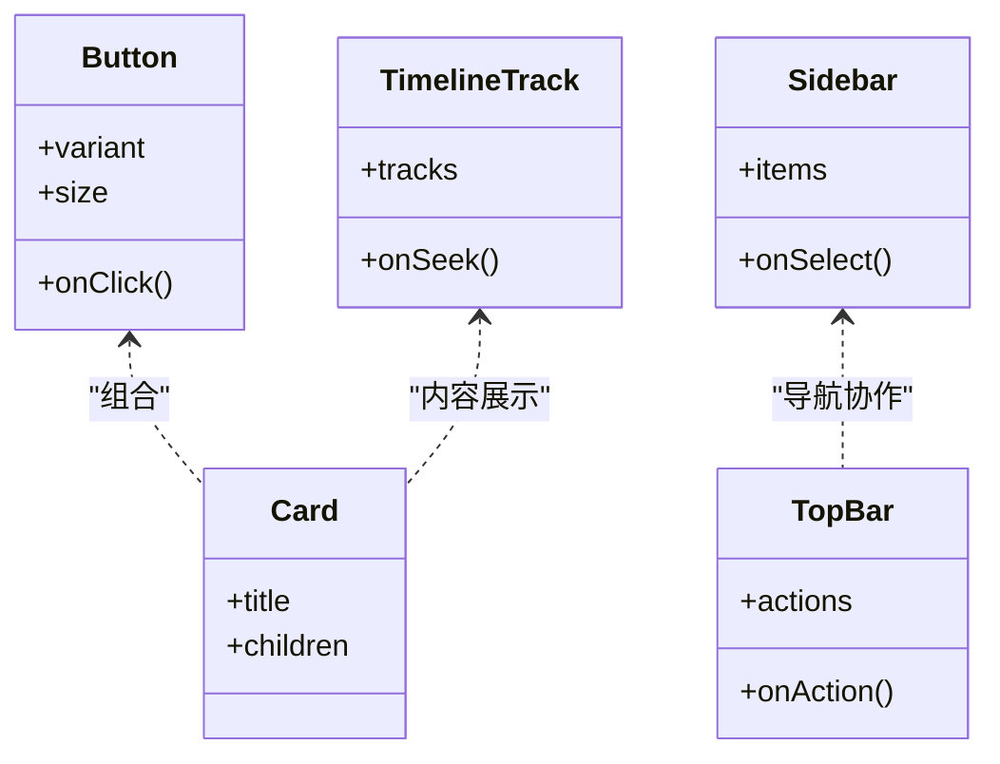

图表来源
- [src/components/ui/button.tsx:1-200](file://src/components/ui/button.tsx#L1-L200)
- [src/components/ui/card.tsx:1-200](file://src/components/ui/card.tsx#L1-L200)
- [src/components/ui/sidebar.tsx:1-200](file://src/components/ui/sidebar.tsx#L1-L200)
- [src/components/ui/top-bar.tsx:1-200](file://src/components/ui/top-bar.tsx#L1-L200)
- [src/components/ui/timeline-track.tsx:1-200](file://src/components/ui/timeline-track.tsx#L1-L200)

章节来源
- [src/components/ui/button.tsx:1-200](file://src/components/ui/button.tsx#L1-L200)
- [src/components/ui/card.tsx:1-200](file://src/components/ui/card.tsx#L1-L200)
- [src/components/ui/sidebar.tsx:1-200](file://src/components/ui/sidebar.tsx#L1-L200)
- [src/components/ui/top-bar.tsx:1-200](file://src/components/ui/top-bar.tsx#L1-L200)
- [src/components/ui/timeline-track.tsx:1-200](file://src/components/ui/timeline-track.tsx#L1-L200)

### TypeScript 类型系统
- 严格模式与路径别名
  - 启用严格类型检查，避免隐式 any；配置路径别名简化导入。
- JSX 与 Node 类型
  - 为 React JSX 与 Node 运行时代码提供类型支持。
- 类型共享
  - 在 features 层定义领域类型，供 UI 与 API 层共享，保证契约一致。

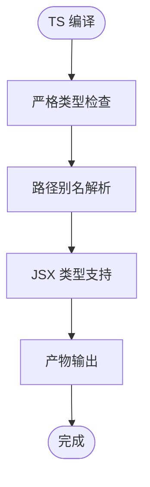

图表来源
- [tsconfig.json:1-200](file://tsconfig.json#L1-L200)

章节来源
- [tsconfig.json:1-200](file://tsconfig.json#L1-L200)

### Tailwind CSS 样式方案
- 选择原因
  - 原子化类名提升样式一致性；与 React 组件自然融合；按需生成减少包体。
- 配置方式
  - 通过 PostCSS 插件链接入 Tailwind；在应用根布局引入全局样式；在组件中以类名驱动样式。
- 主题扩展
  - 在配置中扩展颜色、字号、间距等主题变量，保持设计系统一致性。

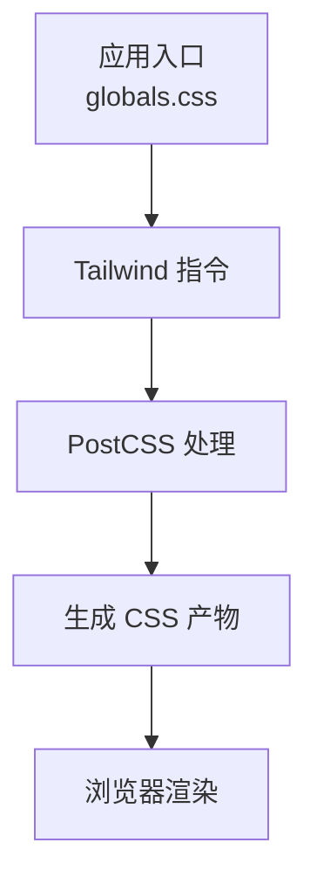

图表来源
- [postcss.config.mjs:1-200](file://postcss.config.mjs#L1-L200)
- [src/app/globals.css:1-200](file://src/app/globals.css#L1-L200)

章节来源
- [postcss.config.mjs:1-200](file://postcss.config.mjs#L1-L200)
- [src/app/globals.css:1-200](file://src/app/globals.css#L1-L200)

### Drizzle 数据库 ORM
- 选择原因
  - 类型安全、SQL 优先、轻量高效；与 Node/Edge 运行时兼容良好。
- 集成要点
  - 通过 drizzle.config.ts 管理迁移与连接；在 lib/db 中封装查询与事务。
- 迁移流程
  - 定义 schema -> 生成迁移 -> 执行迁移 -> 同步类型。

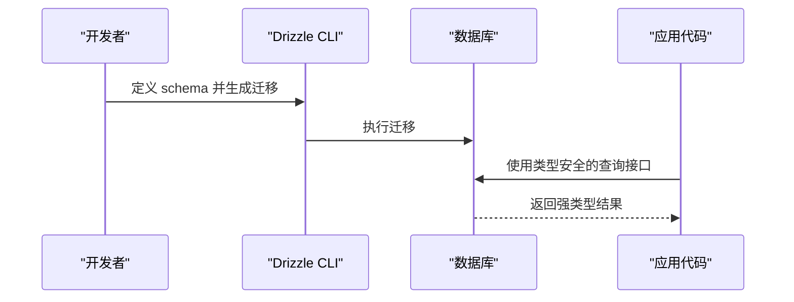

图表来源
- [drizzle.config.ts:1-200](file://drizzle.config.ts#L1-L200)

章节来源
- [drizzle.config.ts:1-200](file://drizzle.config.ts#L1-L200)

### Vitest 测试框架
- 选择原因
  - 原生 ES 模块、与 Vite 生态一致、启动快、对 TS/Tailwind 友好。
- 配置要点
  - 指定测试环境、覆盖率阈值、模拟策略与 fixtures 目录。
- 测试范围
  - 单元测试（组件/函数）、集成测试（API/特性域）、端到端（可选）。

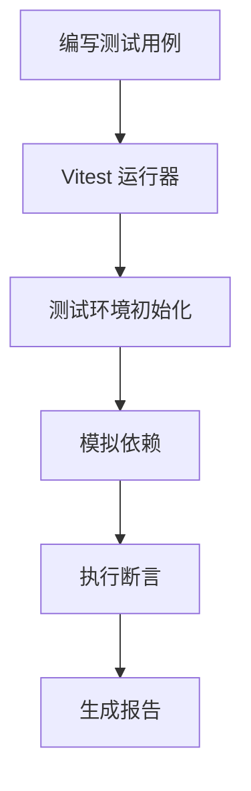

图表来源
- [vitest.config.ts:1-200](file://vitest.config.ts#L1-L200)

章节来源
- [vitest.config.ts:1-200](file://vitest.config.ts#L1-L200)

### ESLint 代码质量
- 选择原因
  - 规则丰富、可扩展、与编辑器集成良好，保障团队编码规范。
- 配置要点
  - 启用 Next.js、React、TypeScript 推荐规则；自定义规则与忽略策略。
- 工作流
  - 保存时自动修复；CI 中强制校验。

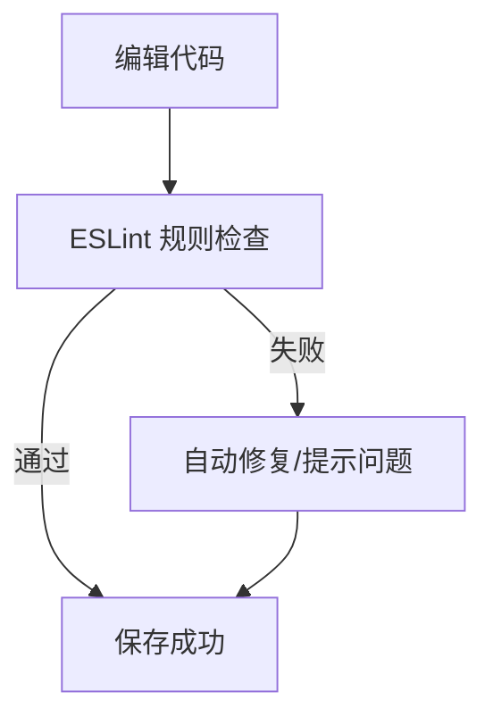

图表来源
- [eslint.config.mjs:1-200](file://eslint.config.mjs#L1-L200)

章节来源
- [eslint.config.mjs:1-200](file://eslint.config.mjs#L1-L200)

### 特性域示例：Director 编排与 Render 渲染
- Director 编排
  - 通过 pipeline 串联多个阶段（采集、计划、制作、合成），协调任务与状态。
- Render 渲染
  - 负责帧序列处理、编码与导出，配合队列与存储完成异步任务。

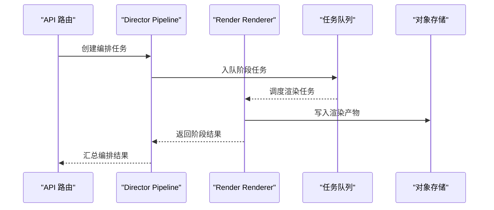

图表来源
- [src/features/director/pipeline.ts:1-200](file://src/features/director/pipeline.ts#L1-L200)
- [src/features/render/renderer.ts:1-200](file://src/features/render/renderer.ts#L1-L200)

章节来源
- [src/features/director/pipeline.ts:1-200](file://src/features/director/pipeline.ts#L1-L200)
- [src/features/render/renderer.ts:1-200](file://src/features/render/renderer.ts#L1-L200)

## 依赖关系分析
- 顶层依赖
  - 通过 package.json 声明运行时与开发依赖，锁定 pnpm-lock.yaml 确保可重复构建。
- 构建与样式
  - next.config.ts 控制 Next.js 行为；postcss.config.mjs 接入 Tailwind。
- 类型与测试
  - tsconfig.json 定义 TS 编译选项；vitest.config.ts 配置测试环境。
- 数据库与迁移
  - drizzle.config.ts 管理迁移与连接。
- 代码质量
  - eslint.config.mjs 集中规则与插件。

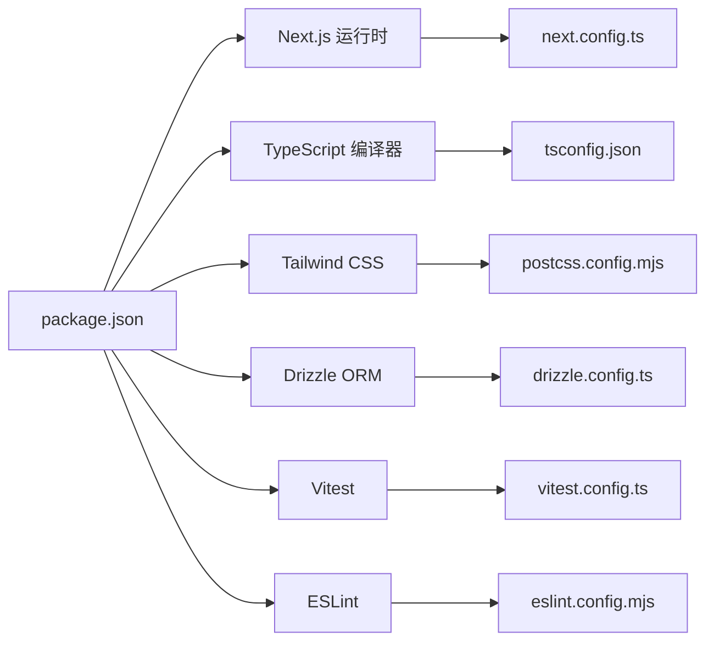

图表来源
- [package.json:1-200](file://package.json#L1-L200)
- [next.config.ts:1-200](file://next.config.ts#L1-L200)
- [postcss.config.mjs:1-200](file://postcss.config.mjs#L1-L200)
- [drizzle.config.ts:1-200](file://drizzle.config.ts#L1-L200)
- [vitest.config.ts:1-200](file://vitest.config.ts#L1-L200)
- [eslint.config.mjs:1-200](file://eslint.config.mjs#L1-L200)
- [tsconfig.json:1-200](file://tsconfig.json#L1-L200)

章节来源
- [package.json:1-200](file://package.json#L1-L200)
- [pnpm-lock.yaml:1-200](file://pnpm-lock.yaml#L1-L200)

## 性能考量
- 构建与打包
  - 利用 Next.js 增量构建与缓存；按需加载组件与样式；合理拆分路由与特性模块。
- 渲染策略
  - 在服务端预取必要数据，减少客户端水合开销；对重型计算使用 Web Worker 或后台任务。
- 数据库与存储
  - 使用连接池与索引优化查询；大文件走对象存储，避免阻塞主线程。
- 前端性能
  - 图片与媒体资源懒加载；合理使用 memo/useMemo/useCallback；避免不必要的重渲染。

[本节为通用指导，不直接分析具体文件]

## 故障排查指南
- 构建与样式
  - 若 Tailwind 未生效，检查 postcss.config.mjs 与全局样式入口是否正确引入。
- 类型与编译
  - 若出现类型错误，确认 tsconfig.json 的严格模式与路径别名是否匹配实际目录结构。
- 测试
  - 若 Vitest 无法识别模块，检查测试环境与模拟策略配置。
- 数据库迁移
  - 若迁移失败，核对 drizzle.config.ts 的连接信息与迁移文件顺序。
- 代码质量
  - 若 ESLint 报错，查看 eslint.config.mjs 的规则与忽略列表，必要时添加例外注释。

章节来源
- [postcss.config.mjs:1-200](file://postcss.config.mjs#L1-L200)
- [tsconfig.json:1-200](file://tsconfig.json#L1-L200)
- [vitest.config.ts:1-200](file://vitest.config.ts#L1-L200)
- [drizzle.config.ts:1-200](file://drizzle.config.ts#L1-L200)
- [eslint.config.mjs:1-200](file://eslint.config.mjs#L1-L200)

## 结论
CodeVideoCanvas 采用 Next.js 14+ 作为全栈框架，结合 React 组件化、TypeScript 强类型、Tailwind CSS 原子化样式、Drizzle 类型安全 ORM、Vitest 快速测试与 ESLint 代码质量保障，形成一套高效、可维护且可扩展的技术栈。通过清晰的模块分层与特性域组织，项目在复杂视频创作场景中具备良好的性能与演进能力。

[本节为总结性内容，不直接分析具体文件]

## 附录
- 版本兼容性建议
  - Next.js 14+ 与 React 18 协同工作；TypeScript 5.x 与 Vite/Vitest 生态兼容良好；Tailwind CSS v3 与 PostCSS 插件链稳定。
- 依赖锁定与更新
  - 使用 pnpm-lock.yaml 锁定依赖；定期审查安全漏洞与重大更新，遵循最小变更原则升级。
- 最佳实践
  - 在特性域内维护领域类型与测试；API 路由仅做编排与校验，业务逻辑下沉至特性域；样式尽量使用 Tailwind 原子类，必要时扩展主题。

[本节为补充信息，不直接分析具体文件]