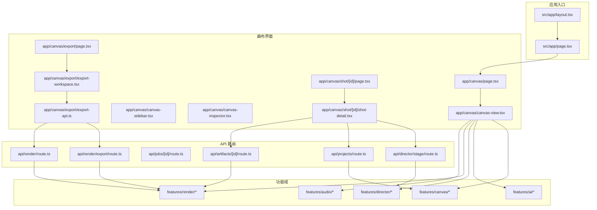
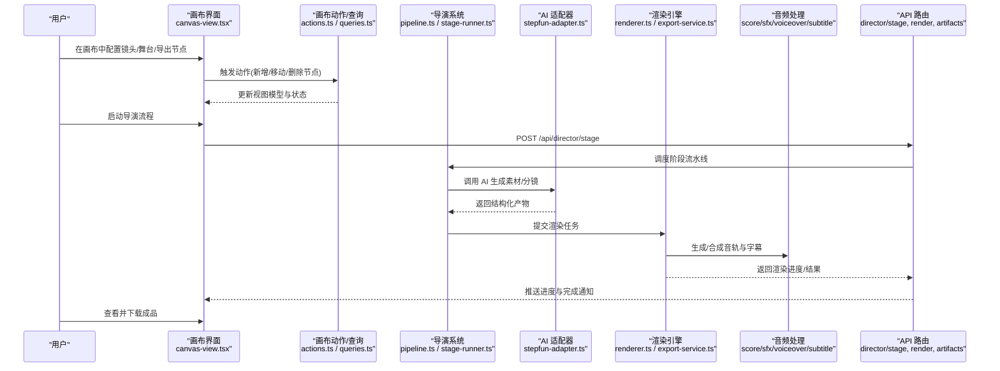
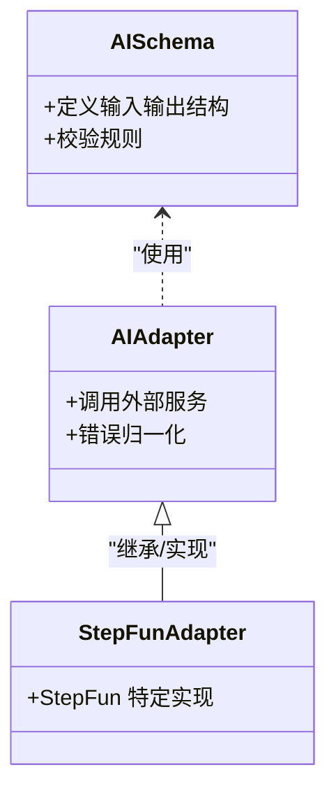
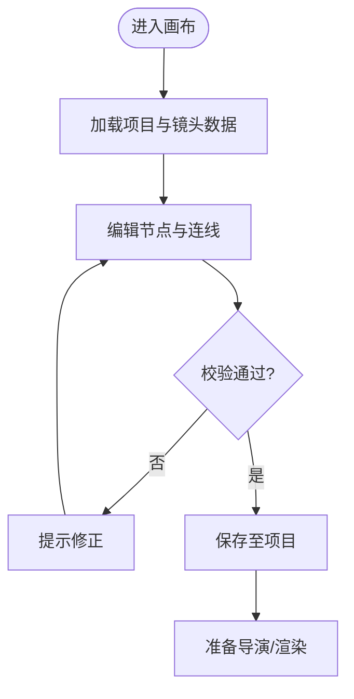
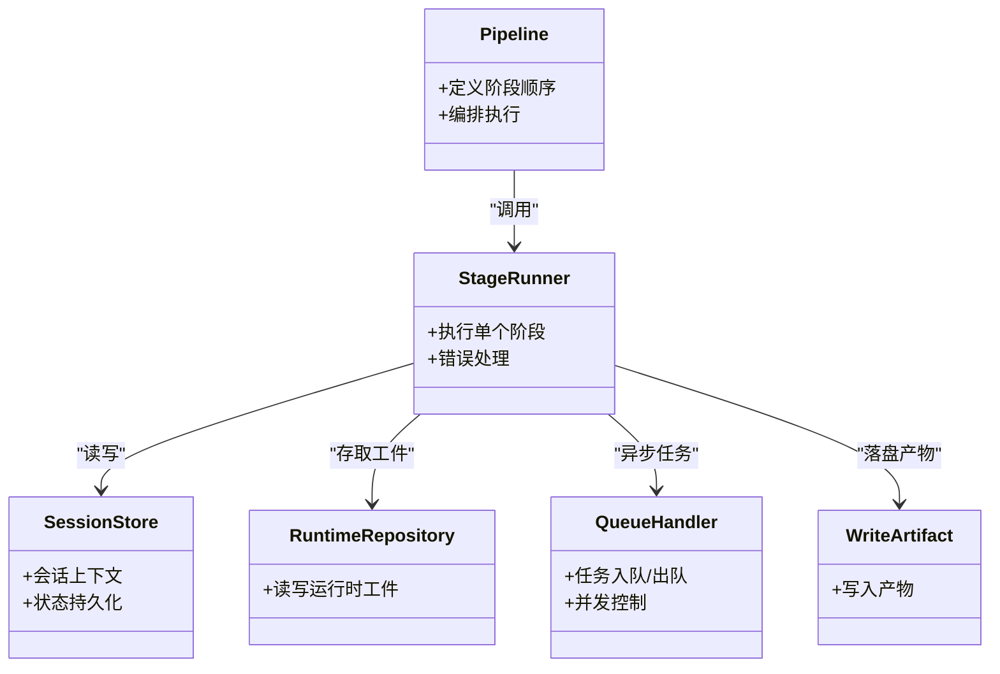
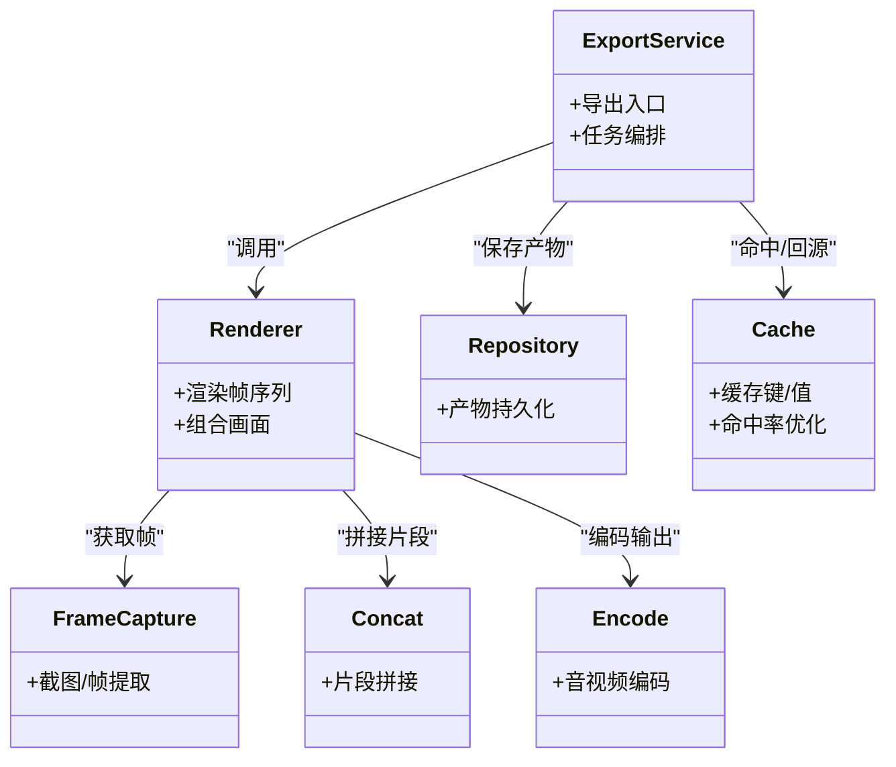
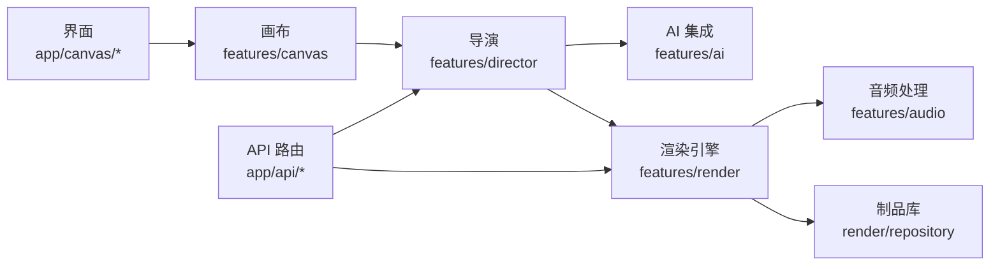
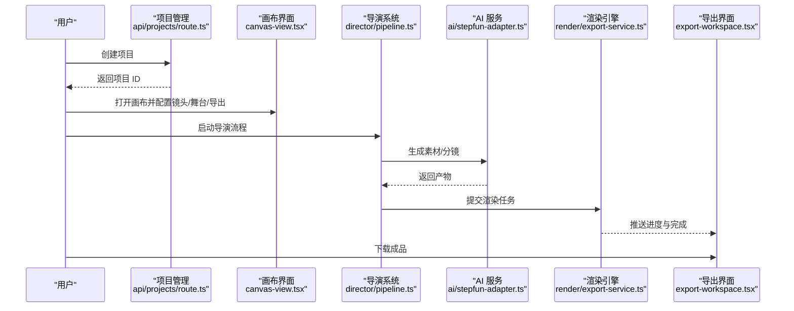

# 核心功能概览

<cite>
**本文引用的文件**   
- [README.md](file://README.md)
- [package.json](file://package.json)
- [src/app/page.tsx](file://src/app/page.tsx)
- [src/app/layout.tsx](file://src/app/layout.tsx)
- [src/features/ai/index.ts](file://src/features/ai/index.ts)
- [src/features/ai/types.ts](file://src/features/ai/types.ts)
- [src/features/ai/schemas.ts](file://src/features/ai/schemas.ts)
- [src/features/ai/stepfun-adapter.ts](file://src/features/ai/stepfun-adapter.ts)
- [src/features/canvas/index.ts](file://src/features/canvas/index.ts)
- [src/features/canvas/actions.ts](file://src/features/canvas/actions.ts)
- [src/features/canvas/queries.ts](file://src/features/canvas/queries.ts)
- [src/features/canvas/schemas.ts](file://src/features/canvas/schemas.ts)
- [src/features/canvas/status.ts](file://src/features/canvas/status.ts)
- [src/features/director/index.ts](file://src/features/director/index.ts)
- [src/features/director/pipeline.ts](file://src/features/director/pipeline.ts)
- [src/features/director/stage-runner.ts](file://src/features/director/stage-runner.ts)
- [src/features/director/runtime-repository.ts](file://src/features/director/runtime-repository.ts)
- [src/features/director/session-store.ts](file://src/features/director/session-store.ts)
- [src/features/director/queue-handler.ts](file://src/features/director/queue-handler.ts)
- [src/features/director/tools/write-artifact.ts](file://src/features/director/tools/write-artifact.ts)
- [src/features/render/index.ts](file://src/features/render/index.ts)
- [src/features/render/renderer.ts](file://src/features/render/renderer.ts)
- [src/features/render/export-service.ts](file://src/features/render/export-service.ts)
- [src/features/render/repository.ts](file://src/features/render/repository.ts)
- [src/features/render/cache.ts](file://src/features/render/cache.ts)
- [src/features/render/frame-capture.ts](file://src/features/render/frame-capture.ts)
- [src/features/render/concat.ts](file://src/features/render/concat.ts)
- [src/features/render/encode.ts](file://src/features/render/encode.ts)
- [src/features/audio/index.ts](file://src/features/audio/index.ts)
- [src/features/audio/score.ts](file://src/features/audio/score.ts)
- [src/features/audio/sfx.ts](file://src/features/audio/sfx.ts)
- [src/features/audio/subtitle.ts](file://src/features/audio/subtitle.ts)
- [src/features/audio/voiceover.ts](file://src/features/audio/voiceover.ts)
- [src/app/api/artifacts/[id]/route.ts](file://src/app/api/artifacts/[id]/route.ts)
- [src/app/api/director/stage/route.ts](file://src/app/api/director/stage/route.ts)
- [src/app/api/jobs/[id]/route.ts](file://src/app/api/jobs/[id]/route.ts)
- [src/app/api/projects/route.ts](file://src/app/api/projects/route.ts)
- [src/app/api/render/route.ts](file://src/app/api/render/route.ts)
- [src/app/api/render/export/route.ts](file://src/app/api/render/export/route.ts)
- [src/app/canvas/page.tsx](file://src/app/canvas/page.tsx)
- [src/app/canvas/canvas-view.tsx](file://src/app/canvas/canvas-view.tsx)
- [src/app/canvas/canvas-sidebar.tsx](file://src/app/canvas/canvas-sidebar.tsx)
- [src/app/canvas/canvas-inspector.tsx](file://src/app/canvas/canvas-inspector.tsx)
- [src/app/canvas/shot/[id]/page.tsx](file://src/app/canvas/shot/[id]/page.tsx)
- [src/app/canvas/shot/[id]/shot-detail.tsx](file://src/app/canvas/shot/[id]/shot-detail.tsx)
- [src/app/canvas/export/page.tsx](file://src/app/canvas/export/page.tsx)
- [src/app/canvas/export/export-api.ts](file://src/app/canvas/export/export-api.ts)
- [src/app/canvas/export/export-workspace.tsx](file://src/app/canvas/export/export-workspace.tsx)
</cite>

## 目录
1. [简介](#简介)
2. [项目结构](#项目结构)
3. [核心组件](#核心组件)
4. [架构总览](#架构总览)
5. [详细组件分析](#详细组件分析)
6. [依赖分析](#依赖分析)
7. [性能考虑](#性能考虑)
8. [故障排查指南](#故障排查指南)
9. [结论](#结论)
10. [附录](#附录)

## 简介
CodeVideoCanvas 是一个面向视频创作的可视化平台，围绕“AI 服务集成、可视化画布编辑器、导演系统、渲染引擎、项目管理、音频处理”六大核心模块构建。平台通过可编排的节点式画布与导演流水线，将创意脚本转化为可执行的生产流程，最终由渲染引擎输出高质量视频成品。

## 项目结构
仓库采用 Next.js 应用形态，前端页面位于 src/app，业务特性按领域拆分到 src/features，API 路由位于 src/app/api，通用 UI 组件位于 src/components/ui。

图表来源
- [src/app/layout.tsx](file://src/app/layout.tsx)
- [src/app/page.tsx](file://src/app/page.tsx)
- [src/app/canvas/page.tsx](file://src/app/canvas/page.tsx)
- [src/app/canvas/canvas-view.tsx](file://src/app/canvas/canvas-view.tsx)
- [src/app/canvas/canvas-sidebar.tsx](file://src/app/canvas/canvas-sidebar.tsx)
- [src/app/canvas/canvas-inspector.tsx](file://src/app/canvas/canvas-inspector.tsx)
- [src/app/canvas/shot/[id]/page.tsx](file://src/app/canvas/shot/[id]/page.tsx)
- [src/app/canvas/shot/[id]/shot-detail.tsx](file://src/app/canvas/shot/[id]/shot-detail.tsx)
- [src/app/canvas/export/page.tsx](file://src/app/canvas/export/page.tsx)
- [src/app/canvas/export/export-workspace.tsx](file://src/app/canvas/export/export-workspace.tsx)
- [src/app/canvas/export/export-api.ts](file://src/app/canvas/export/export-api.ts)
- [src/app/api/director/stage/route.ts](file://src/app/api/director/stage/route.ts)
- [src/app/api/render/route.ts](file://src/app/api/render/route.ts)
- [src/app/api/render/export/route.ts](file://src/app/api/render/export/route.ts)
- [src/app/api/projects/route.ts](file://src/app/api/projects/route.ts)
- [src/app/api/artifacts/[id]/route.ts](file://src/app/api/artifacts/[id]/route.ts)

章节来源
- [README.md](file://README.md)
- [package.json](file://package.json)
- [src/app/layout.tsx](file://src/app/layout.tsx)
- [src/app/page.tsx](file://src/app/page.tsx)

## 核心组件
- AI 服务集成：封装外部 AI 能力（如 StepFun），提供统一类型、校验与适配器，供导演系统与素材生成调用。
- 可视化画布编辑器：基于节点图的数据流编辑，支持镜头、舞台、导出等节点，提供动作、查询、状态管理与布局计算。
- 导演系统：以阶段化流水线编排创作过程，管理会话、运行时工件、队列任务与结果提交。
- 渲染引擎：负责帧捕获、序列合成、音视频编码与导出，提供缓存与持久化存储。
- 项目管理：提供项目的创建、读取与更新接口，贯穿画布与导演流程。
- 音频处理：涵盖配乐、音效、旁白与字幕生成与合成，服务于渲染阶段的音轨合并。

章节来源
- [src/features/ai/index.ts](file://src/features/ai/index.ts)
- [src/features/ai/types.ts](file://src/features/ai/types.ts)
- [src/features/ai/schemas.ts](file://src/features/ai/schemas.ts)
- [src/features/ai/stepfun-adapter.ts](file://src/features/ai/stepfun-adapter.ts)
- [src/features/canvas/index.ts](file://src/features/canvas/index.ts)
- [src/features/canvas/actions.ts](file://src/features/canvas/actions.ts)
- [src/features/canvas/queries.ts](file://src/features/canvas/queries.ts)
- [src/features/canvas/schemas.ts](file://src/features/canvas/schemas.ts)
- [src/features/canvas/status.ts](file://src/features/canvas/status.ts)
- [src/features/director/index.ts](file://src/features/director/index.ts)
- [src/features/director/pipeline.ts](file://src/features/director/pipeline.ts)
- [src/features/director/stage-runner.ts](file://src/features/director/stage-runner.ts)
- [src/features/director/runtime-repository.ts](file://src/features/director/runtime-repository.ts)
- [src/features/director/session-store.ts](file://src/features/director/session-store.ts)
- [src/features/director/queue-handler.ts](file://src/features/director/queue-handler.ts)
- [src/features/director/tools/write-artifact.ts](file://src/features/director/tools/write-artifact.ts)
- [src/features/render/index.ts](file://src/features/render/index.ts)
- [src/features/render/renderer.ts](file://src/features/render/renderer.ts)
- [src/features/render/export-service.ts](file://src/features/render/export-service.ts)
- [src/features/render/repository.ts](file://src/features/render/repository.ts)
- [src/features/render/cache.ts](file://src/features/render/cache.ts)
- [src/features/render/frame-capture.ts](file://src/features/render/frame-capture.ts)
- [src/features/render/concat.ts](file://src/features/render/concat.ts)
- [src/features/render/encode.ts](file://src/features/render/encode.ts)
- [src/features/audio/index.ts](file://src/features/audio/index.ts)
- [src/features/audio/score.ts](file://src/features/audio/score.ts)
- [src/features/audio/sfx.ts](file://src/features/audio/sfx.ts)
- [src/features/audio/subtitle.ts](file://src/features/audio/subtitle.ts)
- [src/features/audio/voiceover.ts](file://src/features/audio/voiceover.ts)

## 架构总览
下图展示从用户操作到最终导出的端到端数据流，以及各模块间的协作关系。

图表来源
- [src/app/canvas/canvas-view.tsx](file://src/app/canvas/canvas-view.tsx)
- [src/features/canvas/actions.ts](file://src/features/canvas/actions.ts)
- [src/features/canvas/queries.ts](file://src/features/canvas/queries.ts)
- [src/features/director/pipeline.ts](file://src/features/director/pipeline.ts)
- [src/features/director/stage-runner.ts](file://src/features/director/stage-runner.ts)
- [src/features/ai/stepfun-adapter.ts](file://src/features/ai/stepfun-adapter.ts)
- [src/features/render/renderer.ts](file://src/features/render/renderer.ts)
- [src/features/render/export-service.ts](file://src/features/render/export-service.ts)
- [src/features/audio/score.ts](file://src/features/audio/score.ts)
- [src/features/audio/sfx.ts](file://src/features/audio/sfx.ts)
- [src/features/audio/voiceover.ts](file://src/features/audio/voiceover.ts)
- [src/features/audio/subtitle.ts](file://src/features/audio/subtitle.ts)
- [src/app/api/director/stage/route.ts](file://src/app/api/director/stage/route.ts)
- [src/app/api/render/route.ts](file://src/app/api/render/route.ts)
- [src/app/api/artifacts/[id]/route.ts](file://src/app/api/artifacts/[id]/route.ts)

## 详细组件分析

### AI 服务集成
职责
- 定义统一的 AI 输入/输出类型与校验规则。
- 封装第三方服务（如 StepFun）的适配逻辑，屏蔽差异。
- 为导演系统的“素材生成/分镜编排”等阶段提供可插拔能力。

主要特性
- 类型安全：集中定义 schema 与类型，确保跨层一致。
- 适配器模式：便于替换或扩展不同供应商。
- 错误归一化：对外暴露一致的异常语义。

使用场景
- 根据剧本自动生成故事板、分镜描述与素材清单。
- 辅助生成旁白文本、字幕文案与提示词。

扩展点
- 新增 AI 供应商：实现统一适配器接口并注册。
- 自定义校验：扩展 schema 约束以满足新字段。

图表来源
- [src/features/ai/schemas.ts](file://src/features/ai/schemas.ts)
- [src/features/ai/types.ts](file://src/features/ai/types.ts)
- [src/features/ai/stepfun-adapter.ts](file://src/features/ai/stepfun-adapter.ts)

章节来源
- [src/features/ai/index.ts](file://src/features/ai/index.ts)
- [src/features/ai/types.ts](file://src/features/ai/types.ts)
- [src/features/ai/schemas.ts](file://src/features/ai/schemas.ts)
- [src/features/ai/stepfun-adapter.ts](file://src/features/ai/stepfun-adapter.ts)

### 可视化画布编辑器
职责
- 提供节点式画布，用于编排镜头、舞台、导出等元素。
- 维护节点图的状态、布局与交互动作。
- 提供查询与状态工具，支撑界面与后端同步。

主要特性
- 动作系统：增删改查节点、连线与属性变更。
- 查询系统：高效检索子图、依赖与可见性。
- 状态与布局：计算节点位置、层级与可视区域。

使用场景
- 拖拽组装多镜头叙事。
- 调整舞台尺寸、背景与转场参数。
- 配置导出目标与质量。

扩展点
- 新增节点类型：实现节点元数据与渲染逻辑。
- 自定义布局算法：替换默认布局策略。

图表来源
- [src/features/canvas/actions.ts](file://src/features/canvas/actions.ts)
- [src/features/canvas/queries.ts](file://src/features/canvas/queries.ts)
- [src/features/canvas/schemas.ts](file://src/features/canvas/schemas.ts)
- [src/features/canvas/status.ts](file://src/features/canvas/status.ts)

章节来源
- [src/features/canvas/index.ts](file://src/features/canvas/index.ts)
- [src/features/canvas/actions.ts](file://src/features/canvas/actions.ts)
- [src/features/canvas/queries.ts](file://src/features/canvas/queries.ts)
- [src/features/canvas/schemas.ts](file://src/features/canvas/schemas.ts)
- [src/features/canvas/status.ts](file://src/features/canvas/status.ts)
- [src/app/canvas/page.tsx](file://src/app/canvas/page.tsx)
- [src/app/canvas/canvas-view.tsx](file://src/app/canvas/canvas-view.tsx)
- [src/app/canvas/canvas-sidebar.tsx](file://src/app/canvas/canvas-sidebar.tsx)
- [src/app/canvas/canvas-inspector.tsx](file://src/app/canvas/canvas-inspector.tsx)
- [src/app/canvas/shot/[id]/page.tsx](file://src/app/canvas/shot/[id]/page.tsx)
- [src/app/canvas/shot/[id]/shot-detail.tsx](file://src/app/canvas/shot/[id]/shot-detail.tsx)

### 导演系统
职责
- 将创作过程拆分为多个阶段（如摄入、编排、制作、收尾）。
- 管理会话上下文、运行时工件与队列任务。
- 协调 AI 服务与渲染引擎，产出中间产物与最终结果。

主要特性
- 阶段流水线：顺序/并行执行，具备幂等与重试能力。
- 会话与工件：持久化中间状态与产物，支持断点续跑。
- 队列处理器：解耦耗时任务，提升吞吐。

使用场景
- 自动将剧本拆解为分镜计划并生成素材。
- 驱动渲染管线，跟踪进度与失败恢复。

扩展点
- 新增阶段：实现阶段运行器与工具集。
- 自定义工件写入：扩展写工件工具以对接新存储。

图表来源
- [src/features/director/pipeline.ts](file://src/features/director/pipeline.ts)
- [src/features/director/stage-runner.ts](file://src/features/director/stage-runner.ts)
- [src/features/director/session-store.ts](file://src/features/director/session-store.ts)
- [src/features/director/runtime-repository.ts](file://src/features/director/runtime-repository.ts)
- [src/features/director/queue-handler.ts](file://src/features/director/queue-handler.ts)
- [src/features/director/tools/write-artifact.ts](file://src/features/director/tools/write-artifact.ts)

章节来源
- [src/features/director/index.ts](file://src/features/director/index.ts)
- [src/features/director/pipeline.ts](file://src/features/director/pipeline.ts)
- [src/features/director/stage-runner.ts](file://src/features/director/stage-runner.ts)
- [src/features/director/runtime-repository.ts](file://src/features/director/runtime-repository.ts)
- [src/features/director/session-store.ts](file://src/features/director/session-store.ts)
- [src/features/director/queue-handler.ts](file://src/features/director/queue-handler.ts)
- [src/features/director/tools/write-artifact.ts](file://src/features/director/tools/write-artifact.ts)
- [src/app/api/director/stage/route.ts](file://src/app/api/director/stage/route.ts)

### 渲染引擎
职责
- 将导演产出的镜头与舞台信息渲染为帧序列。
- 合成音视频轨道，编码并导出最终视频。
- 提供缓存与仓库，减少重复计算与持久化产物。

主要特性
- 帧捕获与序列：稳定、可复现的帧生成。
- 编解码：支持常见容器与码率配置。
- 导出服务：统一导出入口，聚合多路输出。

使用场景
- 批量渲染多分辨率/多格式版本。
- 增量渲染与缓存命中优化。

扩展点
- 新增编码器：实现编码后端。
- 自定义缓存策略：替换缓存实现。

图表来源
- [src/features/render/renderer.ts](file://src/features/render/renderer.ts)
- [src/features/render/export-service.ts](file://src/features/render/export-service.ts)
- [src/features/render/repository.ts](file://src/features/render/repository.ts)
- [src/features/render/cache.ts](file://src/features/render/cache.ts)
- [src/features/render/frame-capture.ts](file://src/features/render/frame-capture.ts)
- [src/features/render/concat.ts](file://src/features/render/concat.ts)
- [src/features/render/encode.ts](file://src/features/render/encode.ts)

章节来源
- [src/features/render/index.ts](file://src/features/render/index.ts)
- [src/features/render/renderer.ts](file://src/features/render/renderer.ts)
- [src/features/render/export-service.ts](file://src/features/render/export-service.ts)
- [src/features/render/repository.ts](file://src/features/render/repository.ts)
- [src/features/render/cache.ts](file://src/features/render/cache.ts)
- [src/features/render/frame-capture.ts](file://src/features/render/frame-capture.ts)
- [src/features/render/concat.ts](file://src/features/render/concat.ts)
- [src/features/render/encode.ts](file://src/features/render/encode.ts)
- [src/app/api/render/route.ts](file://src/app/api/render/route.ts)
- [src/app/api/render/export/route.ts](file://src/app/api/render/export/route.ts)

### 项目管理
职责
- 提供项目的 CRUD 接口，承载画布与导演所需的基础数据。
- 作为跨模块共享的项目上下文来源。

主要特性
- 统一路由：集中管理项目相关请求。
- 与画布/导演联动：保证项目状态一致性。

使用场景
- 新建项目并初始化默认画布。
- 切换项目时加载对应镜头与设置。

扩展点
- 接入多租户/权限控制。
- 增加项目模板与克隆能力。

章节来源
- [src/app/api/projects/route.ts](file://src/app/api/projects/route.ts)
- [src/app/canvas/shot/[id]/shot-detail.tsx](file://src/app/canvas/shot/[id]/shot-detail.tsx)

### 音频处理
职责
- 生成与合成配乐、音效、旁白与字幕。
- 为渲染阶段提供标准化音轨与字幕轨道。

主要特性
- 模块化：配乐、音效、旁白、字幕各自独立。
- 与渲染协同：在导出前完成音画对齐与混合。

使用场景
- 根据分镜自动生成背景音乐与音效。
- 将旁白与字幕嵌入最终视频。

扩展点
- 新增音频源：接入更多 TTS/音乐生成服务。
- 自定义混音策略：调整音量包络与淡入淡出。

章节来源
- [src/features/audio/index.ts](file://src/features/audio/index.ts)
- [src/features/audio/score.ts](file://src/features/audio/score.ts)
- [src/features/audio/sfx.ts](file://src/features/audio/sfx.ts)
- [src/features/audio/voiceover.ts](file://src/features/audio/voiceover.ts)
- [src/features/audio/subtitle.ts](file://src/features/audio/subtitle.ts)

## 依赖分析
- 低耦合高内聚：每个 features 目录自包含类型、工具与实现，通过明确接口与 API 路由进行通信。
- 关键依赖链：
  - 画布 -> 导演：通过动作/查询与 API 路由触发阶段流水线。
  - 导演 -> AI：适配器调用外部服务生成素材。
  - 导演 -> 渲染：提交渲染任务并追踪进度。
  - 渲染 -> 音频：在导出阶段合成音轨与字幕。
  - 渲染 -> 制品库：持久化中间与最终产物。

图表来源
- [src/features/canvas/index.ts](file://src/features/canvas/index.ts)
- [src/features/director/index.ts](file://src/features/director/index.ts)
- [src/features/ai/index.ts](file://src/features/ai/index.ts)
- [src/features/render/index.ts](file://src/features/render/index.ts)
- [src/features/audio/index.ts](file://src/features/audio/index.ts)
- [src/app/api/director/stage/route.ts](file://src/app/api/director/stage/route.ts)
- [src/app/api/render/route.ts](file://src/app/api/render/route.ts)

章节来源
- [src/features/canvas/index.ts](file://src/features/canvas/index.ts)
- [src/features/director/index.ts](file://src/features/director/index.ts)
- [src/features/ai/index.ts](file://src/features/ai/index.ts)
- [src/features/render/index.ts](file://src/features/render/index.ts)
- [src/features/audio/index.ts](file://src/features/audio/index.ts)

## 性能考虑
- 渲染缓存：利用缓存命中避免重复渲染，缩短迭代时间。
- 队列与并发：导演与渲染任务通过队列解耦，合理限制并发度，避免资源争用。
- 增量导出：仅重算变更部分，结合帧序列与片段拼接降低开销。
- 音频预合成：在渲染前完成音轨生成，减少导出时的 CPU 峰值。

[本节为通用指导，不直接分析具体文件]

## 故障排查指南
- 导演阶段失败：检查阶段运行日志与会话状态，确认工件是否完整；必要时重置会话并重试。
- 渲染超时或内存不足：降低并发、启用缓存、分段渲染；检查帧捕获与编码配置。
- AI 调用异常：核对适配器配置与网络连通性，关注错误归一化后的诊断信息。
- 制品缺失：确认制品库路径与权限，验证导出服务是否正确落盘。

章节来源
- [src/features/director/stage-runner.ts](file://src/features/director/stage-runner.ts)
- [src/features/director/session-store.ts](file://src/features/director/session-store.ts)
- [src/features/render/export-service.ts](file://src/features/render/export-service.ts)
- [src/features/render/repository.ts](file://src/features/render/repository.ts)
- [src/features/ai/stepfun-adapter.ts](file://src/features/ai/stepfun-adapter.ts)

## 结论
CodeVideoCanvas 通过清晰的模块划分与明确的接口契约，实现了从创意到成品的全链路自动化。AI 集成与导演系统提升了内容生产效率，画布编辑器提供了直观的编排体验，渲染引擎与音频处理保障了输出质量与稳定性。借助可扩展的适配器与阶段机制，平台具备良好的演进能力。

[本节为总结性内容，不直接分析具体文件]

## 附录

### 典型用户工作流：从创建项目到导出视频

图表来源
- [src/app/api/projects/route.ts](file://src/app/api/projects/route.ts)
- [src/app/canvas/canvas-view.tsx](file://src/app/canvas/canvas-view.tsx)
- [src/features/director/pipeline.ts](file://src/features/director/pipeline.ts)
- [src/features/ai/stepfun-adapter.ts](file://src/features/ai/stepfun-adapter.ts)
- [src/features/render/export-service.ts](file://src/features/render/export-service.ts)
- [src/app/canvas/export/export-workspace.tsx](file://src/app/canvas/export/export-workspace.tsx)