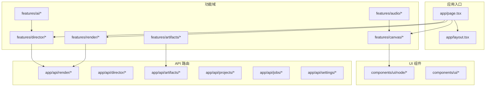
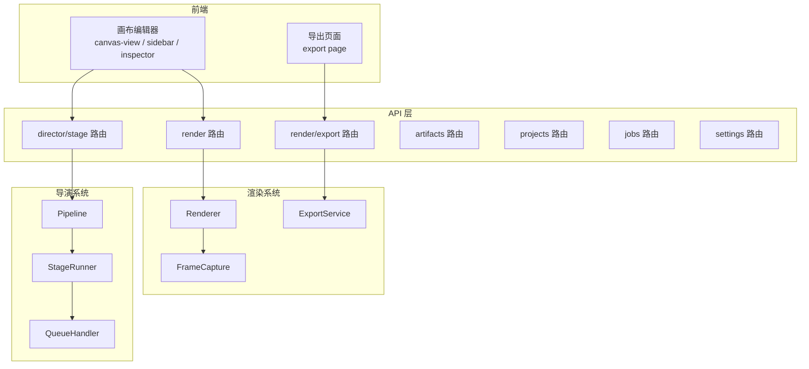
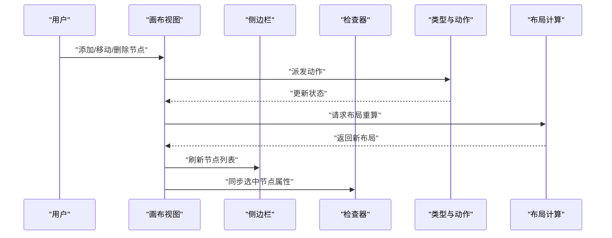
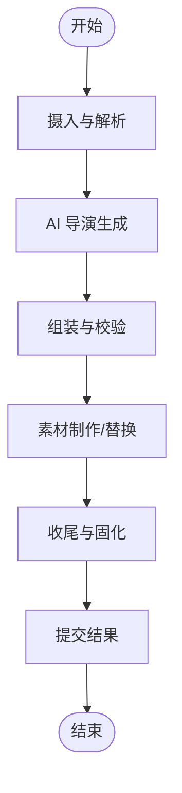
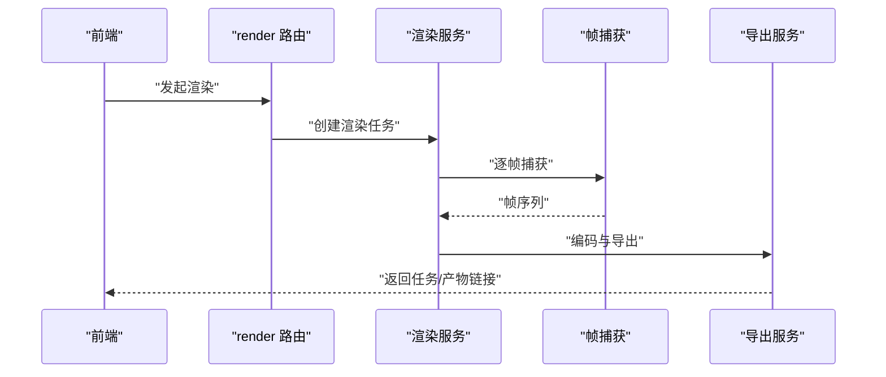
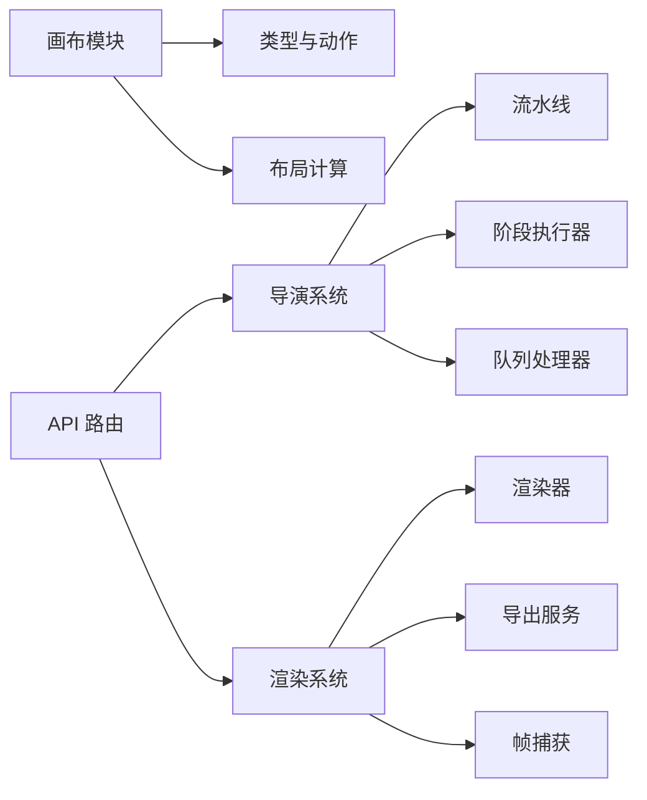

# 项目介绍

<cite>
**本文引用的文件**   
- [README.md](file://README.md)
- [package.json](file://package.json)
- [src/app/page.tsx](file://src/app/page.tsx)
- [src/app/layout.tsx](file://src/app/layout.tsx)
- [src/features/director/index.ts](file://src/features/director/index.ts)
- [src/features/director/pipeline.ts](file://src/features/director/pipeline.ts)
- [src/features/director/stage-runner.ts](file://src/features/director/stage-runner.ts)
- [src/features/director/queue-handler.ts](file://src/features/director/queue-handler.ts)
- [src/features/render/renderer.ts](file://src/features/render/renderer.ts)
- [src/features/render/export-service.ts](file://src/features/render/export-service.ts)
- [src/features/render/frame-capture.ts](file://src/features/render/frame-capture.ts)
- [src/features/canvas/types.ts](file://src/features/canvas/types.ts)
- [src/features/canvas/actions.ts](file://src/features/canvas/actions.ts)
- [src/features/canvas/layout.ts](file://src/features/canvas/layout.ts)
- [src/app/canvas/page.tsx](file://src/app/canvas/page.tsx)
- [src/app/canvas/canvas-view.tsx](file://src/app/canvas/canvas-view.tsx)
- [src/app/canvas/canvas-sidebar.tsx](file://src/app/canvas/canvas-sidebar.tsx)
- [src/app/canvas/canvas-inspector.tsx](file://src/app/canvas/canvas-inspector.tsx)
- [src/app/canvas/export/page.tsx](file://src/app/canvas/export/page.tsx)
- [src/app/api/render/route.ts](file://src/app/api/render/route.ts)
- [src/app/api/render/export/route.ts](file://src/app/api/render/export/route.ts)
- [src/app/api/director/stage/route.ts](file://src/app/api/director/stage/route.ts)
- [src/app/api/artifacts/[id]/route.ts](file://src/app/api/artifacts/[id]/route.ts)
- [src/app/api/projects/route.ts](file://src/app/api/projects/route.ts)
- [src/app/api/jobs/[id]/route.ts](file://src/app/api/jobs/[id]/route.ts)
- [src/app/api/settings/route.ts](file://src/app/api/settings/route.ts)
- [src/components/ui/node/stage-node.tsx](file://src/components/ui/node/stage-node.tsx)
- [src/components/ui/node/shot-node.tsx](file://src/components/ui/node/shot-node.tsx)
- [src/components/ui/node/audio-node.tsx](file://src/components/ui/node/audio-node.tsx)
- [src/components/ui/node/export-node.tsx](file://src/components/ui/node/export-node.tsx)
</cite>

## 目录
1. [简介](#简介)
2. [项目结构](#项目结构)
3. [核心组件](#核心组件)
4. [架构总览](#架构总览)
5. [详细组件分析](#详细组件分析)
6. [依赖关系分析](#依赖关系分析)
7. [性能考量](#性能考量)
8. [故障排查指南](#故障排查指南)
9. [结论](#结论)
10. [附录](#附录)

## 简介
CodeVideoCanvas 是一个 AI 驱动的视频创作平台，面向内容创作者、营销团队与开发者，提供“可视化画布 + AI 导演系统 + 渲染导出”的一体化工作流。其核心价值在于：
- 以可视化方式编排视频片段（镜头、舞台、音频、导出节点），降低复杂视频制作的门槛
- 通过 AI 辅助生成与优化分镜脚本、素材组织与合成策略，提升创作效率
- 将导演式流水线与渲染队列解耦，支持稳定可复现的批量产出
- 提供统一的 API 层，便于集成到现有业务系统与自动化流程中

目标用户群体包括：
- 内容创作者与短视频制作者：快速搭建多镜头叙事与模板化生产
- 营销与运营团队：规模化产出广告、宣传片与社交内容
- 开发者与产品团队：基于 API 与组件能力构建定制化视频应用

差异化优势：
- 导演系统以“阶段化流水线”为核心，强调确定性、可观测性与可回溯性
- 渲染管线与前端画布解耦，支持离线渲染与任务队列
- 组件化 UI 与类型化数据模型，兼顾灵活性与工程化质量

开发背景与设计理念：
- 从“脚本化创作”走向“可视化 + AI”的混合模式，让创意表达更直观
- 以“可组合、可扩展、可验证”为设计原则，确保在复杂场景下的稳定性
- 以“前后端一体化”的工程实践，缩短从原型到生产的距离

使用场景示例：
- 多镜头故事板编排与自动转场
- 基于提示词的分镜生成与素材装配
- 批量导出不同分辨率与编码参数的成品视频

版本历史、许可证与贡献指南等元信息请参考附录。

## 项目结构
仓库采用 Next.js 应用结构，结合 features 分层组织业务域，API 路由位于 app/api，UI 组件集中在 components/ui，领域逻辑位于 src/features。

图表来源
- [src/app/page.tsx:1-200](file://src/app/page.tsx#L1-L200)
- [src/app/layout.tsx:1-200](file://src/app/layout.tsx#L1-L200)
- [src/features/canvas/types.ts:1-200](file://src/features/canvas/types.ts#L1-L200)
- [src/features/director/index.ts:1-200](file://src/features/director/index.ts#L1-L200)
- [src/features/render/renderer.ts:1-200](file://src/features/render/renderer.ts#L1-L200)
- [src/app/api/render/route.ts:1-200](file://src/app/api/render/route.ts#L1-L200)
- [src/app/api/director/stage/route.ts:1-200](file://src/app/api/director/stage/route.ts#L1-L200)
- [src/app/api/artifacts/[id]/route.ts:1-200](file://src/app/api/artifacts/[id]/route.ts#L1-L200)
- [src/app/api/projects/route.ts:1-200](file://src/app/api/projects/route.ts#L1-L200)
- [src/app/api/jobs/[id]/route.ts:1-200](file://src/app/api/jobs/[id]/route.ts#L1-L200)
- [src/app/api/settings/route.ts:1-200](file://src/app/api/settings/route.ts#L1-L200)
- [src/components/ui/node/stage-node.tsx:1-200](file://src/components/ui/node/stage-node.tsx#L1-L200)
- [src/components/ui/node/shot-node.tsx:1-200](file://src/components/ui/node/shot-node.tsx#L1-L200)
- [src/components/ui/node/audio-node.tsx:1-200](file://src/components/ui/node/audio-node.tsx#L1-L200)
- [src/components/ui/node/export-node.tsx:1-200](file://src/components/ui/node/export-node.tsx#L1-L200)

章节来源
- [src/app/page.tsx:1-200](file://src/app/page.tsx#L1-L200)
- [src/app/layout.tsx:1-200](file://src/app/layout.tsx#L1-L200)
- [src/features/canvas/types.ts:1-200](file://src/features/canvas/types.ts#L1-L200)
- [src/features/director/index.ts:1-200](file://src/features/director/index.ts#L1-L200)
- [src/features/render/renderer.ts:1-200](file://src/features/render/renderer.ts#L1-L200)
- [src/app/api/render/route.ts:1-200](file://src/app/api/render/route.ts#L1-L200)
- [src/app/api/director/stage/route.ts:1-200](file://src/app/api/director/stage/route.ts#L1-L200)
- [src/app/api/artifacts/[id]/route.ts:1-200](file://src/app/api/artifacts/[id]/route.ts#L1-L200)
- [src/app/api/projects/route.ts:1-200](file://src/app/api/projects/route.ts#L1-L200)
- [src/app/api/jobs/[id]/route.ts:1-200](file://src/app/api/jobs/[id]/route.ts#L1-L200)
- [src/app/api/settings/route.ts:1-200](file://src/app/api/settings/route.ts#L1-L200)
- [src/components/ui/node/stage-node.tsx:1-200](file://src/components/ui/node/stage-node.tsx#L1-L200)
- [src/components/ui/node/shot-node.tsx:1-200](file://src/components/ui/node/shot-node.tsx#L1-L200)
- [src/components/ui/node/audio-node.tsx:1-200](file://src/components/ui/node/audio-node.tsx#L1-L200)
- [src/components/ui/node/export-node.tsx:1-200](file://src/components/ui/node/export-node.tsx#L1-L200)

## 核心组件
- 可视化画布编辑器
  - 负责镜头、舞台、音频与导出节点的可视化编排与交互
  - 提供侧边栏、检查器与视图容器，支撑拖拽、属性编辑与预览
- AI 辅助创作
  - 提供适配器与类型定义，对接外部 AI 服务，辅助分镜生成与素材建议
- 导演系统
  - 以阶段化流水线为核心，包含会话管理、阶段执行器、结果提交与队列处理器
  - 支持提示词模板、工具函数与校验规则，保障产出的确定性与一致性
- 渲染导出
  - 提供帧捕获、序列处理、编码与导出服务，支持任务队列与缓存
- API 路由
  - 暴露渲染、导出、导演阶段、制品、项目、作业与设置等接口，统一前后端协作

章节来源
- [src/app/canvas/page.tsx:1-200](file://src/app/canvas/page.tsx#L1-L200)
- [src/app/canvas/canvas-view.tsx:1-200](file://src/app/canvas/canvas-view.tsx#L1-L200)
- [src/app/canvas/canvas-sidebar.tsx:1-200](file://src/app/canvas/canvas-sidebar.tsx#L1-L200)
- [src/app/canvas/canvas-inspector.tsx:1-200](file://src/app/canvas/canvas-inspector.tsx#L1-L200)
- [src/features/canvas/types.ts:1-200](file://src/features/canvas/types.ts#L1-L200)
- [src/features/canvas/actions.ts:1-200](file://src/features/canvas/actions.ts#L1-L200)
- [src/features/canvas/layout.ts:1-200](file://src/features/canvas/layout.ts#L1-L200)
- [src/features/ai/index.ts:1-200](file://src/features/ai/index.ts#L1-L200)
- [src/features/director/index.ts:1-200](file://src/features/director/index.ts#L1-L200)
- [src/features/director/pipeline.ts:1-200](file://src/features/director/pipeline.ts#L1-L200)
- [src/features/director/stage-runner.ts:1-200](file://src/features/director/stage-runner.ts#L1-L200)
- [src/features/director/queue-handler.ts:1-200](file://src/features/director/queue-handler.ts#L1-L200)
- [src/features/render/renderer.ts:1-200](file://src/features/render/renderer.ts#L1-L200)
- [src/features/render/export-service.ts:1-200](file://src/features/render/export-service.ts#L1-L200)
- [src/features/render/frame-capture.ts:1-200](file://src/features/render/frame-capture.ts#L1-L200)
- [src/app/api/render/route.ts:1-200](file://src/app/api/render/route.ts#L1-L200)
- [src/app/api/render/export/route.ts:1-200](file://src/app/api/render/export/route.ts#L1-L200)
- [src/app/api/director/stage/route.ts:1-200](file://src/app/api/director/stage/route.ts#L1-L200)
- [src/app/api/artifacts/[id]/route.ts:1-200](file://src/app/api/artifacts/[id]/route.ts#L1-L200)
- [src/app/api/projects/route.ts:1-200](file://src/app/api/projects/route.ts#L1-L200)
- [src/app/api/jobs/[id]/route.ts:1-200](file://src/app/api/jobs/[id]/route.ts#L1-L200)
- [src/app/api/settings/route.ts:1-200](file://src/app/api/settings/route.ts#L1-L200)

## 架构总览
整体架构围绕“前端可视化编排 + 后端导演与渲染服务”展开。前端通过 API 调用导演阶段与渲染任务，后端以阶段化流水线驱动 AI 与渲染过程，并通过队列与缓存保证吞吐与稳定性。

图表来源
- [src/app/canvas/canvas-view.tsx:1-200](file://src/app/canvas/canvas-view.tsx#L1-L200)
- [src/app/canvas/canvas-sidebar.tsx:1-200](file://src/app/canvas/canvas-sidebar.tsx#L1-L200)
- [src/app/canvas/canvas-inspector.tsx:1-200](file://src/app/canvas/canvas-inspector.tsx#L1-L200)
- [src/app/canvas/export/page.tsx:1-200](file://src/app/canvas/export/page.tsx#L1-L200)
- [src/app/api/render/route.ts:1-200](file://src/app/api/render/route.ts#L1-L200)
- [src/app/api/render/export/route.ts:1-200](file://src/app/api/render/export/route.ts#L1-L200)
- [src/app/api/director/stage/route.ts:1-200](file://src/app/api/director/stage/route.ts#L1-L200)
- [src/app/api/artifacts/[id]/route.ts:1-200](file://src/app/api/artifacts/[id]/route.ts#L1-L200)
- [src/app/api/projects/route.ts:1-200](file://src/app/api/projects/route.ts#L1-L200)
- [src/app/api/jobs/[id]/route.ts:1-200](file://src/app/api/jobs/[id]/route.ts#L1-L200)
- [src/app/api/settings/route.ts:1-200](file://src/app/api/settings/route.ts#L1-L200)
- [src/features/director/pipeline.ts:1-200](file://src/features/director/pipeline.ts#L1-L200)
- [src/features/director/stage-runner.ts:1-200](file://src/features/director/stage-runner.ts#L1-L200)
- [src/features/director/queue-handler.ts:1-200](file://src/features/director/queue-handler.ts#L1-L200)
- [src/features/render/renderer.ts:1-200](file://src/features/render/renderer.ts#L1-L200)
- [src/features/render/export-service.ts:1-200](file://src/features/render/export-service.ts#L1-L200)
- [src/features/render/frame-capture.ts:1-200](file://src/features/render/frame-capture.ts#L1-L200)

## 详细组件分析

### 可视化画布编辑器
- 职责
  - 提供舞台、镜头、音频与导出节点的可视化编排界面
  - 维护画布状态、布局与交互行为
- 关键模块
  - 类型与动作：定义节点类型、状态机与变更操作
  - 布局计算：根据节点关系计算位置与尺寸
  - 视图与面板：主视图、侧边栏与检查器协同展示与编辑
- 典型流程
  - 用户在画布中添加或调整节点
  - 触发动作更新状态并重新布局
  - 检查器同步显示选中节点属性
  - 导出页面读取最终编排结果进行渲染

图表来源
- [src/app/canvas/canvas-view.tsx:1-200](file://src/app/canvas/canvas-view.tsx#L1-L200)
- [src/app/canvas/canvas-sidebar.tsx:1-200](file://src/app/canvas/canvas-sidebar.tsx#L1-L200)
- [src/app/canvas/canvas-inspector.tsx:1-200](file://src/app/canvas/canvas-inspector.tsx#L1-L200)
- [src/features/canvas/types.ts:1-200](file://src/features/canvas/types.ts#L1-L200)
- [src/features/canvas/actions.ts:1-200](file://src/features/canvas/actions.ts#L1-L200)
- [src/features/canvas/layout.ts:1-200](file://src/features/canvas/layout.ts#L1-L200)

章节来源
- [src/app/canvas/page.tsx:1-200](file://src/app/canvas/page.tsx#L1-L200)
- [src/app/canvas/canvas-view.tsx:1-200](file://src/app/canvas/canvas-view.tsx#L1-L200)
- [src/app/canvas/canvas-sidebar.tsx:1-200](file://src/app/canvas/canvas-sidebar.tsx#L1-L200)
- [src/app/canvas/canvas-inspector.tsx:1-200](file://src/app/canvas/canvas-inspector.tsx#L1-L200)
- [src/features/canvas/types.ts:1-200](file://src/features/canvas/types.ts#L1-L200)
- [src/features/canvas/actions.ts:1-200](file://src/features/canvas/actions.ts#L1-L200)
- [src/features/canvas/layout.ts:1-200](file://src/features/canvas/layout.ts#L1-L200)

### AI 辅助创作
- 职责
  - 封装对外部 AI 服务的适配与类型定义
  - 提供分镜生成、素材建议与提示词模板
- 关键模块
  - 适配器：统一调用外部服务，屏蔽差异
  - 类型与模式：约束输入输出结构，增强可测试性
- 使用方式
  - 在导演阶段或画布操作中调用 AI 能力，生成或优化内容

章节来源
- [src/features/ai/index.ts:1-200](file://src/features/ai/index.ts#L1-L200)
- [src/features/ai/schemas.ts:1-200](file://src/features/ai/schemas.ts#L1-L200)
- [src/features/ai/types.ts:1-200](file://src/features/ai/types.ts#L1-L200)
- [src/features/ai/stepfun-adapter.ts:1-200](file://src/features/ai/stepfun-adapter.ts#L1-L200)

### 导演系统
- 职责
  - 以阶段化流水线编排创作步骤，驱动 AI 与资源处理
  - 管理会话、阶段执行与结果提交，提供队列处理能力
- 关键模块
  - Pipeline：定义阶段顺序与依赖
  - StageRunner：执行单个阶段，处理输入输出与错误
  - QueueHandler：调度与并发控制，保障稳定性
  - SessionStore/Repository：持久化会话与运行时数据
- 典型流程
  - 接收编排结果与提示词
  - 按阶段执行，必要时调用 AI 与工具
  - 提交阶段结果，进入下一环节或结束

图表来源
- [src/features/director/pipeline.ts:1-200](file://src/features/director/pipeline.ts#L1-L200)
- [src/features/director/stage-runner.ts:1-200](file://src/features/director/stage-runner.ts#L1-L200)
- [src/features/director/queue-handler.ts:1-200](file://src/features/director/queue-handler.ts#L1-L200)
- [src/features/director/session-store.ts:1-200](file://src/features/director/session-store.ts#L1-L200)
- [src/features/director/runtime-repository.ts:1-200](file://src/features/director/runtime-repository.ts#L1-L200)

章节来源
- [src/features/director/index.ts:1-200](file://src/features/director/index.ts#L1-L200)
- [src/features/director/pipeline.ts:1-200](file://src/features/director/pipeline.ts#L1-L200)
- [src/features/director/stage-runner.ts:1-200](file://src/features/director/stage-runner.ts#L1-L200)
- [src/features/director/queue-handler.ts:1-200](file://src/features/director/queue-handler.ts#L1-L200)
- [src/features/director/session-store.ts:1-200](file://src/features/director/session-store.ts#L1-L200)
- [src/features/director/runtime-repository.ts:1-200](file://src/features/director/runtime-repository.ts#L1-L200)

### 渲染导出
- 职责
  - 将画布编排结果转换为最终视频文件
  - 提供帧捕获、序列处理、编码与导出服务
- 关键模块
  - Renderer：渲染引擎，协调帧捕获与编码
  - ExportService：导出服务，管理任务与产物
  - FrameCapture：帧抓取与序列生成
- 典型流程
  - 接收渲染参数与编排数据
  - 逐帧捕获与合成
  - 编码并输出文件，记录任务状态

图表来源
- [src/app/api/render/route.ts:1-200](file://src/app/api/render/route.ts#L1-L200)
- [src/app/api/render/export/route.ts:1-200](file://src/app/api/render/export/route.ts#L1-L200)
- [src/features/render/renderer.ts:1-200](file://src/features/render/renderer.ts#L1-L200)
- [src/features/render/export-service.ts:1-200](file://src/features/render/export-service.ts#L1-L200)
- [src/features/render/frame-capture.ts:1-200](file://src/features/render/frame-capture.ts#L1-L200)

章节来源
- [src/app/canvas/export/page.tsx:1-200](file://src/app/canvas/export/page.tsx#L1-L200)
- [src/app/api/render/route.ts:1-200](file://src/app/api/render/route.ts#L1-L200)
- [src/app/api/render/export/route.ts:1-200](file://src/app/api/render/export/route.ts#L1-L200)
- [src/features/render/renderer.ts:1-200](file://src/features/render/renderer.ts#L1-L200)
- [src/features/render/export-service.ts:1-200](file://src/features/render/export-service.ts#L1-L200)
- [src/features/render/frame-capture.ts:1-200](file://src/features/render/frame-capture.ts#L1-L200)

### API 路由与服务契约
- 渲染与导出
  - 提供创建渲染任务、查询任务状态与获取导出结果的接口
- 导演阶段
  - 提供阶段执行与结果提交的接口，便于前端驱动流水线
- 制品与项目
  - 提供制品访问与项目管理接口，支撑资产复用与协作
- 作业与设置
  - 提供作业查询与全局设置读写接口

章节来源
- [src/app/api/render/route.ts:1-200](file://src/app/api/render/route.ts#L1-L200)
- [src/app/api/render/export/route.ts:1-200](file://src/app/api/render/export/route.ts#L1-L200)
- [src/app/api/director/stage/route.ts:1-200](file://src/app/api/director/stage/route.ts#L1-L200)
- [src/app/api/artifacts/[id]/route.ts:1-200](file://src/app/api/artifacts/[id]/route.ts#L1-L200)
- [src/app/api/projects/route.ts:1-200](file://src/app/api/projects/route.ts#L1-L200)
- [src/app/api/jobs/[id]/route.ts:1-200](file://src/app/api/jobs/[id]/route.ts#L1-L200)
- [src/app/api/settings/route.ts:1-200](file://src/app/api/settings/route.ts#L1-L200)

### UI 节点组件
- 舞台节点：表示场景与布局容器
- 镜头节点：表示具体拍摄或动画片段
- 音频节点：表示音轨与音效
- 导出节点：表示输出配置与格式

章节来源
- [src/components/ui/node/stage-node.tsx:1-200](file://src/components/ui/node/stage-node.tsx#L1-L200)
- [src/components/ui/node/shot-node.tsx:1-200](file://src/components/ui/node/shot-node.tsx#L1-L200)
- [src/components/ui/node/audio-node.tsx:1-200](file://src/components/ui/node/audio-node.tsx#L1-L200)
- [src/components/ui/node/export-node.tsx:1-200](file://src/components/ui/node/export-node.tsx#L1-L200)

## 依赖关系分析
- 模块耦合
  - 画布编辑器依赖类型与动作模块，保持高内聚
  - 导演系统通过 Pipeline 与 StageRunner 解耦阶段实现
  - 渲染系统通过 ExportService 与 Renderer 分离关注点
- 外部依赖
  - AI 适配器屏蔽外部服务差异，便于替换与扩展
  - API 路由作为统一入口，聚合各功能域能力

图表来源
- [src/features/canvas/types.ts:1-200](file://src/features/canvas/types.ts#L1-L200)
- [src/features/canvas/actions.ts:1-200](file://src/features/canvas/actions.ts#L1-L200)
- [src/features/canvas/layout.ts:1-200](file://src/features/canvas/layout.ts#L1-L200)
- [src/features/director/pipeline.ts:1-200](file://src/features/director/pipeline.ts#L1-L200)
- [src/features/director/stage-runner.ts:1-200](file://src/features/director/stage-runner.ts#L1-L200)
- [src/features/director/queue-handler.ts:1-200](file://src/features/director/queue-handler.ts#L1-L200)
- [src/features/render/renderer.ts:1-200](file://src/features/render/renderer.ts#L1-L200)
- [src/features/render/export-service.ts:1-200](file://src/features/render/export-service.ts#L1-L200)
- [src/features/render/frame-capture.ts:1-200](file://src/features/render/frame-capture.ts#L1-L200)
- [src/app/api/render/route.ts:1-200](file://src/app/api/render/route.ts#L1-L200)
- [src/app/api/director/stage/route.ts:1-200](file://src/app/api/director/stage/route.ts#L1-L200)

章节来源
- [src/features/canvas/types.ts:1-200](file://src/features/canvas/types.ts#L1-L200)
- [src/features/canvas/actions.ts:1-200](file://src/features/canvas/actions.ts#L1-L200)
- [src/features/canvas/layout.ts:1-200](file://src/features/canvas/layout.ts#L1-L200)
- [src/features/director/pipeline.ts:1-200](file://src/features/director/pipeline.ts#L1-L200)
- [src/features/director/stage-runner.ts:1-200](file://src/features/director/stage-runner.ts#L1-L200)
- [src/features/director/queue-handler.ts:1-200](file://src/features/director/queue-handler.ts#L1-L200)
- [src/features/render/renderer.ts:1-200](file://src/features/render/renderer.ts#L1-L200)
- [src/features/render/export-service.ts:1-200](file://src/features/render/export-service.ts#L1-L200)
- [src/features/render/frame-capture.ts:1-200](file://src/features/render/frame-capture.ts#L1-L200)
- [src/app/api/render/route.ts:1-200](file://src/app/api/render/route.ts#L1-L200)
- [src/app/api/director/stage/route.ts:1-200](file://src/app/api/director/stage/route.ts#L1-L200)

## 性能考量
- 渲染与导出
  - 帧捕获与编码应尽可能并行化，避免阻塞主线程
  - 引入缓存机制减少重复计算与 IO 开销
- 导演系统
  - 阶段执行需具备幂等性与重试能力，提高鲁棒性
  - 队列处理器应支持限流与背压，防止过载
- 前端交互
  - 大画布场景下采用虚拟滚动与增量更新，降低渲染压力
  - 布局计算尽量缓存与懒加载，减少频繁重排

[本节为通用指导，不直接分析具体文件]

## 故障排查指南
- 常见问题定位
  - 渲染失败：检查渲染任务状态与导出结果路径
  - 导演阶段异常：查看阶段日志与会话数据，确认输入合法性
  - 制品访问错误：核对制品 ID 与权限设置
- 调试建议
  - 启用详细日志与追踪，记录关键步骤输入输出
  - 对阶段执行与渲染过程增加断点与快照，便于复现问题

章节来源
- [src/app/api/render/route.ts:1-200](file://src/app/api/render/route.ts#L1-L200)
- [src/app/api/render/export/route.ts:1-200](file://src/app/api/render/export/route.ts#L1-L200)
- [src/app/api/director/stage/route.ts:1-200](file://src/app/api/director/stage/route.ts#L1-L200)
- [src/app/api/artifacts/[id]/route.ts:1-200](file://src/app/api/artifacts/[id]/route.ts#L1-L200)
- [src/app/api/jobs/[id]/route.ts:1-200](file://src/app/api/jobs/[id]/route.ts#L1-L200)

## 结论
CodeVideoCanvas 以“可视化编排 + AI 导演 + 渲染导出”为核心，构建了高效、稳定且可扩展的视频创作平台。其差异化在于阶段化流水线与强类型数据模型，既满足专业需求，又兼顾易用性。通过清晰的架构与模块化设计，平台具备良好的演进空间与生态集成能力。

[本节为总结性内容，不直接分析具体文件]

## 附录
- 基本信息
  - 项目名称：CodeVideoCanvas
  - 技术栈：Next.js、TypeScript、React、Node.js
  - 包管理与锁文件：pnpm
- 版本历史与变更记录
  - 参见文档目录中的更新与审计记录
- 许可证
  - 请参见仓库根目录许可证文件
- 贡献指南
  - 参见文档目录中的约定与工作流说明

章节来源
- [README.md:1-200](file://README.md#L1-L200)
- [package.json:1-200](file://package.json#L1-L200)