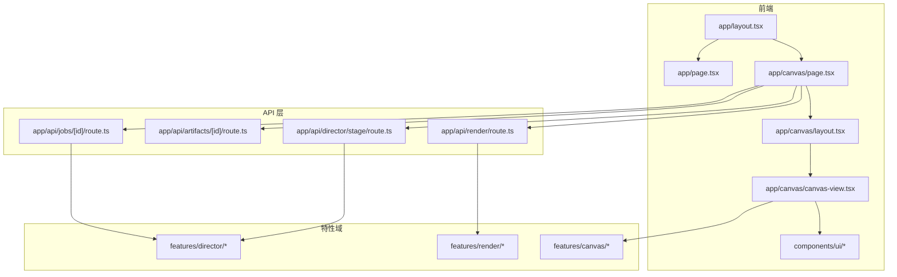
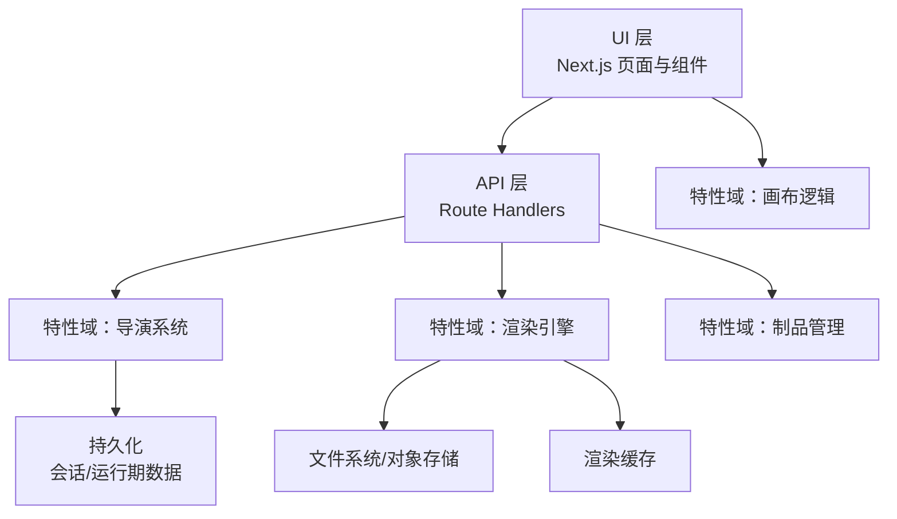
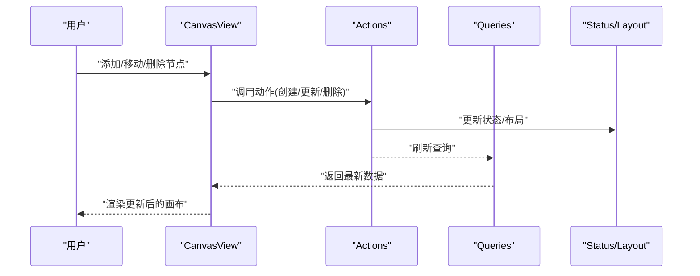
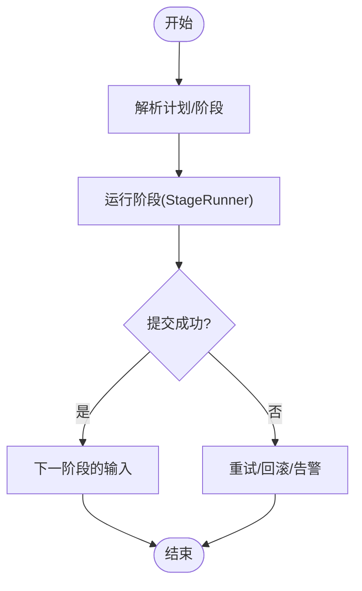
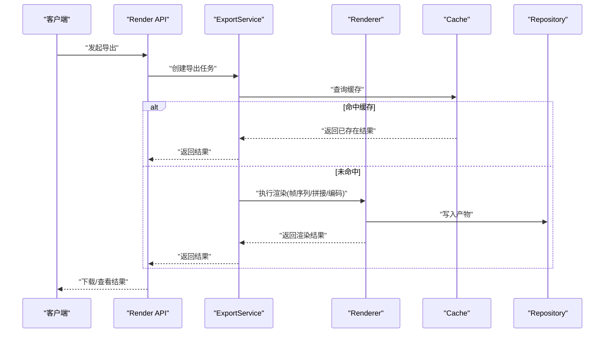
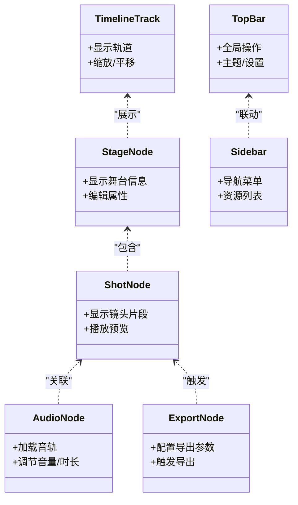
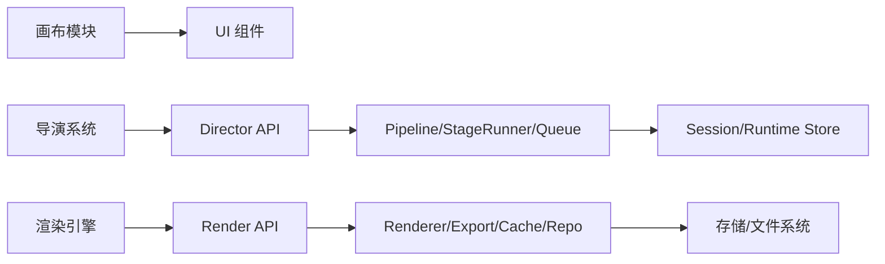

# 项目概述

<cite>
**本文引用的文件**   
- [README.md](file://README.md)
- [package.json](file://package.json)
- [next.config.ts](file://next.config.ts)
- [tsconfig.json](file://tsconfig.json)
- [src/app/layout.tsx](file://src/app/layout.tsx)
- [src/app/page.tsx](file://src/app/page.tsx)
- [src/app/canvas/page.tsx](file://src/app/canvas/page.tsx)
- [src/app/canvas/layout.tsx](file://src/app/canvas/layout.tsx)
- [src/app/canvas/canvas-view.tsx](file://src/app/canvas/canvas-view.tsx)
- [src/app/canvas/shot/[id]/page.tsx](file://src/app/canvas/shot/[id]/page.tsx)
- [src/app/api/render/route.ts](file://src/app/api/render/route.ts)
- [src/app/api/artifacts/[id]/route.ts](file://src/app/api/artifacts/[id]/route.ts)
- [src/app/api/director/stage/route.ts](file://src/app/api/director/stage/route.ts)
- [src/app/api/jobs/[id]/route.ts](file://src/app/api/jobs/[id]/route.ts)
- [src/features/director/index.ts](file://src/features/director/index.ts)
- [src/features/director/pipeline.ts](file://src/features/director/pipeline.ts)
- [src/features/director/stage-runner.ts](file://src/features/director/stage-runner.ts)
- [src/features/director/runtime-repository.ts](file://src/features/director/runtime-repository.ts)
- [src/features/director/session-store.ts](file://src/features/director/session-store.ts)
- [src/features/director/queue-handler.ts](file://src/features/director/queue-handler.ts)
- [src/features/render/renderer.ts](file://src/features/render/renderer.ts)
- [src/features/render/export-service.ts](file://src/features/render/export-service.ts)
- [src/features/render/repository.ts](file://src/features/render/repository.ts)
- [src/features/render/cache.ts](file://src/features/render/cache.ts)
- [src/features/render/frame-sequence.ts](file://src/features/render/frame-sequence.ts)
- [src/features/render/concat.ts](file://src/features/render/concat.ts)
- [src/features/render/encode.ts](file://src/features/render/encode.ts)
- [src/features/render/types.ts](file://src/features/render/types.ts)
- [src/features/canvas/actions.ts](file://src/features/canvas/actions.ts)
- [src/features/canvas/queries.ts](file://src/features/canvas/queries.ts)
- [src/features/canvas/schemas.ts](file://src/features/canvas/schemas.ts)
- [src/features/canvas/status.ts](file://src/features/canvas/status.ts)
- [src/features/canvas/fan-out.ts](file://src/features/canvas/fan-out.ts)
- [src/features/canvas/layout.ts](file://src/features/canvas/layout.ts)
- [src/components/ui/node/stage-node.tsx](file://src/components/ui/node/stage-node.tsx)
- [src/components/ui/node/shot-node.tsx](file://src/components/ui/node/shot-node.tsx)
- [src/components/ui/node/audio-node.tsx](file://src/components/ui/node/audio-node.tsx)
- [src/components/ui/node/export-node.tsx](file://src/components/ui/node/export-node.tsx)
- [src/components/ui/timeline-track.tsx](file://src/components/ui/timeline-track.tsx)
- [src/components/ui/top-bar.tsx](file://src/components/ui/top-bar.tsx)
- [src/components/ui/sidebar.tsx](file://src/components/ui/sidebar.tsx)
</cite>

## 目录
1. [简介](#简介)
2. [项目结构](#项目结构)
3. [核心组件](#核心组件)
4. [架构总览](#架构总览)
5. [详细组件分析](#详细组件分析)
6. [依赖分析](#依赖分析)
7. [性能考虑](#性能考虑)
8. [故障排查指南](#故障排查指南)
9. [结论](#结论)
10. [附录](#附录)

## 简介
CodeVideoCanvas 是一个 AI 驱动的视频创作平台，围绕“可视化画布编辑器 + 导演系统 + 渲染引擎”的三位一体架构，提供从脚本到分镜、从素材编排到最终导出的端到端视频制作体验。其核心价值在于：
- 以可视化方式组织“舞台（Stage）—镜头（Shot）—节点（Node）”，将复杂的多模态生成与合成流程抽象为可编辑的流程图。
- 通过“导演系统”将人类意图转化为结构化计划，并驱动多阶段工作流（编排、生成、校验、合成）。
- 借助“渲染引擎”完成帧序列捕获、编码与导出，支持缓存与队列化执行，提升稳定性与吞吐。

技术栈选择：
- Next.js：统一前后端路由与服务端能力，便于 API 与页面共存，利于部署与扩展。
- React + TypeScript：组件化 UI 与强类型约束，提高大型应用的可维护性与协作效率。
- Tailwind CSS：原子化样式体系，快速构建一致的设计系统与响应式界面。
- Node.js 运行时：在服务端承载导演工作流、渲染任务与外部服务集成。

主要用例与场景：
- 创意脚本到视频：输入创意描述，自动生成分镜计划，驱动素材生成与剪辑合成。
- 批量内容生产：基于模板与流水线，规模化产出短视频或系列内容。
- 团队协作：在可视化画布中协同编排镜头、调整参数、管理资产与版本。

[本节不直接分析具体源文件]

## 项目结构
仓库采用按功能域与层次混合的组织方式：
- src/app：Next.js App Router 页面与 API 路由，承载用户界面入口与后端接口。
- src/features：按业务域划分的核心特性模块，包括 director（导演）、render（渲染）、canvas（画布）、audio（音频）、artifacts（制品）、ai（AI 适配）等。
- src/components：通用 UI 组件与节点组件，支撑画布与时间线交互。
- src/lib：跨领域工具库（配置、数据库、确定性、GSAP、Hooks、布局、队列、存储等）。
- docs：设计、规范、审计与更新文档。
- scripts：部署、开发、设置与探索脚本。

图示来源
- [src/app/layout.tsx](file://src/app/layout.tsx)
- [src/app/page.tsx](file://src/app/page.tsx)
- [src/app/canvas/page.tsx](file://src/app/canvas/page.tsx)
- [src/app/canvas/layout.tsx](file://src/app/canvas/layout.tsx)
- [src/app/canvas/canvas-view.tsx](file://src/app/canvas/canvas-view.tsx)
- [src/app/api/render/route.ts](file://src/app/api/render/route.ts)
- [src/app/api/artifacts/[id]/route.ts](file://src/app/api/artifacts/[id]/route.ts)
- [src/app/api/director/stage/route.ts](file://src/app/api/director/stage/route.ts)
- [src/app/api/jobs/[id]/route.ts](file://src/app/api/jobs/[id]/route.ts)
- [src/features/director/index.ts](file://src/features/director/index.ts)
- [src/features/render/renderer.ts](file://src/features/render/renderer.ts)
- [src/features/canvas/actions.ts](file://src/features/canvas/actions.ts)

章节来源
- [README.md](file://README.md)
- [package.json](file://package.json)
- [next.config.ts](file://next.config.ts)
- [tsconfig.json](file://tsconfig.json)

## 核心组件
- 可视化画布编辑器
  - 负责舞台与镜头的可视化编排、节点连接、属性检查器与侧边栏导航。
  - 关键文件：画布页面与视图、动作与查询、状态与布局、扇出计算等。
- 导演系统
  - 将高层目标拆解为阶段化计划，驱动编排、生成、校验、收尾等阶段，持久化会话与运行期数据。
  - 关键文件：索引、管道、阶段运行器、运行期仓库、会话存储、队列处理器等。
- 渲染引擎
  - 负责帧序列捕获、拼接、编码与导出，提供缓存与仓库抽象，确保可重复与可扩展。
  - 关键文件：渲染器、导出服务、仓库、缓存、帧序列、拼接、编码、类型定义等。
- 通用 UI 与节点
  - 提供舞台节点、镜头节点、音频节点、导出节点以及时间线、顶栏、侧边栏等基础控件。

章节来源
- [src/app/canvas/page.tsx](file://src/app/canvas/page.tsx)
- [src/app/canvas/layout.tsx](file://src/app/canvas/layout.tsx)
- [src/app/canvas/canvas-view.tsx](file://src/app/canvas/canvas-view.tsx)
- [src/features/canvas/actions.ts](file://src/features/canvas/actions.ts)
- [src/features/canvas/queries.ts](file://src/features/canvas/queries.ts)
- [src/features/canvas/schemas.ts](file://src/features/canvas/schemas.ts)
- [src/features/canvas/status.ts](file://src/features/canvas/status.ts)
- [src/features/canvas/fan-out.ts](file://src/features/canvas/fan-out.ts)
- [src/features/canvas/layout.ts](file://src/features/canvas/layout.ts)
- [src/features/director/index.ts](file://src/features/director/index.ts)
- [src/features/director/pipeline.ts](file://src/features/director/pipeline.ts)
- [src/features/director/stage-runner.ts](file://src/features/director/stage-runner.ts)
- [src/features/director/runtime-repository.ts](file://src/features/director/runtime-repository.ts)
- [src/features/director/session-store.ts](file://src/features/director/session-store.ts)
- [src/features/director/queue-handler.ts](file://src/features/director/queue-handler.ts)
- [src/features/render/renderer.ts](file://src/features/render/renderer.ts)
- [src/features/render/export-service.ts](file://src/features/render/export-service.ts)
- [src/features/render/repository.ts](file://src/features/render/repository.ts)
- [src/features/render/cache.ts](file://src/features/render/cache.ts)
- [src/features/render/frame-sequence.ts](file://src/features/render/frame-sequence.ts)
- [src/features/render/concat.ts](file://src/features/render/concat.ts)
- [src/features/render/encode.ts](file://src/features/render/encode.ts)
- [src/features/render/types.ts](file://src/features/render/types.ts)
- [src/components/ui/node/stage-node.tsx](file://src/components/ui/node/stage-node.tsx)
- [src/components/ui/node/shot-node.tsx](file://src/components/ui/node/shot-node.tsx)
- [src/components/ui/node/audio-node.tsx](file://src/components/ui/node/audio-node.tsx)
- [src/components/ui/node/export-node.tsx](file://src/components/ui/node/export-node.tsx)
- [src/components/ui/timeline-track.tsx](file://src/components/ui/timeline-track.tsx)
- [src/components/ui/top-bar.tsx](file://src/components/ui/top-bar.tsx)
- [src/components/ui/sidebar.tsx](file://src/components/ui/sidebar.tsx)

## 架构总览
系统分为三层：
- 表现层（Next.js 页面与组件）：提供画布编辑器、时间线、属性面板与全局导航。
- 服务层（API 路由）：暴露导演、渲染、制品与作业等接口，协调特性域逻辑。
- 特性域层（Features）：导演系统、渲染引擎、画布逻辑、音频与制品管理等。

图示来源
- [src/app/canvas/page.tsx](file://src/app/canvas/page.tsx)
- [src/app/api/render/route.ts](file://src/app/api/render/route.ts)
- [src/app/api/director/stage/route.ts](file://src/app/api/director/stage/route.ts)
- [src/app/api/artifacts/[id]/route.ts](file://src/app/api/artifacts/[id]/route.ts)
- [src/features/director/index.ts](file://src/features/director/index.ts)
- [src/features/render/renderer.ts](file://src/features/render/renderer.ts)
- [src/features/render/repository.ts](file://src/features/render/repository.ts)
- [src/features/render/cache.ts](file://src/features/render/cache.ts)
- [src/features/canvas/actions.ts](file://src/features/canvas/actions.ts)

## 详细组件分析

### 可视化画布编辑器
- 职责
  - 提供舞台与镜头的可视化编排界面，支持节点拖拽、连线、属性检查与侧边栏导航。
  - 封装画布动作（增删改查）、查询、状态机与布局算法，保证一致性。
- 关键实现要点
  - 页面与布局：画布入口页与嵌套布局，承载主视图与侧边栏。
  - 动作与查询：对画布数据进行变更与读取，配合 Schema 进行校验。
  - 状态与布局：维护节点位置、可见性、层级关系与自动布局策略。
  - 扇出计算：根据节点依赖关系计算渲染顺序与并行度。
- 典型交互
  - 用户在画布中添加/删除节点，触发动作；查询返回最新状态；布局算法重排节点；扇出计算决定后续处理顺序。

图示来源
- [src/app/canvas/canvas-view.tsx](file://src/app/canvas/canvas-view.tsx)
- [src/features/canvas/actions.ts](file://src/features/canvas/actions.ts)
- [src/features/canvas/queries.ts](file://src/features/canvas/queries.ts)
- [src/features/canvas/schemas.ts](file://src/features/canvas/schemas.ts)
- [src/features/canvas/status.ts](file://src/features/canvas/status.ts)
- [src/features/canvas/layout.ts](file://src/features/canvas/layout.ts)
- [src/features/canvas/fan-out.ts](file://src/features/canvas/fan-out.ts)

章节来源
- [src/app/canvas/page.tsx](file://src/app/canvas/page.tsx)
- [src/app/canvas/layout.tsx](file://src/app/canvas/layout.tsx)
- [src/app/canvas/canvas-view.tsx](file://src/app/canvas/canvas-view.tsx)
- [src/features/canvas/actions.ts](file://src/features/canvas/actions.ts)
- [src/features/canvas/queries.ts](file://src/features/canvas/queries.ts)
- [src/features/canvas/schemas.ts](file://src/features/canvas/schemas.ts)
- [src/features/canvas/status.ts](file://src/features/canvas/status.ts)
- [src/features/canvas/fan-out.ts](file://src/features/canvas/fan-out.ts)
- [src/features/canvas/layout.ts](file://src/features/canvas/layout.ts)

### 导演系统
- 职责
  - 将高层目标分解为阶段化计划，驱动编排、生成、校验、收尾等阶段，管理会话与运行期数据，并通过队列处理器调度任务。
- 关键实现要点
  - 管道与阶段运行器：定义阶段执行顺序与错误恢复策略。
  - 运行期仓库与会话存储：持久化中间产物与上下文，保障可追溯与可重试。
  - 队列处理器：串行/并发控制，避免资源争用与过载。
- 典型流程
  - 接收导演请求 -> 解析阶段 -> 运行阶段 -> 提交结果 -> 进入下一阶段或结束。

图示来源
- [src/features/director/pipeline.ts](file://src/features/director/pipeline.ts)
- [src/features/director/stage-runner.ts](file://src/features/director/stage-runner.ts)
- [src/features/director/runtime-repository.ts](file://src/features/director/runtime-repository.ts)
- [src/features/director/session-store.ts](file://src/features/director/session-store.ts)
- [src/features/director/queue-handler.ts](file://src/features/director/queue-handler.ts)

章节来源
- [src/features/director/index.ts](file://src/features/director/index.ts)
- [src/features/director/pipeline.ts](file://src/features/director/pipeline.ts)
- [src/features/director/stage-runner.ts](file://src/features/director/stage-runner.ts)
- [src/features/director/runtime-repository.ts](file://src/features/director/runtime-repository.ts)
- [src/features/director/session-store.ts](file://src/features/director/session-store.ts)
- [src/features/director/queue-handler.ts](file://src/features/director/queue-handler.ts)

### 渲染引擎
- 职责
  - 将画布中的镜头与节点组合为帧序列，执行编码与导出，并提供缓存与仓库抽象，确保可重复与可扩展。
- 关键实现要点
  - 渲染器：协调帧捕获、拼接与编码。
  - 导出服务：对外暴露导出接口，管理任务生命周期。
  - 仓库与缓存：持久化中间产物与结果，命中缓存加速重复任务。
  - 帧序列与拼接：按时间轴组装帧，合并音视频轨道。
  - 编码：输出标准媒体格式。
- 典型流程
  - 收到导出请求 -> 解析渲染参数 -> 命中缓存或生成帧序列 -> 拼接与编码 -> 写入仓库 -> 返回结果。

图示来源
- [src/app/api/render/route.ts](file://src/app/api/render/route.ts)
- [src/features/render/export-service.ts](file://src/features/render/export-service.ts)
- [src/features/render/renderer.ts](file://src/features/render/renderer.ts)
- [src/features/render/cache.ts](file://src/features/render/cache.ts)
- [src/features/render/repository.ts](file://src/features/render/repository.ts)
- [src/features/render/frame-sequence.ts](file://src/features/render/frame-sequence.ts)
- [src/features/render/concat.ts](file://src/features/render/concat.ts)
- [src/features/render/encode.ts](file://src/features/render/encode.ts)
- [src/features/render/types.ts](file://src/features/render/types.ts)

章节来源
- [src/app/api/render/route.ts](file://src/app/api/render/route.ts)
- [src/features/render/export-service.ts](file://src/features/render/export-service.ts)
- [src/features/render/renderer.ts](file://src/features/render/renderer.ts)
- [src/features/render/cache.ts](file://src/features/render/cache.ts)
- [src/features/render/repository.ts](file://src/features/render/repository.ts)
- [src/features/render/frame-sequence.ts](file://src/features/render/frame-sequence.ts)
- [src/features/render/concat.ts](file://src/features/render/concat.ts)
- [src/features/render/encode.ts](file://src/features/render/encode.ts)
- [src/features/render/types.ts](file://src/features/render/types.ts)

### 节点与时间线组件
- 职责
  - 提供舞台节点、镜头节点、音频节点、导出节点等可视化元素，以及时间线与顶部栏、侧边栏等辅助控件。
- 关键实现要点
  - 节点组件：封装节点的数据绑定、交互与预览。
  - 时间线：展示帧序列与轨道，支持缩放与定位。
  - 导航控件：提供全局操作与上下文切换。

图示来源
- [src/components/ui/node/stage-node.tsx](file://src/components/ui/node/stage-node.tsx)
- [src/components/ui/node/shot-node.tsx](file://src/components/ui/node/shot-node.tsx)
- [src/components/ui/node/audio-node.tsx](file://src/components/ui/node/audio-node.tsx)
- [src/components/ui/node/export-node.tsx](file://src/components/ui/node/export-node.tsx)
- [src/components/ui/timeline-track.tsx](file://src/components/ui/timeline-track.tsx)
- [src/components/ui/top-bar.tsx](file://src/components/ui/top-bar.tsx)
- [src/components/ui/sidebar.tsx](file://src/components/ui/sidebar.tsx)

章节来源
- [src/components/ui/node/stage-node.tsx](file://src/components/ui/node/stage-node.tsx)
- [src/components/ui/node/shot-node.tsx](file://src/components/ui/node/shot-node.tsx)
- [src/components/ui/node/audio-node.tsx](file://src/components/ui/node/audio-node.tsx)
- [src/components/ui/node/export-node.tsx](file://src/components/ui/node/export-node.tsx)
- [src/components/ui/timeline-track.tsx](file://src/components/ui/timeline-track.tsx)
- [src/components/ui/top-bar.tsx](file://src/components/ui/top-bar.tsx)
- [src/components/ui/sidebar.tsx](file://src/components/ui/sidebar.tsx)

## 依赖分析
- 模块耦合
  - 画布模块与 UI 组件低耦合，通过动作/查询/Schema 契约交互。
  - 导演系统与渲染引擎通过 API 路由解耦，内部通过仓库/缓存抽象访问持久化。
- 外部依赖
  - Next.js 提供路由、服务端渲染与 API 能力。
  - React/TypeScript/Tailwind 构成前端工程化基础。
  - 可能的媒体处理与存储后端由仓库与导出服务抽象，便于替换实现。

图示来源
- [src/features/canvas/actions.ts](file://src/features/canvas/actions.ts)
- [src/features/director/pipeline.ts](file://src/features/director/pipeline.ts)
- [src/features/director/stage-runner.ts](file://src/features/director/stage-runner.ts)
- [src/features/director/queue-handler.ts](file://src/features/director/queue-handler.ts)
- [src/features/render/renderer.ts](file://src/features/render/renderer.ts)
- [src/features/render/export-service.ts](file://src/features/render/export-service.ts)
- [src/features/render/cache.ts](file://src/features/render/cache.ts)
- [src/features/render/repository.ts](file://src/features/render/repository.ts)
- [src/app/api/director/stage/route.ts](file://src/app/api/director/stage/route.ts)
- [src/app/api/render/route.ts](file://src/app/api/render/route.ts)

章节来源
- [src/app/api/director/stage/route.ts](file://src/app/api/director/stage/route.ts)
- [src/app/api/render/route.ts](file://src/app/api/render/route.ts)
- [src/features/director/pipeline.ts](file://src/features/director/pipeline.ts)
- [src/features/director/stage-runner.ts](file://src/features/director/stage-runner.ts)
- [src/features/director/queue-handler.ts](file://src/features/director/queue-handler.ts)
- [src/features/render/renderer.ts](file://src/features/render/renderer.ts)
- [src/features/render/export-service.ts](file://src/features/render/export-service.ts)
- [src/features/render/cache.ts](file://src/features/render/cache.ts)
- [src/features/render/repository.ts](file://src/features/render/repository.ts)

## 性能考虑
- 渲染缓存：利用缓存键避免重复计算，显著降低导出耗时与资源消耗。
- 队列与并发：通过队列处理器限制并发度，防止内存与 CPU 峰值过高。
- 帧序列优化：按需生成与复用帧，减少不必要的重绘与编码。
- 前端交互：使用虚拟滚动与懒加载提升大项目下的画布流畅度。
- 存储分层：热数据缓存与冷数据归档分离，平衡速度与成本。

[本节提供一般性指导，不直接分析具体源文件]

## 故障排查指南
- 常见问题定位
  - 导出失败：检查导出服务日志、仓库写入权限与缓存一致性。
  - 导演阶段异常：确认阶段输入校验、运行期数据完整性与队列状态。
  - 画布状态不一致：核对动作幂等性、查询缓存与 Schema 校验规则。
- 建议步骤
  - 启用更详细的日志与追踪，记录关键路径的请求 ID 与阶段状态。
  - 对关键路径编写单元测试与集成测试，覆盖边界条件与错误分支。
  - 引入健康检查与指标上报，监控队列长度、缓存命中率与导出耗时。

章节来源
- [src/features/render/export-service.ts](file://src/features/render/export-service.ts)
- [src/features/render/cache.ts](file://src/features/render/cache.ts)
- [src/features/render/repository.ts](file://src/features/render/repository.ts)
- [src/features/director/stage-runner.ts](file://src/features/director/stage-runner.ts)
- [src/features/director/queue-handler.ts](file://src/features/director/queue-handler.ts)
- [src/features/canvas/actions.ts](file://src/features/canvas/actions.ts)
- [src/features/canvas/queries.ts](file://src/features/canvas/queries.ts)
- [src/features/canvas/schemas.ts](file://src/features/canvas/schemas.ts)

## 结论
CodeVideoCanvas 通过“可视化画布 + 导演系统 + 渲染引擎”的清晰分层与模块化设计，实现了从创意到成品的端到端自动化与可编排能力。Next.js + React + TypeScript + Tailwind 的技术栈在保证开发效率的同时，也为大规模协作与持续演进提供了坚实基础。建议在后续迭代中继续强化可观测性、性能基准与测试覆盖率，以提升系统的稳定性与可维护性。

[本节总结性内容，不直接分析具体源文件]

## 附录
- 术语说明
  - 舞台（Stage）：一组相关镜头的集合，用于组织叙事或主题。
  - 镜头（Shot）：最小可渲染单元，包含画面、音频与转场等元数据。
  - 节点（Node）：画布上的可编辑元素，如素材、效果、导出等。
  - 阶段（Stage）：导演系统中的执行步骤，如编排、生成、校验、收尾。
- 参考文件
  - 项目根配置与说明：[README.md](file://README.md)、[package.json](file://package.json)、[next.config.ts](file://next.config.ts)、[tsconfig.json](file://tsconfig.json)
  - 页面与布局：[src/app/layout.tsx](file://src/app/layout.tsx)、[src/app/page.tsx](file://src/app/page.tsx)、[src/app/canvas/page.tsx](file://src/app/canvas/page.tsx)、[src/app/canvas/layout.tsx](file://src/app/canvas/layout.tsx)
  - 镜头详情入口：[src/app/canvas/shot/[id]/page.tsx](file://src/app/canvas/shot/[id]/page.tsx)
  - 制品与作业 API：[src/app/api/artifacts/[id]/route.ts](file://src/app/api/artifacts/[id]/route.ts)、[src/app/api/jobs/[id]/route.ts](file://src/app/api/jobs/[id]/route.ts)