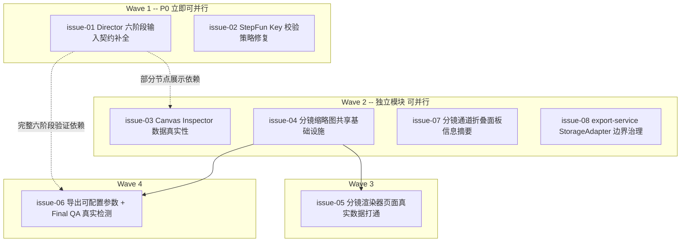
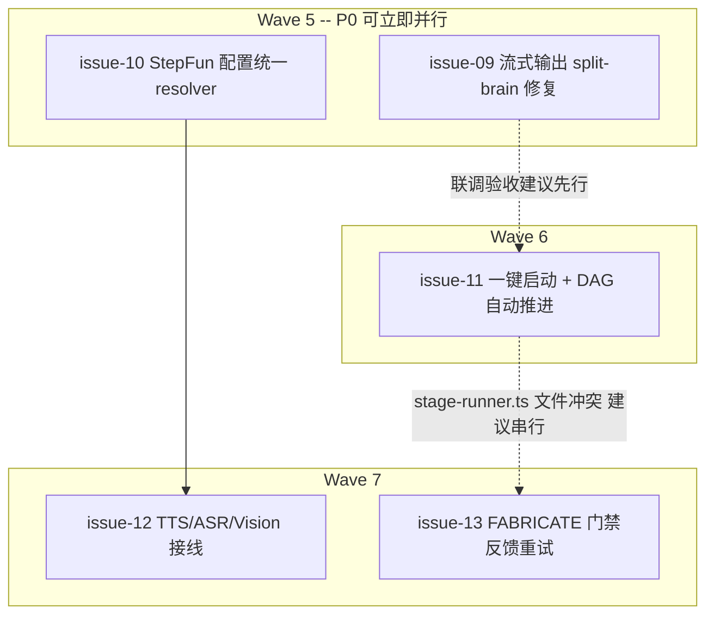

# 系统性前后端打通修复：已知问题清单（Track H + 第二轮全局审查）

> Created: 2026-07-24 · 第二轮（issue-09~13）追加于 2026-07-24
> 与 [`docs/specs/2026-07-23-harness-task-breakdown.md`](../specs/2026-07-23-harness-task-breakdown.md) 的 Track H 小节互为索引：本文件是详细清单，task-breakdown 只登记摘要。
> 背景分析见对应会话记录；核心根因是既往验收标准只测"按钮点击是否触发对应 API"，未测"页面展示的每个字段是否真实"，详见 AGENTS.md「UI 字段真实性门禁」。

## 后续施工交接

`issue-01/02/03/04/05/06/07/08` 已全部完成（Track H 系统性前后端打通修复全部收口，2026-07-24）；历史并行开工指南与 Goal 启动提示词见 [`next-wave-handoff.md`](./next-wave-handoff.md)。

**第二轮（2026-07-24 全局架构审查）新增 `issue-09~13`**，源自对「AI 流式输出失效 / 工作流无法一键推进 / Key 与 4 类模型配置断裂」三大用户实测症状的全链路根因分析，详见下方「第二轮索引」。

## 使用说明

- 每个 issue 是一个可独立施工的低耦合模块，文件命名 `issue-NN-<brief>.md`，内部结构对齐 harness Task 卡片（目标/根因/允许改动范围/禁止改动/完成条件），可直接作为 Codex Goal 的施工依据。
- 施工前**必须**重新核实该 issue 引用的代码行号是否已被后续提交改动（本清单起草期间已发生一次因新提交导致路径/行号整体偏移的教训，见下方"变更记录"）。
- 完成一个 issue 后，请在下表"状态"列更新，并同步 `harness-task-breakdown.md` Track H 小节的索引表。

## 索引与推进顺序

推进顺序遵循 Wave 分组，同一 Wave 内可并行，跨 Wave 建议按序：

### 并行执行建议（2026-07-24 补充）

Wave 编号只表示"建议的先后顺序"，**不代表必须串行**。逐个核对了 8 个 issue 的「允许改动范围」文件清单后，实际的并行空间比 Wave 分组暗示的更大：

- **可立即同时开工的 6 个（互相零文件重叠）**：`issue-01`、`issue-02`、`issue-03`、`issue-04`、`issue-07`、`issue-08`。这 6 个改动的文件集合两两不相交（`issue-01` 只碰 `features/director/**`；`issue-02` 只碰 `stepfun-adapter.ts`；`issue-03` 只碰 `features/canvas/queries.ts`+`canvas-inspector.tsx`；`issue-04` 只碰 `features/render/thumbnail.ts`+`repository.ts`（渲染）+`artifacts/service.ts`；`issue-07` 只碰 `canvas-view.tsx`+`flow-elements.tsx`；`issue-08` 只碰 `storage/**`+`export-service.ts`），可以分别开 6 条独立分支/worktree 同时施工，互不阻塞、互不产生合并冲突。
- **必须等 `issue-04` 落地后才能开工**：`issue-05`（消费缩略图 API）、`issue-06`（Final QA 部分消费缩略图 API）。
- **唯一需要协调的文件级冲突**：`issue-06` 与 `issue-08` 都会改到 `src/features/render/export-service.ts`（`issue-06` 加分辨率参数传递，`issue-08` 把裸 `fs` 换成 `StorageAdapter` 方法）。由于 `issue-06` 本身要等 `issue-04` 先完成，时间上大概率不会真正撞在一起；但如果两者被安排给不同的人/Agent 同时做，建议**先合并 `issue-08`，`issue-06` 在其基础上继续**，避免同一文件的两份改动互相冲突。
- **`issue-06` 建议在 `issue-01` 完成后再做一次完整回归**（因为要验证 FINALIZE 阶段的完整链路），但这只是"验收时机"的建议，不影响 `issue-06` 本身何时开始写代码。

**实操建议**：如果你有多个 Codex/Cursor Agent 会话可以同时用，最多可以一次拉 6 条并行分支同时推进（`issue-01/02/03/04/07/08`），`issue-04` 完成后再补上 `issue-05`、`issue-06` 两条。每条分支建议用 `git worktree` 隔离，施工完成后按 issue 编号逐个提 PR / 合并，避免所有改动堆在一个分支里互相踩。

| Issue | 优先级 | Wave | 依赖 | 一句话目标 | 状态 |
|---|---|---|---|---|---|
| [`issue-01-director-stage-input-contract-completion`](./issue-01-director-stage-input-contract-completion.md) | P0 | 1 | 无 | 补齐 ASSEMBLE/FINALIZE 的 `directorInput` 真实组装，使六阶段无 mock 全部跑通 | **已完成**（2026-07-24；Q1-Q4 决策记录见文档 §3；Q4 涉及的两项延后工作已登记 [GitHub Issue #7](https://github.com/AIMFllyYS/code-video-canvas/issues/7)） |
| [`issue-02-stepfun-key-validation-strategy`](./issue-02-stepfun-key-validation-strategy.md) | P0 | 1 | 无 | 修复 `validateKey()` 用 `models.list()` 导致有效 Key 也判定失败的问题 | **已完成**（2026-07-24） |
| [`issue-03-canvas-inspector-data-truthfulness`](./issue-03-canvas-inspector-data-truthfulness.md) | P1 | 2 | 部分展示依赖 issue-01 | Inspector 的内容哈希/合同 chips/进度/查看代码改为真实数据 | **已完成**（2026-07-24，`fe7c1b2`） |
| [`issue-04-shot-thumbnail-infrastructure`](./issue-04-shot-thumbnail-infrastructure.md) | P1 | 2 | 无 | 新增共享的分镜静态帧缩略图生成能力 | **已完成**（2026-07-24，`48cd5c5`） |
| [`issue-05-shot-renderer-page-wiring`](./issue-05-shot-renderer-page-wiring.md) | P1 | 3 | issue-04 | 分镜渲染器页面播放器/缩略图/历史产物真实打通 | **已完成**（2026-07-24，待提交） |
| [`issue-06-export-configurable-params-and-real-qa`](./issue-06-export-configurable-params-and-real-qa.md) | P1 | 4 | issue-04；建议 issue-01 后回归 | 导出参数最小可配置 + Final QA 真实抽帧检测 | **已完成**（2026-07-24；`export-settings` 因模块边界实置于 `features/canvas`，见文档 §A.2） |
| [`issue-07-canvas-lane-panel-summary`](./issue-07-canvas-lane-panel-summary.md) | P2 | 2 | 无 | 分镜通道折叠面板补充子节点状态摘要 | **已完成**（2026-07-24，`29bba21`） |
| [`issue-08-export-service-storage-adapter-boundary`](./issue-08-export-service-storage-adapter-boundary.md) | P2 | 2 | 无 | `export-service.ts` 裸 `fs` 改走 `StorageAdapter` | **已完成**（2026-07-24） |

## 第二轮索引（2026-07-24 全局架构审查，issue-09~13）

| Issue | 优先级 | Wave | 依赖 | 一句话目标 | 状态 |
|---|---|---|---|---|---|
| [`issue-09-stream-singleton-split-brain-and-replay`](./issue-09-stream-singleton-split-brain-and-replay.md) | P0 | 5 | 无 | 修复 streamBus/queue/db 模块级单例 split-brain + SSE useLive 判定 + 终态回放兜底，流式面板不再永久"正在连接 AI 流… 0 字" | **已完成**（2026-07-24） |
| [`issue-10-stepfun-config-resolver-and-model-settings`](./issue-10-stepfun-config-resolver-and-model-settings.md) | P0 | 5 | 无 | `getStepfunConfig()` 统一 settings>env>默认 三层解析，设置页支持 4 类模型配置并消灭 `step-1-8k` 等假值 | **已完成**（2026-07-24，`208e6a3`） |
| [`issue-11-one-click-pipeline-auto-advance`](./issue-11-one-click-pipeline-auto-advance.md) | P1 | 6 | 软依赖 issue-09（联调验收） | `advancePipeline` 消费 DAG 边链式自动推进 + autopilot 开关 + 顶栏一键启动接线 + Inspector 按钮文案修正 | 待施工 |
| [`issue-12-tts-asr-vision-model-wiring-gap`](./issue-12-tts-asr-vision-model-wiring-gap.md) | P2 | 7 | issue-10 | TTS/ASR/Vision 三类模型从"定义了零引用"到真实接线（配音/字幕时间轴/多模态验收）；短期先做显式占位声明 | 待施工 |
| [`issue-13-fabricate-gate-feedback-retry`](./issue-13-fabricate-gate-feedback-retry.md) | P2 | 7 | 建议 issue-11 后串行 | FABRICATE 确定性门禁失败时在同会话内有界反馈重试（违规明细回注模型），减少人工冷启动重试 | 待施工 |

### 第二轮并行执行建议

- **可立即同时开工的 2 个（互相零文件重叠）**：`issue-09`（`src/lib/stream|queue|db` + SSE 路由 + hook）与 `issue-10`(`features/ai/**` + settings API/页面 + `pi-session.ts` 的 runtime 构造段）。`issue-11` 与二者也零文件重叠，如有第三条并行分支可同时开工（联调验收建议等 issue-09 合并后做）。
- **必须协调的文件级冲突**：`issue-11` 与 `issue-13` 都改 `src/features/director/stage-runner.ts`（前者改成功后 advance 挂接，后者改 run→write 重试循环），建议串行；`issue-12` 的"短期最小动作"与 `issue-10` 同文件（`settings-form.tsx`、`.env.example`），建议直接并入 `issue-10` 分支完成。
- **根因交叉提示**：issue-09 的 split-brain 修复（globalThis 单例）是 issue-11 autopilot 联调的事实前置——链式执行会显著增加流式面板的使用频率，先修 09 可避免联调期间被已知症状干扰。

## 关键决策记录（2026-07-24 已与负责人确认）

以下问题原本分散在各 issue 文档的"待确认问题"章节，通过一轮结构化问答已全部拍板，此处汇总留痕；各 issue 文档正文已同步更新为"已拍板"表述：

1. **issue-01 Q1**：`prompts/assemble.ts`/`finalize.ts` 采用 **Option A**——从"单一 builder"拆成"按节点角色区分的多个 builder+schema"（改动范围扩大到 `stage-prompt.ts`，但更清晰不易出错）。
2. **issue-01 Q2**：`score`/`export` 节点查询"全部分镜渲染完成状态"时，**在 `DirectorRuntimeRepository` 内重复实现一份简化查询**，不复用 `features/render`，避免循环模块依赖。
3. **issue-01 Q3**：`export` 节点的 FINALIZE **必须**等 `features/render` 的 `exportProject()` 先跑完（`final-mp4` 已存在）才允许执行，缺失时给出可读的前置错误提示。
4. **issue-01 Q4**：`prepareStageResult` 对 ASSEMBLE/FINALIZE 输出的结构化归一化 + `DIRECT`/`SHOT_SPEC`/`FABRICATE` 存量测试缺口，**本轮均不做**，已合并登记为 [GitHub Issue #7](https://github.com/AIMFllyYS/code-video-canvas/issues/7)，留到 issue-01 收口后再排期。
5. **issue-06 Part A**：分辨率切换采用"导出时用 ffmpeg `scale` 统一缩放"，不在渲染阶段分档（不破坏单镜渲染缓存）；`exportSettings` 存储位置采用 `projects` 表新增 JSON 列（Harness 总纲 §6.6 默认倾向方案）。
6. **issue-06 Part B**：黑帧/纯色检测新增依赖已确定为 **`jimp`**（纯 JS，无原生二进制编译负担），已获批准，施工时可直接 `pnpm add jimp`。

## 已在调研中发现并纠正的错误信息（供后续施工者参考，避免重复踩坑）

- 一名调研子智能体最初误判 `src/app/canvas/export/export-workspace.tsx`（旧路径）与 `src/app/(app)/canvas/export/export-workspace.tsx`（新路径）两份文件同时存在——这是把 `git log` 对 rename 的展示方式（同一提交同时"触碰"两个路径）误读成"文件并存"。经 `Glob` 复核，`src/app/canvas/**` 已 0 文件，只有路由组版本是真实存在的正式页面。**教训**：核实文件是否存在，优先用 `Glob`/直接 `Read` 而不是只看 `git log` 的路径列表。
- 本清单起草期间，项目引入了 `motion` 动画库并重构了常驻 Sidebar 挂载方式（`src/app/canvas/**` → `src/app/(app)/canvas/**`），导致最初基于旧路径写的分析笔记全部需要重新核对路径与行号。已确认：①`motion` 库不涉及任何确定性红线风险（只用于应用 UI）；②新增的 `Skeleton` 组件只覆盖真实网络请求等待窗口，不掩盖本清单列出的任何恒定假值问题，两者互不影响。

## 变更记录

| 日期 | 变更 |
|---|---|
| 2026-07-24 | 初版发布，8 个 issue 覆盖画布 Inspector/分镜通道折叠、分镜渲染器、合成导出三大症状的系统性打通修复；`issue-01`/`issue-04`/`issue-06` 经深度子智能体调研后由子智能体直接撰写并经人工复核修正一处事实错误，其余 issue 由直接读取当前代码撰写 |
| 2026-07-24（决策轮） | 通过一轮结构化问答拍板了 `issue-01`（Q1-Q4）与 `issue-06`（Part A 架构、Part B 依赖选型）的全部待确认问题；`issue-01`/`issue-06` 状态更新为"已拍板，可开工"；Q4 涉及的两项范围外延后工作登记为 [GitHub Issue #7](https://github.com/AIMFllyYS/code-video-canvas/issues/7) |
| 2026-07-24（并行分析） | 逐一核对 8 个 issue 的允许改动范围，确认 `issue-01/02/03/04/07/08` 六个互相零文件重叠、可立即同时并行开工；标出 `issue-06`/`issue-08` 都会改到 `export-service.ts` 这一处需要协调的文件级冲突 |
| 2026-07-24（issue-02 完成） | `validateKey()` 由 `models.list()` 改为与 `StepfunAdapter.chat()` 一致的最小 `chat.completions.create()` 探测（`max_tokens:1` + per-request `timeout`/`maxRetries:0`），保留不泄露 Key 的服务端 `console.error` 日志；新增 4 个 `validateKey` 单测（共 9 tests 全绿）；经 `pnpm dev` + POST `/api/settings` 真实 Key 验证（有效→200/无效→422）；状态→已完成 |
| 2026-07-24（issue-07 完成） | 画布从既有 `nodes` 投影纯派生固定五角色通道摘要，展开态显示真实状态徽章与脚本文本，不完整数据显式提示且不伪造状态；5 个新增测试、全量 168 tests、lint/tsc/build 与 production Chromium 交互验收通过；提交 `29bba21` |
| 2026-07-24（issue-01 完成） | `resolveDirectorInput` 补齐 ASSEMBLE（`score`/`shot-sfx`/`shot-subtitle`）与 FINALIZE（`export`/`shot-qa`）五种节点类型的输入组装，`stage-prompt.ts` 按 `nodeType` 二次路由到拆分后的 builder；director 测试 54/54 全绿；提交 `11435c5` |
| 2026-07-24（issue-03 完成） | Inspector 面板内容哈希/关联产物 chips/生成进度/查看代码四处硬编码占位改为真实服务端数据，新增 `getNodeArtifacts` 查询与 `ArtifactChip.href`；`pnpm lint/tsc/test(60 files·208 tests)/build` 全绿；提交 `fe7c1b2` |
| 2026-07-24（issue-04 完成） | 新增 `features/render/thumbnail.ts` 共享缩略图基础设施（fraction→frame 换算、sha256 缓存寻址、单 session 批量截帧、失败补偿），`RenderRepository` 新增三个只读/登记方法；13 个 mock 单测 + 3 个真实 Playwright 集成测试；提交 `48cd5c5` |
| 2026-07-24（issue-08 完成） | `export-service.ts` 裸 `node:fs/promises` 调用改走 `StorageAdapter` 新增的 `tempDir`/`readLocalFile`/`removeTempDir` 三个方法，`exportProject()` 行为与产物字节无回归；提交 `19fe79b` |
| 2026-07-24（issue-06 完成） | Part A 导出分辨率三档预设（9:16）可配置：`projects.exportSettings` JSON 列（迁移 `0002_solid_prism.sql`）+ 新 `PATCH /api/projects/[id]`；`concat.ts` 按目标≠母版分「`-vf scale` 重编码 / `-c:v copy` 无损」两路，默认预设零回归。Part B Final QA：新增 `features/render/qa-check.ts`（`jimp` 亮度均值黑帧 + 标准差纯色规则）+ 编排写回 `shot-qa` 节点 `data.qaCheck`（contentHash 跳过），`GET /api/render/export` 惰性触发并返回 `shotQa`（未检测为 `null`）。**关键修正**：`export-settings.ts` 因 `director↔render`/`render↔canvas` 循环风险实置于 `features/canvas`。全量 62 files/241 tests 绿，lint/tsc/build 通过 |
| 2026-07-24（第二轮审查） | 全局架构审查定位三大症状根因：①流式面板永久"正在连接"= streamBus 模块级单例 split-brain + SSE 订阅隐式建空 entry + useLive 判定缺陷三者叠加（issue-09）；②工作流无一键推进 = `canvas_edges` 零消费 + 顶栏死按钮 + Inspector 文案误导（issue-11）；③4 类模型配置断裂 = TTS/ASR/VISION env 零引用 + 设置页 `step-1-8k` 假值 + 模型无 settings 覆盖通道（issue-10/12）；另登记 FABRICATE 门禁失败无反馈重试（issue-13）。新增 issue-09~13 五份任务卡 |
| 2026-07-24（issue-05 完成） | 分镜渲染器页（`/canvas/shot/[id]`）六处占位打通：`page.tsx` 自动加载 `render-mp4` 历史产物、受控 `<video>`（播放·逐帧·进度·时间戳，预览态隐控件）、缩略图轨道消费新增 `GET /api/render/thumbnails`（内部调 issue-04 `captureThumbnails`）、同步状态诚实化、合同构图模式（同通道 `shot-script` 的 `director-shot-spec`）/分辨率（`renderSpec`）/确定性声明（`render-mp4` 存在）接真实数据、独立"生成分镜代码"入口复用 `/api/render`；新增 `shot-server-data.ts` + `shot-api` 纯函数与 `fetchThumbnails` + 8 个单测；`pnpm lint` 全绿、`pnpm build` 通过（含新路由）、issue-05 文件 `tsc` 干净、集成测试隔离通过；**仅全树 `tsc --noEmit` 被未提交的 issue-06 WIP（`export-service.test.ts` 3 处类型错误）阻塞，未越界修复**；待提交 |
| 2026-07-24（issue-10 完成） | 新增 `src/features/ai/config.ts` 统一 resolver：`getStepfunConfig()`/`describeStepfunConfig()` 对 Key + 端点 + 4 类模型均按 settings 表 > env > 内置默认三层解析（唯一定义处）；`stepfun-adapter.ts`（`createClient`/`validateKey`/`chat`）与 `pi-session.ts`（`createStepfunRuntime`）改为消费该 resolver，删除各自的散点 `process.env.STEPFUN_*` 读取与重复默认常量（grep 验证：`src/` 内仅 `config.ts` 一处直接读取）；`stepfunSettingsSchema` 扩展为 6 个可选字段，`POST /api/settings` 支持 Key 未提交时不校验不改动、模型字段留空即删除 settings 行回退；`GET /api/settings` 新增 `models`（生效值+来源标签）/`renderConcurrency`/`storageDir` 字段。设置页删除硬编码假值 `step-1-8k`/固定 `4`/固定 `~/CodeVideoCanvas/projects`/恒 `checked` 崩溃续渲开关，改为 4 类模型+端点可编辑 `TextField`（placeholder 展示当前 env/默认生效值）、渲染并发数/存储位置改用 API 真实值、导出分辨率指向项目导出页真实配置、崩溃续渲显式标注"尚未实现（Demo 占位）"。新增 `config.test.ts`（8 个用例覆盖 settings/env/default 三层 × 6 项优先级矩阵）+ `route.test.ts` 扩展（GET 真实生效值、POST 仅模型/Key+模型两种路径）；`pnpm lint/tsc/test（66 files·276 tests）/build` 全绿；`pnpm dev` 真实 StepFun `.env` 端到端验证 GET/POST 优先级切换与回退；提交 `208e6a3` |
| 2026-07-24（issue-09 完成） | 三根因叠加修复：①streamBus/queue/queue-init 标志/db-cache 四处进程内单例全部 globalThis 锚定（`__cvc*` 前缀），消灭 Next.js HMR split-brain；②`StreamBus` 将订阅者拆为独立 `listeners` Map，`subscribe` 只读回放快照、绝不隐式建 entry（不变式：仅 publish/markDone/markError 建 entry），且订阅先于首个 delta 仍能收到增量；③SSE `useLive` 由 `has()` 改 `isActive()` + 终态节点订到空快照时合并回放持久化日志兜底；前端 hook 快照 done 主动 close 双保险。新增 6 个测试（stream-bus 3 / SSE 路由 1 / queue-init 2）；全量 65 files/265 tests 绿，lint/tsc/build 通过，grep 核验无残留裸单例 |
