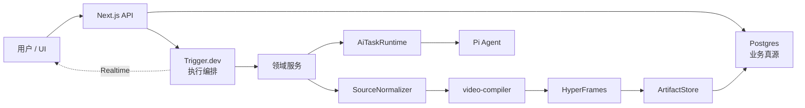

# CodeVideoCanvas 重构总蓝图 v3 — Master Index

> 状态：**Accepted / Active**
> 决策日期：2026-07-24
> 适用范围：CodeVideoCanvas 全量重构、PurpleInk 未来迁移合并准备
> 当前阶段：文档权威重建；代码实施尚未开始
> 核心修订：**保留 Pi Agent，不迁移 OpenAI Agents SDK**

---

## 1. 一句话目标

在不牺牲 CodeVideoCanvas“AI 生成确定性代码视频”核心能力的前提下，把当前
SQLite + 进程内队列 + 自建逐帧渲染的 Demo 管线，重构为：

> **Next.js + Postgres + Trigger.dev + Pi Agent + video-compiler +
> HyperFrames** 的本地开发优先、生产可迁移架构。

这次重构的评价标准不是“引入了多少新基础设施”，而是：

1. 工作流更少、更清楚；
2. 每种状态只有一个权威来源；
3. 模型、编排、编译、渲染互不越界；
4. 失败可以定位、重试、取消和恢复；
5. 后续 Codex Goal 能按 Track 连续施工，不再依赖临场猜测。

---

## 2. v3 已确认的不可逆决策

| 编号 | 决策 | 结果 |
|---|---|---|
| D1 | 数据库 | SQLite → **Postgres，本地 Docker 起步** |
| D2 | 执行编排 | 进程内队列/SSE → **Trigger.dev Cloud 控制面 + `trigger dev` 本地执行** |
| D3 | Agent Runtime | **继续使用 Pi Agent**；不引入 OpenAI Agents SDK |
| D4 | 模型路由 | 仅 `ModelPolicy` 按 `AiTaskKind` 决定 provider/model |
| D5 | 模型任务 | 仅四类：`project-plan`、`shot-spec`、`fabricate`、`vision-qa` |
| D6 | 服务任务 | normalize、gate、compile、render、audio、compose、verify 均不得进入 Agent loop |
| D7 | 模型产物 | `ShotSourcePackageV1` 是 canonical；完整 HTML/代码块只是兼容输入 |
| D8 | 渲染 | `video-compiler` 生成 `CvcCompositionBundleV1`，并暴露 `RenderableBundleDescriptorV1`；HyperFrames 为默认 renderer |
| D9 | 帧时钟 | HyperFrames 终态只保留一套 seek/frame clock；旧 `__CVC_RENDER__@v1` 仅迁移期兼容 |
| D10 | 业务真源 | Postgres；Trigger 保存执行事实；二者不互相镜像整套状态 |
| D11 | UI 真相 | `ProjectRunSnapshotV1` + Trigger Realtime；禁止固定假进度/假检测 |
| D12 | PurpleInk 合并 | 共享 DTO/Port/Compiler/Render 合同；允许两项目内部 Agent Runtime 不同 |
| D13 | 登录 | 本轮不实现；schema 预留 `workspace_id`，本地自动创建一个开发 workspace |
| D14 | 包管理器 | 本轮保留 pnpm；不为“看起来统一”额外迁移 npm |
| D15 | 历史数据 | SQLite 只读备份并显式 export/import；禁止静默丢弃 |

---

## 3. 文档权威层级

发生冲突时，按下列顺序裁决：

| 优先级 | 文档 | 回答的问题 |
|---:|---|---|
| 1 | `AGENTS.md` | AI 代理现在允许/禁止做什么 |
| 2 | `docs/specs/2026-07-24-refactor-v3-product-spec.md` | 产品必须实现什么 |
| 3 | `docs/specs/2026-07-24-refactor-v3-architecture-spec.md` | 接口、状态、数据和边界必须怎样实现 |
| 4 | `docs/specs/2026-07-24-refactor-v3-codex-harness.md` | Codex Goal 如何施工和验收 |
| 5 | `docs/specs/2026-07-24-refactor-v3-task-breakdown.md` | 当前唯一任务状态与依赖顺序 |
| 6 | `docs/issues/refactor-v3/issue-n*.md` | 每个 Track 的逐步实现卡 |
| 7 | `docs/adr/*.md` | 为什么锁定某项长期决策 |
| 8 | 本蓝图四册 | 分析、目标形态、阶段路线和 PurpleInk 对齐证据 |

**状态只允许在 Task Breakdown 维护。** Issue 文件可以记录完成证据，但不得创建
第二份独立状态表。蓝图、ADR、旧 Spec 都不得用复选框冒充当前进度。

---

## 4. 蓝图体系

| 册 | 文件 | v3 职责 |
|---|---|---|
| 总索引 | 本文件 | 决策、权威关系、执行入口 |
| 第一册 | `2026-07-24-refactor-blueprint-01-analysis.md` | 事实核验、问题树、方案比较、风险与预算 |
| 第二册 | `2026-07-24-refactor-blueprint-02-target-architecture.md` | 完整目标架构、合同、状态、schema、目录和门禁 |
| 第三册 | `2026-07-24-refactor-blueprint-03-tracks.md` | N0–N7 路线、依赖、Goal 入口、30 项验收矩阵 |
| 第四册 | `2026-07-24-refactor-blueprint-04-purpleink-alignment.md` | penguin/firenze 实勘、共享边界与迁移策略 |

---

## 5. ADR 体系

| ADR | 决策 |
|---|---|
| ADR-0001 | Postgres 本地开发优先、云就绪 |
| ADR-0002 | Trigger.dev 只负责执行编排 |
| ADR-0003 | Pi Agent 保留并收口到结构化模型端口 |
| ADR-0004 | video-compiler → HyperFrames 单帧时钟 |

修改已接受 ADR 必须新增 superseding ADR，不得直接改写历史理由。

---

## 6. Codex Goal 执行入口

一次 Codex Goal 对应一个 Track，而不是一张 Task 卡：

```text
N0 基线封账与止血
  ↓
N1 Postgres 地基与关键 Spike
  ↓
N2 Trigger.dev 接管执行
  ↓
N3 Pi Agent 统一模型任务
  ↓
N4 产物协议、编译器与 HyperFrames
  ↓
N5 音画合成闭环
  ↓
N6 UI 真实性、Pencil/Playbook 与代码治理
  ↓
N7 全链路验收、清退旧路径与 workflowVersion 锚点
```

允许的并行仅在 Track Issue 明确标注时成立。默认依赖顺序是
`N0 → N1 → N2 → N3/N4 → N5 → N6 → N7`；N3 与 N4 只有公开合同稳定后
才可局部并行。

---

## 7. 简化后的运行时心智模型



判断一个新需求放在哪里，只问五个问题：

1. 它改变业务事实吗？写 Postgres。
2. 它只是安排何时执行吗？交给 Trigger。
3. 它必须由模型判断吗？进入四类 `AiTaskKind` 之一。
4. 它可以由代码确定完成吗？写普通领域服务。
5. 它影响最终像素吗？必须通过 compiler + HyperFrames 门禁。

---

## 8. 明确不做

- 不迁移 OpenAI Agents SDK；
- 不同时维护 Pi 和第二套 Agent session/trace 类型；
- 不建设自有 scheduler、retry、dead-letter、SSE；
- 不把 Trigger 的所有事件镜像成 Postgres `run_events`；
- 不做 PGlite 与 Postgres 双正式运行时；
- 不实现登录、组织管理、计费、R2；
- 不迁移 npm；
- 不把完整 HTML 直接当可信可执行产物；
- 不同时长期保留两套帧时钟；
- 不提前合并 PurpleInk 整个业务域或复制其超大 schema；
- 不以“未来可能需要”为理由创建 Redis、CQRS、事件溯源或微服务。

---

## 9. 旧文档处理

以下文档保留为 2026-07-23 Demo 架构与完成证据，但从 v3 起冻结：

- `docs/specs/2026-07-23-prd-code-video-canvas.md`
- `docs/specs/2026-07-23-ai-development-harness.md`
- `docs/specs/2026-07-23-harness-task-breakdown.md`
- `docs/designs/tasks.md`
- `docs/designs/2026-07-23-platform-architecture-design.md`
- `docs/issues/known-issues.md`
- `docs/issues/issue-01-*.md` 至 `issue-13-*.md`

旧文档中的 SQLite、进程内队列、自建 SSE、`__CVC_RENDER__@v1` 终态等描述，
只用于理解迁移起点，不得指导 N0–N7 新代码。

---

## 10. 完成定义

文档阶段完成需满足：

1. 四册 v3、四份 ADR、三份新 Spec、Harness、Task Breakdown、八份 Track Issue
   全部落盘；
2. `AGENTS.md`、README、架构规范指向新权威；
3. 旧账本有冻结提示；
4. 不存在“主链路迁移 Agents SDK”表述；
5. 任务 ID、类型名、状态名和文件路径跨文档一致；
6. Markdown 链接可解析，U+FFFD 为 0；
7. 每个文档阶段单独本地 commit，不推送远程。
