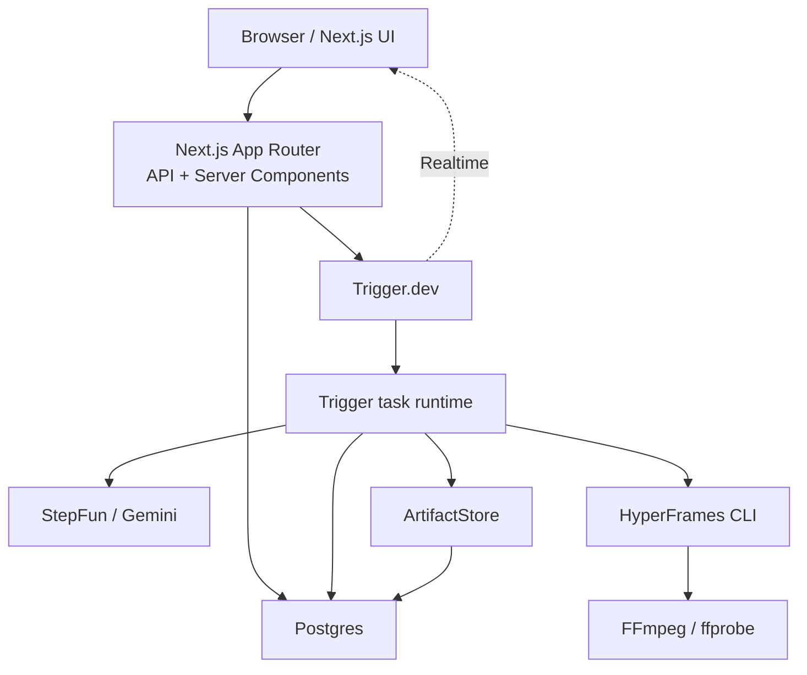
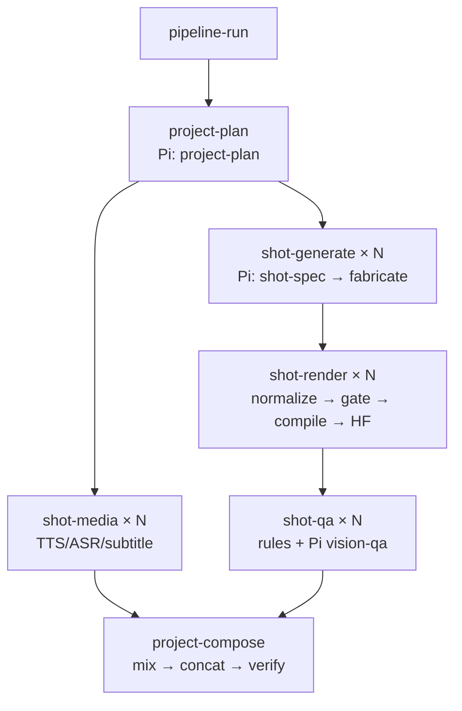

# CodeVideoCanvas 重构蓝图 v3 · 第二册：目标架构

> 状态：Accepted
> 架构风格：模块化单体 + 外部执行编排 + 独立可分享 compiler package
> Agent 决策：Pi Agent 保留；业务代码禁止感知 Agent SDK 类型
> 部署目标：本地开发优先，生产云就绪

---

## 1. 十五条架构原则

1. **一个事实一个真源**：业务事实进 Postgres；执行事实由 Trigger 提供。
2. **Canvas DAG 是产品视图，不是调度器实现。**
3. **Trigger task 只按重试、并发、资源隔离边界拆分。**
4. **仅四类任务调用模型。**
5. **仅一个模块可以 import Pi `Agent`。**
6. **模型选择只发生在 `ModelPolicy`。**
7. **模型输出永远是不可信输入。**
8. **Canonical source 是结构化 fragments，不是自由 HTML。**
9. **编译器拥有 shell、时钟、尺寸、duration、seed 和资产装配。**
10. **HyperFrames 是唯一终态帧时钟。**
11. **artifact 不可变且按 attempt/version 寻址。**
12. **远端 ArtifactStore 与本地 RenderWorkspace 分离。**
13. **UI 可见字段必须能追溯到 DTO 字段。**
14. **共享合同优先于共享 SDK 或仓库目录。**
15. **新增复杂度必须替换旧复杂度，不能长期并存。**

---

## 2. 系统上下文



本地开发时 Next、Postgres、task 代码、HyperFrames 和 FFmpeg 在本机；Trigger Cloud
只提供调度控制面。生产部署时，Next、task runtime、Postgres 与 ArtifactStore
必须都处于彼此可访问的网络环境，不允许远端 worker 依赖开发者 `.data` 目录。

---

## 3. 目标目录

```text
.
├─ trigger.config.ts
├─ trigger/
│  ├─ tasks/
│  │  ├─ pipeline-run.ts
│  │  ├─ project-plan.ts
│  │  ├─ shot-generate.ts
│  │  ├─ shot-media.ts
│  │  ├─ shot-render.ts
│  │  ├─ shot-qa.ts
│  │  └─ project-compose.ts
│  ├─ queues.ts
│  ├─ streams.ts
│  ├─ tags.ts
│  └─ task-result.ts
├─ packages/
│  ├─ contracts/
│  │  └─ src/
│  │     ├─ ai.ts
│  │     ├─ artifact.ts
│  │     ├─ composition.ts
│  │     ├─ run.ts
│  │     └─ source.ts
│  └─ video-compiler/
│     └─ src/
│        ├─ compile.ts
│        ├─ manifest.ts
│        ├─ shell.ts
│        └─ validate.ts
├─ src/
│  ├─ app/                         # 路由/API；无业务编排
│  ├─ components/                  # Pencil/Playbook 视觉原语
│  ├─ features/
│  │  ├─ ai/
│  │  │  ├─ application/
│  │  │  │  ├─ ai-task-runtime.ts
│  │  │  │  └─ run-structured.ts
│  │  │  ├─ domain/
│  │  │  │  ├─ task-kind.ts
│  │  │  │  ├─ model-policy.ts
│  │  │  │  └─ trace-event.ts
│  │  │  └─ infrastructure/
│  │  │     ├─ pi-structured-runner.ts
│  │  │     ├─ provider-registry.ts
│  │  │     └─ terminal-tools.ts
│  │  ├─ artifact/
│  │  │  ├─ source-normalizer.ts
│  │  │  ├─ gate-runner.ts
│  │  │  ├─ artifact-service.ts
│  │  │  └─ repository.ts
│  │  ├─ canvas/
│  │  ├─ pipeline/
│  │  │  ├─ execution-policy.ts
│  │  │  ├─ run-service.ts
│  │  │  ├─ run-snapshot.ts
│  │  │  └─ repository.ts
│  │  ├─ render/
│  │  │  ├─ provider.ts
│  │  │  ├─ hyperframes-provider.ts
│  │  │  ├─ legacy-provider.ts
│  │  │  ├─ render-workspace.ts
│  │  │  └─ verify.ts
│  │  ├─ compose/
│  │  │  ├─ audio-align.ts
│  │  │  ├─ subtitle-build.ts
│  │  │  ├─ mix.ts
│  │  │  ├─ compose-service.ts
│  │  │  └─ verify.ts
│  │  └─ navigation/
│  ├─ lib/
│  │  ├─ db/
│  │  │  ├─ client.ts
│  │  │  ├─ schema/
│  │  │  └─ migrations/
│  │  ├─ artifact-store/
│  │  ├─ determinism/
│  │  ├─ motion/
│  │  └─ version/
│  └─ server/
├─ scripts/
│  ├─ db/
│  ├─ migration/
│  └─ verification/
└─ docs/
```

目录是目标职责图，不要求在一个 Task 内机械搬完。每次移动必须由公开接口和测试
驱动，禁止先大规模改路径再补行为。

---

## 4. 依赖方向

```text
app / trigger
    ↓
application services
    ↓
domain contracts
    ↑
infrastructure adapters
```

硬约束：

- `features/canvas` 不 import Trigger、Pi、Drizzle、HyperFrames；
- `features/ai/domain` 不 import CanvasNodeType；
- `features/render` 不 import director/pipeline 实现；
- `features/compose` 只消费 artifact/render contracts；
- `packages/video-compiler` 不 import Next、DB、Trigger、Pi；
- Trigger task 只调用公开 application service，不直接写 Drizzle 查询；
- API route 不拼 artifact path，不直接创建 provider/model/client；
- UI 不 import server-only schema/repository。

---

## 5. Trigger 任务图



### 5.1 为什么 `shot-spec` 和 `fabricate` 不拆成两个 Trigger task

二者共用 AI 并发边界、shot 上下文和内容修复会话。`shot-generate` 在内部先事务性
提交 `ShotSpecV1` checkpoint，再调用 fabricate。若 worker crash，重试发现同一
input hash 的 spec 已存在就跳过第一次付费调用。

这保留了独立业务 artifact，又避免新增一层 parent/child wait 和版本锁定。

### 5.2 队列

| queue | 初始并发 | 任务 |
|---|---:|---|
| `ai` | 2 | project-plan、shot-generate、shot-qa |
| `render` | 1 | shot-render |
| `media` | 2 | shot-media |
| `compose` | 1 | project-compose |

只有真实限额/资源数据证明需要时才拆分 vision queue 或增加 concurrency key。

### 5.3 幂等

Trigger task key：

```text
sha256(
  workflowVersion + taskType + workspaceId + entityId +
  sorted(inputArtifactHashes)
)
```

业务命令使用 `command_receipts`，保存：

```text
(workspace_id, idempotency_key, command_type, request_fingerprint, result)
```

Trigger idempotency 防重复执行；receipt 防同一业务键携带不同请求重放。二者职责
不同，不追求虚假的 exactly-once。

### 5.4 重试与取消

- transport/429/timeout/worker crash：Trigger 指数退避，最多 3 次；
- schema/semantic/gate：同一次 task 内最多 2 次结构化 repair；
- 取消 signal 传入 Pi、HyperFrames/Playwright、FFmpeg；
- 所有 workspace/temp 文件以 attempt ID 命名，在 `finally` 清理；
- `onCancel` 仅作加速清理，不作为唯一清理保证；
- 启动时/定期清除超过 TTL 的孤儿 temp workspace。

---

## 6. Pi Agent 统一边界

### 6.1 公开合同

```ts
export type AiTaskKind =
  | 'project-plan'
  | 'shot-spec'
  | 'fabricate'
  | 'vision-qa'

export interface AiTaskRequest<TInput> {
  task: AiTaskKind
  input: TInput
  context: {
    workspaceId: string
    projectId: string
    shotId?: string
    attemptId: string
  }
  signal?: AbortSignal
}

export interface AiTaskResult<TOutput> {
  output: TOutput
  model: {
    provider: 'stepfun' | 'gemini'
    modelId: string
  }
  usage?: {
    inputTokens: number
    outputTokens: number
  }
  trace: AgentTraceEventV1[]
}

export interface AiTaskRuntime {
  run<TInput, TOutput>(
    request: AiTaskRequest<TInput>,
    contract: AiTaskContract<TInput, TOutput>
  ): Promise<AiTaskResult<TOutput>>
}
```

### 6.2 内部层次

```text
AiTaskRuntime
  → ModelPolicy          选择 provider/model/capability
  → ProviderRegistry     创建 pi-ai Models/provider
  → PiStructuredRunner   唯一 import Agent
  → TerminalTool         验证并提交 output
  → TraceMapper          生成安全事件
```

### 6.3 Terminal Tool

每种模型任务只有一个提交 Tool，例如：

```ts
submit_project_plan
submit_shot_spec
submit_shot_source
submit_vision_report
```

Tool `execute()`：

1. 使用 Zod 校验参数；
2. 进行轻量语义检查；
3. 把已验证对象写入 result details；
4. 返回 `terminate: true`；
5. 不允许模型选择 workspace/project/path。

若模型只返回文本而未调用 Tool，该 turn 是 content failure，不从文本中猜出“可能的
正确 JSON”。Compatibility parser 只服务旧 artifact/import，不是新的模型主通道。

### 6.4 安全轨迹

```ts
export type AgentTraceEventV1 =
  | { type: 'model_started'; provider: string; modelId: string; at: string }
  | { type: 'message_delta'; text: string; at: string }
  | { type: 'tool_started'; tool: string; argumentSummary: unknown; at: string }
  | { type: 'tool_completed'; tool: string; ok: boolean; at: string }
  | { type: 'repair_requested'; issues: ContractIssueV1[]; at: string }
  | { type: 'usage'; inputTokens: number; outputTokens: number; at: string }
  | { type: 'completed'; at: string }
  | { type: 'failed'; code: string; message: string; at: string }
```

不得把 provider 的隐藏 thinking/reasoning block 写入前端 DTO。

---

## 7. SourceNormalizer

### 7.1 Canonical source

```ts
export interface ShotSourcePackageV1 {
  schemaVersion: 1
  bodyFragment: string
  css: string
  setupJs: string
  seekJs: string
}
```

`bodyFragment` 不含 `<html>/<head>/<body>`；`css` 不含 `<style>`；JS 字段不含
`<script>`。模型不得提供外部 URL、codec、frame count、artifact path 或 shell。

### 7.2 支持的输入形态

按严格顺序匹配：

1. 已是对象 → strict Zod parse；
2. 完整 JSON 字符串；
3. 单一外层 `json` fence；
4. 唯一且标记明确的四段 fragments；
5. 完整 HTML legacy adapter；
6. 其他输入拒绝。

完整 HTML adapter 只提取受控 body/style/script 片段；未知 head 元素、外链脚本、
多个候选 timeline、额外正文或多个 JSON 对象均拒绝。

### 7.3 Partial patch

对既有 source 的局部修改使用：

```ts
export interface ShotSourcePatchV1 {
  schemaVersion: 1
  baseContentHash: string
  changes: Partial<Pick<
    ShotSourcePackageV1,
    'bodyFragment' | 'css' | 'setupJs' | 'seekJs'
  >>
}
```

创建新 source 时四字段必须全部存在；允许字段为空字符串，但不得省略。这样“只生成
一部分代码”有明确含义，而不是由前端猜测缺失内容。

---

## 8. video-compiler 与十级门禁

### 8.1 编译输入

```ts
export interface CompileShotInputV1 {
  source: ShotSourcePackageV1
  renderSpec: {
    compositionId: string
    width: number
    height: number
    fps: number
    durationSeconds: number
    seed: string
  }
  assets: readonly AssetRefV1[]
  compilerVersion: string
}
```

### 8.2 Bundle

```ts
export interface CompositionBundleV1 {
  schemaVersion: 1
  entryHtml: 'index.html'
  files: readonly {
    path: string
    sha256: string
    mediaType: string
  }[]
  manifest: {
    compositionId: string
    width: number
    height: number
    fps: number
    durationSeconds: number
    sourceHash: string
    bundleHash: string
    compilerVersion: string
  }
}
```

### 8.3 门禁链

| Gate | 阶段 | 断言 |
|---:|---|---|
| G1 | normalize | 输入形态唯一、无猜测式截取 |
| G2 | schema | strict schema、长度和字段完整 |
| G3 | syntax | HTML/CSS/JS 可解析 |
| G4 | security | 无网络/import/eval/worker/storage/cookie |
| G5 | determinism | 无墙钟、rAF、ticker、无种子随机、无限循环 |
| G6 | compile | shell/timing/root/id/timeline 合同成立 |
| G7 | HyperFrames lint/check | CLI 静态与运行时检查为 0 finding |
| G8 | seek smoke | 0/中/末/乱序 seek 可用 |
| G9 | pixel determinism | 同帧双拍 hash 相同，样本非空 |
| G10 | media receipt | ffprobe 尺寸/时长/流和实体 SHA-256 正确 |

G1–G5 失败可以把结构化问题反馈给同一 Pi session；G6–G10 属于 compiler/render
问题，不允许继续让模型“猜着修基础设施”。

### 8.4 HyperFrames 单时钟

compiler 输出：

- 固定像素 root；
- app-owned `data-width/data-height/data-duration`；
- `.clip` timing 与 track；
- 同步创建的 paused GSAP timeline；
- `window.__timelines[compositionId]`；
- 本地/自包含资产；
- 不进行 render-time network fetch。

旧 renderer 只实现 `RenderProvider` fallback：

```ts
export interface RenderProvider {
  render(input: RenderTaskV1, signal?: AbortSignal): Promise<RenderReceiptV1>
}
```

当 HyperFrames provider 通过 golden parity 后，legacy provider 在 N7 删除。

---

## 9. ArtifactStore 与 RenderWorkspace

```ts
export interface ArtifactStore {
  put(input: PutArtifactInput): Promise<StoredArtifact>
  get(key: string): Promise<Uint8Array>
  head(key: string): Promise<ArtifactHead | null>
  remove(key: string): Promise<void>
}

export interface RenderWorkspace {
  create(attemptId: string): Promise<WorkspaceHandle>
  materialize(artifact: StoredArtifact, target: WorkspaceHandle): Promise<string>
  cleanup(target: WorkspaceHandle): Promise<void>
}
```

远端 store 不承诺 `localPath()`；需要本地路径的 CLI/FFmpeg 必须经
`RenderWorkspace.materialize()`。业务域不得直接 import `node:fs/promises` 管理
跨域 artifact。

---

## 10. Postgres 最小 schema

### 10.1 表

| 表 | 作用 | 关键约束 |
|---|---|---|
| `workspaces` | 租户边界；当前单一本地 workspace | UUID PK |
| `projects` | 项目聚合 | `(workspace_id,id)` PK、revision、workflow_version |
| `canvas_nodes` | 产品 DAG 节点 | 复合 FK project、node status CHECK |
| `canvas_edges` | DAG 边 | source/target 复合 FK、唯一边 |
| `pipeline_runs` | 一次用户启动的业务运行 | trigger_run_id、status、input fingerprint |
| `task_attempts` | task/shot attempt 与 checkpoint | attempt fence、task kind/status CHECK |
| `artifacts` | 不可变版本化产物索引 | hash、schema_version、supersedes、唯一版本 |
| `command_receipts` | API 命令幂等 | key+fingerprint 冲突检测 |
| `provider_settings` | 非秘密模型路由配置 | workspace scoped |
| `ai_invocations` | 明确字段的调用审计 | task/provider/model/usage；非通用 event log |

### 10.2 通用约定

- SQL 名称 `snake_case`；
- ID 使用 UUID；需要人类语义的节点另设 `logical_key`；
- 时间使用 `timestamptz`；
- 版本化 payload/metadata 使用 `jsonb`；
- 所有 workspace 业务表使用 `(workspace_id,id)` 复合主键；
- 跨 workspace 外键必须包含 `workspace_id`；
- 状态使用 text + named CHECK，避免数据库 enum 难迁移；
- 所有可更新聚合带 `revision`，使用 compare-and-swap；
- approved/released artifact version 不可更新、不可删除；
- `content_hash` 是实体内容 SHA-256，不得用 input key 冒充。

### 10.3 不建 `run_events`

UI 所需业务进度来自 `pipeline_runs + task_attempts + canvas_nodes + artifacts`。
Trigger 状态和日志由 Trigger Realtime/Dashboard 提供。只有模型调用审计进入字段
明确的 `ai_invocations`，不把所有状态塞进任意 JSON event 表。

---

## 11. 状态与 UI 投影

### 11.1 业务状态

```ts
export type NodeExecutionStatus =
  | 'idle'
  | 'queued'
  | 'running'
  | 'succeeded'
  | 'failed'
  | 'cancelled'
  | 'stale'

export type PipelineRunStatus =
  | 'triggering'
  | 'queued'
  | 'running'
  | 'succeeded'
  | 'failed'
  | 'cancelled'
```

`blocked/ready` 不持久化为执行状态，由唯一 `ExecutionPolicy` 根据依赖、artifact 和
当前状态派生。

### 11.2 Snapshot

```ts
export interface ProjectRunSnapshotV1 {
  schemaVersion: 1
  projectId: string
  workflowVersion: string
  run: {
    id: string
    status: PipelineRunStatus
    triggerRunId?: string
    startedAt?: string
    finishedAt?: string
  } | null
  nodes: readonly NodeRunViewV1[]
  shots: readonly ShotRunViewV1[]
  artifacts: readonly ArtifactViewV1[]
  readiness: RunReadinessV1
}
```

页面首次加载读取 Snapshot；随后用 Trigger Realtime 更新运行态，完成/断线后重新
拉取 Snapshot 对账。Realtime metadata 不是业务真源。

### 11.3 Inspector 四页签

1. **数据**：版本化 JSON 的 tree/table/raw；
2. **源码**：原始输入、提取 fragments、hash 和兼容警告；
3. **门禁**：G1–G10 结果、问题定位、产物链接；
4. **执行**：安全 Agent trace、Trigger 状态、attempt、重试和费用摘要。

所有组件先在 `canvas.pen` 建 reusable symbol，再登记 `/playbook`。

---

## 12. PurpleInk 合同桥

```text
PurpleInk SkillInputV1
  → PurpleInkInputAdapter
  → StructuredModelPort
  → PurpleInk Plan DTO
  → PurpleInk compiler
  → CompositionBundleV1-compatible manifest

CVC Project/Shot Input
  → Pi AiTaskRuntime
  → ShotSourcePackageV1
  → CVC video-compiler
  → CompositionBundleV1
```

共享点是 bundle/render task/receipt/provenance，不要求两个 compiler 使用相同输入。
未来只有当双方向同一个 shared package 提交过真实生产 bundle 后，才迁出公共包。

---

## 13. 文件治理

- `page.tsx` 目标 ≤200 行，硬上限 300；
- 业务组件/服务目标 ≤250 行，硬上限 350；
- repository/schema 可按聚合拆分，单文件硬上限 400；
- 单函数 ≤50 行；
- 每个文件一个主职责；
- `index.ts` 只导出公开 API，不承载逻辑；
- 禁止跨域 deep import；
- 新增例外必须写在 Track Issue 并带拆分后续，不允许默许增长。

N6 至少拆分当前 `runtime-repository.ts`、`shot-detail.tsx`、
`model-service-settings.tsx`、`render/repository.ts`、`export-workspace.tsx`、
`vision-qa.ts`、`advance.ts`、`stage-runner.ts`、`canvas-inspector.tsx`。

---

## 14. 架构完成条件

目标架构只有在以下事实同时成立时才算完成：

1. 运行时无 SQLite 与进程内 queue/stream；
2. 主链路无直接 OpenAI client 和 Agents SDK；
3. 四类模型任务全部经 Pi `AiTaskRuntime`；
4. 七类 Trigger task 是唯一调度入口；
5. source 先 normalize/gate，再 compile/render；
6. HyperFrames 是唯一默认帧时钟；
7. 最终 MP4 通过视频、音频、字幕与实体 hash 验收；
8. UI 无不可追溯字段；
9. 旧数据可备份/导入并完成计数对账；
10. N7 golden E2E 与 30 项矩阵全部有证据。
