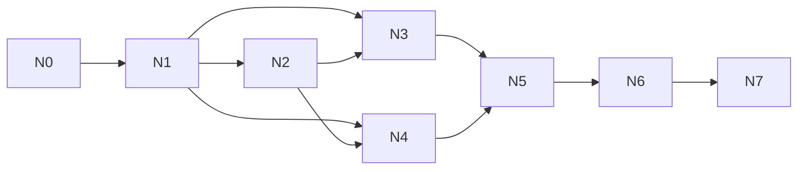

# CodeVideoCanvas 重构蓝图 v3 · 第三册：N0–N7 Track 路线

> 状态：Accepted
> 执行单位：一次 Codex Goal = 一个 Track
> 唯一状态账本：`docs/specs/2026-07-24-refactor-v3-task-breakdown.md`
> 详细任务卡：`docs/issues/refactor-v3/issue-n*.md`

---

## 1. 总路线

| Track | 目标 | 预计 | 主要交付 |
|---|---|---:|---|
| N0 | 基线封账与旧管线止血 | 1–2 天 | 可验证旧闭环、Pi Tool 产物不再丢失 |
| N1 | Postgres 地基与关键 Spike | 3–5 天 | PG cutover、历史导入、Trigger/Pi/HF 可行性证据 |
| N2 | Trigger.dev 接管执行 | 3–5 天 | 七任务 DAG、Realtime、取消/重试/幂等 |
| N3 | Pi Agent 统一模型任务 | 3–4 天 | `AiTaskRuntime`、四类模型任务、统一 ModelPolicy |
| N4 | 产物协议、compiler、HyperFrames | 5–7 天 | SourceNormalizer、十级门禁、Bundle、HF renderer |
| N5 | 音画合成闭环 | 3–5 天 | TTS/字幕/混音/拼接/三轨验收 |
| N6 | UI 真实性与代码治理 | 4–6 天 | Pencil/Playbook、新 Inspector、真实 RunSnapshot、拆大文件 |
| N7 | 全链路验收与旧路径清退 | 2–4 天 | workflowVersion、golden E2E、迁移/恢复/取消证据 |

时间是单人集中施工的估算，不是承诺。真实进入 Track 前以基线、依赖安装和外部服务
可用性重新评估。

---

## 2. 依赖图

N3 与 N4 可以在 N1/N2 的 contracts 与 task payload 稳定后局部并行：

- N3 负责 `AiTaskRuntime → ShotSourcePackageV1`；
- N4 负责 `ShotSourcePackageV1 → CompositionBundleV1 → RenderReceiptV1`。

二者禁止同时修改同一合同文件；公共 contract 变更由先完成的一方提交，另一方只消费。

---

## 3. Track N0：基线封账与止血

**目标**：在迁移基础设施前，让旧管线具备可信基线，并冻结旧账本。

核心任务：

- N0.1 冻结 Demo v1 权威、建立 v3 workflowVersion 与基线证据；
- N0.2 修复 Pi Tool 参数/结果提取，禁止只读最终 assistant 文本；
- N0.3 把 source/runtime 合同检查提前到 render enqueue 之前；
- N0.4 修复 API 结果丢弃、假进度等会干扰迁移验收的问题；
- N0.5 建立 import 边界/文件长度/UTF-8 报告脚本。

**退出门**：

- 旧 SQLite 管线仍能跑最小 deterministic fixture；
- Tool args 经真实或录制 Pi transcript 可提交；
- 旧文档已冻结，Task Breakdown 是唯一新账本；
- 全量 lint/typecheck/test/build 基线已记录。

详细卡：`docs/issues/refactor-v3/issue-n0-baseline-and-bleeding-fixes.md`

---

## 4. Track N1：Postgres 地基与 Spike

**目标**：完成唯一数据库切换，并用最小真实实验消除 Trigger/Pi/HF 的未知数。

核心任务：

- N1.1 `docker-compose.dev.yml` + Postgres health/migration 命令；
- N1.2 Drizzle PG schema、复合 FK、CHECK、index、tracked migration；
- N1.3 repository async 化与逐域 cutover；
- N1.4 SQLite 备份/export/import/计数与 hash 对账；
- N1.5 三个 Spike：Trigger task+Realtime、Pi terminal Tool、HyperFrames CLI；
- N1.6 移除运行时 SQLite，保留只读 migration 工具。

**退出门**：

- fresh PG 从零迁移成功；
- application runtime 只连接 Postgres；
- 旧项目导入数、节点数、artifact 指针数对账；
- 三个 Spike 都有命令、日志摘要和失败结论；不以“包已安装”代替可行性。

详细卡：`docs/issues/refactor-v3/issue-n1-postgres-foundation-and-spikes.md`

---

## 5. Track N2：Trigger.dev 接管执行

**目标**：用 Trigger 替换 queue、retry、cancel、stream-bus，而不是并行保留。

核心任务：

- N2.1 Trigger config、queues、tags、typed streams；
- N2.2 七类 task 壳和统一 `TaskResult`；
- N2.3 pipeline DAG、checkpoint、幂等、receipt、attempt fence；
- N2.4 API start/cancel/retry 与 scoped public access token；
- N2.5 `ProjectRunSnapshotV1` + Realtime hooks；
- N2.6 删除进程内 queue/stream/instrumentation 启动路径。

**退出门**：

- `trigger dev` 下最小项目可启动、取消、失败、重试；
- 页面刷新后能从 PG snapshot 恢复，再继续接收 Realtime；
- `src/` 不再 import 旧 queue/stream；
- Trigger metadata/tag 不被当作业务数据。

详细卡：`docs/issues/refactor-v3/issue-n2-trigger-orchestration.md`

---

## 6. Track N3：Pi Agent 统一模型任务

**目标**：保留 Pi，但把它从“大而全 Director session”收口为四类结构化模型任务。

核心任务：

- N3.1 `AiTaskKind`、contracts、ModelPolicy、ProviderRegistry；
- N3.2 `PiStructuredRunner`、terminal Tool、safe trace、AbortSignal；
- N3.3 project-plan、shot-spec、fabricate 迁移；
- N3.4 vision-qa 迁移，删除 direct OpenAI client；
- N3.5 设置页只编辑 ModelPolicy，调用记录能证明实际 provider/model；
- N3.6 Pi 运行依赖归类与 production start smoke。

**退出门**：

- 仅 `pi-structured-runner.ts` import Pi `Agent`；
- 仅四种 `AiTaskKind`；
- 服务任务零 Agent；
- Tool args 是唯一产物，文本不再被猜测解析；
- StepFun/Gemini contract test 与至少一次可控真实 smoke 有证据。

详细卡：`docs/issues/refactor-v3/issue-n3-pi-agent-runtime.md`

---

## 7. Track N4：产物、compiler 与 HyperFrames

**目标**：建立从不可信模型代码到可信、可复现视频 bundle 的唯一通道。

核心任务：

- N4.1 browser-safe extractor + authoritative SourceNormalizer；
- N4.2 `ShotSourcePackageV1`/Patch 与 G1–G5；
- N4.3 `packages/video-compiler` 纯编译；
- N4.4 `CompositionBundleV1`、manifest、hash、provenance；
- N4.5 HyperFrames CLI provider 与 G6–G10；
- N4.6 legacy renderer parity/fallback，默认切到 HyperFrames。

**退出门**：

- full HTML、fence、fragments 有明确成功/拒绝矩阵；
- 相同输入两次 compile 得到相同 bundle hash；
- HF check、乱序 seek、同帧双拍、MP4 ffprobe 全通过；
- 主路径不直接执行原始完整 HTML；
- renderer 不反向 import director。

详细卡：`docs/issues/refactor-v3/issue-n4-artifact-compiler-hyperframes.md`

---

## 8. Track N5：音画合成闭环

**目标**：交付包含画面、音频、字幕且经过真实媒体检查的最终 MP4。

核心任务：

- N5.1 版本化 audio/subtitle/media manifest；
- N5.2 TTS/ASR、音频对齐与字幕构建；
- N5.3 SFX/BGM/voice mix 与 shot concat；
- N5.4 final verify：视频/音频/字幕流、时长、非空帧、hash；
- N5.5 attempt workspace、取消和失败清理；
- N5.6 artifact commit 与 Finalize 节点投影。

**退出门**：

- 无配音/无 BGM 的显式配置不会被误判为成功的“缺音轨”；
- 需要音轨时 ffprobe 必须看到音频流；
- 字幕选择与输出合同一致；
- 最终实体 SHA-256 与 DB 一致；
- temp workspace 无遗留。

详细卡：`docs/issues/refactor-v3/issue-n5-compose-closure.md`

---

## 9. Track N6：UI 真实性、Pencil 与代码治理

**目标**：让用户看到的每个字段、进度、门禁和轨迹都有真实来源，同时拆除大文件。

核心任务：

- N6.1 Pencil 打开门禁，新增 reusable viewer/trace/gate/source 组件；
- N6.2 Playbook 登记和 demo；
- N6.3 RunControl/PipelineStatusBar 消费 Snapshot + Realtime；
- N6.4 Inspector 四页签；
- N6.5 剧本导入/语义拆分 JSON 可视化；
- N6.6 拆分九个热点文件，增加边界/长度门禁；
- N6.7 删除假值、死控件和重复视觉原语。

**退出门**：

- `canvas.pen`、Playbook、页面实现三者一一对应；
- 页面不显示隐藏 chain-of-thought；
- 断网/刷新时状态能与 PG 对账；
- 无固定假百分比、假 checked、无 href artifact；
- 文件/函数/依赖边界检查通过。

详细卡：`docs/issues/refactor-v3/issue-n6-ui-truth-and-governance.md`

---

## 10. Track N7：验收与旧路径清退

**目标**：证明 v3 真实闭环可用，并删除所有已替代路径。

核心任务：

- N7.1 锁定 workflow/compiler/schema/contract 版本；
- N7.2 真实本地 PG + Trigger dev + Pi + HyperFrames + FFmpeg E2E；
- N7.3 retry/cancel/crash/resume/idempotency/迁移恢复测试；
- N7.4 golden frame、最终媒体、UI 浏览器证据；
- N7.5 删除 legacy renderer、SQLite runtime、queue/stream 和过渡 adapter；
- N7.6 更新文档状态和交付报告。

**退出门**：

- 30 项验收矩阵全部有可重放证据；
- lint/typecheck/test/build 全绿；
- production start smoke 通过；
- 禁止依赖扫描为 0；
- 不再存在双数据库、双调度器、双 Agent Runtime、双帧时钟。

详细卡：`docs/issues/refactor-v3/issue-n7-e2e-and-cutover.md`

---

## 11. 三十项验收矩阵

| ID | 验收项 | Track | 证据 |
|---:|---|---|---|
| A01 | Docker Postgres healthcheck 成功 | N1 | `docker compose ps` |
| A02 | fresh DB 全量 tracked migration 成功 | N1 | migration log |
| A03 | workspace 复合 FK 阻止跨租户引用 | N1 | integration test |
| A04 | 同 receipt key 不同 fingerprint 被拒绝 | N1/N2 | repository test |
| A05 | SQLite 备份和 export manifest 可读取 | N1 | hash + file list |
| A06 | 旧项目/节点/artifact 计数导入对账 | N1 | migration report |
| A07 | Trigger dev 简单 task 与 Realtime 成功 | N1/N2 | run ID + UI/test |
| A08 | 仅七类 Trigger task | N2 | source scan |
| A09 | 取消映射为业务 `cancelled` | N2 | integration test |
| A10 | transport retry 不重复已提交模型 checkpoint | N2/N3 | attempt test |
| A11 | 旧 queue/stream runtime import 为 0 | N2 | `rg` scan |
| A12 | 模型选择只在 ModelPolicy | N3 | import/source test |
| A13 | 仅 PiStructuredRunner import `Agent` | N3 | `rg` scan |
| A14 | Tool args 是结构化产物 | N0/N3 | transcript test |
| A15 | 不向 UI 暴露隐藏 reasoning | N3/N6 | DTO/browser test |
| A16 | 仅四类模型任务 | N3 | exhaustive type test |
| A17 | full HTML 可确定提取 fragments | N4 | normalizer test |
| A18 | 明确四段代码可确定提取 | N4 | normalizer test |
| A19 | 多 JSON/未知 script/额外正文被拒绝 | N4 | negative tests |
| A20 | 网络/eval/墙钟/rAF/随机被门禁拒绝 | N4 | gate tests |
| A21 | 相同输入 bundle hash 相同 | N4 | deterministic test |
| A22 | HyperFrames check 为 0 finding | N4 | CLI log |
| A23 | 0/中/末/乱序 seek 可用 | N4 | smoke snapshots |
| A24 | 同帧双拍像素 hash 相同 | N4 | hash report |
| A25 | shot MP4 尺寸/时长/实体 hash 正确 | N4 | ffprobe + SHA |
| A26 | final MP4 视频/音频/字幕合同成立 | N5 | ffprobe report |
| A27 | UI 字段均可追溯 Snapshot/Realtime/artifact | N6 | field-source matrix |
| A28 | 新组件先 Pencil 后 Playbook 再页面 | N6 | design/registry/browser |
| A29 | 文件长度和跨域 import 门禁通过 | N6/N7 | governance report |
| A30 | workflowVersion 锚定的全链路 E2E 通过 | N7 | delivery report |

---

## 12. Track Goal 启动规则

每次启动前，Codex 必须：

1. 读取 `AGENTS.md`；
2. 读取 Product Spec、Architecture Spec、Harness；
3. 读取 Task Breakdown 中当前 Track；
4. 完整读取对应 `issue-n*.md`；
5. 运行该卡的 baseline；
6. 按 Task 顺序施工；
7. 每个 Task 做 Task-Light 验证；
8. Track 结束做 Track Gate 并本地 commit；
9. 只更新 Task Breakdown 状态和 Issue 完成证据；
10. 不推送，除非用户另行明确授权。

任何 Track 发现必须修改前序公开合同，应停止并回报，不允许在后序 Track 偷改架构。
