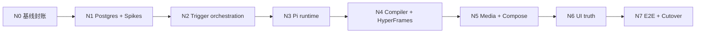

# CodeVideoCanvas Refactor v3 Task Breakdown

## 0. 账本合同

本文件是 Refactor v3 N0–N7 的**唯一状态账本**。Product Spec 定义产品行为，
Architecture Spec 定义技术合同，Harness 定义施工协议，各 Track Issue 定义详细
RED→GREEN 步骤；只有本文件维护 Track/Task 的当前状态、依赖、完成勾选、commit 与
evidence 索引。

详细步骤不得复制进本文件。任何 Task 开工前完整读取对应 Issue；任何 Task 完成后，只在
本文件勾选该 Task 并附真实 commit/evidence。Issue 中的 checkbox 是执行步骤，不是另一份
状态汇总。

**初始状态快照：** 全部 Task 的 `task_state=todo` 且 checkbox 未勾选；N0
`status=ready`；N1–N7 `status=blocked`，原因是前序 Track 退出门尚未完成。

---

## 1. 强制读取顺序

每次 Codex Goal 开始必须按顺序完整读取：

1. `AGENTS.md`
2. `docs/specs/2026-07-24-refactor-v3-product-spec.md`
3. `docs/specs/2026-07-24-refactor-v3-architecture-spec.md`
4. `docs/specs/2026-07-24-refactor-v3-codex-harness.md`
5. 本文件中当前 Track 的状态、依赖、Task 与验收 owner
6. `docs/issues/refactor-v3/issue-n<track>-<name>.md`
7. 当前 Task 明列的源码、测试、ADR、设计源与前序 evidence

活动规范冲突时登记 `DOC-CONFLICT` 并停止受影响施工；禁止按日期、篇幅或个人偏好自行
裁决。

---

## 2. 状态定义与更新规则

### 2.1 Track 状态

| 状态 | 含义 | 允许动作 |
|---|---|---|
| `blocked` | 前置 Track、外部服务或权威合同门禁未满足 | 只做只读核验和 blocker 记录 |
| `ready` | 前置退出门均有证据，Master Goal 可进入该 Track | 运行 Track preflight 后转 `in_progress` |
| `in_progress` | Master Goal 正在本 Track 按 Task 顺序施工 | 逐 Task RED→GREEN→commit |
| `done` | 全 Task 完成且 Tier B/专项门禁通过 | 冻结完成条件与 evidence |
| `superseded` | 已有 ADR/新账本项明确取代 | 保留历史，不复用 Task ID |

### 2.2 Task 状态

| 表示 | 含义 |
|---|---|
| `- [ ] ... task_state=todo; status=ready` | 未开始，Track 级前置已满足 |
| `- [ ] ... task_state=todo; status=blocked` | 未开始，`blocked_by` 尚未完成 |
| `task_state=in_progress` | 正在施工；同一 Track 同时最多一个共享资源 Task |
| `- [x] ... task_state=done` | 完成；必须同列 commit SHA 与 evidence 路径 |
| `task_state=blocked` | 已开工后遇到 Harness 定义的真实阻塞 |
| `task_state=superseded` | 被明确的新 Task/ADR 取代，保留原记录 |

`status=ready|blocked` 是本初始快照的可开工映射；`task_state` 是 Harness 生命周期。
不得仅凭 Issue 勾选、agent 报告或“测试应当通过”写 `done`。

### 2.3 完成更新

完成一个 Task 时必须在同一次本地文档阶段：

1. 将对应 checkbox 改为 `[x]`；
2. 写 `task_state=done`；
3. 写精确 commit SHA；
4. 写 evidence 文件与执行命令/退出码；
5. 保持后续 Task 的 `blocked_by` 与 Track 状态同步；
6. 不改写已完成 Task 的历史完成条件。

---

## 3. Track 当前状态

| Track | 当前状态 | Blocked by | 阶段范围 | 详细 Issue |
|---|---|---|---|---|
| N0 | `done` | 无 | 基线封账与止血 | [`issue-n0-baseline-and-bleeding-fixes.md`](../issues/refactor-v3/issue-n0-baseline-and-bleeding-fixes.md) |
| N1 | `in_progress` | 无 | Postgres 地基与 Spike | [`issue-n1-postgres-foundation-and-spikes.md`](../issues/refactor-v3/issue-n1-postgres-foundation-and-spikes.md) |
| N2 | `blocked` | N1 | Trigger 接管执行 | [`issue-n2-trigger-orchestration.md`](../issues/refactor-v3/issue-n2-trigger-orchestration.md) |
| N3 | `blocked` | N2 | Pi structured runtime | [`issue-n3-pi-agent-runtime.md`](../issues/refactor-v3/issue-n3-pi-agent-runtime.md) |
| N4 | `blocked` | N3 | Source/compiler/HyperFrames | [`issue-n4-artifact-compiler-hyperframes.md`](../issues/refactor-v3/issue-n4-artifact-compiler-hyperframes.md) |
| N5 | `blocked` | N4 | 媒体与合成闭环 | [`issue-n5-compose-closure.md`](../issues/refactor-v3/issue-n5-compose-closure.md) |
| N6 | `blocked` | N5 | UI 真实性与代码治理 | [`issue-n6-ui-truth-and-governance.md`](../issues/refactor-v3/issue-n6-ui-truth-and-governance.md) |
| N7 | `blocked` | N6 | 全链路证据与清退 | [`issue-n7-e2e-and-cutover.md`](../issues/refactor-v3/issue-n7-e2e-and-cutover.md) |

一次 Master Goal 覆盖 N0–N7；本表每行是该 Goal 内部的顺序阶段与 checkpoint，不是
独立 Goal。顺序固定为 N0→N1→N2→N3→N4→N5→N6→N7。Track 内可按冲突矩阵并行
无共享写入的 Task，但不得跨 Track 跳过依赖；公共 contracts 始终单 writer。

---

## 4. 依赖 DAG



关键生产链合同固定为：

```text
AiTaskRuntime
  → ShotSourcePackageV1
  → CvcCompositionBundleV1
  → RenderableBundleDescriptorV1
  → RenderReceiptV1
```

Trigger Shot 执行边固定为：

```text
cvc.pipeline.run → cvc.project.plan → cvc.shot.generate
cvc.shot.generate → cvc.shot.media
cvc.shot.generate → cvc.shot.render → cvc.shot.qa
cvc.shot.media + cvc.shot.qa → cvc.project.compose
```

---

## 5. 物理冲突与串行资源

以下表是多代理/并行施工的硬门。出现同一行的两个 writer 时必须串行；公共合同由先完成
者提交，后续 Task 只消费。

| 资源/路径 | Writer Track | 冲突规则 |
|---|---|---|
| Product/Architecture/Harness/Task Breakdown | 规范 owner；各 Track 仅更新自身账本行 | 绝对串行；架构变化先 ADR |
| `package.json`、`pnpm-lock.yaml` | N1–N5、N7 明确依赖 Task | 绝对串行；只用 pnpm 修改 lockfile |
| `src/lib/db/schema/**`、tracked migrations | N1；N2 只消费；N7 只验证 | N1 独占 |
| `trigger.config.ts`、`trigger/**` task IDs/queues/streams/tags | N1 Spike、N2 正式实现、N7 验收 | N1 Spike 完成后 N2 独占；N7 不改 DAG |
| `packages/contracts/src/**` | N2 run、N3 ai、N4 source/composition、N5 media | 逐合同文件串行；禁止 deep import |
| `src/features/pipeline/**`、receipt/attempt/status | N1 repository、N2 orchestration、N6 client adapter | N2 完成服务合同后 N6 只消费公开 DTO |
| `src/features/ai/**`、ModelPolicy、Pi runner | N3 | N3 独占；N7 只做 regression 修复 |
| `packages/video-compiler/**`、source/gates/bundle | N4 | N4 独占；N7 只锁版本/验收 |
| `src/features/render/**`、HyperFrames provider | N4、N5 workspace、N7 legacy cleanup | N4→N5→N7 串行 |
| `src/features/compose/**`、media manifests | N5 | N5 独占；N7 只验收 |
| `docs/designs/canvas.pen` | N6 | Pencil editor + Pencil MCP 独占，禁止 shell 访问 |
| `src/app/playbook/registry.ts` | N6 | 单 writer，symbol 完成后再登记 |
| `src/app/(app)/canvas/**`、Inspector/RunControl | N6 | N6 UI Task 内按 N6.3→N6.5→N6.7 串行 |
| `docs/evidence/refactor-v3/n7/**`、release scripts | N7 | N7 root/integration owner 独占 |
| Git stage/commit | 当前 Goal 根代理 | 子代理不得并行 stage/commit |

---

## 6. Task 状态映射

本节只保存 Task 标题、状态、依赖与详细卡链接。实现文件、RED/GREEN 命令、禁止项、
退出门和 commit 命令以链接的 Issue 为准。

### Track N0 — Baseline and bleeding fixes

- [x] **N0.1 冻结 Demo v1 权威、建立 v3 workflowVersion 与基线证据** —
  `task_state=done; status=ready; blocked_by=none; commit=1a604b5`;
  evidence=初始 Node 22 隔离基线冻结于 commit `1a604b5` 中的
  `docs/evidence/refactor-v3/n0-baseline.json`（Task 文件 SHA-256 与主工作树一致；
  lint/typecheck/build 退出 0，79 files / 352 tests 与脱敏对抗测试通过；绝对路径/
  已知 secret/U+FFFD 扫描为 0；用户既有 Node 24 dev server 未中断）；当前同路径由
  N0.5 最终重捕获为 Node 24.15.0 / pnpm 9.15.0，初始证据仍可从 commit 历史复核；
  随后出现的 `.qoder/repowiki/**` 并发 WIP 未读取、未修改、未 stage，Task 精确路径
  `diff --check` 通过;
  [details](../issues/refactor-v3/issue-n0-baseline-and-bleeding-fixes.md#task-n01)
- [x] **N0.2 修复 Pi Tool 参数与 result details 提取** —
  `task_state=done; status=ready; blocked_by=none; commit=21c78fa`;
  evidence=Node 22 focused regression（5 files / 41 tests）、typecheck 与 lint 通过；
  录制 transcript 证明 Tool 参数精确复原、失败 Tool 不回退、历史 session 不串用，
  thinking 未进入 artifact/display/JSONL；`@openai/agents*` 与 U+FFFD 扫描为 0，
  `new Agent(` 仅位于既有 Pi 封装；并发 `.qoder/repowiki/**` WIP 未读取、未修改、未 stage;
  [details](../issues/refactor-v3/issue-n0-baseline-and-bleeding-fixes.md#task-n02)
- [x] **N0.3 把 source/runtime 合同检查前移到 render enqueue** —
  `task_state=done; status=ready; blocked_by=none; commit=339bc0f; scope_doc=1cc940c`;
  evidence=Node 22 纯逻辑 5 files / 35 tests、typecheck、lint 通过；Node 24 原生
  focused 6 files / 47 tests 与真实 renderer integration 通过；Render→Director fallback、
  U+FFFD 与新增 `any` 扫描均为 0；历史 441 行 repository 已真实拆为 309/149 行。
  主树原生模块由用户 Node 24 dev server 使用，隔离副本同步又被环境配额拒绝，故
  Node 22 SQLite/Playwright 组合门禁保留到 N0 Track closeout 复核；并发
  `.qoder/repowiki/**` WIP 未读取、未修改、未 stage;
  [details](../issues/refactor-v3/issue-n0-baseline-and-bleeding-fixes.md#task-n03)
- [x] **N0.4 修复 API 结果丢弃与 UI 假进度** —
  `task_state=done; status=ready; blocked_by=none; commit=acf4089`;
  evidence=Node 22 focused 3 files / 15 tests、typecheck、lint 通过；pipeline
  partial failure 与 start/stop 真实返回值已映射为反馈，单节点 jobId 仅以本地
  `info/已入队` 展示并由刷新后的服务端节点状态接管；QueueStatusBar 只由
  `completed/active/failed/total` 派生，固定 cache、百分比、自动保存、U+FFFD 与
  `rightLabel` 扫描均为 0；独立只读终审 PASS；并发 `.qoder/repowiki/**` WIP
  未读取、未修改、未 stage;
  [details](../issues/refactor-v3/issue-n0-baseline-and-bleeding-fixes.md#task-n04)
- [x] **N0.5 建立 import、文件长度与 UTF-8 基线报告** —
  `task_state=done; status=ready; blocked_by=none; commit=eb1328f; scope_doc=c67b29c; conflict_resolution=bade79a`;
  evidence=`docs/evidence/refactor-v3/n0-baseline.json`（Node 24.15.0 /
  pnpm 9.15.0 最终捕获，lint/typecheck/test/build 全部 exit 0，85 files /
  411 tests）；Node 22 focused architecture gate 1 file / 15 tests、
  `pnpm verify:v3`、typecheck 与定向 lint 通过；v3 report 扫描 2910 files，
  Agents SDK package/import、U+FFFD、Trigger task forbidden import 均为 0；
  冻结 ordinary `openai` 3、Canvas forbidden import 23、历史超限文件 4，均不得
  增长；普通 `openai` 未被误判，非字面量模块加载与 `npm:` alias 绕过均 fail-closed；
  独立只读终审 PASS；Node 24 dev server PID 44452 保持可用，用户
  `.qoder/repowiki/**` WIP 未读取、未修改、未 stage;
  [details](../issues/refactor-v3/issue-n0-baseline-and-bleeding-fixes.md#task-n05)

**Track N0 closeout:** `docs/evidence/refactor-v3/n0/closeout.md`；Tier B 与专项门禁
通过，Node 22/24、fixture/live、API/像素/媒体边界和冻结债务已显式记录。

### Track N1 — Postgres foundation and spikes

- [x] **N1.1 SQLite Online Backup、quick_check、计数与 hash 证据** —
  `task_state=done; status=ready; blocked_by=none; commit=4798cf3; preflight=c880dff; scope_doc=91b9161`;
  evidence=`docs/evidence/refactor-v3/n1/sqlite-backup.md`；Node 24 focused 1 file /
  3 tests、定向 lint、typecheck、`pnpm verify:v3` 全部 exit 0；真实活动 WAL
  Online Backup 的 `quick_check=ok`，六表 count 为 `6/85/88/34/58/1`，
  snapshot SHA 与独立 `Get-FileHash` 一致且为 ReadOnly；源 DB/WAL SHA 前后不变，
  第二次固定调用按预期拒绝且 snapshot/report 实体未变化；文件复制、源库写入、
  U+FFFD 与越界 staged path 扫描均为 0；最终只读审计 PASS；
  [details](../issues/refactor-v3/issue-n1-postgres-foundation-and-spikes.md#task-n11)
- [x] **N1.2 Docker Postgres、Drizzle schema、约束与 tracked migration** —
  `task_state=done; status=ready; blocked_by=none; commit=513bb1d; preflight=636fb9b; scope_doc=2976bdf`;
  evidence=`docs/evidence/refactor-v3/n1/postgres-health.md`,
  `docs/evidence/refactor-v3/n1/fresh-migration.md`,
  `docs/evidence/refactor-v3/n1/constraint-matrix.md`；精确 `postgres@3.4.9`、
  Docker Postgres 17.5 healthy/loopback、final fresh + repeat migration、
  12 表/23 FK/31 CHECK/13 UNIQUE/immutable trigger、PG 2 files / 10 tests、
  runtime unit 2 files / 8 tests、全量 88 files / 422 tests、lint/typecheck/build/
  `verify:v3` 与独立终审均 PASS；
  [details](../issues/refactor-v3/issue-n1-postgres-foundation-and-spikes.md#task-n12)
- [x] **N1.3 repository async 化与逐域 Postgres cutover** —
  `task_state=done; status=ready; blocked_by=none; commit=18a7fda; preflight=b746b86; scope_doc=6407479`;
  evidence=`docs/evidence/refactor-v3/n1/postgres-repository-cutover.md`；异步 PG
  repository 已覆盖 Canvas/artifact/audio/Director/render/AI/settings/legacy
  queue；真实 PG 14 files / 69 tests、常规 81 files / 371 tests、lint/typecheck、
  CLI credential envelope import、diff/UTF-8/secret/import-boundary/runtime SQLite
  扫描全部 PASS；旧 attempt、跨 workspace queue 饥饿与 audio 并发补偿均有 PG/并发
  负测；浏览器/视觉 E2E 按用户要求留到 N7；
  [details](../issues/refactor-v3/issue-n1-postgres-foundation-and-spikes.md#task-n13)
- [x] **N1.4 SQLite export、Postgres import 与计数/hash 对账** —
  `task_state=done; status=ready; blocked_by=none; commit=cf7b36f; preflight=53b4520`;
  evidence=`docs/evidence/refactor-v3/n1/import-reconciliation.md`；真实只读 SQLite
  export 272 行并导入 312 个活动 PG target，重复 import 为
  `inserted=0/replayed=true`；六表 PK/row hash、missing/extra/unresolved、
  strict target/content mismatch 均为 0；focused 2 files / 10 tests、PG 3 files /
  13 tests、完整 PG 16 files / 77 tests、lint/typecheck、函数/文件长度、UTF-8、
  secret、绝对机器路径与 staged scope 门禁通过；
  [details](../issues/refactor-v3/issue-n1-postgres-foundation-and-spikes.md#task-n14)
- [ ] **N1.5 Trigger Realtime、Pi terminal Tool、HyperFrames CLI 三项 Spike** —
  `task_state=in_progress; status=blocked; blocked_by=external-trigger-auth; checkpoint=3a94299; preflight=513bb1d`;
  evidence=`docs/evidence/refactor-v3/n1-spikes.json` 与
  `docs/evidence/refactor-v3/n1/trigger-realtime.md`；真实 Pi terminal Tool 与
  HyperFrames doctor/check/5 snapshots/render/ffprobe/decode 均通过；Trigger
  `cvc.pipeline.run`、typed stream 与真实 probe 已实现并通过静态门禁，但本机无
  Trigger.dev 登录态、project ref 或 server key，浏览器亦无已认证会话，故未生成
  run ID、未伪造通过，`--verify-evidence` 正确以 `TRIGGER_PASSED_INVALID` 失败；
  [details](../issues/refactor-v3/issue-n1-postgres-foundation-and-spikes.md#task-n15)
- [ ] **N1.6 移除 runtime SQLite，仅保留只读 migration 工具** —
  `task_state=in_progress; status=blocked; blocked_by=N1.5; execution_override=user-authorized-independent-progress`;
  N1.5 外部 Trigger 认证阻塞期间，按用户无人值守指令只推进不依赖真实 Trigger
  run 的 SQLite 清退实现与 focused gate；N1.6 exit、N1 Tier B 与账本完成状态仍须
  等 N1.5 live Realtime 证据后关闭；
  [details](../issues/refactor-v3/issue-n1-postgres-foundation-and-spikes.md#task-n16)

### Track N2 — Trigger orchestration

- [ ] **N2.1 Trigger config、queues、tags 与 typed streams** —
  `task_state=todo; status=blocked; blocked_by=N1`;
  [details](../issues/refactor-v3/issue-n2-trigger-orchestration.md#task-n21)
- [ ] **N2.2 七类 Trigger task 与统一 TaskResult** —
  `task_state=todo; status=blocked; blocked_by=N1`;
  [details](../issues/refactor-v3/issue-n2-trigger-orchestration.md#task-n22)
- [ ] **N2.3 DAG、checkpoint、global idempotency、receipt 与 attempt fence** —
  `task_state=todo; status=blocked; blocked_by=N1`;
  [details](../issues/refactor-v3/issue-n2-trigger-orchestration.md#task-n23)
- [ ] **N2.4 start/cancel/retry API 与 scoped Realtime token** —
  `task_state=todo; status=blocked; blocked_by=N1`;
  [details](../issues/refactor-v3/issue-n2-trigger-orchestration.md#task-n24)
- [ ] **N2.5 ProjectRunSnapshotV1 与 Snapshot/Realtime 对账 hook** —
  `task_state=todo; status=blocked; blocked_by=N1`;
  [details](../issues/refactor-v3/issue-n2-trigger-orchestration.md#task-n25)
- [ ] **N2.6 删除进程内 queue、stream 与旧 instrumentation startup** —
  `task_state=todo; status=blocked; blocked_by=N1`;
  [details](../issues/refactor-v3/issue-n2-trigger-orchestration.md#task-n26)

### Track N3 — Pi Agent structured runtime

- [ ] **N3.1 建立 AiTaskKind、typed contracts、ModelPolicy 与 ProviderRegistry** —
  `task_state=todo; status=blocked; blocked_by=N2`;
  [details](../issues/refactor-v3/issue-n3-pi-agent-runtime.md#task-n31)
- [ ] **N3.2 实现 PiStructuredRunner、单 terminal Tool、有界 safe trace 与 cancellation** —
  `task_state=todo; status=blocked; blocked_by=N2`;
  [details](../issues/refactor-v3/issue-n3-pi-agent-runtime.md#task-n32)
- [ ] **N3.3 迁移 project plan 与双 invocation shot-generate checkpoint** —
  `task_state=todo; status=blocked; blocked_by=N2`;
  [details](../issues/refactor-v3/issue-n3-pi-agent-runtime.md#task-n33)
- [ ] **N3.4 迁移 vision QA 到 structured runtime** —
  `task_state=todo; status=blocked; blocked_by=N2`;
  [details](../issues/refactor-v3/issue-n3-pi-agent-runtime.md#task-n34)
- [ ] **N3.5 设置页编辑 ModelPolicy 并证明实际 provider/model** —
  `task_state=todo; status=blocked; blocked_by=N2`;
  [details](../issues/refactor-v3/issue-n3-pi-agent-runtime.md#task-n35)
- [ ] **N3.6 将 Pi 纳入 production dependency 并完成 provider smoke** —
  `task_state=todo; status=blocked; blocked_by=N2`;
  [details](../issues/refactor-v3/issue-n3-pi-agent-runtime.md#task-n36)

### Track N4 — Source, compiler and HyperFrames

- [ ] **N4.1 browser-safe extractor 与唯一 SourceNormalizer** —
  `task_state=todo; status=blocked; blocked_by=N3`;
  [details](../issues/refactor-v3/issue-n4-artifact-compiler-hyperframes.md#task-n41)
- [ ] **N4.2 ShotSourcePackageV1、Patch 与 G1–G5** —
  `task_state=todo; status=blocked; blocked_by=N3`;
  [details](../issues/refactor-v3/issue-n4-artifact-compiler-hyperframes.md#task-n42)
- [ ] **N4.3 packages/video-compiler 纯编译边界** —
  `task_state=todo; status=blocked; blocked_by=N3`;
  [details](../issues/refactor-v3/issue-n4-artifact-compiler-hyperframes.md#task-n43)
- [ ] **N4.4 CvcCompositionBundleV1、RenderableBundleDescriptorV1、canonical hash 与 provenance** —
  `task_state=todo; status=blocked; blocked_by=N3`;
  [details](../issues/refactor-v3/issue-n4-artifact-compiler-hyperframes.md#task-n44)
- [ ] **N4.5 HyperFrames CLI provider 与 G6–G10** —
  `task_state=todo; status=blocked; blocked_by=N3`;
  [details](../issues/refactor-v3/issue-n4-artifact-compiler-hyperframes.md#task-n45)
- [ ] **N4.6 legacy parity/fallback 并默认切换 HyperFrames** —
  `task_state=todo; status=blocked; blocked_by=N3`;
  [details](../issues/refactor-v3/issue-n4-artifact-compiler-hyperframes.md#task-n46)

### Track N5 — Media and compose closure

- [ ] **N5.1 版本化 audio、subtitle 与 media manifest** —
  `task_state=todo; status=blocked; blocked_by=N4`;
  [details](../issues/refactor-v3/issue-n5-compose-closure.md#task-n51)
- [ ] **N5.2 MediaProviderPolicy/Registry、TTS/ASR、音频对齐与字幕构建** —
  `task_state=todo; status=blocked; blocked_by=N4`;
  [details](../issues/refactor-v3/issue-n5-compose-closure.md#task-n52)
- [ ] **N5.3 SFX/BGM/voice mix 与 Shot concat** —
  `task_state=todo; status=blocked; blocked_by=N4`;
  [details](../issues/refactor-v3/issue-n5-compose-closure.md#task-n53)
- [ ] **N5.4 final verify：流、时长、尺寸、非空帧与实体 hash** —
  `task_state=todo; status=blocked; blocked_by=N4`;
  [details](../issues/refactor-v3/issue-n5-compose-closure.md#task-n54)
- [ ] **N5.5 attempt workspace、取消与失败清理** —
  `task_state=todo; status=blocked; blocked_by=N4`;
  [details](../issues/refactor-v3/issue-n5-compose-closure.md#task-n55)
- [ ] **N5.6 artifact commit 与 Finalize 产品投影** —
  `task_state=todo; status=blocked; blocked_by=N4`;
  [details](../issues/refactor-v3/issue-n5-compose-closure.md#task-n56)

### Track N6 — UI truth and governance

- [ ] **N6.1 Pencil 真源与有界可复用 viewer** —
  `task_state=todo; status=blocked; blocked_by=N5`;
  [details](../issues/refactor-v3/issue-n6-ui-truth-and-governance.md#task-n61)
- [ ] **N6.2 Playbook 登记与真实 demo** —
  `task_state=todo; status=blocked; blocked_by=N5`;
  [details](../issues/refactor-v3/issue-n6-ui-truth-and-governance.md#task-n62)
- [ ] **N6.3 Snapshot + Realtime RunControl 与 PipelineStatusBar** —
  `task_state=todo; status=blocked; blocked_by=N5`;
  [details](../issues/refactor-v3/issue-n6-ui-truth-and-governance.md#task-n63)
- [ ] **N6.4 Inspector 数据、源码、门禁、执行四页签** —
  `task_state=todo; status=blocked; blocked_by=N5`;
  [details](../issues/refactor-v3/issue-n6-ui-truth-and-governance.md#task-n64)
- [ ] **N6.5 剧本导入与语义拆分 JSON 可视化** —
  `task_state=todo; status=blocked; blocked_by=N5`;
  [details](../issues/refactor-v3/issue-n6-ui-truth-and-governance.md#task-n65)
- [ ] **N6.6 九个热点文件拆分与自动治理** —
  `task_state=todo; status=blocked; blocked_by=N5`;
  [details](../issues/refactor-v3/issue-n6-ui-truth-and-governance.md#task-n66)
- [ ] **N6.7 清除假值、死控件与重复视觉原语** —
  `task_state=todo; status=blocked; blocked_by=N5`;
  [details](../issues/refactor-v3/issue-n6-ui-truth-and-governance.md#task-n67)

### Track N7 — E2E and cutover

- [ ] **N7.1 锁定 workflow、contract、schema、compiler 与 runtime 版本** —
  `task_state=todo; status=blocked; blocked_by=N6`;
  [details](../issues/refactor-v3/issue-n7-e2e-and-cutover.md#task-n71)
- [ ] **N7.2 真实本地基础设施与一次 live FABRICATE E2E** —
  `task_state=todo; status=blocked; blocked_by=N6`;
  [details](../issues/refactor-v3/issue-n7-e2e-and-cutover.md#task-n72)
- [ ] **N7.3 retry、cancel、crash、reconciler、幂等与状态所有权** —
  `task_state=todo; status=blocked; blocked_by=N6`;
  [details](../issues/refactor-v3/issue-n7-e2e-and-cutover.md#task-n73)
- [ ] **N7.4 跨 workspace、attempt workspace 与 generated-source sandbox** —
  `task_state=todo; status=blocked; blocked_by=N6`;
  [details](../issues/refactor-v3/issue-n7-e2e-and-cutover.md#task-n74)
- [ ] **N7.5 golden 像素、最终媒体与真实浏览器证据** —
  `task_state=todo; status=blocked; blocked_by=N6`;
  [details](../issues/refactor-v3/issue-n7-e2e-and-cutover.md#task-n75)
- [ ] **N7.6 最终清退、30 项复核与交付** —
  `task_state=todo; status=blocked; blocked_by=N6`;
  [details](../issues/refactor-v3/issue-n7-e2e-and-cutover.md#task-n76)

---

## 7. 三十项验收矩阵

完成定义：owner Task 勾选完成、对应命令退出 0、evidence 文件可读且包含
workflowVersion/commit/证据分类。N7.6 只复核，不替 owner Track 伪造前序 evidence。

| ID | 验收项 | Owner Task | 必需 evidence |
|---:|---|---|---|
| A01 | Docker Postgres healthcheck 成功 | N1.2 | `docs/evidence/refactor-v3/n1/postgres-health.md` + `docker compose ps` |
| A02 | fresh DB 全量 tracked migration 成功 | N1.2 | `docs/evidence/refactor-v3/n1/fresh-migration.md` |
| A03 | workspace 复合 FK 阻止跨租户引用 | N1.2 | `docs/evidence/refactor-v3/n1/constraint-matrix.md` |
| A04 | 同 receipt key/同 fingerprint 重放；不同 fingerprint 返回 409 | N1.3、N2.3 | repository/API test 与 `command-receipts.md` |
| A05 | SQLite Online Backup 可读，quick_check/计数/hash 通过 | N1.1 | `docs/evidence/refactor-v3/n1/sqlite-backup.md` |
| A06 | 旧 project/node/edge/job/artifact/settings 导入计数与 hash 对账 | N1.4 | `docs/evidence/refactor-v3/n1/import-reconciliation.md` |
| A07 | Trigger dev simple task 与 scoped Realtime 成功 | N1.5、N2.5 | run ID、token scope test、`trigger-realtime.md` |
| A08 | 活动 task 恰好七类，`generate → media + render` | N2.2、N2.3 | graph/source test 与 `trigger-graph.md` |
| A09 | 取消映射为业务 `cancelled` 并清理 attempt | N2.4 | integration test 与 `cancel.md` |
| A10 | stale attempt publish 被拒绝；retry 跳过同 fingerprint checkpoint | N2.3、N3.3 | attempt/checkpoint integration test |
| A11 | 旧 queue/stream runtime import 为 0 | N2.6 | prohibited import scan |
| A12 | LLM 选择只在 ModelPolicy；TTS/ASR 只在 MediaProviderPolicy | N3.1、N3.5、N5.2 | exhaustive policy/source test |
| A13 | 仅 PiStructuredRunner import Pi `Agent` | N3.2 | source scan |
| A14 | terminal Tool args/result details 是结构化产物 | N0.2、N3.2 | recorded transcript + schema test |
| A15 | safe trace 无 raw delta/参数/错误/reasoning；viewer depth/node/copy 有界 | N3.2、N6.1 | DTO test + browser DOM test |
| A16 | 仅四类 `AiTaskKind`，服务任务零 Agent | N3.1、N3.6 | exhaustive type/source test |
| A17 | full HTML 可唯一、确定性提取 fragments | N4.1 | normalizer success matrix |
| A18 | 明确四段代码可唯一、确定性提取 | N4.1 | fragment normalizer test |
| A19 | 多 JSON、未知 script、额外正文被拒绝 | N4.1、N4.2 | negative matrix |
| A20 | 跨 workspace/raw-key/bundle-root 逃逸及网络/eval/墙钟/rAF/random 均拒绝 | N4.2、N7.4 | store/sandbox/gate matrix |
| A21 | canonical manifest 不受输入枚举顺序影响，bundle hash 稳定；CVC bundle 通过共享 descriptor conformance | N4.4 | byte/hash determinism + descriptor conformance test |
| A22 | HyperFrames check 为 0 finding | N4.5 | pinned CLI log |
| A23 | 0/中/末/乱序 seek 可用 | N4.5 | snapshot report |
| A24 | 同帧双拍像素 SHA-256 相同 | N4.5、N7.5 | pixel hash report |
| A25 | Shot MP4 尺寸/时长/实体 hash 正确 | N4.5 | ffprobe + SHA report |
| A26 | Final MP4 视频/required 音频/字幕合同成立 | N5.4、N7.5 | ffprobe/decode/final hash |
| A27 | attempt/run/node 状态所有权唯一；UI 字段可追溯 Snapshot/artifact | N2.3、N6.3、N6.7 | state test + field-source matrix |
| A28 | 新组件严格 Pencil → Playbook → 页面 | N6.1、N6.2、N6.7 | symbol map + registry + browser evidence |
| A29 | 文件长度、单函数与跨域 import 门禁通过 | N0.5、N6.6、N7.6 | source governance report |
| A30 | workflowVersion 锚定的真实本地全链路 E2E 通过 | N7.1–N7.6 | `docs/evidence/refactor-v3/n7/delivery-report.md` |

---

## 8. Goal Prompt 参数合同

Refactor v3 只使用覆盖全部 Track 的 Master Goal。唯一完整 prompt 维护在
[Codex Harness §15](./2026-07-24-refactor-v3-codex-harness.md#15-master-goal-启动模板)；
不得复制后改成单 Track Goal。启动和恢复时由 Codex 现场解析以下参数：

| 参数 | 约束 |
|---|---|
| `GOAL_MODE` | 固定 `master` |
| `TRACK_RANGE` | 固定 `N0..N7`，严格顺序推进 |
| `BASELINE_BRANCH` | Master Goal 和每个 Track 开始时的当前真实 branch |
| `BASELINE_SHA` | Master Goal 和每个 Track 开始时现场读取的真实 HEAD |
| `CURRENT_TRACK` | 本账本首个未完成 Task 所属 Track；首次为 `N0` |
| `ISSUE_PATH` | 当前 Track 表中的精确 Issue 路径，每次 Track checkpoint 重取 |
| `EVIDENCE_ROOT` | `docs/evidence/refactor-v3/n0` 至 `n7`，按当前 Track 隔离 |
| `WORKTREE_SCOPE` | 当前 Task/Track 允许修改路径；不得用全 Goal 范围绕开卡片边界 |
| `PENCIL_DOCUMENT` | N6 固定 `docs/designs/canvas.pen`；其他 Track 固定 `not-applicable` |
| `REAL_AI_POLICY` | N1 为一次 Pi terminal-Tool spike；N3 为每已配置 provider 一次 Track smoke；N7 为一次 live FABRICATE；其他调用 fixture |
| `ALLOW_PUSH` | 固定 `false` |
| `COMMIT_EACH_TASK` | 固定 `true` |
| `AUTO_ADVANCE_TRACKS` | 固定 `true`；Track closeout 后在同一 Goal 继续 |

Master Goal 最低执行合同：

```text
GOAL_MODE=master
TRACK_RANGE=N0..N7
AUTO_ADVANCE_TRACKS=true
COMMIT_EACH_TASK=true
ALLOW_PUSH=false

执行 N0→N7 全部 48 个 Task。Track 是同一 Goal 内的阶段/checkpoint；每个 Track 完成
Tier B、专项门禁、账本与 closeout 后自动进入下一 Track。只从首个未完成 Task 恢复，
不重做已冻结工作。不得因单个 Track 完成、工作量大、测试慢或上下文压缩而结束 Goal。
只有 48 Task、N0–N7、Tier C、A01–A30 和最终 delivery report 全部成立才能 complete。
```

N6 额外开工条件：Pencil MCP
`get_editor_state(include_schema: true)` 必须证明 `PENCIL_DOCUMENT` 已在编辑器打开；失败
时保持 blocked，不改 `.pen`、Playbook、页面或账本。

N7 额外预算条件：`REAL_AI_POLICY` 强制 exactly one live FABRICATE；第二个 paid
invocation 必须在 provider 调用前被拒绝。

---

## 9. Requirement/Architecture/Task 追溯矩阵

本矩阵只做追溯索引；详细完成条件以 Product、Architecture 和 Issue 为准。

| Product requirement/scene | Architecture rule | Task | Acceptance |
|---|---|---|---|
| 架构决策总约束 | `ARCH-DEC-001..010` | N0.1、N1.6、N2.6、N3.6、N4.6、N5.6、N7.1、N7.6 | A08、A11、A13、A16、A30 |
| `PROD-FOUND-001..005`、`SCN-07` | `DATA-001..006`、`DATA-004A`、`TEST-002` | N0.1、N1.1–N1.6、N4.4、N5.5–N5.6、N7.3–N7.4、N7.6 | A01–A06、A20–A21、A30 |
| `PROD-PLAN-001..006` | `EXEC-DAG-001..005`、`CONTRACT-AI-001..005` | N0.2、N2.2–N2.3、N3.1–N3.3 | A08、A10、A14、A16 |
| `PROD-CANVAS-001..006` | `EXEC-STATE-001..003`、`CONTRACT-RUN-001..003` | N2.3–N2.5、N6.3–N6.5 | A09、A10、A27 |
| `PROD-AI-001..006` | `CONTRACT-AI-001..007` | N0.2、N3.1–N3.6、N6.1、N7.2 | A12–A16、A30 |
| `PROD-SHOT-001..010`、`SCN-02..04` | `CONTRACT-SOURCE-001..004`、`CONTRACT-GATE-001..002` | N0.3、N3.3、N4.1–N4.4 | A10、A17–A21 |
| `PROD-RENDER-001..006` | `CONTRACT-COMPILER-001..003`、`CONTRACT-HF-001..002`、`CONTRACT-RENDER-001` | N4.3–N4.6、N7.1、N7.5 | A21–A25、A30 |
| `PROD-MEDIA-001..005` | `CONTRACT-MEDIA-001..003`、`CONTRACT-ART-001..002` | N5.1–N5.6、N7.5 | A26、A30 |
| `PROD-QA-001..006`、`SCN-01` | `CONTRACT-GATE-001..002`、`TEST-005..007` | N3.4、N4.5、N5.4、N7.2、N7.5 | A22–A26、A30 |
| `PROD-RUN-001..007`、`SCN-05..06` | `EXEC-CMD-001..004`、`EXEC-TRIGGER-001..007` | N2.1–N2.6、N6.3、N7.3 | A04、A07–A11、A27、A30 |
| Trigger 集成验证 | `TEST-003` | N1.5、N2.1–N2.6、N7.3 | A07–A11、A30 |
| Provider 合同验证 | `TEST-004` | N1.5、N3.2–N3.6、N5.2、N7.2 | A12–A16、A30 |
| `PROD-UI-001..007`、`SCN-08` | `CONTRACT-AI-006`、`CONTRACT-RUN-001..003`、`TEST-006` | N0.4、N6.1–N6.7、N7.5 | A15、A27–A30 |
| `PROD-NFR-DET-*` | `SEC-003`、版本合同、`TEST-001`、`TEST-005` | N0.1、N4.2–N4.5、N7.1、N7.5 | A20–A25、A30 |
| `PROD-NFR-REC-*` | `EXEC-CMD-001..004`、`CONTRACT-ART-001` | N1.1–N1.4、N2.3、N5.5、N7.3 | A04–A06、A10、A30 |
| `PROD-NFR-SEC-*` | `SEC-001..003`、`CONTRACT-STORE-001` | N1.3、N3.2、N4.2、N7.4、N7.6 | A03、A15、A20、A30 |
| `PROD-NFR-PERF-*`、`PROD-NFR-A11Y-*` | `CONTRACT-RUN-002..003`、`TEST-006` | N6.1–N6.7、N7.5 | A27–A30 |
| PurpleInk 合并边界 | `CONTRACT-PINK-001..003` | N4.4、N7.1、N7.6 | A21、A30 |
| 文件与依赖治理 | `ARCH-MOD-001..005`、Harness §10–12 | N0.5、N2.6、N3.6、N6.6、N7.6 | A11、A13、A29、A30 |

---

## 10. 账本维护门禁

- [ ] 不在蓝图、Issue Index、delivery report 或 updates 维护第二套 current status。
- [ ] Track 开工前重新核验实际 branch/SHA/worktree，不沿用旧快照。
- [ ] 只勾选有 commit 和真实命令证据的 Task。
- [ ] 前序公开合同需要变化时先停工，按 ADR → Architecture → 本账本 → Issue 顺序处理。
- [ ] 不跨 Track 并行；Track 内并行工作必须无共享写入。公共 contract、`canvas.pen`、
  Playbook registry、schema、lockfile、Trigger config、账本与 Git commit 始终串行。
- [ ] 中文文件以 UTF-8 保存；每 Task/Track 完成扫描 U+FFFD。
- [ ] 真实 API 报告严格区分 transport、terminal Tool、业务 workflow 与 deterministic
  fixture；Key 原文不进入任何 evidence、commit、终端摘要或回复。
- [ ] 未经用户明确授权不 push、不创建 PR。
